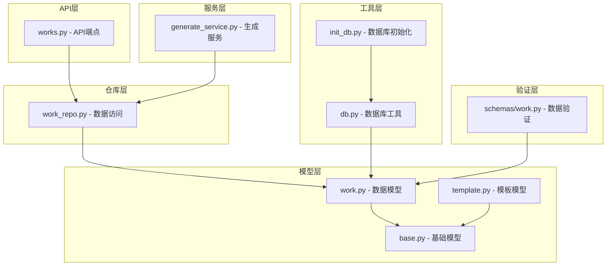
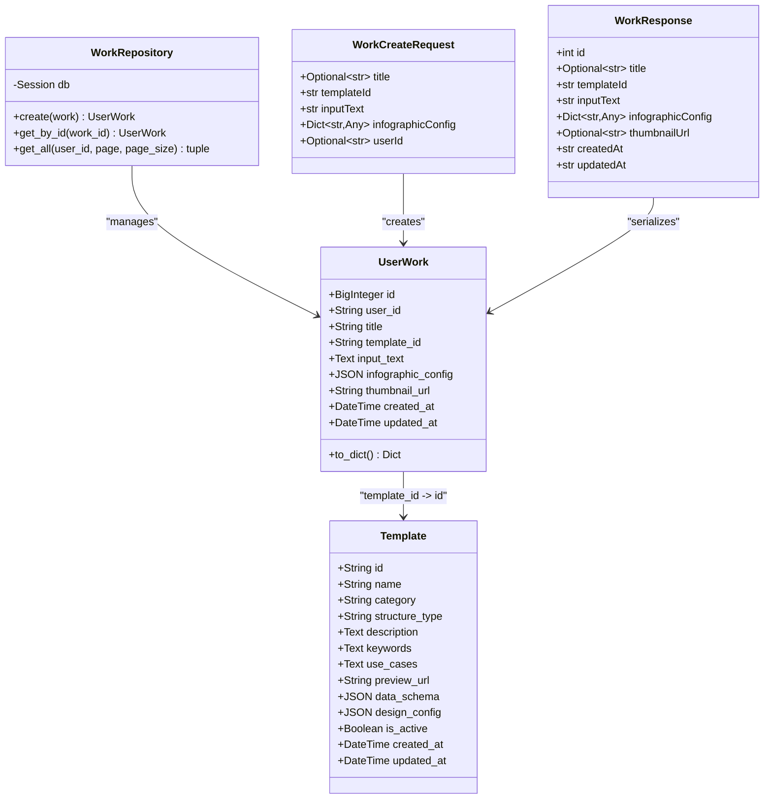
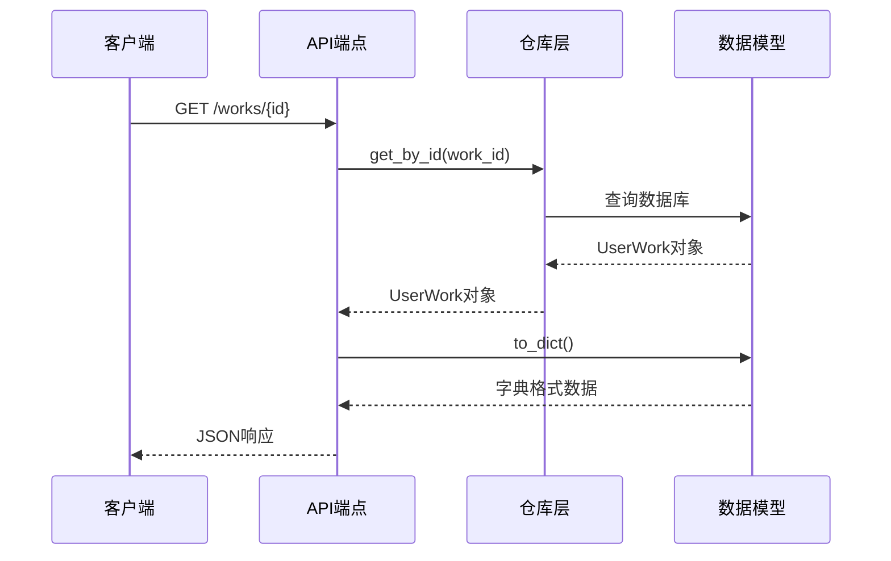
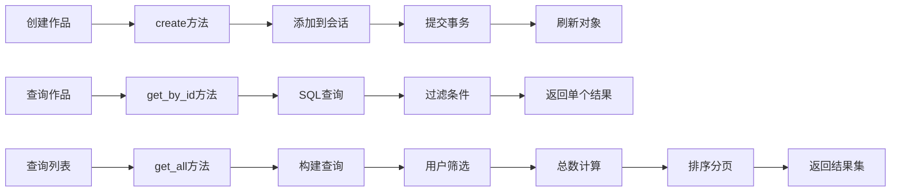
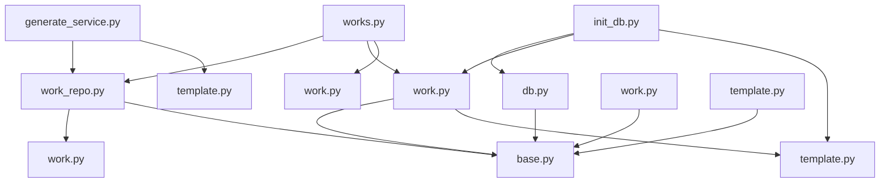
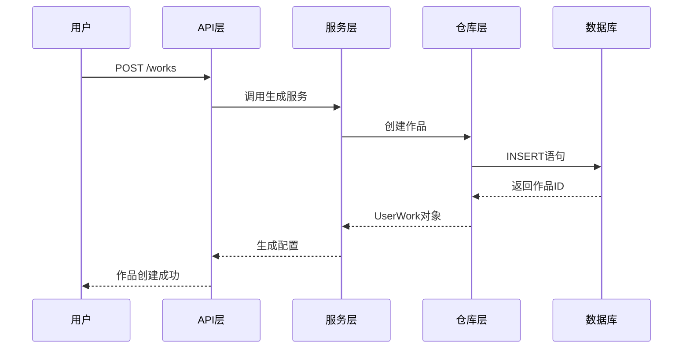

# 作品模型

<cite>
**本文档引用的文件**
- [work.py](file://backend/app/models/work.py)
- [work_repo.py](file://backend/app/repositories/work_repo.py)
- [work.py](file://backend/app/schemas/work.py)
- [works.py](file://backend/app/api/v1/works.py)
- [template.py](file://backend/app/models/template.py)
- [base.py](file://backend/app/models/base.py)
- [db.py](file://backend/app/utils/db.py)
- [init_db.py](file://backend/scripts/init_db.py)
- [generate_service.py](file://backend/app/services/generate_service.py)
</cite>

## 目录
1. [简介](#简介)
2. [项目结构](#项目结构)
3. [核心组件](#核心组件)
4. [架构概览](#架构概览)
5. [详细组件分析](#详细组件分析)
6. [数据库设计](#数据库设计)
7. [依赖关系分析](#依赖关系分析)
8. [性能考虑](#性能考虑)
9. [故障排除指南](#故障排除指南)
10. [结论](#结论)

## 简介

作品模型是信息图表生成系统的核心数据结构，负责存储和管理用户创作的信息图表作品。该模型采用基于SQLAlchemy的ORM设计，实现了完整的CRUD操作，并提供了与模板系统的深度集成。作品模型不仅存储了用户的基本创作信息，还包含了完整的配置数据，支持复杂的信息图表渲染和导出功能。

## 项目结构

作品模型相关的文件分布在多个层次中，形成了清晰的分层架构：



**图表来源**
- [works.py](file://backend/app/api/v1/works.py#L1-L106)
- [work_repo.py](file://backend/app/repositories/work_repo.py#L1-L82)
- [work.py](file://backend/app/models/work.py#L1-L37)

**章节来源**
- [works.py](file://backend/app/api/v1/works.py#L1-L106)
- [work_repo.py](file://backend/app/repositories/work_repo.py#L1-L82)
- [work.py](file://backend/app/models/work.py#L1-L37)

## 核心组件

作品模型系统由以下核心组件构成：

### 数据模型层
- **UserWork模型**：主要的数据实体，定义了作品的所有字段和关系
- **基础模型**：提供通用的ORM功能和元数据管理
- **模板关联**：通过外键建立与模板模型的多对一关系

### 数据访问层
- **WorkRepository**：封装数据库操作，提供统一的数据访问接口
- **数据库会话管理**：通过上下文管理器确保事务安全

### API层
- **RESTful端点**：提供作品的创建、查询、更新和删除功能
- **分页查询**：支持大规模数据集的高效查询
- **数据验证**：通过Pydantic模型确保数据完整性

**章节来源**
- [work.py](file://backend/app/models/work.py#L9-L37)
- [work_repo.py](file://backend/app/repositories/work_repo.py#L12-L82)
- [works.py](file://backend/app/api/v1/works.py#L15-L106)

## 架构概览

作品模型采用经典的三层架构设计，实现了关注点分离和高度的可维护性：



**图表来源**
- [work.py](file://backend/app/models/work.py#L9-L37)
- [work_repo.py](file://backend/app/repositories/work_repo.py#L12-L82)
- [work.py](file://backend/app/schemas/work.py#L8-L27)
- [template.py](file://backend/app/models/template.py#L9-L54)

## 详细组件分析

### UserWork模型详细分析

UserWork模型是作品系统的核心数据实体，定义了完整的作品信息结构：

#### 字段定义与业务含义

| 字段名 | 数据类型 | 约束条件 | 业务含义 |
|--------|----------|----------|----------|
| id | BigInteger | 主键，自增 | 作品的唯一标识符 |
| user_id | String(100) | 索引，可空 | 创建作品的用户标识 |
| title | String(200) | 可空 | 作品的显示标题 |
| template_id | String(100) | 外键，非空 | 关联的模板ID |
| input_text | Text | 非空 | 用户输入的原始文本内容 |
| infographic_config | JSON | 非空 | 完整的Infographic配置数据 |
| thumbnail_url | String(500) | 可空 | 作品的缩略图URL |
| created_at | DateTime | 默认当前时间 | 作品创建时间戳 |
| updated_at | DateTime | 默认当前时间，自动更新 | 作品最后修改时间戳 |

#### 数据类型与约束分析

```mermaid
flowchart TD
A[字段验证] --> B{数据类型检查}
B --> |id| C[BigInteger<br/>主键约束]
B --> |user_id| D[String(100)<br/>索引优化]
B --> |title| E[String(200)<br/>可空]
B --> |template_id| F[String(100)<br/>外键约束]
B --> |input_text| G[Text<br/>非空验证]
B --> |infographic_config| H[JSON<br/>非空验证]
B --> |thumbnail_url| I[String(500)<br/>可空]
B --> |created_at| J[DateTime<br/>默认值]
B --> |updated_at| K[DateTime<br/>自动更新]
F --> L[与Template表关联]
H --> M[复杂配置存储]
D --> N[查询性能优化]
```

**图表来源**
- [work.py](file://backend/app/models/work.py#L14-L22)

#### 序列化方法实现

模型提供了to_dict()方法，用于将数据库对象转换为API响应格式：



**图表来源**
- [works.py](file://backend/app/api/v1/works.py#L82-L106)
- [work_repo.py](file://backend/app/repositories/work_repo.py#L39-L49)
- [work.py](file://backend/app/models/work.py#L24-L36)

**章节来源**
- [work.py](file://backend/app/models/work.py#L9-L37)

### WorkRepository仓库层分析

WorkRepository提供了完整的数据访问功能，封装了所有数据库操作：

#### CRUD操作实现



**图表来源**
- [work_repo.py](file://backend/app/repositories/work_repo.py#L24-L81)

#### 分页查询机制

分页查询支持高效的大型数据集处理：

| 参数 | 类型 | 默认值 | 说明 |
|------|------|--------|------|
| user_id | Optional[str] | None | 用户ID筛选条件 |
| page | int | 1 | 当前页码（从1开始） |
| page_size | int | 20 | 每页记录数 |

查询逻辑包含：
1. **条件筛选**：根据用户ID过滤作品
2. **总数计算**：使用count()方法获取总记录数
3. **排序规则**：按创建时间降序排列
4. **分页处理**：使用offset和limit实现分页

**章节来源**
- [work_repo.py](file://backend/app/repositories/work_repo.py#L12-L82)

### API端点分析

API层提供了完整的RESTful接口，支持作品的全生命周期管理：

#### 端点功能概览

```mermaid
graph TD
A[作品API] --> B[POST /works]
A --> C[GET /works]
A --> D[GET /works/{id}]
B --> E[创建新作品]
C --> F[获取作品列表]
D --> G[获取作品详情]
E --> H[验证请求数据]
H --> I[创建UserWork对象]
I --> J[保存到数据库]
F --> K[分页查询]
K --> L[用户筛选]
G --> M[ID查询]
M --> N[返回作品详情]
```

**图表来源**
- [works.py](file://backend/app/api/v1/works.py#L15-L106)

#### 错误处理机制

API层实现了完善的错误处理：

- **HTTP异常处理**：统一的异常转换和错误消息
- **数据验证**：Pydantic模型确保输入数据的有效性
- **事务管理**：数据库操作的原子性和一致性保证

**章节来源**
- [works.py](file://backend/app/api/v1/works.py#L15-L106)

## 数据库设计

### 表结构设计

作品模型对应的数据库表结构如下：

```mermaid
erDiagram
user_works {
bigint id PK
varchar(100) user_id IDX
varchar(200) title
varchar(100) template_id FK
text input_text
json infographic_config
varchar(500) thumbnail_url
datetime created_at
datetime updated_at
}
templates {
varchar(100) id PK
varchar(200) name
varchar(500) preview_url
json data_schema
json design_config
boolean is_active
datetime created_at
datetime updated_at
}
user_works ||--|| templates : "template_id -> id"
```

**图表来源**
- [work.py](file://backend/app/models/work.py#L11-L22)
- [template.py](file://backend/app/models/template.py#L11-L28)

### 索引策略

数据库索引设计针对查询性能进行了优化：

| 索引类型 | 字段 | 用途 | 性能影响 |
|----------|------|------|----------|
| 主键索引 | id | 唯一标识 | O(log n)查找 |
| 单列索引 | user_id | 用户筛选 | O(log n)查询 |
| 复合索引 | category, sort_order | 模板分类查询 | O(log n)范围查询 |
| JSON索引 | infographic_config | 配置数据查询 | 部分支持 |

### 外键约束

作品模型与模板模型之间建立了严格的外键关系：

- **template_id字段**：指向templates表的id字段
- **级联行为**：当模板被删除时，相关作品保持不变
- **数据完整性**：确保作品必须关联有效的模板

### 数据类型优化

不同字段的数据类型选择考虑了以下因素：

- **BigInteger**：作品ID使用大整数类型，支持大量数据
- **JSON**：配置数据使用JSON类型，灵活存储复杂结构
- **Text**：原始输入使用Text类型，支持长文本存储
- **DateTime**：时间戳使用DateTime类型，精确到秒

**章节来源**
- [work.py](file://backend/app/models/work.py#L14-L22)
- [template.py](file://backend/app/models/template.py#L14-L28)

## 依赖关系分析

### 模块间依赖关系



**图表来源**
- [works.py](file://backend/app/api/v1/works.py#L1-L11)
- [work_repo.py](file://backend/app/repositories/work_repo.py#L1-L8)
- [work.py](file://backend/app/models/work.py#L1-L8)

### 循环依赖处理

系统通过以下方式避免循环依赖：

1. **接口分离**：定义清晰的接口边界
2. **延迟导入**：在函数内部导入模块
3. **依赖注入**：通过构造函数传递依赖

### 数据流分析

作品数据在系统中的流转过程：



**图表来源**
- [works.py](file://backend/app/api/v1/works.py#L15-L47)
- [generate_service.py](file://backend/app/services/generate_service.py#L47-L118)

**章节来源**
- [works.py](file://backend/app/api/v1/works.py#L1-L106)
- [work_repo.py](file://backend/app/repositories/work_repo.py#L1-L82)

## 性能考虑

### 查询优化策略

1. **索引利用**：合理使用索引提高查询效率
2. **分页处理**：避免一次性加载大量数据
3. **缓存机制**：对频繁访问的数据实施缓存
4. **连接池管理**：使用连接池减少数据库连接开销

### 存储优化

1. **JSON字段**：使用JSON类型存储配置数据，节省空间
2. **数据压缩**：对大文本字段实施压缩存储
3. **归档策略**：定期归档历史数据

### 并发处理

1. **事务隔离**：使用适当的事务隔离级别
2. **锁机制**：避免死锁和性能瓶颈
3. **异步处理**：对耗时操作实施异步处理

## 故障排除指南

### 常见问题及解决方案

#### 数据库连接问题

**症状**：无法连接到数据库
**原因**：数据库配置错误或服务未启动
**解决方案**：
1. 检查DATABASE_URL配置
2. 验证数据库服务状态
3. 确认网络连接

#### 外键约束错误

**症状**：插入作品时出现外键错误
**原因**：关联的模板不存在
**解决方案**：
1. 验证模板ID的有效性
2. 检查模板是否被禁用
3. 确认模板数据完整性

#### JSON数据格式错误

**症状**：配置数据存储失败
**原因**：JSON格式不正确
**解决方案**：
1. 验证JSON数据格式
2. 检查特殊字符转义
3. 确认数据结构符合要求

**章节来源**
- [db.py](file://backend/app/utils/db.py#L17-L55)
- [work_repo.py](file://backend/app/repositories/work_repo.py#L24-L37)

## 结论

作品模型系统通过精心设计的分层架构，实现了高效、可靠的信息图表作品管理功能。系统具备以下优势：

1. **数据完整性**：通过外键约束和数据验证确保数据质量
2. **性能优化**：合理的索引设计和查询优化策略
3. **可扩展性**：模块化设计支持功能扩展
4. **易维护性**：清晰的代码结构便于维护和升级

该模型为信息图表生成系统提供了坚实的数据基础，支持复杂的业务逻辑和高性能的数据操作。通过持续的优化和改进，系统能够满足不断增长的业务需求。