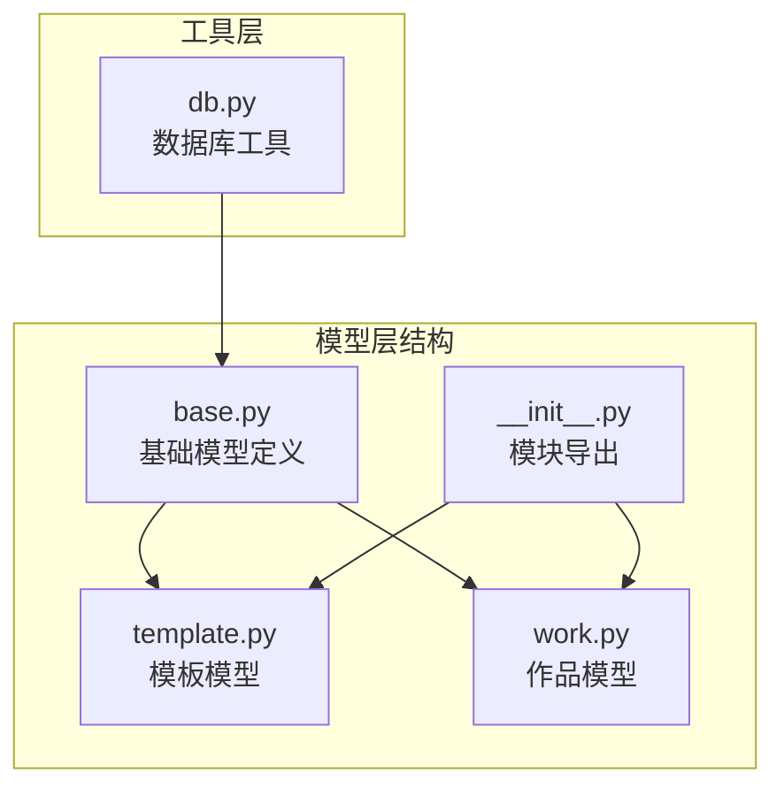
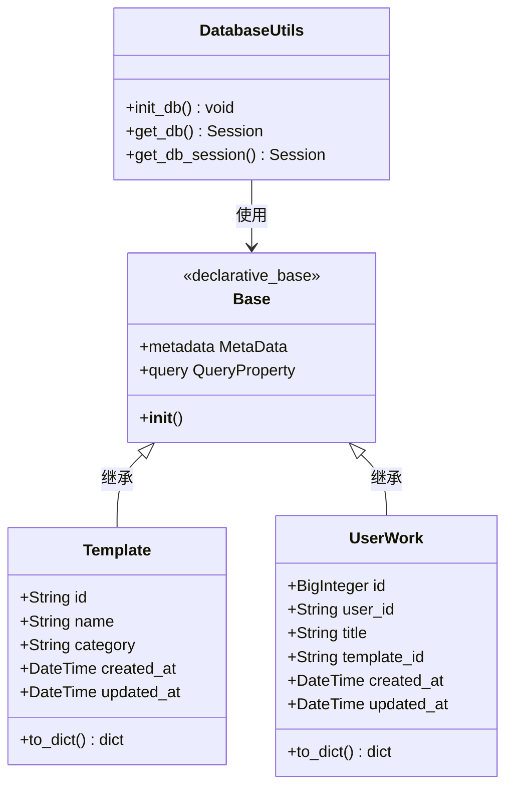
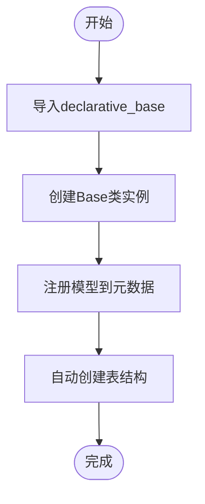
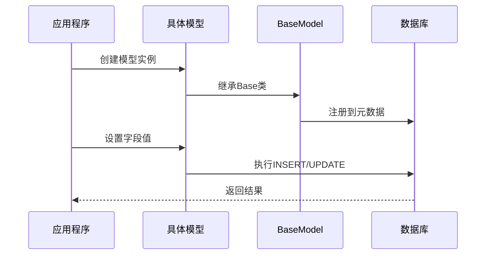
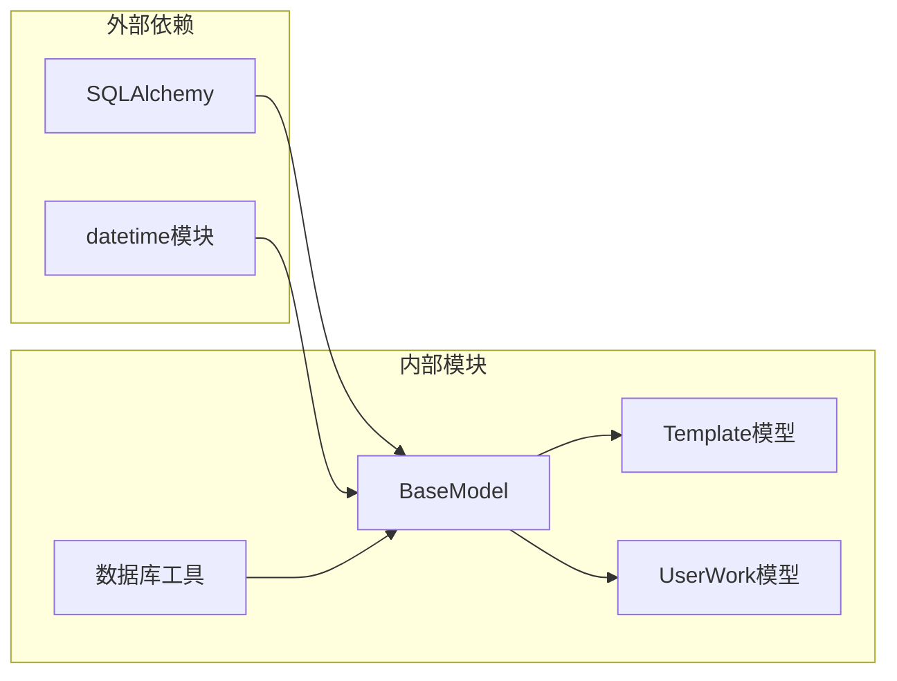

# 基础模型

<cite>
**本文档中引用的文件**
- [base.py](file://backend/app/models/base.py)
- [template.py](file://backend/app/models/template.py)
- [work.py](file://backend/app/models/work.py)
- [db.py](file://backend/app/utils/db.py)
- [__init__.py](file://backend/app/models/__init__.py)
</cite>

## 目录
1. [简介](#简介)
2. [项目结构](#项目结构)
3. [核心组件](#核心组件)
4. [架构概览](#架构概览)
5. [详细组件分析](#详细组件分析)
6. [依赖关系分析](#依赖关系分析)
7. [性能考虑](#性能考虑)
8. [故障排除指南](#故障排除指南)
9. [结论](#结论)

## 简介

BaseModel是本项目中所有ORM模型的抽象基类，它为数据库模型提供了统一的基础结构和通用功能。虽然其实现相对简洁，但通过SQLAlchemy的declarative_base()机制，它为整个应用提供了标准化的数据访问模式和审计字段管理。

该基础模型的设计理念是提供一个轻量级但功能完整的模型基类，确保所有继承的模型都具备一致的数据库交互能力和审计追踪功能。

## 项目结构

项目的模型层采用模块化设计，每个模型文件负责特定业务实体的数据映射：



**图表来源**
- [base.py](file://backend/app/models/base.py#L1-L7)
- [template.py](file://backend/app/models/template.py#L1-L54)
- [work.py](file://backend/app/models/work.py#L1-L37)

**章节来源**
- [base.py](file://backend/app/models/base.py#L1-L8)
- [__init__.py](file://backend/app/models/__init__.py#L1-L8)

## 核心组件

### BaseModel基础类

BaseModel通过SQLAlchemy的declarative_base()函数创建，这是一个轻量级的基础模型类，为所有数据库模型提供统一的继承基础。

### 审计字段系统

所有继承BaseModel的模型自动获得以下审计字段：
- **创建时间戳**：记录数据的创建时间
- **更新时间戳**：记录数据的最后修改时间
- **自增主键**：提供唯一的标识符

### 数据库元数据管理

BaseModel与SQLAlchemy的元数据系统集成，支持表结构的自动创建和维护。

**章节来源**
- [base.py](file://backend/app/models/base.py#L1-L8)
- [template.py](file://backend/app/models/template.py#L27-L28)
- [work.py](file://backend/app/models/work.py#L20-L21)

## 架构概览



**图表来源**
- [base.py](file://backend/app/models/base.py#L6-L7)
- [template.py](file://backend/app/models/template.py#L9-L54)
- [work.py](file://backend/app/models/work.py#L9-L37)
- [db.py](file://backend/app/utils/db.py#L42-L94)

## 详细组件分析

### BaseModel实现分析

BaseModel的实现极其简洁，仅包含一个SQLAlchemy的declarative_base()实例：



**图表来源**
- [base.py](file://backend/app/models/base.py#L4-L7)
- [db.py](file://backend/app/utils/db.py#L42-L55)

### 时间戳字段管理

BaseModel通过SQLAlchemy的Column定义实现了自动时间戳管理：

#### 创建时间戳
- **字段类型**：DateTime
- **默认值**：datetime.utcnow
- **用途**：记录数据的创建时间
- **特点**：只在创建时设置，后续不会更新

#### 更新时间戳
- **字段类型**：DateTime
- **默认值**：datetime.utcnow
- **更新策略**：onupdate=datetime.utcnow
- **用途**：记录数据的最后修改时间
- **特点**：每次更新操作都会自动更新

### 模型继承模式

所有具体模型都遵循相同的继承模式：



**图表来源**
- [template.py](file://backend/app/models/template.py#L9-L12)
- [work.py](file://backend/app/models/work.py#L9-L11)

**章节来源**
- [template.py](file://backend/app/models/template.py#L27-L28)
- [work.py](file://backend/app/models/work.py#L20-L21)

### UTC时区处理

BaseModel中的时间戳字段使用Python的datetime.utcnow()函数，确保：
- **时区标准化**：使用UTC时间避免时区混淆
- **一致性保证**：所有时间戳都基于同一时间标准
- **跨平台兼容**：不受本地时区设置影响

### 自动化管理机制

BaseModel通过SQLAlchemy的自动特性实现字段的自动化管理：

#### 主键自动生成
- **Template模型**：使用字符串ID
- **UserWork模型**：使用自增BigInteger
- **灵活性**：支持不同类型的主键策略

#### 表名自动推断
- **命名规则**：类名的小写形式
- **特殊情况**：可通过__tablename__属性自定义
- **约定优于配置**：简化开发流程

**章节来源**
- [template.py](file://backend/app/models/template.py#L14-L15)
- [work.py](file://backend/app/models/work.py#L14-L15)

## 依赖关系分析



**图表来源**
- [base.py](file://backend/app/models/base.py#L4-L5)
- [db.py](file://backend/app/utils/db.py#L42-L48)

### 模块间依赖

BaseModel作为核心基础设施，被多个业务模型依赖：
- **Template模型**：用于模板管理
- **UserWork模型**：用于用户作品管理
- **数据库工具**：用于数据库初始化和会话管理

### 版本兼容性

BaseModel的设计考虑了向后兼容性：
- **SQLAlchemy版本**：使用稳定的declarative_base API
- **Python版本**：依赖标准库datetime模块
- **迁移路径**：易于升级和扩展

**章节来源**
- [db.py](file://backend/app/utils/db.py#L42-L55)
- [__init__.py](file://backend/app/models/__init__.py#L4-L7)

## 性能考虑

### 数据库连接优化

BaseModel与数据库工具的集成提供了高效的连接管理：
- **连接池**：使用SQLAlchemy的连接池机制
- **会话管理**：提供自动化的会话生命周期管理
- **事务控制**：支持自动提交和回滚

### 查询性能

通过合理的字段设计和索引策略提升查询性能：
- **主键索引**：自动为主键字段创建索引
- **复合索引**：支持复杂查询条件的优化
- **字段选择**：提供to_dict()方法优化数据传输

### 内存使用

BaseModel的轻量级设计减少了内存占用：
- **延迟加载**：支持SQLAlchemy的延迟加载特性
- **对象缓存**：利用SQLAlchemy的对象状态管理
- **资源清理**：提供明确的资源释放机制

## 故障排除指南

### 常见问题及解决方案

#### 模型注册失败
**症状**：新创建的模型无法识别
**原因**：模型未在__init__.py中导入
**解决方案**：确保在__init__.py中添加模型导入

#### 时间戳不准确
**症状**：创建时间和更新时间不正确
**原因**：系统时钟或时区设置问题
**解决方案**：检查服务器时钟同步和时区配置

#### 数据库表创建失败
**症状**：init_db()函数抛出异常
**原因**：数据库权限或连接配置问题
**解决方案**：验证数据库连接字符串和权限设置

### 调试技巧

#### 启用SQLAlchemy日志
```python
# 在配置中设置DEBUG_MODE=True
settings.DEBUG_MODE = True
```

#### 验证模型继承
```python
# 检查模型是否正确继承Base
assert issubclass(ModelClass, Base)
```

**章节来源**
- [db.py](file://backend/app/utils/db.py#L42-L55)
- [__init__.py](file://backend/app/models/__init__.py#L4-L7)

## 结论

BaseModel作为本项目的核心基础设施，虽然实现简洁，但功能完整且设计合理。它通过SQLAlchemy的declarative_base()机制提供了强大的ORM功能，同时保持了良好的可扩展性和维护性。

### 主要优势

1. **统一性**：为所有模型提供一致的基础结构
2. **自动化**：自动处理时间戳和主键管理
3. **可扩展性**：支持灵活的字段定义和关系映射
4. **性能优化**：集成SQLAlchemy的最佳实践

### 最佳实践建议

1. **字段设计**：遵循命名规范，使用适当的字段类型
2. **索引策略**：为常用查询字段创建索引
3. **错误处理**：实现完善的异常处理机制
4. **测试覆盖**：为模型编写全面的单元测试

BaseModel的设计体现了现代ORM框架的最佳实践，为构建可靠、可维护的数据库应用程序奠定了坚实的基础。