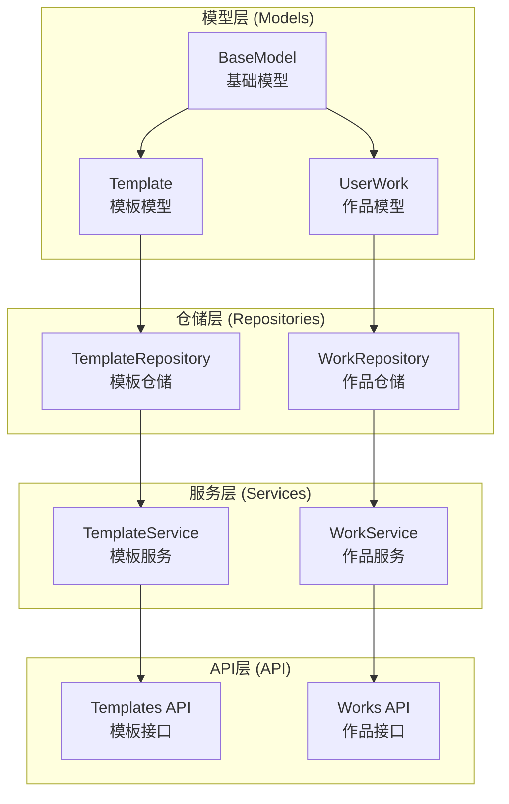
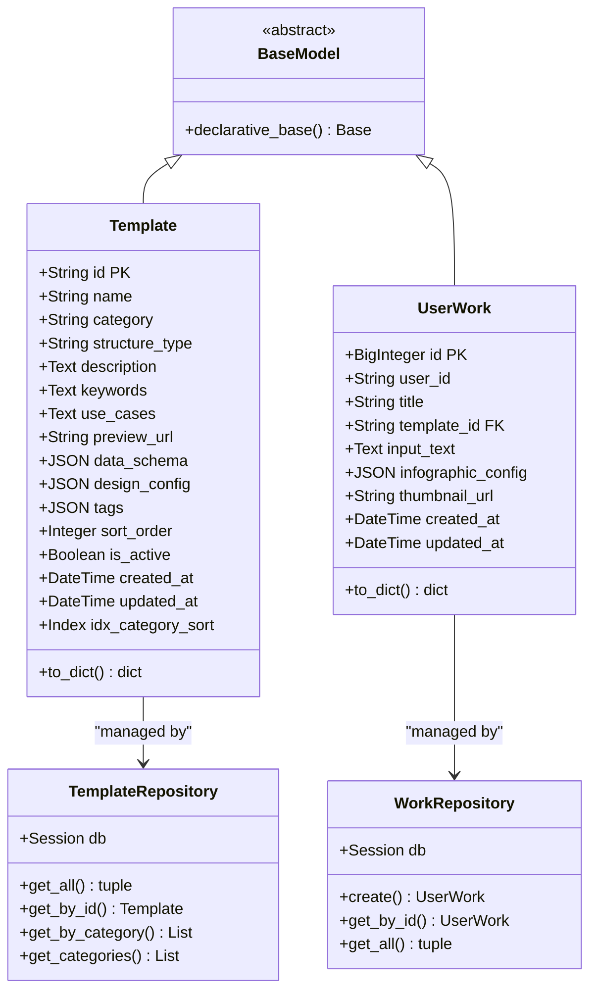
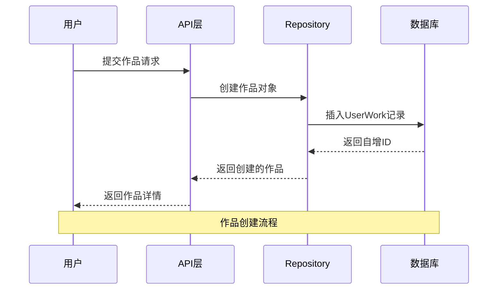
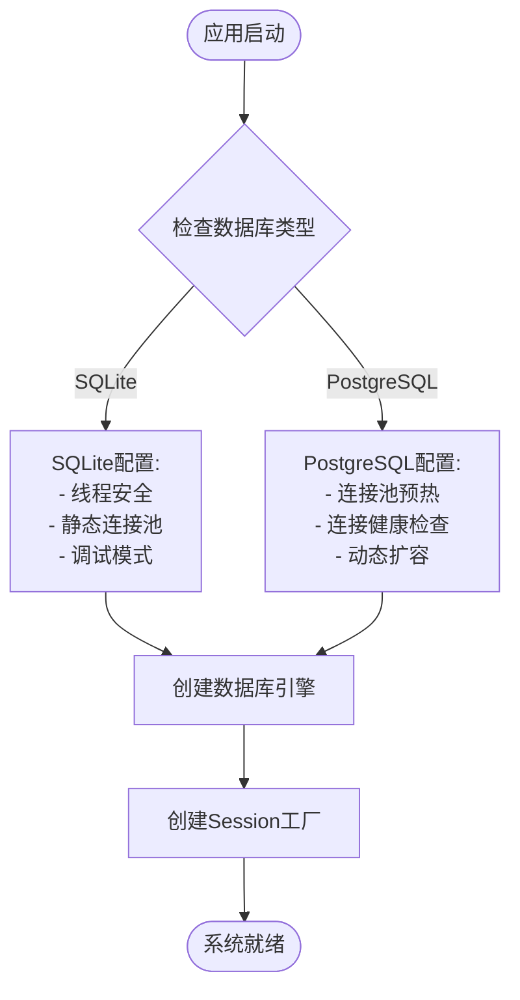
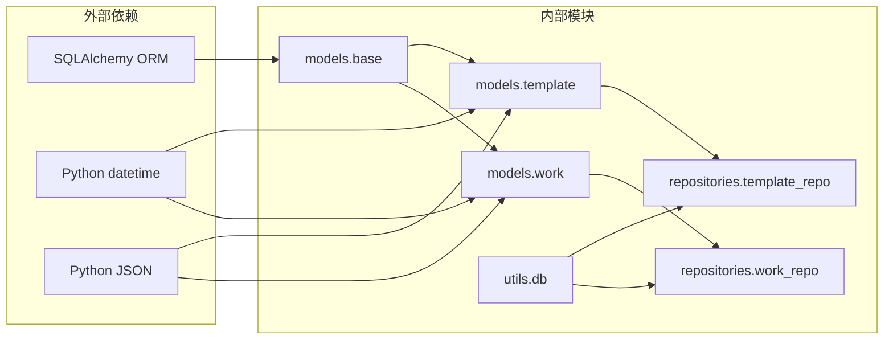

# 数据库模型文档

<cite>
**本文档引用的文件**
- [base.py](file://backend/app/models/base.py)
- [template.py](file://backend/app/models/template.py)
- [work.py](file://backend/app/models/work.py)
- [__init__.py](file://backend/app/models/__init__.py)
- [template_repo.py](file://backend/app/repositories/template_repo.py)
- [work_repo.py](file://backend/app/repositories/work_repo.py)
- [db.py](file://backend/app/utils/db.py)
- [templates.py](file://backend/app/api/v1/templates.py)
- [works.py](file://backend/app/api/v1/works.py)
</cite>

## 目录
1. [简介](#简介)
2. [项目结构](#项目结构)
3. [核心组件](#核心组件)
4. [架构概览](#架构概览)
5. [详细组件分析](#详细组件分析)
6. [依赖关系分析](#依赖关系分析)
7. [性能考虑](#性能考虑)
8. [故障排除指南](#故障排除指南)
9. [结论](#结论)

## 简介

本文档详细介绍了基于SQLAlchemy ORM的数据库模型系统，专注于Template（模板）和Work（作品）两个核心实体的设计与实现。该系统采用现代化的分层架构，通过声明式映射实现了强类型的数据持久化方案，支持复杂的查询操作和事务管理。

## 项目结构

数据库模型系统采用清晰的分层架构，主要包含以下核心模块：



**图表来源**
- [base.py](file://backend/app/models/base.py#L1-L8)
- [template.py](file://backend/app/models/template.py#L1-L54)
- [work.py](file://backend/app/models/work.py#L1-L37)

**章节来源**
- [base.py](file://backend/app/models/base.py#L1-L8)
- [template.py](file://backend/app/models/template.py#L1-L54)
- [work.py](file://backend/app/models/work.py#L1-L37)

## 核心组件

### BaseModel基础模型

BaseModel作为所有数据库模型的基类，提供了统一的继承机制和通用字段：

- **继承机制**：使用SQLAlchemy的declarative_base()创建共享的基础类
- **通用字段**：自动包含id、创建时间和更新时间字段
- **元数据管理**：负责表结构的元数据注册和维护

### Template模板模型

Template模型代表信息图模板的核心实体，包含丰富的结构化数据：

- **唯一标识**：String(100)类型的主键，确保模板的唯一性
- **分类体系**：支持7种分类（chart、comparison、hierarchy、list、quadrant、relationship、sequence）
- **结构类型**：AntV结构类型映射，支持不同的布局模式
- **JSON配置**：存储复杂的数据结构和设计配置
- **索引优化**：复合索引提升查询性能

### UserWork作品模型

UserWork模型记录用户创作的信息图作品：

- **自增主键**：BigInteger类型的自动增长ID
- **用户关联**：可选的用户标识字段
- **模板引用**：外键关联到Template模型
- **配置存储**：完整的Infographic配置JSON存储
- **时间戳**：自动化的创建和更新时间跟踪

**章节来源**
- [base.py](file://backend/app/models/base.py#L1-L8)
- [template.py](file://backend/app/models/template.py#L8-L54)
- [work.py](file://backend/app/models/work.py#L8-L37)

## 架构概览

数据库模型系统采用三层架构模式，实现了清晰的关注点分离：



**图表来源**
- [base.py](file://backend/app/models/base.py#L7-L7)
- [template.py](file://backend/app/models/template.py#L8-L54)
- [work.py](file://backend/app/models/work.py#L8-L37)
- [template_repo.py](file://backend/app/repositories/template_repo.py#L13-L144)
- [work_repo.py](file://backend/app/repositories/work_repo.py#L12-L82)

## 详细组件分析

### Template模型详细分析

Template模型是系统的核心实体，设计了完整的模板管理体系：

#### 字段定义与约束

| 字段名 | 数据类型 | 约束条件 | 描述 |
|--------|----------|----------|------|
| id | String(100) | 主键，非空 | 模板唯一标识符 |
| name | String(200) | 非空 | 模板中文名称 |
| category | String(50) | 非空，带索引 | 分类标识（7类之一） |
| structure_type | String(100) | 可空，带索引 | AntV结构类型 |
| description | Text | 可空 | 模板功能描述 |
| keywords | Text | 可空 | 关键词列表 |
| use_cases | Text | 可空 | 适用场景说明 |
| preview_url | String(500) | 可空 | 预览图片URL |
| data_schema | JSON | 非空 | 数据结构Schema |
| design_config | JSON | 非空 | AntV设计配置 |
| tags | JSON | 可空 | 标签数组 |
| sort_order | Integer | 默认0 | 排序权重 |
| is_active | Boolean | 默认True | 启用状态 |
| created_at | DateTime | 默认当前时间 | 创建时间 |
| updated_at | DateTime | 自动更新 | 更新时间 |

#### 索引配置

```mermaid
erDiagram
TEMPLATE {
string id PK
string name
string category
string structure_type
text description
text keywords
text use_cases
string preview_url
json data_schema
json design_config
json tags
integer sort_order
boolean is_active
datetime created_at
datetime updated_at
}
TEMPLATE ||--o{ WORK : "uses"
INDEX idx_category_sort ON TEMPLATE (category, sort_order)
```

**图表来源**
- [template.py](file://backend/app/models/template.py#L14-L28)
- [template.py](file://backend/app/models/template.py#L31-L33)

#### 查询优化策略

TemplateRepository实现了多种查询优化策略：

- **分页查询**：支持大数据集的高效分页
- **复合过滤**：Category、Keyword、Active状态的组合筛选
- **全文搜索**：在name、description、use_cases字段上实现模糊匹配
- **排序优化**：优先按sort_order降序，再按创建时间降序排列

**章节来源**
- [template.py](file://backend/app/models/template.py#L8-L54)
- [template_repo.py](file://backend/app/repositories/template_repo.py#L25-L72)

### UserWork模型详细分析

UserWork模型实现了用户作品的完整生命周期管理：

#### 字段关系映射



**图表来源**
- [work.py](file://backend/app/models/work.py#L14-L22)
- [works.py](file://backend/app/api/v1/works.py#L25-L40)

#### 外键关联与级联策略

虽然当前实现中没有显式的级联删除配置，但通过Repository层实现了逻辑上的关联管理：

- **模板引用**：template_id字段建立了与Template的外键关联
- **用户关联**：user_id字段支持可选的用户身份识别
- **配置存储**：infographic_config字段存储完整的配置信息

#### 事务管理

Repository层提供了完整的事务管理机制：

- **自动提交**：成功操作后自动提交事务
- **异常回滚**：捕获异常时自动回滚操作
- **资源清理**：确保数据库连接的正确关闭

**章节来源**
- [work.py](file://backend/app/models/work.py#L8-L37)
- [work_repo.py](file://backend/app/repositories/work_repo.py#L24-L37)

### 数据库连接与会话管理

#### 连接池配置

系统采用了智能的数据库连接池配置策略：



**图表来源**
- [db.py](file://backend/app/utils/db.py#L18-L36)

#### 上下文管理

系统提供了两种会话管理模式：

- **上下文管理器**：自动处理事务提交和异常回滚
- **手动会话管理**：适用于复杂事务场景的细粒度控制

**章节来源**
- [db.py](file://backend/app/utils/db.py#L58-L94)

## 依赖关系分析

### 模型间依赖关系



**图表来源**
- [base.py](file://backend/app/models/base.py#L4-L4)
- [template.py](file://backend/app/models/template.py#L4-L6)
- [work.py](file://backend/app/models/work.py#L4-L6)

### 数据流分析

系统遵循标准的DDD（领域驱动设计）原则，实现了清晰的数据流向：

1. **API层**：接收HTTP请求，验证参数
2. **服务层**：业务逻辑处理，协调多个仓储
3. **仓储层**：数据访问抽象，ORM操作封装
4. **模型层**：数据结构定义，关系映射

**章节来源**
- [db.py](file://backend/app/utils/db.py#L42-L55)
- [template_repo.py](file://backend/app/repositories/template_repo.py#L13-L24)
- [work_repo.py](file://backend/app/repositories/work_repo.py#L12-L23)

## 性能考虑

### 查询优化策略

1. **索引设计**：
   - 单字段索引：category、structure_type字段
   - 复合索引：idx_category_sort（category, sort_order）

2. **查询优化**：
   - 分页查询避免全表扫描
   - 条件过滤减少数据传输
   - 排序字段使用索引加速

3. **连接池优化**：
   - SQLite：静态连接池，适合开发环境
   - PostgreSQL：动态连接池，支持高并发

### 内存管理

- **会话管理**：及时释放数据库连接
- **对象缓存**：SQLAlchemy的会话级缓存机制
- **批量操作**：支持批量插入和更新

## 故障排除指南

### 常见问题与解决方案

#### 数据库连接问题

**症状**：应用启动时数据库连接失败
**原因**：数据库URL配置错误或数据库服务不可用
**解决方案**：
1. 检查DATABASE_URL配置
2. 验证数据库服务状态
3. 确认网络连接

#### 模型同步问题

**症状**：新添加的字段无法映射到数据库
**原因**：数据库表结构未同步模型变更
**解决方案**：
1. 运行数据库迁移脚本
2. 手动执行DDL语句
3. 重新初始化数据库

#### 查询性能问题

**症状**：复杂查询响应缓慢
**原因**：缺少适当的索引或查询条件不当
**解决方案**：
1. 分析查询执行计划
2. 添加必要的索引
3. 优化查询条件

**章节来源**
- [db.py](file://backend/app/utils/db.py#L42-L55)
- [template_repo.py](file://backend/app/repositories/template_repo.py#L25-L72)

## 结论

本文档全面分析了基于SQLAlchemy ORM的数据库模型系统，展示了现代Web应用中数据持久化的最佳实践。系统通过清晰的分层架构、完善的索引策略和灵活的查询机制，实现了高性能、可维护的数据访问层。

### 主要优势

1. **类型安全**：强类型的Python模型定义
2. **性能优化**：合理的索引设计和查询策略
3. **可维护性**：清晰的分层架构和职责分离
4. **扩展性**：模块化设计支持功能扩展

### 改进建议

1. **添加生命周期钩子**：实现before_insert、after_update等事件处理
2. **完善级联策略**：明确定义模型间的级联删除规则
3. **增强事务管理**：支持更复杂的事务场景
4. **监控指标**：添加数据库性能监控和告警

该数据库模型系统为信息图生成平台提供了坚实的数据基础，支持高效的模板管理和作品存储，是现代Web应用数据层设计的优秀范例。