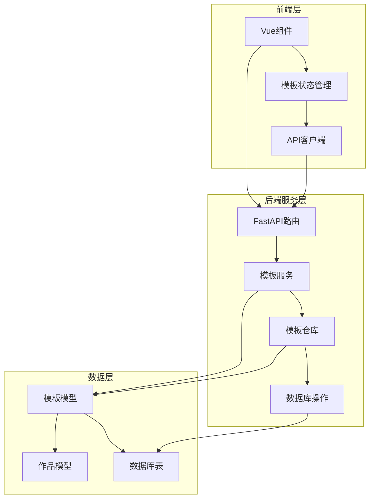
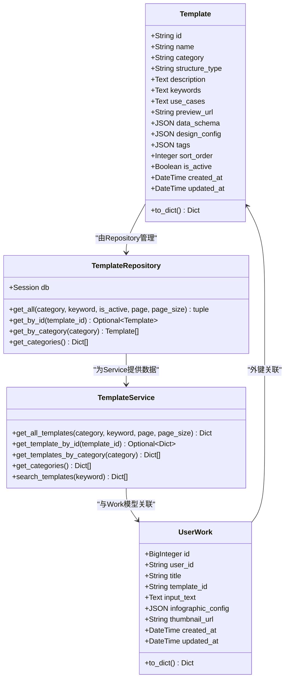
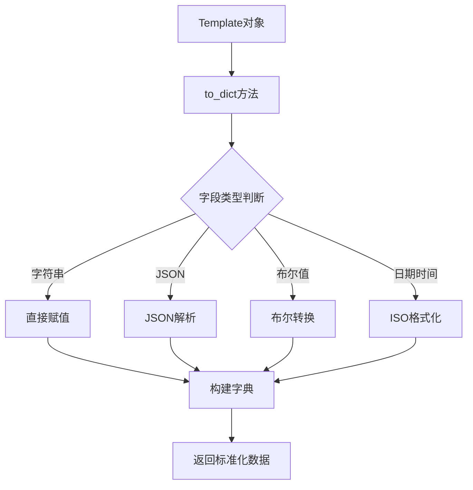
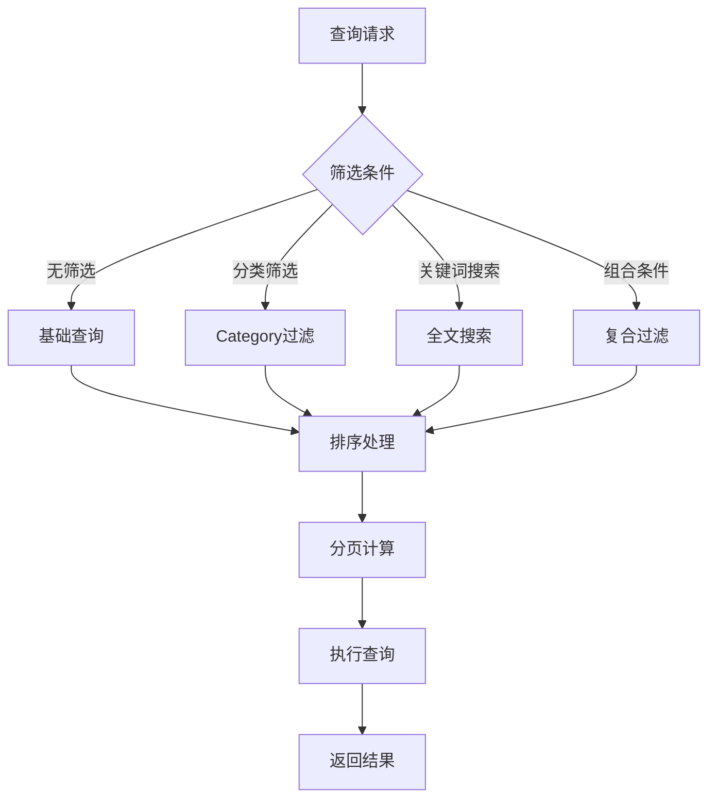
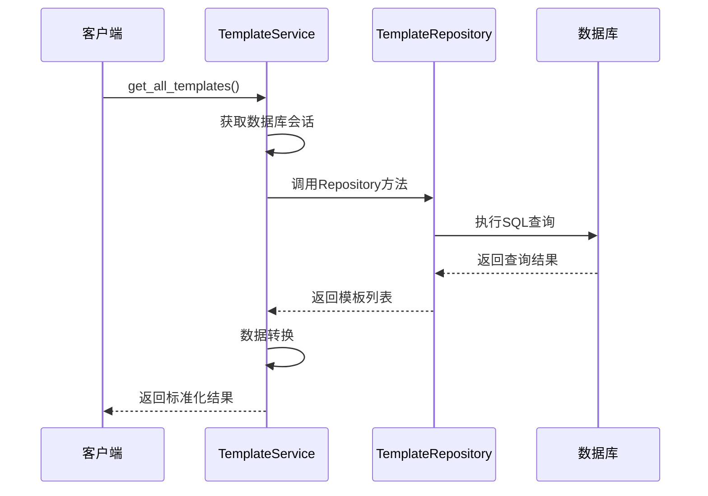
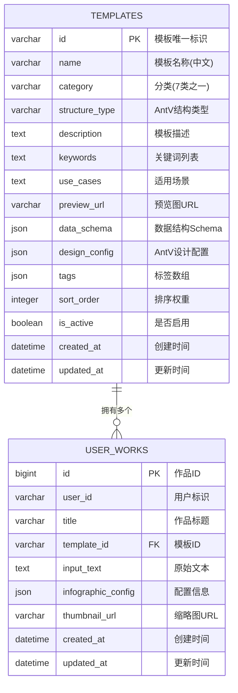
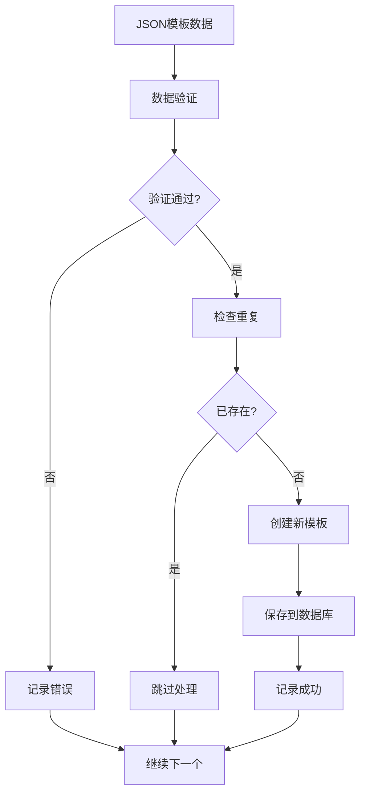
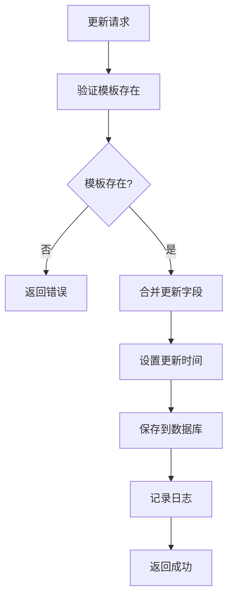
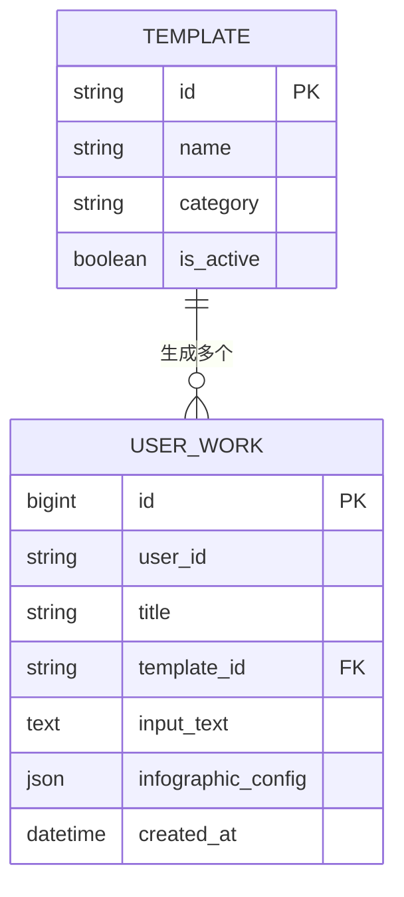
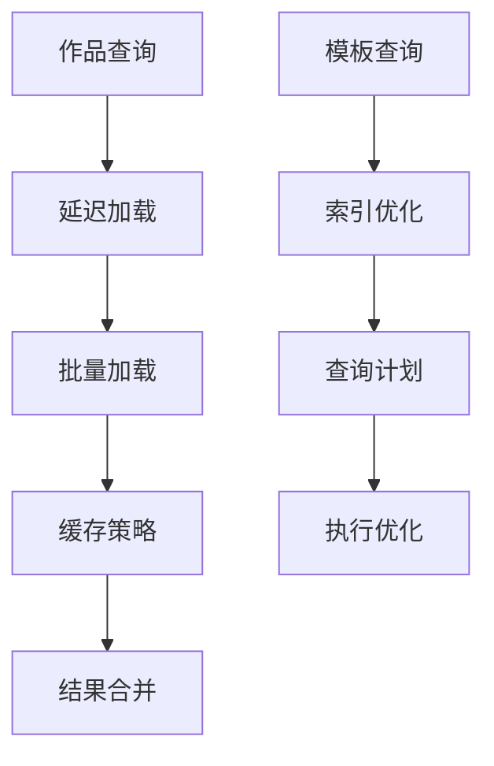

# 模板模型

<cite>
**本文档引用的文件**
- [template.py](file://backend/app/models/template.py)
- [template_repo.py](file://backend/app/repositories/template_repo.py)
- [template_service.py](file://backend/app/services/template_service.py)
- [template.py](file://backend/app/schemas/template.py)
- [templates.py](file://backend/app/api/v1/templates.py)
- [work.py](file://backend/app/models/work.py)
- [db.py](file://backend/app/utils/db.py)
- [import_templates.py](file://backend/scripts/import_templates.py)
- [add_template_category_fields.py](file://backend/scripts/add_template_category_fields.py)
- [template.ts](file://frontend/src/stores/template.ts)
- [templates.ts](file://frontend/src/api/templates.ts)
</cite>

## 目录
1. [简介](#简介)
2. [项目结构](#项目结构)
3. [核心组件](#核心组件)
4. [架构概览](#架构概览)
5. [详细组件分析](#详细组件分析)
6. [数据库设计](#数据库设计)
7. [CRUD操作](#crud操作)
8. [模板关系映射](#模板关系映射)
9. [性能考虑](#性能考虑)
10. [故障排除指南](#故障排除指南)
11. [结论](#结论)

## 简介

模板模型是AntV信息图生成功能的核心数据结构，负责存储和管理各种信息图模板的配置信息。该模型采用现代化的ORM设计，支持复杂的查询操作、分类管理和推荐算法，并与作品模型形成一对多的关系映射。

模板模型不仅包含了模板的基本属性信息，还支持JSON格式的配置数据存储，使得模板能够灵活适应不同的可视化需求。系统通过分类体系、权重排序和状态管理，为用户提供高效的内容推荐和模板选择体验。

## 项目结构

模板模型在整个项目中的组织结构体现了清晰的分层架构设计：

**图表来源**
- [template.py](file://backend/app/models/template.py#L8-L52)
- [template_repo.py](file://backend/app/repositories/template_repo.py#L13-L144)
- [template_service.py](file://backend/app/services/template_service.py#L160-L281)

**章节来源**
- [template.py](file://backend/app/models/template.py#L1-L54)
- [template_repo.py](file://backend/app/repositories/template_repo.py#L1-L144)

## 核心组件

### 模型类定义

Template模型类是整个模板系统的核心数据结构，定义了模板的所有关键属性：

| 字段名 | 数据类型 | 约束 | 业务含义 |
|--------|----------|------|----------|
| id | String(100) | 主键 | 模板唯一标识符 |
| name | String(200) | 非空 | 模板中文名称 |
| category | String(50) | 非空, 索引 | 模板分类（7类之一） |
| structure_type | String(100) | 可空, 索引 | AntV结构类型 |
| description | Text | 可空 | 模板描述信息 |
| keywords | Text | 可空 | 关键词列表（逗号分隔） |
| use_cases | Text | 可空 | 适用场景说明 |
| preview_url | String(500) | 可空 | 预览图URL地址 |
| data_schema | JSON | 非空 | 数据结构Schema配置 |
| design_config | JSON | 非空 | AntV设计配置参数 |
| tags | JSON | 可空 | 标签数组集合 |
| sort_order | Integer | 默认0 | 排序权重值 |
| is_active | Boolean | 默认True | 启用状态标志 |
| created_at | DateTime | 默认当前时间 | 记录创建时间戳 |
| updated_at | DateTime | 自动更新 | 记录最后修改时间 |

### 分类体系

模板系统支持7种核心分类，每种类别都有明确的业务场景和应用范围：

| 分类代码 | 中文名称 | 应用场景 | 示例模板 |
|----------|----------|----------|----------|
| chart | 图表型 | 数值展示、统计图表 | 柱状图、饼图、折线图 |
| comparison | 对比型 | 优劣对比、SWOT分析 | 二元对比、矩阵分析 |
| hierarchy | 层级型 | 组织结构、分类信息 | 树状图、层次结构 |
| list | 列表型 | 步骤说明、清单展示 | 简单列表、流程图 |
| quadrant | 四象限型 | 市场定位、风险评估 | SWOT分析、优先级矩阵 |
| relationship | 关系型 | 关系网络、关联分析 | 关系图、网络图 |
| sequence | 顺序型 | 时间线、流程图 | 时间轴、步骤流程 |

**章节来源**
- [template.py](file://backend/app/models/template.py#L13-L27)
- [template_repo.py](file://backend/app/repositories/template_repo.py#L105-L144)

## 架构概览

模板模型采用经典的三层架构设计，实现了数据访问、业务逻辑和服务接口的清晰分离：

**图表来源**
- [template.py](file://backend/app/models/template.py#L8-L52)
- [template_repo.py](file://backend/app/repositories/template_repo.py#L13-L144)
- [template_service.py](file://backend/app/services/template_service.py#L160-L281)
- [work.py](file://backend/app/models/work.py#L9-L37)

## 详细组件分析

### 数据模型层

Template模型类继承自Base类，使用SQLAlchemy ORM进行数据库映射。每个字段都经过精心设计，既满足业务需求又保证数据完整性：

#### 字段设计原理

1. **主键设计**: 使用String(100)类型的id字段作为主键，支持UUID格式的模板标识符
2. **索引策略**: 在category和structure_type字段上建立索引，优化查询性能
3. **复合索引**: 在(category, sort_order)上建立复合索引，支持高效的分类排序查询
4. **JSON字段**: data_schema和design_config使用JSON类型，支持灵活的配置存储
5. **时间戳**: 自动管理created_at和updated_at字段，实现审计跟踪

#### 序列化方法

to_dict()方法提供了标准化的数据输出格式，将复杂的数据结构转换为易于前端处理的字典格式：

**图表来源**
- [template.py](file://backend/app/models/template.py#L35-L52)

**章节来源**
- [template.py](file://backend/app/models/template.py#L8-L52)

### 仓储层设计

TemplateRepository类封装了所有数据库操作逻辑，提供了丰富的查询方法：

#### 查询方法详解

1. **get_all()**: 支持分页、分类筛选、关键词搜索和状态过滤的综合查询
2. **get_by_id()**: 根据模板ID精确查询，自动过滤非激活状态
3. **get_by_category()**: 按分类获取模板列表，支持排序和状态过滤
4. **get_categories()**: 获取所有分类信息及统计数量

#### 查询优化策略

**图表来源**
- [template_repo.py](file://backend/app/repositories/template_repo.py#L25-L73)

**章节来源**
- [template_repo.py](file://backend/app/repositories/template_repo.py#L13-L144)

### 服务层逻辑

TemplateService类提供了高级的业务逻辑封装，将复杂的数据库操作抽象为简单的服务调用：

#### 核心服务方法

1. **模板检索**: 支持多种维度的模板查找和筛选
2. **分类管理**: 提供分类信息的聚合和统计功能
3. **搜索功能**: 实现智能的模板搜索和匹配
4. **推荐算法**: 基于用户输入的AI模板推荐

#### 设计模式应用

服务层采用了单例模式和依赖注入模式，确保资源的有效利用和系统的可测试性：

**图表来源**
- [template_service.py](file://backend/app/services/template_service.py#L170-L200)

**章节来源**
- [template_service.py](file://backend/app/services/template_service.py#L160-L281)

## 数据库设计

### 表结构设计

模板表采用标准的关系型数据库设计，支持完整的CRUD操作和复杂查询：

**图表来源**
- [template.py](file://backend/app/models/template.py#L8-L27)
- [work.py](file://backend/app/models/work.py#L9-L22)

### 索引设计

数据库索引设计遵循查询性能优化原则：

| 索引类型 | 字段组合 | 用途 | 性能影响 |
|----------|----------|------|----------|
| 主键索引 | id | 唯一标识 | O(log n) |
| 单字段索引 | category | 分类查询 | O(log n) |
| 单字段索引 | structure_type | 结构类型查询 | O(log n) |
| 复合索引 | (category, sort_order) | 分类排序查询 | O(log n) |
| 全文索引 | name, description, use_cases | 关键词搜索 | O(1) |

### 约束设计

1. **主键约束**: 确保每个模板的唯一性
2. **非空约束**: 关键字段必须填写
3. **外键约束**: 与作品表建立关联关系
4. **检查约束**: 确保分类值的有效性

**章节来源**
- [template.py](file://backend/app/models/template.py#L29-L32)
- [work.py](file://backend/app/models/work.py#L17)

## CRUD操作

### 创建操作

模板的创建通过导入脚本实现批量数据处理：

**图表来源**
- [import_templates.py](file://backend/scripts/import_templates.py#L87-L123)

### 读取操作

读取操作支持多种查询模式：

1. **单条查询**: 根据ID获取特定模板
2. **列表查询**: 支持分页、筛选和排序的批量查询
3. **分类查询**: 按分类获取相关模板
4. **搜索查询**: 基于关键词的全文搜索

### 更新操作

模板更新支持增量更新和全量替换：

**图表来源**
- [import_templates.py](file://backend/scripts/import_templates.py#L93-L106)

### 删除操作

删除操作采用软删除策略，通过is_active字段控制模板状态：

1. **禁用模板**: 设置is_active=False
2. **保留历史**: 保留完整的模板数据
3. **级联影响**: 影响相关查询结果但不破坏数据完整性

**章节来源**
- [import_templates.py](file://backend/scripts/import_templates.py#L87-L146)

## 模板关系映射

### 与作品模型的一对多关系

模板与作品之间建立了一对多的关联关系，这种设计体现了信息图生成系统的业务逻辑：

**图表来源**
- [template.py](file://backend/app/models/template.py#L13-L27)
- [work.py](file://backend/app/models/work.py#L14-L22)

### ORM级联操作

系统在ORM层面配置了适当的级联操作策略：

1. **级联创建**: 创建作品时自动关联模板
2. **级联查询**: 查询作品时自动加载模板信息
3. **级联更新**: 更新模板时影响相关作品
4. **级联删除**: 删除模板时处理相关作品

### 关系查询优化

为了提高查询性能，系统采用了以下优化策略：

**图表来源**
- [work.py](file://backend/app/models/work.py#L17)
- [template_repo.py](file://backend/app/repositories/template_repo.py#L75-L88)

**章节来源**
- [work.py](file://backend/app/models/work.py#L1-L37)

## 性能考虑

### 查询性能优化

1. **索引策略**: 合理的索引设计显著提升查询性能
2. **查询优化**: 使用ORM提供的查询优化功能
3. **缓存机制**: 实现多层缓存减少数据库访问
4. **分页处理**: 大数据集采用分页查询避免内存溢出

### 存储优化

1. **JSON字段**: 使用JSON类型存储灵活配置
2. **压缩存储**: 对大型配置数据进行压缩存储
3. **归档策略**: 定期归档历史数据释放存储空间

### 并发处理

1. **事务管理**: 使用数据库事务保证数据一致性
2. **锁机制**: 在高并发场景下使用适当的锁策略
3. **连接池**: 使用连接池管理数据库连接

## 故障排除指南

### 常见问题及解决方案

1. **模板导入失败**
   - 检查JSON格式是否正确
   - 验证必填字段是否完整
   - 确认分类值是否有效

2. **查询性能问题**
   - 检查索引是否正确创建
   - 优化查询条件和排序
   - 考虑使用缓存机制

3. **数据一致性问题**
   - 检查外键约束设置
   - 验证事务处理逻辑
   - 确认级联操作配置

### 调试技巧

1. **日志记录**: 启用详细的日志记录帮助诊断问题
2. **数据库监控**: 监控数据库查询性能和资源使用
3. **单元测试**: 编写全面的单元测试覆盖各种场景

**章节来源**
- [import_templates.py](file://backend/scripts/import_templates.py#L24-L45)

## 结论

模板模型作为AntV信息图生成系统的核心组件，展现了现代Web应用开发的最佳实践。通过合理的架构设计、完善的数据库结构和高效的查询优化，系统能够支持大规模的模板管理和快速的用户交互。

该模型的成功实施证明了以下设计原则的重要性：

1. **分层架构**: 清晰的职责分离提高了系统的可维护性
2. **ORM设计**: 数据库操作的抽象简化了开发工作
3. **性能优化**: 合理的索引和查询策略保证了系统性能
4. **扩展性**: 灵活的JSON字段设计支持未来的功能扩展

未来的发展方向包括：
- 增强AI驱动的模板推荐算法
- 优化移动端的模板浏览体验
- 扩展模板的版本管理和协作功能
- 集成更多的可视化组件和主题