# 数据模型

<cite>
**本文档中引用的文件**
- [base.py](file://backend/app/models/base.py)
- [template.py](file://backend/app/models/template.py)
- [work.py](file://backend/app/models/work.py)
- [template.py](file://backend/app/schemas/template.py)
- [work.py](file://backend/app/schemas/work.py)
- [common.py](file://backend/app/schemas/common.py)
- [db.py](file://backend/app/utils/db.py)
- [templates.py](file://backend/app/api/v1/templates.py)
- [works.py](file://backend/app/api/v1/works.py)
- [template_service.py](file://backend/app/services/template_service.py)
- [template_repo.py](file://backend/app/repositories/template_repo.py)
- [work_repo.py](file://backend/app/repositories/work_repo.py)
- [add_template_category_fields.py](file://backend/scripts/add_template_category_fields.py)
- [add_missing_columns.py](file://backend/scripts/add_missing_columns.py)
</cite>

## 目录
1. [简介](#简介)
2. [项目结构概览](#项目结构概览)
3. [核心数据模型](#核心数据模型)
4. [Pydantic Schema架构](#pydantic-schema架构)
5. [数据库表结构](#数据库表结构)
6. [模型继承与基类](#模型继承与基类)
7. [数据验证与约束](#数据验证与约束)
8. [生命周期事件处理](#生命周期事件处理)
9. [模型使用场景](#模型使用场景)
10. [最佳实践](#最佳实践)

## 简介

本文档详细介绍了GenAI Chart项目的数据模型架构，重点关注Pydantic模型和SQLAlchemy ORM实体的设计与实现。系统采用分层架构，通过清晰的模型分离实现了数据持久化、API验证和业务逻辑的解耦。

项目的核心数据模型围绕两个主要实体：Template（模板）和Work（作品），分别对应信息图模板管理和用户创作作品两大功能模块。

## 项目结构概览

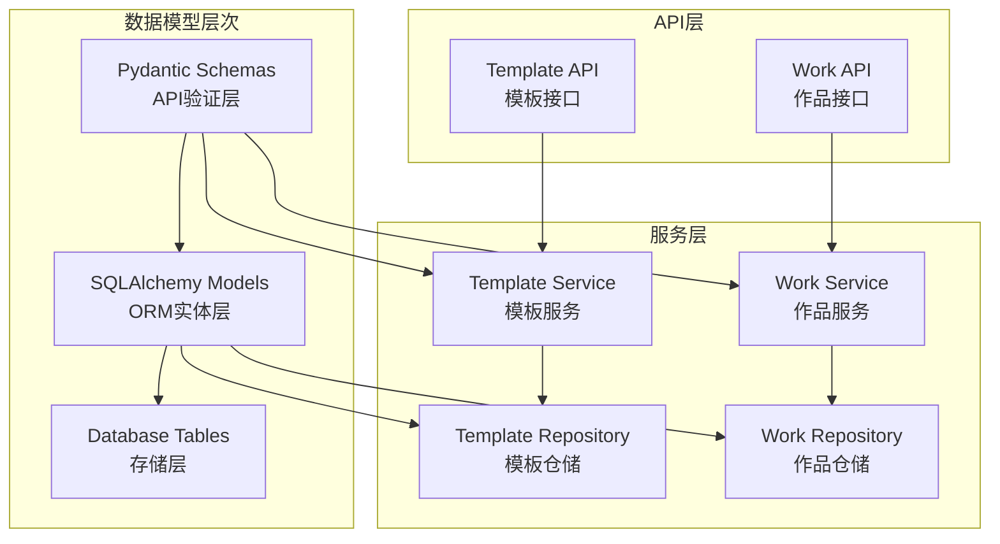

**图表来源**
- [base.py](file://backend/app/models/base.py#L1-L8)
- [template.py](file://backend/app/models/template.py#L1-L54)
- [work.py](file://backend/app/models/work.py#L1-L37)

## 核心数据模型

### Template模型（模板）

Template模型是系统的核心实体之一，负责存储信息图模板的所有相关信息。

#### 字段定义与数据类型

| 字段名 | 数据类型 | 约束条件 | 描述 |
|--------|----------|----------|------|
| id | String(100) | 主键, 非空 | 模板唯一标识符 |
| name | String(200) | 非空 | 模板名称（中文） |
| category | String(50) | 非空, 索引 | 分类（chart/comparison/hierarchy/list/quadrant/relationship/sequence） |
| structure_type | String(100) | 可空, 索引 | AntV structure类型 |
| description | Text | 可空 | 模板描述 |
| keywords | Text | 可空 | 关键词列表（逗号分隔） |
| use_cases | Text | 可空 | 适用场景说明 |
| preview_url | String(500) | 可空 | 预览图URL |
| data_schema | JSON | 非空 | 数据结构Schema |
| design_config | JSON | 非空 | AntV设计配置 |
| tags | JSON | 可空 | 标签数组 |
| sort_order | Integer | 默认0 | 排序权重 |
| is_active | Boolean | 默认True | 是否启用 |
| created_at | DateTime | 默认当前时间 | 创建时间 |
| updated_at | DateTime | 自动更新 | 更新时间 |

#### 关系映射

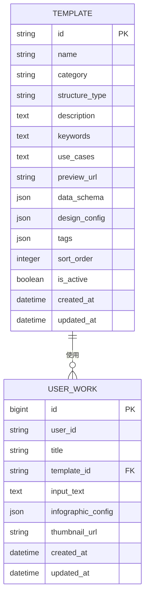

**图表来源**
- [template.py](file://backend/app/models/template.py#L9-L33)
- [work.py](file://backend/app/models/work.py#L9-L23)

**章节来源**
- [template.py](file://backend/app/models/template.py#L1-L54)

### Work模型（作品）

Work模型代表用户创建的信息图作品，记录了作品的完整信息和关联的模板。

#### 字段定义与数据类型

| 字段名 | 数据类型 | 约束条件 | 描述 |
|--------|----------|----------|------|
| id | BigInteger | 主键, 自增 | 作品ID |
| user_id | String(100) | 索引, 可空 | 用户标识 |
| title | String(200) | 可空 | 作品标题 |
| template_id | String(100) | 外键, 非空 | 使用的模板ID |
| input_text | Text | 非空 | 用户输入的原始文本 |
| infographic_config | JSON | 非空 | 完整的Infographic配置 |
| thumbnail_url | String(500) | 可空 | 缩略图URL |
| created_at | DateTime | 默认当前时间 | 创建时间 |
| updated_at | DateTime | 自动更新 | 更新时间 |

#### 外键关系

Work模型通过`template_id`字段与Template模型建立外键关系，确保作品只能使用有效的模板。

**章节来源**
- [work.py](file://backend/app/models/work.py#L1-L37)

## Pydantic Schema架构

### Template Schema

Template Schema主要用于API请求和响应的验证，提供了类型安全的数据传输层。

#### TemplateRecommendRequest

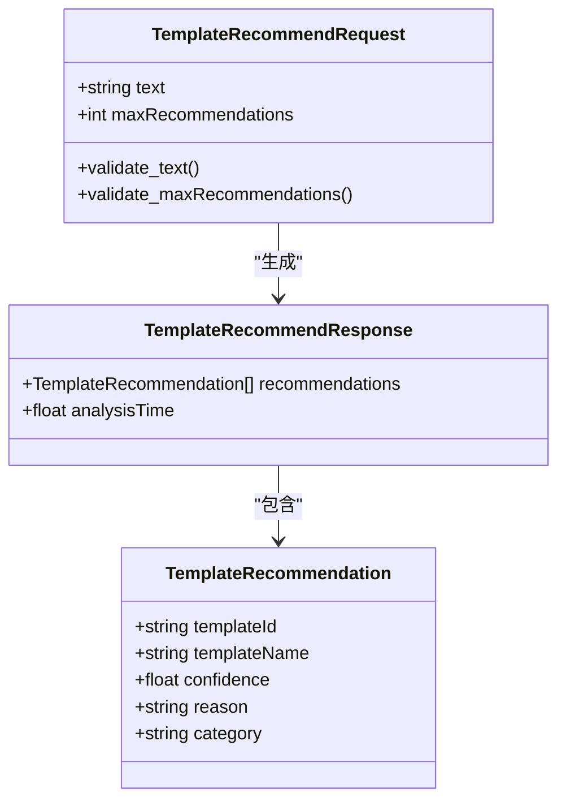

**图表来源**
- [template.py](file://backend/app/schemas/template.py#L8-L27)

#### Schema特性

- **文本验证**：`text`字段要求非空且最小长度为1
- **推荐数量限制**：`maxRecommendations`字段范围为1-10
- **类型安全**：所有字段都有明确的类型定义
- **描述性字段**：每个字段都配有详细的描述信息

**章节来源**
- [template.py](file://backend/app/schemas/template.py#L1-L27)

### Work Schema

Work Schema处理作品相关的API交互，包括创建和查询操作。

#### WorkCreateRequest

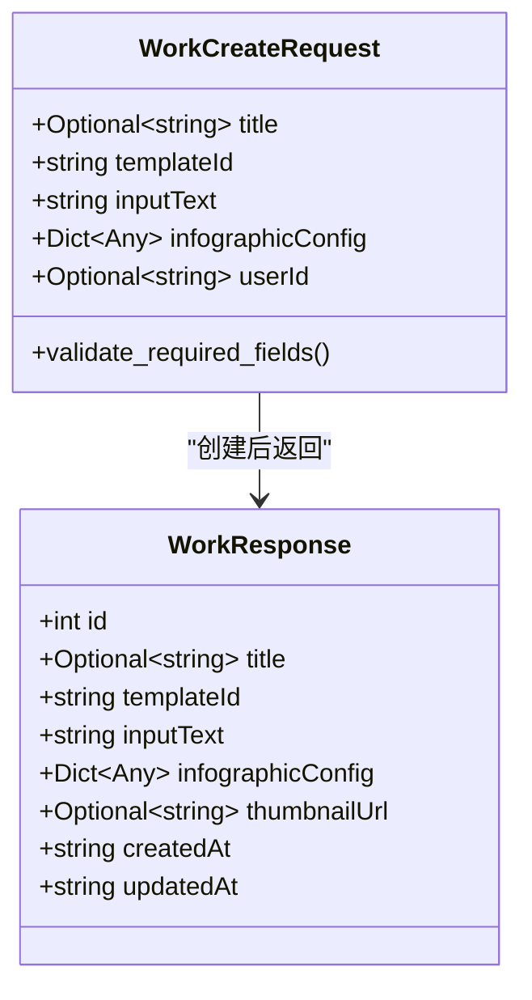

**图表来源**
- [work.py](file://backend/app/schemas/work.py#L8-L27)

#### Schema验证规则

- **必填字段**：`templateId`、`inputText`、`infographicConfig`为必需
- **长度验证**：`inputText`最小长度为1
- **可选字段**：`title`和`userId`允许为空
- **JSON结构**：`infographicConfig`接受任意JSON结构

**章节来源**
- [work.py](file://backend/app/schemas/work.py#L1-L27)

### 通用Schema

通用Schema提供了统一的API响应格式，确保前后端交互的一致性。

#### APIResponse

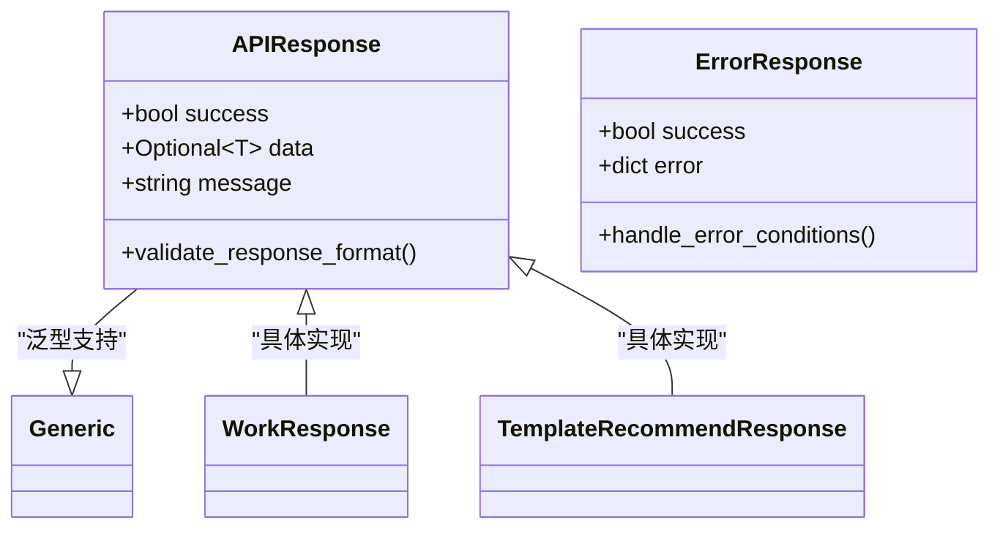

**图表来源**
- [common.py](file://backend/app/schemas/common.py#L10-L21)

**章节来源**
- [common.py](file://backend/app/schemas/common.py#L1-L21)

## 数据库表结构

### Template表结构

```mermaid
erDiagram
templates {
varchar(100) id PK
varchar(200) name
varchar(50) category
varchar(100) structure_type
text description
text keywords
text use_cases
varchar(500) preview_url
json data_schema
json design_config
json tags
int sort_order
tinyint is_active
datetime created_at
datetime updated_at
}
indexes {
PRIMARY id
INDEX idx_category_sort category, sort_order
INDEX idx_structure_type structure_type
}
```

**图表来源**
- [template.py](file://backend/app/models/template.py#L9-L33)
- [add_template_category_fields.py](file://backend/scripts/add_template_category_fields.py#L54-L78)

### Work表结构

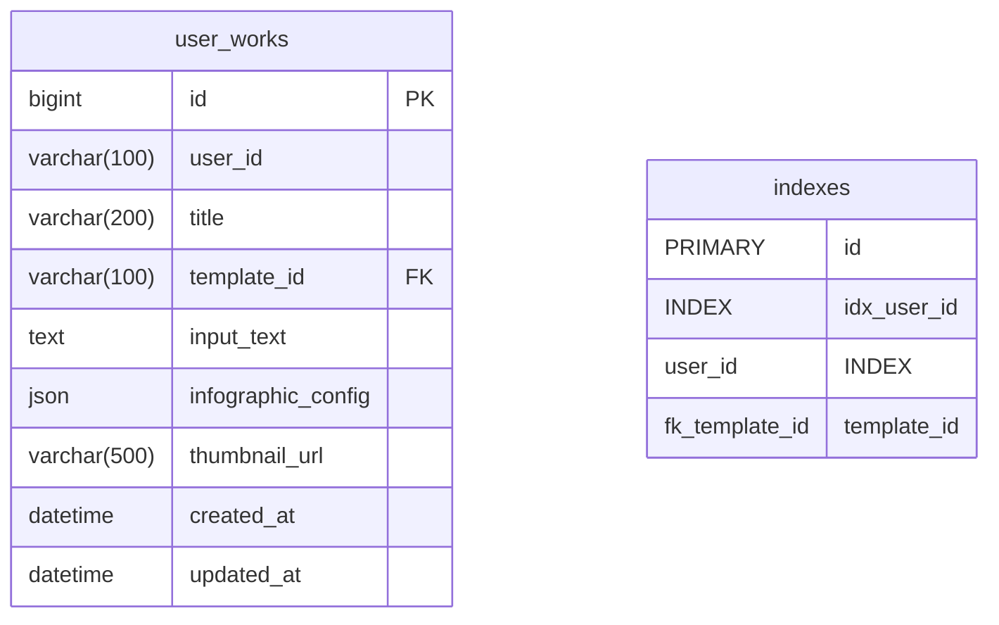

**图表来源**
- [work.py](file://backend/app/models/work.py#L9-L23)

### 索引配置

系统在关键字段上建立了复合索引以优化查询性能：

- **Template表**：
  - `idx_category_sort`：`(category, sort_order)` - 支持分类和排序查询
  - `idx_structure_type`：`structure_type` - 支持结构类型过滤

- **Work表**：
  - `idx_user_id`：`user_id` - 支持用户作品查询

**章节来源**
- [template.py](file://backend/app/models/template.py#L30-L33)
- [work.py](file://backend/app/models/work.py#L15-L16)

## 模型继承与基类

### Base类设计

系统采用SQLAlchemy的声明式基类模式，通过单一基类实现模型的统一管理。

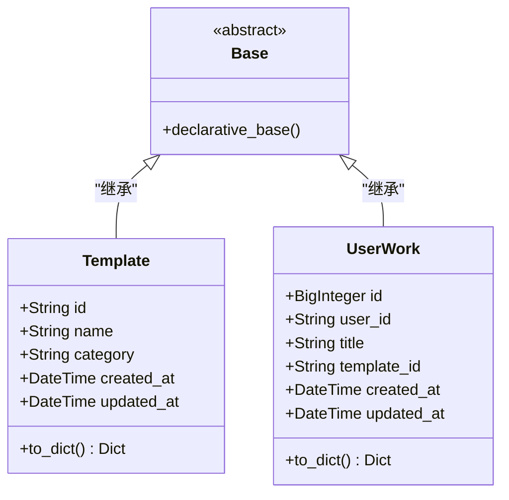

**图表来源**
- [base.py](file://backend/app/models/base.py#L4-L8)
- [template.py](file://backend/app/models/template.py#L9-L11)
- [work.py](file://backend/app/models/work.py#L9-L11)

### 继承优势

- **统一管理**：所有模型共享相同的元数据和配置
- **一致性**：自动化的表名和字段命名规范
- **扩展性**：便于添加全局功能（如审计日志）

**章节来源**
- [base.py](file://backend/app/models/base.py#L1-L8)

## 数据验证与约束

### 字段级验证

系统在多个层面实现了数据验证：

#### SQLAlchemy约束

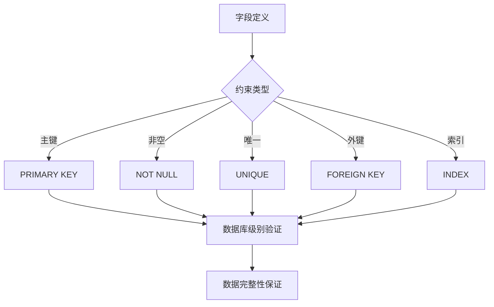

**图表来源**
- [template.py](file://backend/app/models/template.py#L14-L28)
- [work.py](file://backend/app/models/work.py#L14-L22)

#### Pydantic验证

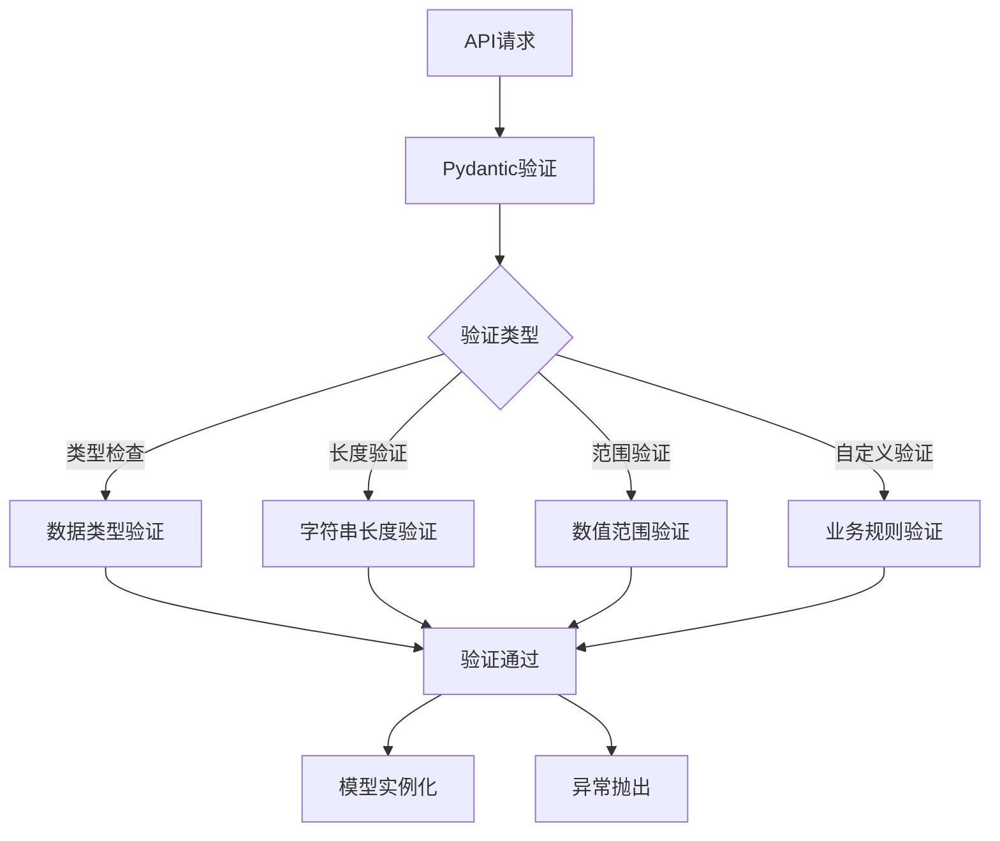

**图表来源**
- [template.py](file://backend/app/schemas/template.py#L10-L11)
- [work.py](file://backend/app/schemas/work.py#L10-L13)

### 默认值设置

系统在字段定义中设置了合理的默认值：

- **布尔字段**：`is_active`默认为`True`
- **数值字段**：`sort_order`默认为`0`
- **时间字段**：`created_at`和`updated_at`自动管理

**章节来源**
- [template.py](file://backend/app/models/template.py#L25-L28)
- [work.py](file://backend/app/models/work.py#L20-L22)

## 生命周期事件处理

### 数据库连接管理

系统通过上下文管理器模式实现数据库连接的生命周期管理。

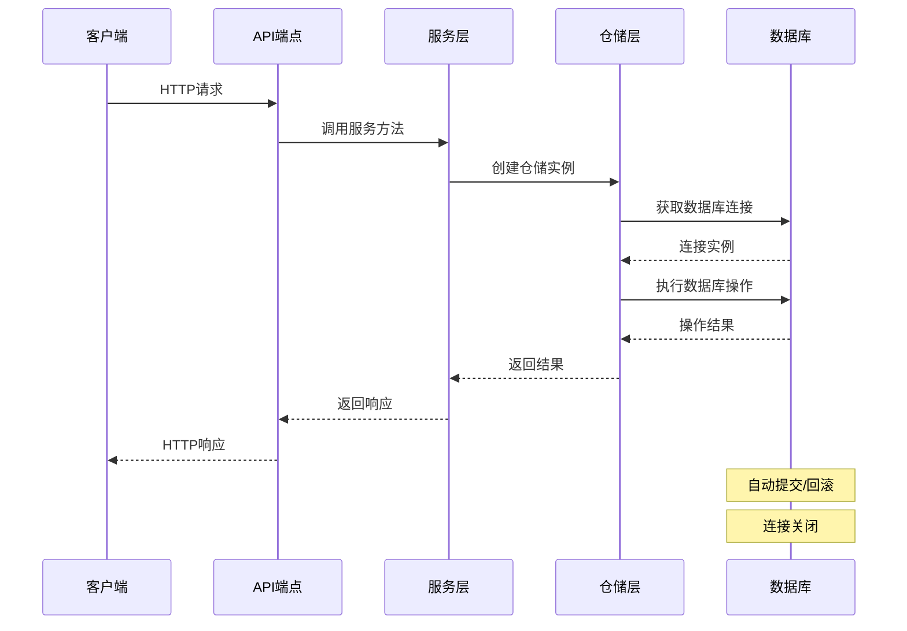

**图表来源**
- [db.py](file://backend/app/utils/db.py#L58-L76)
- [works.py](file://backend/app/api/v1/works.py#L15-L45)

### 事务管理

系统实现了自动化的事务管理机制：

- **自动提交**：正常情况下自动提交事务
- **自动回滚**：发生异常时自动回滚
- **连接池管理**：高效的连接复用机制

**章节来源**
- [db.py](file://backend/app/utils/db.py#L58-L94)

## 模型使用场景

### 创建场景

在作品创建过程中，系统按照以下流程处理数据：

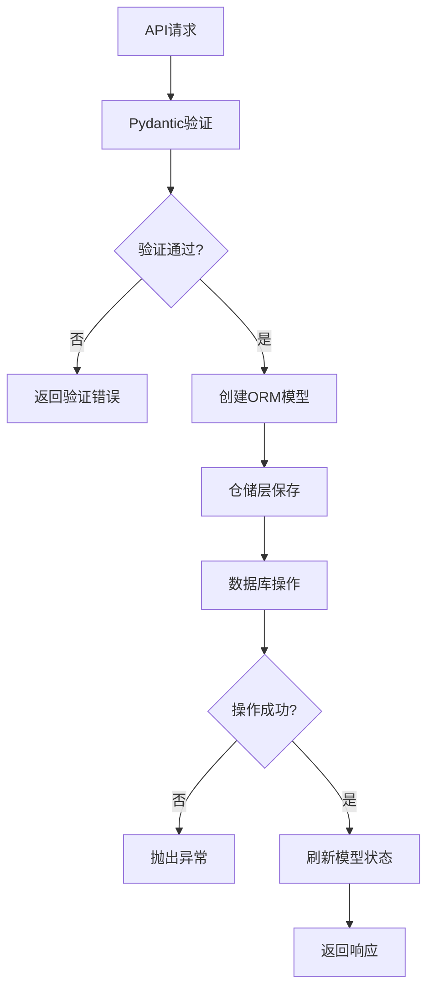

**图表来源**
- [works.py](file://backend/app/api/v1/works.py#L15-L45)
- [work_repo.py](file://backend/app/repositories/work_repo.py#L24-L37)

### 查询场景

系统支持多种查询模式：

#### 分页查询
- 支持按分类筛选
- 支持关键词搜索
- 支持排序和分页参数

#### 条件查询
- 按ID精确查询
- 按分类批量查询
- 按关键字模糊匹配

**章节来源**
- [template_repo.py](file://backend/app/repositories/template_repo.py#L25-L72)
- [work_repo.py](file://backend/app/repositories/work_repo.py#L51-L82)

### 更新场景

虽然当前版本主要关注创建和查询，但模型设计支持未来的更新操作：

- **自动时间戳**：`updated_at`字段自动更新
- **软删除**：通过`is_active`字段实现软删除
- **增量更新**：支持部分字段更新

## 最佳实践

### 模型设计原则

1. **单一职责**：每个模型专注于特定业务领域
2. **数据完整性**：通过约束和验证确保数据质量
3. **性能优化**：合理设计索引和查询策略
4. **可扩展性**：预留扩展字段和未来需求

### 开发建议

#### 字段设计
- 选择合适的数据类型和长度限制
- 合理设置默认值和约束条件
- 添加必要的索引以优化查询性能

#### 验证策略
- 在API层使用Pydantic进行输入验证
- 在数据库层使用SQLAlchemy约束确保数据完整性
- 实现适当的错误处理和用户友好的错误消息

#### 性能考虑
- 使用复合索引优化复杂查询
- 实现分页机制处理大数据集
- 考虑缓存策略减少数据库负载

### 维护建议

#### 数据库迁移
- 使用Alembic进行版本化的数据库迁移
- 保持迁移脚本的向后兼容性
- 定期备份和测试数据库结构变更

#### 监控和优化
- 监控查询性能和数据库负载
- 定期分析慢查询并优化索引
- 实施适当的监控和告警机制

**章节来源**
- [add_template_category_fields.py](file://backend/scripts/add_template_category_fields.py#L1-L97)
- [add_missing_columns.py](file://backend/scripts/add_missing_columns.py#L1-L49)