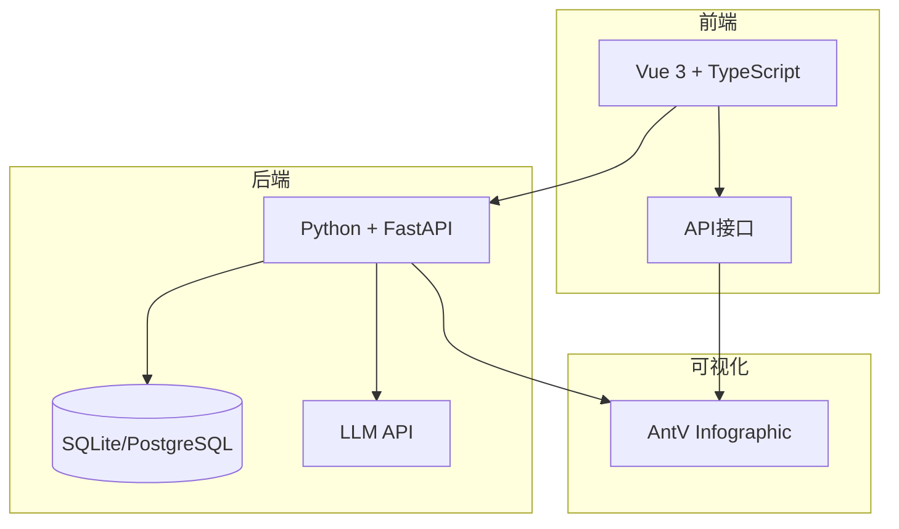
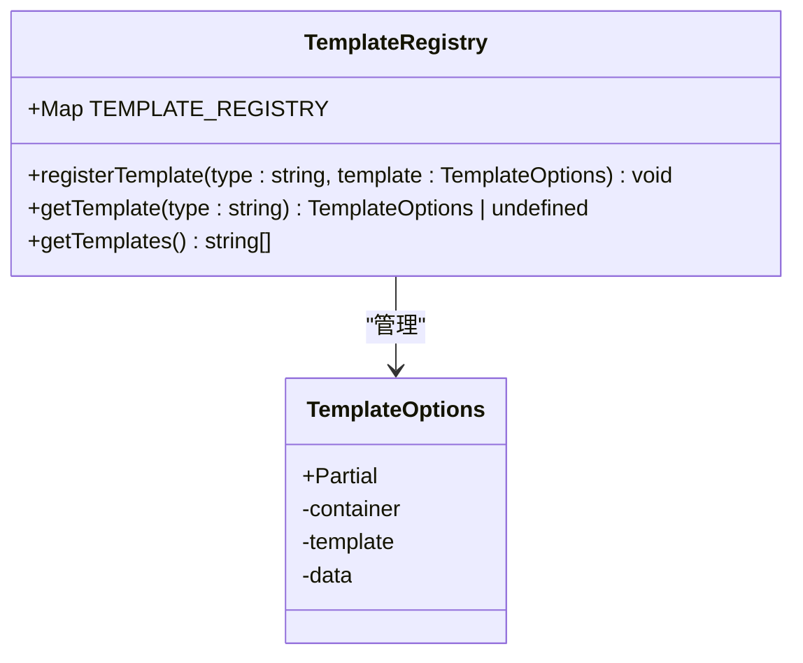
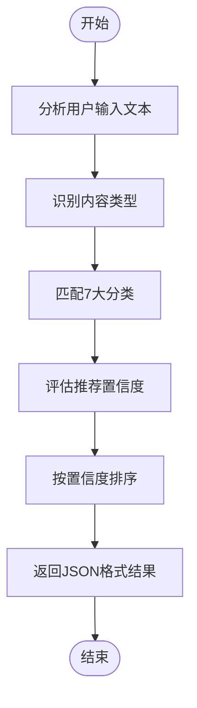
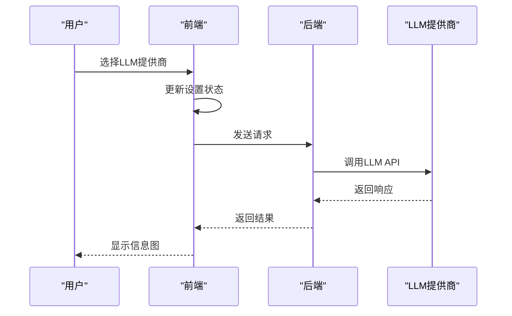

# 开发指南

<cite>
**本文档引用的文件**   
- [README.md](file://README.md)
- [backend/app/services/template_service.py](file://backend/app/services/template_service.py)
- [backend/app/utils/prompts.py](file://backend/app/utils/prompts.py)
- [backend/app/main.py](file://backend/app/main.py)
- [frontend/src/App.vue](file://frontend/src/App.vue)
- [frontend/src/views/AIWorkspace/AIWorkspace.vue](file://frontend/src/views/AIWorkspace/AIWorkspace.vue)
- [frontend/src/stores/settings.ts](file://frontend/src/stores/settings.ts)
- [antv_infographic/infographic/src/templates/registry.ts](file://antv_infographic/infographic/src/templates/registry.ts)
- [antv_infographic/infographic/src/templates/types.ts](file://antv_infographic/infographic/src/templates/types.ts)
- [antv_infographic/infographic/site/src/components/AIPlayground/Service.ts](file://antv_infographic/infographic/site/src/components/AIPlayground/Service.ts)
</cite>

## 目录
1. [简介](#简介)
2. [项目结构](#项目结构)
3. [添加信息图模板](#添加信息图模板)
4. [自定义LLM提示词](#自定义llm提示词)
5. [插件机制与集成](#插件机制与集成)
6. [代码贡献规范](#代码贡献规范)
7. [调试技巧与开发工具](#调试技巧与开发工具)
8. [最佳实践](#最佳实践)

## 简介

本开发指南旨在为二次开发者提供扩展和定制GenAI Chart系统的全面指导。系统基于AntV Infographic和大语言模型（LLM）技术，实现了从文本到专业信息图的智能生成。本指南将详细介绍如何添加新的信息图模板、自定义LLM提示词、集成新的LLM提供商或数据源，以及代码贡献和调试的最佳实践。

**Section sources**
- [README.md](file://README.md#L1-L323)

## 项目结构

项目采用前后端分离架构，主要由以下核心部分组成：

- **backend/**: Python + FastAPI后端服务，负责API接口、业务逻辑和数据库管理
- **frontend/**: Vue 3 + TypeScript前端应用，提供用户界面和交互
- **antv_infographic/infographic/**: AntV Infographic可视化库源码，用于信息图渲染
- **tests/**: 包含后端和前端的测试脚本
- **docs/**: 项目文档

后端服务通过FastAPI提供RESTful API，前端通过Vue 3构建用户界面，两者通过HTTP API进行通信。AntV Infographic库作为核心渲染引擎，支持多种信息图模板。



**Diagram sources **
- [README.md](file://README.md#L164-L215)
- [backend/app/main.py](file://backend/app/main.py#L1-L113)

**Section sources**
- [README.md](file://README.md#L164-L215)
- [backend/app/main.py](file://backend/app/main.py#L1-L113)

## 添加信息图模板

添加新的信息图模板需要在前后端协同完成，主要涉及模板元数据定义、数据结构设计和注册机制。

### 前端模板注册

在AntV Infographic库中，所有模板通过`registry.ts`文件进行注册和管理。该文件提供了模板注册、获取和查询的API。



**Diagram sources **
- [antv_infographic/infographic/src/templates/registry.ts](file://antv_infographic/infographic/src/templates/registry.ts#L1-L15)
- [antv_infographic/infographic/src/templates/types.ts](file://antv_infographic/infographic/src/templates/types.ts#L1-L12)

### 后端模板管理

后端通过`template_service.py`文件管理模板元数据，包括模板ID、名称、分类、描述和数据结构定义。

```python
TEMPLATE_METADATA = [
    {
        "id": "list-row-simple-horizontal-arrow",
        "name": "简单横向流程图",
        "category": "流程图",
        "description": "带箭头的横向列表布局，适合展示线性流程",
        "适用场景": "步骤说明、流程展示、操作指南",
        "dataSchema": TEMPLATE_SCHEMAS.get("list-row-simple-horizontal-arrow", {})
    },
    # 更多模板...
]
```

添加新模板的步骤：
1. 在`backend/app/services/template_service.py`的`TEMPLATE_METADATA`中添加模板元数据
2. 在`backend/app/utils/prompts.py`的`TEMPLATE_SCHEMAS`中定义数据结构
3. 重启后端服务

**Section sources**
- [backend/app/services/template_service.py](file://backend/app/services/template_service.py#L98-L157)
- [README.md](file://README.md#L297-L301)

## 自定义LLM提示词

系统通过精心设计的提示词（prompts）引导LLM完成模板推荐和数据提取任务。提示词定义在`backend/app/utils/prompts.py`文件中。

### 模板推荐提示词

`get_template_recommend_prompt`函数生成模板推荐的提示词，包含7大分类体系和分析指南：



**Diagram sources **
- [backend/app/utils/prompts.py](file://backend/app/utils/prompts.py#L9-L128)

### 数据提取提示词

`get_data_extract_prompt`函数生成数据提取的提示词，要求LLM按照指定的数据结构提取信息，并生成图标字段。

```python
TEMPLATE_SCHEMAS = {
    "list-row-simple-horizontal-arrow": {
        "description": "横向流程图，带箭头",
        "dataFields": {
            "title": {"type": "string", "required": False},
            "desc": {"type": "string", "required": False},
            "items": {
                "type": "array",
                "required": True,
                "itemSchema": {
                    "label": {"type": "string", "required": True},
                    "desc": {"type": "string", "required": False}
                }
            }
        }
    }
}
```

自定义提示词的步骤：
1. 编辑`backend/app/utils/prompts.py`中的提示词模板
2. 优化AI推荐和数据提取效果
3. 重启后端服务

**Section sources**
- [backend/app/utils/prompts.py](file://backend/app/utils/prompts.py#L1-L247)
- [README.md](file://README.md#L303-L305)

## 插件机制与集成

系统支持灵活的插件机制，允许集成新的LLM提供商或数据源。

### LLM提供商集成

前端通过`settings.ts`管理LLM提供商选择，支持系统LLM和Dify工作流两种模式。



**Diagram sources **
- [frontend/src/stores/settings.ts](file://frontend/src/stores/settings.ts#L1-L76)
- [frontend/src/views/AIWorkspace/AIWorkspace.vue](file://frontend/src/views/AIWorkspace/AIWorkspace.vue#L1-L136)

### 多提供商支持

`antv_infographic/infographic/site/src/components/AIPlayground/Service.ts`文件实现了对多种LLM提供商的支持，包括OpenAI、Anthropic和Google。

```typescript
async function callAI(config: AIModelConfig, messages: Array<{role: 'user' | 'assistant' | 'system'; content: string}>, stream = true) {
    switch (provider) {
        case 'openai':
        case 'deepseek':
        case 'xai':
        case 'qwen':
            return callOpenAICompatible(baseURL, apiKey, model, messages, stream);
        case 'anthropic':
            return callAnthropic(baseURL, apiKey, model, messages, stream);
        case 'google':
            return callGoogle(baseURL, apiKey, model, messages, stream);
        default:
            return null;
    }
}
```

集成新LLM提供商的步骤：
1. 在`Service.ts`中添加新的提供商支持
2. 实现相应的API调用逻辑
3. 更新前端配置界面

**Section sources**
- [frontend/src/stores/settings.ts](file://frontend/src/stores/settings.ts#L1-L76)
- [antv_infographic/infographic/site/src/components/AIPlayground/Service.ts](file://antv_infographic/infographic/site/src/components/AIPlayground/Service.ts#L1-L344)

## 代码贡献规范

为确保代码质量和一致性，所有贡献必须遵循以下规范。

### 分支管理

采用Git分支管理策略：
- `main`：主分支，稳定版本
- `develop`：开发分支，集成测试
- `feature/*`：功能分支，开发新功能
- `hotfix/*`：热修复分支，紧急修复

### 代码风格

- **Python**: 遵循PEP 8规范，使用Black格式化
- **TypeScript**: 遵循ESLint配置，使用Prettier格式化
- **文件命名**: 使用小写字母和连字符（kebab-case）

### 测试要求

所有新功能必须包含相应的测试：
- 单元测试：覆盖核心业务逻辑
- 集成测试：验证API端到端流程
- 功能测试：验证用户场景

测试脚本位于`tests/`目录，使用pytest框架。

**Section sources**
- [README.md](file://README.md#L285-L296)
- [tests/README.md](file://tests/README.md#L1-L522)

## 调试技巧与开发工具

### 开发环境配置

1. **后端**：
   - 安装Python 3.11+
   - 安装依赖：`pip install -r requirements.txt`
   - 配置环境变量：`.env`文件

2. **前端**：
   - 安装Node.js 18+
   - 安装依赖：`npm install`
   - 启动开发服务器：`npm run dev`

### 调试工具

- **日志**：使用Python logging模块记录详细日志
- **API文档**：访问`http://localhost:8000/docs`查看FastAPI自动生成的文档
- **浏览器开发者工具**：调试前端界面和API调用

### 常见问题排查

1. **后端启动失败**：
   - 检查Python版本
   - 确认依赖安装
   - 检查`.env`配置

2. **前端无法连接后端**：
   - 确认后端服务运行
   - 检查CORS配置
   - 查看浏览器控制台

**Section sources**
- [README.md](file://README.md#L240-L263)
- [tests/README.md](file://tests/README.md#L367-L437)

## 最佳实践

1. **模板设计**：遵循AntV Infographic的设计规范，确保模板的可复用性和灵活性
2. **提示词优化**：持续优化LLM提示词，提高推荐和提取的准确性
3. **性能优化**：关注API响应时间和渲染性能，优化大数据量场景
4. **用户体验**：注重用户交互细节，提供清晰的反馈和引导
5. **文档维护**：及时更新文档，确保与代码实现同步

通过遵循本指南，开发者可以高效地扩展和定制GenAI Chart系统，满足特定业务场景的需求。

**Section sources**
- [README.md](file://README.md#L264-L323)
- [tests/README.md](file://tests/README.md#L509-L517)