# 提示工程

<cite>
**本文档引用的文件**
- [llm_prompts.yaml](file://backend/app/config/llm_prompts.yaml)
- [prompt_manager.py](file://backend/app/utils/prompt_manager.py)
- [prompts.py](file://backend/app/utils/prompts.py)
- [generate_service.py](file://backend/app/services/generate_service.py)
- [llm_client.py](file://backend/app/services/llm_client.py)
- [template.py](file://backend/app/models/template.py)
- [data_validator.py](file://backend/app/services/data_validator.py)
- [settings.ts](file://frontend/src/stores/settings.ts)
- [dify_workflow_client.py](file://backend/app/services/dify_workflow_client.py)
</cite>

## 目录
1. [简介](#简介)
2. [系统架构概览](#系统架构概览)
3. [提示词配置结构](#提示词配置结构)
4. [核心提示词设计模式](#核心提示词设计模式)
5. [提示词管理器详解](#提示词管理器详解)
6. [模板推荐与选择机制](#模板推荐与选择机制)
7. [数据提取与结构化处理](#数据提取与结构化处理)
8. [环境变量配置与动态调整](#环境变量配置与动态调整)
9. [错误处理与容错机制](#错误处理与容错机制)
10. [性能优化策略](#性能优化策略)
11. [实际应用案例](#实际应用案例)
12. [最佳实践指南](#最佳实践指南)

## 简介

本系统采用先进的提示工程方法，通过精心设计的LLM提示词模板实现智能化的信息图表生成。系统支持三种主要的提示词应用场景：类型识别、模板选择和数据提取，形成了完整的三阶段智能生成流程。

提示工程的核心价值在于：
- **精确性**：通过结构化提示词确保AI理解用户意图
- **可扩展性**：模块化设计支持自定义提示词配置
- **稳定性**：完善的错误处理和回退机制
- **灵活性**：支持多种LLM提供商和配置选项

## 系统架构概览

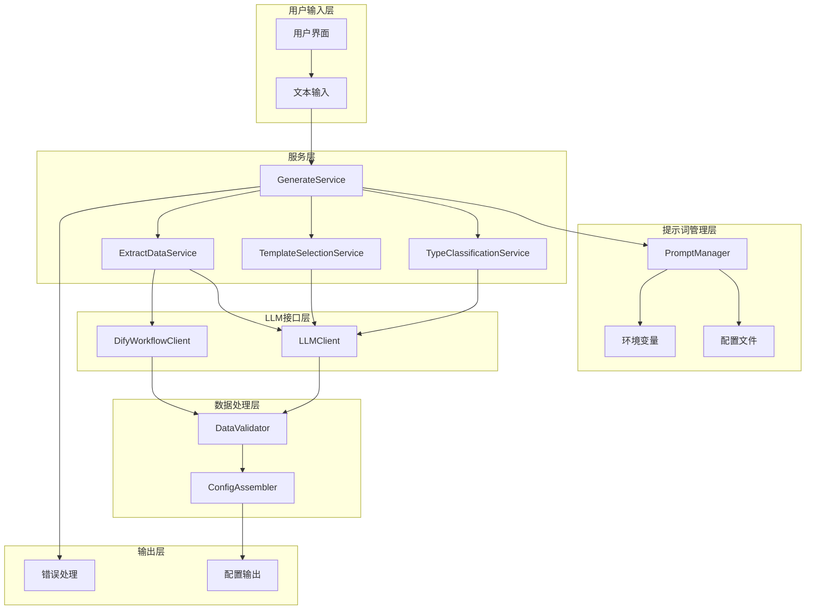

**图表来源**
- [generate_service.py](file://backend/app/services/generate_service.py#L33-L118)
- [prompt_manager.py](file://backend/app/utils/prompt_manager.py#L14-L216)

## 提示词配置结构

系统采用YAML格式的集中式配置文件，支持三种核心提示词类型的独立配置：

### 配置文件结构

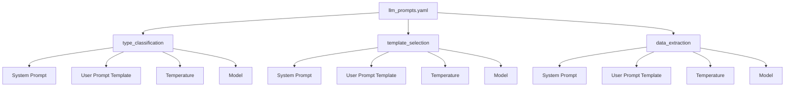

**图表来源**
- [llm_prompts.yaml](file://backend/app/config/llm_prompts.yaml#L1-L201)

### 温度参数设计原则

| 场景 | 温度值 | 设计理念 | 应用场景 |
|------|--------|----------|----------|
| 类型识别 | 0.3 | 低温度确保一致性 | 结构化分类任务 |
| 模板选择 | 0.3 | 稳定的选择策略 | 模板匹配决策 |
| 数据提取 | 0.2 | 高精度数据提取 | 结构化数据生成 |

**节来源**
- [llm_prompts.yaml](file://backend/app/config/llm_prompts.yaml#L90-L201)

## 核心提示词设计模式

### 类型识别提示词模式

类型识别是整个流程的基础，采用分类体系驱动的设计模式：

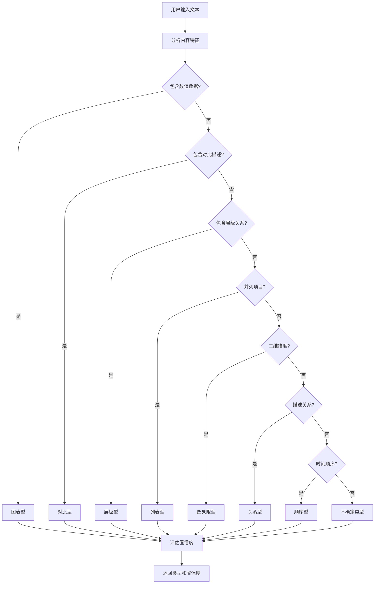

**图表来源**
- [llm_prompts.yaml](file://backend/app/config/llm_prompts.yaml#L19-L88)

### 模板选择提示词模式

模板选择采用多维度匹配算法，结合内容特征和模板属性：

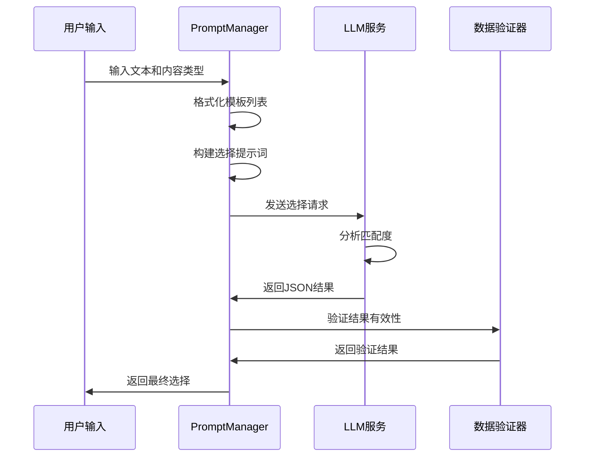

**图表来源**
- [prompt_manager.py](file://backend/app/utils/prompt_manager.py#L81-L116)
- [template_selection_service.py](file://backend/app/services/template_selection_service.py#L47-L113)

### 数据提取提示词模式

数据提取采用Schema驱动的方法，确保输出结构的一致性：

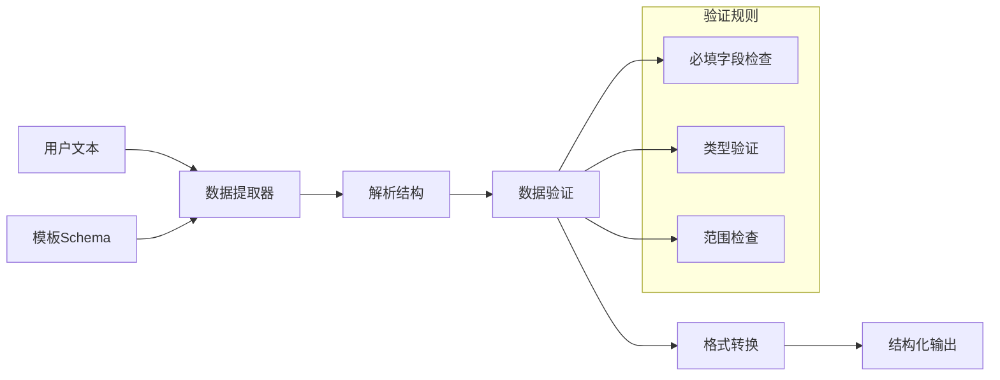

**图表来源**
- [prompts.py](file://backend/app/utils/prompts.py#L131-L247)
- [data_validator.py](file://backend/app/services/data_validator.py#L11-L123)

**节来源**
- [llm_prompts.yaml](file://backend/app/config/llm_prompts.yaml#L58-L201)
- [prompts.py](file://backend/app/utils/prompts.py#L1-L247)

## 提示词管理器详解

### PromptManager核心功能

PromptManager是提示词系统的核心组件，负责配置加载、模板渲染和环境变量管理：

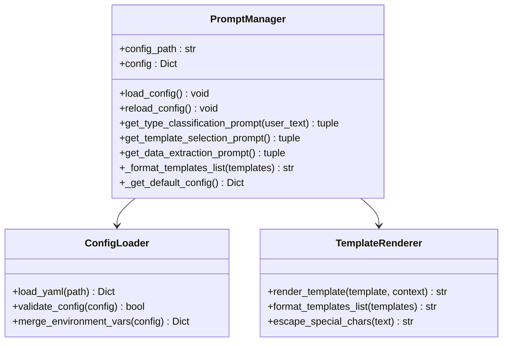

**图表来源**
- [prompt_manager.py](file://backend/app/utils/prompt_manager.py#L14-L216)

### 配置加载机制

系统采用多层次配置加载策略：

1. **主配置文件**：优先加载`llm_prompts.yaml`
2. **环境变量覆盖**：支持运行时动态调整
3. **默认配置兜底**：配置文件缺失时使用内置默认值

### 模板渲染流程

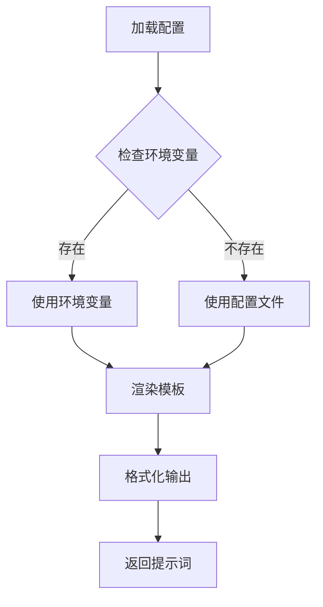

**图表来源**
- [prompt_manager.py](file://backend/app/utils/prompt_manager.py#L58-L156)

**节来源**
- [prompt_manager.py](file://backend/app/utils/prompt_manager.py#L14-L216)

## 模板推荐与选择机制

### 模板推荐算法

系统提供两种模板推荐方式：

1. **智能推荐**：基于用户输入和可用模板的匹配
2. **手动选择**：用户主动选择合适的模板

### 推荐质量评估

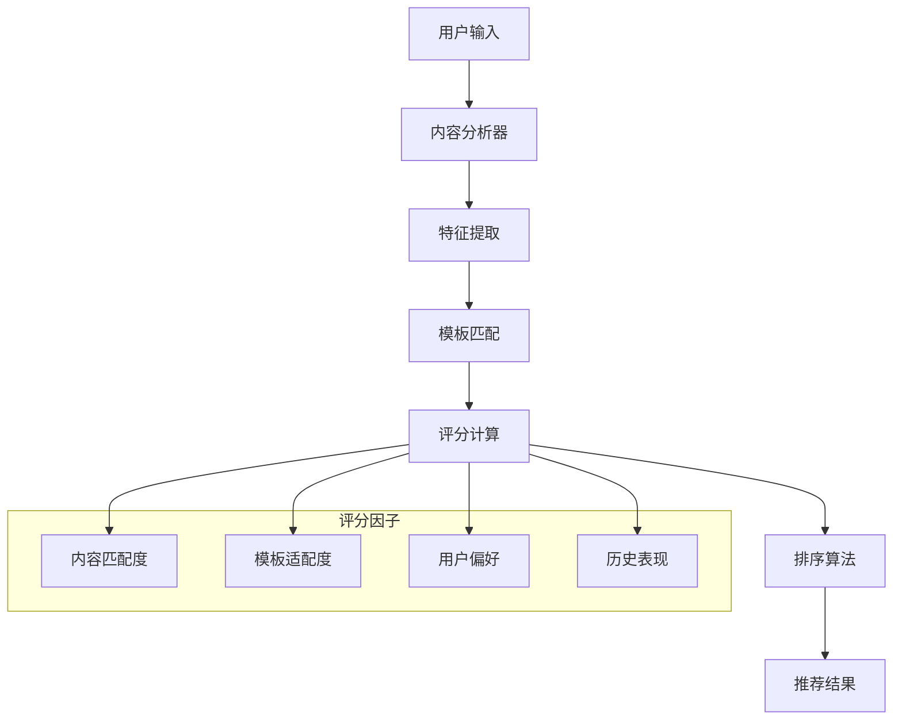

**图表来源**
- [prompts.py](file://backend/app/utils/prompts.py#L9-L128)

### 模板选择策略

| 选择策略 | 适用场景 | 置信度阈值 | 优先级 |
|----------|----------|------------|--------|
| 数据匹配度 | 结构化数据 | 0.8+ | 高 |
| 视觉复杂度 | 内容丰富度 | 0.7+ | 中 |
| 数据项数量 | 项目数量 | 0.6+ | 中 |
| 特殊特征 | 专业需求 | 0.5+ | 低 |

**节来源**
- [prompts.py](file://backend/app/utils/prompts.py#L9-L247)

## 数据提取与结构化处理

### Schema驱动的数据提取

系统采用严格的Schema验证机制，确保数据质量和一致性：

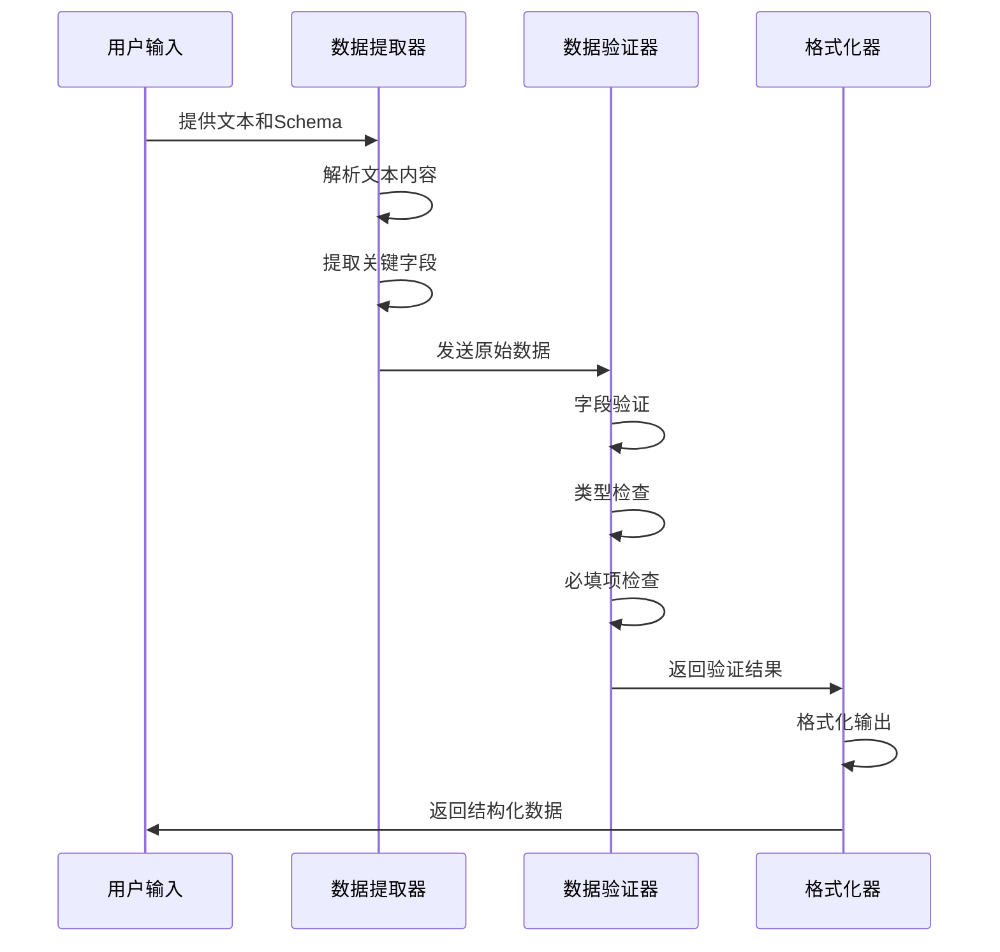

**图表来源**
- [data_validator.py](file://backend/app/services/data_validator.py#L11-L123)

### 数据验证规则

| 验证类型 | 检查内容 | 错误处理 | 修复策略 |
|----------|----------|----------|----------|
| 必填字段 | 缺失字段检测 | 记录警告 | 使用默认值 |
| 数据类型 | 类型匹配验证 | 抛出异常 | 类型转换 |
| 字段范围 | 值域检查 | 警告提示 | 截断或修正 |
| 数组长度 | 项目数量限制 | 警告提示 | 截断或补充 |

**节来源**
- [data_validator.py](file://backend/app/services/data_validator.py#L11-L123)

## 环境变量配置与动态调整

### 支持的环境变量

系统支持通过环境变量动态调整提示词配置：

| 变量名 | 作用域 | 默认值 | 说明 |
|--------|--------|--------|------|
| LLM_TYPE_CLASSIFICATION_SYSTEM_PROMPT | 类型识别 | 原配置 | 系统提示词 |
| LLM_TYPE_CLASSIFICATION_TEMPERATURE | 类型识别 | 0.3 | 温度参数 |
| LLM_TEMPLATE_SELECTION_SYSTEM_PROMPT | 模板选择 | 原配置 | 系统提示词 |
| LLM_TEMPLATE_SELECTION_TEMPERATURE | 模板选择 | 0.3 | 温度参数 |
| LLM_DATA_EXTRACTION_SYSTEM_PROMPT | 数据提取 | 原配置 | 系统提示词 |
| LLM_DATA_EXTRACTION_TEMPERATURE | 数据提取 | 0.2 | 温度参数 |

### 动态配置加载

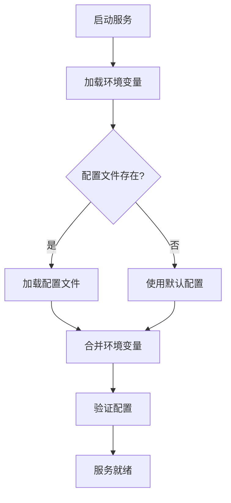

**图表来源**
- [prompt_manager.py](file://backend/app/utils/prompt_manager.py#L36-L52)

**节来源**
- [prompt_manager.py](file://backend/app/utils/prompt_manager.py#L70-L156)

## 错误处理与容错机制

### 多层错误处理策略

系统实现了完整的错误处理和容错机制：

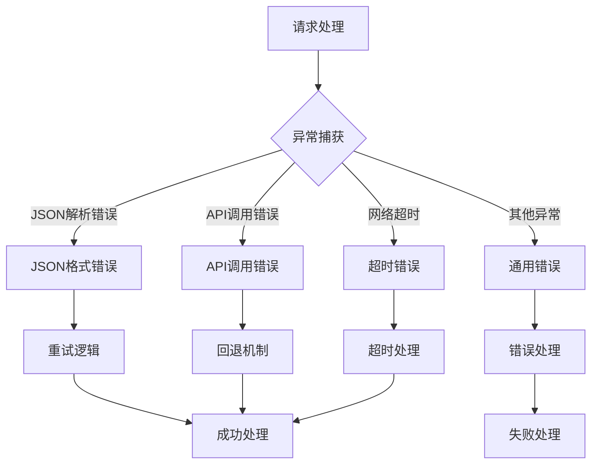

**图表来源**
- [llm_client.py](file://backend/app/services/llm_client.py#L47-L92)
- [dify_workflow_client.py](file://backend/app/services/dify_workflow_client.py#L108-L136)

### Dify工作流回退机制

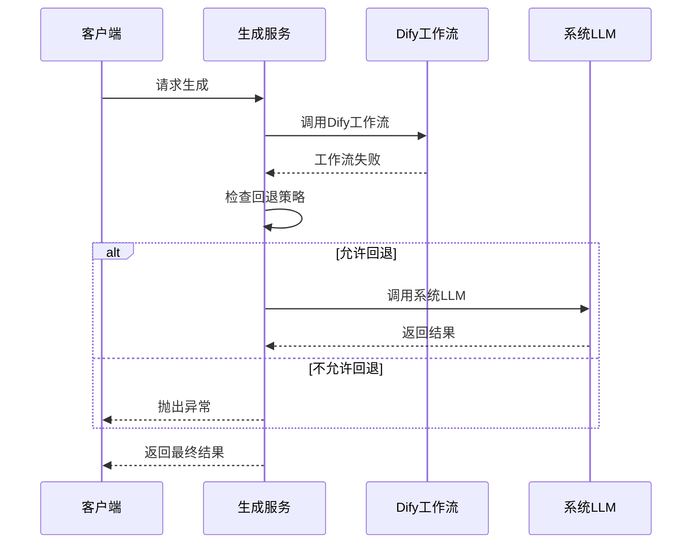

**图表来源**
- [generate_service.py](file://backend/app/services/generate_service.py#L240-L246)

### 错误恢复策略

| 错误类型 | 恢复策略 | 重试次数 | 等待时间 |
|----------|----------|----------|----------|
| 网络超时 | 重试请求 | 3次 | 1秒 |
| API配额超限 | 等待重试 | 5次 | 指数退避 |
| JSON解析失败 | 使用默认值 | 1次 | 立即 |
| 数据验证失败 | 自动修复 | 2次 | 立即 |

**节来源**
- [llm_client.py](file://backend/app/services/llm_client.py#L47-L217)
- [dify_workflow_client.py](file://backend/app/services/dify_workflow_client.py#L108-L136)

## 性能优化策略

### 上下文长度优化

系统采用多种策略优化LLM上下文长度：

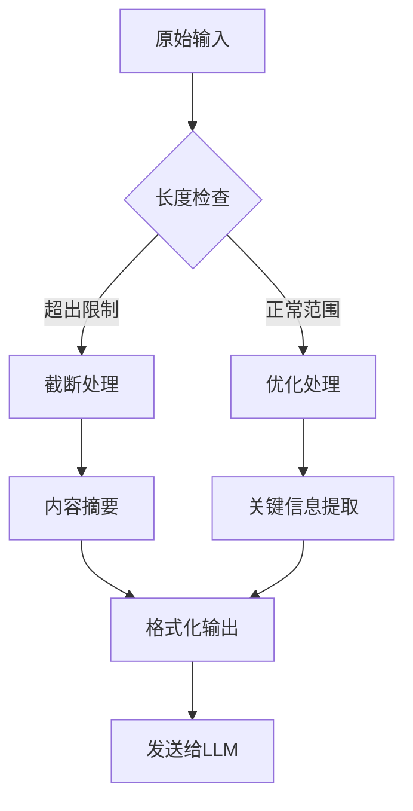

### 温度参数调优

不同场景下的温度参数优化策略：

| 场景 | 温度值 | 优化目标 | 性能影响 |
|------|--------|----------|----------|
| 类型识别 | 0.3 | 一致性 | 低延迟 |
| 模板选择 | 0.3 | 稳定性 | 中等延迟 |
| 数据提取 | 0.2 | 准确性 | 较高延迟 |

### 并发处理优化

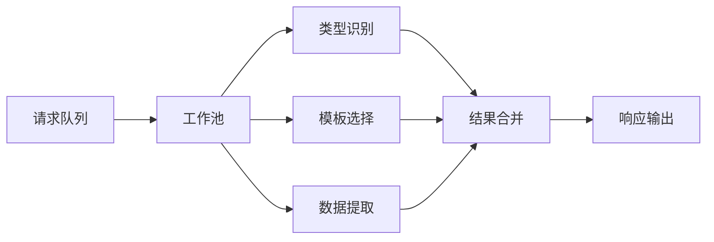

**节来源**
- [generate_service.py](file://backend/app/services/generate_service.py#L47-L118)

## 实际应用案例

### 案例1：销售数据分析

**用户输入**：
```
2023年Q1销售额1000万，Q2增长20%，Q3预计增长15%
```

**处理流程**：
1. **类型识别**：识别为图表型（chart）
2. **模板选择**：选择柱状图或折线图模板
3. **数据提取**：提取时间序列数据

**输出配置**：
```json
{
  "template": "chart-column-simple",
  "data": {
    "title": "2023年销售数据趋势",
    "desc": "季度销售增长率分析",
    "items": [
      {"label": "Q1", "value": 1000},
      {"label": "Q2", "value": 1200},
      {"label": "Q3", "value": 1380}
    ]
  }
}
```

### 案例2：产品功能对比

**用户输入**：
```
产品A：智能推荐、数据分析、用户界面友好
产品B：功能全面、性能稳定、价格优惠
```

**处理流程**：
1. **类型识别**：识别为对比型（comparison）
2. **模板选择**：选择双栏对比模板
3. **数据提取**：提取产品特性和优势

**输出配置**：
```json
{
  "template": "comparison-column",
  "data": {
    "title": "产品功能对比",
    "desc": "产品A vs 产品B功能特性",
    "items": [
      {"label": "智能推荐", "desc": "产品A独有功能"},
      {"label": "数据分析", "desc": "产品A核心能力"},
      {"label": "用户界面", "desc": "产品A用户体验"},
      {"label": "功能全面", "desc": "产品B优势"},
      {"label": "性能稳定", "desc": "产品B技术保障"},
      {"label": "价格优惠", "desc": "产品B性价比"}
    ]
  }
}
```

### 案例3：组织架构设计

**用户输入**：
```
公司组织架构：CEO-部门经理-员工
会员等级：金牌-银牌-铜牌-普通
```

**处理流程**：
1. **类型识别**：识别为层级型（hierarchy）
2. **模板选择**：选择树形结构模板
3. **数据提取**：提取层级关系和等级信息

**输出配置**：
```json
{
  "template": "org-tree",
  "data": {
    "title": "组织架构图",
    "desc": "公司层级结构",
    "items": [
      {
        "label": "CEO",
        "desc": "公司最高管理者",
        "children": [
          {"label": "部门经理", "desc": "各部门负责人"},
          {"label": "部门经理", "desc": "各部门负责人"}
        ]
      }
    ]
  }
}
```

## 最佳实践指南

### 提示词设计原则

1. **明确性原则**：提示词必须清晰表达期望的输出格式
2. **结构化原则**：使用明确的指令结构和格式要求
3. **上下文完整性**：提供足够的上下文信息
4. **错误容忍性**：设计应对意外输入的机制

### 配置优化建议

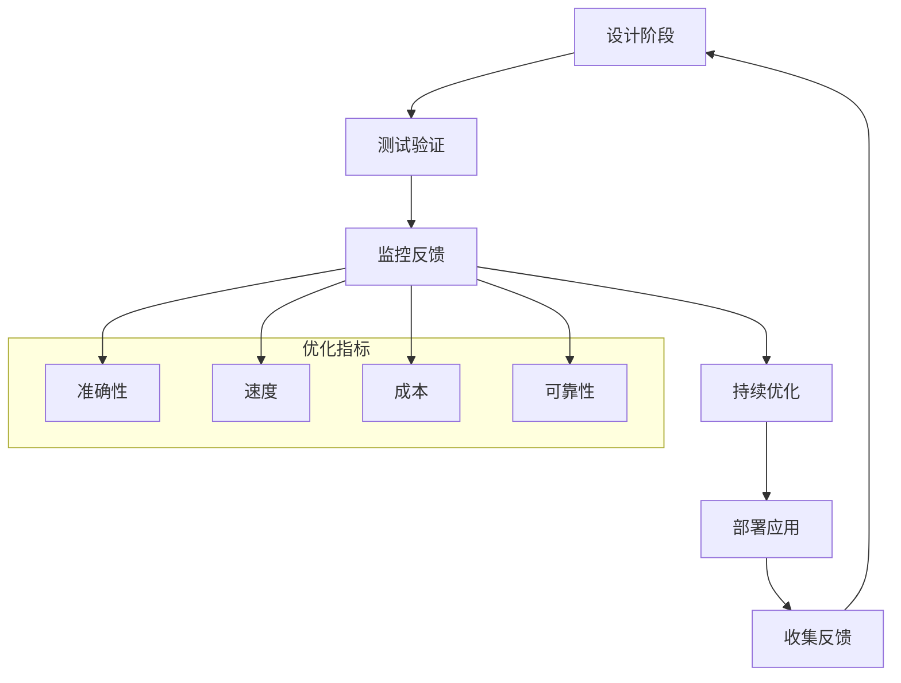

### 开发调试技巧

1. **渐进式测试**：从简单场景开始逐步增加复杂度
2. **日志记录**：详细记录每个阶段的输入输出
3. **单元测试**：为每个提示词组件编写测试用例
4. **A/B测试**：对比不同提示词版本的效果

### 生产环境监控

| 监控指标 | 阈值设置 | 告警策略 | 处理措施 |
|----------|----------|----------|----------|
| 响应时间 | >2秒 | 实时告警 | 自动降级 |
| 错误率 | >5% | 分级告警 | 人工介入 |
| 成功率 | <95% | 立即告警 | 系统回退 |
| 资源使用 | >80% | 预警通知 | 扩容处理 |

### 扩展开发指南

当需要添加新的提示词类型时：

1. **扩展配置文件**：在`llm_prompts.yaml`中添加新配置
2. **更新管理器**：在`PromptManager`中添加相应方法
3. **实现服务层**：创建专门的服务类处理新类型
4. **编写测试**：确保新功能的稳定性
5. **文档更新**：同步更新相关文档

通过遵循这些最佳实践，可以构建出高质量、高可靠性的提示词系统，为用户提供优秀的AI生成体验。