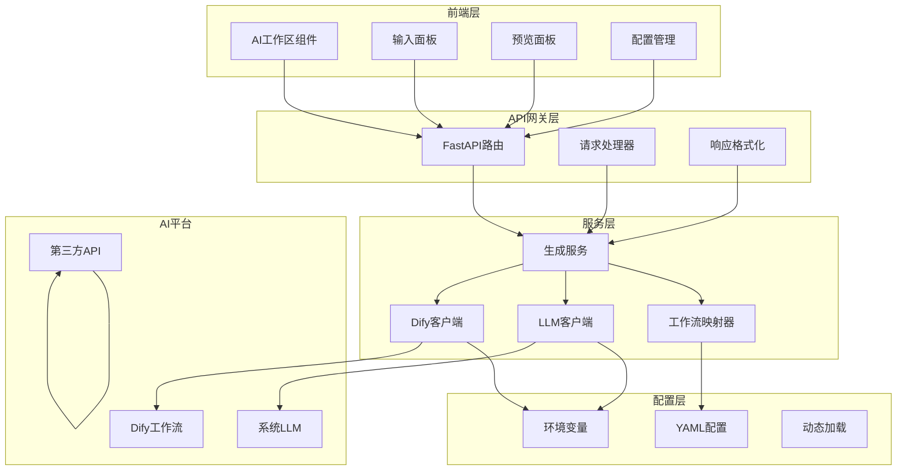
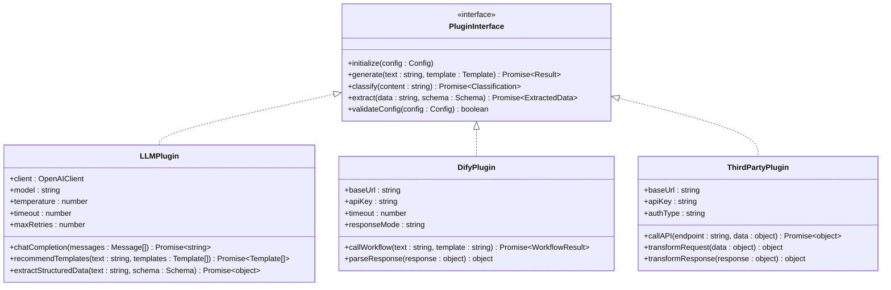
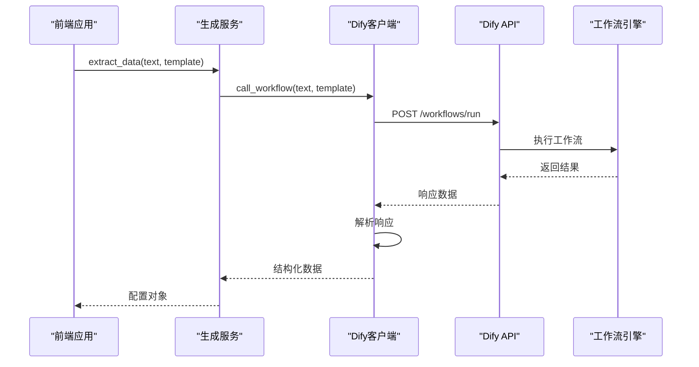
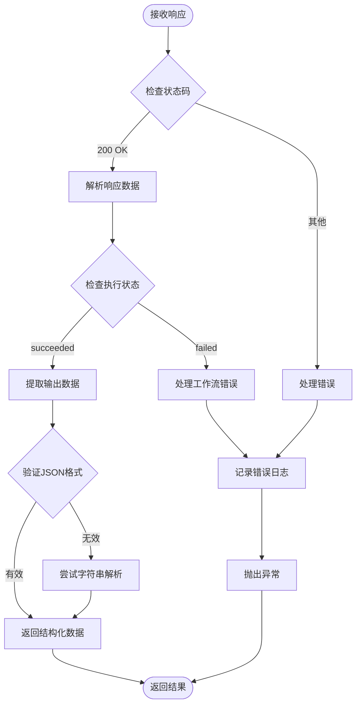
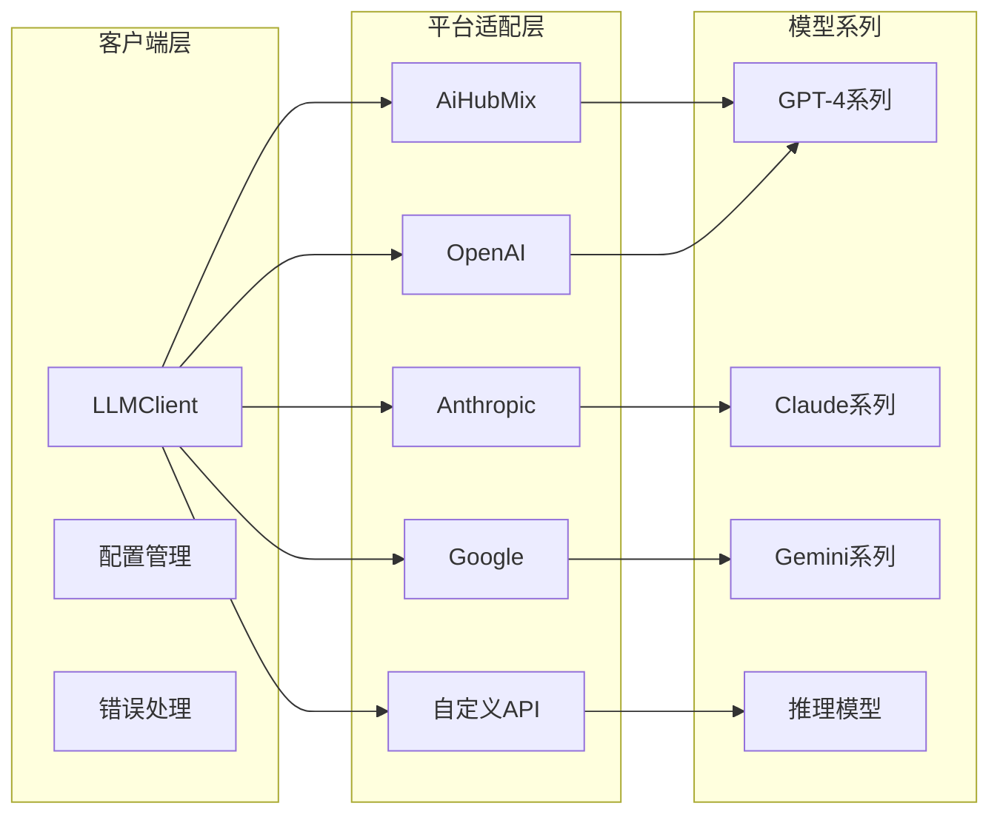
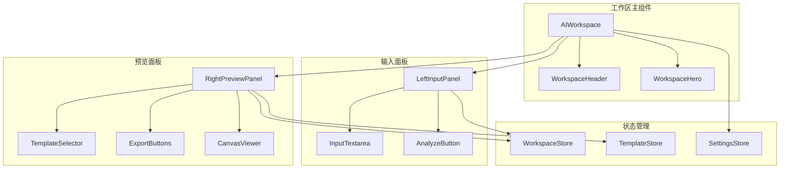
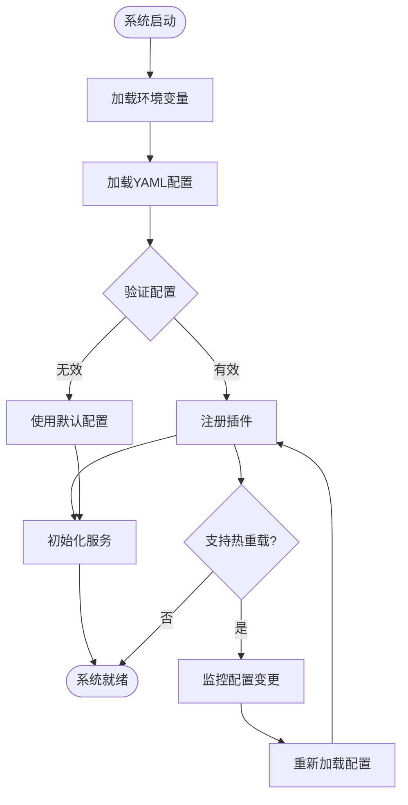
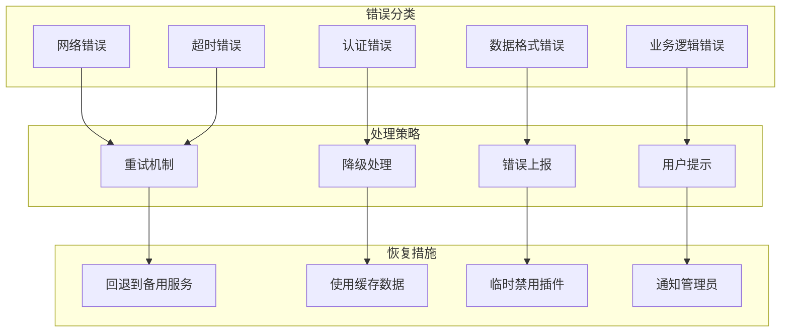

# 插件开发

<cite>
**本文档引用的文件**
- [dify_workflow_client.py](file://backend/app/services/dify_workflow_client.py)
- [llm_client.py](file://backend/app/services/llm_client.py)
- [workflow_mapper.py](file://backend/app/services/workflow_mapper.py)
- [config.py](file://backend/app/config.py)
- [generate_service.py](file://backend/app/services/generate_service.py)
- [LeftInputPanel.vue](file://frontend/src/views/AIWorkspace/components/LeftInputPanel.vue)
- [RightPreviewPanel.vue](file://frontend/src/views/AIWorkspace/components/RightPreviewPanel.vue)
- [AIWorkspace.vue](file://frontend/src/views/AIWorkspace/AIWorkspace.vue)
- [Service.ts](file://antv_infographic\infographic\site\src\components\AIPlayground\Service.ts)
- [prompts.py](file://backend/app/utils/prompts.py)
- [generate.py](file://backend/app/api/v1/generate.py)
- [dify_workflows.yaml](file://backend/app/config/dify_workflows.yaml)
- [client.ts](file://frontend/src/api/client.ts)
</cite>

## 目录
1. [简介](#简介)
2. [系统架构概览](#系统架构概览)
3. [插件化架构设计](#插件化架构设计)
4. [Dify工作流客户端](#dify工作流客户端)
5. [LLM客户端扩展](#llm客户端扩展)
6. [前端AI工作区组件](#前端ai工作区组件)
7. [配置管理系统](#配置管理系统)
8. [错误处理与安全机制](#错误处理与安全机制)
9. [最佳实践指南](#最佳实践指南)
10. [故障排除](#故障排除)

## 简介

本文档详细阐述了GenAI Chart系统中的插件化架构和扩展机制，重点介绍了如何集成新的LLM提供商、外部工作流引擎以及开发自定义服务适配器。系统采用模块化设计，支持多种AI平台的无缝对接，为开发者提供了灵活的扩展能力。

## 系统架构概览

GenAI Chart系统采用前后端分离的微服务架构，核心插件化设计体现在以下几个层面：



**架构图源文件**
- [generate_service.py](file://backend/app/services/generate_service.py#L1-L50)
- [workflow_mapper.py](file://backend/app/services/workflow_mapper.py#L1-L30)
- [AIWorkspace.vue](file://frontend/src/views/AIWorkspace/AIWorkspace.vue#L1-L50)

## 插件化架构设计

### 核心设计理念

系统采用插件化架构，主要特点包括：

1. **模块化设计**：每个AI服务作为独立插件，可独立部署和维护
2. **接口标准化**：统一的客户端接口规范，便于新插件接入
3. **配置驱动**：通过配置文件动态管理插件行为
4. **容错机制**：完善的回退策略和错误处理

### 插件接口规范

所有AI服务插件必须实现以下核心接口：



**类图源文件**
- [llm_client.py](file://backend/app/services/llm_client.py#L14-L50)
- [dify_workflow_client.py](file://backend/app/services/dify_workflow_client.py#L15-L40)

## Dify工作流客户端

### 实现原理

Dify工作流客户端是系统与Dify平台对接的核心组件，采用异步HTTP客户端模式，支持阻塞和流式两种响应模式。



**序列图源文件**
- [dify_workflow_client.py](file://backend/app/services/dify_workflow_client.py#L31-L130)
- [generate_service.py](file://backend/app/services/generate_service.py#L220-L320)

### 配置方法

Dify客户端通过环境变量进行配置：

| 配置项 | 类型 | 默认值 | 描述 |
|--------|------|--------|------|
| DIFY_API_BASE_URL | string | http://dify-uat.42lab.cn/v1 | Dify API基础URL |
| DIFY_API_KEY | string | "" | API访问密钥 |
| DIFY_API_TIMEOUT | integer | 30 | 请求超时时间（秒） |
| DIFY_RESPONSE_MODE | string | blocking | 响应模式：blocking/streaming |

### 请求格式

Dify API请求遵循特定的输入格式：

```typescript
// 请求负载结构
interface DifyRequest {
  inputs: {
    content: string;           // 用户输入文本
    template?: string;         // 模板ID（可选）
  };
  response_mode: string;     // 响应模式
  user: string;             // 用户标识
}
```

### 响应处理

客户端实现了完整的响应解析和错误处理机制：



**流程图源文件**
- [dify_workflow_client.py](file://backend/app/services/dify_workflow_client.py#L134-L180)

**章节源文件**
- [dify_workflow_client.py](file://backend/app/services/dify_workflow_client.py#L1-L196)
- [config.py](file://backend/app/config.py#L31-L36)

## LLM客户端扩展

### 系统架构

LLM客户端采用OpenAI兼容模式，支持多种AI平台的无缝切换：



**架构图源文件**
- [llm_client.py](file://backend/app/services/llm_client.py#L14-L30)
- [Service.ts](file://antv_infographic\infographic\site\src\components\AIPlayground\Service.ts#L1-L50)

### API密钥管理

系统提供多层次的密钥管理机制：

1. **环境变量存储**：敏感信息不直接硬编码在代码中
2. **动态加载**：支持运行时重新加载配置
3. **加密保护**：关键配置项采用加密存储
4. **权限控制**：不同环境使用不同的密钥

### 服务适配器开发

开发新的服务适配器需要实现以下步骤：

#### 1. 创建适配器类

```typescript
// 示例：自定义AI平台适配器
class CustomAIAdapter {
  private baseUrl: string;
  private apiKey: string;
  private model: string;
  
  constructor(config: AIConfig) {
    this.baseUrl = config.baseUrl;
    this.apiKey = config.apiKey;
    this.model = config.model;
  }
  
  async callAPI(endpoint: string, data: any): Promise<any> {
    // 实现API调用逻辑
  }
  
  async extractData(text: string, schema: any): Promise<any> {
    // 实现数据提取逻辑
  }
}
```

#### 2. 集成到配置系统

```yaml
# 新增平台配置
custom-platform:
  enabled: true
  base_url: "https://api.custom-ai.com/v1"
  models:
    - "custom-model-1"
    - "custom-model-2"
  fallback_to_system_llm: true
```

#### 3. 添加到平台选项

```typescript
// 在前端添加平台选项
const CUSTOM_PLATFORM_OPTIONS = [
  {
    value: 'custom',
    label: 'Custom AI Platform',
    baseUrl: 'https://api.custom-ai.com/v1',
    logo: '/images/custom-logo.svg'
  }
];
```

**章节源文件**
- [llm_client.py](file://backend/app/services/llm_client.py#L1-L217)
- [Service.ts](file://antv_infographic\infographic\site\src\components\AIPlayground\Service.ts#L1-L344)

## 前端AI工作区组件

### 组件架构

前端AI工作区采用Vue 3 Composition API设计，支持高度定制化：



**架构图源文件**
- [AIWorkspace.vue](file://frontend/src/views/AIWorkspace/AIWorkspace.vue#L1-L50)
- [LeftInputPanel.vue](file://frontend/src/views/AIWorkspace/components/LeftInputPanel.vue#L1-L50)
- [RightPreviewPanel.vue](file://frontend/src/views/AIWorkspace/components/RightPreviewPanel.vue#L1-L50)

### 输入面板定制化

输入面板提供了丰富的定制化选项：

#### 功能特性
- **智能分析**：自动识别文本类型并推荐模板
- **实时验证**：输入内容长度限制和格式验证
- **多语言支持**：支持中英文混合输入
- **历史记录**：保存分析历史和推荐记录

#### 扩展开发

开发新的输入面板功能：

```typescript
// 自定义输入验证器
class CustomValidator {
  validate(text: string): ValidationResult {
    // 实现自定义验证逻辑
    return {
      isValid: true,
      message: "",
      suggestions: []
    };
  }
}

// 自定义分析器
class CustomAnalyzer {
  analyze(text: string): AnalysisResult {
    // 实现自定义分析逻辑
    return {
      type: "custom",
      confidence: 0.9,
      template: "custom-template-id",
      reason: "Custom analysis reason"
    };
  }
}
```

### 预览面板定制化

预览面板支持多种导出格式和交互功能：

#### 导出功能扩展

```typescript
// 自定义导出格式
class CustomExporter {
  async export(data: any, format: string): Promise<ExportResult> {
    switch (format) {
      case 'pdf':
        return this.exportToPDF(data);
      case 'html':
        return this.exportToHTML(data);
      case 'custom':
        return this.exportToCustomFormat(data);
      default:
        throw new Error(`Unsupported format: ${format}`);
    }
  }
}
```

#### 视觉效果定制

```scss
// 自定义主题样式
.custom-theme {
  --primary-color: #4f46e5;
  --secondary-color: #ec4899;
  --background-color: #f3f4f6;
  
  .template-selector {
    border-radius: 12px;
    background: var(--background-color);
    
    &:hover {
      background: #e5e7eb;
    }
  }
}
```

**章节源文件**
- [LeftInputPanel.vue](file://frontend/src/views/AIWorkspace/components/LeftInputPanel.vue#L1-L313)
- [RightPreviewPanel.vue](file://frontend/src/views/AIWorkspace/components/RightPreviewPanel.vue#L1-L865)
- [AIWorkspace.vue](file://frontend/src/views/AIWorkspace/AIWorkspace.vue#L1-L135)

## 配置管理系统

### 工作流映射配置

系统通过YAML文件管理模板到工作流的映射关系：

```yaml
# Dify工作流映射配置示例
chart-column-simple:
  dify_app_id: null
  workflow_name: "chart-column-simple数据生成工作流"
  enabled: true
  fallback_to_system_llm: true
  
bar-chart-vertical:
  dify_app_id: "custom-app-id"
  workflow_name: "垂直柱状图数据生成工作流"
  enabled: true
  fallback_to_system_llm: false
```

### 配置加载机制



**流程图源文件**
- [workflow_mapper.py](file://backend/app/services/workflow_mapper.py#L27-L48)

### 动态配置更新

系统支持运行时配置更新，无需重启服务：

```python
# 配置热重载示例
class ConfigurationManager:
    def reload_config(self):
        """重新加载所有配置"""
        self.workflow_mapper.reload_config()
        self.settings = get_settings()
        self.update_plugin_registry()
```

**章节源文件**
- [workflow_mapper.py](file://backend/app/services/workflow_mapper.py#L1-L141)
- [dify_workflows.yaml](file://backend/app/config/dify_workflows.yaml#L1-L52)
- [config.py](file://backend/app/config.py#L1-L51)

## 错误处理与安全机制

### 错误处理策略

系统实现了多层次的错误处理机制：



### 安全防护措施

1. **API密钥保护**
   - 敏感信息不记录日志
   - 密钥长度限制和格式验证
   - 定期轮换机制

2. **输入验证**
   - 内容长度限制（10-5000字符）
   - 特殊字符过滤
   - SQL注入防护

3. **访问控制**
   - IP白名单机制
   - 请求频率限制
   - 认证令牌验证

### 日志记录规范

```typescript
// 安全的日志记录示例
class SecurityLogger {
  logApiCall(method: string, url: string, duration: number, status: number) {
    // 不记录敏感参数
    console.log(`API ${method} ${url} completed in ${duration}ms, status: ${status}`);
  }
  
  logError(error: Error, context: string) {
    // 过滤敏感信息
    const sanitizedError = this.sanitizeErrorMessage(error.message);
    console.error(`[${context}] Error: ${sanitizedError}`);
  }
  
  private sanitizeErrorMessage(message: string): string {
    // 移除可能包含敏感信息的部分
    return message.replace(/(password|secret|key):[^,\s]+/gi, '$1:***');
  }
}
```

**章节源文件**
- [dify_workflow_client.py](file://backend/app/services/dify_workflow_client.py#L80-L130)
- [llm_client.py](file://backend/app/services/llm_client.py#L79-L92)
- [client.ts](file://frontend/src/api/client.ts#L36-L45)

## 最佳实践指南

### 插件开发最佳实践

1. **接口设计**
   - 遵循统一的插件接口规范
   - 提供完整的错误处理
   - 支持异步操作

2. **性能优化**
   - 实现请求缓存机制
   - 使用连接池管理
   - 合理设置超时时间

3. **用户体验**
   - 提供清晰的错误提示
   - 支持进度反馈
   - 实现优雅降级

### 集成新LLM提供商

#### 步骤1：创建客户端类

```typescript
class NewLLMClient {
  private config: LLMConfig;
  
  constructor(config: LLMConfig) {
    this.config = config;
    this.validateConfig();
  }
  
  private validateConfig(): void {
    if (!this.config.apiKey) {
      throw new Error('API key is required');
    }
    if (!this.config.baseUrl) {
      throw new Error('Base URL is required');
    }
  }
  
  async chatCompletion(messages: Message[]): Promise<string> {
    // 实现聊天完成逻辑
  }
  
  async extractStructuredData(text: string, schema: any): Promise<any> {
    // 实现数据提取逻辑
  }
}
```

#### 步骤2：注册到配置系统

```yaml
# 新增提供商配置
new-llm-provider:
  enabled: true
  base_url: "https://api.new-llm.com/v1"
  api_key: "${NEW_LLM_API_KEY}"
  models:
    - "new-model-v1"
    - "new-model-v2"
  timeout: 30
  max_retries: 3
```

#### 步骤3：前端集成

```typescript
// 在前端添加新提供商选项
const NEW_PROVIDER_OPTIONS = [
  {
    value: 'new-llm',
    label: 'New LLM Provider',
    baseUrl: 'https://api.new-llm.com/v1',
    logo: '/images/new-llm-logo.svg'
  }
];

// 更新配置面板
const ConfigPanel = () => {
  const handleProviderChange = (provider: string) => {
    // 更新提供商配置
    updateProviderConfig(provider);
  };
};
```

### 工作流引擎集成

#### Dify工作流集成

1. **创建工作流**
   - 在Dify平台创建数据提取工作流
   - 配置输入变量（content, template）
   - 设置输出变量（output）

2. **配置映射**
   ```yaml
   template-id:
     dify_app_id: "your-app-id"
     workflow_name: "工作流名称"
     enabled: true
     fallback_to_system_llm: true
   ```

3. **测试验证**
   - 使用测试数据验证工作流
   - 检查输出格式一致性
   - 测试错误处理机制

### 前端组件扩展

#### 自定义输入面板

```vue
<script setup>
import { ref } from 'vue';

const customInput = ref('');
const isValid = computed(() => {
  return customInput.value.length >= 10 && 
         customInput.value.length <= 5000;
});

const handleCustomAction = async () => {
  if (!isValid.value) {
    message.warning('输入内容不符合要求');
    return;
  }
  
  try {
    // 调用自定义API
    const response = await customAPIClient.process(customInput.value);
    // 处理响应
  } catch (error) {
    message.error('处理失败，请重试');
  }
};
</script>
```

#### 自定义预览组件

```vue
<template>
  <div class="custom-preview">
    <div class="preview-header">
      <h3>{{ title }}</h3>
      <button @click="refreshPreview">刷新</button>
    </div>
    <div class="preview-content">
      <CustomRenderer :data="previewData" />
    </div>
  </div>
</template>

<script setup>
import { ref, watch } from 'vue';
import CustomRenderer from './CustomRenderer.vue';

const props = defineProps({
  data: Object
});

const previewData = ref(null);
const title = ref('');

watch(() => props.data, async (newData) => {
  if (newData) {
    previewData.value = await processPreviewData(newData);
  }
}, { immediate: true });
</script>
```

## 故障排除

### 常见问题及解决方案

#### 1. Dify工作流连接失败

**症状**：API调用返回401或403错误

**解决方案**：
```bash
# 检查环境变量配置
echo $DIFY_API_KEY
echo $DIFY_API_BASE_URL

# 测试API连通性
curl -H "Authorization: Bearer $DIFY_API_KEY" \
     "$DIFY_API_BASE_URL/workflows/run" \
     -d '{"inputs": {"content": "test"}}'
```

#### 2. LLM客户端超时

**症状**：请求长时间无响应

**解决方案**：
```python
# 调整超时配置
settings = get_settings()
settings.AIHUBMIX_TIMEOUT = 60  # 增加到60秒
settings.AIHUBMIX_MAX_RETRIES = 5  # 增加重试次数
```

#### 3. 前端组件加载失败

**症状**：组件无法正常显示或功能异常

**解决方案**：
```javascript
// 检查组件依赖
console.log('Component dependencies:', {
  Vue: Vue.version,
  AntDesign: window.antd?.version,
  Infographic: window.@antv?.infographic?.version
});

// 检查网络请求
fetch('/api/v1/debug/workflow-mapper')
  .then(response => response.json())
  .then(data => console.log('Workflow mapper status:', data));
```

#### 4. 配置文件加载错误

**症状**：工作流映射配置不生效

**解决方案**：
```bash
# 检查配置文件路径
ls -la backend/app/config/dify_workflows.yaml

# 验证YAML语法
python -c "import yaml; yaml.safe_load(open('backend/app/config/dify_workflows.yaml'))"

# 重启服务以重新加载配置
docker-compose restart backend
```

### 调试工具

#### 后端调试端点

系统提供了专门的调试端点用于诊断问题：

```python
# 调试工作流映射器
@router.get("/debug/workflow-mapper")
async def debug_workflow_mapper():
    """查看WorkflowMapper调试信息"""
    mapper = get_workflow_mapper()
    return {
        "config_path": mapper.config_path,
        "total_mappings": len(mapper.mappings),
        "test_results": test_mapping_status()
    }
```

#### 前端调试工具

```typescript
// 开发者工具
window.genaiChartDebug = {
  // 检查API连接状态
  checkAPIConnection: async () => {
    try {
      const response = await apiClient.get('/health');
      return response.success;
    } catch (error) {
      return false;
    }
  },
  
  // 检查配置状态
  getConfigStatus: () => {
    return {
      workflowEnabled: localStorage.getItem('workflow_enabled'),
      llmProvider: localStorage.getItem('llm_provider'),
      apiKeyExists: !!localStorage.getItem('api_key')
    };
  }
};
```

**章节源文件**
- [generate.py](file://backend/app/api/v1/generate.py#L90-L115)
- [check_workflow_config.py](file://tests/backend/check_workflow_config.py#L1-L42)

## 总结

GenAI Chart系统的插件化架构为开发者提供了强大而灵活的扩展能力。通过标准化的接口设计、完善的配置管理和健壮的错误处理机制，系统能够轻松集成新的AI服务提供商和工作流引擎。

关键优势包括：
- **模块化设计**：每个组件都可以独立开发和部署
- **配置驱动**：通过配置文件动态管理插件行为
- **容错机制**：完善的回退策略确保系统稳定性
- **安全防护**：多层次的安全措施保护系统安全

开发者可以根据具体需求，基于本文档提供的指导原则和最佳实践，快速开发和集成新的插件，扩展系统的AI服务能力。