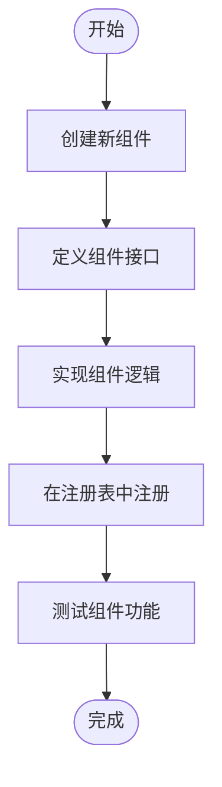
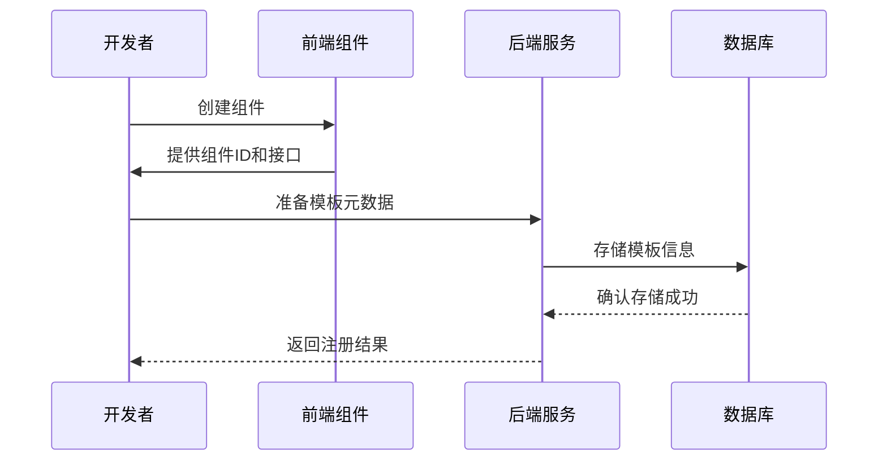
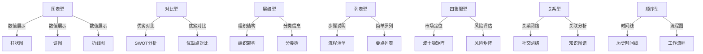
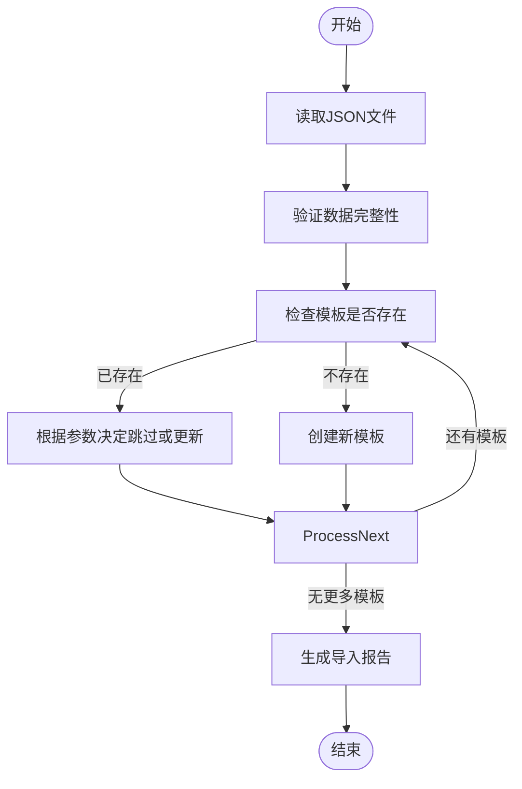
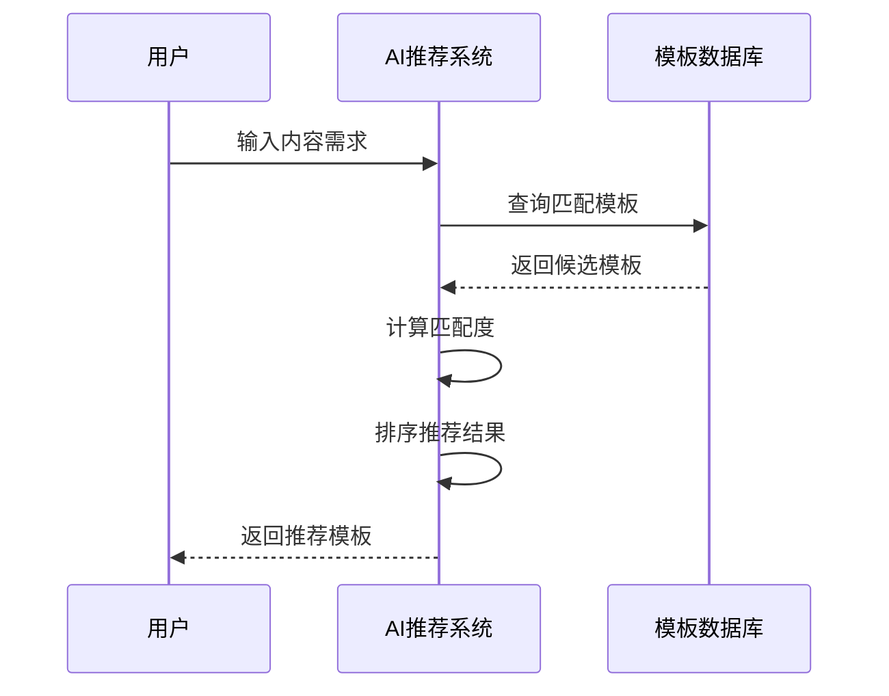
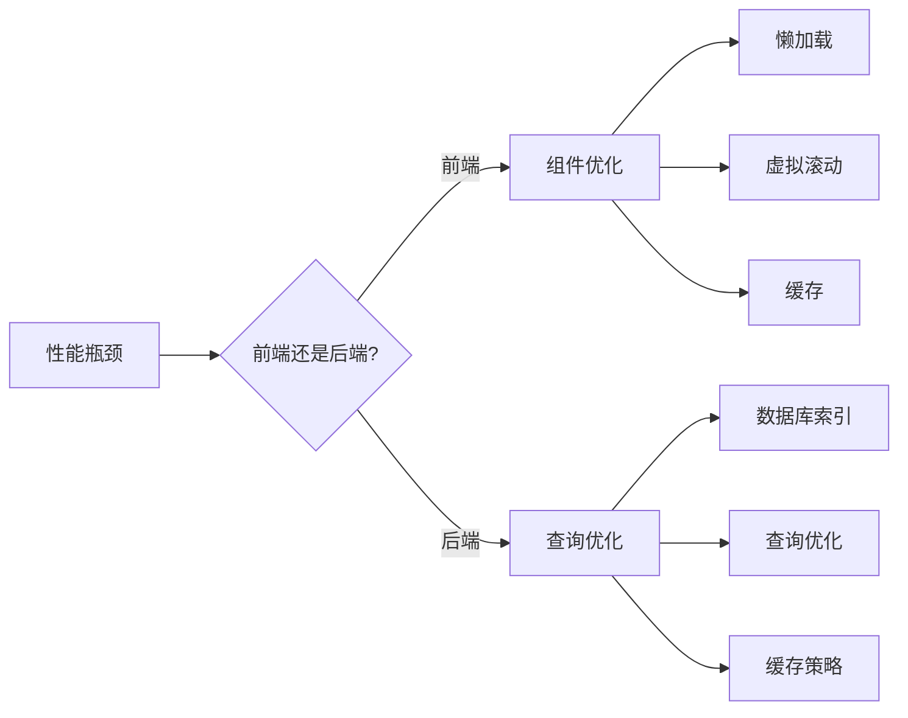

# 模板扩展

<cite>
**本文档引用的文件**  
- [template.py](file://backend/app/models/template.py)
- [template_service.py](file://backend/app/services/template_service.py)
- [template_repo.py](file://backend/app/repositories/template_repo.py)
- [import_templates.py](file://backend/scripts/import_templates.py)
- [registry.ts](file://antv_infographic/infographic/src/designs/items/registry.ts)
- [structures](file://antv_infographic/infographic/src/designs/structures)
- [items](file://antv_infographic/infographic/src/designs/items)
</cite>

## 目录
1. [引言](#引言)
2. [前端组件开发](#前端组件开发)
3. [后端模板注册](#后端模板注册)
4. [模板元数据定义](#模板元数据定义)
5. [数据库导入脚本](#数据库导入脚本)
6. [AI推荐系统集成](#ai推荐系统集成)
7. [常见问题排查](#常见问题排查)
8. [性能优化建议](#性能优化建议)
9. [总结](#总结)

## 引言
本文档详细说明了如何为AntV Infographic系统添加新的信息图模板。涵盖从前端结构组件和基础元素的开发，到后端模板注册机制的完整流程。文档还介绍了模板与AI推荐系统的集成方式，并提供了常见问题的解决方案和性能优化建议。

## 前端组件开发

### 结构组件（Structures）创建
结构组件是信息图的骨架，定义了整体布局和组织方式。在AntV Infographic中，结构组件位于`antv_infographic/infographic/src/designs/structures`目录下。

创建新的结构组件需要遵循以下步骤：
1. 在`structures`目录下创建新的组件文件夹
2. 实现组件的核心布局逻辑
3. 定义组件的配置接口
4. 在注册表中注册新组件

结构组件通常处理数据的层级关系、排列方式和整体布局，如列表、树形结构、矩阵等。

**Section sources**
- [structures](file://antv_infographic/infographic/src/designs/structures)

### 基础元素（Items）创建
基础元素是信息图中的最小可视化单元，用于展示具体的数据内容。基础元素位于`antv_infographic/infographic/src/designs/items`目录下。

创建新的基础元素需要：
1. 在`items`目录下创建新的元素文件
2. 设计元素的视觉表现
3. 定义元素的数据绑定接口
4. 实现元素的交互逻辑

基础元素包括卡片、图标、进度条等，它们可以被不同的结构组件复用。

**Section sources**
- [items](file://antv_infographic/infographic/src/designs/items)

### 组件注册机制
所有结构组件和基础元素都需要在相应的注册表中进行注册，以便系统能够识别和使用它们。



**Diagram sources**
- [registry.ts](file://antv_infographic/infographic/src/designs/items/registry.ts)
- [structures](file://antv_infographic/infographic/src/designs/structures)

## 后端模板注册

### 模板注册流程
后端模板注册是将前端组件与业务逻辑关联的关键步骤。注册流程包括：
1. 创建模板元数据
2. 定义数据结构Schema
3. 配置设计参数
4. 将模板信息存入数据库



**Diagram sources**
- [template_service.py](file://backend/app/services/template_service.py)
- [template.py](file://backend/app/models/template.py)

## 模板元数据定义

### 元数据结构
模板元数据包含模板的基本信息和配置参数，主要字段包括：

| 字段 | 类型 | 必填 | 描述 |
|------|------|------|------|
| id | 字符串 | 是 | 模板唯一标识 |
| name | 字符串 | 是 | 模板名称（中文） |
| category | 字符串 | 是 | 分类（7类之一） |
| structure_type | 字符串 | 是 | AntV structure类型 |
| description | 文本 | 否 | 模板描述 |
| keywords | 文本 | 否 | 关键词列表（逗号分隔） |
| use_cases | 文本 | 否 | 适用场景说明 |
| preview_url | 字符串 | 否 | 预览图URL |
| data_schema | JSON | 是 | 数据结构Schema |
| design_config | JSON | 是 | AntV设计配置 |
| tags | JSON | 否 | 标签数组 |
| sort_order | 整数 | 否 | 排序权重 |
| is_active | 布尔值 | 否 | 是否启用 |

**Section sources**
- [template.py](file://backend/app/models/template.py)

### 分类字段
系统支持7种主要分类，每种分类对应不同的信息展示方式：



**Diagram sources**
- [template_repo.py](file://backend/app/repositories/template_repo.py)

## 数据库导入脚本

### 导入脚本使用
`import_templates.py`脚本用于将模板数据从JSON文件导入数据库。使用方法如下：

```bash
python import_templates.py templates.json [--force]
```

其中`--force`参数用于强制更新已存在的模板。

### 脚本执行流程


**Diagram sources**
- [import_templates.py](file://backend/scripts/import_templates.py)

### 数据验证规则
脚本在导入前会验证模板数据的完整性，主要验证规则包括：

1. **必填字段检查**：确保id、name、category、data_schema、design_config等字段存在
2. **分类有效性**：验证category字段是否为7个有效分类之一
3. **JSON格式**：确保data_schema和design_config为有效的JSON格式
4. **唯一性**：通过id字段确保模板的唯一性

**Section sources**
- [import_templates.py](file://backend/scripts/import_templates.py)

## AI推荐系统集成

### 推荐机制
新模板需要能够被AI推荐系统识别和推荐。系统通过以下方式实现智能推荐：

1. **关键词匹配**：基于模板的keywords和use_cases字段进行匹配
2. **分类推荐**：根据用户选择的分类推荐相关模板
3. **使用频率**：优先推荐使用频率高的模板
4. **内容分析**：通过分析用户输入的内容，智能匹配最适合的模板

### 集成要求
为确保新模板能被智能推荐，需要满足以下要求：

1. **完善关键词**：提供准确的关键词列表
2. **详细描述**：填写清晰的模板描述和适用场景
3. **正确分类**：选择最合适的分类
4. **标签优化**：添加有意义的标签



**Diagram sources**
- [template_service.py](file://backend/app/services/template_service.py)
- [template_repo.py](file://backend/app/repositories/template_repo.py)

## 常见问题排查

### 渲染异常
当模板出现渲染异常时，可能的原因和解决方案包括：

| 问题现象 | 可能原因 | 解决方案 |
|---------|---------|---------|
| 组件不显示 | 组件未正确注册 | 检查注册表是否包含新组件 |
| 布局错乱 | CSS样式冲突 | 检查组件的样式定义 |
| 图标缺失 | 资源路径错误 | 验证图标资源路径 |
| 文字重叠 | 字体大小不匹配 | 调整字体大小和行高 |

### 数据绑定错误
数据绑定问题通常表现为数据无法正确显示或格式错误：

| 问题现象 | 可能原因 | 解决方案 |
|---------|---------|---------|
| 数据不显示 | 字段名不匹配 | 检查data_schema定义 |
| 类型错误 | 数据类型不一致 | 验证数据类型 |
| 数组越界 | 数据长度不足 | 提供足够的测试数据 |
| 空值处理 | 未处理null值 | 添加空值处理逻辑 |

**Section sources**
- [template.py](file://backend/app/models/template.py)
- [template_service.py](file://backend/app/services/template_service.py)

## 性能优化建议

### 前端优化
1. **组件懒加载**：只在需要时加载组件
2. **虚拟滚动**：对于长列表使用虚拟滚动
3. **缓存机制**：缓存已渲染的组件
4. **代码分割**：按功能分割代码包

### 后端优化
1. **数据库索引**：为常用查询字段添加索引
2. **查询优化**：避免N+1查询问题
3. **缓存策略**：使用Redis缓存热门模板
4. **分页处理**：大数据集使用分页查询



**Diagram sources**
- [template_service.py](file://backend/app/services/template_service.py)
- [template_repo.py](file://backend/app/repositories/template_repo.py)

## 总结
本文档详细介绍了为AntV Infographic系统添加新模板的完整流程。从前端组件的开发到后端模板的注册，再到与AI推荐系统的集成，提供了全面的指导。通过遵循本文档的步骤，开发者可以高效地扩展系统功能，同时确保新模板的质量和性能。