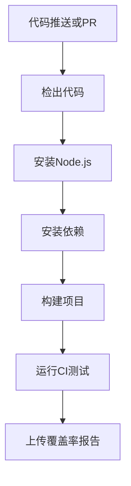
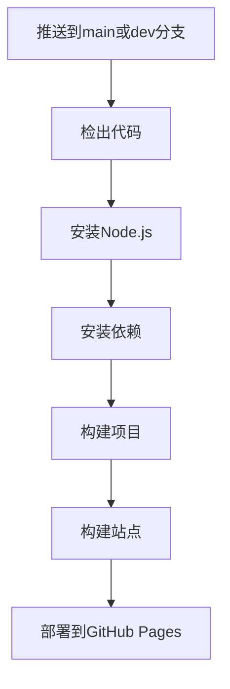

# 贡献规范

<cite>
**本文档引用的文件**  
- [package.json](file://antv_infographic/infographic/package.json)
- [eslint.config.ts](file://antv_infographic/infographic/eslint.config.ts)
- [tsconfig.json](file://antv_infographic/infographic/tsconfig.json)
- [vitest.config.ts](file://antv_infographic/infographic/vitest.config.ts)
- [.github/workflows/build.yml](file://antv_infographic/infographic/.github/workflows/build.yml)
- [.github/workflows/deploy.yml](file://antv_infographic/infographic/.github/workflows/deploy.yml)
- [.prettierrc](file://antv_infographic/infographic/site/.prettierrc)
- [README.md](file://README.md)
- [Dockerfile](file://backend/Dockerfile)
- [docker-compose.yml](file://docker-compose.yml)
</cite>

## 目录
1. [简介](#简介)
2. [分支管理策略](#分支管理策略)
3. [代码风格要求](#代码风格要求)
4. [测试覆盖率与CI/CD流程](#测试覆盖率与cicd流程)
5. [开发环境搭建](#开发环境搭建)
6. [文档更新规范](#文档更新规范)

## 简介

本贡献规范旨在为社区开发者提供清晰的指导，确保所有提交的代码符合项目质量标准。该规范涵盖了分支管理、代码风格、测试要求、CI/CD流程、开发环境配置以及文档维护等方面，帮助贡献者高效地参与项目开发。

## 分支管理策略

本项目采用基于Git的分支管理模型，确保代码变更的有序集成和版本控制。

### 主要分支

- **main**: 主分支，包含已发布或准备发布的稳定代码。所有生产环境部署均基于此分支。
- **dev**: 开发分支，集成所有功能分支的变更，用于日常开发和测试。
- **feature/\***: 功能分支，用于开发新功能或修复特定问题。

### 分支命名规范

所有功能分支必须遵循以下命名约定：

- 功能开发：`feature/功能描述`（例如：`feature/svg-export`）
- Bug修复：`fix/问题描述`（例如：`fix/text-rendering`）
- 文档更新：`docs/更新内容`（例如：`docs/contribution-guide`）
- 性能优化：`perf/优化目标`（例如：`perf/render-speed`）

### 合并请求流程

1. 从`dev`分支创建新的功能分支
2. 在功能分支上完成开发和本地测试
3. 推送分支到远程仓库
4. 在GitHub上创建Pull Request（PR）到`dev`分支
5. PR必须包含：
   - 变更的详细描述
   - 相关的测试用例
   - 影响的模块说明
6. 至少一名核心维护者审查并批准PR
7. CI/CD流水线通过后，PR被合并到`dev`分支
8. 定期将`dev`分支合并到`main`分支进行发布

**Section sources**
- [README.md](file://README.md#L163-L215)
- [.github/workflows/build.yml](file://antv_infographic/infographic/.github/workflows/build.yml#L1-L43)

## 代码风格要求

### TypeScript格式化规则

项目使用Prettier进行代码格式化，配置如下：

- 使用单引号
- 结尾逗号：es5
- 换行宽度：80
- 缩进：2个空格
- 不在括号内添加空格
- 自动组织导入语句

相关配置文件位于`.prettierrc`和`package.json`中。

### 命名约定

- **变量和函数**: 使用驼峰命名法（camelCase）
- **类和接口**: 使用帕斯卡命名法（PascalCase）
- **常量**: 使用大写下划线命名法（UPPER_CASE）
- **组件文件**: 使用帕斯卡命名法（如`InfographicRenderer.tsx`）
- **测试文件**: 文件名以`.test.ts`或`.test.tsx`结尾

### 注释标准

- **文件头部注释**: 包含文件描述、作者和创建日期
- **函数注释**: 使用JSDoc格式，包含参数类型、返回值和功能描述
- **复杂逻辑**: 在关键代码段添加内联注释，解释实现思路
- **待办事项**: 使用`// TODO:`标记需要后续处理的代码
- **警告**: 使用`// FIXME:`标记已知问题

```typescript
/**
 * 渲染SVG元素
 * @param element - 要渲染的JSX元素
 * @param viewBox - 视口配置
 * @returns SVG字符串
 */
function renderSVG(element: JSXElement, viewBox?: ViewBox): string {
  // TODO: 添加错误处理机制
  const svg = document.createElementNS('http://www.w3.org/2000/svg', 'svg');
  // ... 实现细节
  return svg.outerHTML;
}
```

**Section sources**
- [eslint.config.ts](file://antv_infographic/infographic/eslint.config.ts#L1-L28)
- [tsconfig.json](file://antv_infographic/infographic/tsconfig.json#L1-L27)
- [package.json](file://antv_infographic/infographic/package.json#L63-L68)

## 测试覆盖率与CI/CD流程

### 测试覆盖率要求

所有代码提交必须满足以下测试要求：

- **单元测试**: 核心功能必须有相应的单元测试
- **覆盖率**: 新增代码的测试覆盖率不得低于80%
- **集成测试**: 跨模块交互必须有集成测试
- **快照测试**: UI组件必须有快照测试

测试文件位于`__tests__`目录下，按功能模块组织。

### CI/CD流程

项目使用GitHub Actions实现持续集成和持续部署。

#### 构建流程 (`build.yml`)



**Diagram sources**
- [.github/workflows/build.yml](file://antv_infographic/infographic/.github/workflows/build.yml#L1-L43)

#### 部署流程 (`deploy.yml`)



**Diagram sources**
- [.github/workflows/deploy.yml](file://antv_infographic/infographic/.github/workflows/deploy.yml#L1-L56)

### 测试配置

项目使用Vitest作为测试框架，配置如下：

- 测试环境：jsdom
- 覆盖率报告：v8引擎
- 并行执行：支持
- 快照测试：启用

**Section sources**
- [vitest.config.ts](file://antv_infographic/infographic/vitest.config.ts#L1-L13)
- [package.json](file://antv_infographic/infographic/package.json#L56)
- [.github/workflows/build.yml](file://antv_infographic/infographic/.github/workflows/build.yml#L32-L35)

## 开发环境搭建

### 前置要求

- Node.js 18+
- Python 3.11+
- npm或yarn包管理器

### 本地开发配置

#### 使用Docker（推荐）

项目提供完整的Docker配置，一键启动开发环境。

```bash
# 复制环境变量文件
cp .env.example .env

# 编辑.env文件，配置API密钥
# AIHUBMIX_API_KEY=your_api_key

# 启动服务
docker-compose up --build
```

前端服务将运行在`http://localhost`，后端API在`http://localhost:8000`。

#### 手动配置

```bash
# 1. 启动后端服务
cd backend
pip install -r requirements.txt
python scripts/init_db.py
python -m app.main

# 2. 启动前端服务
cd frontend
npm install
npm run dev
```

### 环境变量设置

关键环境变量包括：

- `AIHUBMIX_API_KEY`: LLM服务API密钥
- `AIHUBMIX_BASE_URL`: LLM服务基础URL
- `DATABASE_URL`: 数据库连接字符串
- `DIFY_API_KEY`: Dify工作流API密钥（可选）

### 本地调试方法

- **前端调试**: 使用`npm run dev`启动开发服务器，支持热重载
- **后端调试**: 使用VS Code的调试配置或直接运行`python -m app.main`
- **API文档**: 访问`http://localhost:8000/docs`查看自动生成的API文档
- **日志查看**: 后端服务会输出详细日志，便于问题排查

**Section sources**
- [docker-compose.yml](file://docker-compose.yml#L1-L55)
- [Dockerfile](file://backend/Dockerfile#L1-L44)
- [README.md](file://README.md#L27-L108)

## 文档更新规范

### 文档位置

项目文档位于`docs/`目录下，主要文档包括：

- `QUICK_START.md`: 快速入门指南
- `SMART_GENERATION_GUIDE.md`: 智能生成功能详解
- `TEMPLATE_EXPANSION_GUIDE.md`: 模板扩展指南
- `FINAL_COMPLETION_REPORT.md`: 项目完成总结

### 更新要求

- **代码变更**: 任何功能变更必须同步更新相关文档
- **API变更**: 接口修改必须更新API文档和使用示例
- **配置变更**: 环境变量或配置项变化必须更新配置说明
- **新功能**: 新增功能必须提供详细的使用指南

### 文档结构

标准文档应包含以下部分：

1. **功能简介**: 简要描述功能目的和价值
2. **使用方法**: 详细的使用步骤和代码示例
3. **配置选项**: 可配置参数及其说明
4. **常见问题**: 用户可能遇到的问题及解决方案
5. **最佳实践**: 推荐的使用方式和优化建议

文档应保持简洁明了，避免技术术语堆砌，确保新手也能理解。

**Section sources**
- [README.md](file://README.md#L268-L284)
- [docs/QUICK_START.md](file://docs/QUICK_START.md)
- [docs/SMART_GENERATION_GUIDE.md](file://docs/SMART_GENERATION_GUIDE.md)