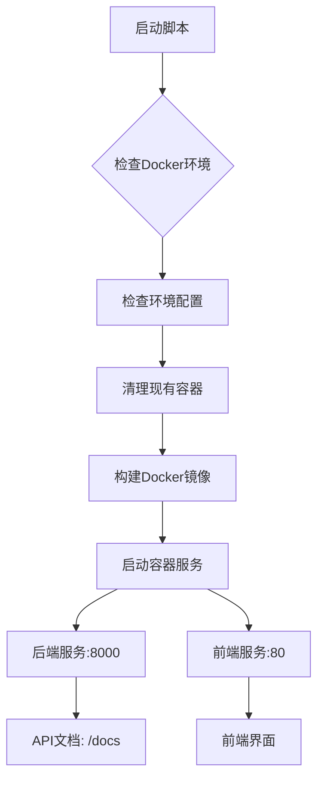
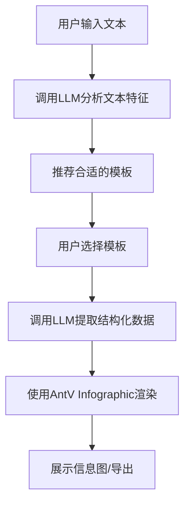
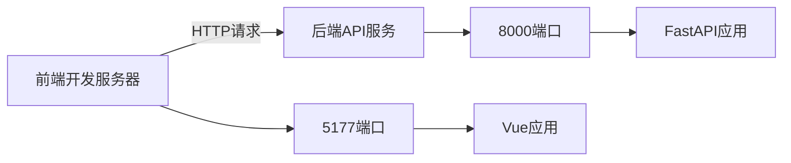

# 快速开始

<cite>
**本文档中引用的文件**
- [README.md](file://README.md)
- [docker-compose.yml](file://docker-compose.yml)
- [start-docker.sh](file://start-docker.sh)
- [start-docker.ps1](file://start-docker.ps1)
- [backend/Dockerfile](file://backend/Dockerfile)
- [frontend/Dockerfile](file://frontend/Dockerfile)
- [backend/.env](file://backend/.env)
- [frontend/package.json](file://frontend/package.json)
- [docs/QUICK_START.md](file://docs/QUICK_START.md)
- [docs/DOCKER_QUICKSTART.md](file://docs/DOCKER_QUICKSTART.md)
- [backend/app/main.py](file://backend/app/main.py)
- [frontend/src/main.ts](file://frontend/src/main.ts)
</cite>

## 目录
1. [简介](#简介)
2. [基于Docker的快速部署](#基于docker的快速部署)
3. [前后端服务启动流程](#前后端服务启动流程)
4. [基础使用示例](#基础使用示例)
5. [常见问题排查](#常见问题排查)
6. [开发者模式启动](#开发者模式启动)
7. [总结](#总结)

## 简介

本指南旨在为用户提供在本地环境部署和运行genai_chart-1应用的详细步骤。该系统是一个基于AntV Infographic和大语言模型的智能信息图生成系统，用户只需输入文本内容，系统会通过AI自动分析并推荐合适的信息图模板，提取结构化数据，最终生成专业的信息图。

系统采用前后端分离架构，前端使用Vue 3 + TypeScript + Vite技术栈，后端使用Python + FastAPI + SQLAlchemy技术栈。本指南将重点介绍基于Docker的完整安装步骤，确保部署过程简单高效。

**Section sources**
- [README.md](file://README.md#L1-L323)

## 基于Docker的快速部署

### 执行启动脚本

本项目提供了针对不同操作系统的Docker启动脚本，可一键完成环境部署。

#### Windows系统

对于Windows用户，使用PowerShell脚本启动：

```bash
# 确保Docker Desktop正在运行
.\start-docker.ps1
```

#### Linux/macOS系统

对于Linux或macOS用户，使用Bash脚本启动：

```bash
# 赋予脚本执行权限
chmod +x start-docker.sh
# 执行启动脚本
./start-docker.sh
```

### 环境变量配置

系统通过环境变量进行配置，主要配置文件为`.env`。启动脚本会自动检查并处理环境配置：

1. 如果根目录下不存在`.env`文件，脚本会从`backend/.env`复制配置
2. 如果`backend/.env`也不存在，脚本会提示用户手动创建并配置API密钥

关键环境变量包括：

- `AIHUBMIX_API_KEY`: AiHubMix API密钥
- `AIHUBMIX_BASE_URL`: AiHubMix API基础URL
- `DIFY_API_KEY`: Dify工作流API密钥（可选）
- `DATABASE_URL`: 数据库连接URL

### 容器编排

系统使用`docker-compose.yml`进行容器编排，定义了前后端两个服务：

```yaml
version: '3.8'

services:
  # 后端服务
  backend:
    build:
      context: .
      dockerfile: backend/Dockerfile
    container_name: genai-chart-backend
    ports:
      - "8000:8000"
    volumes:
      - ./backend:/app
      - ./backend/data:/app/data
      - ./backend/temp:/app/temp
    environment:
      - AIHUBMIX_API_KEY=${AIHUBMIX_API_KEY}
      - AIHUBMIX_BASE_URL=${AIHUBMIX_BASE_URL:-https://aihubmix.com/v1}
      - DATABASE_URL=sqlite:///./data/genai_chart.db
    restart: unless-stopped

  # 前端服务
  frontend:
    build:
      context: .
      dockerfile: frontend/Dockerfile
    container_name: genai-chart-frontend
    ports:
      - "80:80"
    depends_on:
      - backend
    restart: unless-stopped
```

**Section sources**
- [docker-compose.yml](file://docker-compose.yml#L1-L55)
- [start-docker.sh](file://start-docker.sh#L1-L128)
- [start-docker.ps1](file://start-docker.ps1#L1-L134)
- [backend/.env](file://backend/.env#L1-L25)

## 前后端服务启动流程

### 服务启动流程

基于Docker的启动流程如下：

1. **环境检查**: 检查Docker是否安装并正常运行
2. **配置检查**: 检查`.env`环境配置文件是否存在
3. **容器清理**: 停止并移除已存在的容器实例
4. **镜像构建**: 构建前后端Docker镜像
5. **服务启动**: 启动前后端容器服务

### 默认端口配置

系统使用以下默认端口配置：

- **前端服务**: 端口80（映射到主机80端口），访问地址：`http://localhost`
- **后端服务**: 端口8000（映射到主机8000端口），API地址：`http://localhost:8000`

前端Dockerfile配置了Nginx作为静态文件服务器，将构建后的前端应用部署在80端口。后端Dockerfile基于Python 3.11-slim镜像，安装了必要的系统依赖（包括Cairo图形库、中文字体等），并在8000端口启动FastAPI应用。



**Diagram sources**
- [docker-compose.yml](file://docker-compose.yml#L1-L55)
- [backend/Dockerfile](file://backend/Dockerfile#L1-L44)
- [frontend/Dockerfile](file://frontend/Dockerfile#L1-L34)

**Section sources**
- [backend/Dockerfile](file://backend/Dockerfile#L1-L44)
- [frontend/Dockerfile](file://frontend/Dockerfile#L1-L34)

## 基础使用示例

### 访问AI工作区

部署成功后，按照以下步骤生成您的第一个信息图：

1. 打开浏览器访问 `http://localhost`
2. 在左侧输入框中输入文本内容，例如：
   ```
   公司2023年销售数据，Q1：100万，Q2：150万，Q3：120万，Q4：180万
   ```
3. 点击"分析并推荐模板"按钮
4. 系统将调用AI分析文本特征，推荐合适的模板
5. 在右侧实时预览生成的信息图
6. 点击"导出"按钮选择格式（SVG/PNG/PDF/PPTX）
7. 点击"保存"按钮将作品保存到作品库

### 生成流程说明

系统的核心生成流程如下：



**Diagram sources**
- [README.md](file://README.md#L220-L236)

**Section sources**
- [README.md](file://README.md#L110-L119)
- [docs/QUICK_START.md](file://docs/QUICK_START.md#L46-L53)

## 常见问题排查

### 端口冲突

**问题**: 启动时出现`bind: address already in use`错误

**解决方案**: 修改`docker-compose.yml`中的端口映射：

```yaml
services:
  backend:
    ports:
      - "8001:8000"  # 改为8001
  frontend:
    ports:
      - "8080:80"    # 改为8080
```

### 依赖安装失败

**问题**: Docker构建过程中依赖安装失败

**解决方案**:
1. 检查网络连接，确保可以访问包仓库
2. 清理Docker构建缓存：`docker-compose build --no-cache`
3. 重新执行启动脚本

### 容器无法启动

**排查步骤**:
```bash
# 查看详细日志
docker-compose logs backend
docker-compose logs frontend

# 检查容器状态
docker-compose ps

# 重新构建并启动
docker-compose down
docker-compose build --no-cache
docker-compose up -d
```

### 数据库未初始化

**问题**: 首次运行时数据库未初始化

**解决方案**: 进入后端容器执行初始化脚本：

```bash
# 进入容器
docker-compose exec backend bash
# 初始化数据库
python scripts/init_db.py
# 导入模板
python scripts/import_templates.py
```

**Section sources**
- [docs/DOCKER_QUICKSTART.md](file://docs/DOCKER_QUICKSTART.md#L124-L165)
- [README.md](file://README.md#L239-L263)

## 开发者模式启动

对于开发者，可以采用前后端独立运行的方式进行开发。

### 后端独立运行

```bash
# 进入后端目录
cd backend

# 安装Python依赖
pip install -r requirements.txt

# 初始化数据库（首次运行）
python scripts/init_db.py
python scripts/import_templates.py

# 启动后端服务
python -m app.main
# 或使用uvicorn
uvicorn app.main:app --reload --port 8000
```

### 前端独立运行

```bash
# 进入前端目录
cd frontend

# 安装依赖
npm install

# 启动开发服务器
npm run dev
```

前端开发服务器默认运行在`http://localhost:5177`，而后端服务运行在`http://localhost:8000`。前端通过API调用与后端通信。



**Diagram sources**
- [backend/app/main.py](file://backend/app/main.py#L105-L113)
- [frontend/src/main.ts](file://frontend/src/main.ts#L1-L17)

**Section sources**
- [README.md](file://README.md#L45-L86)
- [README.md](file://README.md#L92-L105)
- [docs/QUICK_START.md](file://docs/QUICK_START.md#L9-L24)
- [docs/QUICK_START.md](file://docs/QUICK_START.md#L30-L42)

## 总结

本指南详细介绍了genai_chart-1应用的本地部署和运行方法。通过Docker部署方式，用户可以快速启动前后端服务，无需复杂的环境配置。系统提供了AI工作区，让用户能够轻松输入文本内容并生成专业信息图。

对于新手用户，推荐使用Docker一键部署方式，简单高效。对于开发者，提供了独立运行前后端的开发模式，便于调试和开发。系统支持多种格式导出（SVG/PNG/PDF/PPTX），并具备作品管理功能，满足不同使用场景的需求。

通过本指南，用户可以快速上手使用该系统，体验AI驱动的信息图生成能力。