# 分类体系

<cite>
**本文档引用的文件**
- [template_repo.py](file://backend/app/repositories/template_repo.py)
- [template_service.py](file://backend/app/services/template_service.py)
- [template.py](file://backend/app/models/template.py)
- [templates.py](file://backend/app/api/v1/templates.py)
- [init_template_categories.py](file://backend/scripts/init_template_categories.py)
- [llm_prompts.yaml](file://backend/app/config/llm_prompts.yaml)
- [prompts.py](file://backend/app/utils/prompts.py)
- [Examples.vue](file://frontend/src/views/Examples/Examples.vue)
- [GalleryPage.tsx](file://antv_infographic\infographic\site\src\components\Gallery\GalleryPage.tsx)
- [constants.ts](file://antv_infographic\infographic\site\src\components\Gallery\constants.ts)
- [add_template_category_fields.py](file://backend/scripts/add_template_category_fields.py)
</cite>

## 目录
1. [概述](#概述)
2. [七大核心分类体系](#七大核心分类体系)
3. [分类元数据结构](#分类元数据结构)
4. [get_categories方法实现](#get_categories方法实现)
5. [分类与模板元数据的关联](#分类与模板元数据的关联)
6. [前端筛选和搜索应用](#前端筛选和搜索应用)
7. [分类体系扩展方法](#分类体系扩展方法)
8. [维护指南](#维护指南)
9. [总结](#总结)

## 概述

GenAI Chart信息图平台采用了一套完整的七大核心分类体系，用于对模板进行科学分类和管理。这套分类体系不仅帮助用户快速找到合适的模板，还为AI智能推荐和内容理解提供了基础支撑。分类体系涵盖了图表型、对比型、层级型、列表型、四象限型、关系型和顺序型七种主要类型，每种类型都有明确的定义、特征和应用场景。

## 七大核心分类体系

### 图表型 (Chart)
**特征**: 包含数值数据、统计信息、量化指标  
**关键词**: 数据、增长率、比例、百分比、趋势、统计、图表、指标  
**适用场景**: 销售数据、用户增长、KPI指标、财务报表、市场分析  
**示例**: "2023年Q1销售额1000万，Q2增长20%"

### 对比型 (Comparison)
**特征**: 两个或多个事物的对比、优劣分析、差异展示  
**关键词**: VS、对比、优劣势、差异、区别、选择、竞争、比较  
**适用场景**: 产品对比、竞品分析、方案比较、优缺点对比  
**示例**: "产品A与产品B的功能对比"

### 层级型 (Hierarchy)
**特征**: 具有上下级、父子关系、分级结构、等级划分、荣誉体系  
**关键词**: 组织架构、层级、分类、体系、级别、树形、上下级、等级、荣誉、会员、徽章、段位、金字塔  
**适用场景**: 公司架构、产品分类、知识体系、职级体系、会员等级、荣誉体系、需求优先级  
**示例**: "公司组织架构：CEO-部门经理-员工" 或 "会员等级：金牌-银牌-铜牌-普通"

### 列表型 (List)
**特征**: 并列的项目、要点、特性、步骤  
**关键词**: 要点、步骤、特性、功能、特点、清单、列举  
**适用场景**: 产品功能、解决方案、服务项目、特性列表  
**示例**: "产品的五大功能：1.智能推荐 2.数据分析..."

### 四象限型 (Quadrant)
**特征**: 两个维度划分，四个区域  
**关键词**: 矩阵、象限、维度、重要紧急、优先级、分类  
**适用场景**: 时间管理矩阵、优先级分类、SWOT分析、风险矩阵  
**示例**: "任务分为重要紧急、重要不紧急、不重要紧急、不重要不紧急"

### 关系型 (Relationship)
**特征**: 元素之间的关联、因果、依赖、影响  
**关键词**: 关系、因果、影响、联系、相关、交互、依赖  
**适用场景**: 因果分析、业务流程、系统架构、关系网络  
**示例**: "用户增长影响因素：产品质量、营销投入、口碑传播"

### 顺序型 (Sequence)
**特征**: 有先后顺序、时间线、流程  
**关键词**: 步骤、流程、过程、顺序、阶段、时间线、发展、历史  
**适用场景**: 操作流程、项目进度、历史进程、用户旅程  
**示例**: "产品开发流程：需求分析-设计-开发-测试-上线"

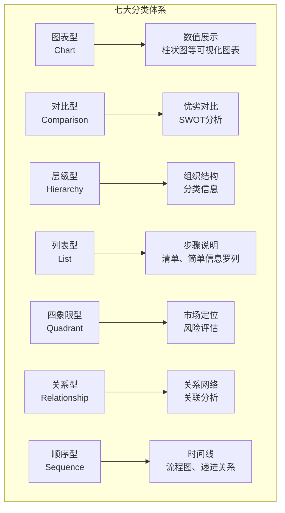

**图表来源**
- [llm_prompts.yaml](file://backend/app/config/llm_prompts.yaml#L18-L81)
- [prompts.py](file://backend/app/utils/prompts.py#L50-L106)

## 分类元数据结构

分类体系采用标准化的元数据结构，包含以下核心字段：

| 字段名 | 类型 | 描述 | 示例值 |
|--------|------|------|--------|
| code | string | 分类代码 | "chart", "comparison", "hierarchy", "list", "quadrant", "relationship", "sequence" |
| name | string | 分类名称 | "图表型", "对比型", "层级型", "列表型", "四象限型", "关系型", "顺序型" |
| description | string | 分类描述 | "数值展示,柱状图等可视化图表" |
| count | integer | 模板数量统计 | 45 |

### 分类代码映射表

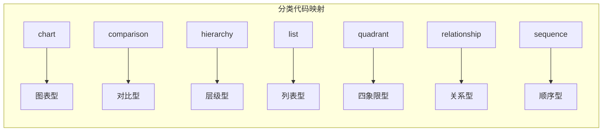

**图表来源**
- [template_repo.py](file://backend/app/repositories/template_repo.py#L112-L120)
- [constants.ts](file://antv_infographic\infographic\site\src\components\Gallery\constants.ts#L1-L9)

**章节来源**
- [template_repo.py](file://backend/app/repositories/template_repo.py#L112-L142)
- [template.py](file://backend/app/models/template.py#L15-L17)

## get_categories方法实现

`get_categories`方法是分类体系的核心接口，负责从数据库获取所有分类及其统计信息。该方法实现了完整的分类查询和统计逻辑。

### 方法架构

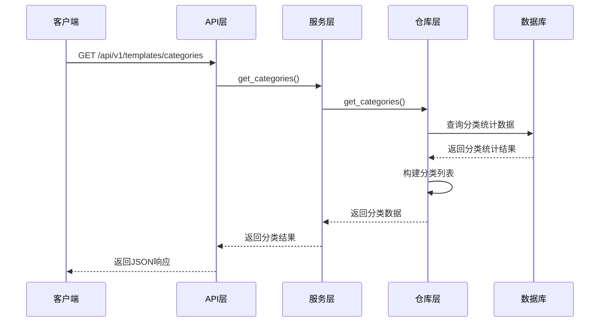

**图表来源**
- [templates.py](file://backend/app/api/v1/templates.py#L42-L57)
- [template_service.py](file://backend/app/services/template_service.py#L237-L249)

### 实现细节

方法的核心实现包含以下关键步骤：

1. **分类定义**: 在代码中静态定义七大分类及其基本信息
2. **统计查询**: 使用SQL查询统计每个分类的模板数量
3. **数据整合**: 将分类定义与统计结果进行合并
4. **结果构建**: 构造标准化的返回数据结构

### 数据库查询逻辑

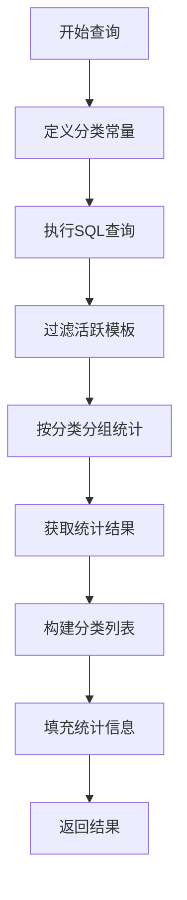

**图表来源**
- [template_repo.py](file://backend/app/repositories/template_repo.py#L104-L142)

**章节来源**
- [template_repo.py](file://backend/app/repositories/template_repo.py#L104-L142)
- [template_service.py](file://backend/app/services/template_service.py#L237-L249)

## 分类与模板元数据的关联

分类体系与模板元数据建立了紧密的关联关系，通过数据库字段和业务逻辑实现数据一致性。

### 数据库关联设计

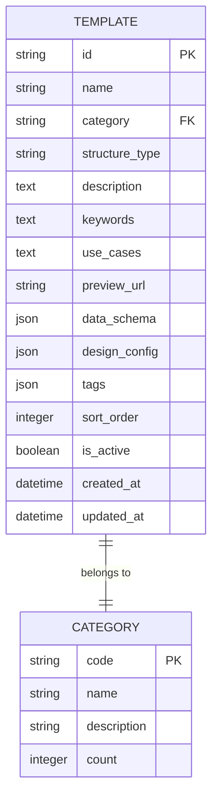

**图表来源**
- [template.py](file://backend/app/models/template.py#L9-L33)

### 自动分类机制

系统实现了智能的自动分类机制，基于模板的结构类型和ID进行自动分类：

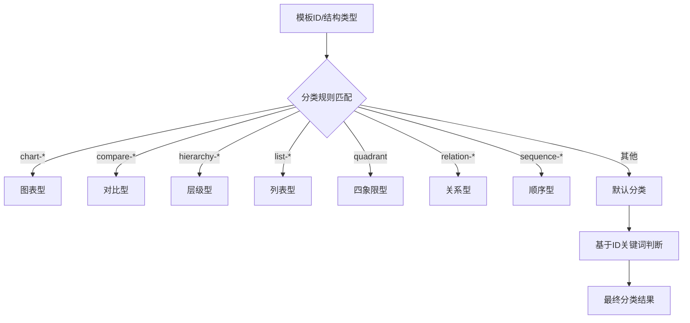

**图表来源**
- [init_template_categories.py](file://backend/scripts/init_template_categories.py#L24-L62)

### 分类更新流程

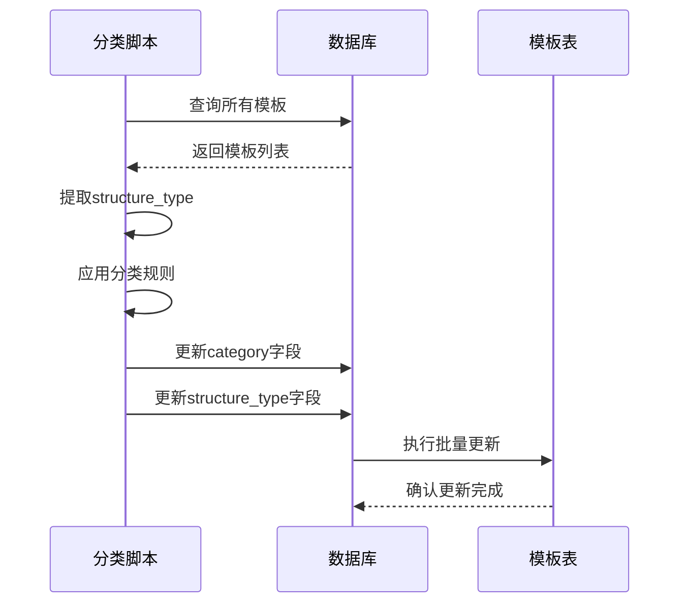

**图表来源**
- [init_template_categories.py](file://backend/scripts/init_template_categories.py#L87-L137)

**章节来源**
- [template.py](file://backend/app/models/template.py#L15-L17)
- [init_template_categories.py](file://backend/scripts/init_template_categories.py#L24-L137)

## 前端筛选和搜索应用

分类体系在前端得到了广泛应用，支持多种筛选和搜索功能。

### Vue.js前端实现

前端使用Vue.js框架实现分类筛选功能：

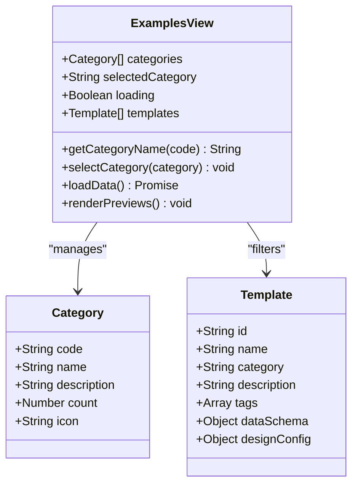

**图表来源**
- [Examples.vue](file://frontend/src/views/Examples/Examples.vue#L169-L202)

### React.js前端实现

React.js版本的Gallery组件提供了类似的筛选功能：

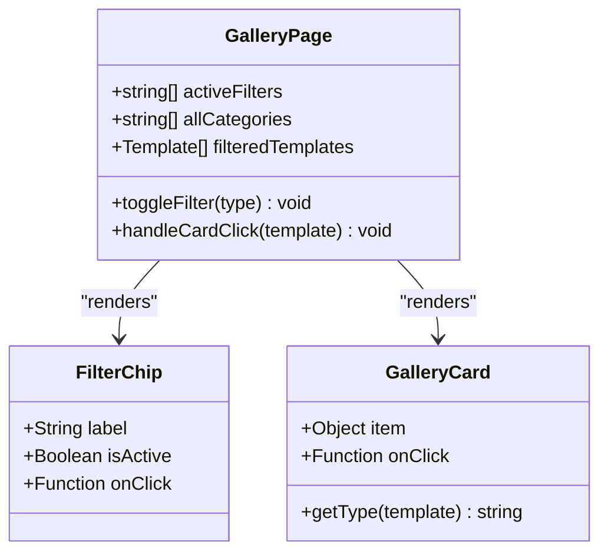

**图表来源**
- [GalleryPage.tsx](file://antv_infographic\infographic\site\src\components\Gallery\GalleryPage.tsx#L129-L255)

### 筛选功能实现

前端筛选功能的核心实现逻辑：

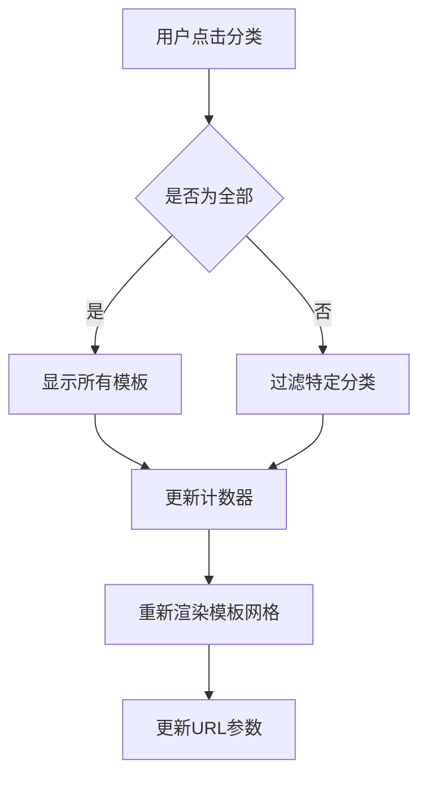

**图表来源**
- [Examples.vue](file://frontend/src/views\Examples\Examples.vue#L222-L230)
- [GalleryPage.tsx](file://antv_infographic\infographic\site\src\components\Gallery\GalleryPage.tsx#L140-L150)

### 搜索集成

分类体系与搜索功能深度集成，支持：

1. **分类内搜索**: 在特定分类下搜索模板
2. **跨分类搜索**: 全局搜索并按分类过滤
3. **智能推荐**: 基于用户行为推荐相关分类

**章节来源**
- [Examples.vue](file://frontend/src/views\Examples\Examples.vue#L188-L230)
- [GalleryPage.tsx](file://antv_infographic\infographic\site\src\components\Gallery\GalleryPage.tsx#L130-L150)

## 分类体系扩展方法

当需要添加新的分类类型时，可以按照以下步骤进行扩展：

### 1. 修改分类定义

在多个地方添加新的分类定义：

```python
# 在template_repo.py中添加
categories = {
    "chart": {"name": "图表型", "description": "数值展示,柱状图等可视化图表"},
    "comparison": {"name": "对比型", "description": "优劣对比、SWOT分析"},
    "hierarchy": {"name": "层级型", "description": "组织结构、分类信息"},
    "list": {"name": "列表型", "description": "步骤说明、清单、简单信息罗列"},
    "quadrant": {"name": "四象限型", "description": "市场定位、风险评估"},
    "relation": {"name": "关系型", "description": "关系网络、关联分析"},
    "sequence": {"name": "顺序型", "description": "时间线、流程图、递进关系"},
    "new_category": {"name": "新分类", "description": "新分类描述"}  # 新增
}
```

### 2. 更新数据库结构

运行数据库迁移脚本添加新字段：

```bash
python backend/scripts/add_template_category_fields.py
```

### 3. 更新自动分类逻辑

修改分类脚本中的分类规则：

```python
def classify_template(template_id: str, structure_type: str) -> str:
    # 现有的分类逻辑...
    
    # 添加新分类规则
    if structure_type.startswith('new-category-'):
        return 'new_category'
    
    return 'list'  # 默认分类
```

### 4. 前端适配

更新前端的分类映射和显示逻辑：

```typescript
const categoryMap: Record<string, { name: string; icon: string }> = {
    // 现有的映射...
    'new_category': { name: '新分类', icon: '🆕' },
};
```

### 5. 测试验证

执行完整的测试流程验证新分类的正确性。

## 维护指南

### 日常维护任务

1. **定期统计更新**
   - 运行统计脚本监控分类分布
   - 分析模板数量变化趋势

2. **分类准确性检查**
   - 定期审查自动分类结果
   - 手动修正分类错误

3. **性能监控**
   - 监控分类查询性能
   - 优化索引策略

### 分类质量保证

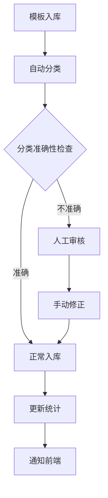

### 扩展建议

1. **细粒度分类**: 考虑在现有基础上增加子分类
2. **语义增强**: 结合自然语言处理提升分类准确性
3. **用户反馈**: 收集用户对分类体系的反馈意见
4. **智能学习**: 基于用户行为优化分类算法

**章节来源**
- [add_template_category_fields.py](file://backend/scripts/add_template_category_fields.py#L21-L97)
- [init_template_categories.py](file://backend/scripts/init_template_categories.py#L24-L62)

## 总结

GenAI Chart的分类体系是一套完整、科学、实用的模板管理体系。通过七大核心分类，系统能够有效组织和管理海量模板资源，为用户提供便捷的查找和使用体验。分类体系不仅支持基本的筛选功能，还为AI智能推荐、内容理解等高级功能奠定了坚实基础。

系统的模块化设计使得分类体系易于扩展和维护，支持未来根据业务需求添加新的分类类型。完善的自动化分类机制和人工审核流程确保了分类的准确性和一致性。前端的多样化实现满足了不同技术栈的需求，提供了优秀的用户体验。

这套分类体系的成功实施证明了科学分类对于大型模板库管理的重要性，为类似项目的分类体系建设提供了宝贵的参考经验。