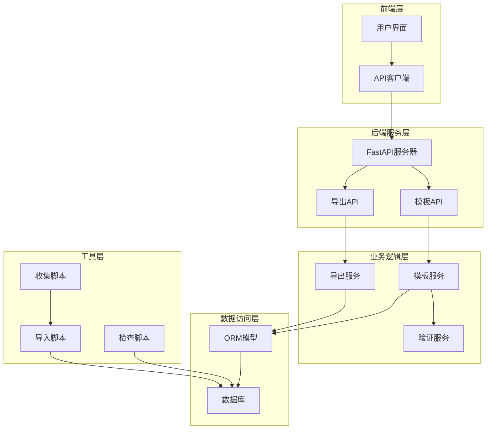
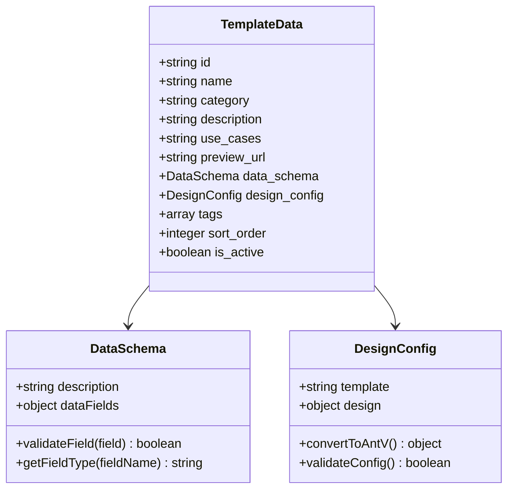
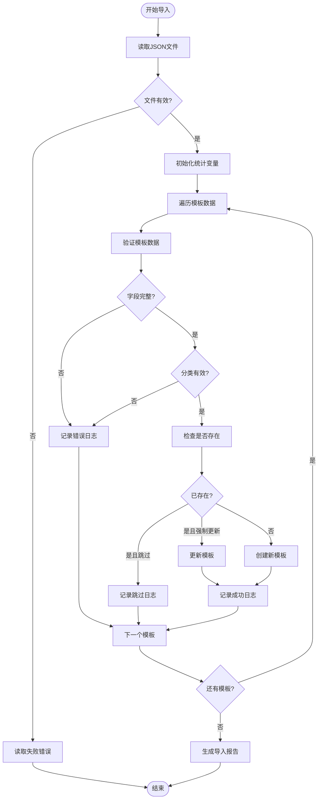
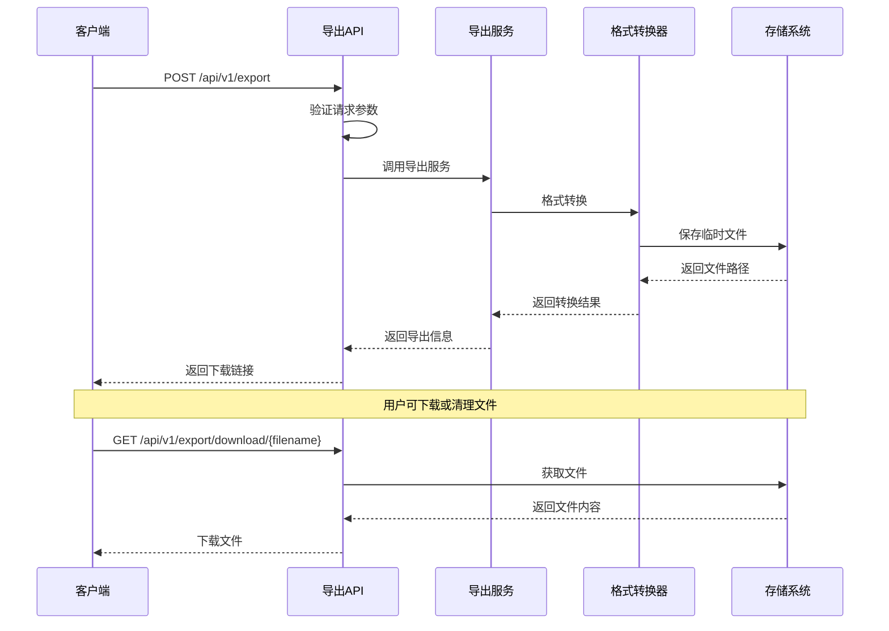
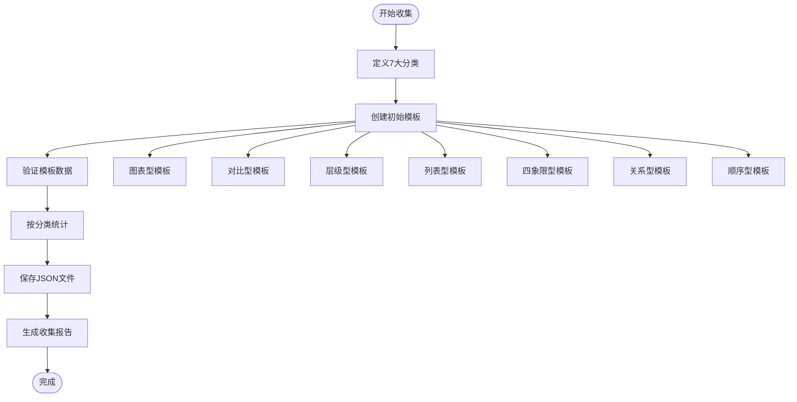
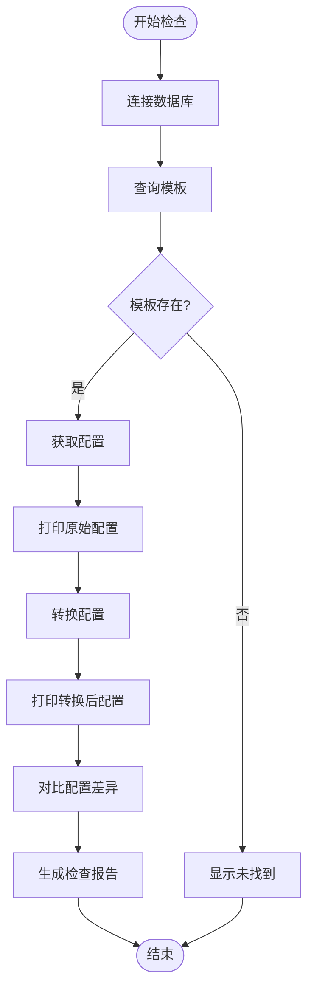
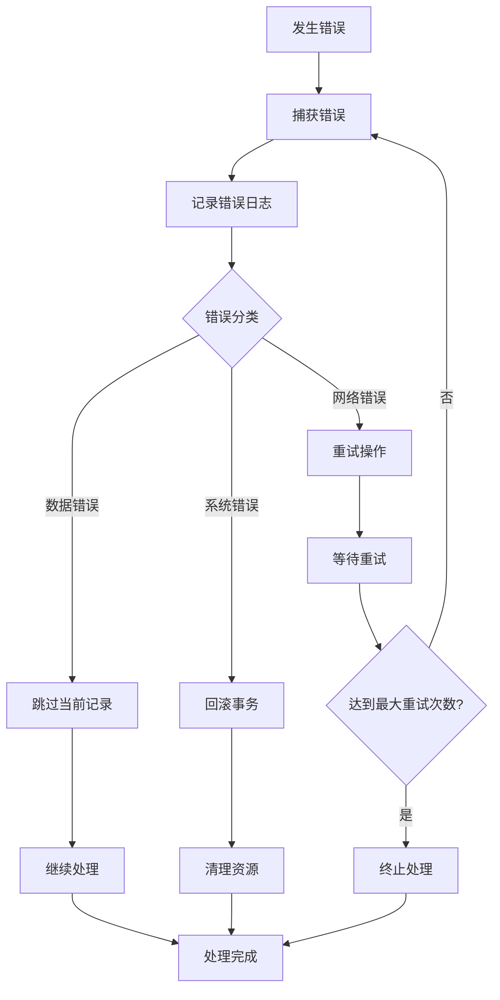

# 模板批量导入导出系统文档

<cite>
**本文档中引用的文件**
- [import_templates.py](file://backend/scripts/import_templates.py)
- [collect_templates.py](file://backend/scripts/collect_templates.py)
- [check_template_config.py](file://backend/scripts/check_template_config.py)
- [templates_initial.json](file://archive/temp_files/templates_initial.json)
- [template.py](file://backend/app/models/template.py)
- [db.py](file://backend/app/utils/db.py)
- [export.py](file://backend/app/api/v1/export.py)
- [export_service.py](file://backend/app/services/export_service.py)
</cite>

## 目录
1. [概述](#概述)
2. [系统架构](#系统架构)
3. [模板数据结构](#模板数据结构)
4. [导入系统详解](#导入系统详解)
5. [导出系统详解](#导出系统详解)
6. [模板收集系统](#模板收集系统)
7. [验证与检查机制](#验证与检查机制)
8. [最佳实践指南](#最佳实践指南)
9. [故障排除](#故障排除)
10. [使用示例](#使用示例)

## 概述

该系统提供了完整的模板批量导入和导出功能，支持多种格式的数据交换和处理。系统包含三个核心组件：模板导入脚本、模板导出API和服务，以及模板收集和验证工具。

### 主要功能特性

- **批量导入**：支持从JSON文件批量导入模板数据到数据库
- **多格式导出**：支持SVG、PNG、PDF、PPTX等多种格式导出
- **模板验证**：内置数据完整性和格式验证机制
- **错误处理**：完善的错误捕获和日志记录系统
- **事务管理**：数据库操作的原子性保证

## 系统架构



**架构图来源**
- [export.py](file://backend/app/api/v1/export.py#L1-L208)
- [export_service.py](file://backend/app/services/export_service.py#L1-L670)
- [import_templates.py](file://backend/scripts/import_templates.py#L1-L168)

## 模板数据结构

### JSON模板元数据结构

模板数据采用标准化的JSON格式，包含以下核心字段：

| 字段名 | 类型 | 必填 | 描述 |
|--------|------|------|------|
| id | string | 是 | 模板唯一标识符 |
| name | string | 是 | 模板中文名称 |
| category | string | 是 | 分类（chart/comparison/hierarchy/list/quadrant/relationship/sequence） |
| description | string | 否 | 模板功能描述 |
| use_cases | string | 否 | 适用场景说明 |
| preview_url | string | 否 | 预览图URL |
| data_schema | object | 是 | 数据结构Schema定义 |
| design_config | object | 是 | 设计配置参数 |
| tags | array | 否 | 标签数组 |
| sort_order | integer | 否 | 排序权重 |
| is_active | boolean | 否 | 是否启用 |

### 数据Schema结构



**类图来源**
- [template.py](file://backend/app/models/template.py#L9-L54)
- [templates_initial.json](file://archive/temp_files/templates_initial.json#L1-L569)

**节来源**
- [template.py](file://backend/app/models/template.py#L9-L54)
- [templates_initial.json](file://archive/temp_files/templates_initial.json#L1-L569)

## 导入系统详解

### import_templates.py 脚本实现

导入系统的核心功能由 `import_templates.py` 脚本实现，提供完整的模板数据处理流程。

#### 核心功能模块

1. **数据验证模块**
   - 必填字段检查
   - 分类有效性验证
   - 数据类型完整性校验

2. **批量处理模块**
   - 流水线式处理
   - 错误隔离机制
   - 进度跟踪和统计

3. **数据库集成模块**
   - ORM对象映射
   - 事务管理
   - 冲突处理策略

#### 验证逻辑流程



**流程图来源**
- [import_templates.py](file://backend/scripts/import_templates.py#L48-L168)

#### 命令行接口

```bash
# 基本导入
python scripts/import_templates.py templates.json

# 强制更新现有模板
python scripts/import_templates.py templates.json --force

# 指定具体文件
python scripts/import_templates.py ./data/templates_batch1.json
```

**节来源**
- [import_templates.py](file://backend/scripts/import_templates.py#L1-L168)

## 导出系统详解

### 导出API架构

导出系统提供RESTful API接口，支持多种格式的模板内容导出。

#### 支持的导出格式

| 格式 | 扩展名 | 特性 | 用途 |
|------|--------|------|------|
| SVG | .svg | 矢量图形，可无限缩放 | 网页展示、矢量编辑 |
| PNG | .png | 高质量位图 | 图像展示、打印 |
| PDF | .pdf | 便携式文档 | 文档存档、打印 |
| PPTX | .pptx | PowerPoint格式 | 演示文稿、编辑 |

#### 导出服务流程



**序列图来源**
- [export.py](file://backend/app/api/v1/export.py#L38-L152)
- [export_service.py](file://backend/app/services/export_service.py#L232-L254)

#### PPTX导出特殊处理

PPTX导出需要特殊的SVG到PPTX转换处理：

1. **SVG兼容性转换**：将 `foreignObject` 转换为标准SVG `text` 元素
2. **字体映射**：将Web字体映射到系统中文字体
3. **尺寸适配**：自动调整SVG内容以适应幻灯片尺寸
4. **ZIP结构操作**：直接操作PPTX的内部ZIP结构

**节来源**
- [export.py](file://backend/app/api/v1/export.py#L1-L208)
- [export_service.py](file://backend/app/services/export_service.py#L1-L670)

## 模板收集系统

### collect_templates.py 功能

模板收集系统负责从AntV Infographic官网爬取和整理模板信息，生成标准化的模板数据。

#### 收集流程



**流程图来源**
- [collect_templates.py](file://backend/scripts/collect_templates.py#L389-L420)

#### 分类定义

系统支持7种模板分类：

| 分类代码 | 中文名称 | 描述 | 示例模板 |
|----------|----------|------|----------|
| chart | 图表型 | 数值展示，柱状图等可视化图表 | 垂直柱状图 |
| comparison | 对比型 | 优劣对比、SWOT分析 | 双栏对比、SWOT分析 |
| hierarchy | 层级型 | 组织结构、分类信息 | 金字塔层级图、组织架构树 |
| list | 列表型 | 步骤说明、清单、简单信息罗列 | 简单纵向列表、检查清单 |
| quadrant | 四象限型 | 市场定位、风险评估 | 2x2矩阵、SWOT分析 |
| relation | 关系型 | 关系网络、关联分析 | 放射状思维导图 |
| sequence | 顺序型 | 时间线、流程图、递进关系 | 横向时间轴、图标横向流程图 |

**节来源**
- [collect_templates.py](file://backend/scripts/collect_templates.py#L13-L22)

## 验证与检查机制

### check_template_config.py 验证逻辑

模板配置检查工具用于验证数据库中模板的实际配置状态。

#### 检查功能

1. **配置对比**：比较原始设计配置与转换后的配置
2. **数据完整性**：验证模板字段的完整性和正确性
3. **格式一致性**：确保配置格式的一致性

#### 检查流程



**流程图来源**
- [check_template_config.py](file://backend/scripts/check_template_config.py#L15-L37)

**节来源**
- [check_template_config.py](file://backend/scripts/check_template_config.py#L1-L37)

## 最佳实践指南

### 批量处理最佳实践

#### 1. 数据准备阶段

- **数据清洗**：确保JSON文件格式正确，字段完整
- **版本控制**：对模板文件进行版本管理
- **备份策略**：导入前备份现有数据库

#### 2. 导入执行阶段

- **分批处理**：对于大量模板，建议分批导入
- **监控进度**：关注导入过程中的错误日志
- **性能优化**：合理设置数据库连接池参数

#### 3. 验证确认阶段

- **随机抽样**：导入完成后随机抽取样本验证
- **功能测试**：测试模板在实际应用中的表现
- **性能评估**：评估模板加载和渲染性能

### 错误处理策略

#### 常见错误类型

| 错误类型 | 原因 | 解决方案 |
|----------|------|----------|
| JSON格式错误 | 文件编码或语法问题 | 使用JSON验证工具检查 |
| 字段缺失 | 必填字段未提供 | 补充必需字段 |
| 分类无效 | 分类不在允许范围内 | 使用正确的分类代码 |
| 数据类型错误 | 字段类型不匹配 | 检查字段类型定义 |
| 数据库连接失败 | 数据库配置问题 | 检查数据库连接参数 |

#### 错误恢复机制



### 性能优化建议

#### 数据库优化

1. **索引策略**：为常用查询字段建立索引
2. **批量操作**：使用批量插入和更新
3. **连接池**：合理配置数据库连接池大小
4. **事务管理**：适当控制事务范围

#### 内存管理

1. **流式处理**：对于大型文件，采用流式处理
2. **垃圾回收**：及时释放不需要的对象
3. **内存监控**：监控内存使用情况

## 故障排除

### 常见问题及解决方案

#### 1. 导入失败问题

**问题现象**：模板导入过程中出现错误

**排查步骤**：
1. 检查JSON文件格式是否正确
2. 验证数据库连接是否正常
3. 查看详细的错误日志
4. 检查模板数据的完整性

**解决方案**：
```bash
# 检查JSON格式
python -m json.tool templates.json

# 查看详细日志
python scripts/import_templates.py templates.json --verbose
```

#### 2. 导出格式问题

**问题现象**：导出的文件格式不符合预期

**排查步骤**：
1. 检查所需的依赖库是否安装
2. 验证SVG内容的合法性
3. 检查文件权限设置

**解决方案**：
```bash
# 安装PNG导出依赖
pip install cairosvg

# 安装PPTX导出依赖
pip install python-pptx lxml
```

#### 3. 性能问题

**问题现象**：导入或导出速度过慢

**优化措施**：
1. 减少并发连接数
2. 增加内存分配
3. 使用SSD存储
4. 优化数据库查询

### 调试工具

#### 日志分析

系统提供详细的日志记录，可通过以下方式查看：

```bash
# 查看导入日志
tail -f logs/import.log

# 查看导出日志
tail -f logs/export.log
```

#### 性能监控

```bash
# 监控CPU和内存使用
htop

# 监控磁盘I/O
iotop

# 监控网络连接
netstat -tulpn
```

## 使用示例

### 基本使用场景

#### 场景1：首次部署模板

```bash
# 1. 收集初始模板
python scripts/collect_templates.py

# 2. 导入模板到数据库
python scripts/import_templates.py templates_initial.json

# 3. 验证导入结果
python scripts/check_template_config.py
```

#### 场景2：批量更新模板

```bash
# 1. 生成新模板
python scripts/generate_templates_from_structures.py 1

# 2. 导入新模板（强制覆盖）
python scripts/import_templates.py new_templates.json --force

# 3. 验证更新结果
python scripts/check_template_config.py
```

#### 场景3：导出模板内容

```bash
# 1. 通过API导出
curl -X POST "http://localhost:8000/api/v1/export" \
  -H "Content-Type: application/json" \
  -d '{
    "svgContent": "<svg>...</svg>",
    "format": "png",
    "filename": "my_chart.png"
  }'

# 2. 下载导出文件
curl -O "http://localhost:8000/api/v1/export/download/my_chart.png"
```

### 高级使用场景

#### 自动化脚本示例

```bash
#!/bin/bash
# 自动化模板管理脚本

echo "开始自动化模板管理..."

# 步骤1：收集最新模板
echo "收集最新模板..."
python scripts/collect_templates.py

# 步骤2：生成模板配置
echo "生成模板配置..."
python scripts/generate_templates_from_structures.py 1

# 步骤3：导入模板
echo "导入模板到数据库..."
python scripts/import_templates.py generated_templates.json --force

# 步骤4：验证导入
echo "验证导入结果..."
python scripts/check_template_config.py

# 步骤5：清理临时文件
echo "清理临时文件..."
rm -f generated_templates.json

echo "自动化模板管理完成！"
```

#### 批量处理脚本

```python
# 批量处理多个模板文件
import os
import subprocess

template_files = [
    "templates_batch1.json",
    "templates_batch2.json", 
    "templates_batch3.json"
]

for file in template_files:
    print(f"正在处理文件: {file}")
    result = subprocess.run([
        "python", "scripts/import_templates.py", file, "--force"
    ], capture_output=True, text=True)
    
    if result.returncode == 0:
        print(f"文件 {file} 导入成功")
    else:
        print(f"文件 {file} 导入失败: {result.stderr}")
```

### 错误处理示例

#### 捕获和处理导入错误

```python
import json
import logging
from import_templates import import_templates

# 配置日志
logging.basicConfig(level=logging.INFO)

try:
    # 尝试导入模板
    import_templates("templates.json", skip_existing=False)
except FileNotFoundError:
    print("错误：模板文件不存在")
except json.JSONDecodeError:
    print("错误：JSON文件格式错误")
except Exception as e:
    print(f"导入过程中发生未知错误: {e}")
```

通过这些示例和最佳实践，可以有效地管理和维护模板系统，确保系统的稳定性和可靠性。