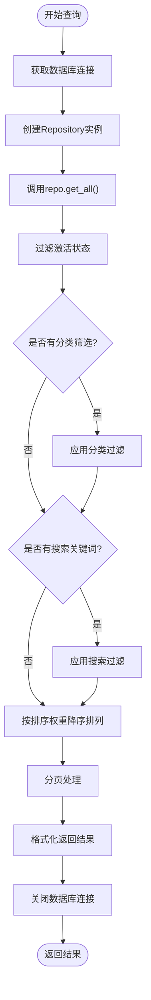

# 模板管理系统

<cite>
**本文档引用的文件**
- [template_service.py](file://backend/app/services/template_service.py)
- [template_repo.py](file://backend/app/repositories/template_repo.py)
- [templates.py](file://backend/app/api/v1/templates.py)
- [template.py](file://backend/app/models/template.py)
- [template.py](file://backend/app/schemas/template.py)
- [db.py](file://backend/app/utils/db.py)
- [main.py](file://backend/app/main.py)
- [config.py](file://backend/app/config.py)
- [init_template_categories.py](file://backend/scripts/init_template_categories.py)
- [templates.ts](file://frontend/src/api/templates.ts)
- [template.ts](file://frontend/src/stores/template.ts)
</cite>

## 目录
1. [简介](#简介)
2. [系统架构](#系统架构)
3. [核心组件](#核心组件)
4. [TemplateService类详解](#templateservice类详解)
5. [API路由与请求处理](#api路由与请求处理)
6. [数据库交互模式](#数据库交互模式)
7. [分页查询与搜索功能](#分页查询与搜索功能)
8. [错误处理策略](#错误处理策略)
9. [性能优化建议](#性能优化建议)
10. [API调用示例](#api调用示例)
11. [总结](#总结)

## 简介

模板管理系统是基于AntV Infographic构建的AI信息图生成系统的核心组件，负责管理各种信息图表模板的生命周期。该系统提供了完整的模板CRUD操作、分类统计、搜索功能以及智能推荐能力，支持前端应用高效地获取和使用模板资源。

系统采用分层架构设计，包含API层、服务层、仓储层和数据层，确保了良好的可维护性和扩展性。通过RESTful API接口，前端应用可以方便地获取模板列表、详情信息、分类统计以及AI推荐结果。

## 系统架构

模板管理系统采用经典的三层架构模式，清晰分离关注点：


**图表来源**
- [main.py](file://backend/app/main.py#L1-L113)
- [templates.py](file://backend/app/api/v1/templates.py#L1-L99)
- [template_service.py](file://backend/app/services/template_service.py#L160-L281)

**章节来源**
- [main.py](file://backend/app/main.py#L1-L113)
- [templates.py](file://backend/app/api/v1/templates.py#L1-L99)

## 核心组件

### 数据模型设计

系统的核心数据模型围绕`Template`实体构建，包含以下关键字段：


**图表来源**
- [template.py](file://backend/app/models/template.py#L9-L54)

### 分类体系

系统定义了七大模板分类，每个分类都有明确的语义和用途：

| 分类代码 | 中文名称 | 描述 | 主要模板类型 |
|---------|---------|------|-------------|
| chart | 图表型 | 数值展示，柱状图等可视化图表 | chart-bar, chart-line, chart-pie |
| comparison | 对比型 | 优劣对比、SWOT分析 | comparison-swot, comparison-matrix |
| hierarchy | 层级型 | 组织结构、分类信息 | hierarchy-tree, pyramid-layer |
| list | 列表型 | 步骤说明、清单、简单信息罗列 | list-row, list-column |
| quadrant | 四象限型 | 市场定位、风险评估 | quadrant-matrix, quadrant-swot |
| relationship | 关系型 | 关系网络、关联分析 | relation-network, mindmap-radial |
| sequence | 顺序型 | 时间线、流程图、递进关系 | sequence-timeline, list-row-flow |

**章节来源**
- [template_repo.py](file://backend/app/repositories/template_repo.py#L105-L144)
- [init_template_categories.py](file://backend/scripts/init_template_categories.py#L24-L62)

## TemplateService类详解

`TemplateService`是模板管理的核心业务服务类，提供了完整的模板操作接口。该类采用依赖注入模式，通过工厂函数`get_template_service()`获取单例实例。

### 核心方法实现

#### 1. get_all_templates() - 分页查询模板

该方法实现了完整的分页查询功能，支持多种筛选条件：



**图表来源**
- [template_service.py](file://backend/app/services/template_service.py#L170-L199)
- [template_repo.py](file://backend/app/repositories/template_repo.py#L25-L73)

#### 2. get_template_by_id() - 获取单个模板

该方法提供精确的模板查询功能，支持软删除检测：


**图表来源**
- [template_service.py](file://backend/app/services/template_service.py#L202-L219)
- [template_repo.py](file://backend/app/repositories/template_repo.py#L75-L88)

#### 3. get_categories() - 分类统计

该方法提供完整的分类统计信息，包括每个分类下的模板数量：


**图表来源**
- [template_service.py](file://backend/app/services/template_service.py#L238-L251)
- [template_repo.py](file://backend/app/repositories/template_repo.py#L105-L144)

**章节来源**
- [template_service.py](file://backend/app/services/template_service.py#L160-L281)

## API路由与请求处理

### 路由定义

系统在FastAPI应用中注册了专门的模板路由组，包含以下端点：

| 端点 | 方法 | 功能 | 参数 |
|------|------|------|------|
| `/api/v1/templates` | GET | 获取模板列表 | category, keyword, page, pageSize |
| `/api/v1/templates/categories` | GET | 获取分类列表 | 无 |
| `/api/v1/templates/{template_id}` | GET | 获取模板详情 | template_id |
| `/api/v1/templates/recommend` | POST | AI推荐模板 | text, maxRecommendations |

### 请求参数处理

系统对分页参数和搜索关键词进行了严格的验证和处理：


**图表来源**
- [templates.py](file://backend/app/api/v1/templates.py#L17-L39)

### 响应格式标准化

系统使用统一的API响应格式，确保前后端交互的一致性：


**图表来源**
- [common.py](file://backend/app/schemas/common.py#L10-L20)

**章节来源**
- [templates.py](file://backend/app/api/v1/templates.py#L1-L99)
- [common.py](file://backend/app/schemas/common.py#L1-L20)

## 数据库交互模式

### 连接管理

系统采用SQLAlchemy ORM框架，通过工厂模式管理数据库连接：


**图表来源**
- [db.py](file://backend/app/utils/db.py#L79-L93)

### 仓储模式实现

`TemplateRepository`类封装了所有的数据库操作逻辑：


**图表来源**
- [template_repo.py](file://backend/app/repositories/template_repo.py#L13-L144)

### 查询优化策略

系统在查询层面采用了多种优化策略：

1. **索引优化**：为常用查询字段建立复合索引
2. **查询过滤**：默认只查询激活状态的模板
3. **分页处理**：避免一次性加载大量数据
4. **字段选择**：只查询必要的字段

**章节来源**
- [db.py](file://backend/app/utils/db.py#L1-L94)
- [template_repo.py](file://backend/app/repositories/template_repo.py#L1-L144)

## 分页查询与搜索功能

### 分页机制

系统实现了标准的分页查询机制，支持灵活的页面控制：


**图表来源**
- [template_repo.py](file://backend/app/repositories/template_repo.py#L67-L73)

### 搜索功能

系统提供了全文搜索功能，支持多个字段的模糊匹配：

| 搜索字段 | 类型 | 用途 |
|----------|------|------|
| name | 文本 | 模板名称搜索 |
| description | 文本 | 模板描述搜索 |
| use_cases | 文本 | 适用场景搜索 |

搜索算法采用SQLAlchemy的`contains()`方法，支持部分匹配：

```python
# 搜索逻辑示例
search_filter = or_(
    Template.name.contains(keyword),
    Template.description.contains(keyword),
    Template.use_cases.contains(keyword)
)
```

### 排序规则

系统按照以下优先级进行排序：
1. `sort_order`：自定义排序权重（降序）
2. `created_at`：创建时间（降序）

**章节来源**
- [template_repo.py](file://backend/app/repositories/template_repo.py#L25-L73)

## 错误处理策略

### 异常处理层次

系统建立了多层次的异常处理机制：


**图表来源**
- [main.py](file://backend/app/main.py#L39-L54)

### 错误类型与处理

| 错误类型 | HTTP状态码 | 处理策略 | 示例场景 |
|----------|------------|----------|----------|
| 参数验证错误 | 422 | 返回具体错误信息 | 无效的分页参数 |
| 资源不存在 | 404 | 明确的错误消息 | 模板ID不存在 |
| 数据库错误 | 500 | 通用错误消息 | 连接超时 |
| 业务逻辑错误 | 400 | 业务相关错误 | 模板已禁用 |

### 日志记录

系统集成了完整的日志记录机制，支持不同级别的日志输出：

```python
# 日志级别配置
logging.basicConfig(
    level=logging.INFO,
    format='%(asctime)s - %(name)s - %(levelname)s - %(message)s'
)
```

**章节来源**
- [main.py](file://backend/app/main.py#L39-L54)
- [db.py](file://backend/app/utils/db.py#L1-L94)

## 性能优化建议

### 数据库连接管理

1. **连接池配置**：生产环境建议配置合适的连接池参数
2. **连接复用**：使用上下文管理器确保连接正确释放
3. **异步支持**：考虑引入异步数据库驱动

### 查询性能优化

1. **索引策略**：
   ```sql
   -- 复合索引示例
   CREATE INDEX idx_category_sort ON templates(category, sort_order);
   ```

2. **查询优化**：
   - 避免N+1查询问题
   - 使用批量查询替代循环查询
   - 合理使用JOIN操作

3. **缓存策略**：
   - 缓存分类统计数据
   - 缓存热门模板列表
   - 实现Redis缓存层

### 前端优化

1. **懒加载**：模板列表采用虚拟滚动技术
2. **状态管理**：使用Pinia进行状态缓存
3. **请求去重**：避免重复的API请求

### 监控指标

建议监控以下关键指标：
- API响应时间
- 数据库查询耗时
- 内存使用情况
- 并发请求数量

## API调用示例

### 获取模板列表

**请求示例**：
```bash
GET /api/v1/templates?category=chart&keyword=柱状图&page=1&pageSize=20
```

**响应示例**：
```json
{
  "success": true,
  "data": {
    "templates": [
      {
        "id": "chart-bar-simple",
        "name": "简单柱状图",
        "category": "chart",
        "description": "基础柱状图模板",
        "useCases": "数据对比展示",
        "previewUrl": "https://example.com/chart-bar-preview.png",
        "dataSchema": {},
        "designConfig": {}
      }
    ],
    "total": 15,
    "page": 1,
    "pageSize": 20
  },
  "message": "获取模板列表成功"
}
```

### 获取分类列表

**请求示例**：
```bash
GET /api/v1/templates/categories
```

**响应示例**：
```json
{
  "success": true,
  "data": [
    {
      "code": "chart",
      "name": "图表型",
      "description": "数值展示,柱状图等可视化图表",
      "count": 12
    },
    {
      "code": "list",
      "name": "列表型",
      "description": "步骤说明、清单、简单信息罗列",
      "count": 8
    }
  ],
  "message": "获取分类列表成功"
}
```

### 获取模板详情

**请求示例**：
```bash
GET /api/v1/templates/chart-bar-simple
```

**响应示例**：
```json
{
  "success": true,
  "data": {
    "id": "chart-bar-simple",
    "name": "简单柱状图",
    "category": "chart",
    "structureType": "chart-bar",
    "description": "基础柱状图模板",
    "keywords": ["图表", "数据可视化"],
    "useCases": "数据对比展示",
    "previewUrl": "https://example.com/chart-bar-preview.png",
    "dataSchema": {
      "description": "柱状图数据结构",
      "dataFields": {
        "title": {"type": "string", "required": false},
        "items": {
          "type": "array",
          "required": true,
          "itemSchema": {
            "label": {"type": "string", "required": true},
            "value": {"type": "number", "required": true}
          }
        }
      }
    },
    "designConfig": {},
    "tags": ["基础", "通用"],
    "sortOrder": 100,
    "isActive": true,
    "createdAt": "2024-01-01T00:00:00Z",
    "updatedAt": "2024-01-01T00:00:00Z"
  },
  "message": "获取模板详情成功"
}
```

### AI模板推荐

**请求示例**：
```bash
POST /api/v1/templates/recommend
Content-Type: application/json

{
  "text": "我想展示公司年度销售数据",
  "maxRecommendations": 5
}
```

**响应示例**：
```json
{
  "success": true,
  "data": {
    "recommendations": [
      {
        "templateId": "chart-bar-stacked",
        "templateName": "堆叠柱状图",
        "confidence": 0.92,
        "reason": "适合展示多维度销售数据对比",
        "category": "chart"
      },
      {
        "templateId": "chart-line-trend",
        "templateName": "趋势折线图",
        "confidence": 0.88,
        "reason": "适合展示销售趋势变化",
        "category": "chart"
      }
    ],
    "analysisTime": 0.123
  },
  "message": "模板推荐成功"
}
```

**章节来源**
- [templates.py](file://backend/app/api/v1/templates.py#L17-L99)
- [templates.ts](file://frontend/src/api/templates.ts#L1-L52)

## 总结

模板管理系统是一个设计精良、功能完备的信息图表模板管理解决方案。系统通过分层架构实现了良好的关注点分离，通过标准化的API接口提供了统一的数据访问方式。

### 核心优势

1. **完整的CRUD支持**：提供了模板的增删改查完整功能
2. **智能分类体系**：基于AntV Infographic的七分类体系
3. **高效的搜索功能**：支持全文搜索和分类筛选
4. **优秀的性能表现**：通过分页、索引等优化手段保证查询效率
5. **可靠的错误处理**：多层次的异常处理和日志记录机制
6. **标准化的API设计**：统一的响应格式和参数验证

### 技术特色

- **模块化设计**：清晰的职责分离和依赖注入
- **ORM抽象**：使用SQLAlchemy提供数据库操作抽象
- **类型安全**：完整的Pydantic Schema定义
- **前后端分离**：清晰的API边界和数据传输格式

该系统为AI信息图生成平台提供了坚实的基础支撑，能够满足大规模模板管理和智能推荐的需求，具有良好的可扩展性和维护性。