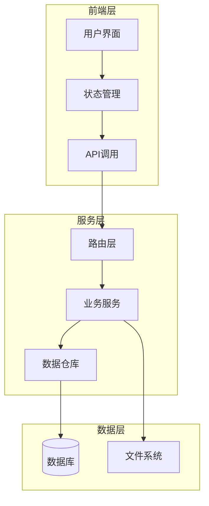
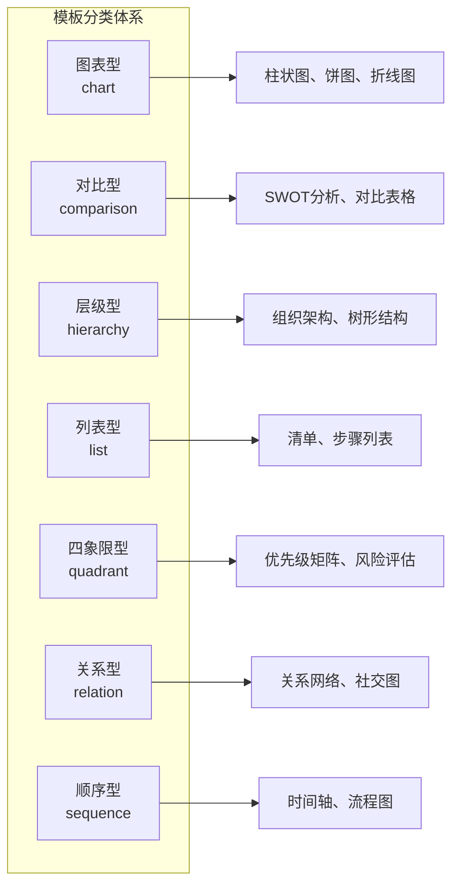
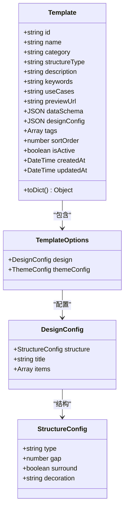
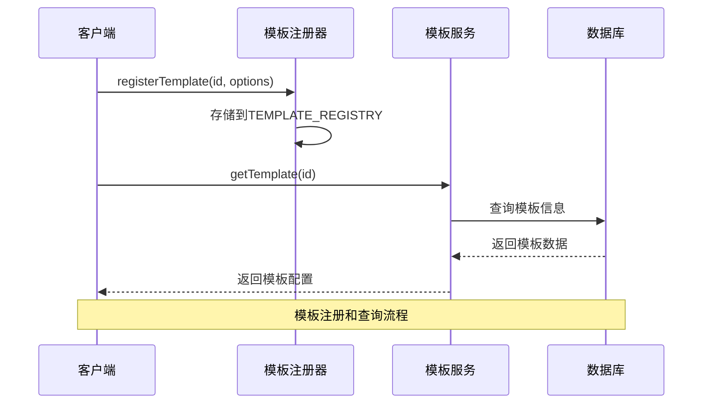
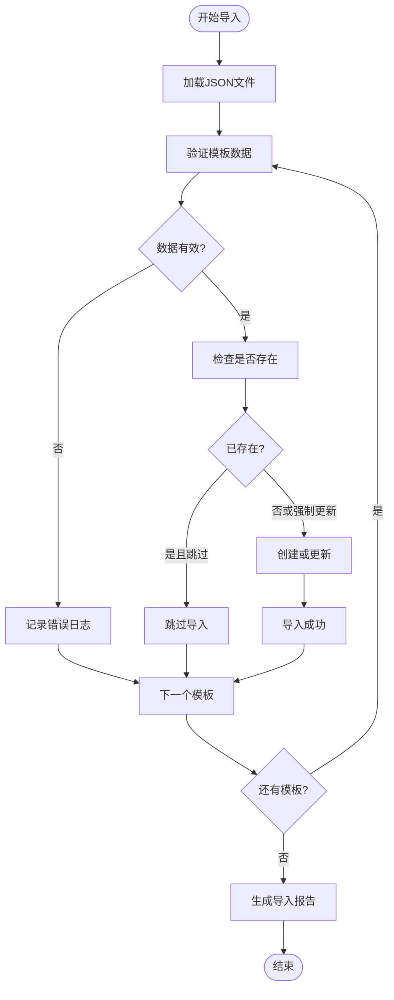
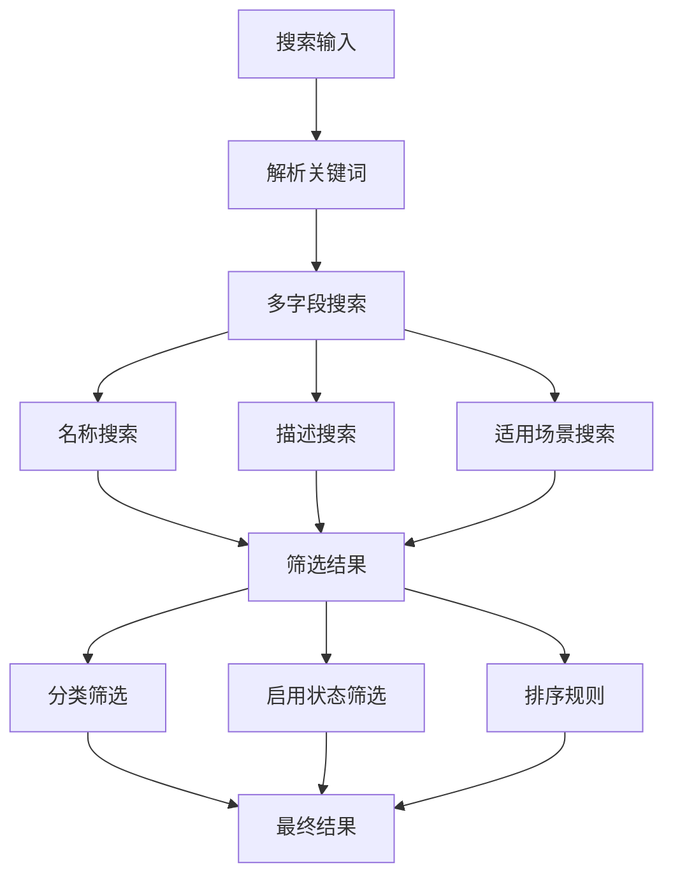
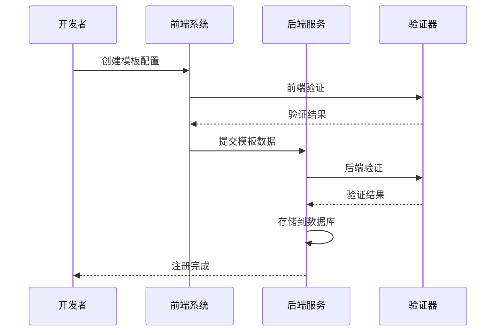
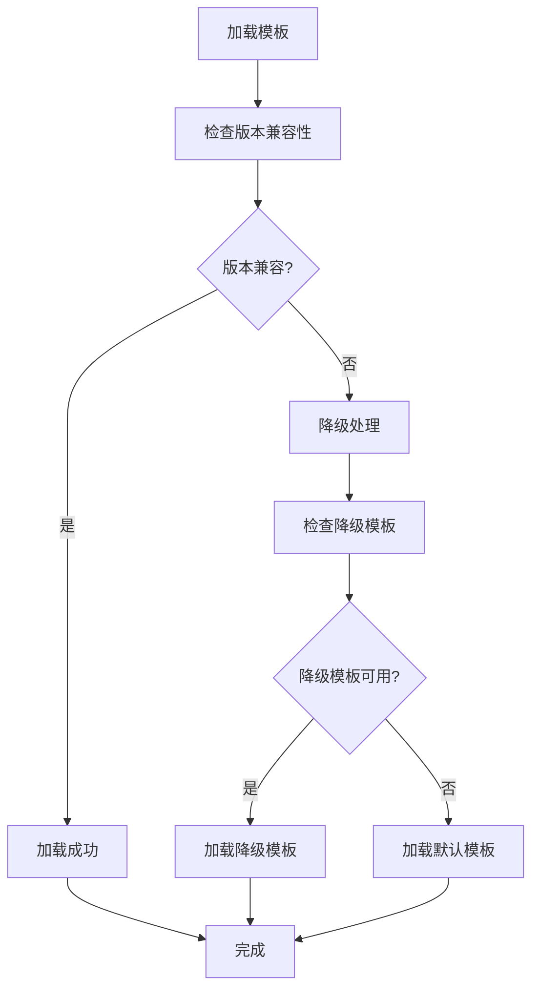

# 模板系统

<cite>
**本文档引用的文件**
- [template.py](file://backend/app/models/template.py)
- [template_service.py](file://backend/app/services/template_service.py)
- [template_repo.py](file://backend/app/repositories/template_repo.py)
- [templates.py](file://backend/app/api/v1/templates.py)
- [import_templates.py](file://backend/scripts/import_templates.py)
- [generate_templates_from_structures.py](file://backend/scripts/generate_templates_from_structures.py)
- [collect_templates.py](file://backend/scripts/collect_templates.py)
- [template.ts](file://frontend/src/stores/template.ts)
- [templates.ts](file://frontend/src/api/templates.ts)
- [types.ts](file://antv_infographic/infographic/src/templates/types.ts)
- [registry.ts](file://antv_infographic/infographic/src/templates/registry.ts)
- [built-in.ts](file://antv_infographic/infographic/src/templates/built-in.ts)
- [hierarchy-tree.ts](file://antv_infographic/infographic/src/templates/hierarchy-tree.ts)
- [templates_initial.json](file://archive/temp_files/templates_initial.json)
</cite>

## 目录
1. [简介](#简介)
2. [系统架构](#系统架构)
3. [模板分类体系](#模板分类体系)
4. [模板元数据结构](#模板元数据结构)
5. [模板注册与管理](#模板注册与管理)
6. [模板导入导出机制](#模板导入导出机制)
7. [模板搜索与筛选](#模板搜索与筛选)
8. [模板创建与注册](#模板创建与注册)
9. [版本管理与兼容性](#版本管理与兼容性)
10. [最佳实践与质量检查](#最佳实践与质量检查)
11. [总结](#总结)

## 简介

模板系统是AntV Infographic的核心组件，为用户提供丰富的信息图设计模板。该系统采用前后端分离架构，支持模板的分类管理、智能搜索、批量导入导出等功能，能够满足从简单列表到复杂关系图的各种可视化需求。

## 系统架构

模板系统采用三层架构设计，包含前端展示层、后端服务层和数据存储层：



**图表来源**
- [template_service.py](file://backend/app/services/template_service.py#L160-L281)
- [template_repo.py](file://backend/app/repositories/template_repo.py#L13-L144)
- [template.ts](file://frontend/src/stores/template.ts#L36-L102)

**章节来源**
- [template_service.py](file://backend/app/services/template_service.py#L160-L281)
- [template_repo.py](file://backend/app/repositories/template_repo.py#L13-L144)

## 模板分类体系

模板系统定义了七大分类体系，每个分类都有明确的语义和适用场景：

| 分类代码 | 中文名称 | 描述 | 主要用途 |
|---------|---------|------|---------|
| chart | 图表型 | 数值展示，柱状图等可视化图表 | 数据对比、趋势分析、指标展示 |
| comparison | 对比型 | 优劣对比、SWOT分析 | 方案选择、产品对比、决策分析 |
| hierarchy | 层级型 | 组织结构、分类信息 | 组织架构、分类体系、层次关系 |
| list | 列表型 | 步骤说明、清单、简单信息罗列 | 操作指南、要点罗列、清单展示 |
| quadrant | 四象限型 | 市场定位、风险评估 | 战略分析、优先级评估、决策矩阵 |
| relation | 关系型 | 关系网络、关联分析 | 社交网络、依赖关系、生态分析 |
| sequence | 顺序型 | 时间线、流程图、递进关系 | 流程展示、时间轴、发展路径 |



**图表来源**
- [template_repo.py](file://backend/app/repositories/template_repo.py#L112-L121)

**章节来源**
- [template_repo.py](file://backend/app/repositories/template_repo.py#L112-L144)

## 模板元数据结构

模板元数据采用标准化的JSON Schema定义，包含完整的模板信息和配置参数：



**图表来源**
- [template.py](file://backend/app/models/template.py#L9-L54)
- [types.ts](file://antv_infographic/infographic/src/templates/types.ts#L1-L12)

### 核心字段定义

| 字段名 | 类型 | 必填 | 描述 | 示例 |
|-------|------|------|------|------|
| id | string | 是 | 模板唯一标识符 | "list-row-horizontal-icon-arrow" |
| name | string | 是 | 模板中文名称 | "图标横向流程图" |
| category | string | 是 | 分类代码 | "sequence" |
| structureType | string | 否 | AntV结构类型 | "list-row" |
| description | string | 否 | 模板描述 | "带图标和箭头的横向流程图" |
| keywords | string | 否 | 关键词（逗号分隔） | "流程,横向,图标,箭头" |
| useCases | string | 否 | 适用场景说明 | "产品流程、服务流程" |
| previewUrl | string | 否 | 预览图URL | "" |
| dataSchema | JSON | 是 | 数据结构Schema | 见示例 |
| designConfig | JSON | 是 | 设计配置 | 见示例 |
| tags | Array | 否 | 标签数组 | ["流程", "横向", "图标"] |
| sortOrder | number | 否 | 排序权重 | 100 |
| isActive | boolean | 否 | 是否启用 | true |

**章节来源**
- [template.py](file://backend/app/models/template.py#L9-L54)
- [templates_initial.json](file://archive/temp_files/templates_initial.json#L1-L569)

## 模板注册与管理

模板系统采用注册机制管理模板的生命周期，支持动态注册和查询：



**图表来源**
- [registry.ts](file://antv_infographic/infographic/src/templates/registry.ts#L3-L16)
- [template_service.py](file://backend/app/services/template_service.py#L160-L281)

### 注册机制

前端模板注册通过全局注册器实现：

```typescript
// 前端注册示例
const TEMPLATE_REGISTRY = new Map<string, TemplateOptions>();
export function registerTemplate(type: string, template: TemplateOptions) {
  TEMPLATE_REGISTRY.set(type, template);
}

// 后端注册示例
from app.models.template import Template
from app.repositories.template_repo import TemplateRepository
```

### 管理接口

模板管理系统提供完整的CRUD操作接口：

| 操作 | 方法 | 描述 | 参数 |
|------|------|------|------|
| 获取所有模板 | get_all_templates | 分页获取模板列表 | category, keyword, page, pageSize |
| 获取模板详情 | get_template_by_id | 根据ID获取模板 | template_id |
| 获取分类列表 | get_categories | 获取所有分类统计 | 无 |
| 搜索模板 | search_templates | 关键词搜索模板 | keyword |
| 获取分类模板 | get_templates_by_category | 按分类获取模板 | category |

**章节来源**
- [registry.ts](file://antv_infographic/infographic/src/templates/registry.ts#L3-L16)
- [template_service.py](file://backend/app/services/template_service.py#L170-L269)

## 模板导入导出机制

模板系统支持批量导入导出功能，便于模板的迁移和备份：



**图表来源**
- [import_templates.py](file://backend/scripts/import_templates.py#L24-L168)

### 导入流程

模板导入脚本提供了完整的数据验证和处理机制：

1. **数据验证**：检查必需字段和分类有效性
2. **重复检测**：支持跳过已存在模板
3. **批量处理**：支持事务性批量导入
4. **错误处理**：记录详细的错误信息
5. **进度跟踪**：实时显示导入进度

### 导出功能

系统支持将数据库中的模板导出为JSON格式，便于备份和分享：

```python
# 导出示例
def export_templates():
    templates = db.query(Template).all()
    return [template.to_dict() for template in templates]
```

**章节来源**
- [import_templates.py](file://backend/scripts/import_templates.py#L24-L168)
- [template_service.py](file://backend/app/services/template_service.py#L170-L269)

## 模板搜索与筛选

模板系统提供强大的搜索和筛选功能，支持多种查询方式：



**图表来源**
- [template_repo.py](file://backend/app/repositories/template_repo.py#L48-L67)

### 搜索策略

系统采用多字段联合搜索策略：

| 搜索字段 | 权重 | 描述 |
|---------|------|------|
| name | 高 | 模板名称匹配 |
| description | 中 | 描述内容匹配 |
| use_cases | 中 | 适用场景匹配 |
| keywords | 低 | 关键词匹配 |

### 筛选条件

支持的筛选条件包括：
- **分类筛选**：按七大分类进行筛选
- **状态筛选**：仅显示启用的模板
- **关键词筛选**：全文模糊匹配
- **排序规则**：按排序权重和创建时间排序

**章节来源**
- [template_repo.py](file://backend/app/repositories/template_repo.py#L48-L73)
- [template_service.py](file://backend/app/services/template_service.py#L170-L269)

## 模板创建与注册

模板系统支持灵活的模板创建和注册机制，包括前端预览和后端验证：



**图表来源**
- [built-in.ts](file://antv_infographic/infographic/src/templates/built-in.ts#L696-L700)
- [import_templates.py](file://backend/scripts/import_templates.py#L24-L46)

### 创建流程

1. **前端预览**：在开发环境中预览模板效果
2. **配置生成**：生成完整的模板配置
3. **数据验证**：前后端双重验证
4. **注册入库**：注册到模板系统
5. **测试验证**：确保模板正常工作

### 注册方式

模板可以通过以下方式注册：

#### 前端注册
```typescript
// 内置模板注册
import { registerTemplate } from './registry';
registerTemplate('template-id', templateOptions);

// 动态模板注册
const dynamicTemplate = {
  design: {
    structure: { type: 'list-row' },
    title: 'default',
    items: [{ type: 'simple' }]
  }
};
registerTemplate('dynamic-template', dynamicTemplate);
```

#### 后端注册
```python
# 数据库模板注册
from app.models.template import Template
template = Template(
    id='new-template',
    name='新模板',
    category='list',
    data_schema={},
    design_config={}
)
db.add(template)
db.commit()
```

**章节来源**
- [built-in.ts](file://antv_infographic/infographic/src/templates/built-in.ts#L696-L700)
- [import_templates.py](file://backend/scripts/import_templates.py#L24-L46)

## 版本管理与兼容性

模板系统实现了完善的版本管理和兼容性控制机制：

### 版本控制策略

| 版本类型 | 控制方式 | 兼容性要求 |
|---------|---------|-----------|
| 主版本 | major.minor.patch | 向后兼容 |
| 次版本 | minor.patch | 向后兼容 |
| 补丁版本 | patch | 完全兼容 |

### 兼容性检查

系统在模板加载时进行兼容性检查：



### 升级策略

1. **渐进式升级**：支持逐步升级模板版本
2. **回滚机制**：支持快速回滚到稳定版本
3. **兼容性映射**：自动处理版本间的不兼容问题

**章节来源**
- [template_service.py](file://backend/app/services/template_service.py#L12-L95)

## 最佳实践与质量检查

模板系统提供了完整的最佳实践指南和质量检查清单：

### 模板设计原则

| 原则 | 描述 | 实施要求 |
|------|------|----------|
| 一致性 | 保持设计风格统一 | 使用统一的主题和配色 |
| 可读性 | 确保信息清晰易读 | 合理的字体大小和对比度 |
| 灵活性 | 支持多种数据格式 | 完善的数据Schema定义 |
| 性能 | 快速渲染和响应 | 优化的SVG和Canvas实现 |
| 可访问性 | 支持无障碍访问 | 符合WCAG标准 |

### 质量检查清单

#### 前端检查项
- [ ] 模板ID唯一性验证
- [ ] 设计配置语法正确性
- [ ] 响应式布局适配
- [ ] 动画效果流畅性
- [ ] 错误边界处理

#### 后端检查项
- [ ] 数据Schema完整性
- [ ] 分类准确性验证
- [ ] 关键词相关性检查
- [ ] 预览图可用性验证
- [ ] 性能基准测试

#### 测试覆盖
- [ ] 单元测试覆盖率 ≥ 90%
- [ ] 集成测试覆盖主要功能
- [ ] 性能测试确保响应时间 < 200ms
- [ ] 兼容性测试覆盖主流浏览器

### 模板优化建议

1. **性能优化**
   - 减少DOM元素数量
   - 优化SVG路径
   - 使用虚拟化技术处理大量数据

2. **用户体验优化**
   - 提供实时预览功能
   - 支持拖拽式编辑
   - 优化移动端体验

3. **维护性优化**
   - 模块化设计
   - 完善的文档注释
   - 标准化的命名规范

**章节来源**
- [generate_templates_from_structures.py](file://backend/scripts/generate_templates_from_structures.py#L1-L544)
- [collect_templates.py](file://backend/scripts/collect_templates.py#L1-L420)

## 总结

AntV Infographic模板系统是一个功能完善、架构合理的可视化模板管理平台。系统通过七大分类体系、标准化的元数据结构、灵活的注册机制和强大的搜索功能，为用户提供了丰富的信息图设计选择。

系统的主要优势包括：

1. **完整的生命周期管理**：从模板创建到发布的全流程支持
2. **强大的搜索和筛选功能**：帮助用户快速找到合适的模板
3. **灵活的扩展机制**：支持自定义模板的注册和管理
4. **完善的质量保证**：多层次的质量检查和验证机制
5. **良好的性能表现**：优化的渲染和加载机制

未来的发展方向包括：
- 增强AI辅助的模板推荐功能
- 扩展移动端模板支持
- 优化大数据量下的性能表现
- 加强模板社区的互动功能

通过持续的优化和改进，模板系统将继续为用户提供更好的可视化设计体验。