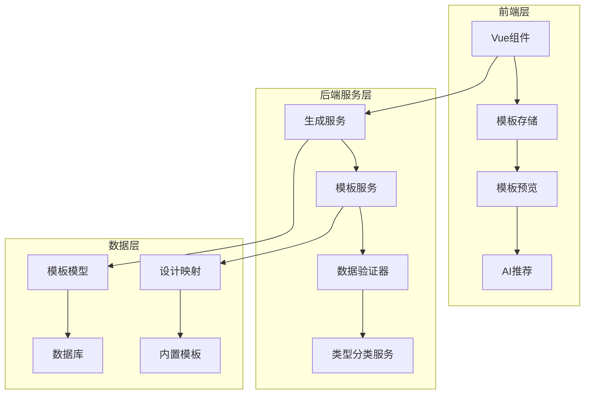
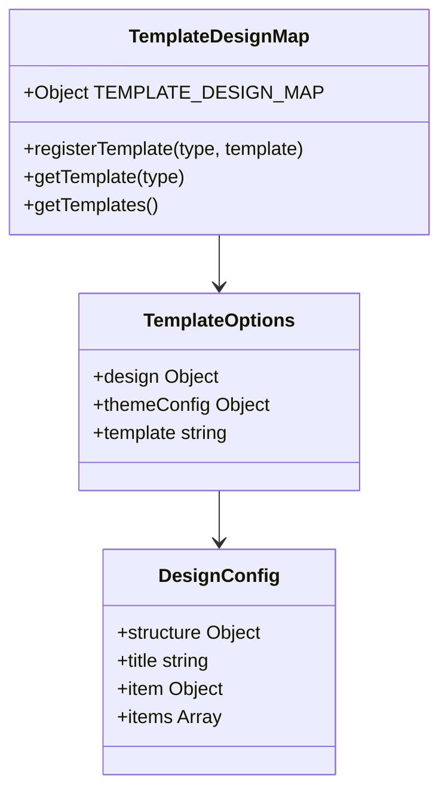
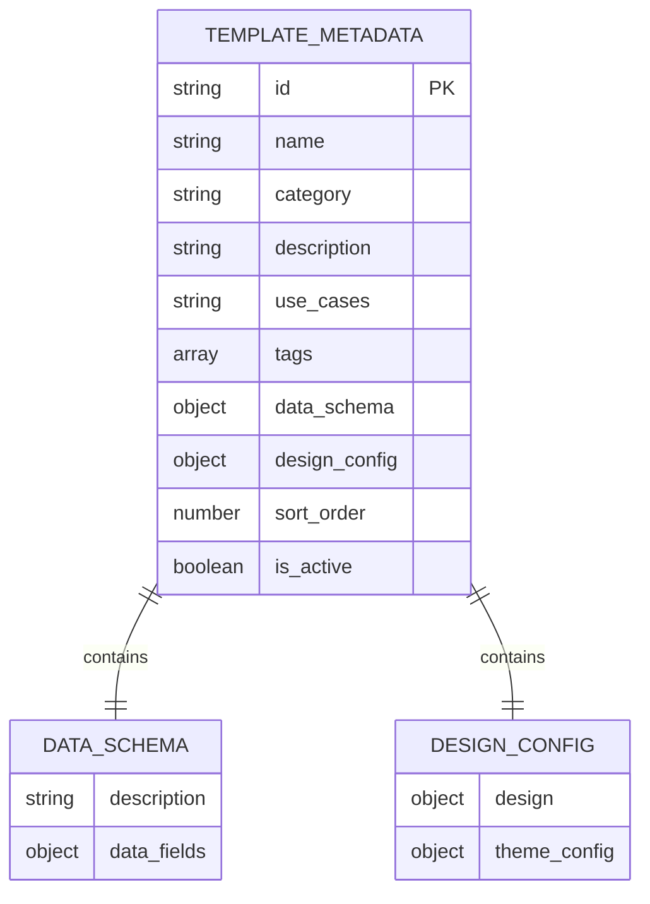
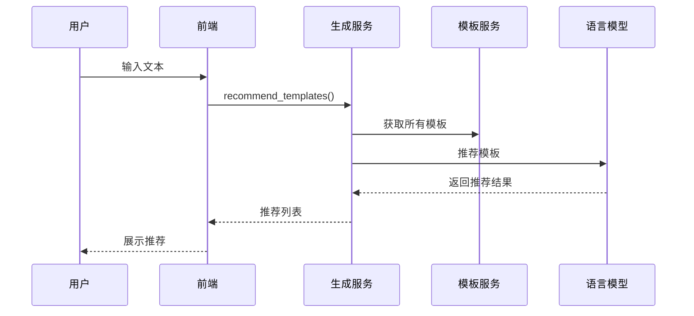
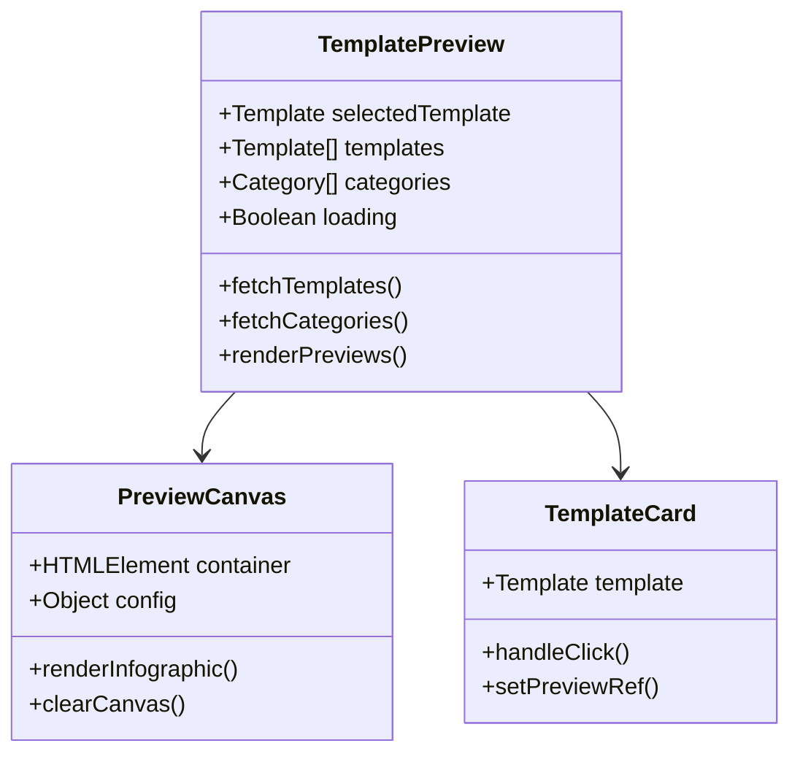
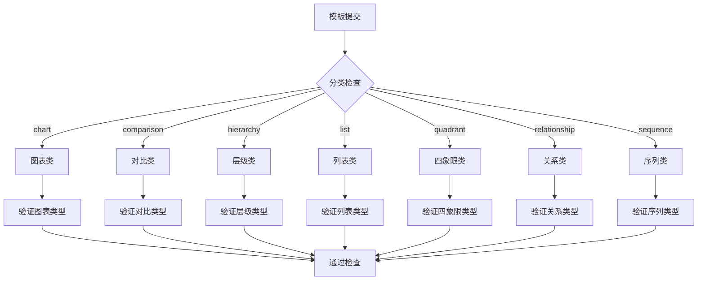
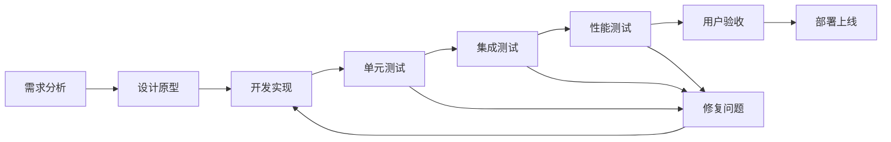

# 自定义扩展

<cite>
**本文档引用的文件**
- [generate_service.py](file://backend/app/services/generate_service.py)
- [template_service.py](file://backend/app/services/template_service.py)
- [template.py](file://backend/app/models/template.py)
- [built-in.ts](file://antv_infographic\infographic\src\templates\built-in.ts)
- [registry.ts](file://antv_infographic\infographic\src\templates\registry.ts)
- [types.ts](file://antv_infographic\infographic\src\templates\types.ts)
- [template.ts](file://frontend\src\stores\template.ts)
- [Examples.vue](file://frontend\src\views\Examples\Examples.vue)
- [data_validator.py](file://backend\app\services\data_validator.py)
- [template_selection_service.py](file://backend\app\services\template_selection_service.py)
- [RightPreviewPanel.vue](file://frontend\src\views\AIWorkspace\components\RightPreviewPanel.vue)
</cite>

## 目录
1. [概述](#概述)
2. [项目架构](#项目架构)
3. [模板注册机制](#模板注册机制)
4. [模板元数据定义](#模板元数据定义)
5. [AI智能推荐机制](#ai智能推荐机制)
6. [前端集成指南](#前端集成指南)
7. [质量检查清单](#质量检查清单)
8. [最佳实践](#最佳实践)
9. [故障排除](#故障排除)

## 概述

AntV Infographic 提供了强大的自定义扩展能力，允许开发者创建和注册自定义模板。该系统通过 TEMPLATE_DESIGN_MAP 进行模板映射，通过 TEMPLATE_METADATA 添加模板元数据，并支持 AI 智能推荐机制。本文档将详细介绍如何创建、注册和集成自定义模板。

## 项目架构



**图表来源**
- [generate_service.py](file://backend/app/services/generate_service.py#L1-L50)
- [template_service.py](file://backend/app/services/template_service.py#L1-L50)
- [template.ts](file://frontend\src\stores\template.ts#L1-L50)

## 模板注册机制

### TEMPLATE_DESIGN_MAP 定义

TEMPLATE_DESIGN_MAP 是 AntV Infographic 的核心模板映射系统，负责将模板ID映射到具体的 AntV 设计配置。



**图表来源**
- [registry.ts](file://antv_infographic\infographic\src\templates\registry.ts#L3-L15)
- [types.ts](file://antv_infographic\infographic\src\templates\types.ts#L3-L12)

### 注册新模板

1. **定义模板映射**：在 TEMPLATE_DESIGN_MAP 中添加新的模板映射关系
2. **实现模板选项**：定义设计配置和主题配置
3. **注册模板**：使用 registerTemplate 函数注册模板

**章节来源**
- [registry.ts](file://antv_infographic\infographic\src\templates\registry.ts#L5-L15)
- [built-in.ts](file://antv_infographic\infographic\src\templates\built-in.ts#L696-L700)

### 模板映射示例

```typescript
// 在 TEMPLATE_DESIGN_MAP 中添加新模板
const CUSTOM_TEMPLATE_MAP = {
    "custom-flow-diagram": {
        "design": {
            "structure": { "type": "list-row" },
            "title": "default",
            "item": "simple"
        }
    }
}
```

## 模板元数据定义

### TEMPLATE_METADATA 结构

TEMPLATE_METADATA 包含模板的完整元数据信息，用于前端展示和 AI 推荐。



**图表来源**
- [template.py](file://backend\app\models\template.py#L9-L54)
- [template_service.py](file://backend\app\services\template_service.py#L97-L157)

### dataSchema 定义方法

dataSchema 定义了模板的数据结构要求，确保与 AntV Infographic 的渲染要求兼容。

#### 基础数据结构

| 字段名 | 类型 | 必需 | 描述 |
|--------|------|------|------|
| title | string | 否 | 图表标题 |
| desc | string | 否 | 图表描述 |
| items | array | 是 | 数据项列表 |

#### 数据项结构

| 字段名 | 类型 | 必需 | 描述 |
|--------|------|------|------|
| label | string | 是 | 显示标签 |
| desc | string | 否 | 详细描述 |
| value | number | 否 | 数值 |
| icon | string | 否 | 图标地址 |
| illus | string | 否 | 插图地址 |
| children | array | 否 | 子项列表 |

**章节来源**
- [template.py](file://backend\app\models\template.py#L14-L54)
- [data_validator.py](file://backend\app\services\data_validator.py#L14-L123)

### 元数据示例

```python
CUSTOM_TEMPLATE_METADATA = {
    "id": "custom-process-flow",
    "name": "自定义流程图",
    "category": "流程图",
    "description": "适用于业务流程展示的自定义模板",
    "use_cases": "业务流程、操作步骤、决策树",
    "keywords": "流程,步骤,业务",
    "data_schema": {
        "description": "流程图数据结构",
        "dataFields": {
            "title": {"type": "string", "required": False},
            "items": {
                "type": "array",
                "required": True,
                "itemSchema": {
                    "label": {"type": "string", "required": True},
                    "desc": {"type": "string", "required": False},
                    "icon": {"type": "string", "required": False}
                }
            }
        }
    },
    "design_config": {
        "design": {
            "structure": {"type": "list-row"},
            "title": "default",
            "item": "simple"
        }
    },
    "tags": ["流程", "业务"],
    "sort_order": 100,
    "is_active": True
}
```

## AI智能推荐机制

### 推荐逻辑架构



**图表来源**
- [generate_service.py](file://backend/app/services/generate_service.py#L124-L157)
- [template_selection_service.py](file://backend\app\services\template_selection_service.py#L24-L49)

### 推荐算法实现

AI 推荐机制通过以下步骤实现：

1. **文本分析**：分析用户输入的文本内容
2. **模板匹配**：遍历可用模板，计算相似度
3. **置信度评估**：评估每个模板的匹配程度
4. **结果排序**：按置信度排序返回推荐

**章节来源**
- [generate_service.py](file://backend/app/services/generate_service.py#L124-L157)
- [template_selection_service.py](file://backend\app\services\template_selection_service.py#L24-L49)

### 推荐服务接口

```typescript
interface TemplateRecommendation {
    templateId: string;
    templateName: string;
    confidence: number;
    matchScore: number;
    reason: string;
    category?: string;
}

// 推荐服务函数
async function fetchRecommendations(text: string, maxRecommendations = 5) {
    const response = await recommendTemplates({ text, maxRecommendations });
    if (response.success && response.data) {
        const recommendations = response.data.recommendations.map(rec => ({
            ...rec,
            matchScore: Math.round(rec.confidence * 100)
        }));
        return { ...response.data, recommendations };
    }
}
```

**章节来源**
- [template.ts](file://frontend\src\stores\template.ts#L27-L34)
- [template.ts](file://frontend\src\stores\template.ts#L67-L83)

## 前端集成指南

### 模板预览组件

前端提供了完整的模板预览功能，支持实时渲染和交互。



**图表来源**
- [Examples.vue](file://frontend\src\views\Examples\Examples.vue#L158-L176)
- [RightPreviewPanel.vue](file://frontend\src\views\AIWorkspace\components\RightPreviewPanel.vue#L1-L50)

### 预览渲染流程

1. **数据准备**：生成示例数据
2. **配置构建**：构建渲染配置
3. **组件渲染**：使用 Infographic 组件渲染
4. **错误处理**：处理渲染异常

**章节来源**
- [Examples.vue](file://frontend\src\views\Examples\Examples.vue#L269-L310)
- [RightPreviewPanel.vue](file://frontend\src\views\AIWorkspace\components\RightPreviewPanel.vue#L208-L231)

### 集成示例

```vue
<template>
  <div class="template-preview">
    <div ref="previewContainer" class="preview-canvas"></div>
  </div>
</template>

<script setup>
import { ref, onMounted, watch } from 'vue'
import { Infographic } from '@antv/infographic'

const previewContainer = ref(null)
const template = defineProps(['template'])

onMounted(() => {
  renderTemplate()
})

watch(() => template.value, () => {
  renderTemplate()
})

function renderTemplate() {
  if (!previewContainer.value || !template.value) return
  
  const config = {
    ...template.value.designConfig,
    data: generateSampleData(template.value)
  }
  
  const infographic = new Infographic({
    container: previewContainer.value,
    ...config
  })
  
  infographic.render()
}
</script>
```

**章节来源**
- [Examples.vue](file://frontend\src\views\Examples\Examples.vue#L269-L310)

## 质量检查清单

### 字段完整性检查

| 检查项 | 要求 | 验证方法 |
|--------|------|----------|
| 模板ID | 唯一且符合命名规范 | 自动生成UUID或使用有意义的字符串 |
| 模板名称 | 清晰描述模板用途 | 1-50字符，避免技术术语 |
| 分类 | 正确归类到现有类别 | chart/comparison/hierarchy/list/quadrant/relationship/sequence |
| 描述 | 详细说明模板特点 | 50-200字符，突出特色 |
| 关键词 | 相关性强的标签 | 3-10个关键词，逗号分隔 |
| 适用场景 | 明确的应用领域 | 具体场景描述 |
| 预览图 | 清晰展示模板效果 | PNG/JPG格式，分辨率300dpi+ |
| 数据Schema | 完整定义数据结构 | 包含所有必需字段和类型 |
| 设计配置 | 正确的AntV配置 | 符合AntV Infographic规范 |

### 分类准确性检查



**图表来源**
- [template_service.py](file://backend\app\services\template_service.py#L220-L235)

### 预览图规范

1. **尺寸要求**：最小500x300像素
2. **格式要求**：PNG或JPG格式
3. **质量要求**：清晰度高，色彩准确
4. **内容要求**：展示模板的核心特征
5. **标注要求**：包含必要的文字说明

**章节来源**
- [template.py](file://backend\app\models\template.py#L20-L21)

## 最佳实践

### 模板设计原则

1. **一致性**：保持设计风格的一致性
2. **可访问性**：考虑色盲和视力障碍用户
3. **响应式**：适应不同屏幕尺寸
4. **性能**：优化渲染性能
5. **可维护性**：易于理解和修改

### 开发工作流程



### 性能优化建议

1. **懒加载**：按需加载模板资源
2. **缓存策略**：合理使用浏览器缓存
3. **压缩优化**：压缩模板配置文件
4. **CDN加速**：使用CDN分发静态资源
5. **预加载**：预加载常用模板

## 故障排除

### 常见问题及解决方案

| 问题类型 | 症状 | 解决方案 |
|----------|------|----------|
| 模板注册失败 | 模板不显示在列表中 | 检查TEMPLATE_DESIGN_MAP配置 |
| 预览渲染错误 | 预览空白或报错 | 验证dataSchema和designConfig |
| AI推荐不准确 | 推荐无关模板 | 优化模板元数据和关键词 |
| 性能问题 | 页面加载缓慢 | 优化模板配置和资源加载 |
| 兼容性问题 | 特定环境下异常 | 检查浏览器兼容性和依赖版本 |

### 调试技巧

1. **控制台日志**：查看详细的错误信息
2. **网络监控**：检查资源加载情况
3. **性能分析**：使用浏览器性能工具
4. **单元测试**：运行相关测试用例
5. **集成测试**：验证完整流程

**章节来源**
- [data_validator.py](file://backend\app\services\data_validator.py#L14-L123)

### 支持资源

- **文档中心**：完整的API文档和示例
- **社区论坛**：技术交流和问题求助
- **GitHub Issues**：Bug报告和功能请求
- **在线演示**：实时预览和测试环境

通过遵循本文档的指导原则和最佳实践，您可以成功创建和集成高质量的自定义模板，为用户提供优秀的信息图制作体验。