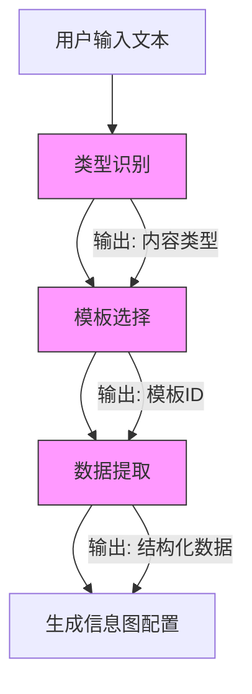
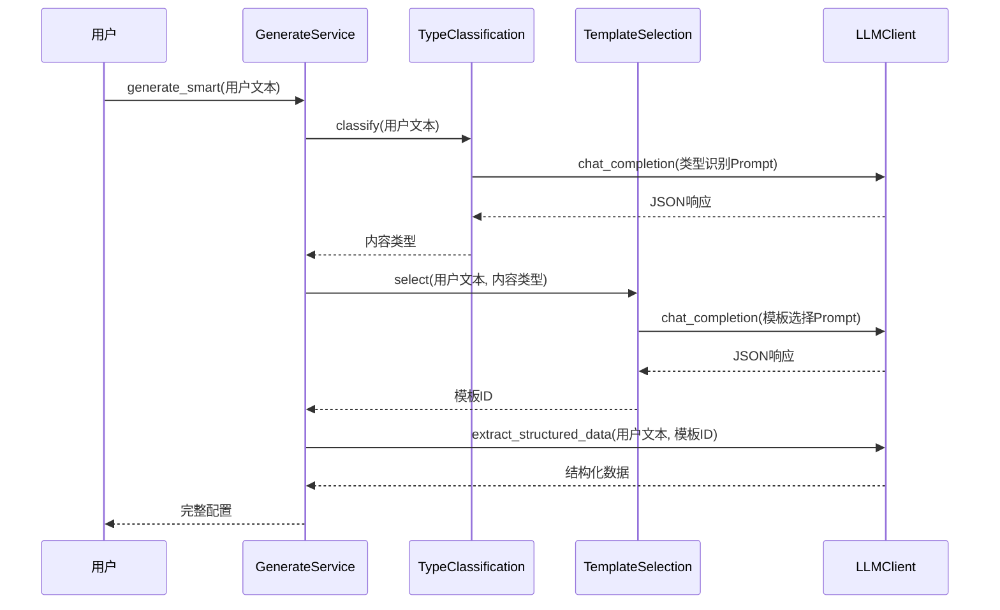
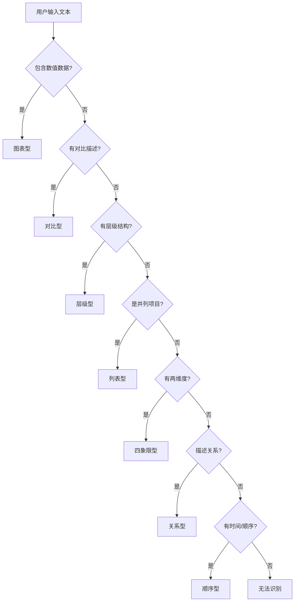
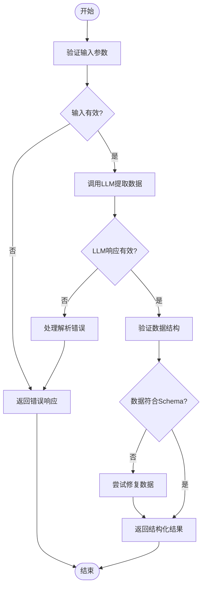
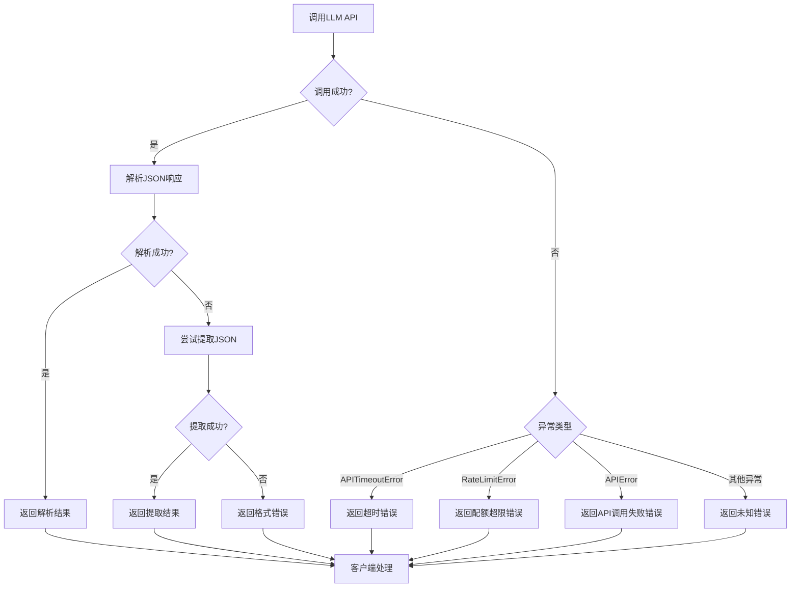
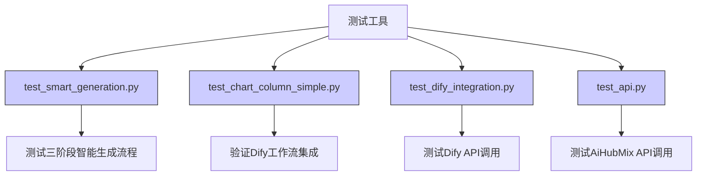

# AI功能测试

<cite>
**本文档引用的文件**   
- [generate_service.py](file://backend/app/services/generate_service.py)
- [llm_client.py](file://backend/app/services/llm_client.py)
- [prompts.py](file://backend/app/utils/prompts.py)
- [type_classification_service.py](file://backend/app/services/type_classification_service.py)
- [template_selection_service.py](file://backend/app/services/template_selection_service.py)
- [data_validator.py](file://backend/app/services/data_validator.py)
- [test_smart_generation.py](file://tests/backend/test_smart_generation.py)
- [test_chart_column_simple.py](file://tests/backend/test_chart_column_simple.py)
- [test_dify_integration.py](file://tests/backend/test_dify_integration.py)
</cite>

## 目录
1. [引言](#引言)
2. [AI功能架构概述](#ai功能架构概述)
3. [核心测试策略](#核心测试策略)
4. [智能模板推荐测试](#智能模板推荐测试)
5. [数据提取与结构化分析测试](#数据提取与结构化分析测试)
6. [错误处理与恢复机制测试](#错误处理与恢复机制测试)
7. [测试工具与模拟方法](#测试工具与模拟方法)
8. [测试用例设计原则](#测试用例设计原则)
9. [结论](#结论)

## 引言

本文档系统化地记录了针对大语言模型（LLM）集成的AI功能测试方法。重点描述了如何验证智能模板推荐、数据提取和结构化分析的准确性与鲁棒性。文档涵盖了测试用例的设计原则、边界情况处理、LLM响应解析验证以及错误恢复机制，并提供了模拟LLM响应的测试工具和验证生成数据质量的方法。

## AI功能架构概述

系统采用三阶段智能生成流程，通过大语言模型实现从用户输入文本到信息图配置的自动化转换。该流程包括类型识别、模板选择和数据提取三个关键阶段。

**图示来源**
- [generate_service.py](file://backend/app/services/generate_service.py#L47-L122)

**节来源**
- [generate_service.py](file://backend/app/services/generate_service.py#L1-L465)

## 核心测试策略

AI功能的测试策略围绕三阶段流程构建，确保每个阶段的准确性和可靠性。测试重点关注输入文本的边界情况处理、LLM响应的解析验证以及错误恢复机制的有效性。

### 三阶段流程测试

三阶段流程是AI功能的核心，每个阶段都有明确的输入输出和验证标准。

**图示来源**
- [generate_service.py](file://backend/app/services/generate_service.py#L47-L122)
- [type_classification_service.py](file://backend/app/services/type_classification_service.py#L50-L89)
- [template_selection_service.py](file://backend/app/services/template_selection_service.py#L72-L113)

**节来源**
- [generate_service.py](file://backend/app/services/generate_service.py#L47-L122)

## 智能模板推荐测试

智能模板推荐功能通过分析用户输入文本的内容特征，从可用模板列表中推荐最适合的信息图模板。测试重点验证推荐算法的准确性和鲁棒性。

### 推荐算法验证

推荐算法基于预定义的7大分类体系，通过分析文本特征来确定最佳模板。测试用例设计需覆盖各种内容类型和边界情况。

**图示来源**
- [prompts.py](file://backend/app/utils/prompts.py#L42-L84)

**节来源**
- [prompts.py](file://backend/app/utils/prompts.py#L8-L127)

## 数据提取与结构化分析测试

数据提取功能负责从用户文本中提取关键信息，并按照指定的数据结构进行组织。测试重点验证数据提取的准确性、结构化程度和错误处理能力。

### 数据提取流程

数据提取流程通过精心设计的Prompt引导LLM生成符合特定JSON Schema的结构化数据。测试需验证生成数据的完整性和格式正确性。

**图示来源**
- [llm_client.py](file://backend/app/services/llm_client.py#L155-L206)
- [data_validator.py](file://backend/app/services/data_validator.py#L14-L102)

**节来源**
- [llm_client.py](file://backend/app/services/llm_client.py#L155-L206)

## 错误处理与恢复机制测试

系统实现了多层次的错误处理与恢复机制，确保在各种异常情况下仍能提供可靠的服务。测试重点验证异常捕获、错误恢复和降级策略的有效性。

### 错误处理流程

系统对LLM调用过程中的各种异常进行了全面处理，包括API超时、配额超限和格式错误等。

**图示来源**
- [llm_client.py](file://backend/app/services/llm_client.py#L81-L92)
- [type_classification_service.py](file://backend/app/services/type_classification_service.py#L75-L80)
- [template_selection_service.py](file://backend/app/services/template_selection_service.py#L90-L95)

**节来源**
- [llm_client.py](file://backend/app/services/llm_client.py#L81-L92)

## 测试工具与模拟方法

系统提供了多种测试工具和模拟方法，用于验证AI功能的各个方面。这些工具支持集成测试、单元测试和端到端测试。

### 测试工具集

测试工具集包括多个专用测试脚本，用于验证不同方面的功能。

**图示来源**
- [test_smart_generation.py](file://tests/backend/test_smart_generation.py#L1-L157)
- [test_chart_column_simple.py](file://tests/backend/test_chart_column_simple.py#L1-L186)
- [test_dify_integration.py](file://tests/backend/test_dify_integration.py#L1-L64)
- [test_api.py](file://tests/backend/test_api.py#L1-L46)

**节来源**
- [test_smart_generation.py](file://tests/backend/test_smart_generation.py#L1-L157)

## 测试用例设计原则

测试用例设计遵循系统化的原则，确保覆盖各种场景和边界情况。设计原则包括功能覆盖、边界测试、异常处理和性能评估。

### 测试用例分类

测试用例按功能和场景进行分类，确保全面覆盖。

| 测试类别 | 测试重点 | 示例 |
|---------|---------|------|
| **功能测试** | 验证核心功能的正确性 | 顺序型文本识别为sequence类型 |
| **边界测试** | 验证极端情况的处理 | 空文本、超长文本、特殊字符 |
| **异常测试** | 验证错误处理机制 | 模板不存在、API调用失败 |
| **性能测试** | 验证响应时间和资源消耗 | 大量并发请求、复杂文本处理 |
| **集成测试** | 验证组件间协作 | 三阶段流程端到端测试 |

**表来源**
- [test_smart_generation.py](file://tests/backend/test_smart_generation.py#L28-L48)
- [test_chart_column_simple.py](file://tests/backend/test_chart_column_simple.py#L29-L53)

**节来源**
- [test_smart_generation.py](file://tests/backend/test_smart_generation.py#L28-L48)

## 结论

本文档系统地记录了AI功能的测试方法，特别是针对大语言模型集成的测试策略。通过三阶段流程的详细分析，我们建立了全面的测试框架，涵盖了智能模板推荐、数据提取和结构化分析的准确性与鲁棒性验证。测试用例设计原则确保了对不同输入文本的边界情况处理、LLM响应的解析验证以及错误恢复机制的全面覆盖。提供的测试工具和模拟方法为持续验证生成数据质量提供了有效手段。这些测试策略和方法为确保AI功能的可靠性和稳定性奠定了坚实基础。