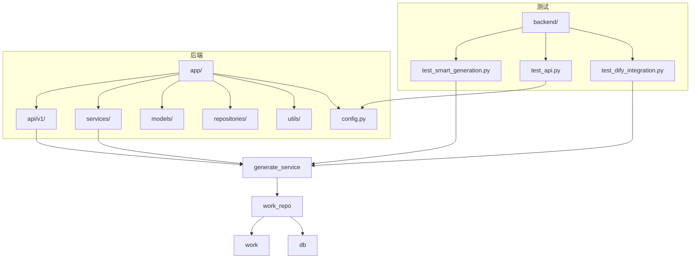
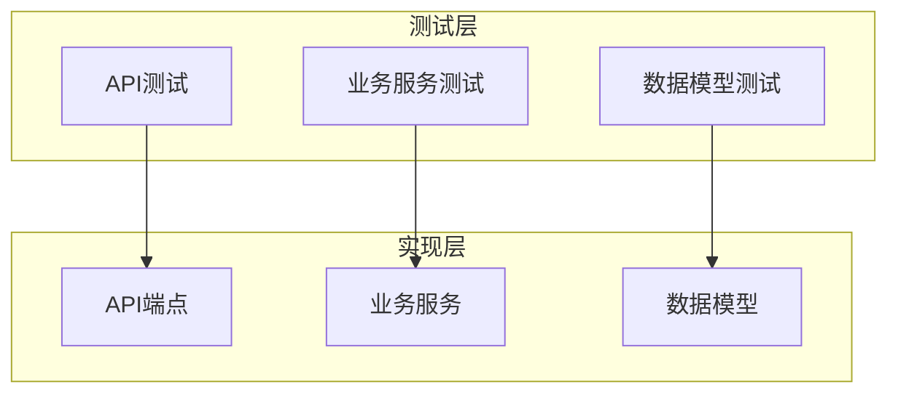
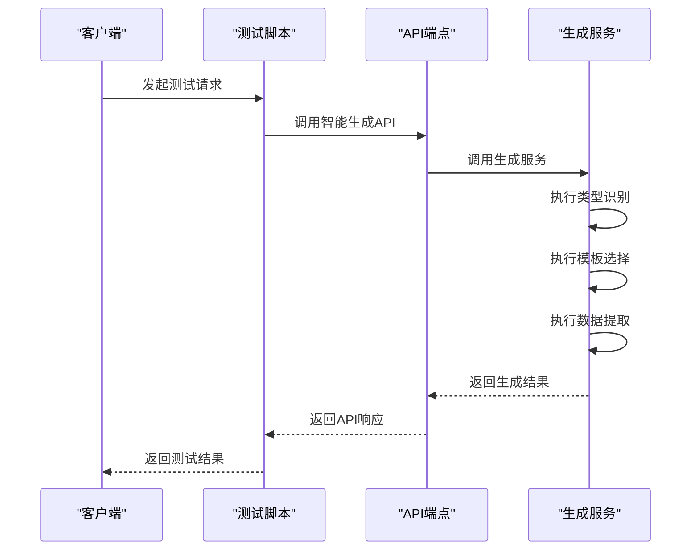
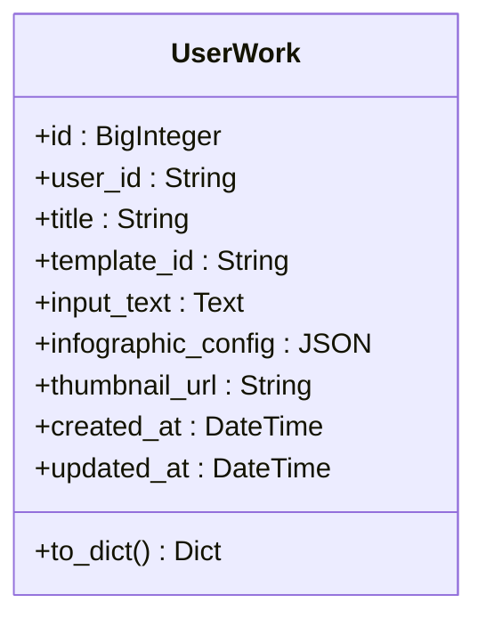
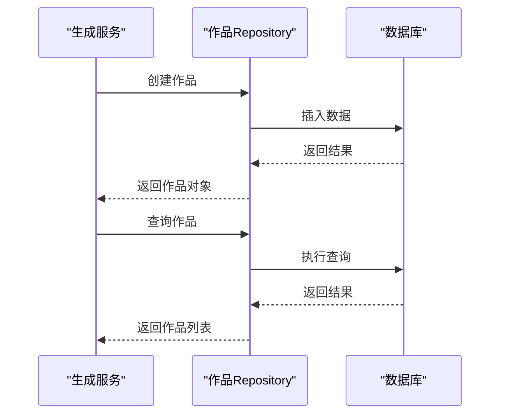
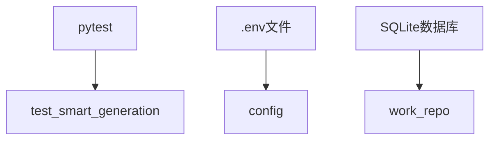

# 单元测试

<cite>
**本文档引用的文件**
- [test_smart_generation.py](file://tests/backend/test_smart_generation.py)
- [generate_service.py](file://backend/app/services/generate_service.py)
- [generate.py](file://backend/app/api/v1/generate.py)
- [work.py](file://backend/app/models/work.py)
- [work_repo.py](file://backend/app/repositories/work_repo.py)
- [db.py](file://backend/app/utils/db.py)
- [config.py](file://backend/app/config.py)
</cite>

## 目录
1. [简介](#简介)
2. [项目结构](#项目结构)
3. [核心组件](#核心组件)
4. [架构概述](#架构概述)
5. [详细组件分析](#详细组件分析)
6. [依赖分析](#依赖分析)
7. [性能考虑](#性能考虑)
8. [故障排除指南](#故障排除指南)
9. [结论](#结论)
10. [附录](#附录)（如有必要）

## 简介
本文档详细说明了项目的单元测试策略，重点覆盖后端API端点、业务服务和数据模型的测试实现。文档解释了如何使用Python测试框架对FastAPI路由进行隔离测试，包括请求处理、参数验证和异常处理的测试用例设计。同时提供了具体的代码示例，展示如何模拟数据库交互和外部服务调用。文档还包含测试覆盖率要求、断言模式和最佳实践，确保核心逻辑的可靠性。

## 项目结构
项目包含一个全面的测试套件，主要集中在`tests/backend/`目录下。测试策略涵盖了从API端点到业务服务和数据模型的各个层面。测试文件包括集成测试、API调用测试、Dify集成测试等，确保系统的各个组件都能正确工作。



**Diagram sources**
- [test_smart_generation.py](file://tests/backend/test_smart_generation.py)
- [generate_service.py](file://backend/app/services/generate_service.py)
- [generate.py](file://backend/app/api/v1/generate.py)
- [work.py](file://backend/app/models/work.py)
- [work_repo.py](file://backend/app/repositories/work_repo.py)
- [db.py](file://backend/app/utils/db.py)
- [config.py](file://backend/app/config.py)

**Section sources**
- [test_smart_generation.py](file://tests/backend/test_smart_generation.py)
- [generate_service.py](file://backend/app/services/generate_service.py)
- [generate.py](file://backend/app/api/v1/generate.py)
- [work.py](file://backend/app/models/work.py)
- [work_repo.py](file://backend/app/repositories/work_repo.py)
- [db.py](file://backend/app/utils/db.py)
- [config.py](file://backend/app/config.py)

## 核心组件
项目的单元测试策略主要围绕以下几个核心组件展开：
- **API端点测试**：使用`test_smart_generation.py`等文件对FastAPI路由进行隔离测试。
- **业务服务测试**：测试`generate_service.py`中的服务逻辑，包括类型识别、模板选择和数据提取。
- **数据模型测试**：测试`work.py`中的数据模型，确保数据结构的正确性。
- **数据库交互测试**：测试`work_repo.py`中的数据库操作，确保数据持久化逻辑的正确性。

**Section sources**
- [test_smart_generation.py](file://tests/backend/test_smart_generation.py)
- [generate_service.py](file://backend/app/services/generate_service.py)
- [work.py](file://backend/app/models/work.py)
- [work_repo.py](file://backend/app/repositories/work_repo.py)

## 架构概述
系统的测试架构采用分层测试策略，从API端点到业务服务再到数据模型，每一层都有相应的测试用例。这种分层测试策略确保了系统的各个组件都能独立测试，同时也能够进行集成测试，确保组件之间的交互正确无误。



**Diagram sources**
- [test_smart_generation.py](file://tests/backend/test_smart_generation.py)
- [generate_service.py](file://backend/app/services/generate_service.py)
- [work.py](file://backend/app/models/work.py)

## 详细组件分析

### API端点测试
API端点测试主要集中在`test_smart_generation.py`文件中，该文件测试了智能生成流程的各个阶段，包括类型识别、模板选择和数据提取。

#### 对于API/Service组件：


**Diagram sources**
- [test_smart_generation.py](file://tests/backend/test_smart_generation.py)
- [generate.py](file://backend/app/api/v1/generate.py)
- [generate_service.py](file://backend/app/services/generate_service.py)

### 业务服务测试
业务服务测试主要集中在`generate_service.py`文件中，该文件测试了生成服务的各个方法，包括`generate_smart`、`recommend_templates`和`extract_data`。

#### 对于复杂逻辑组件：
```mermaid
flowchart TD
Start([开始]) --> TypeClassification["类型识别"]
TypeClassification --> TemplateSelection["模板选择"]
TemplateSelection --> DataExtraction["数据提取"]
DataExtraction --> End([结束])
Note over TypeClassification,DataExtraction: 智能生成流程的三个阶段
```

**Diagram sources**
- [generate_service.py](file://backend/app/services/generate_service.py)

### 数据模型测试
数据模型测试主要集中在`work.py`文件中，该文件定义了用户作品的数据库模型。测试确保数据模型的字段定义和数据类型正确无误。

#### 对于对象导向组件：


**Diagram sources**
- [work.py](file://backend/app/models/work.py)

### 数据库交互测试
数据库交互测试主要集中在`work_repo.py`文件中，该文件定义了作品Repository，负责与数据库进行交互。测试确保数据库操作的正确性，包括创建、查询和分页。

#### 对于API/Service组件：


**Diagram sources**
- [work_repo.py](file://backend/app/repositories/work_repo.py)
- [db.py](file://backend/app/utils/db.py)

## 依赖分析
项目的测试依赖主要集中在以下几个方面：
- **测试框架**：使用`pytest`和`pytest-asyncio`进行测试。
- **环境配置**：通过`.env`文件加载环境变量，确保测试环境的正确配置。
- **数据库**：使用SQLite数据库进行测试，确保数据持久化逻辑的正确性。



**Diagram sources**
- [test_smart_generation.py](file://tests/backend/test_smart_generation.py)
- [config.py](file://backend/app/config.py)
- [work_repo.py](file://backend/app/repositories/work_repo.py)

**Section sources**
- [test_smart_generation.py](file://tests/backend/test_smart_generation.py)
- [config.py](file://backend/app/config.py)
- [work_repo.py](file://backend/app/repositories/work_repo.py)

## 性能考虑
在进行单元测试时，性能是一个重要的考虑因素。测试脚本通过异步调用和并发执行来提高测试效率。此外，测试脚本还记录了各个阶段的耗时，帮助识别性能瓶颈。

**Section sources**
- [test_smart_generation.py](file://tests/backend/test_smart_generation.py)

## 故障排除指南
在进行单元测试时，可能会遇到一些常见问题，如环境配置错误、数据库连接失败等。以下是一些常见的故障排除步骤：
- **检查环境变量**：确保`.env`文件中的环境变量正确配置。
- **检查数据库连接**：确保数据库服务正在运行，并且连接字符串正确。
- **检查API密钥**：确保API密钥正确，并且有足够的权限。

**Section sources**
- [check_config.py](file://tests/backend/check_config.py)

## 结论
本文档详细说明了项目的单元测试策略，涵盖了API端点、业务服务和数据模型的测试实现。通过分层测试策略，确保了系统的各个组件都能正确工作。测试脚本通过异步调用和并发执行提高了测试效率，并记录了各个阶段的耗时，帮助识别性能瓶颈。通过遵循最佳实践，确保了核心逻辑的可靠性。