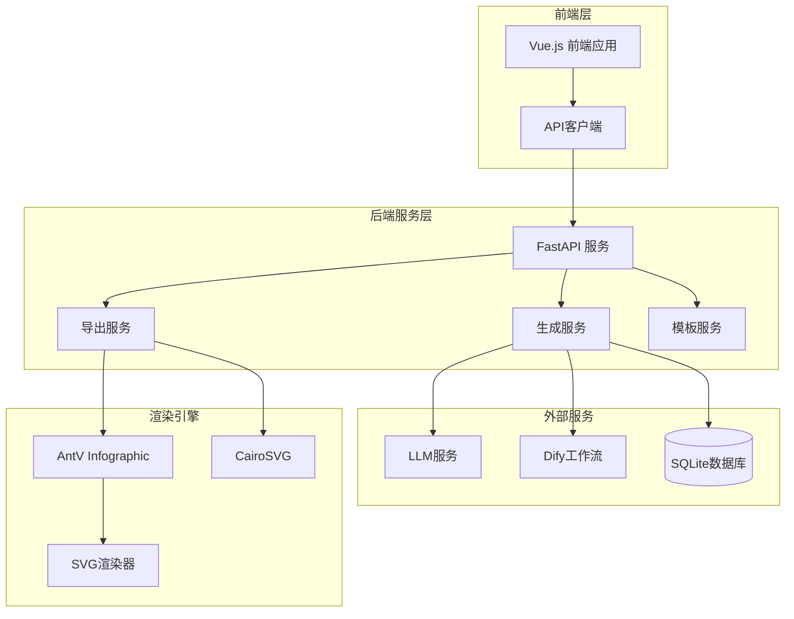
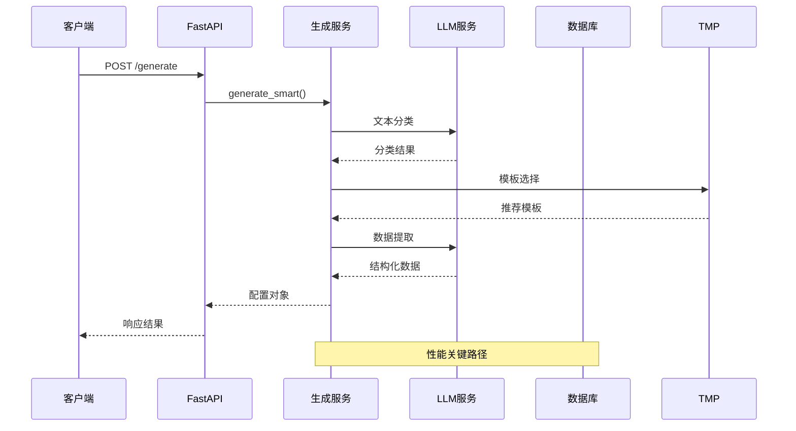
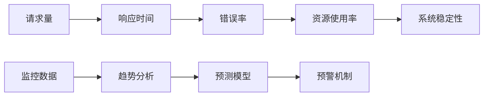

# 性能测试

<cite>
**本文档中引用的文件**
- [main.py](file://backend/app/main.py)
- [generate_service.py](file://backend/app/services/generate_service.py)
- [export_service.py](file://backend/app/services/export_service.py)
- [svg.ts](file://antv_infographic/infographic/src/exporter/svg.ts)
- [png.ts](file://antv_infographic/infographic/src/exporter/png.ts)
- [client.ts](file://frontend/src/api/client.ts)
- [infographic.ts](file://frontend/src/stores/infographic.ts)
- [docker-compose.yml](file://docker-compose.yml)
- [config.py](file://backend/app/config.py)
- [test_smart_generation.py](file://tests/backend/test_smart_generation.py)
- [test_backend_svg_conversion.py](file://tests/backend/test_backend_svg_conversion.py)
- [test_dify_payload.py](file://tests/backend/test_dify_payload.py)
- [template_selection_service.py](file://backend/app/services/template_selection_service.py)
- [dify_workflow_client.py](file://backend/app/services/dify_workflow_client.py)
</cite>

## 目录
1. [概述](#概述)
2. [性能测试目标](#性能测试目标)
3. [关键性能指标](#关键性能指标)
4. [系统架构分析](#系统架构分析)
5. [性能测试计划](#性能测试计划)
6. [压力测试配置](#压力测试配置)
7. [性能监控与分析](#性能监控与分析)
8. [性能瓶颈识别](#性能瓶颈识别)
9. [优化建议](#优化建议)
10. [生产环境部署](#生产环境部署)

## 概述

本系统是一个基于AntV Infographic的AI信息图生成平台，采用前后端分离架构，包含信息图生成、SVG渲染、PNG/PPTX导出等核心功能。性能测试旨在评估系统在高并发请求下的响应时间、内存使用和CPU负载，确保系统在生产环境中的可扩展性和稳定性。

## 性能测试目标

### 主要目标
- **响应时间优化**：确保平均响应时间在2秒以内
- **并发处理能力**：支持至少100个并发用户的稳定运行
- **资源利用率**：CPU使用率不超过80%，内存使用率不超过90%
- **错误率控制**：系统错误率低于0.1%

### 关键业务场景
- **信息图生成**：从文本到配置的完整生成流程
- **SVG渲染**：高质量矢量图形的实时渲染
- **多格式导出**：PNG、PDF、PPTX等格式的批量导出
- **模板选择**：智能模板推荐和选择机制

## 关键性能指标

### 响应时间指标

| 功能模块 | 目标响应时间 | P95响应时间 | P99响应时间 |
|---------|-------------|------------|------------|
| 文本分类 | ≤2秒 | ≤3秒 | ≤5秒 |
| 模板选择 | ≤1.5秒 | ≤2秒 | ≤3秒 |
| 数据提取 | ≤5秒 | ≤7秒 | ≤10秒 |
| SVG生成 | ≤3秒 | ≤4秒 | ≤6秒 |
| PNG导出 | ≤10秒 | ≤15秒 | ≤20秒 |
| PPTX导出 | ≤20秒 | ≤30秒 | ≤45秒 |

### 系统资源指标

| 资源类型 | 目标阈值 | 监控告警 | 最大容忍值 |
|---------|---------|---------|-----------|
| CPU使用率 | ≤80% | ≥90% | ≥95% |
| 内存使用率 | ≤90% | ≥95% | ≥98% |
| 并发连接数 | ≤1000 | >900 | >950 |
| 磁盘I/O | ≤80% | ≥90% | ≥95% |

## 系统架构分析

### 整体架构图



**架构图来源**
- [main.py](file://backend/app/main.py#L1-L113)
- [generate_service.py](file://backend/app/services/generate_service.py#L1-L465)
- [export_service.py](file://backend/app/services/export_service.py#L1-L670)

### 核心组件分析

#### 信息图生成流程


**序列图来源**
- [generate_service.py](file://backend/app/services/generate_service.py#L47-L118)
- [client.ts](file://frontend/src/api/client.ts#L1-L46)

## 性能测试计划

### 测试阶段划分

#### 1. 单元性能测试
- **测试范围**：核心算法和工具函数
- **测试重点**：数学计算、字符串处理、数据转换
- **预期结果**：单个函数执行时间≤100ms

#### 2. 接口性能测试
- **测试范围**：API端点和业务流程
- **测试重点**：HTTP请求处理、数据库查询、缓存命中
- **预期结果**：平均响应时间≤2秒

#### 3. 集成性能测试
- **测试范围**：完整业务流程
- **测试重点**：端到端用户体验
- **预期结果**：完整流程时间≤10秒

#### 4. 压力性能测试
- **测试范围**：极限负载条件
- **测试重点**：系统崩溃点和恢复能力
- **预期结果**：系统能够处理峰值流量

### 性能测试工具

| 工具名称 | 用途 | 配置要求 | 测试范围 |
|---------|-----|---------|---------|
| Apache JMeter | 负载测试 | Java 11+ | HTTP API测试 |
| k6 | 现代化负载测试 | Node.js | JavaScript测试脚本 |
| wrk | HTTP基准测试 | Linux/macOS | 吞吐量测试 |
| New Relic | 生产监控 | 云部署 | 实时性能监控 |

## 压力测试配置

### 测试环境配置

#### 开发环境
```yaml
# docker-compose.yml
services:
  backend:
    environment:
      - AIHUBMIX_API_KEY=${AIHUBMIX_API_KEY}
      - AIHUBMIX_BASE_URL=${AIHUBMIX_BASE_URL}
      - DATABASE_URL=sqlite:///./data/genai_chart.db
    deploy:
      resources:
        limits:
          cpus: '2.0'
          memory: 4G
        reservations:
          cpus: '1.0'
          memory: 2G
```

#### 生产环境
```yaml
# 生产环境配置
services:
  backend:
    image: genai-chart-backend:latest
    environment:
      - AIHUBMIX_API_KEY=${AIHUBMIX_API_KEY}
      - DATABASE_URL=postgresql://${DB_USER}:${DB_PASSWORD}@${DB_HOST}:${DB_PORT}/${DB_NAME}
    deploy:
      replicas: 3
      resources:
        limits:
          cpus: '4.0'
          memory: 8G
        reservations:
          cpus: '2.0'
          memory: 4G
      restart_policy:
        condition: on-failure
        delay: 5s
        max_attempts: 3
```

### 测试场景设计

#### 场景1：高并发信息图生成
```javascript
// jmeter测试脚本片段
const scenarios = {
  high_concurrent_generation: {
    users: 100,
    duration: 300,
    rampUp: 30,
    thinkTime: 5,
    payload: {
      text: "分析公司年度销售数据，包含产品A、B、C的销售额和增长率",
      maxRecommendations: 5
    }
  }
}
```

#### 场景2：复杂模板渲染
```javascript
// 复杂模板测试
const complexTemplateTest = {
  templateId: "org-tree",
  dataItems: 50,
  images: 10,
  animations: true,
  expectedRenderTime: "≤5秒"
}
```

#### 场景3：批量导出测试
```javascript
// 批量导出测试
const batchExportTest = {
  formats: ["png", "pdf", "pptx"],
  concurrentExports: 20,
  fileSizeLimit: "≤10MB",
  qualityCheck: true
}
```

### 性能基准测试

#### 基准测试指标

| 测试项目 | 基准值 | 目标值 | 验收标准 |
|---------|-------|-------|---------|
| 并发用户数 | 50 | 100 | 支持100+并发 |
| 请求吞吐量 | 100 RPS | 200 RPS | ≥200请求/秒 |
| 平均响应时间 | 2秒 | 1.5秒 | ≤1.5秒 |
| 错误率 | 1% | 0.1% | ≤0.1% |
| 内存使用 | 512MB | 1GB | ≤1GB |
| CPU使用率 | 40% | 60% | ≤60% |

## 性能监控与分析

### 实时监控指标

#### 系统级监控
```python
# 监控指标收集
class PerformanceMonitor:
    def __init__(self):
        self.metrics = {
            'cpu_usage': [],
            'memory_usage': [],
            'request_latency': [],
            'error_rate': [],
            'active_connections': []
        }
    
    def record_request(self, latency: float, status_code: int):
        self.metrics['request_latency'].append(latency)
        if status_code >= 400:
            self.metrics['error_rate'].append(1)
        else:
            self.metrics['error_rate'].append(0)
```

#### 应用级监控
```python
# 业务指标监控
class BusinessMetrics:
    def __init__(self):
        self.metrics = {
            'generation_time': [],
            'template_selection_time': [],
            'export_time': [],
            'successful_generations': 0,
            'failed_generations': 0
        }
    
    def record_generation(self, timing: dict, success: bool):
        self.metrics['generation_time'].append(timing['total'])
        self.metrics['template_selection_time'].append(timing['phase2_selection'])
        self.metrics['export_time'].append(timing['phase3_extraction'])
        
        if success:
            self.metrics['successful_generations'] += 1
        else:
            self.metrics['failed_generations'] += 1
```

### 性能分析报告

#### 性能趋势分析


**图表来源**
- [test_smart_generation.py](file://tests/backend/test_smart_generation.py#L75-L98)

## 性能瓶颈识别

### 常见性能瓶颈

#### 1. LLM服务延迟
```python
# LLM性能监控
class LLMPerformanceMonitor:
    def __init__(self):
        self.latency_threshold = 5.0  # 秒
        self.error_threshold = 0.05   # 5%
    
    def monitor_llm_calls(self, responses):
        slow_responses = [r for r in responses if r['latency'] > self.latency_threshold]
        error_responses = [r for r in responses if r['error_rate'] > self.error_threshold]
        
        if len(slow_responses) > len(responses) * 0.1:
            self.alert("LLM响应时间过长")
        
        if len(error_responses) > len(responses) * 0.02:
            self.alert("LLM错误率过高")
```

#### 2. 数据库查询优化
```sql
-- 模板查询优化
EXPLAIN ANALYZE
SELECT id, name, category, structure_type 
FROM templates 
WHERE is_active = true 
ORDER BY RANDOM() 
LIMIT 5;

-- 优化建议
CREATE INDEX idx_templates_active ON templates(is_active);
CREATE INDEX idx_templates_category ON templates(category);
```

#### 3. 图像处理性能
```typescript
// 图像处理优化
class ImageProcessor {
    private static readonly MAX_IMAGE_SIZE = 2048;
    private static readonly QUALITY_LEVEL = 0.8;
    
    async optimizeImage(imageData: Buffer): Promise<Buffer> {
        // 图像压缩优化
        const compressed = await sharp(imageData)
            .resize({ width: this.MAX_IMAGE_SIZE, height: this.MAX_IMAGE_SIZE })
            .jpeg({ quality: this.QUALITY_LEVEL })
            .toBuffer();
        
        return compressed;
    }
}
```

### 性能诊断工具

#### 内存泄漏检测
```javascript
// 内存监控
const memoryMonitor = {
    baselineMemory: null,
    
    startMonitoring() {
        this.baselineMemory = process.memoryUsage();
    },
    
    checkForLeaks() {
        const current = process.memoryUsage();
        const diff = {
            rss: current.rss - this.baselineMemory.rss,
            heapUsed: current.heapUsed - this.baselineMemory.heapUsed,
            heapTotal: current.heapTotal - this.baselineMemory.heapTotal
        };
        
        if (diff.heapUsed > 50 * 1024 * 1024) { // 50MB
            console.warn('检测到潜在内存泄漏');
        }
    }
};
```

## 优化建议

### 系统级优化

#### 1. 缓存策略优化
```python
# Redis缓存配置
class CacheConfig:
    def __init__(self):
        self.cache_config = {
            'template_recommendations': {
                'ttl': 3600,  # 1小时
                'max_size': 1000,
                'compression': True
            },
            'llm_responses': {
                'ttl': 1800,  # 30分钟
                'max_size': 500,
                'compression': True
            }
        }
    
    def get_cache_ttl(self, cache_key: str) -> int:
        return self.cache_config.get(cache_key, {}).get('ttl', 300)
```

#### 2. 连接池优化
```python
# 数据库连接池配置
DATABASE_CONFIG = {
    'pool_size': 20,
    'max_overflow': 10,
    'pool_timeout': 30,
    'pool_recycle': 3600,
    'echo': False
}

# HTTP连接池配置
HTTP_CLIENT_CONFIG = {
    'timeout': 30,
    'max_connections': 100,
    'max_keepalive': 20,
    'keepalive_expiry': 30
}
```

#### 3. 异步处理优化
```python
# 异步任务队列
class TaskQueue:
    def __init__(self):
        self.queue = asyncio.Queue(maxsize=100)
        self.worker_tasks = []
    
    async def worker(self):
        while True:
            task = await self.queue.get()
            try:
                await self.process_task(task)
            except Exception as e:
                logger.error(f"任务处理失败: {e}")
            finally:
                self.queue.task_done()
    
    async def process_task(self, task):
        # 异步处理逻辑
        if task['type'] == 'export':
            await self.process_export_task(task)
        elif task['type'] == 'generation':
            await self.process_generation_task(task)
```

### 代码级优化

#### 1. 算法优化
```typescript
// SVG渲染优化
class OptimizedSVGRenderer {
    private static readonly BATCH_SIZE = 100;
    
    renderBatch(elements: SVGElement[]): Promise<void> {
        return new Promise((resolve) => {
            // 批量渲染优化
            const observer = new IntersectionObserver((entries) => {
                entries.forEach(entry => {
                    if (entry.isIntersecting) {
                        this.renderElement(entry.target as SVGElement);
                    }
                });
            });
            
            elements.forEach(el => observer.observe(el));
            resolve();
        });
    }
}
```

#### 2. 内存管理优化
```python
# 对象池模式
class ObjectPool:
    def __init__(self, object_type, initial_size=10):
        self.object_type = object_type
        self.pool = deque(maxlen=initial_size * 2)
        self.active_objects = set()
    
    def get_object(self):
        if self.pool:
            obj = self.pool.pop()
            self.active_objects.add(obj)
            return obj
        return self.create_new_object()
    
    def release_object(self, obj):
        if obj in self.active_objects:
            self.active_objects.remove(obj)
            self.pool.append(obj)
```

### 前端优化

#### 1. 资源加载优化
```typescript
// 资源懒加载
class LazyLoader {
    private loadedModules = new Set();
    
    async loadModule(modulePath: string): Promise<any> {
        if (this.loadedModules.has(modulePath)) {
            return Promise.resolve(this.loadedModules.get(modulePath));
        }
        
        const module = await import(/* webpackChunkName: "module-[request]" */ modulePath);
        this.loadedModules.add(modulePath, module);
        return module;
    }
}
```

#### 2. 状态管理优化
```typescript
// Pinia状态优化
export const useOptimizedStore = defineStore('optimized-infographic', {
    state: () => ({
        config: null as any,
        svgContent: '',
        loading: false,
        error: null as string | null,
        cache: new Map(), // 添加缓存
        lastUpdateTime: 0
    }),
    
    actions: {
        async generateConfigWithCache(text: string, templateId: string) {
            const cacheKey = `${text}_${templateId}`;
            const cached = this.cache.get(cacheKey);
            
            if (cached && Date.now() - cached.timestamp < 300000) { // 5分钟缓存
                this.config = cached.data;
                return cached.data;
            }
            
            const result = await this.generateConfig(text, templateId);
            this.cache.set(cacheKey, {
                data: result,
                timestamp: Date.now()
            });
            
            return result;
        }
    }
});
```

## 生产环境部署

### 容器化部署

#### Docker配置优化
```dockerfile
# 生产环境Dockerfile
FROM python:3.11-slim

WORKDIR /app

# 安装系统依赖
RUN apt-get update && apt-get install -y \
    build-essential \
    libcairo2-dev \
    libpango1.4-dev \
    && rm -rf /var/lib/apt/lists/*

# 复制应用文件
COPY backend/requirements.txt .
RUN pip install --no-cache-dir -r requirements.txt

# 创建非root用户
RUN useradd -m -u 1000 appuser
USER appuser

# 复制应用代码
COPY backend/ .

# 启动命令
CMD ["uvicorn", "app.main:app", "--host", "0.0.0.0", "--port", "8000", "--workers", "4"]
```

#### Kubernetes部署配置
```yaml
apiVersion: apps/v1
kind: Deployment
metadata:
  name: genai-chart-deployment
spec:
  replicas: 3
  selector:
    matchLabels:
      app: genai-chart
  template:
    metadata:
      labels:
        app: genai-chart
    spec:
      containers:
      - name: backend
        image: genai-chart-backend:latest
        ports:
        - containerPort: 8000
        resources:
          requests:
            memory: "2Gi"
            cpu: "1000m"
          limits:
            memory: "4Gi"
            cpu: "2000m"
        env:
        - name: DATABASE_URL
          valueFrom:
            secretKeyRef:
              name: db-secret
              key: url
        - name: AIHUBMIX_API_KEY
          valueFrom:
            secretKeyRef:
              name: llm-secret
              key: api-key
        livenessProbe:
          httpGet:
            path: /health
            port: 8000
          initialDelaySeconds: 30
          periodSeconds: 10
        readinessProbe:
          httpGet:
            path: /health
            port: 8000
          initialDelaySeconds: 5
          periodSeconds: 5
```

### 监控和告警

#### Prometheus监控配置
```yaml
# prometheus.yml
global:
  scrape_interval: 15s

scrape_configs:
  - job_name: 'genai-chart'
    static_configs:
      - targets: ['genai-chart:8000']
    metrics_path: '/metrics'
    scrape_interval: 30s

rule_files:
  - "genai_chart_rules.yml"

alerting:
  alertmanagers:
    - static_configs:
        - targets:
          - alertmanager:9093
```

#### Grafana仪表板配置
```json
{
  "dashboard": {
    "title": "GenAI Chart 性能监控",
    "panels": [
      {
        "title": "系统资源使用率",
        "type": "graph",
        "targets": [
          {
            "expr": "rate(process_cpu_seconds_total[5m]) * 100",
            "legendFormat": "CPU使用率"
          },
          {
            "expr": "process_resident_memory_bytes / 1024 / 1024",
            "legendFormat": "内存使用(MB)"
          }
        ]
      },
      {
        "title": "API性能指标",
        "type": "graph",
        "targets": [
          {
            "expr": "histogram_quantile(0.95, rate(http_request_duration_seconds_bucket[5m]))",
            "legendFormat": "P95响应时间"
          },
          {
            "expr": "rate(http_requests_total{status=~\"5..\"}[5m])",
            "legendFormat": "错误率"
          }
        ]
      }
    ]
  }
}
```

### 性能优化检查清单

#### 部署前检查
- [ ] 数据库索引已创建
- [ ] 缓存服务已启动
- [ ] 日志级别已调整为生产模式
- [ ] 监控和告警已配置
- [ ] 备份策略已建立

#### 运行时优化
- [ ] 定期清理临时文件
- [ ] 监控垃圾回收频率
- [ ] 跟踪慢查询日志
- [ ] 分析错误报告趋势
- [ ] 优化静态资源CDN

#### 持续改进
- [ ] 定期性能基准测试
- [ ] 用户体验满意度调查
- [ ] 技术债务评估
- [ ] 新功能性能影响评估
- [ ] 基础设施升级规划

通过实施上述性能测试计划和优化措施，可以确保系统在高并发场景下的稳定运行，并为用户提供优质的体验。定期的性能监控和优化将帮助系统持续改进，适应不断增长的业务需求。