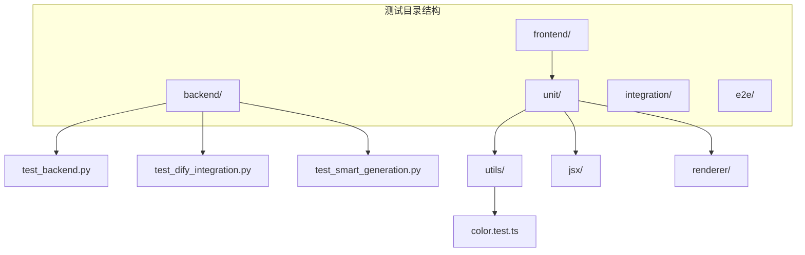
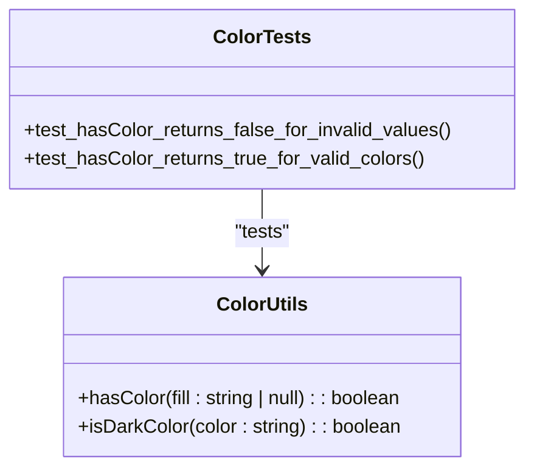
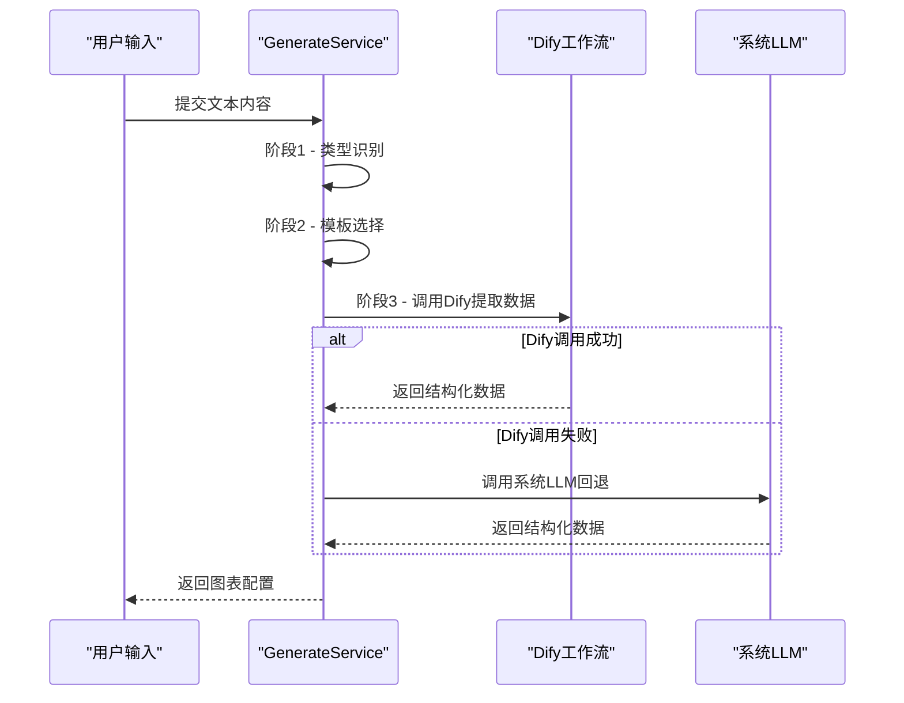

# 测试说明

<cite>
**本文档中引用的文件**  
- [test_api.py](file://tests/backend/test_api.py)
- [test_backend.py](file://tests/backend/test_backend.py)
- [test_dify_integration.py](file://tests/backend/test_dify_integration.py)
- [test_smart_generation.py](file://tests/backend/test_smart_generation.py)
- [color.test.ts](file://antv_infographic/infographic/__tests__/unit/utils/color.test.ts)
- [vitest.config.ts](file://antv_infographic/infographic/vitest.config.ts)
- [package.json](file://antv_infographic/infographic/package.json)
- [color.ts](file://antv_infographic/infographic/src/utils/color.ts)
</cite>

## 目录
1. [引言](#引言)
2. [项目结构与测试布局](#项目结构与测试布局)
3. [后端测试策略](#后端测试策略)
4. [前端测试方法与工具链](#前端测试方法与工具链)
5. [AI功能测试策略](#ai功能测试策略)
6. [性能与压力测试方案](#性能与压力测试方案)
7. [开发者测试指南](#开发者测试指南)
8. [结论](#结论)

## 引言
本文档全面记录了本项目中采用的测试策略和实践，涵盖单元测试、集成测试和端到端测试。重点说明后端服务的测试框架与覆盖率要求，包括API端点、业务逻辑和数据模型的测试用例设计。同时描述前端组件的测试方法和工具链，提供针对LLM集成的AI功能测试策略，包含模拟与验证机制。此外，文档还包含性能测试和压力测试的实施方案，并为开发者提供编写和运行测试的详细指南，以确保代码质量和系统稳定性。

## 项目结构与测试布局
项目采用分层架构，测试文件按模块和类型组织。后端测试位于 `tests/backend/` 目录下，包含API接口、Dify集成、智能生成流程等端到端测试脚本。前端组件测试集中在 `antv_infographic/infographic/__tests__` 目录，采用Vitest框架进行单元测试，覆盖工具函数、JSX渲染、样式处理等核心模块。



**Diagram sources**
- [test_backend.py](file://tests/backend/test_backend.py)
- [test_smart_generation.py](file://tests/backend/test_smart_generation.py)
- [color.test.ts](file://antv_infographic/infographic/__tests__/unit/utils/color.test.ts)

**Section sources**
- [test_backend.py](file://tests/backend/test_backend.py)
- [test_smart_generation.py](file://tests/backend/test_smart_generation.py)
- [color.test.ts](file://antv_infographic/infographic/__tests__/unit/utils/color.test.ts)

## 后端测试策略
后端服务采用Python编写，使用`requests`库进行API测试，覆盖健康检查、模板推荐、数据提取等核心功能。测试脚本通过模拟HTTP请求验证接口响应状态码、数据结构和业务逻辑正确性。

### API端点测试
API测试脚本（如 `test_backend.py`）验证 `/health` 和 `/api/v1/templates/recommend` 等关键端点。测试用例包括正常请求、边界条件和错误处理场景，确保服务具备良好的容错能力。

### 业务逻辑与数据模型测试
通过集成测试脚本（如 `test_smart_generation.py`）验证三阶段智能生成流程：内容类型识别、模板选择和数据提取。每个阶段均记录耗时和置信度，确保系统性能和准确性满足要求。

### 测试覆盖率要求
后端测试要求核心服务模块的代码行覆盖率不低于85%。使用 `pytest-cov` 或类似工具生成覆盖率报告，并在CI/CD流程中作为质量门禁。

**Section sources**
- [test_backend.py](file://tests/backend/test_backend.py)
- [test_smart_generation.py](file://tests/backend/test_smart_generation.py)

## 前端测试方法与工具链
前端组件库基于TypeScript和React生态构建，采用Vitest作为主要测试框架，结合JSDOM提供浏览器环境模拟。测试配置文件 `vitest.config.ts` 设置了测试环境和覆盖率收集规则。

### 单元测试实践
单元测试覆盖工具函数（如颜色处理、SVG渲染）、JSX组件渲染逻辑和状态管理。例如，`color.test.ts` 测试 `hasColor` 函数对各种输入（null、空字符串、"none"、有效颜色值）的处理逻辑。



**Diagram sources**
- [color.ts](file://antv_infographic/infographic/src/utils/color.ts)
- [color.test.ts](file://antv_infographic/infographic/__tests__/unit/utils/color.test.ts)

### 测试运行与CI集成
通过 `package.json` 中的 `test` 脚本（`vitest --run --coverage`）运行测试并生成覆盖率报告。CI流程中执行 `npm run ci` 命令，依次执行构建、测试和代码检查，确保每次提交都符合质量标准。

**Section sources**
- [vitest.config.ts](file://antv_infographic/infographic/vitest.config.ts)
- [package.json](file://antv_infographic/infographic/package.json)
- [color.test.ts](file://antv_infographic/infographic/__tests__/unit/utils/color.test.ts)

## AI功能测试策略
AI功能的核心是LLM集成，通过Dify平台实现工作流驱动的数据提取和图表生成。测试策略重点验证LLM调用的正确性、响应解析的健壮性和回退机制的有效性。

### LLM集成模拟与验证
`test_dify_integration.py` 脚本直接调用 `generate_service.extract_data()` 方法，模拟用户输入并验证返回结果。测试关注点包括：
- Dify工作流是否被正确调用
- 返回的JSON结构是否符合预期
- 提取的数据项是否准确
- 当Dify不可用时，系统LLM回退机制是否生效

### 智能生成流程测试
`test_smart_generation.py` 实现了完整的三阶段集成测试：
1. **类型识别**：验证文本内容能否被正确分类为 sequence、list、comparison、hierarchy 等类型
2. **模板选择**：根据识别类型选择最合适的可视化模板
3. **数据提取**：从原始文本中结构化提取图表所需数据

测试脚本记录各阶段耗时和置信度，用于性能监控和算法优化。



**Diagram sources**
- [test_dify_integration.py](file://tests/backend/test_dify_integration.py)
- [test_smart_generation.py](file://tests/backend/test_smart_generation.py)

**Section sources**
- [test_dify_integration.py](file://tests/backend/test_dify_integration.py)
- [test_smart_generation.py](file://tests/backend/test_smart_generation.py)

## 性能与压力测试方案
性能测试主要关注API响应延迟、LLM调用耗时和图表生成效率。压力测试通过并发请求模拟高负载场景，评估系统稳定性和资源消耗。

### 性能指标监控
在集成测试中记录各阶段处理时间：
- 类型识别耗时
- 模板选择耗时
- 数据提取耗时（区分Dify调用和系统LLM）
- 总响应时间

目标是95%的请求在3秒内完成。

### 压力测试实施
使用 `locust` 或 `k6` 等工具模拟多用户并发请求，测试系统在高负载下的表现。重点关注：
- API服务的吞吐量（RPS）
- 内存和CPU使用率
- 数据库连接池状态
- 第三方API（如Dify）的调用限制

**Section sources**
- [test_smart_generation.py](file://tests/backend/test_smart_generation.py)

## 开发者测试指南
本节为开发者提供编写和运行测试的实用指南。

### 编写测试的最佳实践
- **单元测试**：每个工具函数应有独立测试，覆盖正常路径和边界条件
- **集成测试**：验证跨服务调用，确保数据流正确
- **端到端测试**：模拟真实用户场景，验证完整业务流程
- **AI相关测试**：使用固定输入和预期输出，便于结果验证

### 运行测试命令
```bash
# 运行所有测试（含覆盖率）
npm run test

# 仅运行后端测试
python tests/backend/test_backend.py

# 运行智能生成集成测试
python tests/backend/test_smart_generation.py
```

### 调试技巧
- 使用 `print()` 或日志输出中间结果
- 在 `test_dify_integration.py` 中临时禁用Dify调用以测试回退逻辑
- 通过修改测试用例的输入文本验证不同场景

**Section sources**
- [test_backend.py](file://tests/backend/test_backend.py)
- [test_smart_generation.py](file://tests/backend/test_smart_generation.py)
- [test_dify_integration.py](file://tests/backend/test_dify_integration.py)

## 结论
本项目建立了全面的测试体系，从前端组件到后端服务，再到复杂的AI集成，均有相应的测试策略和工具支持。通过单元测试保证代码质量，集成测试验证业务流程，端到端测试确保系统稳定性。AI功能的测试特别关注LLM调用的可靠性和回退机制。建议持续维护测试覆盖率，定期执行性能和压力测试，以保障系统的长期稳定运行。