# 集成测试

<cite>
**本文档引用的文件**  
- [main.py](file://backend/app/main.py)
- [dify_workflows.yaml](file://backend/app/config/dify_workflows.yaml)
- [export_service.py](file://backend/app/services/export_service.py)
- [generate_service.py](file://backend/app/services/generate_service.py)
- [client.ts](file://frontend/src/api/client.ts)
- [infographic.ts](file://frontend/src/stores/infographic.ts)
- [test_dify_integration.py](file://tests/backend/test_dify_integration.py)
- [test_smart_generation.py](file://tests/backend/test_smart_generation.py)
- [test_pyramid_e2e.py](file://tests/backend/test_pyramid_e2e.py)
- [test_pptx_chinese.py](file://tests/backend/test_pptx_chinese.py)
- [test_api.py](file://tests/backend/test_api.py)
- [README.md](file://README.md)
- [docker-compose.yml](file://docker-compose.yml)
</cite>

## 目录
1. [简介](#简介)
2. [测试环境配置](#测试环境配置)
3. [前后端协作测试](#前后端协作测试)
4. [API与数据库集成测试](#api与数据库集成测试)
5. [可视化渲染与导出功能测试](#可视化渲染与导出功能测试)
6. [Dify工作流集成测试](#dify工作流集成测试)
7. [端到端验证流程](#端到端验证流程)
8. [依赖服务模拟](#依赖服务模拟)
9. [真实数据流验证](#真实数据流验证)
10. [测试最佳实践](#测试最佳实践)

## 简介

本集成测试文档深入阐述了AI信息图生成系统的集成测试方案，重点描述了前后端协作、API与数据库集成、以及可视化渲染与导出功能的端到端验证。文档详细说明了如何测试信息图从数据生成到SVG/PPTX导出的完整流程，包括与Dify工作流的集成测试。提供了测试环境配置、依赖服务模拟和真实数据流验证的指导，确保各组件协同工作的稳定性。

系统采用Vue 3 + TypeScript + Vite作为前端技术栈，Python + FastAPI + SQLAlchemy作为后端技术栈，使用AntV Infographic进行可视化渲染，并通过AiHubMix（兼容OpenAI API）提供AI服务。导出功能支持SVG、PNG、PDF和PPTX格式，其中PPTX导出使用python-pptx库实现。

**Section sources**
- [README.md](file://README.md#L1-L323)

## 测试环境配置

### 开发环境准备

测试环境的配置是确保集成测试成功的基础。系统要求Node.js 18+和Python 3.11+作为运行环境，前端使用npm或yarn进行依赖管理。

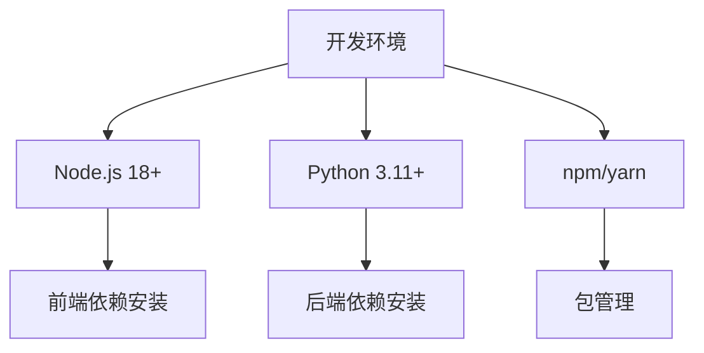

**Diagram sources**
- [README.md](file://README.md#L33-L37)

### 环境变量配置

环境变量配置是测试环境设置的关键环节。系统通过`.env`文件管理环境变量，包括AI服务API密钥、数据库连接等重要配置。

```bash
# AiHubMix LLM配置
AIHUBMIX_API_KEY=your_api_key_here
AIHUBMIX_BASE_URL=https://aihubmix.com/v1
AIHUBMIX_MODEL_RECOMMEND=gpt-4o-mini
AIHUBMIX_MODEL_EXTRACT=gpt-4o-mini

# 应用配置
APP_NAME=AI信息图生成系统
APP_VERSION=1.0.0
DEBUG_MODE=true

# CORS配置
ALLOWED_ORIGINS=http://localhost:5173,http://localhost:3000

# API配置
API_PREFIX=/api/v1
```

**Section sources**
- [README.md](file://README.md#L54-L70)
- [.env.example](file://backend/.env.example#L1-L19)

### Docker环境配置

对于需要一致测试环境的场景，系统提供了Docker编排配置，通过docker-compose.yml文件定义了前后端服务的容器化部署。

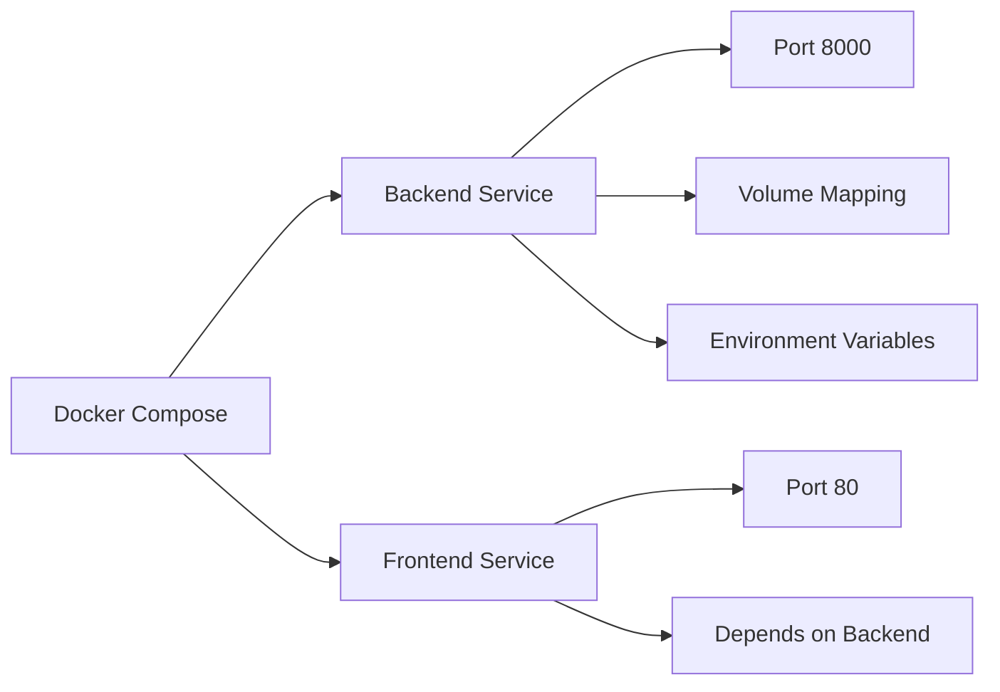

**Diagram sources**
- [docker-compose.yml](file://docker-compose.yml#L1-L55)

## 前后端协作测试

### API客户端配置

前后端协作的核心是API通信。前端通过axios库配置API客户端，设置基础URL、超时时间和请求头，确保与后端服务的稳定通信。

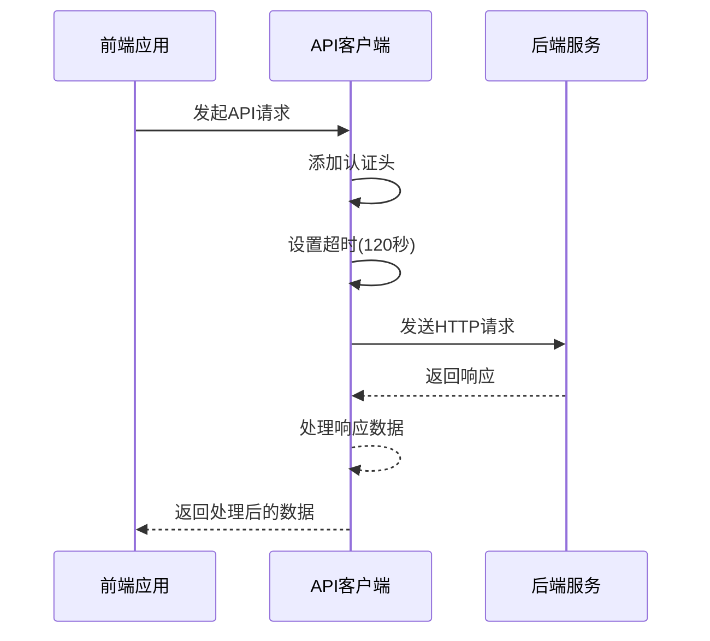

**Diagram sources**
- [client.ts](file://frontend/src/api/client.ts#L1-L46)

### 状态管理测试

前端使用Pinia进行状态管理，`infographic.ts`文件定义了信息图相关的状态存储，包括当前配置、SVG内容、用户输入文本等。

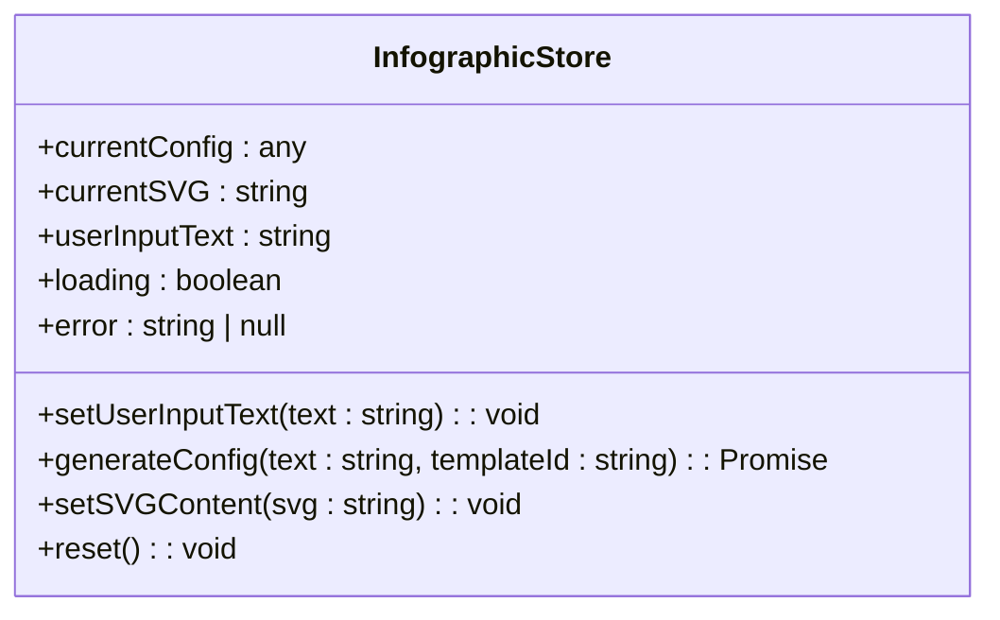

**Diagram sources**
- [infographic.ts](file://frontend/src/stores/infographic.ts#L1-L71)

### 请求响应流程

前后端协作的请求响应流程包括请求拦截、API调用、响应处理和错误处理等环节，确保数据交互的可靠性和用户体验的流畅性。

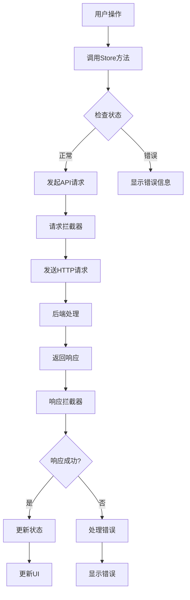

**Section sources**
- [client.ts](file://frontend/src/api/client.ts#L1-L46)
- [infographic.ts](file://frontend/src/stores/infographic.ts#L1-L71)

## API与数据库集成测试

### API路由结构

后端API采用模块化设计，通过FastAPI的路由系统将不同功能的API分组管理，包括模板管理、信息图生成、作品管理和导出功能。

```mermaid
graph TD
A[FastAPI应用] --> B[模板管理]
A --> C[信息图生成]
A --> D[作品管理]
A --> E[导出]
B --> F[/api/v1/templates]
C --> G[/api/v1/generate]
D --> H[/api/v1/works]
E --> I[/api/v1/export]
```

**Section sources**
- [main.py](file://backend/app/main.py#L1-L113)

### CORS配置

跨域资源共享(CORS)配置是API集成的关键部分，确保前端应用能够安全地访问后端API服务。

```python
app.add_middleware(
    CORSMiddleware,
    allow_origins=["*"],  # 临时允许所有来源，用于调试
    allow_credentials=False,  # 与allow_origins=["*"]一起使用
    allow_methods=["*"],
    allow_headers=["*"],
)
```

**Section sources**
- [main.py](file://backend/app/main.py#L28-L36)

### 数据库集成

系统使用SQLAlchemy作为ORM框架，与SQLite/PostgreSQL数据库集成，实现数据的持久化存储和管理。

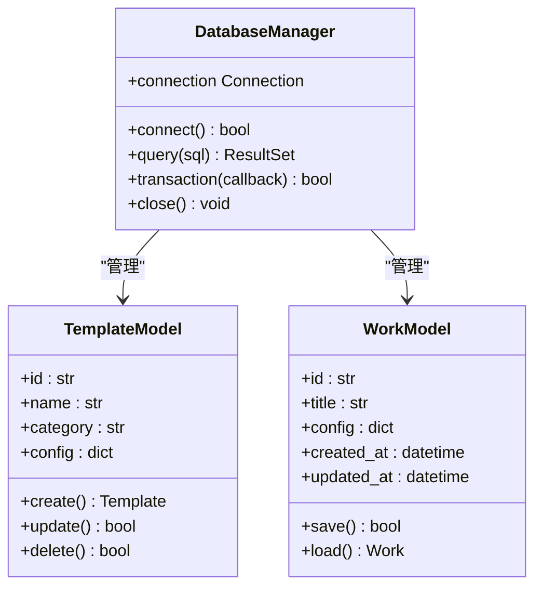

**Section sources**
- [main.py](file://backend/app/main.py#L1-L113)

## 可视化渲染与导出功能测试

### 导出服务架构

导出服务支持SVG、PNG、PDF和PPTX四种格式，通过统一的接口提供导出功能，确保不同格式导出的一致性和可靠性。

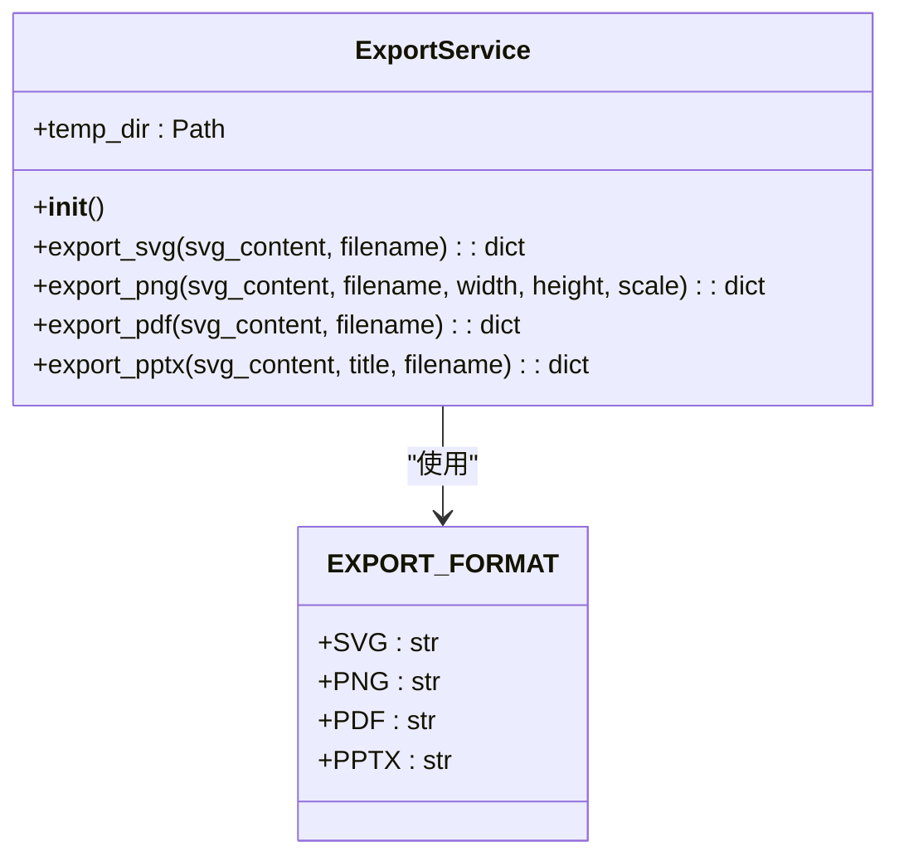

**Diagram sources**
- [export_service.py](file://backend/app/services/export_service.py#L1-L64)

### SVG导出测试

SVG导出是最基础的导出功能，直接将AntV Infographic生成的SVG内容保存为文件，无需额外的转换处理。

```python
def export_svg(self, svg_content: str, filename: Optional[str] = None) -> dict:
    """
    导出SVG格式
    
    Args:
        svg_content: SVG内容字符串
        filename: 可选的文件名
        
    Returns:
        包含文件信息的字典
    """
    if not filename:
        filename = "infographic.svg"
    
    filepath = self.temp_dir / filename
    
    with open(filepath, 'w', encoding='utf-8') as f:
        f.write(svg_content)
    
    return {
        "format": EXPORT_FORMAT_SVG,
        "filename": filename,
        "filepath": str(filepath),
        "size": os.path.getsize(filepath)
    }
```

**Section sources**
- [export_service.py](file://backend/app/services/export_service.py#L26-L50)

### PPTX导出测试

PPTX导出功能使用python-pptx库实现，将SVG内容转换为PPTX幻灯片，支持中文字体的正确显示。

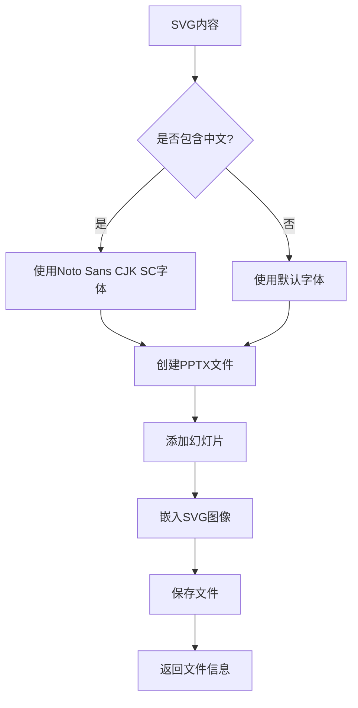

**Section sources**
- [export_service.py](file://backend/app/services/export_service.py#L1-L64)

## Dify工作流集成测试

### Dify工作流配置

系统通过dify_workflows.yaml文件配置Dify工作流的映射关系，定义了不同模板ID对应的工作流配置。

```yaml
# Dify工作流映射配置
chart-column-simple:
  dify_app_id: null
  workflow_name: "chart-column-simple数据生成工作流"
  enabled: true
  fallback_to_system_llm: true

bar-chart-vertical:
  dify_app_id: null
  workflow_name: "垂直柱状图数据生成工作流"
  enabled: true
  fallback_to_system_llm: true
```

**Section sources**
- [dify_workflows.yaml](file://backend/app/config/dify_workflows.yaml#L1-L81)

### Dify集成测试流程

Dify集成测试验证了系统与Dify工作流的集成能力，包括API调用、参数传递和结果处理等环节。

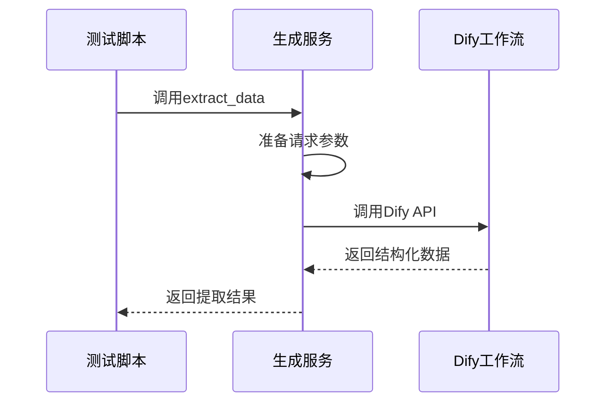

**Section sources**
- [test_dify_integration.py](file://tests/backend/test_dify_integration.py#L1-L64)

### 回退机制测试

系统实现了Dify工作流调用失败时的回退机制，当Dify服务不可用时自动切换到系统LLM进行处理。

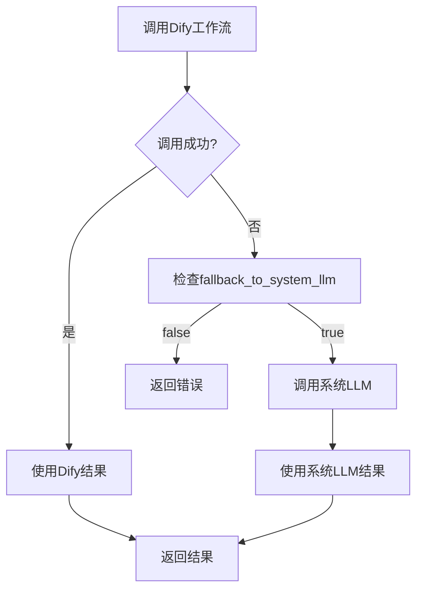

**Section sources**
- [dify_workflows.yaml](file://backend/app/config/dify_workflows.yaml#L1-L81)

## 端到端验证流程

### 智能生成流程测试

端到端测试验证了从用户输入到信息图生成的完整流程，包括类型识别、模板选择和数据提取三个阶段。

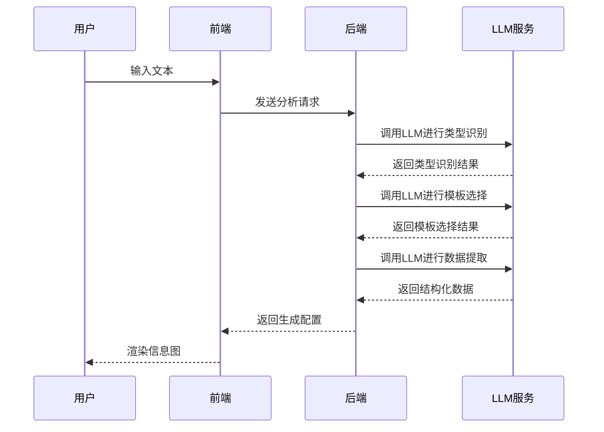

**Section sources**
- [test_smart_generation.py](file://tests/backend/test_smart_generation.py#L1-L157)

### 金字塔徽章测试

金字塔徽章层级模板的端到端测试验证了特定模板的完整流程和配置正确性。

```python
async def test_pyramid_badge():
    """测试金字塔徽章层级模板的完整流程"""
    # 测试输入文本
    test_cases = [
        {
            "name": "会员荣誉等级",
            "text": "我们公司的荣誉体系分为五个等级，金牌会员占比10%，银牌会员占比15%，铜牌会员占比25%，优秀会员占比30%，普通会员占比20%"
        },
        {
            "name": "需求优先级",
            "text": "产品需求按优先级分为：P0核心功能(5%)、P1重要功能(15%)、P2常规功能(30%)、P3次要功能(35%)、P4低优先级(15%)"
        }
    ]
    
    service = get_generate_service()
    
    for i, test_case in enumerate(test_cases, 1):
        # 执行智能生成
        result = await service.generate_smart(user_text=test_case['text'])
        
        # 验证分类、模板选择和配置
        # ...
```

**Section sources**
- [test_pyramid_e2e.py](file://tests/backend/test_pyramid_e2e.py#L1-L134)

## 依赖服务模拟

### LLM服务模拟

在测试环境中，可以通过模拟LLM服务来避免对真实AI服务的依赖，提高测试的稳定性和速度。

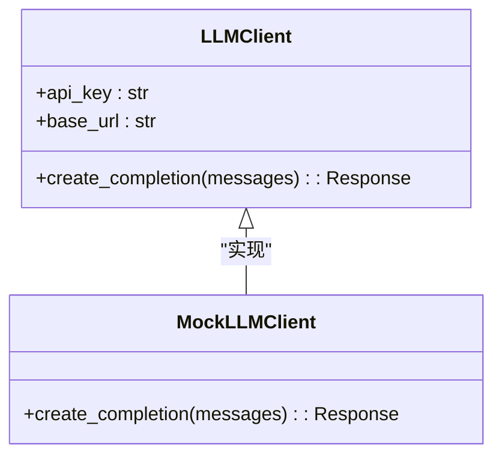

**Section sources**
- [test_api.py](file://tests/backend/test_api.py#L1-L46)

### 数据库模拟

使用SQLite内存数据库或测试专用的数据库实例，避免测试对生产数据的影响。

```python
# 使用内存数据库进行测试
DATABASE_URL = "sqlite:///./test.db"
```

**Section sources**
- [main.py](file://backend/app/main.py#L1-L113)

## 真实数据流验证

### 中文字体测试

PPTX导出中文字体测试验证了中文文本在导出文件中的正确显示。

```python
# 简单的SVG，包含中文文本
svg_content = '''<?xml version="1.0" encoding="UTF-8"?>
<svg xmlns="http://www.w3.org/2000/svg" width="800" height="600" viewBox="0 0 800 600">
  <rect width="800" height="600" fill="#f0f0f0"/>
  <circle cx="400" cy="300" r="150" fill="#4CAF50"/>
  <text x="400" y="300" font-family="Noto Sans CJK SC" font-size="48" fill="white" text-anchor="middle" dominant-baseline="middle">中文测试</text>
  <text x="400" y="360" font-family="Noto Sans CJK SC" font-size="24" fill="#333" text-anchor="middle">这是一个圆形</text>
</svg>'''
```

**Section sources**
- [test_pptx_chinese.py](file://tests/backend/test_pptx_chinese.py#L1-L28)

### 性能统计

集成测试中包含详细的性能统计，帮助识别性能瓶颈和优化方向。

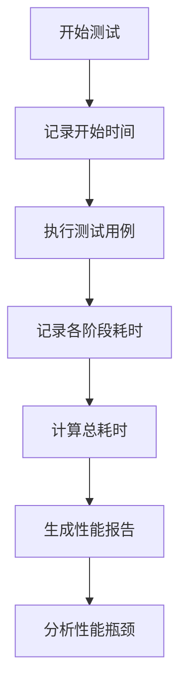

**Section sources**
- [test_smart_generation.py](file://tests/backend/test_smart_generation.py#L1-L157)

## 测试最佳实践

### 测试环境隔离

确保测试环境与生产环境完全隔离，避免测试对生产数据和用户的影响。

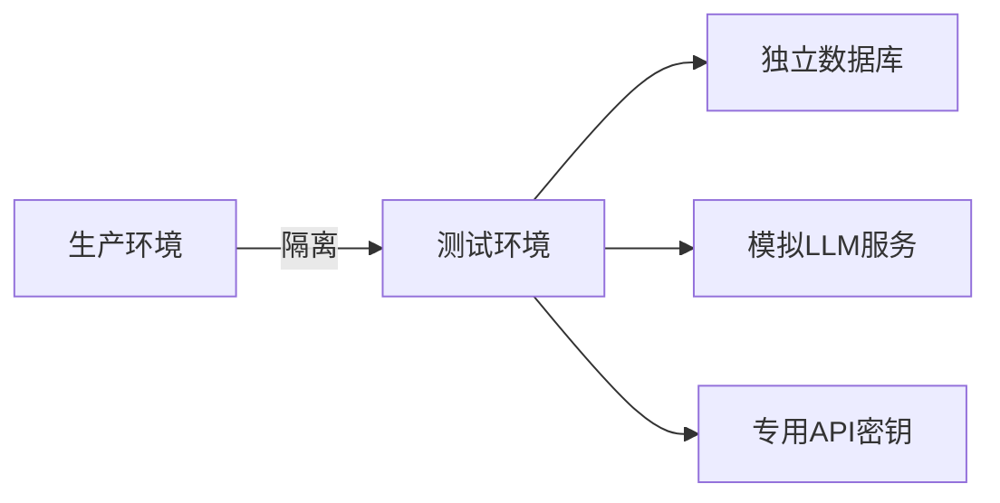

### 自动化测试

建立完整的自动化测试流程，包括单元测试、集成测试和端到端测试，确保代码质量。

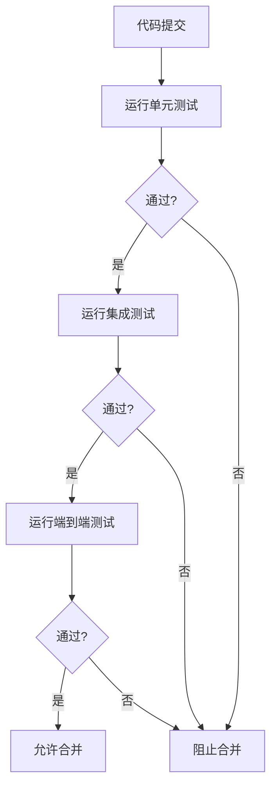

### 测试数据管理

建立规范的测试数据管理机制，确保测试数据的一致性和可重复性。

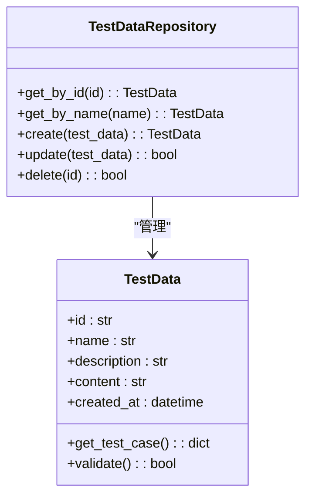

**Section sources**
- [README.md](file://README.md#L285-L296)