# AI集成

<cite>
**本文档引用的文件**
- [generate_service.py](file://backend/app/services/generate_service.py)
- [dify_workflow_client.py](file://backend/app/services/dify_workflow_client.py)
- [llm_client.py](file://backend/app/services/llm_client.py)
- [template_selection_service.py](file://backend/app/services/template_selection_service.py)
- [workflow_mapper.py](file://backend/app/services/workflow_mapper.py)
- [type_classification_service.py](file://backend/app/services/type_classification_service.py)
- [prompts.py](file://backend/app/utils/prompts.py)
- [prompt_manager.py](file://backend/app/utils/prompt_manager.py)
- [dify_workflows.yaml](file://backend/app/config/dify_workflows.yaml)
- [llm_prompts.yaml](file://backend/app/config/llm_prompts.yaml)
- [config.py](file://backend/app/config.py)
- [AIWorkspace.vue](file://frontend/src/views/AIWorkspace/AIWorkspace.vue)
- [workspace.ts](file://frontend/src/stores/workspace.ts)
- [client.ts](file://frontend/src/api/client.ts)
- [generate.py](file://backend/app/api/v1/generate.py)
- [templates.py](file://backend/app/api/v1/templates.py)
</cite>

## 目录
1. [简介](#简介)
2. [系统架构概览](#系统架构概览)
3. [智能模板推荐算法](#智能模板推荐算法)
4. [结构化数据提取](#结构化数据提取)
5. [Dify工作流集成](#dify工作流集成)
6. [LLM提供商切换机制](#llm提供商切换机制)
7. [AI处理流程](#ai处理流程)
8. [提示工程最佳实践](#提示工程最佳实践)
9. [性能优化策略](#性能优化策略)
10. [安全考虑](#安全考虑)
11. [故障排除指南](#故障排除指南)

## 简介

本系统是一个基于人工智能的信息图生成平台，集成了大语言模型(LLM)和Dify工作流技术，为用户提供智能化的信息图设计体验。系统采用三阶段智能生成流程，支持多种LLM提供商和工作流模式，具备强大的模板推荐能力和结构化数据提取功能。

核心特性包括：
- **智能模板推荐**：基于用户输入内容自动匹配最适合的信息图模板
- **多模式数据提取**：支持系统LLM和Dify工作流两种数据生成方式
- **提示工程优化**：精心设计的提示词模板确保高质量输出
- **性能优化**：缓存机制和异步处理提升系统响应速度
- **安全可靠**：完善的错误处理和安全防护机制

## 系统架构概览

系统采用前后端分离架构，后端基于Python FastAPI框架，前端使用Vue.js技术栈，AI能力通过多种LLM提供商和Dify工作流实现。

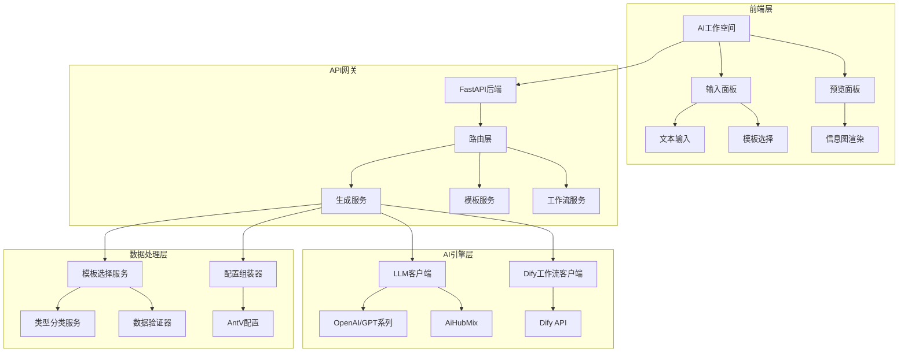

**图表来源**
- [AIWorkspace.vue](file://frontend/src/views/AIWorkspace/AIWorkspace.vue#L1-L136)
- [generate_service.py](file://backend/app/services/generate_service.py#L33-L465)

**章节来源**
- [generate_service.py](file://backend/app/services/generate_service.py#L33-L465)
- [AIWorkspace.vue](file://frontend/src/views/AIWorkspace/AIWorkspace.vue#L1-L136)

## 智能模板推荐算法

### 用户输入分析机制

系统通过三层分析机制对用户输入进行深度理解和分类：

1. **内容类型识别**：基于关键词和语义分析确定内容所属的七大分类体系
2. **特征提取**：识别文本中的关键特征和结构模式
3. **场景匹配**：评估内容适用的各种应用场景

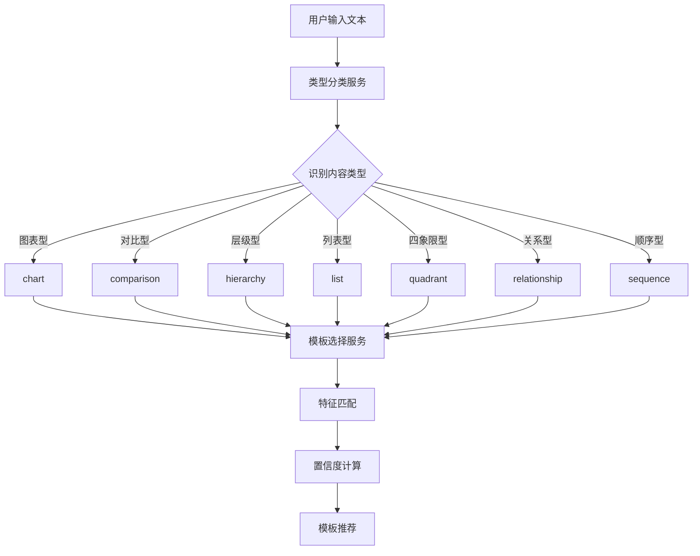

**图表来源**
- [type_classification_service.py](file://backend/app/services/type_classification_service.py#L83-L125)
- [template_selection_service.py](file://backend/app/services/template_selection_service.py#L24-L168)

### 特征提取和模板匹配

模板选择服务采用基于特征匹配的智能算法：

| 内容类型 | 关键词特征 | 视觉复杂度 | 数据项数量 | 特殊特征 |
|---------|-----------|-----------|-----------|---------|
| 图表型 | 数据、增长率、比例、百分比 | 中等 | 2-6项 | 数值可视化 |
| 对比型 | VS、对比、优劣势、差异 | 简单 | 2项 | 并列对比 |
| 层级型 | 组织架构、层级、分类 | 复杂 | 3-10项 | 树形结构 |
| 列表型 | 要点、步骤、特性、功能 | 简单 | 3-8项 | 并列项目 |
| 四象限型 | 矩阵、象限、维度、重要紧急 | 中等 | 4项 | 双维度划分 |
| 关系型 | 关系、因果、影响、联系 | 中等 | 3-6项 | 连接关系 |
| 顺序型 | 步骤、流程、过程、顺序 | 简单 | 3-12项 | 时间序列 |

### 置信度评分机制

系统采用多维度评分机制计算模板匹配度：

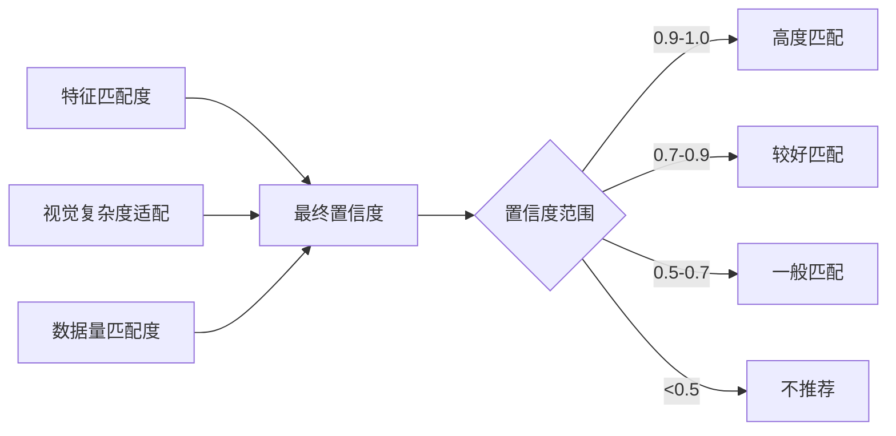

**图表来源**
- [template_selection_service.py](file://backend/app/services/template_selection_service.py#L143-L157)

**章节来源**
- [template_selection_service.py](file://backend/app/services/template_selection_service.py#L24-L168)
- [type_classification_service.py](file://backend/app/services/type_classification_service.py#L83-L125)

## 结构化数据提取

### 提示工程设计

系统采用精心设计的提示词模板确保高质量的数据提取：

#### 模板推荐提示词设计

提示词包含七个维度的分类体系，确保准确识别内容类型：

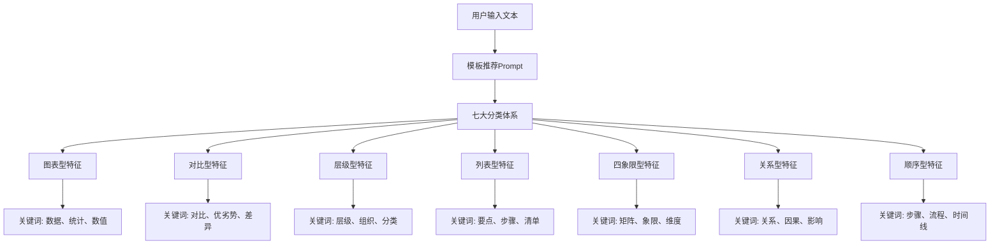

**图表来源**
- [prompts.py](file://backend/app/utils/prompts.py#L32-L126)

#### 数据提取提示词设计

针对不同模板类型设计专门的数据提取提示词：

| 模板类型 | 关键提示词 | 数据结构要求 | 输出格式 |
|---------|-----------|-------------|---------|
| 横向流程图 | 步骤、流程、过程 | items数组 | label+desc+icon |
| 组织架构树 | 层级、组织、部门 | 树形结构 | parent-child关系 |
| 双栏对比 | 对比、优劣势、差异 | 并列数据 | left-right结构 |
| SWOT分析 | SWOT、优势、劣势 | 四象限数据 | quadrant布局 |

### LLM响应解析

系统实现了robust的响应解析机制：

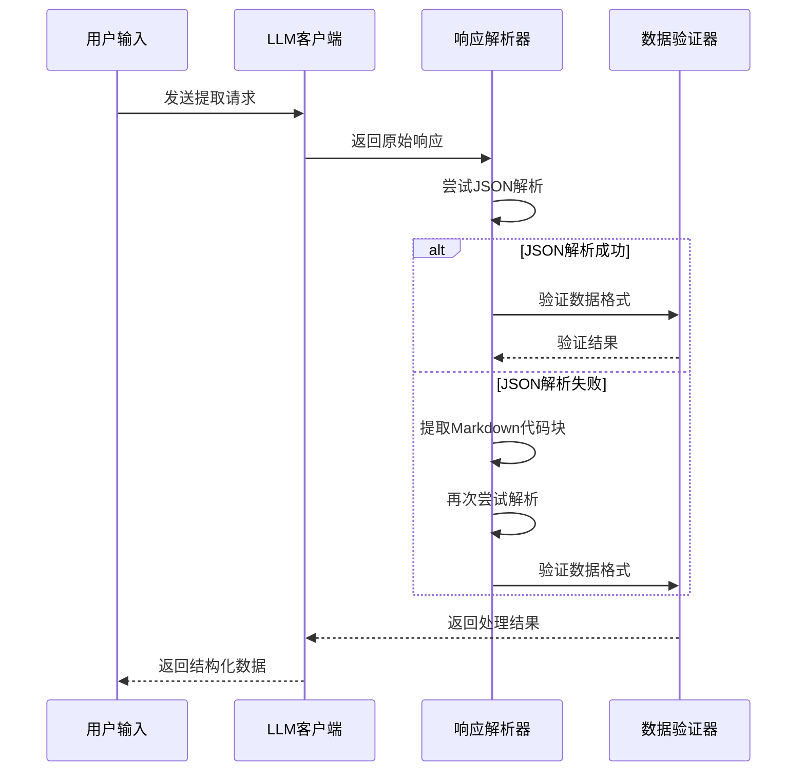

**图表来源**
- [llm_client.py](file://backend/app/services/llm_client.py#L170-L206)
- [type_classification_service.py](file://backend/app/services/type_classification_service.py#L83-L125)

**章节来源**
- [prompts.py](file://backend/app/utils/prompts.py#L131-L209)
- [llm_client.py](file://backend/app/services/llm_client.py#L170-L206)

## Dify工作流集成

### 工作流配置机制

Dify工作流集成通过配置文件管理系统，支持灵活的工作流映射和控制：

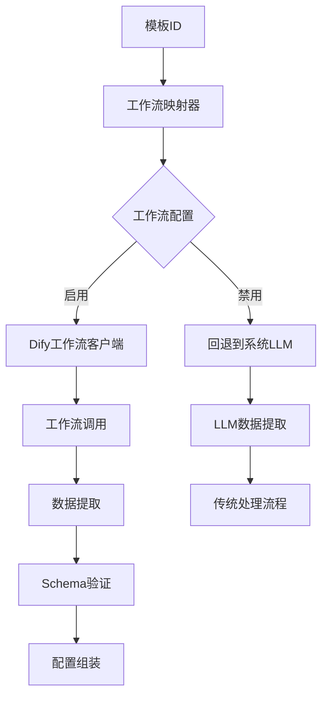

**图表来源**
- [workflow_mapper.py](file://backend/app/services/workflow_mapper.py#L49-L104)
- [dify_workflow_client.py](file://backend/app/services/dify_workflow_client.py#L31-L195)

### 参数传递和结果获取

Dify工作流采用标准化的参数传递机制：

| 参数名称 | 类型 | 必需 | 描述 |
|---------|------|------|------|
| content | string | 是 | 用户输入的文本内容 |
| template | string | 否 | 模板ID，帮助工作流理解目标结构 |
| response_mode | string | 是 | 响应模式（blocking/streaming） |
| user | string | 是 | 用户标识（system-user） |

### 工作流状态监控

系统提供完整的工作流执行监控：

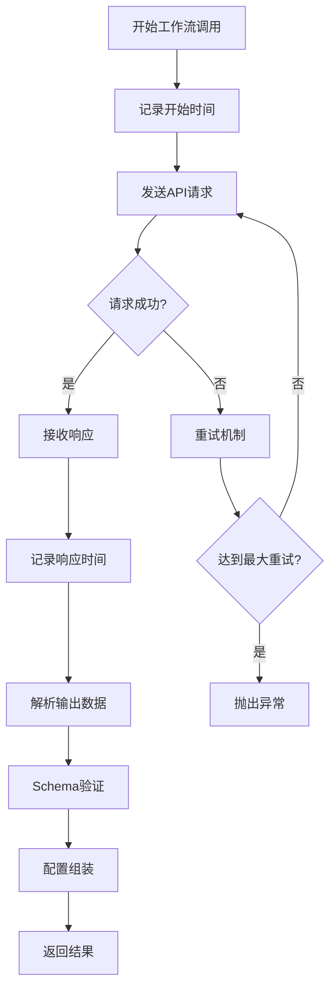

**图表来源**
- [dify_workflow_client.py](file://backend/app/services/dify_workflow_client.py#L31-L195)

**章节来源**
- [dify_workflow_client.py](file://backend/app/services/dify_workflow_client.py#L31-L195)
- [workflow_mapper.py](file://backend/app/services/workflow_mapper.py#L49-L104)

## LLM提供商切换机制

### 系统LLM和Dify工作流模式

系统支持两种主要的数据生成模式，具备智能切换机制：

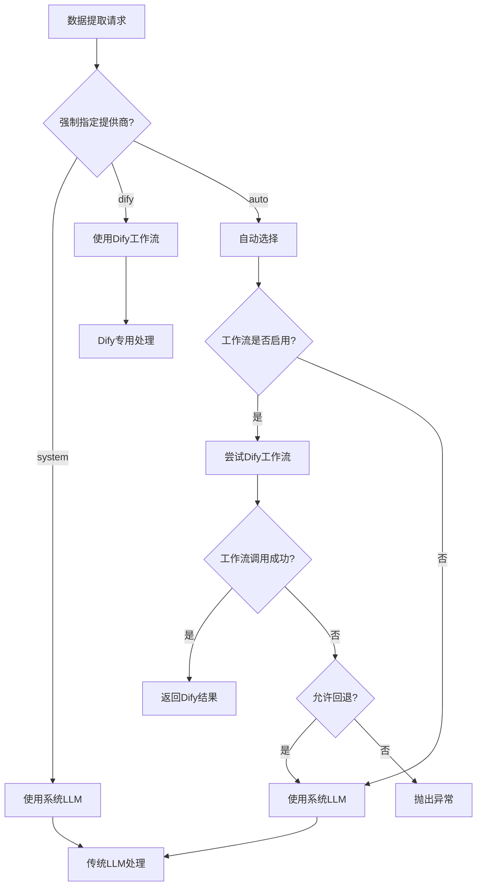

**图表来源**
- [generate_service.py](file://backend/app/services/generate_service.py#L159-L257)

### 配置方式和切换逻辑

系统提供多层次的配置控制：

| 配置层级 | 配置项 | 默认值 | 说明 |
|---------|-------|-------|------|
| 全局配置 | DIFY_API_KEY | "" | Dify API密钥 |
| 全局配置 | DIFY_API_TIMEOUT | 30 | API调用超时时间 |
| 模板配置 | enabled | true | 工作流是否启用 |
| 模板配置 | fallback_to_system_llm | true | 失败时是否回退 |
| 请求配置 | force_provider | null | 强制指定提供商 |

**章节来源**
- [generate_service.py](file://backend/app/services/generate_service.py#L159-L257)
- [config.py](file://backend/app/config.py#L31-L36)

## AI处理流程

### 完整处理流程图

系统采用三阶段智能生成流程，确保高质量的信息图生成：

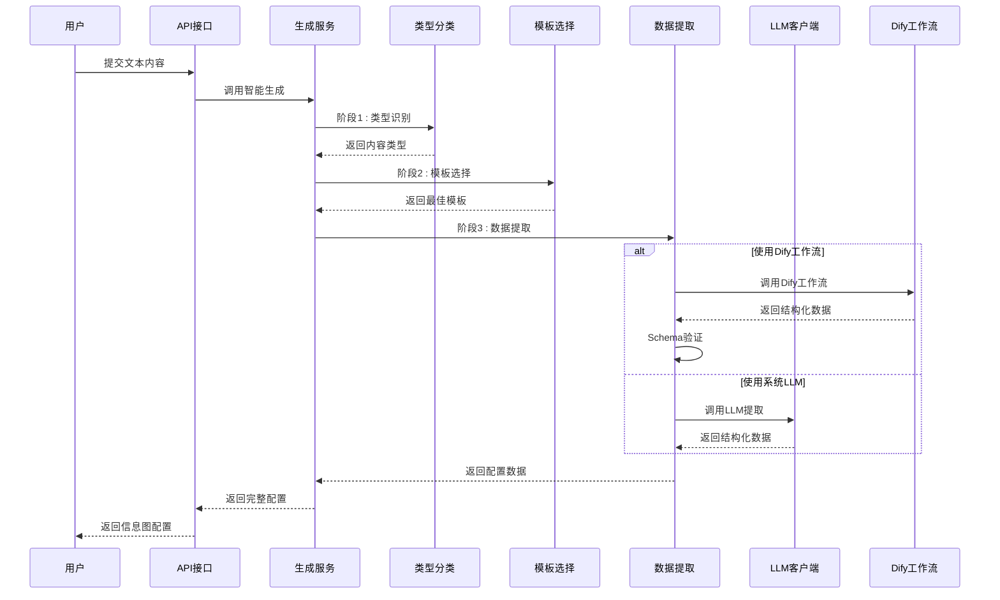

**图表来源**
- [generate_service.py](file://backend/app/services/generate_service.py#L47-L118)

### 性能统计和监控

系统提供详细的性能监控和统计信息：

| 阶段 | 监控指标 | 用途 |
|------|---------|------|
| 阶段1: 类型识别 | phase1_classification | 识别耗时统计 |
| 阶段2: 模板选择 | phase2_selection | 选择耗时统计 |
| 阶段3: 数据提取 | phase3_extraction | 提取耗时统计 |
| Dify调用 | dify_call_time | 工作流响应时间 |
| 总体 | total | 整体处理时间 |

**章节来源**
- [generate_service.py](file://backend/app/services/generate_service.py#L47-L118)

## 提示工程最佳实践

### 提示词设计原则

系统遵循以下提示词设计原则：

1. **清晰的任务定义**：明确告诉LLM需要完成的具体任务
2. **结构化输出要求**：使用JSON格式确保输出的一致性
3. **上下文信息提供**：为LLM提供足够的背景信息
4. **约束条件说明**：明确输出格式和字段要求

### 安全考虑

系统实施多重安全措施：

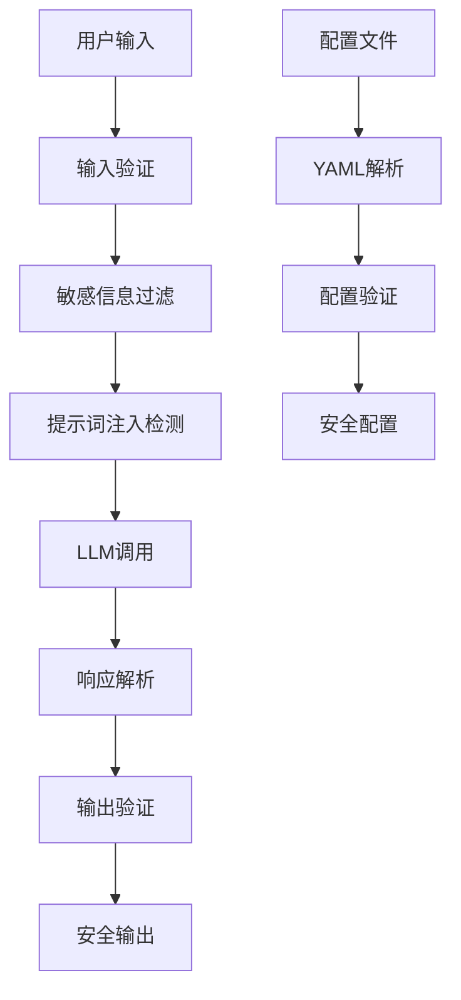

**图表来源**
- [prompt_manager.py](file://backend/app/utils/prompt_manager.py#L84-L122)

### 最佳实践总结

| 实践领域 | 具体措施 | 效果 |
|---------|---------|------|
| 输入安全 | 用户输入验证和过滤 | 防止恶意输入 |
| 输出控制 | JSON格式限制 | 确保结构化输出 |
| 配置管理 | YAML配置文件 | 灵活的参数控制 |
| 错误处理 | 优雅的异常处理 | 提升用户体验 |

**章节来源**
- [prompts.py](file://backend/app/utils/prompts.py#L131-L209)
- [prompt_manager.py](file://backend/app/utils/prompt_manager.py#L84-L122)

## 性能优化策略

### LLM调用缓存

系统实现了多层级的缓存机制：

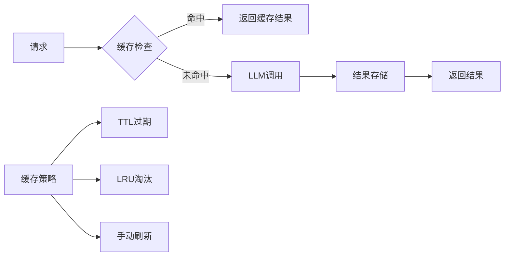

### 异步处理机制

系统采用异步处理提升并发性能：

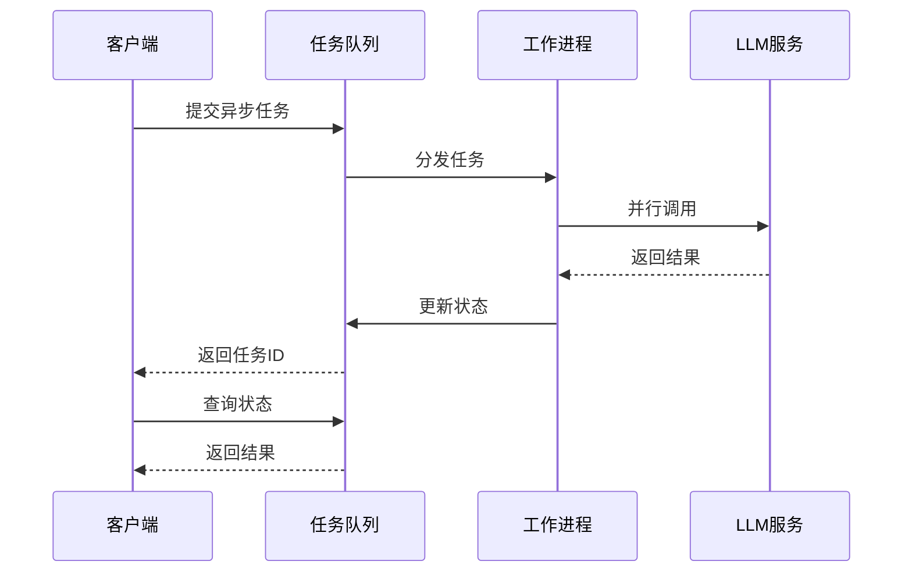

### 性能监控指标

| 指标类别 | 具体指标 | 监控目的 |
|---------|---------|---------|
| 响应时间 | 平均响应时间、P95响应时间 | 性能基线监控 |
| 吞吐量 | 每秒请求数、并发用户数 | 容量规划 |
| 错误率 | API错误率、LLM调用失败率 | 稳定性监控 |
| 资源使用 | CPU使用率、内存占用 | 资源优化 |

**章节来源**
- [generate_service.py](file://backend/app/services/generate_service.py#L159-L257)
- [dify_workflow_client.py](file://backend/app/services/dify_workflow_client.py#L31-L195)

## 安全考虑

### 输入验证和过滤

系统实施严格的输入验证机制：

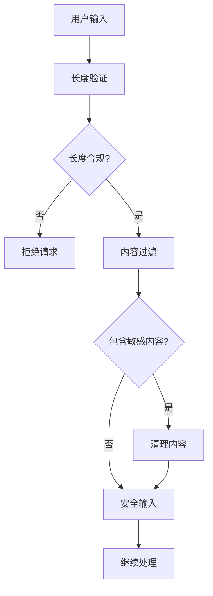

### API安全防护

系统采用多层次的安全防护措施：

| 安全层面 | 具体措施 | 实现位置 |
|---------|---------|---------|
| 认证授权 | API密钥验证 | DIFY_API_KEY |
| 请求限制 | 速率限制 | FastAPI中间件 |
| 输入验证 | 内容过滤 | 前端+后端 |
| 输出保护 | 敏感信息脱敏 | 数据处理层 |

### 错误处理和日志

系统提供完善的错误处理和审计日志：

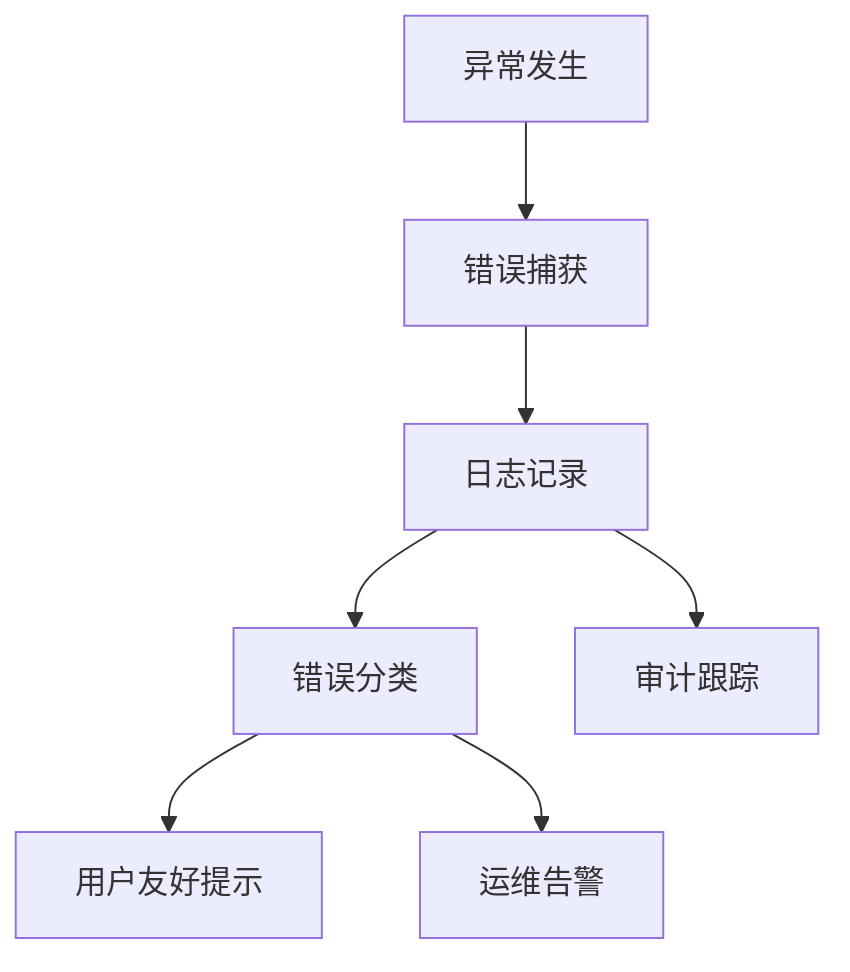

**章节来源**
- [dify_workflow_client.py](file://backend/app/services/dify_workflow_client.py#L77-L195)
- [llm_client.py](file://backend/app/services/llm_client.py#L79-L115)

## 故障排除指南

### 常见问题诊断

| 问题类型 | 症状 | 可能原因 | 解决方案 |
|---------|------|---------|---------|
| LLM调用失败 | API超时、配额不足 | 网络问题、配额限制 | 检查网络连接、升级配额 |
| 工作流调用失败 | Dify API错误 | 配置错误、权限问题 | 检查配置、验证权限 |
| 数据提取错误 | JSON解析失败 | 输出格式不正确 | 调整提示词、增加约束 |
| 模板选择错误 | 推荐不准确 | 分类不准确 | 优化分类逻辑、调整特征 |

### 调试工具和方法

系统提供多种调试工具：

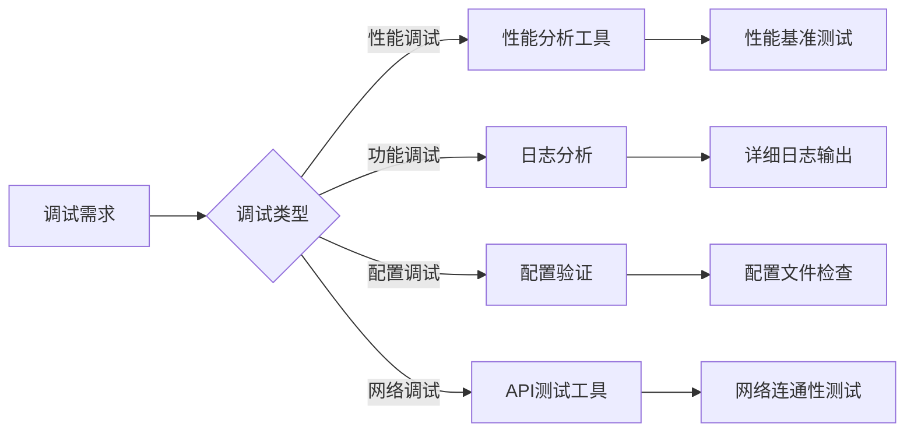

### 监控和告警

系统实施全面的监控和告警机制：

| 监控维度 | 告警阈值 | 响应措施 |
|---------|---------|---------|
| 系统可用性 | 99.9% | 自动故障转移 |
| 响应时间 | >2秒 | 性能优化 |
| 错误率 | >5% | 问题排查 |
| 资源使用 | >80% | 扩容或优化 |

**章节来源**
- [dify_workflow_client.py](file://backend/app/services/dify_workflow_client.py#L77-L195)
- [llm_client.py](file://backend/app/services/llm_client.py#L79-L115)

## 总结

本AI集成系统通过智能模板推荐、结构化数据提取和Dify工作流集成，为用户提供了高效、准确的信息图生成解决方案。系统具备以下核心优势：

1. **智能化程度高**：基于深度学习的模板推荐和内容分析
2. **灵活性强**：支持多种LLM提供商和工作流模式
3. **性能优异**：采用缓存和异步处理优化性能
4. **安全可靠**：完善的输入验证和错误处理机制
5. **易于扩展**：模块化设计便于功能扩展和维护

通过持续的优化和改进，系统能够满足各种复杂的信息图生成需求，为用户提供卓越的AI辅助设计体验。