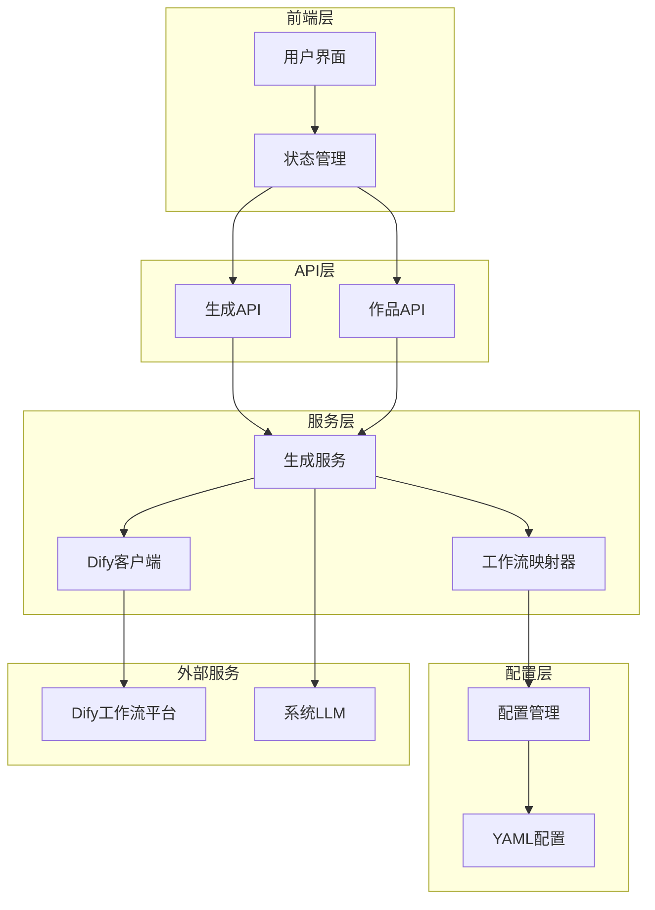
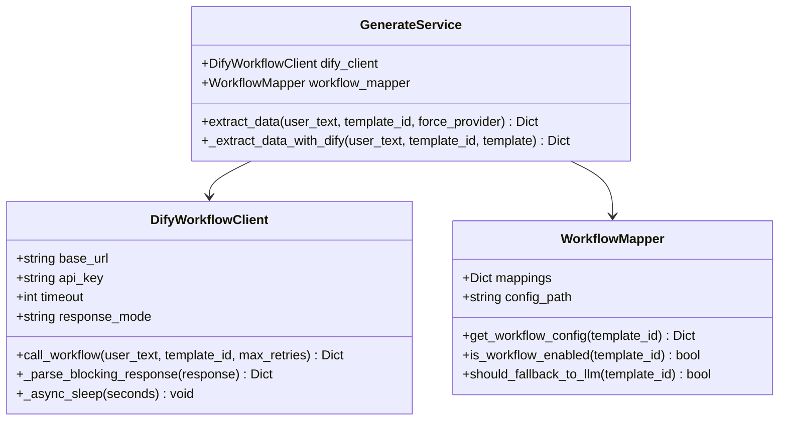
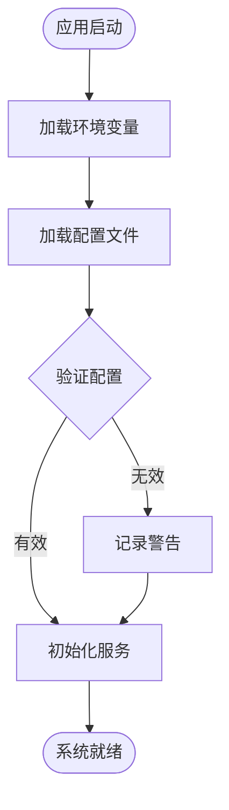
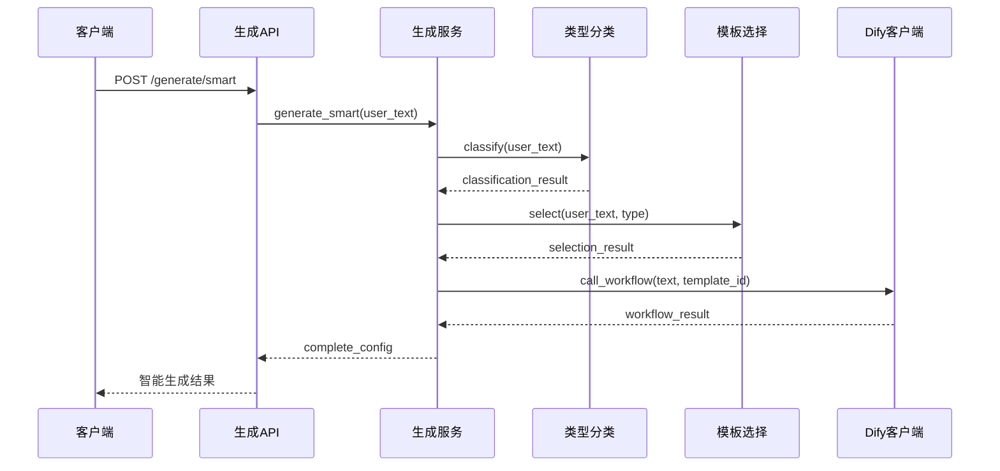
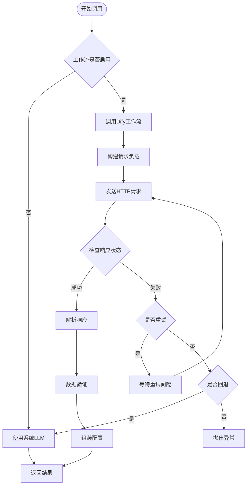
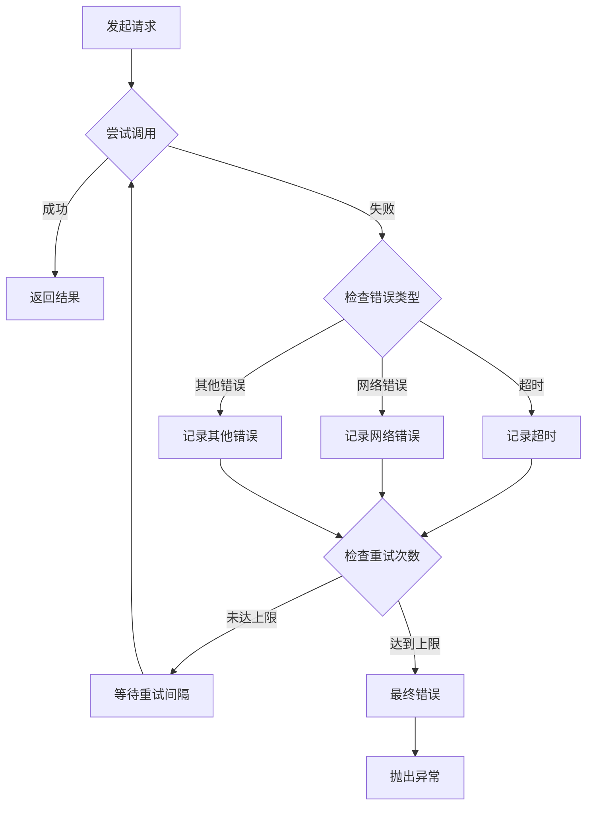
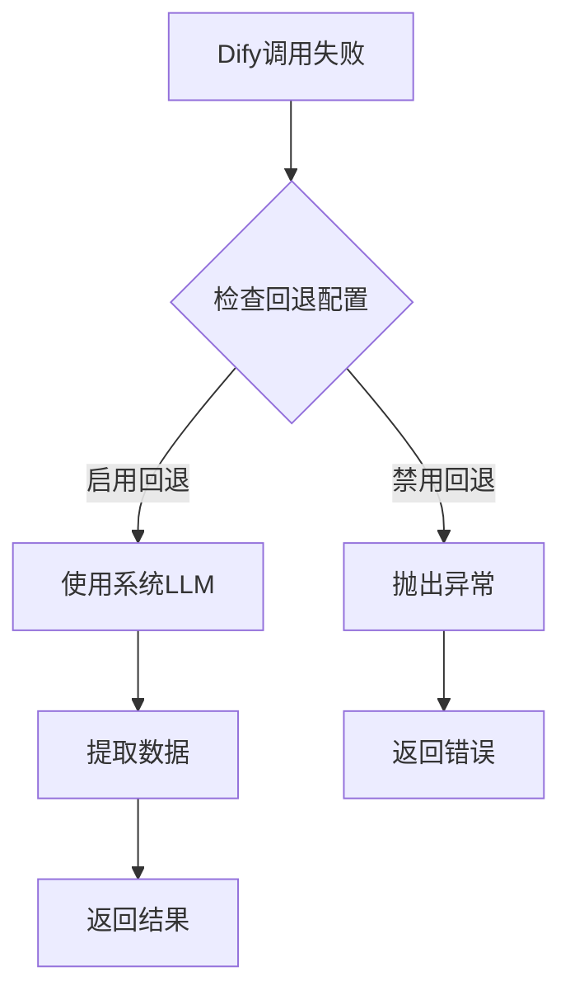
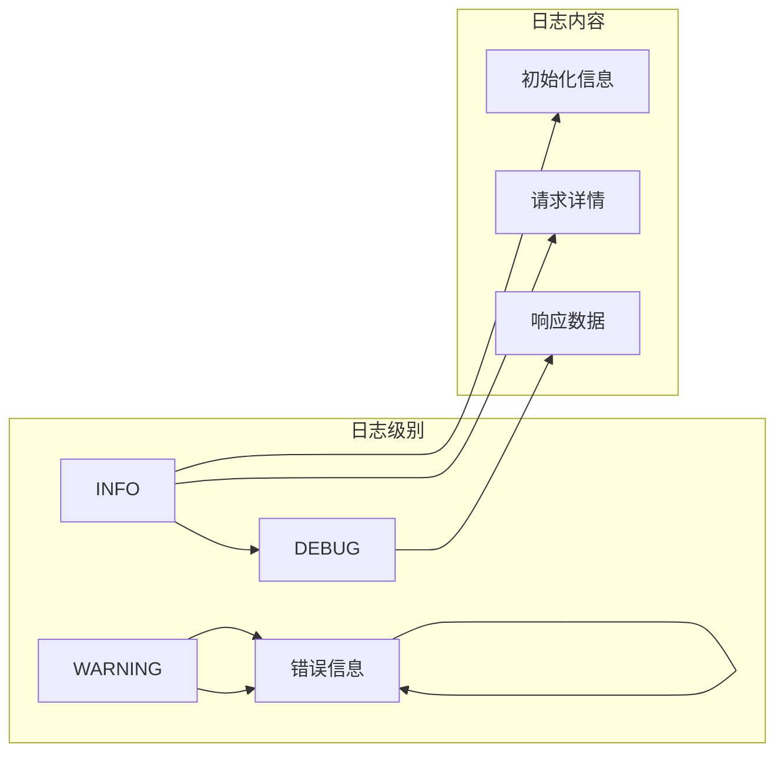

# Dify工作流集成详细文档

<cite>
**本文档引用的文件**
- [dify_workflow_client.py](file://backend/app/services/dify_workflow_client.py)
- [dify_workflows.yaml](file://backend/app/config/dify_workflows.yaml)
- [generate_service.py](file://backend/app/services/generate_service.py)
- [workflow_mapper.py](file://backend/app/services/workflow_mapper.py)
- [config.py](file://backend/app/config.py)
- [works.py](file://backend/app/api/v1/works.py)
- [works.py](file://backend/app/api/v1/works.py)
- [generate.py](file://backend/app/api/v1/generate.py)
- [infographic.py](file://backend/app/schemas/infographic.py)
- [work.py](file://backend/app/models/work.py)
- [test_dify_integration.py](file://tests/backend/test_dify_integration.py)
- [generate.ts](file://frontend/src/api/generate.ts)
- [infographic.ts](file://frontend/src/stores/infographic.ts)
</cite>

## 目录
1. [概述](#概述)
2. [系统架构](#系统架构)
3. [Dify工作流客户端](#dify工作流客户端)
4. [工作流映射管理](#工作流映射管理)
5. [配置管理](#配置管理)
6. [API接口设计](#api接口设计)
7. [工作流调用机制](#工作流调用机制)
8. [错误处理与重试策略](#错误处理与重试策略)
9. [性能优化](#性能优化)
10. [安全考虑](#安全考虑)
11. [调试与监控](#调试与监控)
12. [最佳实践](#最佳实践)
13. [故障排除](#故障排除)

## 概述

Dify工作流集成为AntV Infographic系统提供了强大的数据生成能力，通过将用户输入的自然语言文本转换为结构化的信息图数据。该集成支持两种主要模式：智能生成模式（三阶段流程）和传统模式（指定模板），并提供了灵活的回退机制确保系统的稳定性。

### 核心特性

- **智能数据提取**：自动识别文本类型并选择最适合的模板
- **灵活的提供商选择**：支持Dify工作流和系统LLM两种数据生成方式
- **完善的错误处理**：多层次的重试机制和回退策略
- **实时监控**：详细的日志记录和性能指标跟踪
- **配置驱动**：基于YAML的模板到工作流映射配置

## 系统架构



**架构图源文件**
- [generate_service.py](file://backend/app/services/generate_service.py#L33-L465)
- [workflow_mapper.py](file://backend/app/services/workflow_mapper.py#L13-L157)
- [dify_workflow_client.py](file://backend/app/services/dify_workflow_client.py#L15-L196)

## Dify工作流客户端

### 客户端核心功能

Dify工作流客户端封装了与Dify平台的API交互逻辑，支持阻塞模式调用和异步处理。



**类图源文件**
- [dify_workflow_client.py](file://backend/app/services/dify_workflow_client.py#L15-L196)
- [generate_service.py](file://backend/app/services/generate_service.py#L33-L465)
- [workflow_mapper.py](file://backend/app/services/workflow_mapper.py#L13-L157)

### HTTP请求构建

客户端按照Dify工作流API的要求构建请求：

| 参数 | 类型 | 描述 | 必需 |
|------|------|------|------|
| `inputs.content` | string | 用户输入的文本内容 | 是 |
| `inputs.template` | string | 模板ID（可选） | 否 |
| `response_mode` | string | 响应模式（blocking/streaming） | 是 |
| `user` | string | 用户标识 | 是 |

### 异步结果轮询

系统采用阻塞模式调用，无需轮询机制。每次调用都会等待Dify工作流完成后再返回结果。

**节源文件**
- [dify_workflow_client.py](file://backend/app/services/dify_workflow_client.py#L31-L132)

## 工作流映射管理

### 配置结构

工作流映射器负责管理模板ID到Dify工作流的映射关系，配置存储在YAML文件中。

```mermaid
graph LR
subgraph "模板ID"
Template1[chart-column-simple]
Template2[bar-chart-vertical]
Template3[list-column-simple]
end
subgraph "工作流配置"
Config1{
"dify_app_id": null<br/>
"workflow_name": "柱状图数据生成"<br/>
"enabled": true<br/>
"fallback_to_system_llm": true
}
Config2{
"dify_app_id": null<br/>
"workflow_name": "垂直柱状图"<br/>
"enabled": true<br/>
"fallback_to_system_llm": true
}
Config3{
"dify_app_id": null<br/>
"workflow_name": "简单列表"<br/>
"enabled": true<br/>
"fallback_to_system_llm": true
}
end
Template1 --> Config1
Template2 --> Config2
Template3 --> Config3
```

**配置图源文件**
- [dify_workflows.yaml](file://backend/app/config/dify_workflows.yaml#L1-L81)

### 映射规则

| 配置项 | 类型 | 描述 | 默认值 |
|--------|------|------|--------|
| `dify_app_id` | string \| null | Dify应用ID，null使用默认API密钥 | null |
| `workflow_name` | string | 工作流显示名称 | - |
| `enabled` | boolean | 是否启用该工作流 | false |
| `fallback_to_system_llm` | boolean | 失败时是否回退到系统LLM | true |

**节源文件**
- [workflow_mapper.py](file://backend/app/services/workflow_mapper.py#L49-L104)

## 配置管理

### 环境变量配置

系统通过环境变量和配置文件管理Dify集成的各项设置。

| 配置项 | 环境变量 | 默认值 | 描述 |
|--------|----------|--------|------|
| `DIFY_API_BASE_URL` | DIFY_API_BASE_URL | http://dify-uat.42lab.cn/v1 | Dify API基础URL |
| `DIFY_API_KEY` | DIFY_API_KEY | "" | Dify API认证密钥 |
| `DIFY_API_TIMEOUT` | DIFY_API_TIMEOUT | 30 | API调用超时时间（秒） |
| `DIFY_RESPONSE_MODE` | DIFY_RESPONSE_MODE | blocking | 响应模式 |

### 配置加载机制



**流程图源文件**
- [config.py](file://backend/app/config.py#L9-L51)
- [workflow_mapper.py](file://backend/app/services/workflow_mapper.py#L16-L25)

**节源文件**
- [config.py](file://backend/app/config.py#L31-L36)

## API接口设计

### 智能生成接口

智能生成接口实现了三阶段流程：类型识别、模板选择、数据提取。



**序列图源文件**
- [generate.py](file://backend/app/api/v1/generate.py#L31-L58)
- [generate_service.py](file://backend/app/services/generate_service.py#L47-L118)

### 数据提取接口

数据提取接口支持直接指定模板ID，并可以选择使用Dify工作流或系统LLM。

| 参数 | 类型 | 必需 | 描述 |
|------|------|------|------|
| `text` | string | 是 | 用户输入的文本内容 |
| `templateId` | string | 是 | 指定的模板ID |
| `llmProvider` | enum | 否 | LLM提供商：system/dify，默认system |

**节源文件**
- [generate.py](file://backend/app/api/v1/generate.py#L62-L87)
- [infographic.py](file://backend/app/schemas/infographic.py#L8-L22)

## 工作流调用机制

### 调用流程



**流程图源文件**
- [generate_service.py](file://backend/app/services/generate_service.py#L159-L257)
- [dify_workflow_client.py](file://backend/app/services/dify_workflow_client.py#L31-L132)

### 参数传递

系统将用户输入文本和模板信息传递给Dify工作流：

```typescript
// 请求负载结构
{
  "inputs": {
    "content": "用户输入的文本",
    "template": "模板ID（可选）"
  },
  "response_mode": "blocking",
  "user": "system-user"
}
```

### 结果解析

Dify工作流返回的结果经过以下处理步骤：

1. **状态检查**：验证工作流执行状态
2. **数据提取**：从输出变量中提取数据
3. **格式转换**：将JSON字符串转换为对象
4. **配置组装**：结合模板设计配置生成最终结果

**节源文件**
- [dify_workflow_client.py](file://backend/app/services/dify_workflow_client.py#L134-L178)

## 错误处理与重试策略

### 重试机制

系统实现了多层次的错误处理和重试策略：



**流程图源文件**
- [dify_workflow_client.py](file://backend/app/services/dify_workflow_client.py#L80-L132)

### 错误类型处理

| 错误类型 | 处理策略 | 重试次数 | 重试间隔 |
|----------|----------|----------|----------|
| HTTP超时 | 记录日志并重试 | 3次 | 1秒 |
| 网络请求失败 | 记录日志并重试 | 3次 | 1秒 |
| API响应错误 | 记录错误并重试 | 3次 | 1秒 |
| 工作流执行失败 | 检查回退配置 | - | - |

### 回退机制

当Dify工作流调用失败时，系统会根据配置决定是否回退到系统LLM：



**流程图源文件**
- [generate_service.py](file://backend/app/services/generate_service.py#L240-L246)

**节源文件**
- [dify_workflow_client.py](file://backend/app/services/dify_workflow_client.py#L115-L132)

## 性能优化

### 并发处理

系统支持并发调用多个Dify工作流，提高整体处理效率：

- **异步HTTP客户端**：使用httpx.AsyncClient进行非阻塞网络调用
- **连接池管理**：复用HTTP连接减少建立连接的开销
- **超时控制**：合理的超时设置避免长时间等待

### 缓存策略

- **配置缓存**：工作流映射配置在内存中缓存，支持热更新
- **单例模式**：Dify客户端和服务实例采用单例模式，避免重复初始化

### 性能监控

系统提供详细的性能指标：

| 指标 | 描述 | 单位 |
|------|------|------|
| `response_time` | Dify API响应时间 | 秒 |
| `extractionTime` | 数据提取总耗时 | 秒 |
| `phase1_classification` | 类型识别耗时 | 秒 |
| `phase2_selection` | 模板选择耗时 | 秒 |
| `phase3_extraction` | 数据提取耗时 | 秒 |

**节源文件**
- [dify_workflow_client.py](file://backend/app/services/dify_workflow_client.py#L106-L107)
- [generate_service.py](file://backend/app/services/generate_service.py#L88-L117)

## 安全考虑

### API密钥管理

- **环境变量隔离**：API密钥存储在环境变量中，不在代码库中硬编码
- **密钥截断显示**：日志中只显示密钥的前几位，保护敏感信息
- **配置文件权限**：确保配置文件具有适当的访问权限

### 请求安全

- **HTTPS通信**：强制使用HTTPS协议保护数据传输
- **请求签名**：通过Bearer Token进行身份验证
- **输入验证**：对用户输入进行基本的长度和格式验证

### 权限控制

- **模板访问控制**：只有启用的工作流才能被调用
- **回退机制**：防止因Dify服务问题导致系统完全不可用
- **错误隔离**：单个工作流失败不影响其他功能

**节源文件**
- [dify_workflow_client.py](file://backend/app/services/dify_workflow_client.py#L28-L30)
- [config.py](file://backend/app/config.py#L32)

## 调试与监控

### 日志记录

系统提供详细的日志记录，便于问题诊断：



**日志示例**：
- `[DifyWorkflowClient.__init__] 初始化 - base_url: http://..., api_key: sk-xxx...`
- `[DifyWorkflowClient] 调用工作流 (尝试 1/3) - 模板: bar-chart-vertical, 文本长度: 100`
- `[DifyWorkflowClient] HTTP状态码: 200`

### 调试端点

系统提供专门的调试端点用于检查工作流映射状态：

```bash
GET /generate/debug/workflow-mapper
```

返回当前配置状态和测试结果，包括：
- 配置文件路径
- 模板映射数量
- 特定模板的启用状态
- 工作流配置详情

**节源文件**
- [generate.py](file://backend/app/api/v1/generate.py#L90-L115)

## 最佳实践

### 配置建议

1. **启用必要的工作流**：只启用真正需要的工作流，避免资源浪费
2. **合理设置超时**：根据网络状况调整API超时时间
3. **监控回退行为**：定期检查回退机制的使用频率
4. **版本控制配置**：将YAML配置纳入版本控制系统

### 开发建议

1. **渐进式集成**：先启用少量工作流进行测试
2. **错误处理**：始终处理可能的异常情况
3. **性能测试**：在生产环境中测试不同负载下的表现
4. **监控告警**：设置关键指标的监控和告警

### 运维建议

1. **定期检查**：定期验证Dify工作流的可用性
2. **备份配置**：备份重要的配置文件
3. **容量规划**：根据使用量规划Dify服务的配额
4. **安全审计**：定期审查API密钥和访问权限

## 故障排除

### 常见问题及解决方案

#### 1. API密钥配置错误

**症状**：日志中出现`DIFY_API_KEY未配置`警告

**解决方案**：
- 检查`.env`文件中的`DIFY_API_KEY`配置
- 确保API密钥格式正确（通常以`sk-`开头）
- 验证密钥权限是否足够

#### 2. 工作流调用失败

**症状**：系统回退到系统LLM或抛出异常

**排查步骤**：
1. 检查工作流映射配置是否正确
2. 验证Dify工作流是否正常运行
3. 查看Dify平台的执行日志
4. 检查网络连接和防火墙设置

#### 3. 模板映射缺失

**症状**：特定模板无法使用Dify工作流

**解决方案**：
- 在`dify_workflows.yaml`中添加对应的模板配置
- 确保`enabled: true`且`fallback_to_system_llm`设置正确
- 重启服务使配置生效

#### 4. 性能问题

**症状**：Dify调用响应缓慢

**优化措施**：
- 增加超时时间设置
- 检查网络延迟
- 考虑使用系统LLM作为回退
- 监控Dify服务的负载情况

### 调试工具

#### 1. 内置调试端点

```bash
# 检查工作流映射状态
curl http://localhost:8000/api/v1/generate/debug/workflow-mapper

# 检查特定模板状态
curl http://localhost:8000/api/v1/generate/debug/workflow-mapper | jq '.test_results["bar-chart-vertical"]'
```

#### 2. 日志分析

```bash
# 查看Dify相关日志
tail -f logs/app.log | grep DifyWorkflowClient

# 分析错误模式
grep ERROR logs/app.log | grep DifyWorkflowClient
```

#### 3. 性能监控

```bash
# 监控API响应时间
curl -w "@curl-format.txt" http://localhost:8000/api/v1/generate/smart -d '{"text":"测试"}'

# curl-format.txt内容：
#     time_namelookup:  %{time_namelookup}\n
#     time_connect:     %{time_connect}\n
#     time_appconnect:  %{time_appconnect}\n
#     time_pretransfer: %{time_pretransfer}\n
#     time_redirect:    %{time_redirect}\n
#     time_starttransfer: %{time_starttransfer}\n
#     time_total:       %{time_total}\n
```

**节源文件**
- [test_dify_integration.py](file://tests/backend/test_dify_integration.py#L1-L64)

## 对比分析

### Dify工作流模式 vs 系统LLM模式

| 特性 | Dify工作流模式 | 系统LLM模式 |
|------|----------------|-------------|
| **数据质量** | 专业工作流处理，结构化程度高 | 直接LLM生成，灵活性强 |
| **稳定性** | 受Dify平台影响，可能存在服务中断 | 完全自控，稳定性高 |
| **成本** | 按调用计费，可能产生费用 | 依赖现有LLM服务，成本可控 |
| **定制性** | 通过工作流配置高度定制 | 通过提示词工程定制 |
| **响应速度** | 可能存在网络延迟 | 直接本地处理 |
| **维护成本** | 需要维护工作流配置 | 需要维护提示词模板 |

### 适用场景

#### Dify工作流模式适用场景
- 需要高质量、结构化的数据输出
- 对数据格式有严格要求的业务场景
- 需要复杂数据处理逻辑的场景
- 可以接受一定延迟的批处理场景

#### 系统LLM模式适用场景
- 实时性要求高的交互场景
- 需要快速原型开发和迭代
- 对成本敏感的应用
- 需要高度灵活性的场景

### 混合使用策略

系统采用混合使用策略，在保证稳定性的前提下充分利用Dify的优势：

1. **自动选择**：根据模板配置自动选择合适的方式
2. **智能回退**：Dify失败时自动回退到系统LLM
3. **用户选择**：提供API级别的提供商选择选项
4. **性能监控**：持续监控两种方式的表现，动态调整策略

这种混合策略既保证了系统的可靠性，又充分发挥了Dify工作流的优势，为用户提供最佳的使用体验。