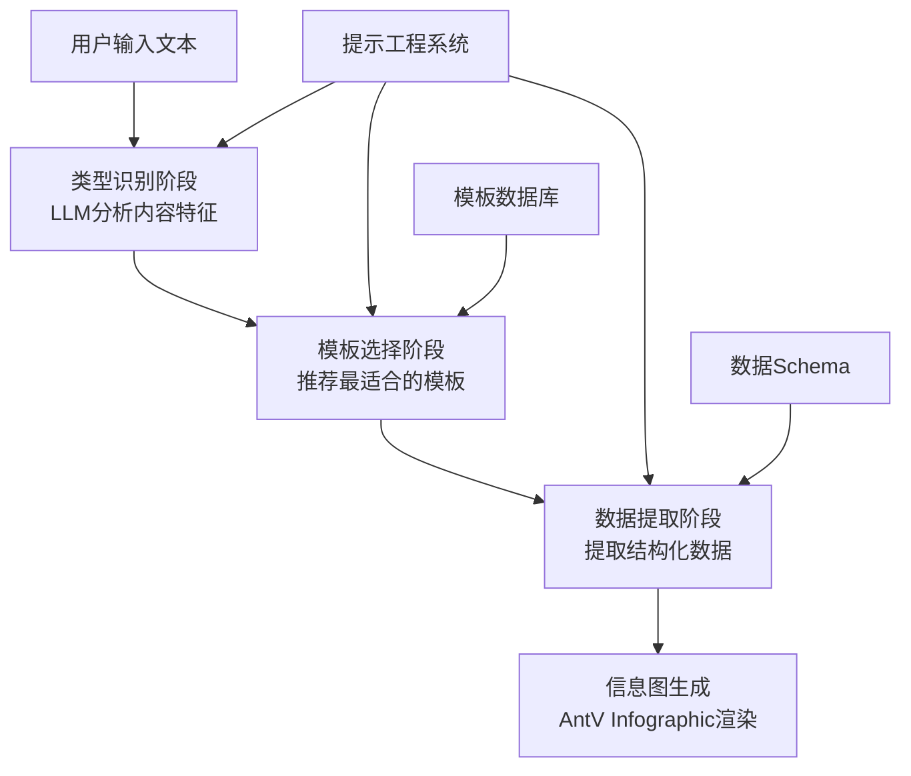
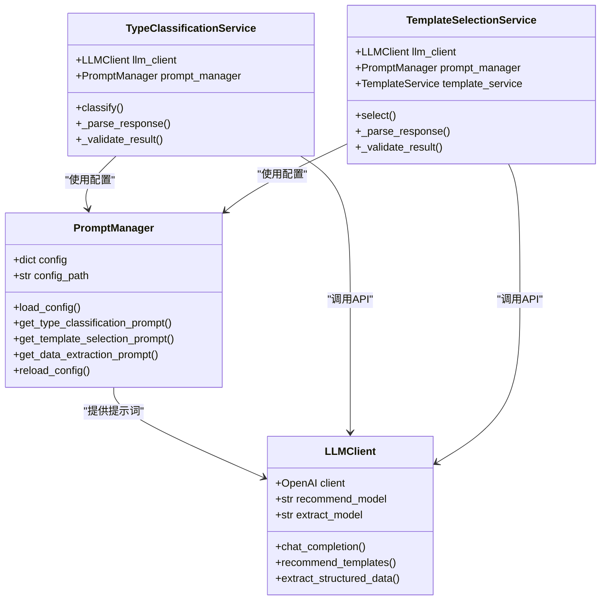
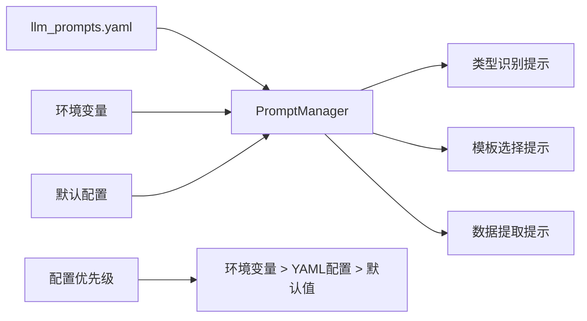
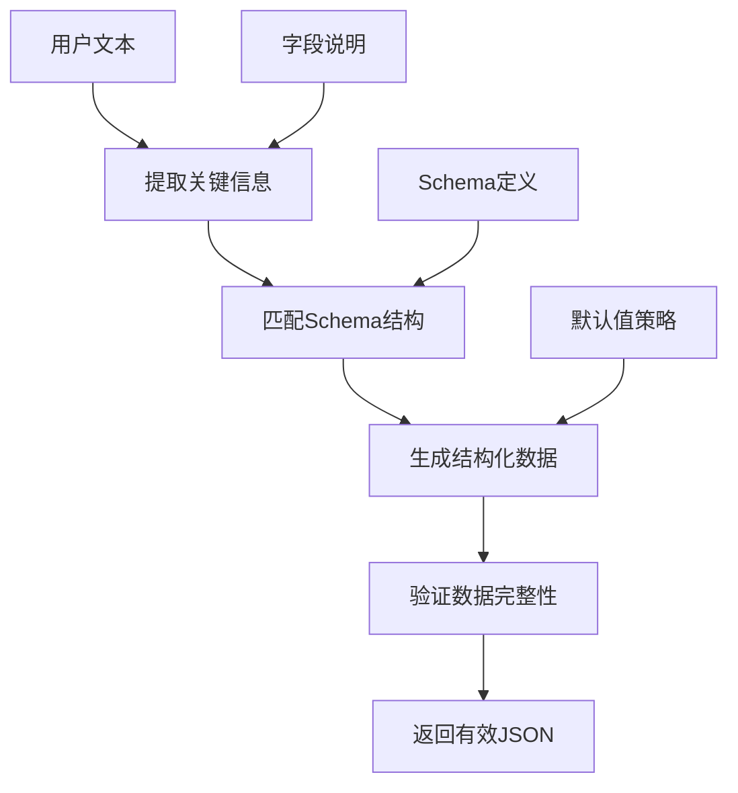
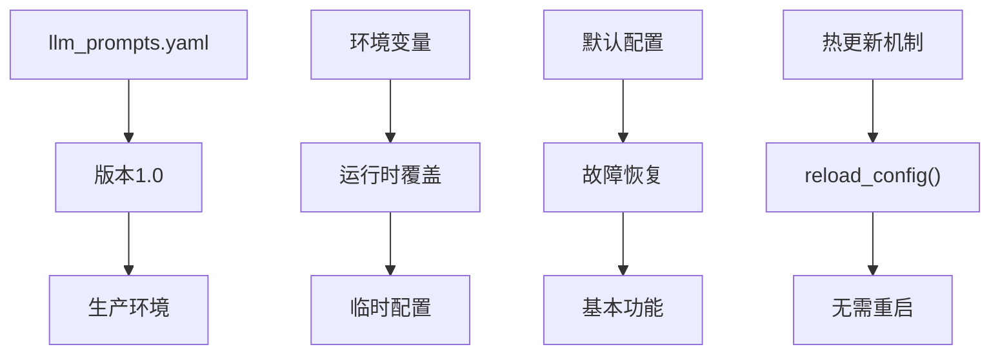
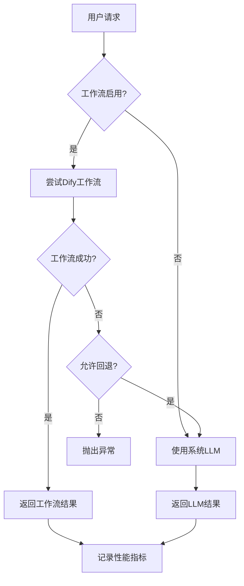
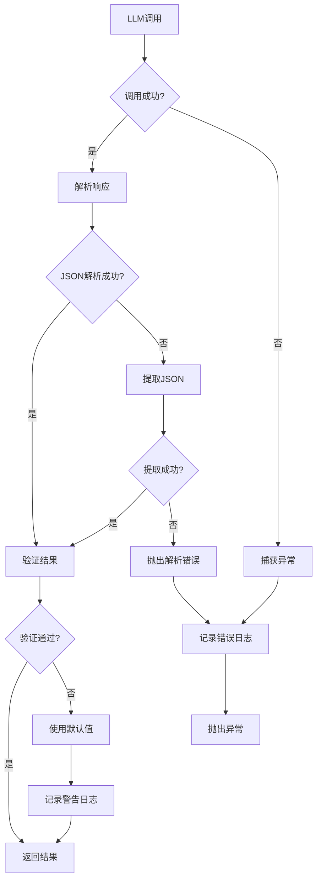
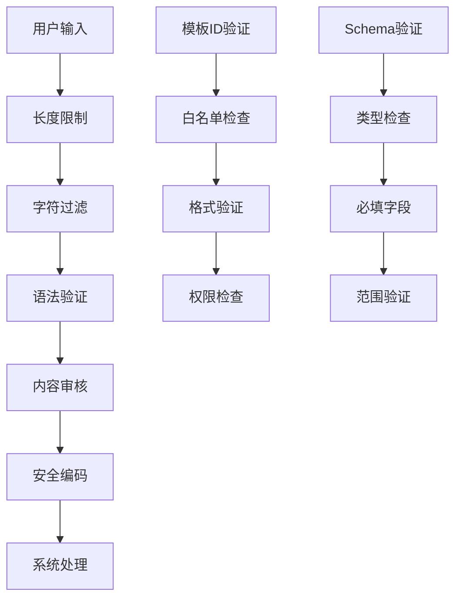

# 提示工程最佳实践文档

<cite>
**本文档引用的文件**
- [prompt_manager.py](file://backend/app/utils/prompt_manager.py)
- [prompts.py](file://backend/app/utils/prompts.py)
- [generate_service.py](file://backend/app/services/generate_service.py)
- [llm_client.py](file://backend/app/services/llm_client.py)
- [llm_prompts.yaml](file://backend/app/config/llm_prompts.yaml)
- [type_classification_service.py](file://backend/app/services/type_classification_service.py)
- [template_selection_service.py](file://backend/app/services/template_selection_service.py)
- [workflow_mapper.py](file://backend/app/services/workflow_mapper.py)
- [template.py](file://backend/app/models/template.py)
- [README.md](file://README.md)
</cite>

## 目录
1. [引言](#引言)
2. [项目概述](#项目概述)
3. [提示工程架构](#提示工程架构)
4. [提示设计模式](#提示设计模式)
5. [提示结构组成](#提示结构组成)
6. [提示版本管理](#提示版本管理)
7. [A/B测试策略](#ab测试策略)
8. [迭代优化方法](#迭代优化方法)
9. [安全防护措施](#安全防护措施)
10. [提示模板库](#提示模板库)
11. [错误案例分析](#错误案例分析)
12. [最佳实践指南](#最佳实践指南)
13. [总结](#总结)

## 引言

提示工程是人工智能时代的核心技能，特别是在信息图生成这样的复杂应用场景中。本文档基于GenAI Chart项目的实际经验，系统性地介绍了提示工程的最佳实践方法，涵盖从基础概念到高级优化策略的完整知识体系。

## 项目概述

GenAI Chart是一个基于AntV Infographic和大语言模型的智能信息图生成系统，采用三阶段智能生成流程：



**图表来源**
- [generate_service.py](file://backend/app/services/generate_service.py#L47-L118)

**章节来源**
- [README.md](file://README.md#L1-L50)

## 提示工程架构

### 核心组件架构



**图表来源**
- [prompt_manager.py](file://backend/app/utils/prompt_manager.py#L14-L216)
- [llm_client.py](file://backend/app/services/llm_client.py#L14-L217)
- [type_classification_service.py](file://backend/app/services/type_classification_service.py#L14-L149)
- [template_selection_service.py](file://backend/app/services/template_selection_service.py#L15-L169)

### 提示词配置管理

系统采用YAML配置文件管理提示词，支持动态加载和热更新：



**图表来源**
- [llm_prompts.yaml](file://backend/app/config/llm_prompts.yaml#L1-L201)
- [prompt_manager.py](file://backend/app/utils/prompt_manager.py#L36-L51)

**章节来源**
- [prompt_manager.py](file://backend/app/utils/prompt_manager.py#L1-L216)
- [llm_prompts.yaml](file://backend/app/config/llm_prompts.yaml#L1-L201)

## 提示设计模式

### 模板推荐提示模式

模板推荐采用七分类体系，每个分类都有明确的特征和示例：

| 分类类型 | 特征关键词 | 适用场景 | 示例 |
|---------|-----------|----------|------|
| 图表型 (chart) | 数据、增长率、比例、百分比、趋势 | 销售数据、用户增长、KPI指标 | "2023年Q1销售额1000万，Q2增长20%" |
| 对比型 (comparison) | VS、对比、优劣势、差异、竞争 | 产品对比、竞品分析、方案比较 | "产品A与产品B的功能对比" |
| 层级型 (hierarchy) | 组织架构、层级、分类、等级 | 公司架构、产品分类、职级体系 | "公司组织架构：CEO-部门经理-员工" |
| 列表型 (list) | 要点、步骤、特性、功能 | 产品功能、解决方案、特性列表 | "产品的五大功能：1.智能推荐 2.数据分析..." |
| 四象限型 (quadrant) | 矩阵、象限、维度、重要紧急 | 时间管理矩阵、SWOT分析、风险矩阵 | "任务分为重要紧急、重要不紧急..." |
| 关系型 (relationship) | 关系、因果、影响、联系 | 因果分析、业务流程、关系网络 | "用户增长影响因素：产品质量、营销投入..." |
| 顺序型 (sequence) | 步骤、流程、过程、顺序 | 操作流程、项目进度、用户旅程 | "产品开发流程：需求分析-设计-开发-测试-上线" |

### 数据提取提示模式

数据提取采用严格的JSON Schema驱动方法：



**图表来源**
- [prompts.py](file://backend/app/utils/prompts.py#L131-L208)

**章节来源**
- [prompts.py](file://backend/app/utils/prompts.py#L1-L247)
- [llm_prompts.yaml](file://backend/app/config/llm_prompts.yaml#L1-L201)

## 提示结构组成

### 系统角色设定

每个提示都包含明确的系统角色定义，确保AI理解其职责：

```yaml
# 类型识别系统角色
system_prompt: |
  你是一位专业的信息图分类专家，擅长识别文本内容的结构类型。
```

### 输入格式规范

提示词严格遵循输入格式规范：

```yaml
# 模板选择用户提示模板
user_prompt_template: |
  用户文本内容：
  """
  {user_text}
  """

  已识别的内容类型：{content_type}

  可选模板列表：
  {templates_list}
```

### 输出格式要求

系统要求AI返回特定格式的输出：

```yaml
# 输出格式要求
response_format: {"type": "json_object"}
```

### 示例演示

每个提示类别都包含丰富的示例：

```yaml
# 层级型示例
示例："公司组织架构：CEO-部门经理-员工" 或 "会员等级：金牌-银牌-铜牌-普通"
```

### 约束条件

提示词包含严格的约束条件：

```yaml
# 置信度评估标准
置信度范围：
- 0.9-1.0：非常匹配，内容特征与类型高度一致
- 0.7-0.9：较好匹配，大部分特征符合
- 0.5-0.7：可以使用，部分特征符合
- <0.5：不推荐
```

**章节来源**
- [llm_prompts.yaml](file://backend/app/config/llm_prompts.yaml#L1-L201)

## 提示版本管理

### 配置文件版本控制

系统采用YAML配置文件进行提示词版本管理：



**图表来源**
- [prompt_manager.py](file://backend/app/utils/prompt_manager.py#L53-L56)

### 环境变量覆盖

支持通过环境变量动态覆盖配置：

```python
# 优先级：环境变量 > YAML配置 > 默认值
system_prompt = os.getenv('LLM_TYPE_CLASSIFICATION_SYSTEM_PROMPT') or config.get('system_prompt', '')
```

### 默认配置备份

系统提供完善的默认配置作为故障恢复机制：

```python
def _get_default_config(self) -> Dict[str, Any]:
    return {
        'type_classification': {
            'system_prompt': '你是一位专业的信息图分类专家，擅长识别文本内容的结构类型。',
            'user_prompt_template': '请分析文本: {user_text}',
            'temperature': 0.3,
            'model': None
        }
    }
```

**章节来源**
- [prompt_manager.py](file://backend/app/utils/prompt_manager.py#L53-L203)

## A/B测试策略

### 模板选择A/B测试

系统支持多种数据提取策略的A/B测试：



**图表来源**
- [generate_service.py](file://backend/app/services/generate_service.py#L160-L246)

### 温度参数测试

不同阶段使用不同的温度参数：

```python
# 类型识别：temperature=0.3（稳定）
# 模板选择：temperature=0.3（稳定）
# 数据提取：temperature=0.2（精确）
```

### 模型对比测试

支持不同模型的对比测试：

```python
# 推荐模型：gpt-4o-mini
# 提取模型：gpt-4o-mini
# 推理模型：o1系列（不支持response_format）
```

**章节来源**
- [generate_service.py](file://backend/app/services/generate_service.py#L160-L246)
- [llm_client.py](file://backend/app/services/llm_client.py#L27-L28)

## 迭代优化方法

### 错误处理机制

系统实现了完善的错误处理和恢复机制：



**图表来源**
- [type_classification_service.py](file://backend/app/services/type_classification_service.py#L64-L80)
- [template_selection_service.py](file://backend/app/services/template_selection_service.py#L79-L95)

### 结果验证机制

每个服务都包含严格的结果验证：

```python
def _validate_result(self, result: Dict[str, Any]):
    # 检查必需字段
    required_fields = ['type', 'confidence', 'reason']
    
    # 验证类型值
    valid_types = ['chart', 'comparison', 'hierarchy', 'list', 'quadrant', 'relationship', 'sequence']
    
    # 验证置信度范围
    if not isinstance(result['confidence'], (int, float)) or not (0 <= result['confidence'] <= 1):
        result['confidence'] = 0.5
```

### 自动修复策略

系统提供多种自动修复策略：

```python
def _parse_response(self, response: str) -> Dict[str, Any]:
    # 尝试直接解析JSON
    try:
        return json.loads(response)
    except json.JSONDecodeError:
        pass
    
    # 尝试提取JSON（处理可能包含markdown代码块的情况）
    json_match = re.search(r'\{[\s\S]*\}', response)
    if json_match:
        return json.loads(json_match.group())
```

**章节来源**
- [type_classification_service.py](file://backend/app/services/type_classification_service.py#L82-L137)
- [template_selection_service.py](file://backend/app/services/template_selection_service.py#L97-L157)

## 安全防护措施

### 输入验证

系统在多个层面实施输入验证：



**图表来源**
- [type_classification_service.py](file://backend/app/services/type_classification_service.py#L107-L137)
- [template_selection_service.py](file://backend/app/services/template_selection_service.py#L122-L157)

### 提示注入防护

系统通过以下措施防止提示注入：

1. **模板化设计**：所有提示都采用模板化设计，避免直接拼接用户输入
2. **参数化查询**：使用格式化字符串而非字符串拼接
3. **字符转义**：对特殊字符进行安全处理

```python
# 安全的提示模板
user_prompt_template = config.get('user_prompt_template', '')
user_prompt = user_prompt_template.format(user_text=user_text)
```

### 输出过滤

系统对AI输出进行严格过滤：

```python
def _parse_response(self, response: str) -> Dict[str, Any]:
    # 移除Markdown代码块标记
    response = re.sub(r'```json\s*([\s\S]*?)\s*```', r'\1', response)
    
    # 提取JSON结构
    json_match = re.search(r'\{[\s\S]*\}', response)
    if json_match:
        return json.loads(json_match.group())
```

### 权限控制

系统实施细粒度的权限控制：

```python
# 模板选择验证
template_ids = [t['id'] for t in templates]
if result['templateId'] not in template_ids:
    # 使用第一个模板作为默认值
    result['templateId'] = templates[0]['id']
    result['templateName'] = templates[0]['name']
```

**章节来源**
- [type_classification_service.py](file://backend/app/services/type_classification_service.py#L82-L137)
- [template_selection_service.py](file://backend/app/services/template_selection_service.py#L97-L157)

## 提示模板库

### 核心提示模板

系统提供了完整的提示模板库：

| 模板类型 | 文件位置 | 主要功能 | 使用场景 |
|---------|----------|----------|----------|
| 类型识别 | `llm_prompts.yaml` | 文本分类 | 内容分析 |
| 模板选择 | `llm_prompts.yaml` | 模板推荐 | 设计决策 |
| 数据提取 | `prompts.py` | 结构化提取 | 数据处理 |
| 模板推荐 | `prompts.py` | 智能推荐 | 模板匹配 |

### 高质量提示模板示例

#### 类型识别模板
```yaml
user_prompt_template: |
  请分析以下用户输入的文本内容，判断其最适合使用哪种信息图类型。
  
  用户输入文本：
  """
  {user_text}
  """
  
  ## 分析指南：
  1. 识别内容类型
  2. 匹配模板分类
  3. 评估置信度
  
  请必须以纯JSON格式返回：
  {{
    "type": "类型代码",
    "confidence": 置信度,
    "reason": "判定理由"
  }}
```

#### 数据提取模板
```python
def get_data_extract_prompt(
    user_text: str,
    template_id: str,
    template_schema: Dict[str, Any]
) -> str:
    schema_text = json.dumps(template_schema, ensure_ascii=False, indent=2)
    
    prompt = f"""请从以下用户输入的文本中提取关键信息，并按照指定的数据结构进行组织。
    
    用户输入文本：
    \"{user_text}\"
    
    目标模板ID：{template_id}
    
    要求的数据结构（JSON Schema）：
    {schema_text}
    
    请严格按照JSON格式返回提取的数据：
    {{
      "template": "{template_id}",
      "data": {{
        "title": "提取的标题",
        "desc": "提取的描述",
        "items": [
          {{
            "label": "项目标签",
            "desc": "项目描述"
          }}
        ]
      }},
      "themeConfig": {{
        "palette": "antv"
      }}
    }}
    """
    return prompt
```

### 模板扩展指南

系统支持灵活的模板扩展：

```python
# 预定义的模板示例Schema
TEMPLATE_SCHEMAS = {
    "list-row-simple-horizontal-arrow": {
        "description": "横向流程图，带箭头",
        "dataFields": {
            "title": {"type": "string", "required": False},
            "desc": {"type": "string", "required": False},
            "items": {
                "type": "array",
                "required": True,
                "description": "数据项列表",
                "itemSchema": {
                    "label": {"type": "string", "required": True},
                    "desc": {"type": "string", "required": False}
                }
            }
        }
    }
}
```

**章节来源**
- [prompts.py](file://backend/app/utils/prompts.py#L1-L247)
- [llm_prompts.yaml](file://backend/app/config/llm_prompts.yaml#L1-L201)

## 错误案例分析

### 常见错误类型

#### JSON解析错误
```python
# 错误情况：AI返回非标准JSON格式
response = "```json\n{\"type\": \"chart\", \"confidence\": 0.9}\n```"

# 解决方案：提取JSON结构
json_match = re.search(r'\{[\s\S]*\}', response)
if json_match:
    return json.loads(json_match.group())
```

#### 置信度过低
```python
# 错误情况：置信度低于阈值
result = {"type": "list", "confidence": 0.3, "reason": "文本较短"}

# 解决方案：使用默认值或重新分析
if result['confidence'] < 0.5:
    result['confidence'] = 0.5
    result['reason'] = "置信度过低，使用默认值"
```

#### 模板ID无效
```python
# 错误情况：选择的模板ID不存在
if result['templateId'] not in template_ids:
    # 使用第一个模板作为默认值
    result['templateId'] = templates[0]['id']
    result['templateName'] = templates[0]['name']
```

### 改进方法

#### 错误检测机制
```python
def _validate_result(self, result: Dict[str, Any]):
    # 检查必需字段
    required_fields = ['type', 'confidence', 'reason']
    for field in required_fields:
        if field not in result:
            raise ValueError(f"识别结果缺少必需字段: {field}")
    
    # 验证类型值
    valid_types = ['chart', 'comparison', 'hierarchy', 'list', 'quadrant', 'relationship', 'sequence']
    if result['type'] not in valid_types:
        result['type'] = 'list'  # 使用默认值
    
    # 验证置信度
    if not isinstance(result['confidence'], (int, float)) or not (0 <= result['confidence'] <= 1):
        result['confidence'] = 0.5
```

#### 错误恢复策略
```python
def _parse_response(self, response: str) -> Dict[str, Any]:
    try:
        return json.loads(response)
    except json.JSONDecodeError:
        # 尝试提取JSON结构
        json_match = re.search(r'\{[\s\S]*\}', response)
        if json_match:
            return json.loads(json_match.group())
        raise json.JSONDecodeError("无法解析JSON响应", response, 0)
```

**章节来源**
- [type_classification_service.py](file://backend/app/services/type_classification_service.py#L82-L137)
- [template_selection_service.py](file://backend/app/services/template_selection_service.py#L97-L157)

## 最佳实践指南

### 提示设计原则

#### 1. 明确性原则
```yaml
# 好的提示：明确的任务描述
user_prompt_template: |
  请分析以下用户输入的文本内容，判断其最适合使用哪种信息图类型。
  
  用户输入文本：
  """
  {user_text}
  """
```

#### 2. 结构化原则
```yaml
# 好的提示：结构化的输出要求
response_format: {"type": "json_object"}
```

#### 3. 示例驱动原则
```yaml
# 好的提示：包含丰富的示例
示例："产品开发流程：需求分析-设计-开发-测试-上线"
```

### 性能优化策略

#### 温度参数优化
```python
# 类型识别：temperature=0.3（稳定）
# 模板选择：temperature=0.3（稳定）
# 数据提取：temperature=0.2（精确）
```

#### 模型选择策略
```python
# 推荐模型：gpt-4o-mini（平衡性能和成本）
# 提取模型：gpt-4o-mini（准确性优先）
# 推理模型：o1系列（复杂推理）
```

### 监控和评估

#### 性能指标监控
```python
# 关键性能指标
metrics = {
    "response_time": response_time,
    "confidence_score": confidence_score,
    "success_rate": success_rate,
    "error_rate": error_rate
}
```

#### 用户体验评估
```python
# 用户满意度指标
satisfaction_metrics = {
    "recommendation_accuracy": accuracy_score,
    "template_fit": fit_score,
    "generation_time": generation_time
}
```

### 持续改进流程

#### 1. 数据收集
```python
# 收集用户反馈和使用数据
feedback_data = {
    "user_input": user_text,
    "recommended_template": template_id,
    "user_choice": user_selection,
    "generation_time": time_taken,
    "success_flag": success_flag
}
```

#### 2. 质量评估
```python
# 自动化质量评估
quality_checks = {
    "json_validity": validate_json_format(response),
    "content_relevance": assess_content_match(user_text, result),
    "template_fit": assess_template_fit(result, template_schema)
}
```

#### 3. 迭代优化
```python
# 基于反馈的优化
optimization_actions = {
    "improve_prompt_clarity": feedback.improvement_suggestions,
    "expand_examples": feedback.additional_examples,
    "adjust_temperature": performance_metrics.temperature_adjustments
}
```

**章节来源**
- [llm_client.py](file://backend/app/services/llm_client.py#L30-L92)
- [generate_service.py](file://backend/app/services/generate_service.py#L47-L118)

## 总结

提示工程是构建高质量AI应用的关键技术。通过GenAI Chart项目的实践经验，我们总结出以下核心要点：

### 关键成功要素

1. **系统化设计**：采用模块化、可配置的提示工程架构
2. **质量保证**：实施完善的错误处理和验证机制
3. **持续优化**：建立监控、评估和迭代改进流程
4. **安全防护**：多层次的安全措施确保系统稳定运行

### 实践建议

1. **从简单开始**：先实现基本功能，再逐步优化
2. **数据驱动**：基于实际使用数据进行优化
3. **用户中心**：始终关注用户体验和满意度
4. **持续学习**：跟踪最新的提示工程技术和最佳实践

### 未来发展方向

随着AI技术的不断发展，提示工程将在以下方面继续演进：

- **多模态提示**：结合文本、图像、音频等多种输入形式
- **个性化定制**：根据用户偏好和历史行为调整提示策略
- **自动化优化**：利用机器学习自动优化提示参数
- **跨领域应用**：将提示工程方法推广到更多应用场景

通过系统性的提示工程实践，我们可以构建更加智能、可靠和用户友好的AI应用系统。