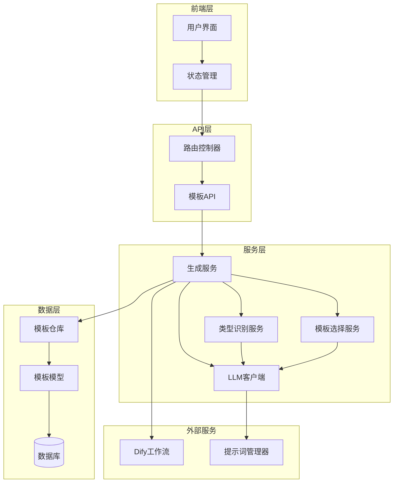
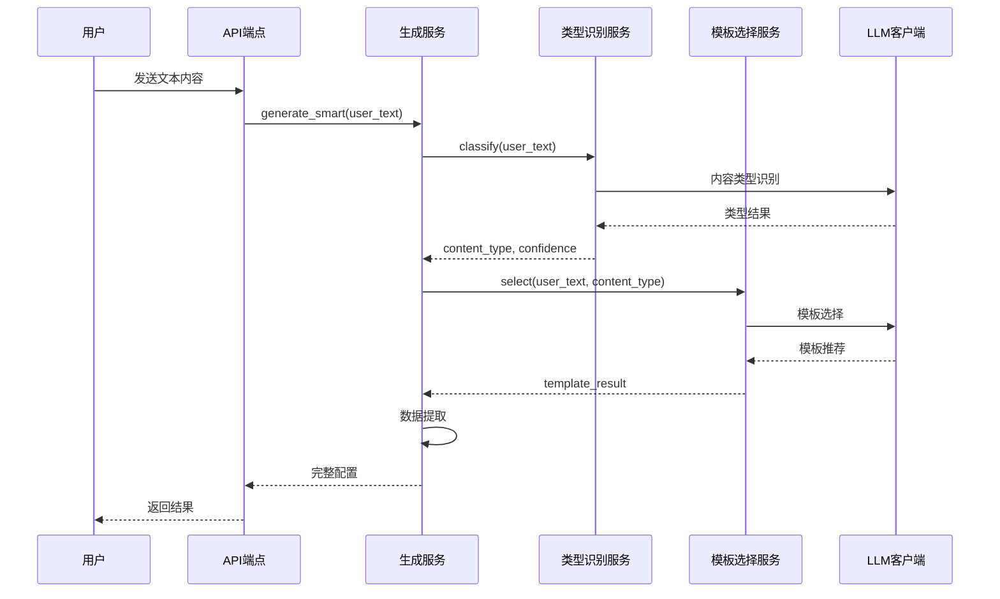
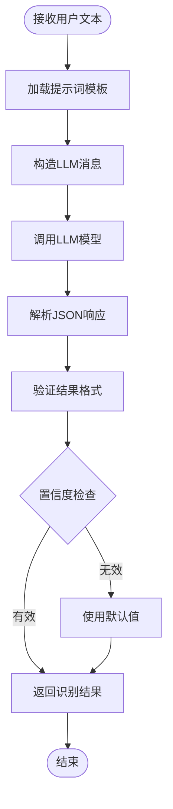
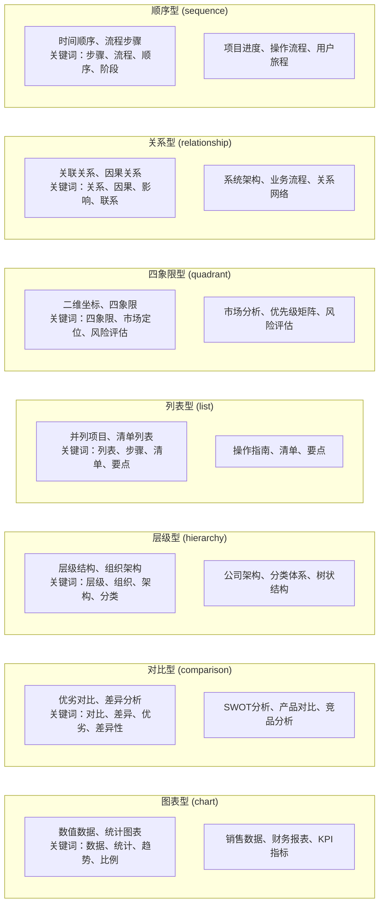
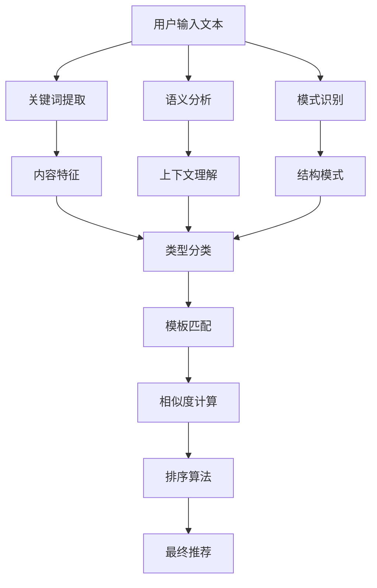
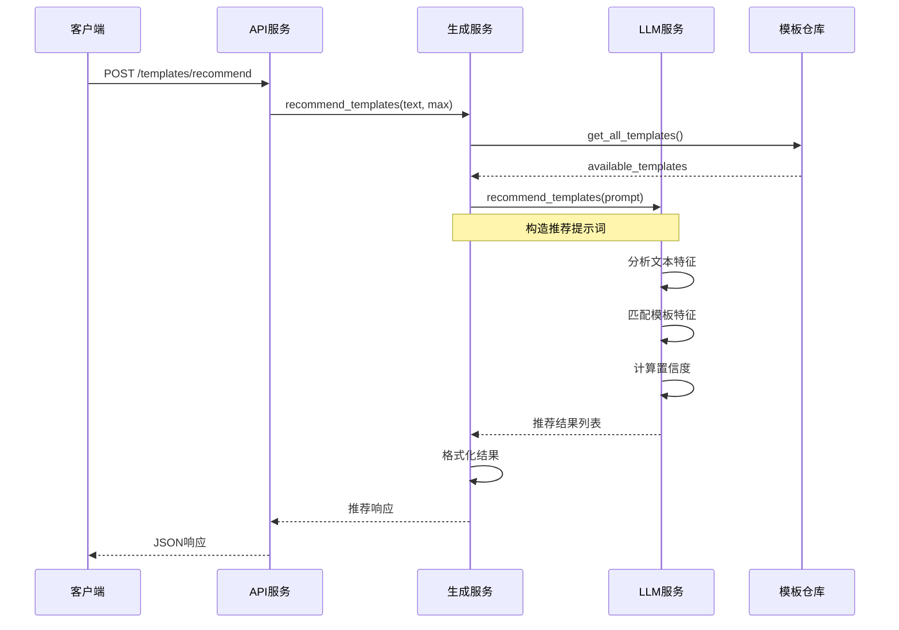
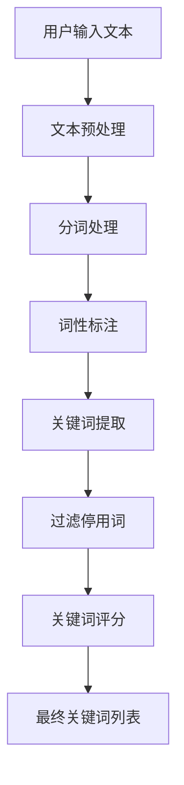
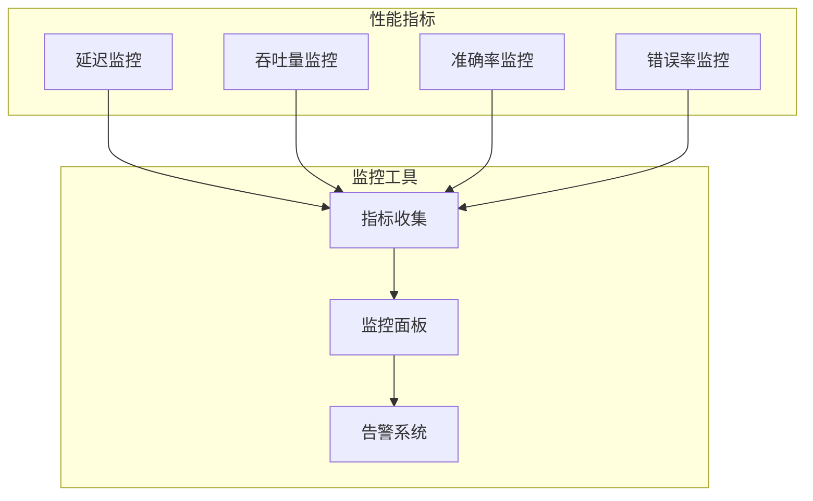
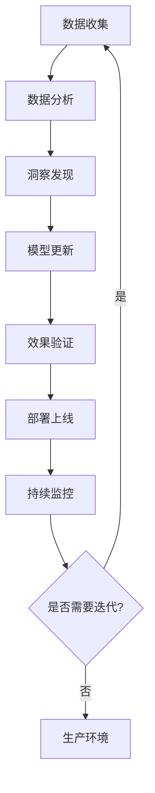

# 智能模板推荐系统详细文档

<cite>
**本文档引用的文件**
- [template_selection_service.py](file://backend/app/services/template_selection_service.py)
- [type_classification_service.py](file://backend/app/services/type_classification_service.py)
- [generate_service.py](file://backend/app/services/generate_service.py)
- [prompt_manager.py](file://backend/app/utils/prompt_manager.py)
- [template.py](file://backend/app/models/template.py)
- [template_repo.py](file://backend/app/repositories/template_repo.py)
- [templates.py](file://backend/app/api/v1/templates.py)
- [template.ts](file://frontend/src/stores/template.ts)
- [prompts.py](file://backend/app/utils/prompts.py)
- [test_recommend.py](file://tests/backend/test_recommend.py)
</cite>

## 目录
1. [系统概述](#系统概述)
2. [架构设计](#架构设计)
3. [核心组件分析](#核心组件分析)
4. [模板分类体系](#模板分类体系)
5. [推荐算法实现](#推荐算法实现)
6. [特征提取与分析](#特征提取与分析)
7. [性能优化策略](#性能优化策略)
8. [评估与改进](#评估与改进)
9. [故障排除指南](#故障排除指南)
10. [总结](#总结)

## 系统概述

智能模板推荐系统是一个基于人工智能的信息图模板选择平台，能够根据用户输入的文本内容自动识别内容类型并推荐最适合的可视化模板。系统采用三阶段处理流程：内容类型识别、模板选择和数据提取，通过LLM（大型语言模型）实现智能化的模板匹配和推荐。

### 主要功能特性

- **智能内容识别**：自动识别用户文本的内容类型（图表型、对比型、层级型等7大分类）
- **精准模板匹配**：基于语义分析和特征匹配的模板选择算法
- **多模态推荐**：支持多种推荐策略和结果排序
- **实时性能监控**：提供详细的处理时间和性能指标
- **灵活配置**：支持多种LLM模型和提示词配置

## 架构设计

系统采用分层架构设计，包含前端界面层、API服务层、业务逻辑层和数据存储层。



**架构图来源**
- [generate_service.py](file://backend/app/services/generate_service.py#L33-L465)
- [templates.py](file://backend/app/api/v1/templates.py#L1-L99)

**章节来源**
- [generate_service.py](file://backend/app/services/generate_service.py#L33-L123)
- [templates.py](file://backend/app/api/v1/templates.py#L1-L99)

## 核心组件分析

### 生成服务（GenerateService）

生成服务是系统的核心协调器，负责执行智能生成的三阶段流程。



**序列图来源**
- [generate_service.py](file://backend/app/services/generate_service.py#L47-L118)
- [type_classification_service.py](file://backend/app/services/type_classification_service.py#L22-L80)
- [template_selection_service.py](file://backend/app/services/template_selection_service.py#L24-L88)

#### 主要职责

1. **流程编排**：协调三个阶段的执行顺序和数据传递
2. **错误处理**：统一的异常捕获和错误恢复机制
3. **性能监控**：记录各阶段的执行时间和性能指标
4. **数据整合**：将来自不同服务的结果整合为最终配置

### 类型识别服务（TypeClassificationService）

负责识别用户文本的内容类型，这是模板推荐的基础。



**流程图来源**
- [type_classification_service.py](file://backend/app/services/type_classification_service.py#L22-L80)

#### 识别能力

系统能够识别以下7种内容类型：

| 类型 | 特征 | 关键词示例 | 适用场景 |
|------|------|------------|----------|
| chart | 数值数据、统计信息 | 数据、增长率、比例、趋势 | 销售数据、财务报表 |
| comparison | 对比分析、优劣势 | 对比、差异、优劣、差异性 | SWOT分析、产品对比 |
| hierarchy | 层级结构、组织架构 | 层级、组织、架构、分类 | 公司架构、分类体系 |
| list | 并列项目、清单 | 列表、步骤、清单、要点 | 操作指南、清单 |
| quadrant | 二维坐标、四象限 | 四象限、市场定位、风险评估 | 市场分析、优先级矩阵 |
| relationship | 关联关系、因果关系 | 关系、因果、影响、联系 | 系统架构、业务流程 |
| sequence | 时间顺序、流程 | 步骤、流程、顺序、阶段 | 项目进度、操作流程 |

**章节来源**
- [type_classification_service.py](file://backend/app/services/type_classification_service.py#L14-L149)
- [template_repo.py](file://backend/app/repositories/template_repo.py#L105-L143)

### 模板选择服务（TemplateSelectionService）

基于类型识别结果，在相应分类的模板中选择最合适的模板。

#### 选择策略

1. **分类匹配**：优先选择与内容类型匹配的模板
2. **特征相似度**：基于关键词和语义特征的匹配度评分
3. **模板质量**：考虑模板的排序权重和创建时间
4. **置信度评估**：为每个推荐提供置信度分数

**章节来源**
- [template_selection_service.py](file://backend/app/services/template_selection_service.py#L15-L169)

## 模板分类体系

### 分类标准

系统建立了完整的7大分类体系，每个分类都有明确的特征定义和应用场景。



**分类图来源**
- [template_repo.py](file://backend/app/repositories/template_repo.py#L112-L120)

### 分类模型训练

虽然系统主要依赖规则和LLM进行分类，但可以通过以下方式进行持续优化：

1. **特征工程**：提取文本中的关键词和语义特征
2. **规则优化**：根据实际使用情况调整分类规则
3. **反馈学习**：收集用户对分类结果的反馈进行迭代优化

**章节来源**
- [template_repo.py](file://backend/app/repositories/template_repo.py#L105-L143)

## 推荐算法实现

### 基于内容分析的推荐策略

系统采用多维度的内容分析策略来实现精准推荐。



**流程图来源**
- [generate_service.py](file://backend/app/services/generate_service.py#L124-L157)
- [prompts.py](file://backend/app/utils/prompts.py#L9-L161)

### 模板匹配逻辑

#### 1. 特征提取阶段

系统从用户文本中提取多种特征：

- **关键词匹配**：识别与模板特征相关的关键词
- **语义相似度**：计算文本与模板描述的语义相似度
- **结构模式**：识别文本中的结构化模式（列表、对比、层级等）

#### 2. 相似度计算

```python
# 相似度计算伪代码
def calculate_similarity(user_text, template):
    # 关键词匹配得分
    keyword_score = calculate_keyword_similarity(user_text, template.keywords)
    
    # 语义相似度得分
    semantic_score = calculate_semantic_similarity(user_text, template.description)
    
    # 结构匹配得分
    structure_score = calculate_structure_similarity(user_text, template.structure_type)
    
    # 加权综合得分
    final_score = (keyword_score * 0.4 + 
                   semantic_score * 0.4 + 
                   structure_score * 0.2)
    
    return final_score
```

#### 3. 排序算法

系统采用多因子排序算法：

1. **置信度优先**：主要依据LLM给出的置信度分数
2. **特征匹配度**：考虑关键词和语义匹配程度
3. **模板质量**：基于模板的排序权重和使用频率
4. **多样性保证**：避免推荐过于相似的模板

**章节来源**
- [generate_service.py](file://backend/app/services/generate_service.py#L124-L157)
- [prompts.py](file://backend/app/utils/prompts.py#L9-L161)

### 推荐流程序列图



**序列图来源**
- [templates.py](file://backend/app/api/v1/templates.py#L77-L98)
- [generate_service.py](file://backend/app/services/generate_service.py#L124-L157)

**章节来源**
- [generate_service.py](file://backend/app/services/generate_service.py#L124-L157)
- [templates.py](file://backend/app/api/v1/templates.py#L77-L98)

## 特征提取与分析

### 用户输入文本分析

系统通过多层次的文本分析来提取有用的特征信息。

#### 1. 关键词提取



#### 2. 语义分析

系统利用LLM的强大语义理解能力：

- **主题识别**：识别文本的主要主题和概念
- **情感分析**：分析文本的情感倾向（积极/消极/中性）
- **复杂度评估**：评估文本的复杂程度和结构化需求

#### 3. 上下文理解

系统能够理解文本的上下文关系：

- **指代消解**：识别文本中的指代关系
- **时序关系**：理解时间相关的前后关系
- **因果关系**：识别事件间的因果联系

**章节来源**
- [prompt_manager.py](file://backend/app/utils/prompt_manager.py#L58-L216)

## 性能优化策略

### 缓存机制

系统实现了多层缓存策略来提升性能：

#### 1. 模板缓存

```python
# 模板缓存示例
class TemplateCache:
    def __init__(self):
        self.cache = {}
        self.expiration_time = 3600  # 1小时
    
    def get_templates(self, category):
        cache_key = f"templates:{category}"
        if self.is_expired(cache_key):
            templates = self.fetch_from_db(category)
            self.cache[cache_key] = {
                'data': templates,
                'timestamp': time.time()
            }
        return self.cache[cache_key]['data']
```

#### 2. 结果缓存

对于常见的查询模式，系统会缓存推荐结果：

- **用户查询缓存**：缓存特定用户的推荐历史
- **相似查询合并**：合并相似的查询请求
- **预计算缓存**：预先计算常用组合的结果

### 推荐结果排序优化

#### 1. 多因子排序

系统采用加权评分算法：

```python
# 排序算法示例
def rank_templates(user_text, templates):
    scored_templates = []
    for template in templates:
        score = (
            template.confidence * 0.4 +
            semantic_similarity(user_text, template.description) * 0.3 +
            keyword_match_score(user_text, template.keywords) * 0.2 +
            template.popularity * 0.1
        )
        scored_templates.append((template, score))
    
    return sorted(scored_templates, key=lambda x: x[1], reverse=True)
```

#### 2. 实时优化

系统能够根据用户行为实时优化排序：

- **点击反馈**：记录用户对推荐结果的点击行为
- **停留时间**：分析用户在模板页面的停留时间
- **选择偏好**：学习用户的偏好模式

### 性能监控

系统提供了全面的性能监控：



**章节来源**
- [generate_service.py](file://backend/app/services/generate_service.py#L47-L118)

## 评估与改进

### 推荐准确率评估

系统采用多种指标来评估推荐效果：

#### 1. 精确度指标

| 指标 | 计算公式 | 目标值 | 说明 |
|------|----------|--------|------|
| 准确率 (Accuracy) | 正确推荐数 / 总推荐数 | > 0.85 | 推荐结果的总体准确度 |
| 召回率 (Recall) | 正确推荐数 / 实际相关数 | > 0.80 | 能否找到所有相关模板 |
| F1分数 | 2 × (Precision × Recall) / (Precision + Recall) | > 0.82 | 精确率和召回率的平衡 |
| 置信度均值 | Σ(置信度) / 推荐数 | > 0.70 | 推荐结果的可信度 |

#### 2. 用户体验指标

- **响应时间**：< 2秒（95%的请求）
- **用户满意度**：通过用户调查评估
- **点击转化率**：用户点击推荐模板的比例
- **任务完成率**：用户成功生成信息图的比例

### 持续改进策略

#### 1. 数据驱动优化



#### 2. 迭代优化流程

1. **A/B测试**：对比新旧算法的效果
2. **用户反馈**：收集用户对推荐结果的评价
3. **冷启动优化**：为新用户提供基础推荐
4. **个性化增强**：根据用户历史行为优化推荐

#### 3. 质量保证

- **自动化测试**：定期运行推荐准确性测试
- **人工审核**：定期抽查推荐结果的质量
- **异常检测**：监控推荐效果的异常变化
- **版本控制**：管理算法版本和配置变更

**章节来源**
- [test_recommend.py](file://tests/backend/test_recommend.py#L1-L25)

## 故障排除指南

### 常见问题及解决方案

#### 1. 推荐结果不准确

**症状**：推荐的模板与用户需求不符

**排查步骤**：
1. 检查用户输入文本的清晰度和完整性
2. 验证类型识别服务的准确性
3. 检查模板数据库的完整性和质量
4. 查看LLM的响应质量和格式

**解决方案**：
- 优化提示词模板
- 增加模板数量和质量
- 调整置信度阈值
- 启用人工审核机制

#### 2. 性能问题

**症状**：推荐响应时间过长

**排查步骤**：
1. 检查数据库查询性能
2. 监控LLM服务的响应时间
3. 分析缓存命中率
4. 检查并发处理能力

**解决方案**：
- 优化数据库索引
- 实施更高效的缓存策略
- 增加异步处理能力
- 负载均衡配置

#### 3. 错误处理

系统提供了完善的错误处理机制：

```python
# 错误处理示例
try:
    result = await service.process_request(user_text)
except json.JSONDecodeError as e:
    logger.error(f"JSON解析失败: {e}")
    return {"error": "AI返回格式错误"}
except Exception as e:
    logger.error(f"处理失败: {e}")
    return {"error": "系统内部错误"}
```

**章节来源**
- [template_selection_service.py](file://backend/app/services/template_selection_service.py#L90-L96)
- [type_classification_service.py](file://backend/app/services/type_classification_service.py#L75-L80)

## 总结

智能模板推荐系统通过先进的AI技术和精心设计的算法，实现了高效、准确的信息图模板推荐。系统的主要优势包括：

### 技术创新

1. **多阶段处理**：通过类型识别、模板选择和数据提取的三阶段流程，确保推荐的准确性和实用性
2. **语义理解**：利用LLM的强大语义理解能力，实现深层次的内容分析
3. **动态优化**：支持实时性能监控和持续改进

### 应用价值

1. **用户体验**：显著降低用户选择模板的时间成本
2. **创作效率**：提高信息图制作的效率和质量
3. **一致性保证**：确保推荐结果的专业性和规范性

### 发展前景

随着AI技术的不断发展，系统将在以下方面持续演进：

- **更精准的语义理解**：提升对复杂文本内容的理解能力
- **个性化推荐**：基于用户偏好的深度个性化推荐
- **跨领域应用**：扩展到更多专业领域的模板推荐
- **实时协作**：支持多人协同的信息图创作

通过不断的技术创新和优化，智能模板推荐系统将为用户提供更加智能、便捷的信息图创作体验。