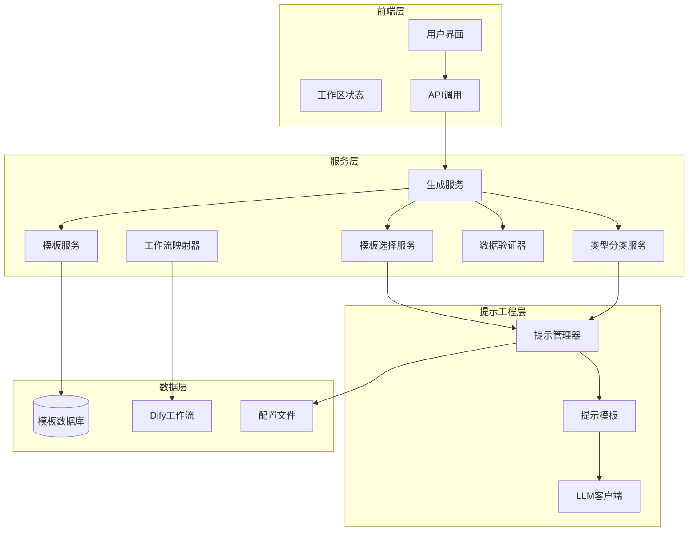
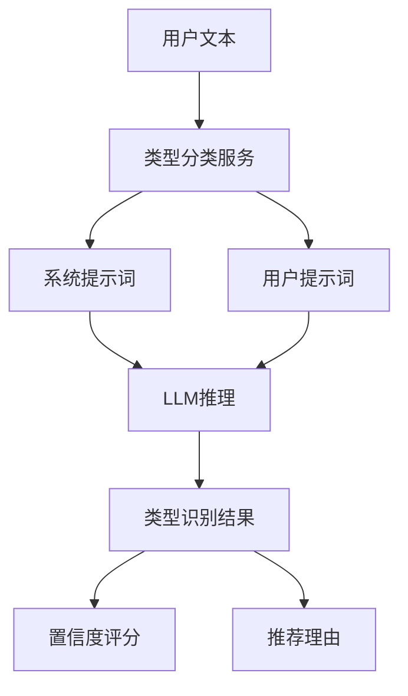
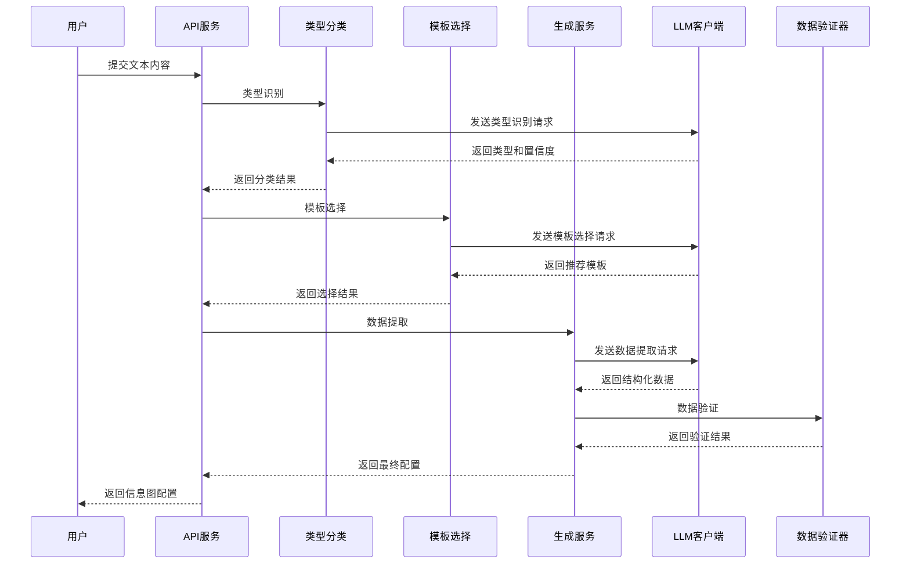
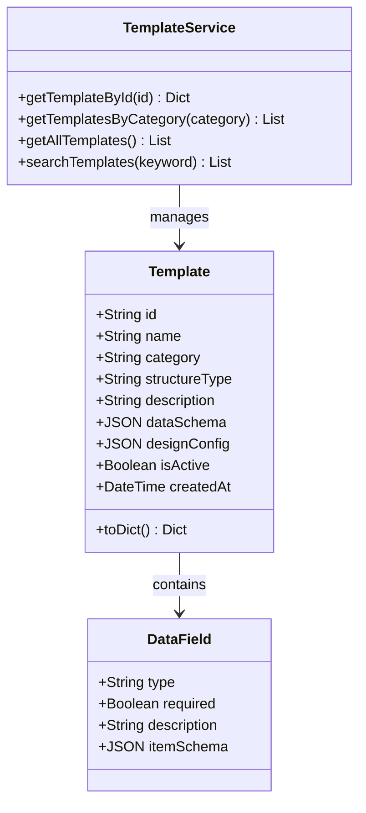
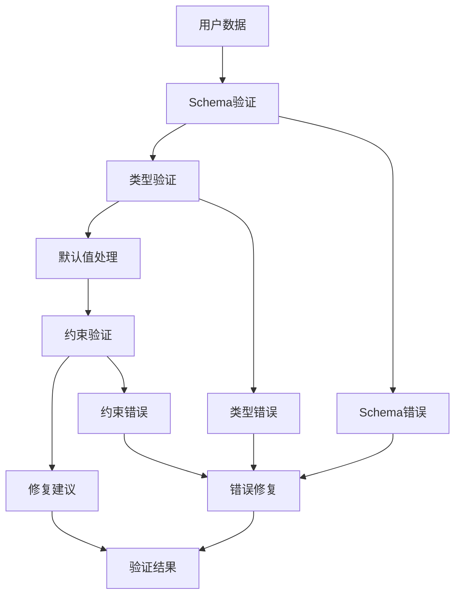
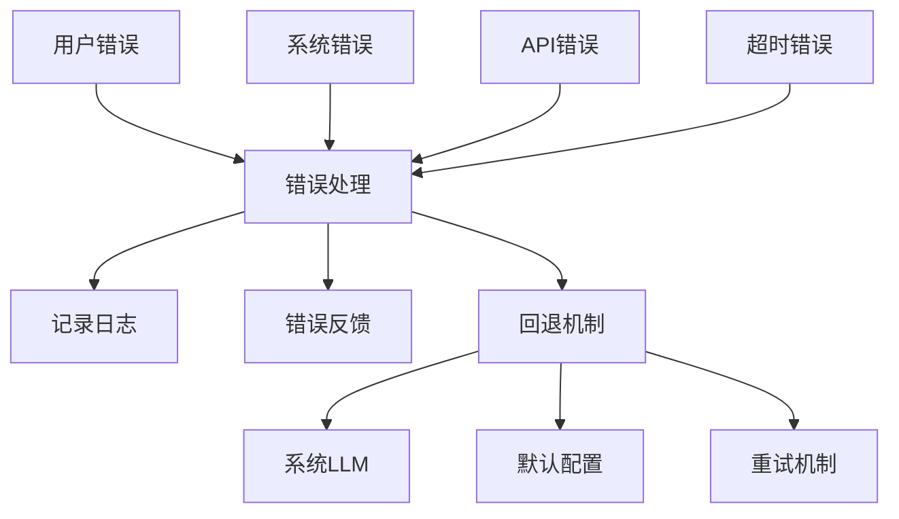
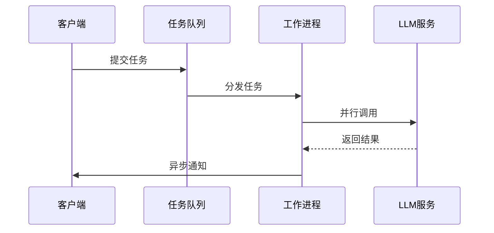

# 结构化数据提取技术文档

<cite>
**本文档引用的文件**
- [backend/app/utils/prompt_manager.py](file://backend/app/utils/prompt_manager.py)
- [backend/app/utils/prompts.py](file://backend/app/utils/prompts.py)
- [backend/app/services/llm_client.py](file://backend/app/services/llm_client.py)
- [backend/app/services/generate_service.py](file://backend/app/services/generate_service.py)
- [backend/app/services/template_selection_service.py](file://backend/app/services/template_selection_service.py)
- [backend/app/services/data_validator.py](file://backend/app/services/data_validator.py)
- [backend/app/services/type_classification_service.py](file://backend/app/services/type_classification_service.py)
- [backend/app/services/workflow_mapper.py](file://backend/app/services/workflow_mapper.py)
- [backend/app/models/template.py](file://backend/app/models/template.py)
- [backend/app/api/v1/generate.py](file://backend/app/api/v1/generate.py)
- [backend/app/config/llm_prompts.yaml](file://backend/app/config/llm_prompts.yaml)
- [backend/app/config/dify_workflows.yaml](file://backend/app/config/dify_workflows.yaml)
- [frontend/src/stores/workspace.ts](file://frontend/src/stores/workspace.ts)
- [frontend/src/views/AIWorkspace/AIWorkspace.vue](file://frontend/src/views/AIWorkspace/AIWorkspace.vue)
- [frontend/src/views/AIWorkspace/components/LeftInputPanel.vue](file://frontend/src/views/AIWorkspace/components/LeftInputPanel.vue)
</cite>

## 目录
1. [概述](#概述)
2. [系统架构](#系统架构)
3. [提示工程设计](#提示工程设计)
4. [数据提取流程](#数据提取流程)
5. [模板管理系统](#模板管理系统)
6. [数据验证与安全](#数据验证与安全)
7. [错误处理机制](#错误处理机制)
8. [性能优化策略](#性能优化策略)
9. [实际应用示例](#实际应用示例)
10. [最佳实践指南](#最佳实践指南)

## 概述

结构化数据提取是AntV Infographic系统的核心功能，通过提示工程引导大语言模型从用户自由文本中提取关键信息，并将其转换为符合信息图渲染要求的标准化数据格式。该系统采用多阶段处理流程，包括类型识别、模板选择和数据提取三个核心环节。

### 核心特性

- **智能提示工程**：基于领域知识的提示模板设计
- **多模态数据提取**：支持标题、子标题、项目列表、数值指标等多种数据结构
- **双重提取模式**：传统模式（指定模板）和智能模式（自动推荐）
- **严格数据验证**：确保提取数据的准确性和完整性
- **容错机制**：完善的错误处理和回退策略

## 系统架构



**架构图来源**
- [backend/app/services/generate_service.py](file://backend/app/services/generate_service.py#L1-L50)
- [backend/app/utils/prompt_manager.py](file://backend/app/utils/prompt_manager.py#L1-L50)

**章节来源**
- [backend/app/services/generate_service.py](file://backend/app/services/generate_service.py#L127-L262)
- [backend/app/utils/prompt_manager.py](file://backend/app/utils/prompt_manager.py#L14-L50)

## 提示工程设计

### 提示模板体系

系统采用分层提示模板设计，针对不同类型的任务提供专门的提示词：

#### 1. 类型识别提示模板



**提示模板设计原则**：
- **清晰的分类体系**：基于7大信息图分类（图表型、对比型、层级型、列表型、四象限型、关系型、顺序型）
- **特征关键词提取**：识别文本中的关键特征词汇
- **场景匹配度评估**：评估模板适用场景的匹配程度
- **置信度计算**：提供0-1范围的置信度评分

#### 2. 模板选择提示模板

模板选择过程包含以下关键要素：
- **内容类型匹配**：根据类型识别结果筛选候选模板
- **特征对比分析**：比较用户文本特征与模板特征的匹配度
- **适用场景评估**：考虑模板的实际应用场景
- **多维度评分**：综合考虑特征匹配度、场景适用性和用户体验

#### 3. 数据提取提示模板

数据提取是最复杂的环节，包含以下设计要素：

**核心设计原则**：
- **Schema驱动**：基于模板的JSON Schema定义提取规则
- **上下文感知**：利用模板特征和用户文本上下文指导提取
- **字段映射**：建立用户文本字段与模板字段的映射关系
- **默认值策略**：为缺失字段提供合理的默认值

**字段提取指南**：
- **标题提取**：从文本中识别主要主题或自动生成简洁标题
- **描述提取**：提取详细的描述内容或副标题信息
- **项目列表**：识别并提取项目列表，包括标签、描述和图标
- **数值指标**：提取量化数据和统计信息
- **视觉元素**：提取图标、颜色等视觉配置信息

**章节来源**
- [backend/app/utils/prompts.py](file://backend/app/utils/prompts.py#L131-L209)
- [backend/app/utils/prompt_manager.py](file://backend/app/utils/prompt_manager.py#L84-L156)

## 数据提取流程

### 智能生成流程

智能生成采用三阶段处理流程，实现从文本到信息图配置的完整转换：



**流程图来源**
- [backend/app/services/generate_service.py](file://backend/app/services/generate_service.py#L127-L262)
- [backend/app/services/type_classification_service.py](file://backend/app/services/type_classification_service.py#L22-L52)

### 传统提取模式

传统模式允许用户直接指定模板ID，简化了类型识别和模板选择过程：

**优势**：
- 更快的响应速度
- 更精确的控制
- 减少LLM调用次数

**适用场景**：
- 已知具体模板需求
- 对提取精度要求较高
- 需要快速迭代测试

**章节来源**
- [backend/app/api/v1/generate.py](file://backend/app/api/v1/generate.py#L62-L87)
- [backend/app/services/generate_service.py](file://backend/app/services/generate_service.py#L159-L262)

## 模板管理系统

### 模板结构定义

模板系统采用JSON Schema定义数据结构，确保数据的一致性和可验证性：



**类图来源**
- [backend/app/models/template.py](file://backend/app/models/template.py#L9-L54)
- [backend/app/services/template_service.py](file://backend/app/services/template_service.py#L160-L281)

### 模板分类体系

系统采用7大分类体系，每个分类都有明确的特征和适用场景：

| 分类 | 特征 | 关键词 | 适用场景 | 示例模板 |
|------|------|--------|----------|----------|
| 图表型 | 数值数据、统计信息 | 数据、增长率、比例、趋势 | 销售数据、用户增长、KPI指标 | bar-chart-vertical |
| 对比型 | 两个以上事物对比 | VS、对比、优劣势、差异 | 产品对比、竞品分析 | comparison-column |
| 层级型 | 上下级、父子关系 | 组织架构、层级、分类 | 公司架构、产品分类 | org-tree |
| 列表型 | 并列项目、要点 | 要点、步骤、特性、清单 | 产品功能、解决方案 | list-column-simple |
| 四象限型 | 两个维度划分 | 矩阵、象限、维度、优先级 | 时间管理、SWOT分析 | quadrant-swot |
| 关系型 | 元素间关联 | 关系、因果、影响、联系 | 因果分析、业务流程 | mindmap-radial |
| 顺序型 | 时间顺序、流程 | 步骤、流程、过程、顺序 | 操作流程、项目进度 | timeline-horizontal |

**章节来源**
- [backend/app/services/template_service.py](file://backend/app/services/template_service.py#L97-L158)
- [backend/app/config/llm_prompts.yaml](file://backend/app/config/llm_prompts.yaml#L1-L33)

## 数据验证与安全

### 验证机制设计

数据验证器采用多层次验证策略，确保提取数据的质量和一致性：



**验证流程**：
1. **Schema验证**：检查数据是否符合模板定义的JSON Schema
2. **类型验证**：验证字段类型是否正确
3. **约束验证**：检查必填字段、长度限制等约束条件
4. **默认值处理**：为缺失字段提供合理默认值
5. **错误修复**：尝试自动修复常见错误

### 安全过滤机制

系统实现了多层安全过滤机制：

**输入安全**：
- 文本长度限制（10-5000字符）
- 特殊字符转义
- XSS攻击防护

**输出安全**：
- JSON格式验证
- 敏感信息过滤
- 输出大小限制

**章节来源**
- [backend/app/services/data_validator.py](file://backend/app/services/data_validator.py#L14-L81)

## 错误处理机制

### 多层次错误处理

系统采用分层错误处理策略，确保服务的稳定性和用户体验：



**错误类型分类**：

| 错误类型 | 处理策略 | 回退方案 |
|----------|----------|----------|
| JSON解析错误 | 重试解析、提取JSON片段 | 使用默认配置 |
| LLM调用超时 | 重试请求、切换模型 | 回退到系统LLM |
| 模板不存在 | 返回可用模板列表 | 使用默认模板 |
| 数据验证失败 | 自动修复、人工审核 | 使用修复后数据 |
| API配额超限 | 等待重试、降级服务 | 缓存机制 |

### 错误恢复策略

**自动恢复**：
- LLM调用失败时自动重试
- 模板选择失败时使用默认策略
- 数据验证失败时尝试自动修复

**人工干预**：
- 复杂错误需要人工审核
- 关键错误触发告警机制
- 提供详细的错误报告

**章节来源**
- [backend/app/services/llm_client.py](file://backend/app/services/llm_client.py#L79-L206)
- [backend/app/services/template_selection_service.py](file://backend/app/services/template_selection_service.py#L90-L121)

## 性能优化策略

### 缓存机制

系统实现了多级缓存策略提升性能：

**模板缓存**：
- 模板元数据缓存
- Schema定义缓存
- 分类信息缓存

**提示词缓存**：
- 提示模板缓存
- 动态参数缓存
- 配置文件缓存

**结果缓存**：
- 类型识别结果缓存
- 模板选择结果缓存
- 数据提取结果缓存

### 异步处理

关键操作采用异步处理提升响应速度：



### 资源管理

**连接池管理**：
- LLM API连接池
- 数据库连接池
- 文件上传连接池

**内存优化**：
- 大文本分块处理
- 对象池复用
- 垃圾回收优化

**并发控制**：
- 请求限流
- 并发数限制
- 优先级调度

**章节来源**
- [backend/app/services/workflow_mapper.py](file://backend/app/services/workflow_mapper.py#L13-L50)

## 实际应用示例

### 示例1：产品开发流程分析

**输入文本**：
```
这里有一个四个阶段的产品开发流程。第一阶段是概念验证，通过率10%；第二阶段是原型开发，通过率30%；第三阶段是市场测试，通过率50%；第四阶段是正式发布，通过率80%。每个阶段都需要不同的资源投入和技术支持。
```

**提取流程**：
1. **类型识别**：识别为"顺序型"（时间线/流程）
2. **模板选择**：推荐"timeline-horizontal"模板
3. **数据提取**：
   - 标题：产品开发流程
   - 描述：包含四个阶段的详细说明
   - 项目列表：每个阶段的名称、通过率、描述

**输出配置**：
```json
{
  "template": "timeline-horizontal",
  "data": {
    "title": "产品开发流程",
    "desc": "包含四个阶段的详细说明",
    "items": [
      {
        "label": "概念验证",
        "desc": "通过率10%，验证产品可行性",
        "icon": "icon:mdi/chart-line"
      },
      {
        "label": "原型开发",
        "desc": "通过率30%，构建产品原型",
        "icon": "icon:mdi/palette"
      }
    ]
  }
}
```

### 示例2：产品功能对比分析

**输入文本**：
```
产品A和产品B的主要功能对比。产品A有5个核心功能：智能推荐、数据分析、用户管理、支付集成、多语言支持；产品B有4个核心功能：基础推荐、基本分析、用户管理、支付功能。产品A在智能推荐方面表现更好，而产品B在成本控制上更有优势。
```

**提取流程**：
1. **类型识别**：识别为"对比型"
2. **模板选择**：推荐"comparison-column"模板
3. **数据提取**：
   - 标题：产品功能对比
   - 描述：对比分析说明
   - 项目列表：分别列出两个产品的功能

### 示例3：组织架构设计

**输入文本**：
```
公司采用扁平化组织架构。CEO直接管理3个部门：技术部、市场部、运营部。技术部分管2个小组：研发组和运维组；市场部分管2个小组：广告组和品牌组；运营部分管2个小组：客服组和物流组。
```

**提取流程**：
1. **类型识别**：识别为"层级型"
2. **模板选择**：推荐"org-tree"模板
3. **数据提取**：
   - 标题：公司组织架构
   - 描述：扁平化架构说明
   - 层级结构：从CEO到小组的完整层级

**章节来源**
- [frontend/src/views/AIWorkspace/components/LeftInputPanel.vue](file://frontend/src/views/AIWorkspace/components/LeftInputPanel.vue#L61-L79)

## 最佳实践指南

### 提示词设计最佳实践

**1. 明确的目标定义**
- 清晰说明提取目标和预期格式
- 提供具体的字段要求和约束条件
- 包含示例数据增强理解

**2. 结构化指令设计**
- 使用编号列表组织复杂指令
- 分步骤说明处理逻辑
- 提供边界情况处理方案

**3. 上下文信息整合**
- 充分利用模板特征信息
- 考虑用户文本的语境背景
- 建立字段间的关联关系

### 数据提取优化技巧

**1. 字段映射策略**
- 建立灵活的字段映射关系
- 处理同义词和变体表达
- 提供默认值填充机制

**2. 上下文感知提取**
- 利用模板特征指导提取
- 考虑文本的语义结构
- 处理模糊和歧义信息

**3. 质量保证机制**
- 实施多轮验证检查
- 建立质量评分体系
- 提供人工审核接口

### 系统维护建议

**1. 模板持续优化**
- 定期更新模板库
- 收集用户反馈改进
- 监控使用效果分析

**2. 提示词迭代升级**
- 基于使用数据优化
- 跟踪LLM能力变化
- 处理新出现的用例

**3. 性能监控和调优**
- 建立性能指标体系
- 监控关键指标变化
- 实施主动优化策略

### 安全和合规考虑

**1. 数据隐私保护**
- 实施数据脱敏处理
- 限制敏感信息提取
- 建立访问控制机制

**2. 内容安全过滤**
- 过滤不当内容
- 检测恶意输入
- 建立内容审核流程

**3. 合规性检查**
- 符合行业标准要求
- 处理版权相关内容
- 建立审计跟踪机制

通过遵循这些最佳实践，可以最大化结构化数据提取系统的效能，确保高质量的数据提取结果和良好的用户体验。