# API集成

<cite>
**本文档引用的文件**   
- [client.ts](file://frontend/src/api/client.ts)
- [generate.ts](file://frontend/src/api/generate.ts)
- [templates.ts](file://frontend/src/api/templates.ts)
- [work.ts](file://frontend/src/api/work.ts)
- [export.ts](file://frontend/src/api/export.ts)
- [main.py](file://backend/app/main.py)
- [generate.py](file://backend/app/api/v1/generate.py)
- [templates.py](file://backend/app/api/v1/templates.py)
- [works.py](file://backend/app/api/v1/works.py)
- [export.py](file://backend/app/api/v1/export.py)
- [template.ts](file://frontend/src/stores/template.ts)
- [workspace.ts](file://frontend/src/stores/workspace.ts)
</cite>

## 目录
1. [API集成概述](#api集成概述)
2. [前端API客户端配置](#前端api客户端配置)
3. [后端API服务架构](#后端api服务架构)
4. [API模块设计与请求响应模式](#api模块设计与请求响应模式)
5. [请求参数序列化与错误处理](#请求参数序列化与错误处理)
6. [API调用示例与组件集成](#api调用示例与组件集成)
7. [认证与授权机制](#认证与授权机制)
8. [性能优化策略](#性能优化策略)
9. [调试指南](#调试指南)

## API集成概述

本系统实现了前端Vue应用与后端FastAPI服务的完整集成，通过RESTful API接口实现信息图的智能生成、模板管理、作品保存和文件导出等功能。系统采用axios作为HTTP客户端，封装了统一的API调用接口，实现了前后端的高效通信。

**Section sources**
- [client.ts](file://frontend/src/api/client.ts)
- [main.py](file://backend/app/main.py)

## 前端API客户端配置

前端使用axios库创建了统一的API客户端实例，配置了基础URL、超时时间和请求头等参数。API客户端通过拦截器实现了请求和响应的统一处理，简化了API调用流程。

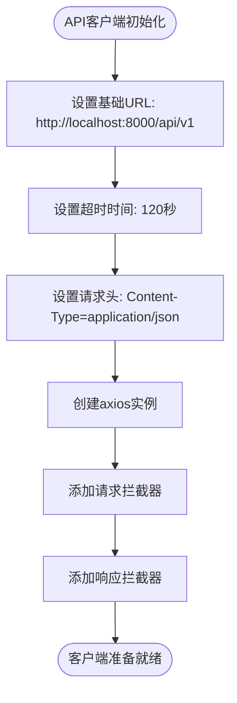

**Diagram sources**
- [client.ts](file://frontend/src/api/client.ts#L1-L45)

**Section sources**
- [client.ts](file://frontend/src/api/client.ts#L1-L45)

## 后端API服务架构

后端采用FastAPI框架构建RESTful API服务，通过模块化路由组织不同功能的API端点。系统实现了CORS跨域支持、全局异常处理和健康检查等基础功能，确保服务的稳定性和安全性。

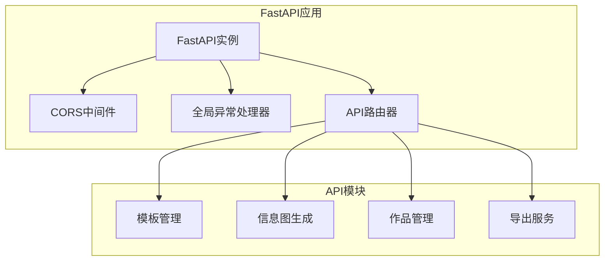

**Diagram sources**
- [main.py](file://backend/app/main.py#L1-L113)

**Section sources**
- [main.py](file://backend/app/main.py#L1-L113)

## API模块设计与请求响应模式

系统提供了四个主要的API模块：生成、模板、作品和导出服务，每个模块都有明确的职责和请求响应模式。

### 生成服务

生成服务提供智能生成和数据提取两种模式，支持三阶段的智能生成流程。

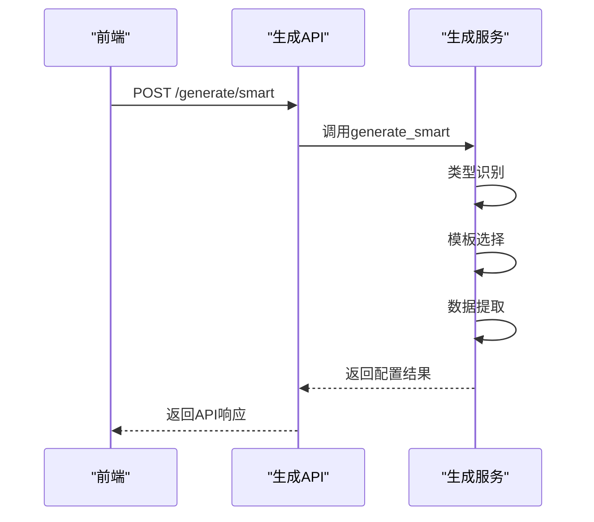

**Diagram sources**
- [generate.py](file://backend/app/api/v1/generate.py#L1-L116)
- [generate.ts](file://frontend/src/api/generate.ts#L1-L26)

### 模板服务

模板服务提供模板列表、分类和AI推荐功能，支持按分类和关键词筛选。

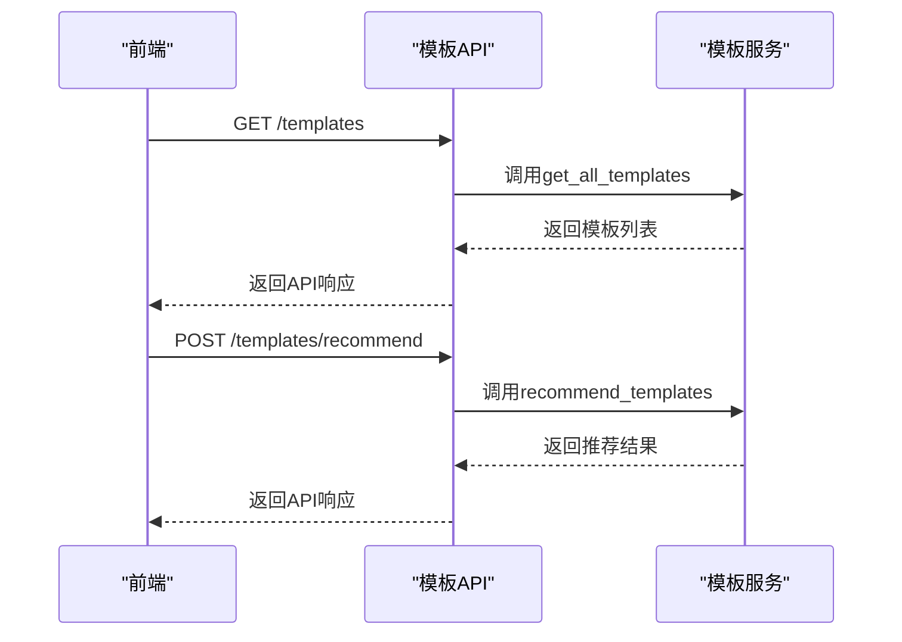

**Diagram sources**
- [templates.py](file://backend/app/api/v1/templates.py#L1-L99)
- [templates.ts](file://frontend/src/api/templates.ts#L1-L52)

### 作品服务

作品服务提供作品的创建、查询和删除功能，实现用户作品的持久化管理。

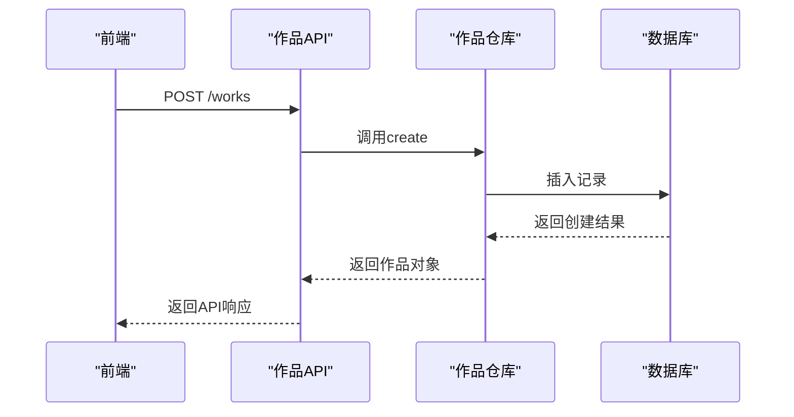

**Diagram sources**
- [works.py](file://backend/app/api/v1/works.py#L1-L106)
- [work.ts](file://frontend/src/api/work.ts#L1-L62)

### 导出服务

导出服务支持多种格式的文件导出，包括SVG、PNG、PDF和PPTX。

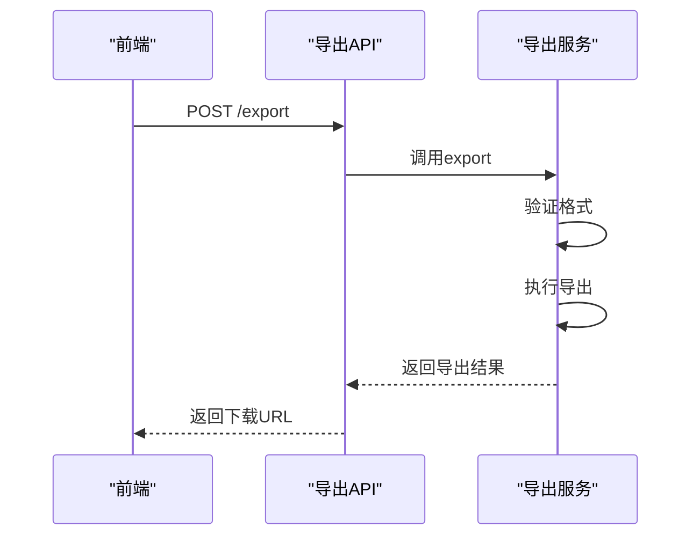

**Diagram sources**
- [export.py](file://backend/app/api/v1/export.py#L1-L208)
- [export.ts](file://frontend/src/api/export.ts#L1-L74)

**Section sources**
- [generate.py](file://backend/app/api/v1/generate.py#L1-L116)
- [templates.py](file://backend/app/api/v1/templates.py#L1-L99)
- [works.py](file://backend/app/api/v1/works.py#L1-L106)
- [export.py](file://backend/app/api/v1/export.py#L1-L208)
- [generate.ts](file://frontend/src/api/generate.ts#L1-L26)
- [templates.ts](file://frontend/src/api/templates.ts#L1-L52)
- [work.ts](file://frontend/src/api/work.ts#L1-L62)
- [export.ts](file://frontend/src/api/export.ts#L1-L74)

## 请求参数序列化与错误处理

系统实现了统一的请求参数序列化和错误处理机制，确保API调用的可靠性和可维护性。

### 请求参数序列化

前端API模块使用TypeScript接口定义请求和响应数据结构，确保类型安全。

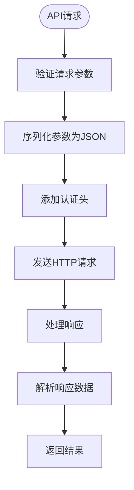

**Diagram sources**
- [client.ts](file://frontend/src/api/client.ts#L1-L45)

### 错误处理机制

系统实现了多层次的错误处理机制，包括客户端拦截器、服务端异常处理器和重试策略。

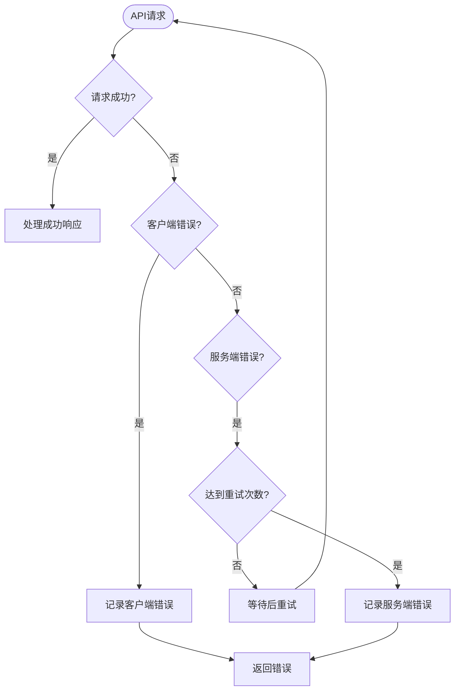

**Diagram sources**
- [dify_workflow_client.py](file://backend/app/services/dify_workflow_client.py#L108-L136)

**Section sources**
- [client.ts](file://frontend/src/api/client.ts#L1-L45)
- [dify_workflow_client.py](file://backend/app/services/dify_workflow_client.py#L108-L136)

## API调用示例与组件集成

以下示例展示了如何在Vue组件中使用API服务获取数据和提交表单。

### 模板管理组件

模板状态管理使用Pinia store，封装了模板相关的API调用。

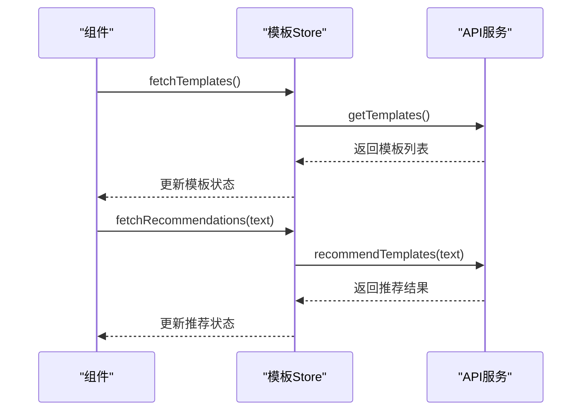

**Diagram sources**
- [template.ts](file://frontend/src/stores/template.ts#L1-L102)

### 工作区组件

工作区状态管理封装了信息图配置和生成状态。

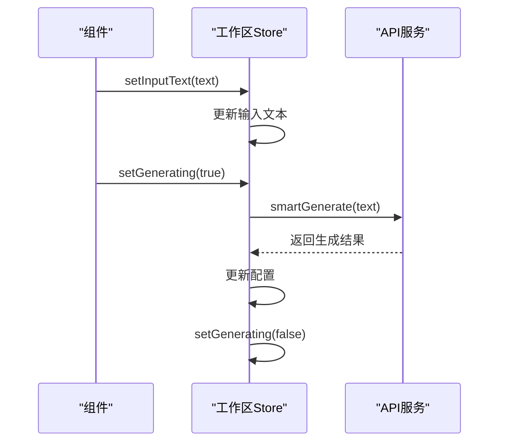

**Diagram sources**
- [workspace.ts](file://frontend/src/stores/workspace.ts#L1-L74)

**Section sources**
- [template.ts](file://frontend/src/stores/template.ts#L1-L102)
- [workspace.ts](file://frontend/src/stores/workspace.ts#L1-L74)

## 认证与授权机制

系统目前采用简单的API密钥认证机制，通过环境变量配置认证信息。

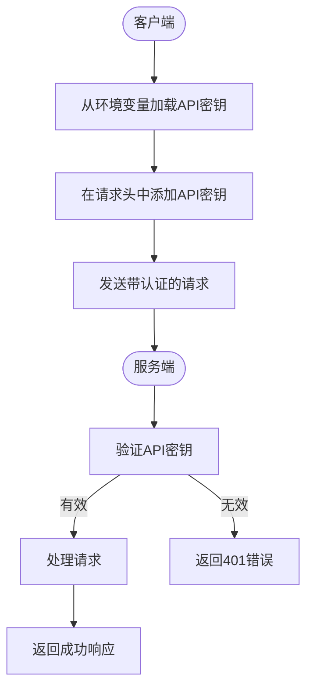

**Section sources**
- [client.ts](file://frontend/src/api/client.ts#L1-L45)

## 性能优化策略

系统实现了多种性能优化策略，包括请求超时设置、错误重试和资源清理。

### 请求超时与重试

为支持Dify工作流处理，系统设置了较长的请求超时时间，并实现了重试机制。

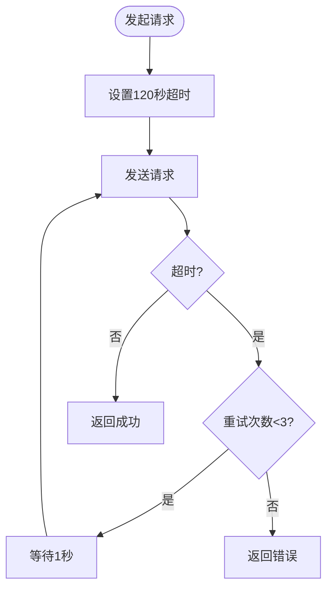

**Diagram sources**
- [client.ts](file://frontend/src/api/client.ts#L1-L45)
- [dify_workflow_client.py](file://backend/app/services/dify_workflow_client.py#L108-L136)

### 资源清理

导出服务实现了临时文件的自动清理机制，避免磁盘空间耗尽。

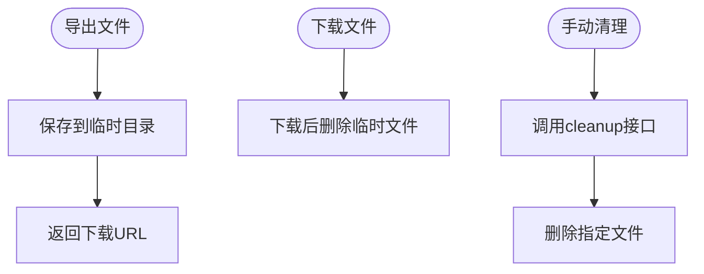

**Diagram sources**
- [export.py](file://backend/app/api/v1/export.py#L1-L208)

**Section sources**
- [client.ts](file://frontend/src/api/client.ts#L1-L45)
- [dify_workflow_client.py](file://backend/app/services/dify_workflow_client.py#L108-L136)
- [export.py](file://backend/app/api/v1/export.py#L1-L208)

## 调试指南

### 使用浏览器开发者工具

1. 打开浏览器开发者工具（F12）
2. 切换到"Network"标签页
3. 执行API调用操作
4. 查看HTTP请求和响应详情
5. 检查请求头、参数和响应数据

### 监控API请求

- **请求URL**: 检查API端点是否正确
- **请求方法**: 确认使用正确的HTTP方法
- **请求头**: 验证Content-Type和认证信息
- **请求体**: 检查JSON数据格式和内容
- **响应状态**: 确认HTTP状态码（200表示成功）
- **响应数据**: 验证返回的JSON结构

### 常见问题排查

1. **CORS错误**: 确认后端CORS配置允许前端域名
2. **404错误**: 检查API端点路径是否正确
3. **500错误**: 查看后端日志获取详细错误信息
4. **超时错误**: 检查网络连接和后端服务状态
5. **数据格式错误**: 验证请求参数是否符合API文档要求

**Section sources**
- [client.ts](file://frontend/src/api/client.ts#L1-L45)
- [main.py](file://backend/app/main.py#L1-L113)