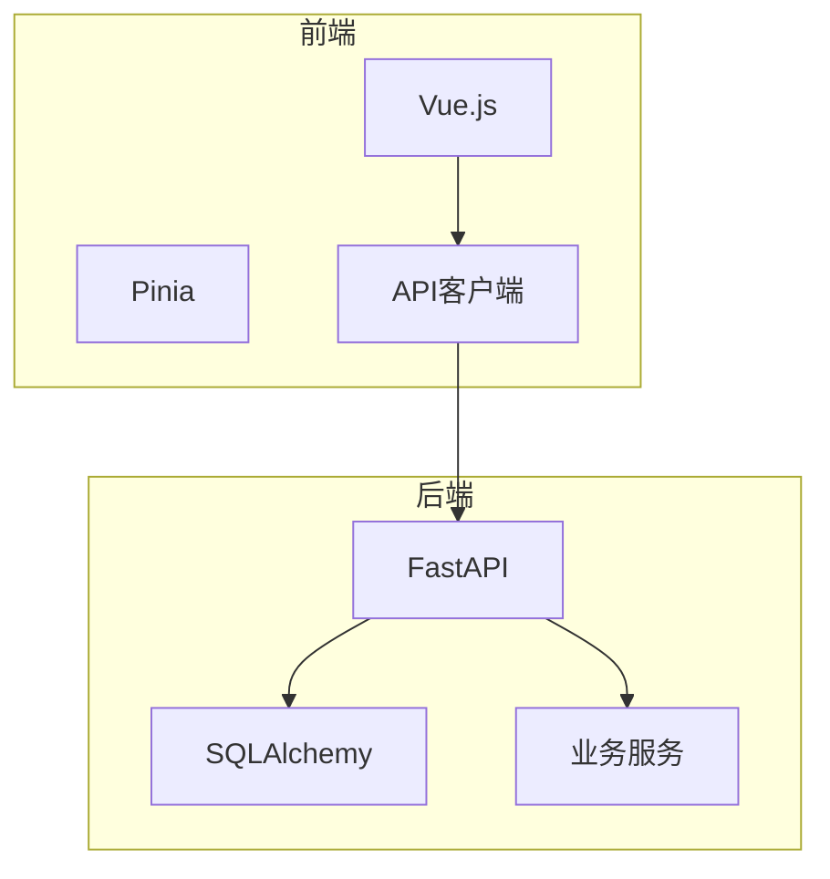
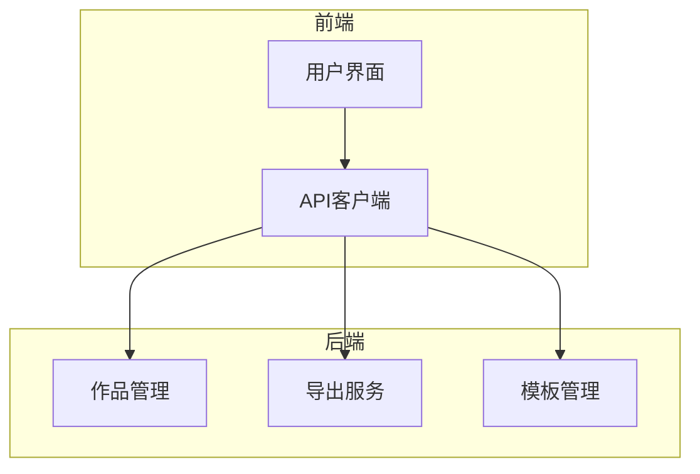
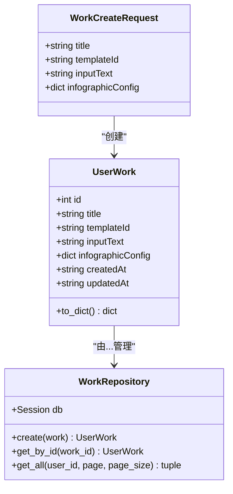
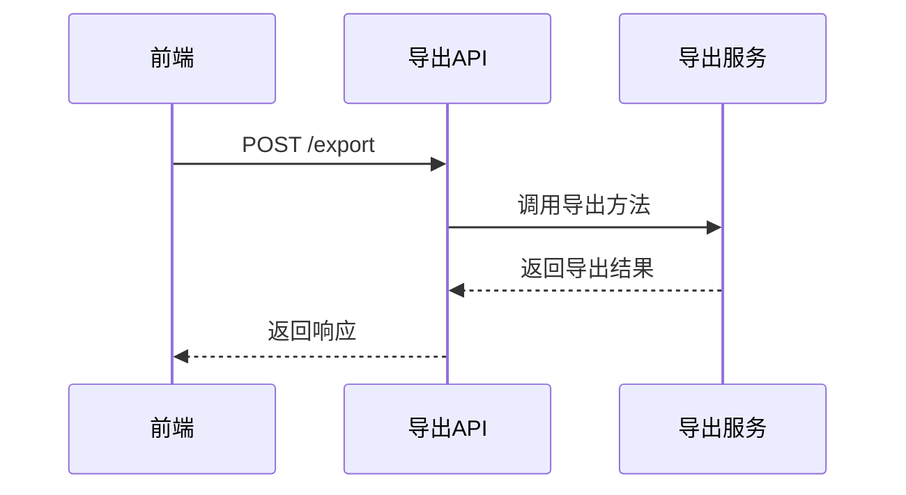
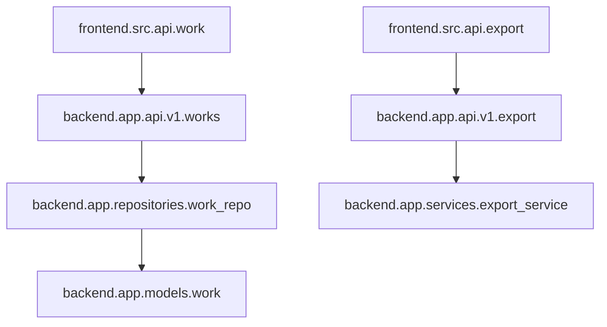

# 作品管理

<cite>
**本文档引用的文件**   
- [works.py](file://backend/app/api/v1/works.py)
- [work.py](file://backend/app/models/work.py)
- [work_repo.py](file://backend/app/repositories/work_repo.py)
- [work.ts](file://frontend/src/api/work.ts)
- [export.py](file://backend/app/api/v1/export.py)
- [export_service.py](file://backend/app/services/export_service.py)
- [export.ts](file://frontend/src/api/export.ts)
- [template.py](file://backend/app/models/template.py)
</cite>

## 目录
1. [简介](#简介)
2. [项目结构](#项目结构)
3. [核心组件](#核心组件)
4. [架构概述](#架构概述)
5. [详细组件分析](#详细组件分析)
6. [依赖分析](#依赖分析)
7. [性能考虑](#性能考虑)
8. [故障排除指南](#故障排除指南)
9. [结论](#结论)

## 简介
本综合文档详细说明了用户作品的全生命周期管理API，涵盖作品的创建、读取、更新和删除（CRUD）操作。文档阐述了保存当前编辑状态、加载历史作品和删除不再需要的作品的具体实现。同时，文档详细描述了导出功能的实现，包括SVG、PNG、PDF和PPTX等多格式导出请求的参数配置和响应处理。作品元数据的结构设计，如标题、描述、模板引用和创建时间，也在文档中进行了详细说明。此外，文档提供了实际调用示例，展示在作品详情页面中如何集成这些API，并讨论了大文件导出的异步处理模式和进度反馈机制。

## 项目结构
项目结构清晰地分为前端和后端两个主要部分。后端使用FastAPI框架，包含API端点、数据库模型、仓库和业务服务。前端使用Vue.js框架，包含API客户端、状态管理和视图组件。这种分层架构确保了前后端的分离，提高了代码的可维护性和可扩展性。

**图表来源**
- [works.py](file://backend/app/api/v1/works.py)
- [work.ts](file://frontend/src/api/work.ts)

## 核心组件
核心组件包括作品管理API、导出服务和模板管理。作品管理API负责处理作品的CRUD操作，导出服务支持多种格式的导出，模板管理则提供了丰富的模板选择。

**章节来源**
- [works.py](file://backend/app/api/v1/works.py)
- [export_service.py](file://backend/app/services/export_service.py)
- [template.py](file://backend/app/models/template.py)

## 架构概述
系统架构采用微服务设计，前后端通过RESTful API进行通信。后端服务包括作品管理、导出服务和模板管理，每个服务都有明确的职责和接口。前端通过API客户端与后端服务交互，实现用户界面的动态更新。

**图表来源**
- [works.py](file://backend/app/api/v1/works.py)
- [export.py](file://backend/app/api/v1/export.py)
- [template.py](file://backend/app/models/template.py)

## 详细组件分析
### 作品管理分析
作品管理组件负责处理用户作品的全生命周期管理。它包括创建、读取、更新和删除操作，确保用户可以方便地管理他们的作品。

#### 作品管理类图

**图表来源**
- [work.py](file://backend/app/models/work.py)
- [work_repo.py](file://backend/app/repositories/work_repo.py)
- [work.ts](file://frontend/src/api/work.ts)

### 导出服务分析
导出服务组件支持多种格式的导出，包括SVG、PNG、PDF和PPTX。它通过统一的导出接口，根据用户选择的格式执行相应的导出操作。

#### 导出服务序列图

**图表来源**
- [export.py](file://backend/app/api/v1/export.py)
- [export_service.py](file://backend/app/services/export_service.py)

## 依赖分析
系统依赖关系清晰，前后端通过API进行通信。后端服务之间通过依赖注入的方式进行协作，确保了代码的松耦合和高内聚。

**图表来源**
- [works.py](file://backend/app/api/v1/works.py)
- [work_repo.py](file://backend/app/repositories/work_repo.py)
- [work.py](file://backend/app/models/work.py)
- [export.py](file://backend/app/api/v1/export.py)
- [export_service.py](file://backend/app/services/export_service.py)

**章节来源**
- [works.py](file://backend/app/api/v1/works.py)
- [work_repo.py](file://backend/app/repositories/work_repo.py)
- [work.py](file://backend/app/models/work.py)
- [export.py](file://backend/app/api/v1/export.py)
- [export_service.py](file://backend/app/services/export_service.py)

## 性能考虑
在性能方面，系统通过异步处理和缓存机制来优化大文件导出和频繁的API调用。导出服务使用临时目录存储导出文件，避免了内存溢出的风险。同时，数据库查询通过分页和索引优化，提高了查询效率。

## 故障排除指南
当遇到问题时，首先检查API响应状态码和错误信息。对于导出失败，确保所需的依赖库已正确安装。对于数据库操作失败，检查数据库连接和表结构是否正确。

**章节来源**
- [works.py](file://backend/app/api/v1/works.py)
- [export.py](file://backend/app/api/v1/export.py)

## 结论
本文档详细介绍了作品管理与导出服务的实现，涵盖了从API设计到具体实现的各个方面。通过清晰的架构和模块化设计，系统能够高效地管理用户作品并支持多种格式的导出。未来可以进一步优化性能，增加更多的模板和导出格式，提升用户体验。