# 客户端配置

<cite>
**本文档引用的文件**
- [frontend/src/api/client.ts](file://frontend/src/api/client.ts)
- [frontend/src/api/generate.ts](file://frontend/src/api/generate.ts)
- [frontend/src/api/templates.ts](file://frontend/src/api/templates.ts)
- [frontend/src/api/work.ts](file://frontend/src/api/work.ts)
- [frontend/vite.config.ts](file://frontend/vite.config.ts)
- [frontend/package.json](file://frontend/package.json)
- [frontend/src/stores/settings.ts](file://frontend/src/stores/settings.ts)
- [frontend/nginx.conf](file://frontend/nginx.conf)
- [backend/app/services/dify_workflow_client.py](file://backend/app/services/dify_workflow_client.py)
</cite>

## 目录
1. [简介](#简介)
2. [项目架构概览](#项目架构概览)
3. [API客户端核心配置](#api客户端核心配置)
4. [环境变量管理](#环境变量管理)
5. [请求拦截器配置](#请求拦截器配置)
6. [响应拦截器配置](#响应拦截器配置)
7. [错误处理策略](#错误处理策略)
8. [代理配置](#代理配置)
9. [调试技巧](#调试技巧)
10. [最佳实践](#最佳实践)

## 简介

本文档详细介绍了基于Vue 3和TypeScript的前端应用程序中，基于Axios的HTTP客户端封装实现。该客户端负责与后端FastAPI服务进行通信，提供了统一的API访问接口、错误处理机制和开发调试支持。

## 项目架构概览

前端应用程序采用现代化的单页应用架构，主要组件包括：

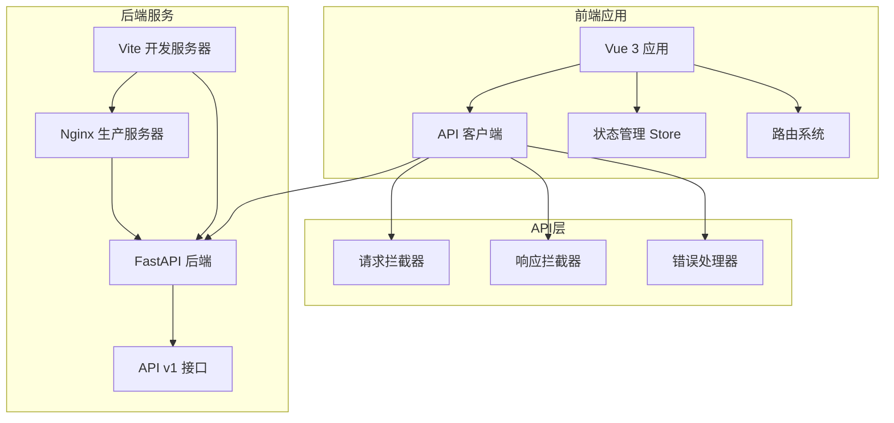

**图表来源**
- [frontend/src/api/client.ts](file://frontend/src/api/client.ts#L1-L46)
- [frontend/vite.config.ts](file://frontend/vite.config.ts#L1-L25)

**章节来源**
- [frontend/src/api/client.ts](file://frontend/src/api/client.ts#L1-L46)
- [frontend/package.json](file://frontend/package.json#L1-L27)

## API客户端核心配置

### 基础URL配置

API客户端的核心配置定义了与后端服务通信的基础地址：

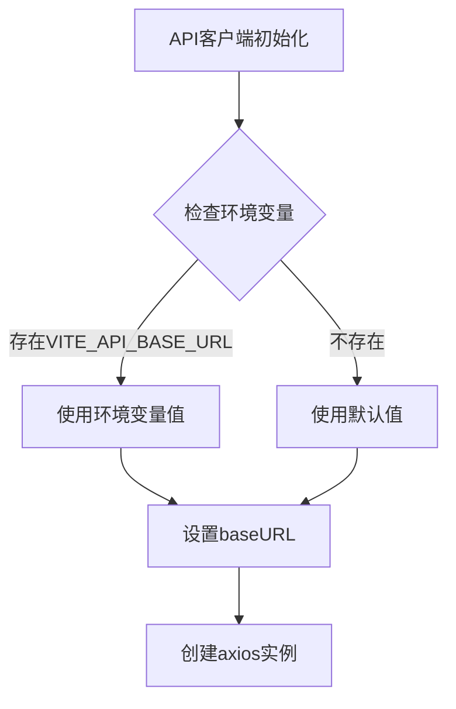

**图表来源**
- [frontend/src/api/client.ts](file://frontend/src/api/client.ts#L16)

### HTTP客户端参数配置

| 参数名称 | 配置值 | 说明 |
|---------|--------|------|
| baseURL | import.meta.env.VITE_API_BASE_URL \| 'http://localhost:8000/api/v1' | API基础URL，支持环境变量覆盖 |
| timeout | 120000 | 请求超时时间，设置为120秒以支持Dify工作流处理 |
| headers.Content-Type | 'application/json' | 默认请求内容类型 |

### API响应结构定义

客户端定义了统一的响应结构接口，确保前后端数据格式一致性：

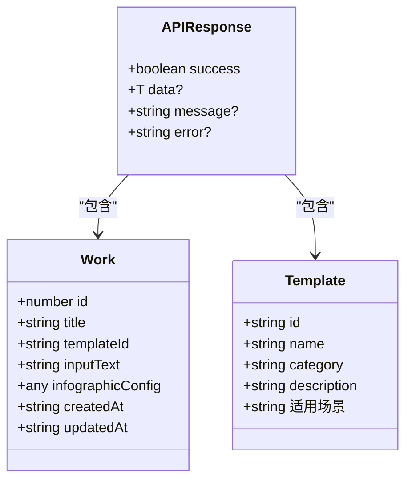

**图表来源**
- [frontend/src/api/client.ts](file://frontend/src/api/client.ts#L9-L14)
- [frontend/src/api/work.ts](file://frontend/src/api/work.ts#L20-L28)
- [frontend/src/api/templates.ts](file://frontend/src/api/templates.ts#L6-L12)

**章节来源**
- [frontend/src/api/client.ts](file://frontend/src/api/client.ts#L16-L24)

## 环境变量管理

### 环境变量配置表

| 变量名 | 默认值 | 用途 | 示例值 |
|--------|--------|------|--------|
| VITE_API_BASE_URL | http://localhost:8000/api/v1 | API基础URL | http://api.example.com/api/v1 |
| NODE_ENV | development | 运行环境 | production, development, test |

### 环境变量使用方式

环境变量通过Vite的内置机制自动注入到客户端代码中：

```typescript
// 在客户端代码中访问环境变量
const API_BASE_URL = import.meta.env.VITE_API_BASE_URL || 'http://localhost:8000/api/v1'
```

### 不同环境的配置策略

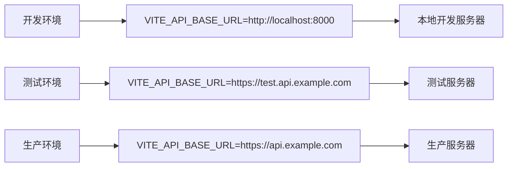

**章节来源**
- [frontend/src/api/client.ts](file://frontend/src/api/client.ts#L16)
- [frontend/vite.config.ts](file://frontend/vite.config.ts#L18-L22)

## 请求拦截器配置

### 当前请求拦截器实现

目前的请求拦截器处于基础配置阶段，主要功能是：

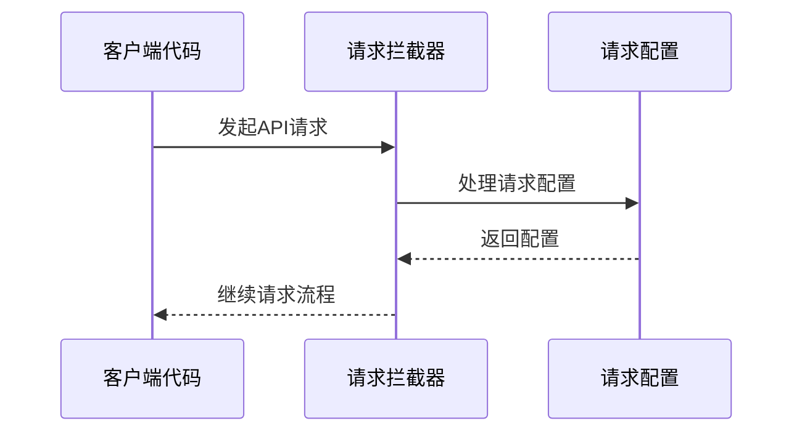

**图表来源**
- [frontend/src/api/client.ts](file://frontend/src/api/client.ts#L27-L34)

### 扩展功能规划

未来的请求拦截器可以添加以下功能：

| 功能模块 | 描述 | 实现方式 |
|---------|------|----------|
| 认证令牌注入 | 自动添加JWT令牌到请求头 | 在拦截器中读取存储的token |
| 请求日志记录 | 记录请求信息用于调试 | 控制台输出或日志服务 |
| 请求重试机制 | 对失败请求进行重试 | 基于错误类型的重试逻辑 |
| 请求去重 | 防止重复发送相同请求 | 请求指纹识别 |

**章节来源**
- [frontend/src/api/client.ts](file://frontend/src/api/client.ts#L27-L34)

## 响应拦截器配置

### 响应数据提取

响应拦截器实现了自动的数据提取功能：

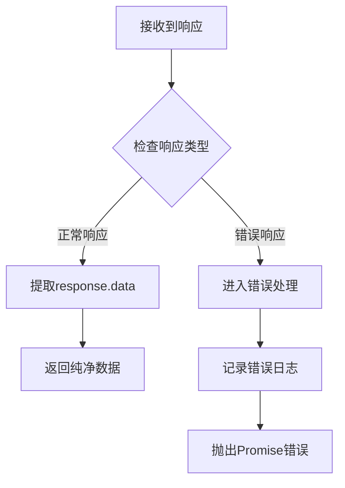

**图表来源**
- [frontend/src/api/client.ts](file://frontend/src/api/client.ts#L38-L44)

### 响应处理流程

| 处理阶段 | 功能描述 | 错误处理 |
|---------|----------|----------|
| 数据提取 | 从完整响应对象中提取data字段 | 无 |
| 格式化 | 将原始响应转换为简洁格式 | 无 |
| 错误捕获 | 捕获所有响应错误 | 记录错误并重新抛出 |
| 日志记录 | 输出错误信息到控制台 | 开发环境可见 |

**章节来源**
- [frontend/src/api/client.ts](file://frontend/src/api/client.ts#L38-L44)

## 错误处理策略

### 错误类型分类

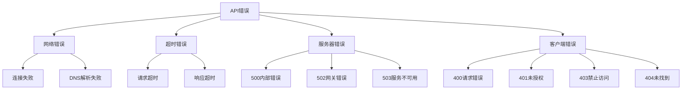

### 错误处理机制

当前的错误处理策略相对简单但有效：

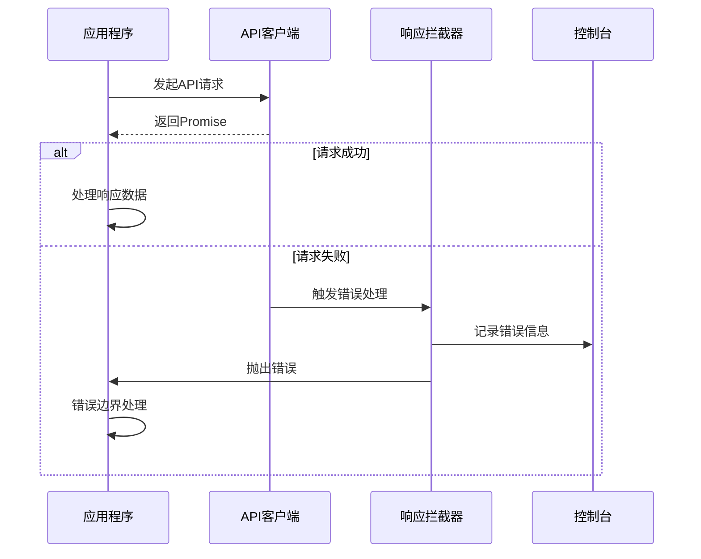

**图表来源**
- [frontend/src/api/client.ts](file://frontend/src/api/client.ts#L41-L44)

### 错误恢复策略

| 错误类型 | 恢复策略 | 实现方式 |
|---------|----------|----------|
| 网络中断 | 显示离线提示 | 检测navigator.onLine |
| 服务器错误 | 显示通用错误消息 | 4xx和5xx状态码处理 |
| 超时错误 | 提供重试选项 | 用户手动重试 |
| 认证失败 | 引导重新登录 | 清除认证状态 |

**章节来源**
- [frontend/src/api/client.ts](file://frontend/src/api/client.ts#L41-L44)

## 代理配置

### Vite开发服务器代理

开发环境下的代理配置确保前端开发服务器能够正确转发API请求：

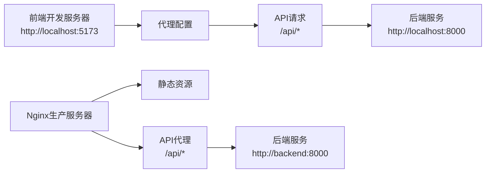

**图表来源**
- [frontend/vite.config.ts](file://frontend/vite.config.ts#L18-L22)
- [frontend/nginx.conf](file://frontend/nginx.conf#L13-L19)

### 代理配置参数

| 参数 | 值 | 说明 |
|------|-----|------|
| target | http://localhost:8000 | 目标后端服务器地址 |
| changeOrigin | true | 修改请求的源信息 |
| rewrite | 无特殊重写规则 | 保持原始路径 |

### 生产环境代理配置

生产环境使用Nginx作为反向代理服务器：

```nginx
location /api/ {
    proxy_pass http://backend:8000/api/;
    proxy_set_header Host $host;
    proxy_set_header X-Real-IP $remote_addr;
    proxy_set_header X-Forwarded-For $proxy_add_x_forwarded_for;
    proxy_set_header X-Forwarded-Proto $scheme;
}
```

**章节来源**
- [frontend/vite.config.ts](file://frontend/vite.config.ts#L18-L22)
- [frontend/nginx.conf](file://frontend/nginx.conf#L13-L19)

## 调试技巧

### 开发环境调试配置

虽然当前的客户端没有内置详细的调试功能，但可以通过以下方式进行调试：

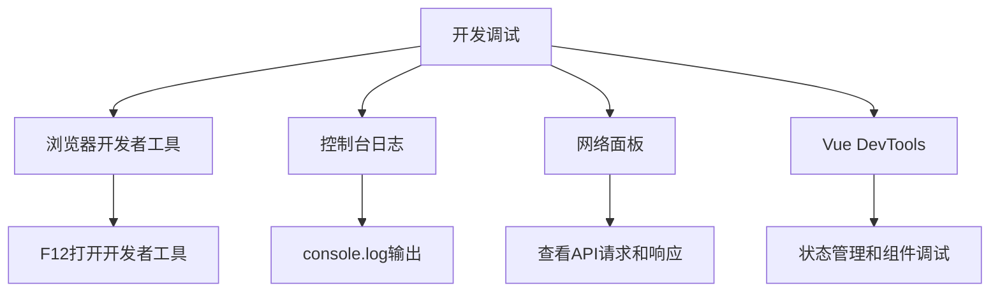

### 请求日志记录建议

为了增强调试能力，可以扩展请求拦截器添加日志记录：

```typescript
// 建议的扩展日志功能
apiClient.interceptors.request.use(
  (config) => {
    if (import.meta.env.DEV) {
      console.log(`[API Request] ${config.method?.toUpperCase()} ${config.url}`, {
        data: config.data,
        params: config.params
      });
    }
    return config;
  }
);

apiClient.interceptors.response.use(
  (response) => {
    if (import.meta.env.DEV) {
      console.log(`[API Response] ${response.status} ${response.config.url}`, {
        data: response.data
      });
    }
    return response.data;
  },
  (error) => {
    if (import.meta.env.DEV) {
      console.error(`[API Error] ${error.config?.url}`, {
        status: error.response?.status,
        data: error.response?.data,
        message: error.message
      });
    }
    return Promise.reject(error);
  }
);
```

### 性能监控

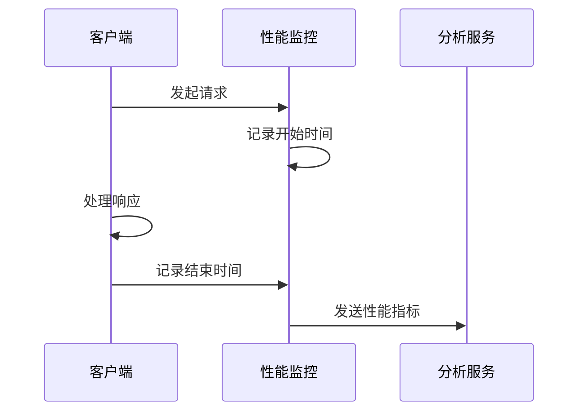

**章节来源**
- [frontend/src/api/client.ts](file://frontend/src/api/client.ts#L41-L44)

## 最佳实践

### API客户端使用规范

1. **统一的API调用方式**
   - 使用专门的API模块而非直接调用apiClient
   - 每个功能模块对应一个API文件

2. **错误处理最佳实践**
   - 在每个API调用点都进行错误处理
   - 提供用户友好的错误消息
   - 区分可恢复和不可恢复的错误

3. **类型安全**
   - 为所有API响应定义明确的TypeScript接口
   - 使用泛型确保类型安全

4. **性能优化**
   - 合理设置请求超时时间
   - 实现请求去重机制
   - 使用适当的缓存策略

### 代码组织结构

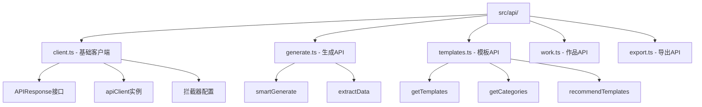

**图表来源**
- [frontend/src/api/client.ts](file://frontend/src/api/client.ts#L1-L46)
- [frontend/src/api/generate.ts](file://frontend/src/api/generate.ts#L1-L26)
- [frontend/src/api/templates.ts](file://frontend/src/api/templates.ts#L1-L52)
- [frontend/src/api/work.ts](file://frontend/src/api/work.ts#L1-L62)

### 安全考虑

1. **敏感数据保护**
   - 不要在客户端代码中硬编码API密钥
   - 使用环境变量管理敏感配置
   - 实现适当的认证机制

2. **跨域安全**
   - 正确配置CORS策略
   - 验证请求来源
   - 实施适当的CSRF防护

3. **数据传输安全**
   - 使用HTTPS协议
   - 实现数据加密
   - 验证响应数据完整性

**章节来源**
- [frontend/src/api/client.ts](file://frontend/src/api/client.ts#L1-L46)
- [frontend/src/stores/settings.ts](file://frontend/src/stores/settings.ts#L1-L77)