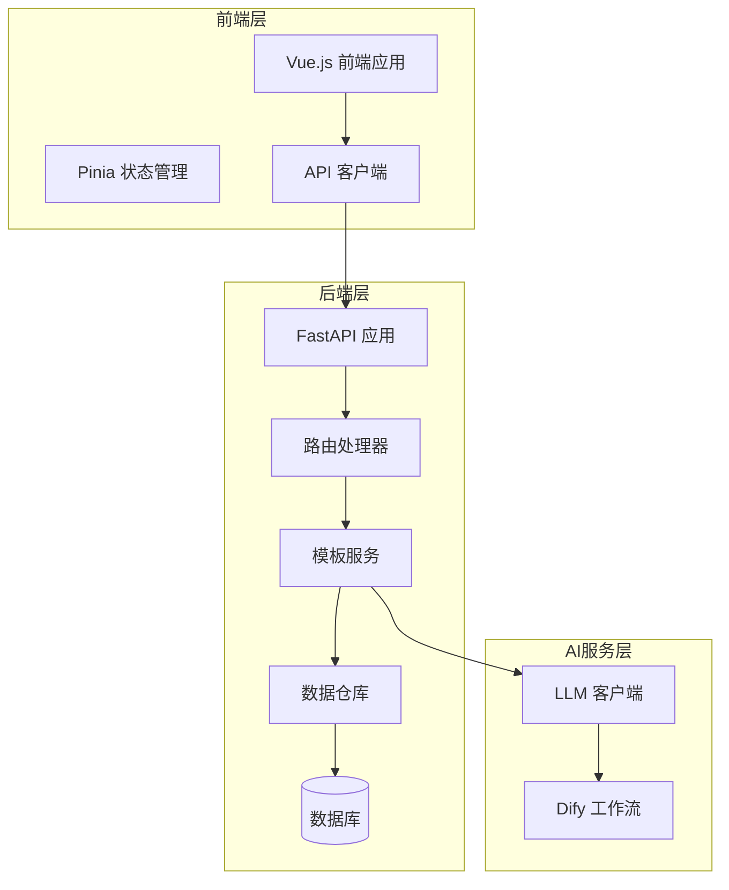
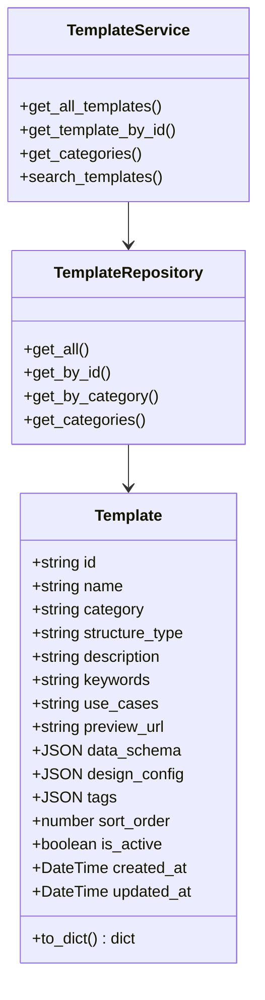
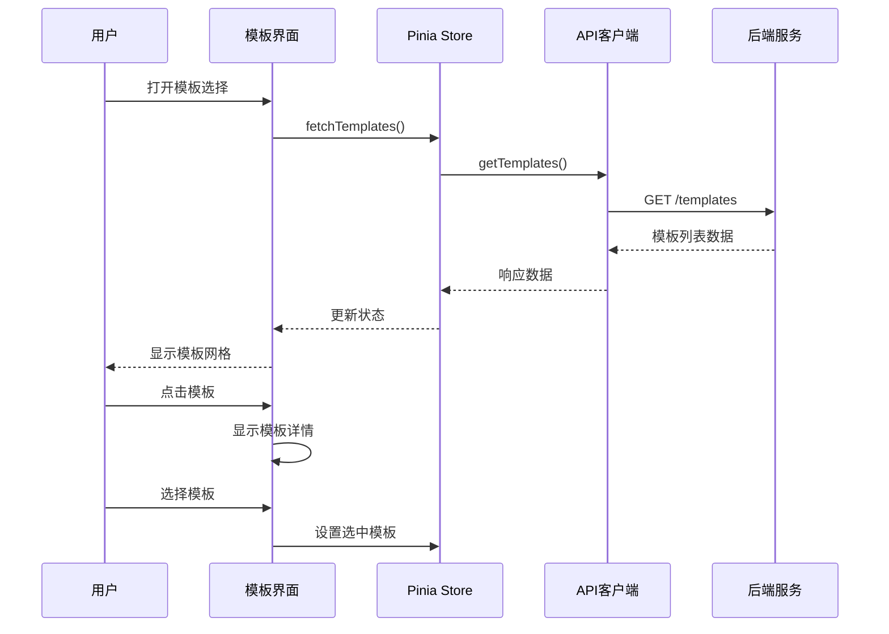

# 模板服务API详细文档

<cite>
**本文档中引用的文件**
- [templates.py](file://backend/app/api/v1/templates.py)
- [template_service.py](file://backend/app/services/template_service.py)
- [template_repo.py](file://backend/app/repositories/template_repo.py)
- [template.py](file://backend/app/models/template.py)
- [template.ts](file://frontend/src/api/templates.ts)
- [template.ts](file://frontend/src/stores/template.ts)
- [client.ts](file://frontend/src/api/client.ts)
- [common.py](file://backend/app/schemas/common.py)
- [template.py](file://backend/app/schemas/template.py)
- [Examples.vue](file://frontend/src/views/Examples/Examples.vue)
- [db.py](file://backend/app/utils/db.py)
</cite>

## 目录
1. [简介](#简介)
2. [系统架构](#系统架构)
3. [API端点详解](#api端点详解)
4. [数据模型与结构](#数据模型与结构)
5. [前端集成指南](#前端集成指南)
6. [性能优化策略](#性能优化策略)
7. [错误处理与降级方案](#错误处理与降级方案)
8. [最佳实践](#最佳实践)
9. [故障排除](#故障排除)

## 简介

AntV Infographic模板服务是一个完整的信息图表模板管理系统，为用户提供丰富的可视化模板选择和智能推荐功能。该服务采用前后端分离架构，后端基于FastAPI构建RESTful API，前端使用Vue.js框架实现模板选择界面。

### 核心功能特性

- **模板列表管理**：支持分页、分类筛选、关键词搜索的模板浏览
- **智能推荐**：基于AI的模板推荐算法，根据用户输入内容匹配最适合的模板
- **分类体系**：七大分类体系覆盖不同类型的可视化需求
- **预览功能**：实时模板预览和配置展示
- **性能优化**：本地缓存、懒加载等优化策略

## 系统架构



**架构图来源**
- [templates.py](file://backend/app/api/v1/templates.py#L1-L99)
- [template_service.py](file://backend/app/services/template_service.py#L160-L281)
- [template.ts](file://frontend/src/api/templates.ts#L1-L52)

## API端点详解

### 1. 获取模板列表

**端点**: `GET /api/v1/templates`

**功能**: 获取可用的信息图模板列表，支持分页、分类筛选和关键词搜索。

**请求参数**:

| 参数名 | 类型 | 必填 | 默认值 | 描述 |
|--------|------|------|--------|------|
| category | string | 否 | - | 按分类筛选（可选） |
| keyword | string | 否 | - | 搜索关键词（可选） |
| page | number | 否 | 1 | 页码（默认1） |
| pageSize | number | 否 | 20 | 每页数量（默认20，最大100） |

**响应结构**:

```typescript
interface TemplateListResponse {
  success: boolean;
  data: {
    templates: Template[];
    total: number;
    page: number;
    pageSize: number;
  };
  message: string;
}
```

**代码示例**:
```typescript
// 基本请求
const templates = await getTemplates();

// 带筛选条件的请求
const filteredTemplates = await getTemplates({
  category: 'chart',
  keyword: '销售',
  page: 1,
  pageSize: 20
});
```

**节来源**
- [templates.py](file://backend/app/api/v1/templates.py#L17-L40)
- [template.ts](file://frontend/src/api/templates.ts#L26-L28)

### 2. 获取模板详情

**端点**: `GET /api/v1/templates/{template_id}`

**功能**: 获取指定模板的详细信息。

**路径参数**:

| 参数名 | 类型 | 必填 | 描述 |
|--------|------|------|------|
| template_id | string | 是 | 模板唯一标识符 |

**响应结构**:

```typescript
interface TemplateDetailResponse {
  success: boolean;
  data: Template;
  message: string;
}
```

**错误处理**:
- 404: 模板不存在

**节来源**
- [templates.py](file://backend/app/api/v1/templates.py#L61-L74)

### 3. 获取分类列表

**端点**: `GET /api/v1/templates/categories`

**功能**: 获取所有模板分类及每个分类的模板数量统计。

**响应结构**:

```typescript
interface CategoriesResponse {
  success: boolean;
  data: Category[];
  message: string;
}

interface Category {
  code: string;
  name: string;
  description: string;
  count: number;
}
```

**预定义分类**:
- `chart`: 图表型 - 数值展示
- `comparison`: 对比型 - 优劣对比  
- `hierarchy`: 层级型 - 组织架构
- `list`: 列表型 - 步骤说明
- `quadrant`: 四象限型 - 市场定位
- `relation`: 关系型 - 关系网络
- `sequence`: 顺序型 - 时间线流程

**节来源**
- [templates.py](file://backend/app/api/v1/templates.py#L42-L58)

### 4. AI模板推荐

**端点**: `POST /api/v1/templates/recommend`

**功能**: 根据用户输入的文本内容，使用AI推荐最合适的信息图模板。

**请求体**:

```typescript
interface TemplateRecommendRequest {
  text: string;           // 用户输入的文本内容（必填）
  maxRecommendations?: number; // 最多推荐数量（1-10，默认5）
}
```

**响应结构**:

```typescript
interface TemplateRecommendResponse {
  success: boolean;
  data: {
    recommendations: TemplateRecommendation[];
    analysisTime: number;
  };
  message: string;
}

interface TemplateRecommendation {
  templateId: string;
  templateName: string;
  confidence: number;    // 置信度（0-1）
  matchScore: number;    // 百分比形式的匹配度
  reason: string;        // 推荐理由
  category?: string;     // 可选分类
}
```

**节来源**
- [templates.py](file://backend/app/api/v1/templates.py#L77-L99)
- [template.py](file://backend/app/schemas/template.py#L8-L27)

## 数据模型与结构

### 后端数据模型



**类图来源**
- [template.py](file://backend/app/models/template.py#L9-L54)
- [template_service.py](file://backend/app/services/template_service.py#L160-L281)

### 前端数据接口

```typescript
interface Template {
  id: string;
  name: string;
  category: string;
  description?: string;
  useCases?: string;
  previewUrl?: string;
  tags?: string[];
  dataSchema: any;
  designConfig: any;
}

interface Category {
  code: string;
  name: string;
  description: string;
  count: number;
}
```

**节来源**
- [template.ts](file://frontend/src/stores/template.ts#L8-L34)
- [template.py](file://backend/app/models/template.py#L35-L53)

### 数据字段说明

| 字段名 | 类型 | 描述 | 示例 |
|--------|------|------|------|
| id | string | 模板唯一标识符 | "list-row-simple-horizontal-arrow" |
| name | string | 模板显示名称 | "简单横向流程图" |
| category | string | 分类代码 | "list", "chart", "comparison" |
| structureType | string | AntV结构类型 | "list-row", "sequence-timeline" |
| description | string | 模板描述 | "带箭头的横向列表布局..." |
| useCases | string | 适用场景 | "步骤说明、流程展示、操作指南" |
| previewUrl | string | 预览图URL | "/assets/previews/template.png" |
| dataSchema | JSON | 数据结构Schema | 包含字段定义和验证规则 |
| designConfig | JSON | 设计配置 | AntV设计系统的配置参数 |
| tags | JSON数组 | 标签数组 | ["流程", "步骤", "图标"] |
| sortOrder | number | 排序权重 | 100 |

## 前端集成指南

### 状态管理集成

使用Pinia进行状态管理，集中管理模板数据：

```typescript
// 在模板选择页面中使用
const templateStore = useTemplateStore();

// 加载模板数据
await templateStore.fetchTemplates(category, keyword);

// 获取分类数据
await templateStore.fetchCategories();

// 获取AI推荐
const recommendations = await templateStore.fetchRecommendations(text);
```

**节来源**
- [template.ts](file://frontend/src/stores/template.ts#L36-L102)

### 模板选择页面实现



**序列图来源**
- [Examples.vue](file://frontend/src/views/Examples/Examples.vue#L240-L267)
- [template.ts](file://frontend/src/stores/template.ts#L44-L54)

### 模板网格渲染

模板网格采用响应式布局，支持分类筛选和搜索：

```typescript
// 过滤逻辑
const filteredTemplates = computed(() => {
  if (!selectedCategory.value) {
    return templates.value;
  }
  return templates.value.filter(t => t.category === selectedCategory.value);
});

// 分类映射
const categoryMap = {
  'sequence': { name: '顺序型', icon: '🔄' },
  'list': { name: '列表型', icon: '📋' },
  'comparison': { name: '对比型', icon: '⚖️' },
  'relation': { name: '关系型', icon: '🔗' },
  'hierarchy': { name: '层级型', icon: '🏔️' },
  'chart': { name: '图表型', icon: '📊' },
  'quadrant': { name: '四象限型', icon: '🎯' }
};
```

**节来源**
- [Examples.vue](file://frontend/src/views/Examples/Examples.vue#L39-L279)

### API客户端配置

```typescript
// API客户端基础配置
const apiClient = axios.create({
  baseURL: API_BASE_URL,
  timeout: 120000, // 支持长时间的AI处理
  headers: {
    'Content-Type': 'application/json'
  }
});

// 错误处理
apiClient.interceptors.response.use(
  (response) => response.data,
  (error) => {
    console.error('API请求失败:', error);
    return Promise.reject(error);
  }
);
```

**节来源**
- [client.ts](file://frontend/src/api/client.ts#L16-L46)

## 性能优化策略

### 1. 分页机制

后端实现高效的分页查询，避免一次性加载大量数据：

```python
# 查询优化
templates = query.order_by(
    Template.sort_order.desc(),
    Template.created_at.desc()
).offset((page - 1) * page_size).limit(page_size).all()
```

**分页参数优化**:
- 默认每页20个模板
- 最大支持100个模板/页
- 使用复合索引加速查询

**节来源**
- [template_repo.py](file://backend/app/repositories/template_repo.py#L67-L71)

### 2. 数据库索引优化

```python
# 复合索引
__table_args__ = (
    Index('idx_category_sort', 'category', 'sort_order'),
)
```

**索引策略**:
- `category` + `sort_order` 复合索引
- 支持快速分类筛选和排序
- 减少全表扫描

**节来源**
- [template.py](file://backend/app/models/template.py#L30-L33)

### 3. 前端缓存策略

```typescript
// 模板数据缓存
const templates = ref<Template[]>([]);

// 分类数据缓存
const categories = ref<Category[]>([]);

// 推荐结果缓存
const recommendations = ref<TemplateRecommendation[]>([]);
```

**缓存策略**:
- 分类数据一次性加载并缓存
- 模板列表支持增量加载
- AI推荐结果临时缓存

**节来源**
- [template.ts](file://frontend/src/stores/template.ts#L38-L41)

### 4. 懒加载实现

```typescript
// 模板预览懒加载
const renderPreviews = () => {
  filteredTemplates.value.forEach((template, index) => {
    const container = previewRefs.value[index];
    if (container) {
      // 异步渲染预览
      setTimeout(() => {
        renderTemplatePreview(container, template);
      }, 100);
    }
  });
};
```

**懒加载特点**:
- 按需渲染模板预览
- 避免初始加载阻塞
- 提升首屏渲染速度

**节来源**
- [Examples.vue](file://frontend/src/views/Examples/Examples.vue#L270-L317)

### 5. 数据库连接池优化

```python
# 生产环境配置
engine = create_engine(
    DATABASE_URL,
    pool_pre_ping=True,
    pool_size=10,
    max_overflow=20
)
```

**连接池配置**:
- 最小连接数: 10
- 最大溢出: 20
- 自动健康检查
- 连接超时自动重试

**节来源**
- [db.py](file://backend/app/utils/db.py#L29-L36)

## 错误处理与降级方案

### 1. API错误处理

```typescript
// 前端错误处理
try {
  const response = await getTemplates({ page: 1, pageSize: 100 });
  if (response.success && response.data) {
    templates.value = response.data.templates;
  }
} catch (error) {
  console.error('加载模板失败:', error);
  // 显示错误提示
  showErrorMessage('无法获取模板列表，请稍后重试');
}
```

**错误类型处理**:
- 网络错误: 显示重试按钮
- 服务器错误: 显示维护提示
- 数据格式错误: 使用默认数据

**节来源**
- [template.ts](file://frontend/src/stores/template.ts#L44-L54)

### 2. 后端错误处理

```python
# 404错误处理
if not template:
    raise HTTPException(status_code=404, detail=f"模板不存在: {template_id}")

# 500错误处理
except Exception as e:
    raise HTTPException(status_code=500, detail=str(e))
```

**统一响应格式**:
```python
class APIResponse(BaseModel):
    success: bool
    data: Optional[T] = None
    message: str = "操作成功"
```

**节来源**
- [templates.py](file://backend/app/api/v1/templates.py#L71-L73)
- [common.py](file://backend/app/schemas/common.py#L10-L15)

### 3. 服务不可用降级

```python
# 数据库连接失败降级
def get_template_service():
    global _template_service
    if _template_service is None:
        try:
            _template_service = TemplateService()
        except Exception as e:
            logger.warning(f"模板服务初始化失败: {e}")
            # 使用内存缓存的静态数据
            _template_service = create_fallback_service()
    return _template_service
```

**降级策略**:
- 数据库连接失败时使用内存缓存
- 静态模板数据作为后备
- AI服务不可用时禁用推荐功能

### 4. 前端降级处理

```typescript
// 模板加载失败处理
const loadData = async () => {
  try {
    // 尝试从API获取数据
    const templatesRes = await getTemplates({ page: 1, pageSize: 100 });
    if (templatesRes.success && templatesRes.data) {
      templates.value = templatesRes.data.templates;
    }
  } catch (error) {
    // 降级到本地缓存或默认模板
    console.warn('API不可用，使用本地缓存');
    templates.value = getDefaultTemplates();
  }
};
```

**节来源**
- [template.ts](file://frontend/src/stores/template.ts#L240-L267)

## 最佳实践

### 1. 请求参数验证

```typescript
// 后端参数验证
@router.get("")
async def get_templates(
    category: Optional[str] = Query(None, description="按分类筛选"),
    keyword: Optional[str] = Query(None, description="搜索关键词"),
    page: int = Query(1, description="页码", ge=1),
    pageSize: int = Query(20, description="每页数量", ge=1, le=100)
):
```

**验证规则**:
- 页码必须 ≥ 1
- 每页数量范围: 1-100
- 分类参数可选
- 关键词参数可选

**节来源**
- [templates.py](file://backend/app/api/v1/templates.py#L18-L23)

### 2. 数据缓存策略

```python
# 缓存策略示例
@lru_cache(maxsize=100)
def get_template_by_id_cached(template_id: str):
    """缓存模板详情查询"""
    return template_service.get_template_by_id(template_id)
```

**缓存层次**:
- Redis缓存（生产环境）
- 内存缓存（开发环境）
- 浏览器缓存

### 3. 并发控制

```python
# AI推荐并发限制
from functools import lru_cache
import asyncio

class RateLimitedService:
    def __init__(self):
        self.semaphore = asyncio.Semaphore(5)  # 限制并发数
    
    async def recommend_with_limit(self, text: str):
        async with self.semaphore:
            return await self.recommend_templates(text)
```

### 4. 日志记录

```python
# 详细的日志记录
logger.info(f"[TemplateAPI] 获取模板列表: category={category}, keyword={keyword}, "
           f"page={page}, pageSize={pageSize}")
```

**日志级别**:
- INFO: 正常操作记录
- WARNING: 性能警告
- ERROR: 错误记录
- DEBUG: 详细调试信息

## 故障排除

### 常见问题及解决方案

#### 1. 模板加载缓慢

**症状**: 模板列表加载时间超过3秒

**原因分析**:
- 数据库查询未使用索引
- 网络延迟过高
- 前端渲染阻塞

**解决方案**:
```python
# 添加查询优化
query = query.options(
    Load(Template).undefer("preview_url"),  # 预加载图片URL
    Load(Template).undefer("description")   # 预加载描述
)
```

#### 2. AI推荐不准确

**症状**: AI推荐的模板与用户需求不符

**排查步骤**:
1. 检查用户输入文本长度
2. 验证LLM配置
3. 查看推荐置信度

**解决方案**:
```python
# 增强推荐质量
if confidence < 0.3:
    return fallback_recommendation(user_text)
```

#### 3. 分类统计错误

**症状**: 某些分类的模板数量显示为0

**排查方法**:
```python
# 检查模板激活状态
templates = db.query(Template).filter(
    Template.category == category,
    Template.is_active == True
).count()
```

#### 4. 前端缓存问题

**症状**: 更改模板后前端显示旧数据

**解决方案**:
```typescript
// 强制刷新缓存
const refreshTemplates = async () => {
  templates.value = [];
  await templateStore.fetchTemplates();
};
```

### 性能监控指标

| 指标 | 目标值 | 监控方法 |
|------|--------|----------|
| 模板列表响应时间 | < 500ms | 前端性能监控 |
| AI推荐响应时间 | < 3s | 后端日志分析 |
| 数据库查询时间 | < 100ms | SQL慢查询日志 |
| 前端渲染时间 | < 200ms | 浏览器性能工具 |

### 调试工具

```typescript
// 调试模式配置
const DEBUG_MODE = process.env.NODE_ENV === 'development';

if (DEBUG_MODE) {
  // 启用详细日志
  console.log('模板API请求:', { params });
  console.log('响应数据:', response);
}
```

通过遵循这些最佳实践和故障排除指南，可以确保模板服务的稳定性和高性能运行。定期监控和优化系统性能，及时处理异常情况，为用户提供优质的模板选择体验。