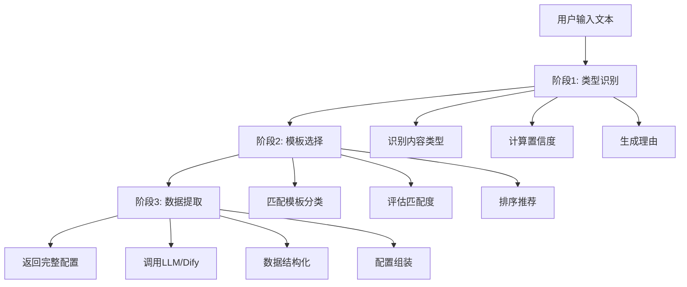
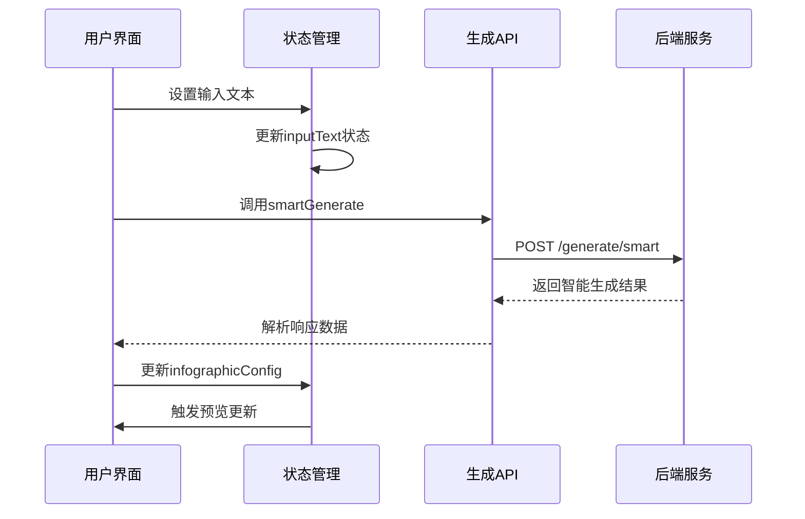
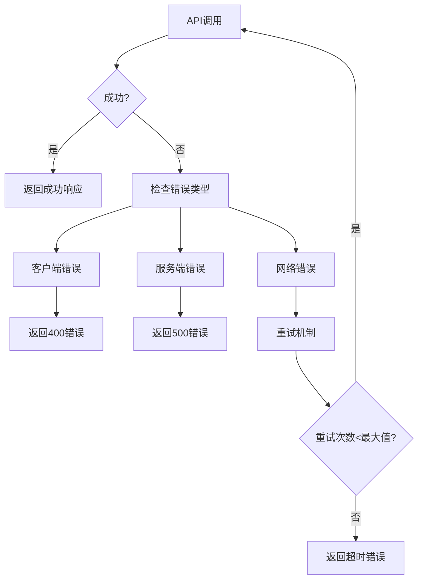
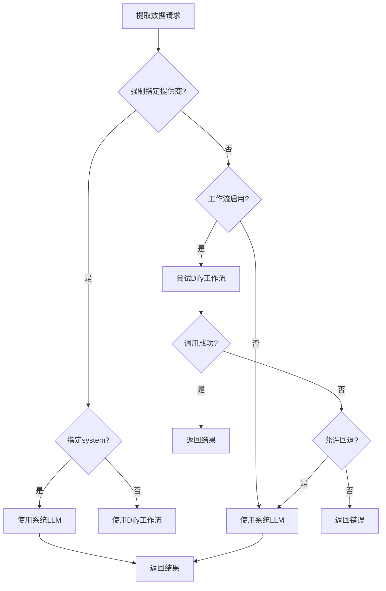

# 生成服务

<cite>
**本文档引用的文件**   
- [generate.ts](file://frontend/src/api/generate.ts)
- [generate.py](file://backend/app/api/v1/generate.py)
- [generate_service.py](file://backend/app/services/generate_service.py)
- [infographic.py](file://backend/app/schemas/infographic.py)
- [llm_client.py](file://backend/app/services/llm_client.py)
- [prompts.py](file://backend/app/utils/prompts.py)
- [workspace.ts](file://frontend/src/stores/workspace.ts)
</cite>

## 目录
1. [简介](#简介)
2. [API端点](#api端点)
3. [智能生成流程](#智能生成流程)
4. [请求与响应结构](#请求与响应结构)
5. [前端调用示例](#前端调用示例)
6. [错误处理](#错误处理)
7. [数据提取逻辑](#数据提取逻辑)

## 简介

生成服务是本系统的核心功能模块，负责将用户输入的文本内容转换为可视化信息图的结构化配置。该服务支持两种生成模式：智能生成模式和传统数据提取模式，为AI工作区提供强大的后端支持。

**Section sources**
- [generate.py](file://backend/app/api/v1/generate.py#L1-L116)
- [generate_service.py](file://backend/app/services/generate_service.py#L1-L465)

## API端点

生成服务提供了两个主要的API端点，分别对应不同的生成模式：

```mermaid
graph TB
A[生成服务API] --> B[/generate/smart]
A --> C[/generate/extract]
B --> D[智能生成模式]
C --> E[传统数据提取模式]
```

**Diagram sources**
- [generate.py](file://backend/app/api/v1/generate.py#L31-L88)

### 智能生成端点

`POST /api/v1/generate/smart` 端点执行三阶段智能生成流程：

- **功能**：自动识别内容类型、选择最佳模板、提取结构化数据
- **请求体**：包含用户输入文本的JSON对象
- **响应**：包含完整配置、分类结果、模板选择和时间统计

### 数据提取端点

`POST /api/v1/generate/extract` 端点执行传统数据提取：

- **功能**：根据指定模板ID从文本中提取结构化数据
- **请求体**：包含文本、模板ID和可选的LLM提供商
- **响应**：包含生成的配置和提取耗时

**Section sources**
- [generate.py](file://backend/app/api/v1/generate.py#L31-L88)
- [infographic.py](file://backend/app/schemas/infographic.py#L8-L22)

## 智能生成流程

智能生成采用三阶段流水线架构，确保生成结果的准确性和相关性：



**Diagram sources**
- [generate_service.py](file://backend/app/services/generate_service.py#L47-L117)

### 阶段1：类型识别

系统首先分析用户输入的文本内容，识别最适合的图表类型。支持七种主要分类体系：

- **图表型**：包含数值数据、统计信息
- **对比型**：两个或多个事物的对比分析
- **层级型**：具有上下级关系的结构
- **列表型**：并列的项目或要点
- **四象限型**：两个维度划分的四个区域
- **关系型**：元素之间的关联和影响
- **顺序型**：有先后顺序的流程或时间线

### 阶段2：模板选择

基于识别的内容类型，系统从相应分类中选择最合适的模板：

- **匹配算法**：结合内容特征与模板适用场景
- **置信度评估**：0.9-1.0为非常匹配，0.7-0.9为较好匹配
- **排序优先级**：按置信度从高到低排序

### 阶段3：数据提取

使用选定的模板结构从文本中提取关键信息：

- **数据结构**：遵循模板定义的JSON Schema
- **字段填充**：包括标题、描述、数据项等
- **图标生成**：为每个数据项生成合适的mdi图标

**Section sources**
- [generate_service.py](file://backend/app/services/generate_service.py#L47-L117)
- [prompts.py](file://backend/app/utils/prompts.py#L9-L127)

## 请求与响应结构

### 智能生成请求

```json
{
  "text": "用户输入的文本内容"
}
```

### 智能生成响应

```json
{
  "config": {
    "template": "模板ID",
    "data": {
      "title": "信息图标题",
      "items": [
        {
          "label": "项目标签",
          "desc": "项目描述",
          "icon": "icon:mdi/图标名"
        }
      ]
    }
  },
  "classification": {
    "type": "内容类型",
    "confidence": 0.95,
    "reason": "类型识别理由"
  },
  "selection": {
    "templateId": "选中模板ID",
    "templateName": "模板名称",
    "confidence": 0.92,
    "reason": "模板选择理由"
  },
  "timing": {
    "phase1_classification": 1.2,
    "phase2_selection": 0.8,
    "phase3_extraction": 2.5,
    "total": 4.5
  }
}
```

### 数据提取请求

```json
{
  "text": "用户输入的文本内容",
  "templateId": "目标模板ID",
  "llmProvider": "system"
}
```

### 数据提取响应

```json
{
  "config": {
    "template": "模板ID",
    "data": {
      "title": "提取的标题",
      "items": [
        {
          "label": "项目标签",
          "desc": "项目描述"
        }
      ]
    }
  },
  "extractionTime": 2.3
}
```

**Section sources**
- [infographic.py](file://backend/app/schemas/infographic.py#L8-L22)
- [generate.py](file://backend/app/api/v1/generate.py#L18-L29)

## 前端调用示例

在AI工作区组件中，生成服务的调用遵循以下流程：



**Diagram sources**
- [generate.ts](file://frontend/src/api/generate.ts#L11-L24)
- [workspace.ts](file://frontend/src/stores/workspace.ts#L7-L74)

### 前端API封装

```typescript
export const generateAPI = {
  /**
   * 智能生成信息图（三阶段流程）
   */
  async smartGenerate(text: string): Promise<any> {
    return apiClient.post('/generate/smart', { text })
  },

  /**
   * 提取结构化数据（指定模板）
   */
  async extractData(text: string, templateId: string, llmProvider?: LLMProvider): Promise<any> {
    return apiClient.post('/generate/extract', { 
      text, 
      templateId,
      ...(llmProvider && { llmProvider })
    })
  }
}
```

### 状态管理集成

工作区状态管理(store)负责维护生成过程中的各种状态：

- **inputText**：用户输入的原始文本
- **selectedTemplateId**：选中的模板ID
- **infographicConfig**：生成的配置对象
- **isAnalyzing**：分析状态标志
- **isGenerating**：生成状态标志

**Section sources**
- [generate.ts](file://frontend/src/api/generate.ts#L7-L25)
- [workspace.ts](file://frontend/src/stores/workspace.ts#L14-L74)

## 错误处理

系统实现了全面的错误处理机制，确保服务的稳定性和用户体验：



**Diagram sources**
- [generate.py](file://backend/app/api/v1/generate.py#L58-L87)
- [llm_client.py](file://backend/app/services/llm_client.py#L81-L92)

### 常见错误场景

- **生成超时**：LLM服务响应超时，返回"AI服务请求超时"错误
- **配额超限**：API调用配额用完，返回"AI服务配额已用完"错误
- **内容审核失败**：输入内容包含敏感信息，返回相应错误提示
- **模板不存在**：指定的模板ID无效，返回"模板ID不存在"错误

### 错误响应格式

```json
{
  "success": false,
  "error": {
    "code": "ERROR_CODE",
    "message": "错误描述",
    "details": "详细信息（仅在调试模式下显示）"
  }
}
```

**Section sources**
- [generate.py](file://backend/app/api/v1/generate.py#L58-L87)
- [llm_client.py](file://backend/app/services/llm_client.py#L81-L92)

## 数据提取逻辑

数据提取服务采用灵活的双模式架构，优先使用Dify工作流，失败时自动回退到系统LLM：



**Diagram sources**
- [generate_service.py](file://backend/app/services/generate_service.py#L160-L257)

### Dify工作流模式

当模板启用了Dify工作流时，系统优先尝试使用工作流生成数据：

- **优势**：更复杂的处理逻辑，更好的结果质量
- **失败处理**：根据配置决定是否回退到系统LLM
- **监控**：记录工作流调用耗时和运行ID

### 系统LLM模式

作为备用方案，系统LLM模式提供可靠的基础数据提取能力：

- **提示词工程**：使用精心设计的Prompt模板
- **数据校验**：确保提取结果符合模板Schema
- **结构转换**：对特殊模板（如组织架构树）进行数据结构转换

**Section sources**
- [generate_service.py](file://backend/app/services/generate_service.py#L160-L372)
- [prompts.py](file://backend/app/utils/prompts.py#L131-L209)