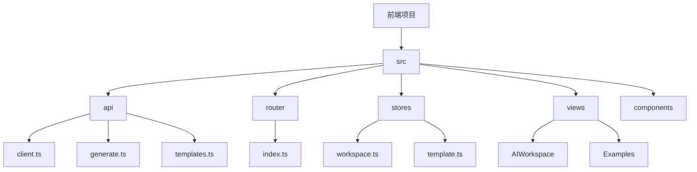
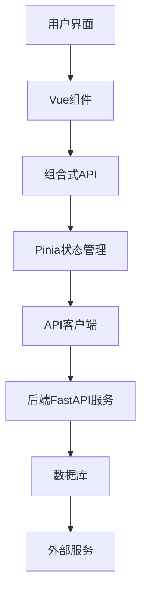
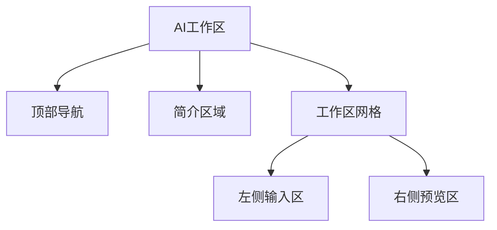
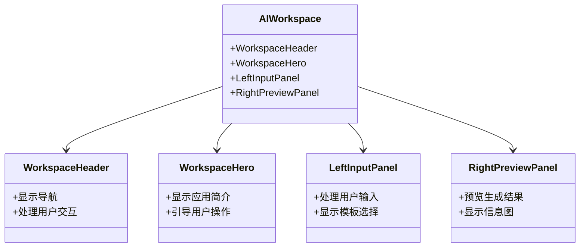
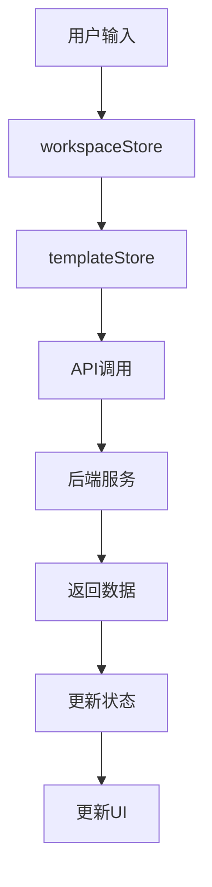
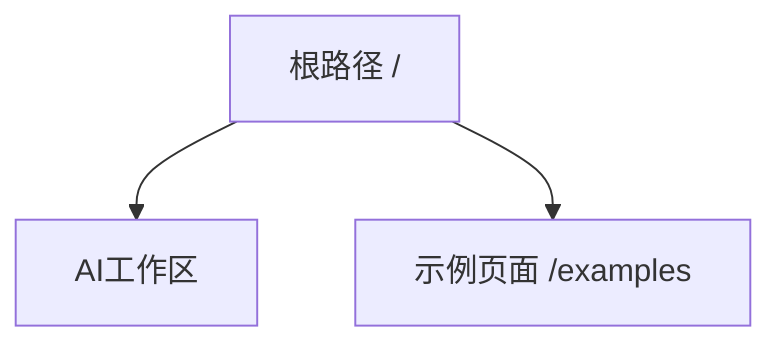
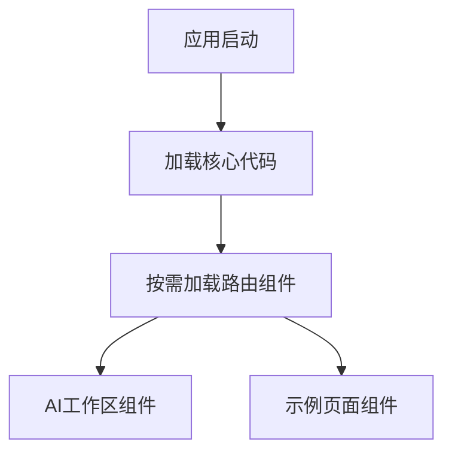

# 前端架构

<cite>
**本文档中引用的文件**  
- [main.ts](file://frontend/src/main.ts)
- [App.vue](file://frontend/src/App.vue)
- [index.ts](file://frontend/src/router/index.ts)
- [package.json](file://frontend/package.json)
- [vite.config.ts](file://frontend/vite.config.ts)
- [workspace.ts](file://frontend/src/stores/workspace.ts)
- [template.ts](file://frontend/src/stores/template.ts)
- [client.ts](file://frontend/src/api/client.ts)
- [generate.ts](file://frontend/src/api/generate.ts)
- [templates.ts](file://frontend/src/api/templates.ts)
- [AIWorkspace.vue](file://frontend/src/views/AIWorkspace/AIWorkspace.vue)
- [Dockerfile](file://frontend/Dockerfile)
- [nginx.conf](file://frontend/nginx.conf)
</cite>

## 目录
1. [简介](#简介)
2. [项目结构](#项目结构)
3. [核心组件](#核心组件)
4. [架构概述](#架构概述)
5. [详细组件分析](#详细组件分析)
6. [依赖分析](#依赖分析)
7. [性能考虑](#性能考虑)
8. [故障排除指南](#故障排除指南)
9. [结论](#结论)

## 简介
本文档详细描述了基于Vue 3的前端应用架构，涵盖Vue 3组合式API的使用模式、组件化架构设计、Pinia状态管理实现、前端路由配置、与后端FastAPI服务的集成机制、Docker容器化部署中的Nginx配置，以及技术选型和性能优化策略。

## 项目结构
前端项目采用模块化结构，主要包含以下目录：
- `src/api`：API客户端和接口定义
- `src/router`：路由配置
- `src/stores`：Pinia状态管理
- `src/views`：页面视图组件
- `src/components`：可复用组件



**Diagram sources**
- [frontend/src/api/client.ts](file://frontend/src/api/client.ts)
- [frontend/src/router/index.ts](file://frontend/src/router/index.ts)
- [frontend/src/stores/workspace.ts](file://frontend/src/stores/workspace.ts)
- [frontend/src/views/AIWorkspace/AIWorkspace.vue](file://frontend/src/views/AIWorkspace/AIWorkspace.vue)

**Section sources**
- [frontend/src/api/client.ts](file://frontend/src/api/client.ts)
- [frontend/src/router/index.ts](file://frontend/src/router/index.ts)
- [frontend/src/stores/workspace.ts](file://frontend/src/stores/workspace.ts)
- [frontend/src/views/AIWorkspace/AIWorkspace.vue](file://frontend/src/views/AIWorkspace/AIWorkspace.vue)

## 核心组件
前端应用的核心组件包括：
- **AI工作区**：主要用户界面，包含输入面板和预览面板
- **示例页面**：展示预设示例
- **状态管理**：使用Pinia管理应用状态
- **API客户端**：使用axios与后端服务通信

**Section sources**
- [frontend/src/views/AIWorkspace/AIWorkspace.vue](file://frontend/src/views/AIWorkspace/AIWorkspace.vue)
- [frontend/src/stores/workspace.ts](file://frontend/src/stores/workspace.ts)
- [frontend/src/api/client.ts](file://frontend/src/api/client.ts)

## 架构概述
应用采用Vue 3组合式API和Pinia状态管理，通过Vue Router实现路由导航，使用axios与后端FastAPI服务进行RESTful API通信。



**Diagram sources**
- [frontend/src/main.ts](file://frontend/src/main.ts)
- [frontend/src/stores/workspace.ts](file://frontend/src/stores/workspace.ts)
- [frontend/src/api/client.ts](file://frontend/src/api/client.ts)

## 详细组件分析

### AI工作区分析
AI工作区是应用的主要界面，采用网格布局，左侧为输入面板，右侧为预览面板。



**Diagram sources**
- [frontend/src/views/AIWorkspace/AIWorkspace.vue](file://frontend/src/views/AIWorkspace/AIWorkspace.vue)

#### 组件化架构
应用采用组件化架构，将UI分解为可复用的组件。



**Diagram sources**
- [frontend/src/views/AIWorkspace/AIWorkspace.vue](file://frontend/src/views/AIWorkspace/AIWorkspace.vue)
- [frontend/src/views/AIWorkspace/components/WorkspaceHeader.vue](file://frontend/src/views/AIWorkspace/components/WorkspaceHeader.vue)
- [frontend/src/views/AIWorkspace/components/WorkspaceHero.vue](file://frontend/src/views/AIWorkspace/components/WorkspaceHero.vue)
- [frontend/src/views/AIWorkspace/components/LeftInputPanel.vue](file://frontend/src/views/AIWorkspace/components/LeftInputPanel.vue)
- [frontend/src/views/AIWorkspace/components/RightPreviewPanel.vue](file://frontend/src/views/AIWorkspace/components/RightPreviewPanel.vue)

#### 状态流分析
应用使用Pinia进行状态管理，实现跨组件的状态共享。



**Diagram sources**
- [frontend/src/stores/workspace.ts](file://frontend/src/stores/workspace.ts)
- [frontend/src/stores/template.ts](file://frontend/src/stores/template.ts)

**Section sources**
- [frontend/src/stores/workspace.ts](file://frontend/src/stores/workspace.ts)
- [frontend/src/stores/template.ts](file://frontend/src/stores/template.ts)

### 路由配置分析
应用使用Vue Router进行路由管理，支持history模式。



**Diagram sources**
- [frontend/src/router/index.ts](file://frontend/src/router/index.ts)

**Section sources**
- [frontend/src/router/index.ts](file://frontend/src/router/index.ts)

## 依赖分析
应用依赖于多个第三方库和内部模块。

```mermaid
graph TD
A[前端应用] --> B[Vue 3]
A --> C[Pinia]
A --> D[Vue Router]
A --> E[Ant Design Vue]
A --> F[axios]
A --> G[Lucide Vue Next]
A --> H[@antv/infographic]
```

**Diagram sources**
- [frontend/package.json](file://frontend/package.json)

**Section sources**
- [frontend/package.json](file://frontend/package.json)

## 性能考虑
应用采用多种性能优化策略：

### 代码分割和懒加载
路由组件采用懒加载，减少初始加载时间。



**Diagram sources**
- [frontend/src/router/index.ts](file://frontend/src/router/index.ts)

### 技术选型决策
选择Vue 3而非React的原因包括：
- 更简单的组合式API
- 更好的TypeScript支持
- 更小的包体积
- 更活跃的中文社区

Vite构建工具的优势：
- 快速的冷启动
- 即时热模块替换
- 优化的构建输出
- 内置TypeScript支持

**Section sources**
- [frontend/package.json](file://frontend/package.json)
- [frontend/vite.config.ts](file://frontend/vite.config.ts)

## 故障排除指南
常见问题及解决方案：

### API通信问题
- 检查后端服务是否运行
- 检查代理配置
- 检查网络连接

### 状态管理问题
- 检查Pinia store的初始化
- 检查状态更新逻辑
- 检查组件间的通信

**Section sources**
- [frontend/src/api/client.ts](file://frontend/src/api/client.ts)
- [frontend/src/stores/workspace.ts](file://frontend/src/stores/workspace.ts)

## 结论
本文档详细描述了基于Vue 3的前端应用架构，涵盖了组件化设计、状态管理、路由配置、API集成、部署配置等方面。应用采用现代化的前端技术栈，具有良好的可维护性和扩展性。