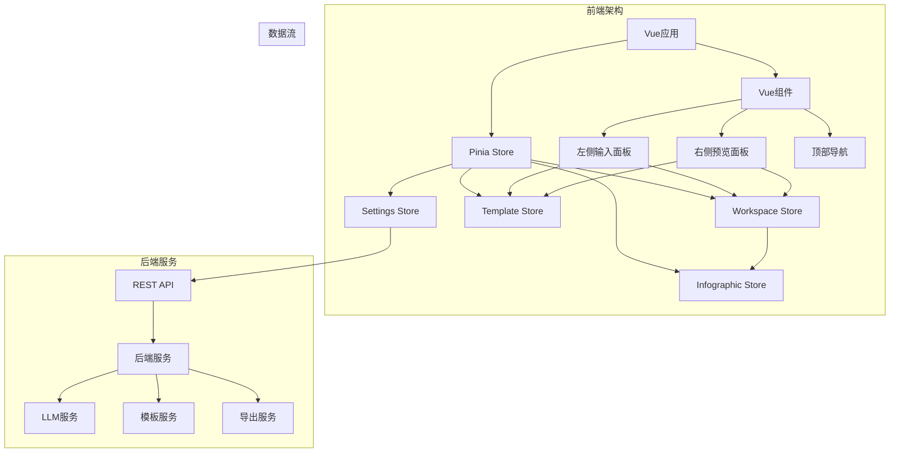
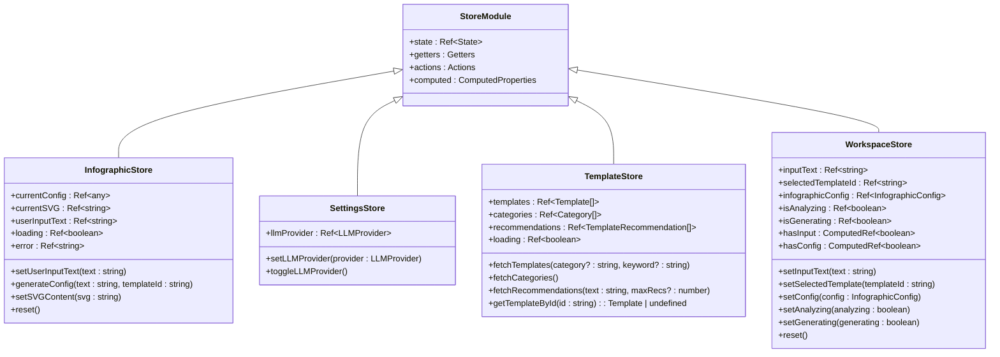
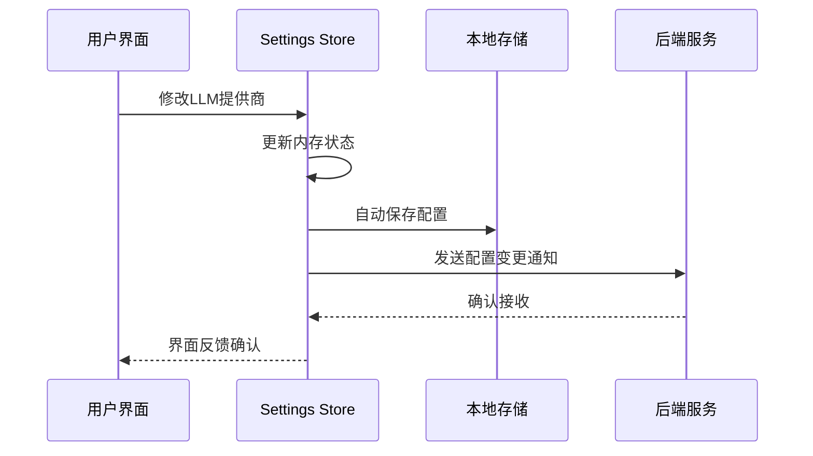
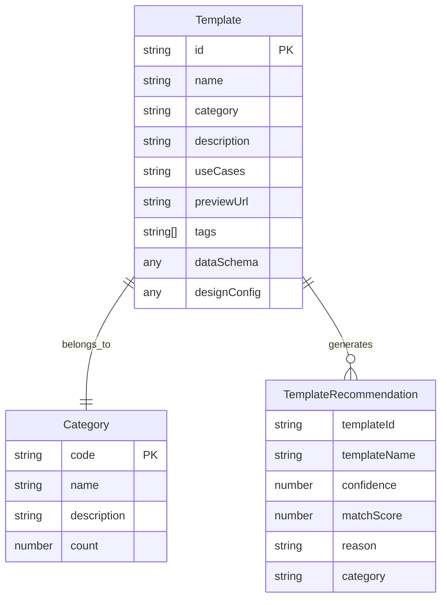
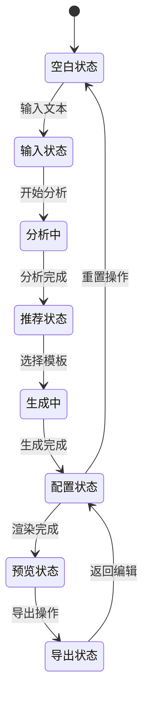
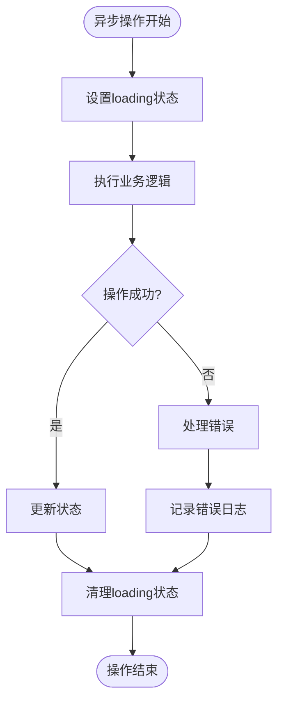
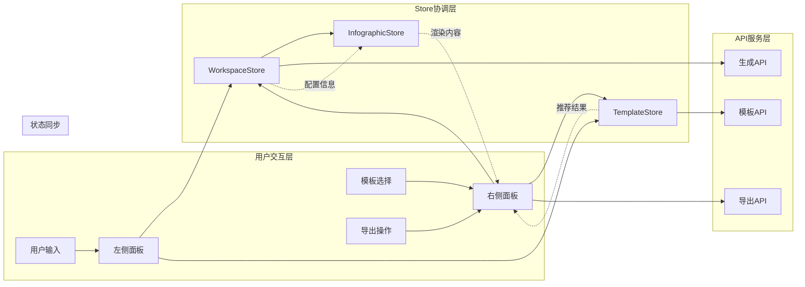
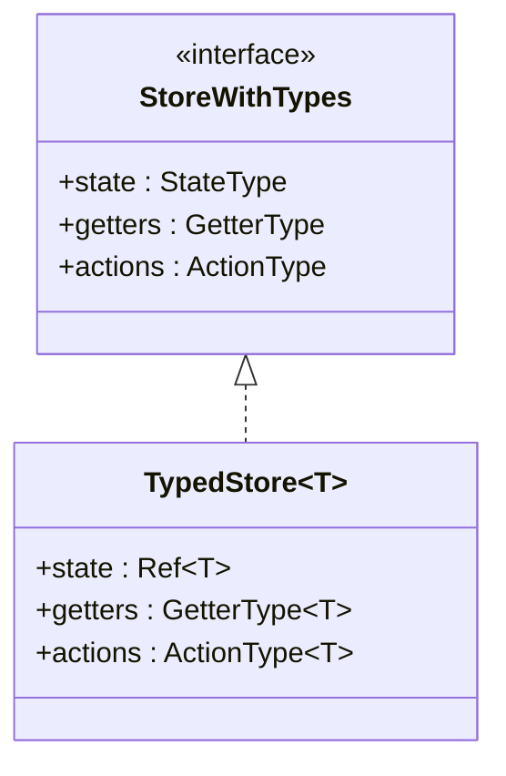

# Store设计与职责划分

<cite>
**本文档引用的文件**
- [frontend/src/stores/infographic.ts](file://frontend/src/stores/infographic.ts)
- [frontend/src/stores/settings.ts](file://frontend/src/stores/settings.ts)
- [frontend/src/stores/template.ts](file://frontend/src/stores/template.ts)
- [frontend/src/stores/workspace.ts](file://frontend/src/stores/workspace.ts)
- [frontend/src/views/AIWorkspace/AIWorkspace.vue](file://frontend/src/views/AIWorkspace/AIWorkspace.vue)
- [frontend/src/views/AIWorkspace/components/LeftInputPanel.vue](file://frontend/src/views/AIWorkspace/components/LeftInputPanel.vue)
- [frontend/src/views/AIWorkspace/components/RightPreviewPanel.vue](file://frontend/src/views/AIWorkspace/components/RightPreviewPanel.vue)
- [frontend/src/api/templates.ts](file://frontend/src/api/templates.ts)
- [frontend/src/api/generate.ts](file://frontend/src/api/generate.ts)
- [frontend/src/main.ts](file://frontend/src/main.ts)
</cite>

## 目录
1. [引言](#引言)
2. [项目架构概览](#项目架构概览)
3. [Store设计理念](#store设计理念)
4. [核心Store模块详解](#核心store模块详解)
5. [状态管理模式](#状态管理模式)
6. [模块间依赖关系](#模块间依赖关系)
7. [类型安全实现](#类型安全实现)
8. [最佳实践与优化建议](#最佳实践与优化建议)
9. [总结](#总结)

## 引言

本文档深入阐述了基于Pinia的状态管理系统设计，该系统专为AI信息图表生成平台构建。该架构采用模块化设计原则，将不同功能域分离到独立的store模块中，实现了清晰的职责划分和高效的模块间协作。

## 项目架构概览

系统采用前后端分离架构，前端使用Vue 3 + Pinia构建状态管理，后端提供RESTful API服务。整体架构遵循单一职责原则，每个store模块负责特定的功能领域。



**图表来源**
- [frontend/src/main.ts](file://frontend/src/main.ts#L1-L17)
- [frontend/src/stores/infographic.ts](file://frontend/src/stores/infographic.ts#L1-L71)
- [frontend/src/stores/settings.ts](file://frontend/src/stores/settings.ts#L1-L77)
- [frontend/src/stores/template.ts](file://frontend/src/stores/template.ts#L1-L102)
- [frontend/src/stores/workspace.ts](file://frontend/src/stores/workspace.ts#L1-L74)

## Store设计理念

### 单一职责原则

每个store模块都专注于特定的功能领域，避免功能耦合：

- **Infographic Store**: 专门管理信息图的配置和渲染状态
- **Settings Store**: 处理用户偏好设置和全局配置
- **Template Store**: 管理模板数据、分类和推荐算法
- **Workspace Store**: 协调AI工作区的整体状态

### 状态与行为分离

Pinia store采用清晰的状态与行为分离模式：



**图表来源**
- [frontend/src/stores/infographic.ts](file://frontend/src/stores/infographic.ts#L8-L69)
- [frontend/src/stores/settings.ts](file://frontend/src/stores/settings.ts#L43-L76)
- [frontend/src/stores/template.ts](file://frontend/src/stores/template.ts#L36-L101)
- [frontend/src/stores/workspace.ts](file://frontend/src/stores/workspace.ts#L14-L73)

## 核心Store模块详解

### Infographic Store：信息图配置管理

Infographic Store负责管理信息图的核心配置和渲染状态，是整个系统的核心状态管理中心之一。

#### 核心状态定义

| 状态属性 | 类型 | 描述 | 默认值 |
|---------|------|------|--------|
| currentConfig | Ref\<any\> | 当前信息图配置对象 | null |
| currentSVG | Ref\<string\> | 渲染后的SVG字符串 | '' |
| userInputText | Ref\<string\> | 用户输入的原始文本 | '' |
| loading | Ref\<boolean\> | 加载状态指示器 | false |
| error | Ref\<string \| null\> | 错误信息存储 | null |

#### 主要功能模块

**用户输入管理**
- `setUserInputText(text: string)`: 设置用户输入文本，支持实时编辑
- 自动触发输入验证和状态同步

**配置生成流程**
- `generateConfig(text: string, templateId: string)`: 异步生成信息图配置
- 集成LLM服务进行智能内容解析
- 支持错误处理和状态回滚

**渲染状态控制**
- `setSVGContent(svg: string)`: 设置渲染后的SVG内容
- 支持多种渲染格式和质量控制

**状态重置机制**
- `reset()`: 完全重置所有状态到初始状态
- 用于新项目创建和错误恢复场景

**节来源**
- [frontend/src/stores/infographic.ts](file://frontend/src/stores/infographic.ts#L8-L71)

### Settings Store：用户偏好配置

Settings Store管理用户的全局配置选项，特别是LLM提供商的选择，体现了配置驱动的设计思想。

#### 配置持久化策略



**图表来源**
- [frontend/src/stores/settings.ts](file://frontend/src/stores/settings.ts#L43-L76)

#### 核心配置项

| 配置项 | 类型 | 默认值 | 描述 |
|-------|------|--------|------|
| llmProvider | LLMProvider | 'system' | LLM提供商选择 |
| STORAGE_KEY | string | 'user_settings' | 存储键名 |

#### 配置管理功能

**动态提供商切换**
- `setLLMProvider(provider: LLMProvider)`: 设置指定的LLM提供商
- `toggleLLMProvider()`: 在系统LLM和Dify工作流之间切换

**自动持久化**
- 使用Vue的`watch`监听配置变化
- 自动保存到localStorage，确保配置持久性
- 提供降级机制处理存储异常

**节来源**
- [frontend/src/stores/settings.ts](file://frontend/src/stores/settings.ts#L1-L77)

### Template Store：模板数据管理

Template Store是模板系统的中央控制器，负责模板数据的获取、管理和推荐算法的执行。

#### 数据模型设计



**图表来源**
- [frontend/src/stores/template.ts](file://frontend/src/stores/template.ts#L8-L34)

#### 核心功能模块

**模板数据获取**
- `fetchTemplates(category?: string, keyword?: string)`: 异步获取模板列表
- 支持分类筛选和关键词搜索
- 实现分页加载和缓存机制

**分类管理**
- `fetchCategories()`: 获取模板分类列表
- 自动生成分类统计信息
- 支持动态分类更新

**智能推荐**
- `fetchRecommendations(text: string, maxRecommendations?: number)`: AI驱动的模板推荐
- 基于语义匹配的智能排序
- 返回详细的匹配理由和置信度

**模板查询**
- `getTemplateById(id: string)`: 快速查找特定模板
- 内置缓存机制提升查询性能

**节来源**
- [frontend/src/stores/template.ts](file://frontend/src/stores/template.ts#L1-L102)

### Workspace Store：工作区协调器

Workspace Store作为AI工作区的协调中心，管理整个生成流程的状态流转。

#### 状态流转图



**图表来源**
- [frontend/src/stores/workspace.ts](file://frontend/src/stores/workspace.ts#L14-L73)

#### 核心状态属性

| 状态属性 | 类型 | 描述 | 计算属性 |
|---------|------|------|----------|
| inputText | Ref\<string\> | 用户输入文本 | hasInput |
| selectedTemplateId | Ref\<string\> | 选中的模板ID | - |
| infographicConfig | Ref\<InfographicConfig\> | 信息图配置 | hasConfig |
| isAnalyzing | Ref\<boolean\> | 分析状态 | - |
| isGenerating | Ref\<boolean\> | 生成状态 | - |

#### 工作流程控制

**输入管理**
- `setInputText(text: string)`: 设置用户输入文本
- 自动触发输入验证和状态同步

**模板选择**
- `setSelectedTemplate(templateId: string)`: 选择指定模板
- 触发配置重新生成流程

**配置管理**
- `setConfig(config: InfographicConfig)`: 设置完整配置
- 支持配置验证和错误处理

**状态监控**
- `setAnalyzing(analyzing: boolean)`: 控制分析状态
- `setGenerating(generating: boolean)`: 控制生成状态
- 提供UI状态反馈

**节来源**
- [frontend/src/stores/workspace.ts](file://frontend/src/stores/workspace.ts#L1-L74)

## 状态管理模式

### 同步状态更新

Pinia store采用Vue 3的响应式系统，确保状态变更的自动传播：

```typescript
// 同步状态更新示例
function setInputText(text: string) {
  inputText.value = text
}

// 计算属性自动响应状态变化
const hasInput = computed(() => inputText.value.trim().length > 0)
```

### 异步业务逻辑处理

各store模块都精心设计了异步操作的处理机制：



**图表来源**
- [frontend/src/stores/infographic.ts](file://frontend/src/stores/infographic.ts#L25-L40)
- [frontend/src/stores/template.ts](file://frontend/src/stores/template.ts#L44-L83)

### 错误处理策略

每个store模块都实现了完善的错误处理机制：

- **统一错误捕获**: 所有异步操作都包含try-catch块
- **错误状态管理**: 将错误信息存储在专用的error状态中
- **用户友好的错误提示**: 通过message组件提供即时反馈
- **错误恢复机制**: 支持状态重置和重新尝试

## 模块间依赖关系

### 数据流向分析



**图表来源**
- [frontend/src/views/AIWorkspace/components/LeftInputPanel.vue](file://frontend/src/views/AIWorkspace/components/LeftInputPanel.vue#L52-L58)
- [frontend/src/views/AIWorkspace/components/RightPreviewPanel.vue](file://frontend/src/views/AIWorkspace/components/RightPreviewPanel.vue#L127-L160)

### 模块协作模式

**Template Store → Infographic Store 的配置传递**

Template Store为Infographic Store提供初始配置的关键机制：

```typescript
// LeftInputPanel.vue 中的配置传递
async function handleAnalyze() {
  // 从TemplateStore获取推荐结果
  const recommendations = templateStore.recommendations
  
  // 更新WorkspaceStore配置
  workspaceStore.setConfig(config)
  
  // 自动触发Infographic Store的渲染流程
}
```

**Settings Store → Generate API 的配置注入**

Settings Store通过API参数向后端服务传递用户偏好：

```typescript
// LeftInputPanel.vue 中的LLM提供商传递
const response = await generateAPI.extractData(
  inputText.value,
  templateId,
  settingsStore.llmProvider  // 传递用户选择的LLM提供商
)
```

### 数据共享机制

**响应式状态共享**
- 使用Vue的响应式系统实现跨模块的状态同步
- 通过计算属性自动响应状态变化
- 避免手动订阅和解订阅的复杂性

**事件驱动通信**
- 利用Pinia的响应式特性实现隐式通信
- 避免显式的事件总线模式
- 确保状态变更的可追踪性

**节来源**
- [frontend/src/views/AIWorkspace/components/LeftInputPanel.vue](file://frontend/src/views/AIWorkspace/components/LeftInputPanel.vue#L81-L126)
- [frontend/src/views/AIWorkspace/components/RightPreviewPanel.vue](file://frontend/src/views/AIWorkspace/components/RightPreviewPanel.vue#L242-L268)

## 类型安全实现

### TypeScript集成

系统全面采用TypeScript增强类型安全：

```typescript
// infographics.ts 中的类型定义
export interface InfographicConfig {
  template?: string
  design?: any
  data: any
  themeConfig?: any
}

// template.ts 中的接口定义
export interface Template {
  id: string
  name: string
  category: string
  description?: string
  useCases?: string
  previewUrl?: string
  tags?: string[]
  dataSchema: any
  designConfig: any
}
```

### 泛型约束

```typescript
// settings.ts 中的类型约束
export type LLMProvider = 'system' | 'dify'

// template.ts 中的泛型使用
function getTemplateById<T extends Template>(id: string): T | undefined {
  return templates.value.find(t => t.id === id) as T | undefined
}
```

### 类型推断优化



**图表来源**
- [frontend/src/stores/infographic.ts](file://frontend/src/stores/infographic.ts#L8-L13)
- [frontend/src/stores/template.ts](file://frontend/src/stores/template.ts#L8-L34)

## 最佳实践与优化建议

### 性能优化策略

**状态分割优化**
- 将大型状态对象拆分为更小的独立状态
- 避免不必要的状态重建
- 使用`shallowRef`处理大型不可变对象

**计算属性缓存**
```typescript
// 使用Vue的computed实现智能缓存
const hasInput = computed(() => workspaceStore.hasInput)
const currentTemplateName = computed(() => {
  const current = recommendations.value.find(r => r.templateId === selectedTemplateId.value)
  return current?.templateName || '选择模板'
})
```

**异步操作优化**
- 实现请求去重机制
- 添加防抖和节流控制
- 使用Promise.all并发处理多个请求

### 可维护性改进

**模块化设计原则**
- 每个store模块保持独立的功能边界
- 避免store间的直接依赖
- 通过API层实现模块间通信

**错误处理标准化**
- 统一的错误处理模式
- 结构化的错误信息格式
- 用户友好的错误提示机制

**测试友好设计**
- 清晰的action和getter分离
- 独立的单元测试能力
- 模拟依赖的便捷性

### 扩展性考虑

**插件化架构**
- 支持store模块的动态注册
- 可插拔的功能扩展机制
- 第三方store模块的集成能力

**配置驱动开发**
- 将可配置的参数抽象为配置项
- 支持运行时配置修改
- 环境差异的优雅处理

## 总结

本文档详细阐述了基于Pinia的状态管理系统设计，展示了如何通过模块化架构实现清晰的职责划分和高效的模块协作。该设计具有以下核心优势：

**架构优势**
- 单一职责原则确保了模块的内聚性和低耦合性
- 响应式状态管理提供了流畅的用户体验
- 类型安全的实现增强了代码的可靠性和可维护性

**功能特性**
- 智能模板推荐提升了用户体验
- 灵活的工作流程支持复杂的生成场景
- 完善的错误处理确保系统的稳定性

**技术价值**
- 基于Vue 3和Pinia的最佳实践
- TypeScript的全面类型安全保障
- 模块化设计的可扩展性基础

这种设计模式不仅适用于当前的AI信息图表生成平台，也为类似的复杂前端应用提供了可参考的架构范式。通过合理的模块划分、清晰的职责边界和完善的类型安全，系统能够支持持续的功能扩展和性能优化。