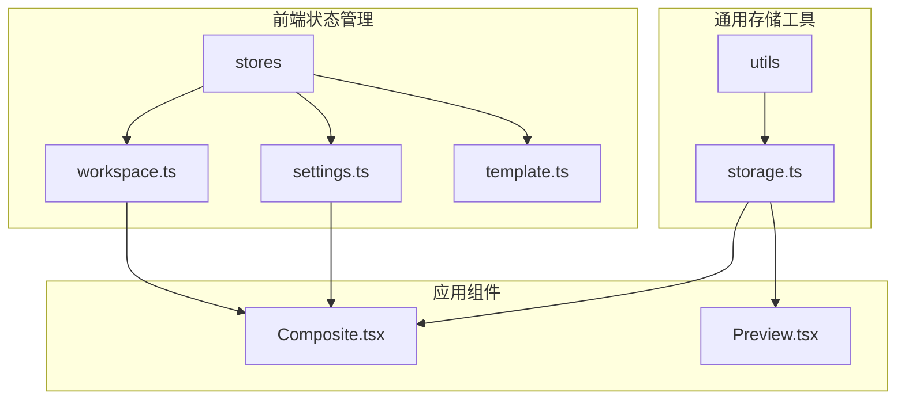
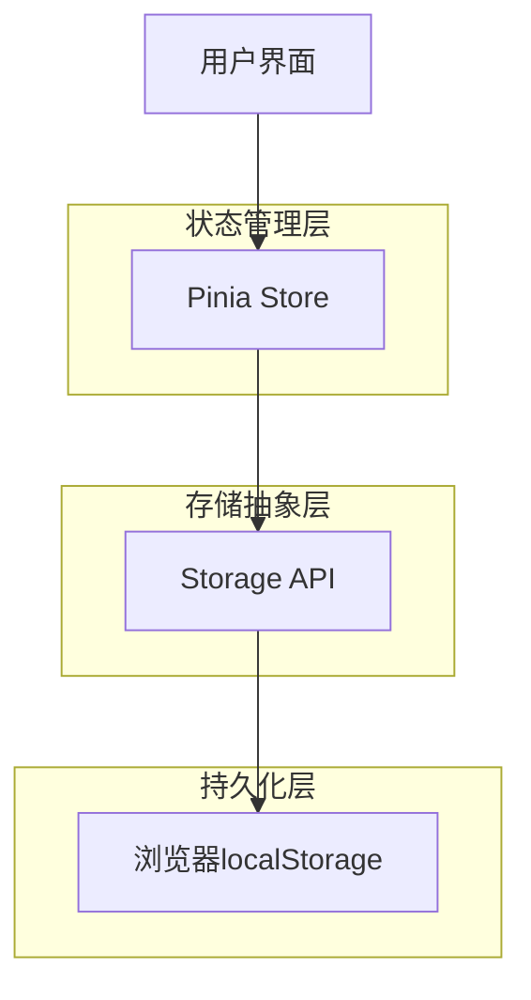
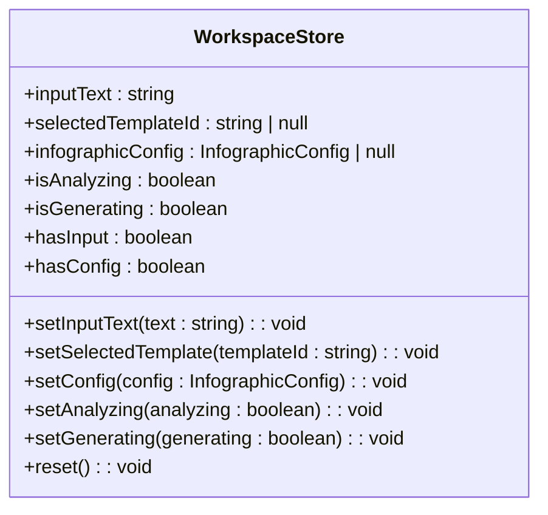
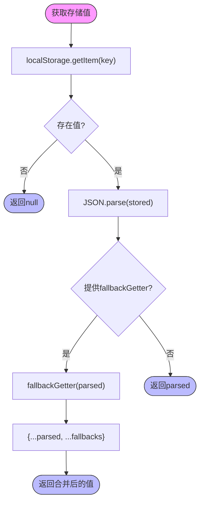
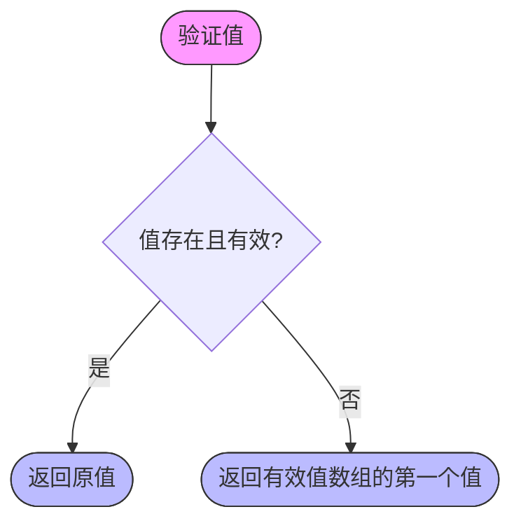
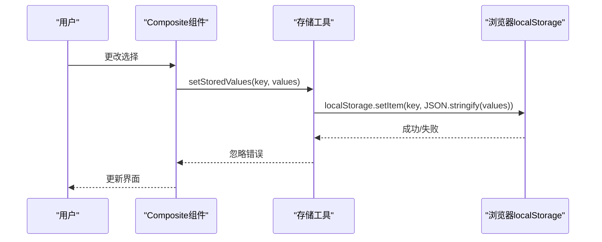
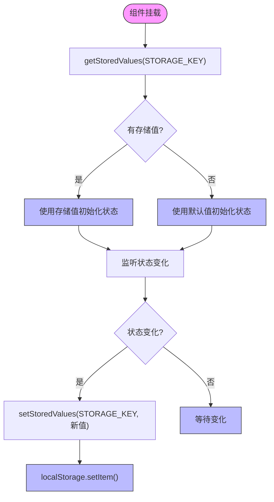
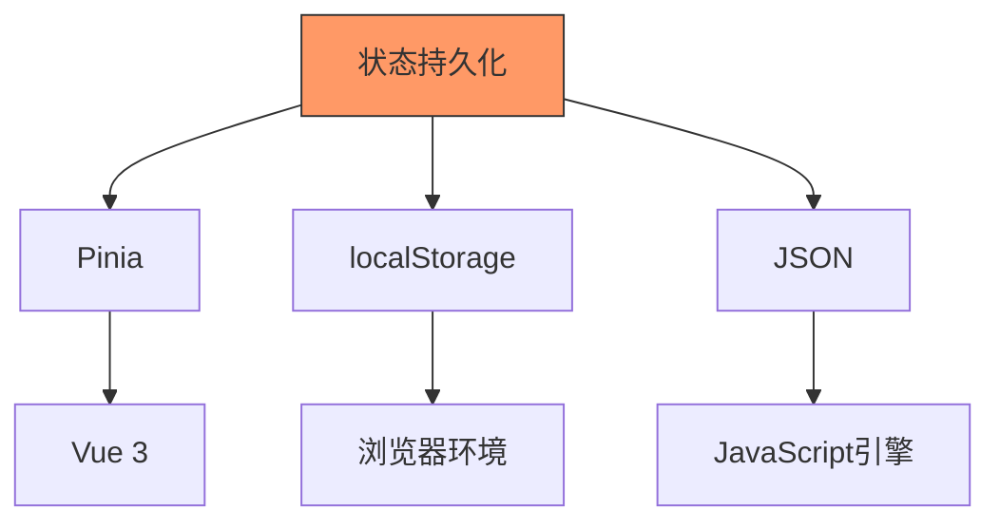

# 状态持久化机制

<cite>
**本文档引用的文件**
- [storage.ts](file://antv_infographic/infographic/dev/src/utils/storage.ts)
- [settings.ts](file://frontend/src/stores/settings.ts)
- [workspace.ts](file://frontend/src/stores/workspace.ts)
- [Composite.tsx](file://antv_infographic/infographic/dev/src/Composite.tsx)
- [Preview.tsx](file://antv_infographic/infographic/dev/src/Preview.tsx)
</cite>

## 目录
1. [引言](#引言)
2. [项目结构](#项目结构)
3. [核心组件](#核心组件)
4. [架构概述](#架构概述)
5. [详细组件分析](#详细组件分析)
6. [依赖分析](#依赖分析)
7. [性能考虑](#性能考虑)
8. [故障排除指南](#故障排除指南)
9. [结论](#结论)

## 引言
本文档详细说明了系统中的状态持久化策略和实现机制。通过分析代码库，我们将探讨如何使用浏览器Storage API在页面刷新后恢复关键状态，如未保存的作品配置和用户设置。文档将解释持久化范围的选择标准、实现细节、性能影响和安全考虑。

## 项目结构
该项目采用模块化结构，前端状态管理主要集中在`frontend/src/stores`目录中，而通用存储工具位于`antv_infographic/infographic/dev/src/utils`目录。这种分离设计使得存储逻辑既可被特定应用使用，也可作为通用工具在不同组件间共享。



**图示来源**
- [settings.ts](file://frontend/src/stores/settings.ts)
- [workspace.ts](file://frontend/src/stores/workspace.ts)
- [storage.ts](file://antv_infographic/infographic/dev/src/utils/storage.ts)
- [Composite.tsx](file://antv_infographic/infographic/dev/src/Composite.tsx)
- [Preview.tsx](file://antv_infographic/infographic/dev/src/Preview.tsx)

**本节来源**
- [frontend/src/stores](file://frontend/src/stores)
- [antv_infographic/infographic/dev/src/utils](file://antv_infographic/infographic/dev/src/utils)

## 核心组件
系统的核心持久化机制由两个主要部分组成：通用存储工具和具体的状态管理模块。通用存储工具提供基础的localStorage操作，而状态管理模块则定义了特定于应用的状态结构和持久化策略。

**本节来源**
- [storage.ts](file://antv_infographic/infographic/dev/src/utils/storage.ts)
- [settings.ts](file://frontend/src/stores/settings.ts)

## 架构概述
系统的状态持久化架构采用分层设计，上层是基于Pinia的状态管理Store，下层是通用的localStorage工具函数。这种设计实现了关注点分离，使得状态管理逻辑与存储实现细节解耦。



**图示来源**
- [settings.ts](file://frontend/src/stores/settings.ts)
- [storage.ts](file://antv_infographic/infographic/dev/src/utils/storage.ts)

## 详细组件分析

### 状态管理Store分析
系统使用Pinia作为状态管理库，为不同类型的状态创建了专门的Store。每个Store负责管理特定领域的状态，并决定哪些状态需要持久化。

#### 用户设置Store
用户设置Store管理全局配置，如LLM提供商选择。该Store在初始化时从localStorage加载设置，并在设置变化时自动保存到localStorage。

```mermaid
classDiagram
class UserSettingsStore {
+llmProvider : LLMProvider
-loadSettings() : UserSettings
-saveSettings(settings : UserSettings) : void
+setLLMProvider(provider : LLMProvider) : void
+toggleLLMProvider() : void
}
UserSettingsStore --> "localStorage" : 读取/写入
```

**图示来源**
- [settings.ts](file://frontend/src/stores/settings.ts#L8-L77)

#### 工作区状态Store
工作区状态Store管理用户在创作过程中的临时状态，如输入文本、选中的模板和信息图配置。与用户设置不同，工作区状态Store本身不直接处理持久化，而是由上层组件决定何时保存状态。



**图示来源**
- [workspace.ts](file://frontend/src/stores/workspace.ts#L7-L73)

**本节来源**
- [settings.ts](file://frontend/src/stores/settings.ts)
- [workspace.ts](file://frontend/src/stores/workspace.ts)

### 通用存储工具分析
通用存储工具提供了一组安全的操作localStorage的函数，包括错误处理和数据验证。

#### 存储工具函数
存储工具提供了三个主要函数：`getStoredValues`、`setStoredValues`和`validateOrFallback`。这些函数封装了localStorage的复杂性，提供了更安全、更易用的接口。



**图示来源**
- [storage.ts](file://antv_infographic/infographic/dev/src/utils/storage.ts#L11-L31)

#### 数据验证与回退机制
存储工具包含一个`validateOrFallback`函数，用于验证值的有效性并在值无效时返回默认值。这确保了即使存储的数据已损坏或不再有效，应用仍能正常运行。



**图示来源**
- [storage.ts](file://antv_infographic/infographic/dev/src/utils/storage.ts#L52-L60)

**本节来源**
- [storage.ts](file://antv_infographic/infographic/dev/src/utils/storage.ts)

### 应用组件中的持久化实现
在实际应用组件中，持久化机制被用来保存用户的工作进度和偏好设置。

#### Composite组件中的持久化
Composite组件使用存储工具来保存用户的选择，如结构、项目类型和数据类型。当用户更改选择时，新的值会自动保存到localStorage。



**图示来源**
- [Composite.tsx](file://antv_infographic/infographic/dev/src/Composite.tsx#L167-L167)

#### Preview组件中的持久化
Preview组件在初始化时从localStorage加载之前的设置，并在设置变化时保存新的设置。这确保了用户下次访问时能看到他们上次的配置。



**图示来源**
- [Preview.tsx](file://antv_infographic/infographic/dev/src/Preview.tsx#L86-L94)

**本节来源**
- [Composite.tsx](file://antv_infographic/infographic/dev/src/Composite.tsx)
- [Preview.tsx](file://antv_infographic/infographic/dev/src/Preview.tsx)

## 依赖分析
系统的持久化机制依赖于几个关键的外部和内部组件。主要依赖包括Pinia状态管理库、浏览器localStorage API和JSON序列化/反序列化功能。



**图示来源**
- [package-lock.json](file://frontend/package-lock.json#L2628-L2638)
- [storage.ts](file://antv_infographic/infographic/dev/src/utils/storage.ts)

**本节来源**
- [frontend/package-lock.json](file://frontend/package-lock.json)
- [antv_infographic/infographic/dev/src/utils/storage.ts](file://antv_infographic/infographic/dev/src/utils/storage.ts)

## 性能考虑
状态持久化对性能的影响主要体现在以下几个方面：

1. **同步操作阻塞**：localStorage的读写操作是同步的，可能阻塞主线程，特别是在存储大量数据时。
2. **序列化开销**：每次存储都需要将JavaScript对象序列化为JSON字符串，这在处理复杂对象时可能消耗较多CPU资源。
3. **存储容量限制**：浏览器localStorage通常有5-10MB的限制，需要谨慎管理存储的数据量。

为了最小化性能影响，系统采用了以下策略：
- 在try-catch块中执行存储操作，防止存储错误影响应用正常运行
- 忽略存储错误，确保即使存储失败，应用功能不受影响
- 只存储必要的状态，避免存储大量临时数据

**本节来源**
- [storage.ts](file://antv_infographic/infographic/dev/src/utils/storage.ts)

## 故障排除指南
在使用状态持久化机制时，可能会遇到以下常见问题：

1. **存储空间不足**：当localStorage达到容量限制时，setItem操作会失败。可以通过清理不必要的存储项或使用IndexedDB作为替代方案来解决。
2. **跨域限制**：localStorage受同源策略限制，无法在不同域之间共享数据。
3. **隐私模式**：在浏览器隐私模式下，localStorage可能被禁用或在会话结束后清除。
4. **数据损坏**：如果存储的JSON字符串损坏，parse操作会失败。系统通过try-catch块处理此类错误，并返回null或默认值。

**本节来源**
- [storage.ts](file://antv_infographic/infographic/dev/src/utils/storage.ts)
- [settings.ts](file://frontend/src/stores/settings.ts)

## 结论
该系统的状态持久化机制采用了分层架构设计，通过通用存储工具和特定状态管理Store的结合，实现了灵活而可靠的状态持久化。关键设计特点包括：

1. **关注点分离**：将通用存储逻辑与应用特定状态管理分离，提高了代码的可维护性和可重用性。
2. **错误容忍**：通过try-catch块处理存储操作中的错误，确保即使持久化失败，应用仍能正常运行。
3. **数据验证**：提供验证和回退机制，确保即使存储的数据已过时或无效，应用仍能提供合理的默认行为。
4. **自动同步**：对于用户设置等全局配置，采用自动保存策略，提升用户体验。

这种设计既保证了关键状态的持久化，又避免了过度持久化带来的性能和安全问题，为用户提供了一致且可靠的应用体验。