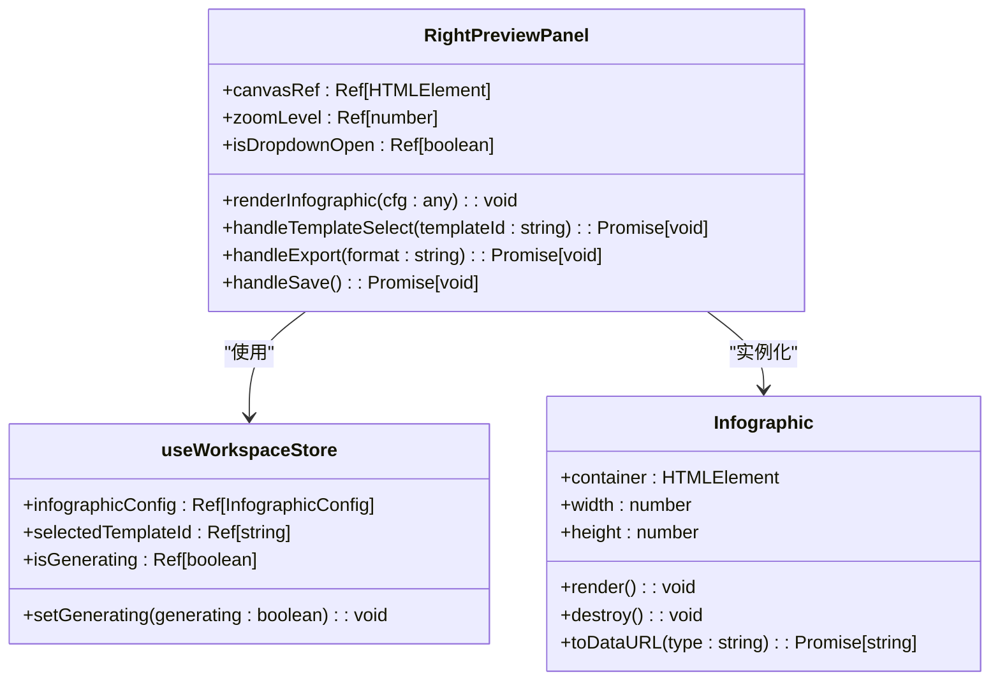

# 状态流与视图更新

<cite>
**本文档引用的文件**
- [infographic.ts](file://frontend/src/stores/infographic.ts)
- [workspace.ts](file://frontend/src/stores/workspace.ts)
- [LeftInputPanel.vue](file://frontend/src/views/AIWorkspace/components/LeftInputPanel.vue)
- [RightPreviewPanel.vue](file://frontend/src/views/AIWorkspace/components/RightPreviewPanel.vue)
- [generate.ts](file://frontend/src/api/generate.ts)
- [client.ts](file://frontend/src/api/client.ts)
- [AIWorkspace.vue](file://frontend/src/views/AIWorkspace/AIWorkspace.vue)
</cite>

## 目录
1. [简介](#简介)
2. [项目结构](#项目结构)
3. [核心组件](#核心组件)
4. [架构概述](#架构概述)
5. [详细组件分析](#详细组件分析)
6. [依赖分析](#依赖分析)
7. [性能考虑](#性能考虑)
8. [故障排除指南](#故障排除指南)
9. [结论](#结论)

## 简介
本文档详细描述了AI工作区中用户操作如何触发状态变更并更新视图的完整流程。重点分析从用户输入到action调用、state更新再到组件响应的全过程。以AI工作区为例，说明用户输入文本后，如何通过store action触发后端API调用，处理响应数据并更新信息图状态。文档包含状态流图，可视化展示数据在store和组件间的流动，并提供代码示例展示组件如何订阅状态以及actions如何处理异步操作和错误边界。

## 项目结构
AI工作区项目采用典型的前后端分离架构，前端使用Vue 3和Pinia进行状态管理，后端提供RESTful API服务。项目结构清晰地分离了关注点，将状态管理、API调用、组件实现和路由配置分别组织在不同的目录中。

```mermaid
graph TD
subgraph "前端"
A[stores] --> B[infographic.ts]
A --> C[workspace.ts]
D[api] --> E[generate.ts]
D --> F[client.ts]
G[views] --> H[AIWorkspace]
H --> I[components]
I --> J[LeftInputPanel.vue]
I --> K[RightPreviewPanel.vue]
end
subgraph "后端"
L[app] --> M[api\v1]
M --> N[generate.py]
M --> O[export.py]
end
J --> E: 触发生成
E --> N: API调用
N --> E: 返回配置
E --> B: 更新状态
B --> K: 视图更新
```

**图表来源**
- [infographic.ts](file://frontend/src/stores/infographic.ts)
- [workspace.ts](file://frontend/src/stores/workspace.ts)
- [LeftInputPanel.vue](file://frontend/src/views/AIWorkspace/components/LeftInputPanel.vue)
- [RightPreviewPanel.vue](file://frontend/src/views/AIWorkspace/components/RightPreviewPanel.vue)

**章节来源**
- [frontend/src/stores](file://frontend/src/stores)
- [frontend/src/api](file://frontend/src/api)
- [frontend/src/views/AIWorkspace](file://frontend/src/views/AIWorkspace)

## 核心组件
本项目的核心组件包括状态管理store、API客户端、输入面板和预览面板。状态管理使用Pinia实现，提供了响应式的状态存储和管理机制。API客户端封装了与后端的通信逻辑，而输入面板和预览面板则构成了用户交互的主要界面。

**章节来源**
- [infographic.ts](file://frontend/src/stores/infographic.ts)
- [workspace.ts](file://frontend/src/stores/workspace.ts)
- [client.ts](file://frontend/src/api/client.ts)

## 架构概述
系统采用MVVM（Model-View-ViewModel）架构模式，通过Pinia store作为ViewModel层，连接View（UI组件）和Model（后端API）。用户在输入面板中输入文本，触发store中的action，该action调用后端API获取数据，然后更新store中的状态，最后由预览面板响应状态变化并重新渲染视图。


**图表来源**
- [LeftInputPanel.vue](file://frontend/src/views/AIWorkspace/components/LeftInputPanel.vue)
- [workspace.ts](file://frontend/src/stores/workspace.ts)
- [generate.ts](file://frontend/src/api/generate.ts)
- [RightPreviewPanel.vue](file://frontend/src/views/AIWorkspace/components/RightPreviewPanel.vue)

## 详细组件分析
本节详细分析AI工作区中的关键组件及其交互方式，重点关注状态流和视图更新机制。

### 输入面板分析
LeftInputPanel组件负责接收用户输入并触发信息图生成流程。它通过计算属性与workspace store进行双向绑定，确保输入状态的同步。


**图表来源**
- [LeftInputPanel.vue](file://frontend/src/views/AIWorkspace/components/LeftInputPanel.vue)

#### 对象关系


**图表来源**
- [LeftInputPanel.vue](file://frontend/src/views/AIWorkspace/components/LeftInputPanel.vue)
- [workspace.ts](file://frontend/src/stores/workspace.ts)
- [generate.ts](file://frontend/src/api/generate.ts)

**章节来源**
- [LeftInputPanel.vue](file://frontend/src/views/AIWorkspace/components/LeftInputPanel.vue)

### 预览面板分析
RightPreviewPanel组件负责显示生成的信息图，并提供模板切换、导出和保存功能。它通过监听store中的配置变化来重新渲染信息图。


**图表来源**
- [RightPreviewPanel.vue](file://frontend/src/views/AIWorkspace/components/RightPreviewPanel.vue)

#### 对象关系


**图表来源**
- [RightPreviewPanel.vue](file://frontend/src/views/AIWorkspace/components/RightPreviewPanel.vue)
- [workspace.ts](file://frontend/src/stores/workspace.ts)

**章节来源**
- [RightPreviewPanel.vue](file://frontend/src/views/AIWorkspace/components/RightPreviewPanel.vue)

### 状态管理分析
Pinia store是整个应用的状态中枢，负责管理应用的核心状态和业务逻辑。workspace store管理用户输入、模板选择和信息图配置，而infographic store则专注于信息图的生成和渲染。


**图表来源**
- [workspace.ts](file://frontend/src/stores/workspace.ts)
- [infographic.ts](file://frontend/src/stores/infographic.ts)

**章节来源**
- [frontend/src/stores](file://frontend/src/stores)

## 依赖分析
项目依赖关系清晰，前端组件通过store和API服务与后端进行通信。Pinia store作为中心枢纽，连接了UI组件和API服务，实现了关注点的分离。


**图表来源**
- [frontend/src/stores](file://frontend/src/stores)
- [frontend/src/api](file://frontend/src/api)
- [frontend/src/views/AIWorkspace](file://frontend/src/views/AIWorkspace)

**章节来源**
- [frontend/src/stores](file://frontend/src/stores)
- [frontend/src/api](file://frontend/src/api)
- [frontend/src/views/AIWorkspace](file://frontend/src/views/AIWorkspace)

## 性能考虑
在状态流和视图更新过程中，需要注意以下性能优化点：
- 使用计算属性（computed properties）避免重复计算
- 在组件卸载时清理定时器和事件监听器
- 使用防抖（debounce）技术减少频繁的API调用
- 合理使用v-if和v-show控制DOM元素的渲染
- 在大规模数据渲染时考虑虚拟滚动技术

## 故障排除指南
当状态流出现问题时，可以按照以下步骤进行排查：
1. 检查store中的状态是否正确更新
2. 验证API调用是否成功并返回预期数据
3. 确认组件是否正确订阅了store状态
4. 检查是否存在异步操作的时序问题
5. 验证错误处理逻辑是否正确捕获和处理异常

**章节来源**
- [infographic.ts](file://frontend/src/stores/infographic.ts)
- [workspace.ts](file://frontend/src/stores/workspace.ts)
- [LeftInputPanel.vue](file://frontend/src/views/AIWorkspace/components/LeftInputPanel.vue)
- [RightPreviewPanel.vue](file://frontend/src/views/AIWorkspace/components/RightPreviewPanel.vue)

## 结论
本文档详细描述了AI工作区中状态流和视图更新的完整流程。通过Pinia store实现的状态管理机制，有效地将用户输入、API调用和视图更新串联起来，形成了一个清晰、可维护的状态流。组件通过订阅store状态来响应数据变化，实现了视图的自动更新。这种架构模式不仅提高了代码的可读性和可维护性，也为未来的功能扩展提供了良好的基础。