# 状态管理

<cite>
**本文档引用的文件**
- [frontend/src/main.ts](file://frontend/src/main.ts)
- [frontend/src/stores/infographic.ts](file://frontend/src/stores/infographic.ts)
- [frontend/src/stores/settings.ts](file://frontend/src/stores/settings.ts)
- [frontend/src/stores/template.ts](file://frontend/src/stores/template.ts)
- [frontend/src/stores/workspace.ts](file://frontend/src/stores/workspace.ts)
- [frontend/src/views/AIWorkspace/components/LeftInputPanel.vue](file://frontend/src/views/AIWorkspace/components/LeftInputPanel.vue)
- [frontend/src/views/AIWorkspace/components/RightPreviewPanel.vue](file://frontend/src/views/AIWorkspace/components/RightPreviewPanel.vue)
- [frontend/src/api/generate.ts](file://frontend/src/api/generate.ts)
- [frontend/src/api/templates.ts](file://frontend/src/api/templates.ts)
- [antv_infographic/infographic/dev/src/utils/storage.ts](file://antv_infographic/infographic/dev/src/utils/storage.ts)
</cite>

## 目录
1. [简介](#简介)
2. [项目架构概览](#项目架构概览)
3. [核心Store模块](#核心store模块)
4. [状态管理模式](#状态管理模式)
5. [Store间依赖关系](#store间依赖关系)
6. [状态流图](#状态流图)
7. [持久化策略](#持久化策略)
8. [错误处理机制](#错误处理机制)
9. [最佳实践](#最佳实践)
10. [总结](#总结)

## 简介

本文档详细描述了基于Pinia的状态管理系统实现，该系统为信息图表生成应用提供了完整的状态管理解决方案。系统采用模块化设计，通过四个核心Store模块（infographic、settings、template、workspace）实现清晰的职责分离和高效的数据流转。

## 项目架构概览

系统采用分层架构设计，状态管理层位于应用的核心位置，为UI层提供统一的状态访问接口。

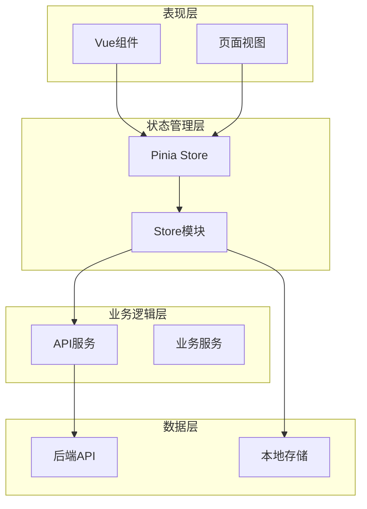

**图表来源**
- [frontend/src/main.ts](file://frontend/src/main.ts#L1-L17)

**章节来源**
- [frontend/src/main.ts](file://frontend/src/main.ts#L1-L17)

## 核心Store模块

### infographic Store - 信息图状态管理

infographic Store负责管理信息图的配置、SVG内容和生成过程的状态。

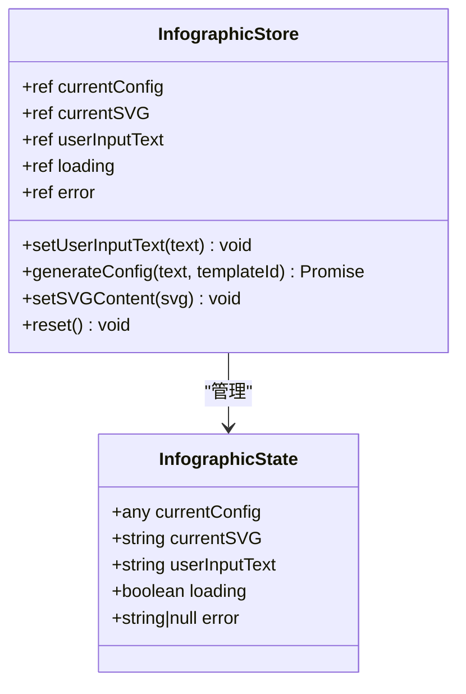

**图表来源**
- [frontend/src/stores/infographic.ts](file://frontend/src/stores/infographic.ts#L8-L70)

#### 核心功能特性：
- **配置管理**：维护当前信息图的配置对象
- **SVG渲染**：存储生成的SVG内容用于实时预览
- **用户输入跟踪**：记录用户的原始输入文本
- **加载状态**：显示生成过程的加载状态
- **错误处理**：捕获和显示生成过程中的错误

**章节来源**
- [frontend/src/stores/infographic.ts](file://frontend/src/stores/infographic.ts#L1-L71)

### settings Store - 用户设置管理

settings Store管理全局用户配置，特别是LLM提供商的选择。

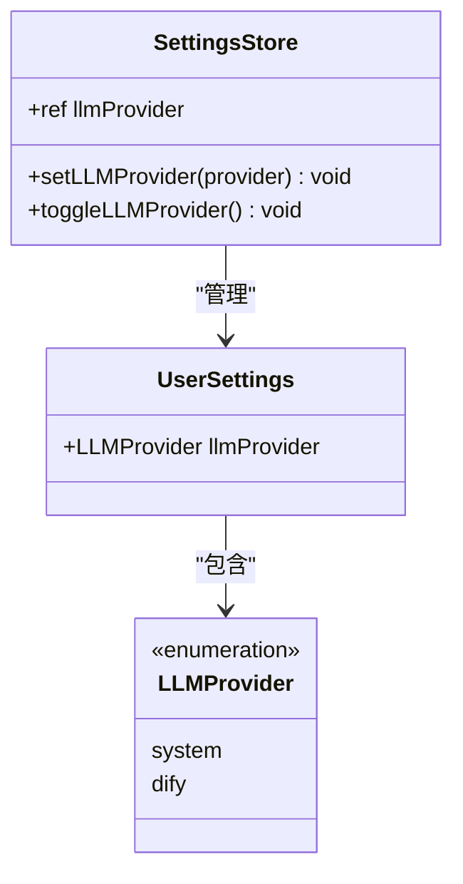

**图表来源**
- [frontend/src/stores/settings.ts](file://frontend/src/stores/settings.ts#L43-L76)

#### 持久化特性：
- **自动保存**：使用watch监听状态变化并自动保存到localStorage
- **默认值**：提供合理的默认配置
- **类型安全**：使用TypeScript确保类型安全

**章节来源**
- [frontend/src/stores/settings.ts](file://frontend/src/stores/settings.ts#L1-L77)

### template Store - 模板状态管理

template Store负责模板数据的获取、缓存和推荐算法的状态管理。

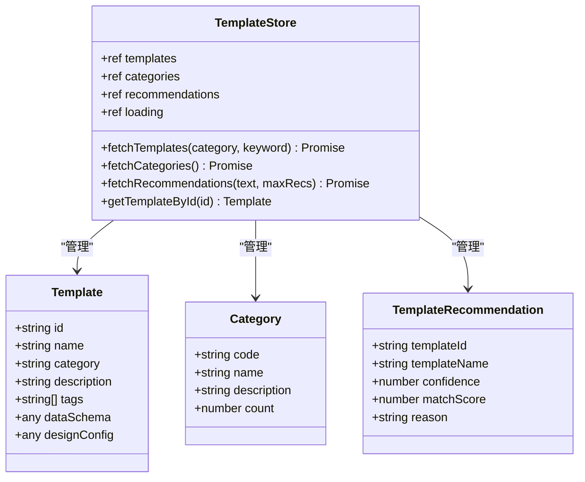

**图表来源**
- [frontend/src/stores/template.ts](file://frontend/src/stores/template.ts#L36-L101)

#### 核心功能：
- **模板获取**：支持按分类和关键词筛选模板
- **分类管理**：维护模板分类体系
- **智能推荐**：集成AI推荐算法结果
- **状态同步**：与后端API保持状态同步

**章节来源**
- [frontend/src/stores/template.ts](file://frontend/src/stores/template.ts#L1-L102)

### workspace Store - 工作区状态管理

workspace Store协调整个工作流程的状态，连接用户输入、模板选择和信息图生成。

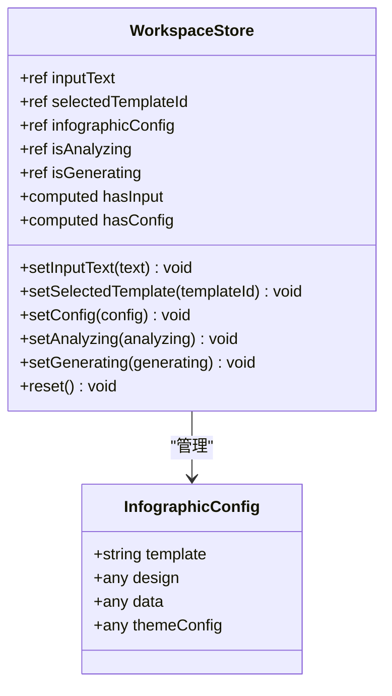

**图表来源**
- [frontend/src/stores/workspace.ts](file://frontend/src/stores/workspace.ts#L14-L73)

#### 计算属性：
- **hasInput**：判断用户是否输入了有效内容
- **hasConfig**：检查是否存在有效的信息图配置

**章节来源**
- [frontend/src/stores/workspace.ts](file://frontend/src/stores/workspace.ts#L1-L74)

## 状态管理模式

### 响应式状态设计

系统采用Vue 3的组合式API和Pinia的响应式特性，确保状态变更能够自动触发UI更新。

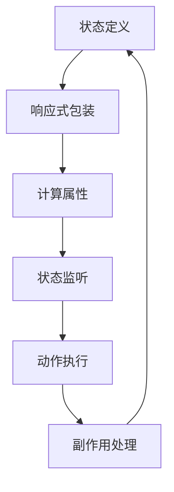

### Getter模式

每个Store都提供了清晰的getter方法来访问状态：

| Store | Getter方法 | 返回类型 | 描述 |
|-------|------------|----------|------|
| infographic | currentConfig | any | 当前信息图配置 |
| infographic | currentSVG | string | 生成的SVG内容 |
| workspace | hasInput | boolean | 是否有有效输入 |
| workspace | hasConfig | boolean | 是否有配置信息 |
| template | templates | Template[] | 模板列表 |
| template | categories | Category[] | 分类列表 |

### Action模式

Action遵循异步处理模式，确保状态变更的原子性和一致性：

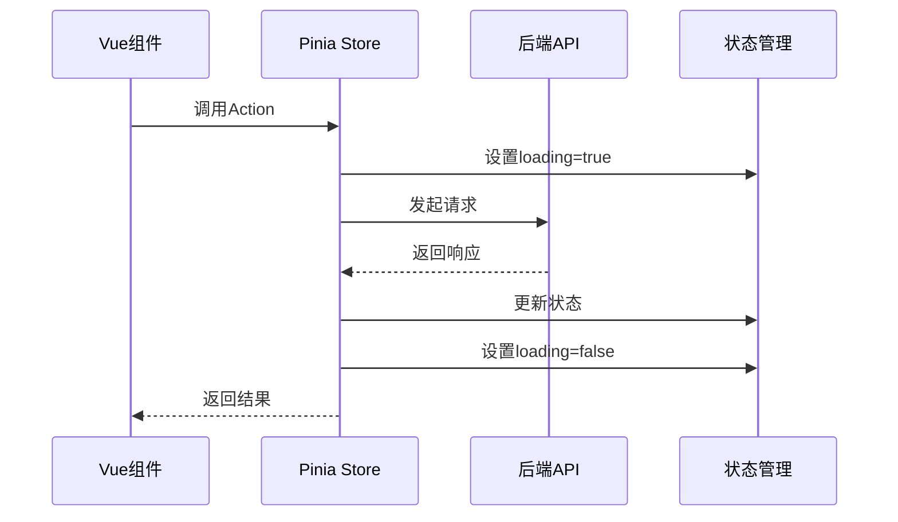

**图表来源**
- [frontend/src/views/AIWorkspace/components/LeftInputPanel.vue](file://frontend/src/views/AIWorkspace/components/LeftInputPanel.vue#L81-L126)

## Store间依赖关系

### 协作模式

各Store之间通过明确的协作模式实现数据共享和状态同步：

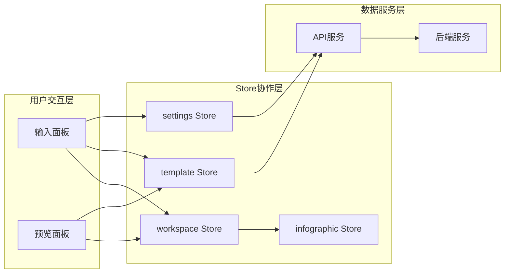

**图表来源**
- [frontend/src/views/AIWorkspace/components/LeftInputPanel.vue](file://frontend/src/views/AIWorkspace/components/LeftInputPanel.vue#L53-L58)
- [frontend/src/views/AIWorkspace/components/RightPreviewPanel.vue](file://frontend/src/views/AIWorkspace/components/RightPreviewPanel.vue#L160-L161)

### infographic与template的协同工作

infographic Store与template Store通过以下机制协同工作：

1. **模板推荐**：template Store提供推荐列表，infographic Store使用推荐的模板ID
2. **配置传递**：生成的信息图配置从template Store的模板定义中获取
3. **状态同步**：两个Store的状态变更相互影响，确保数据一致性

**章节来源**
- [frontend/src/views/AIWorkspace/components/LeftInputPanel.vue](file://frontend/src/views/AIWorkspace/components/LeftInputPanel.vue#L103-L115)

## 状态流图

### 完整状态流转过程

以下是用户从输入内容到生成信息图的完整状态流转过程：

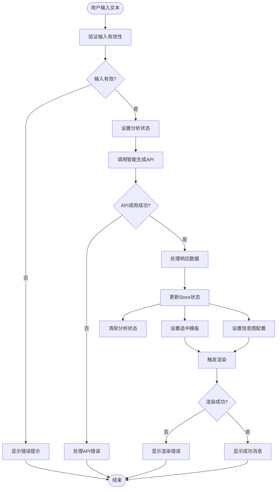

**图表来源**
- [frontend/src/views/AIWorkspace/components/LeftInputPanel.vue](file://frontend/src/views/AIWorkspace/components/LeftInputPanel.vue#L81-L126)
- [frontend/src/views/AIWorkspace/components/RightPreviewPanel.vue](file://frontend/src/views/AIWorkspace/components/RightPreviewPanel.vue#L208-L231)

### 关键状态变更点

1. **输入验证阶段**：workspaceStore.inputText状态更新
2. **API调用阶段**：workspaceStore.isAnalyzing状态更新
3. **数据处理阶段**：templateStore.recommendations状态更新
4. **配置设置阶段**：workspaceStore.infographicConfig状态更新
5. **渲染阶段**：infographicStore.currentConfig状态更新

## 持久化策略

### localStorage持久化

系统实现了多层次的持久化策略，确保用户体验的连续性：

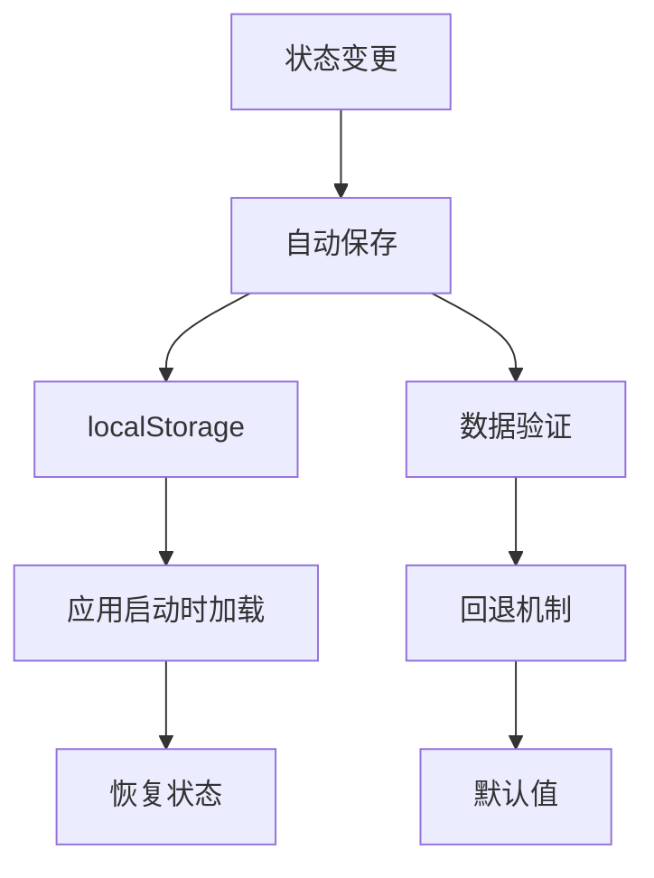

**图表来源**
- [frontend/src/stores/settings.ts](file://frontend/src/stores/settings.ts#L16-L56)

### 持久化实现细节

#### settings Store的持久化
- **存储键名**：`user_settings`
- **持久化时机**：状态变更时自动保存
- **回退机制**：加载失败时使用默认配置
- **数据验证**：确保存储数据的有效性

#### 存储工具函数
系统提供了通用的存储工具函数来处理持久化：

| 函数名 | 功能 | 参数 | 返回值 |
|--------|------|------|--------|
| getStoredValues | 从localStorage获取值 | key, fallbackGetter | T \| null |
| setStoredValues | 向localStorage设置值 | key, values | void |
| validateOrFallback | 验证值并提供回退 | value, validValues | T |

**章节来源**
- [antv_infographic/infographic/dev/src/utils/storage.ts](file://antv_infographic/infographic/dev/src/utils/storage.ts#L1-L60)

### 页面刷新后的状态恢复

系统通过以下机制确保页面刷新后的状态恢复：

1. **应用启动时加载**：在main.ts中初始化Pinia时自动加载持久化状态
2. **组件级恢复**：关键组件在mounted钩子中恢复相关状态
3. **API级重试**：网络状态恢复后自动重试API调用

## 错误处理机制

### 多层次错误处理

系统实现了多层次的错误处理机制，确保应用的健壮性：

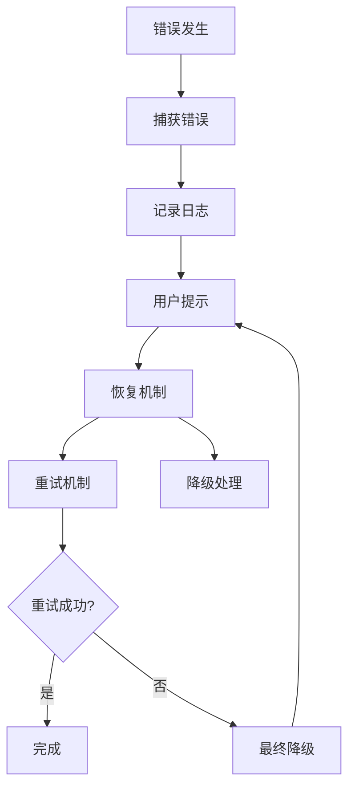

### 错误处理策略

#### API调用错误处理
- **网络错误**：显示网络连接失败提示
- **服务器错误**：显示服务器内部错误提示
- **超时处理**：提供重试机制
- **数据验证错误**：显示具体的数据格式错误

#### 渲染错误处理
- **SVG渲染失败**：显示渲染错误提示
- **资源加载失败**：使用默认占位符
- **内存不足**：提供简化渲染选项

#### 状态一致性保证
- **事务性更新**：确保状态变更的原子性
- **回滚机制**：错误时恢复到上一个有效状态
- **状态校验**：定期验证状态的完整性

**章节来源**
- [frontend/src/views/AIWorkspace/components/LeftInputPanel.vue](file://frontend/src/views/AIWorkspace/components/LeftInputPanel.vue#L115-L130)

### 边界情况管理

#### 输入边界处理
- **空输入检测**：防止空字符串或无效输入
- **长度限制**：限制输入文本的最大长度
- **格式验证**：验证输入格式的正确性

#### 状态边界处理
- **空状态保护**：防止访问null或undefined状态
- **类型安全**：使用TypeScript确保类型安全
- **默认值提供**：为所有状态提供合理的默认值

## 最佳实践

### Store设计原则

1. **单一职责**：每个Store专注于特定领域的状态管理
2. **不可变性**：避免直接修改状态，使用响应式API
3. **类型安全**：使用TypeScript确保类型安全
4. **可测试性**：Store设计便于单元测试

### 性能优化策略

1. **状态分割**：将大型状态拆分为多个小Store
2. **计算属性缓存**：合理使用computed属性缓存计算结果
3. **懒加载**：按需加载Store和相关数据
4. **批量更新**：合并多个状态变更减少重渲染

### 开发调试技巧

1. **DevTools集成**：利用Pinia DevTools进行状态调试
2. **状态快照**：保存关键状态快照用于调试
3. **时间旅行**：支持状态变更的时间旅行调试
4. **性能监控**：监控状态变更的性能影响

### 测试策略

1. **单元测试**：为每个Store编写单元测试
2. **集成测试**：测试Store间的协作
3. **端到端测试**：测试完整的用户流程
4. **状态测试**：验证状态变更的正确性

## 总结

本文档详细介绍了基于Pinia的状态管理系统实现，展示了如何通过模块化设计实现清晰的职责分离和高效的数据流转。系统的主要优势包括：

1. **模块化架构**：四个核心Store模块各司其职，职责清晰
2. **响应式设计**：充分利用Vue 3的响应式特性，确保状态变更的及时响应
3. **持久化支持**：完善的localStorage持久化机制，提升用户体验
4. **错误处理**：多层次的错误处理机制，确保应用的健壮性
5. **类型安全**：完整的TypeScript类型定义，提高开发效率和代码质量

该状态管理系统为信息图表生成应用提供了坚实的基础，支持复杂的用户交互和数据流转需求，同时保持了良好的可维护性和扩展性。