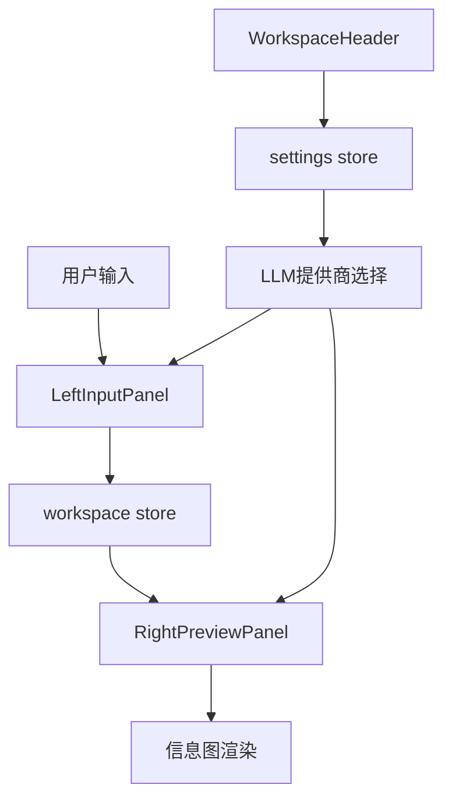
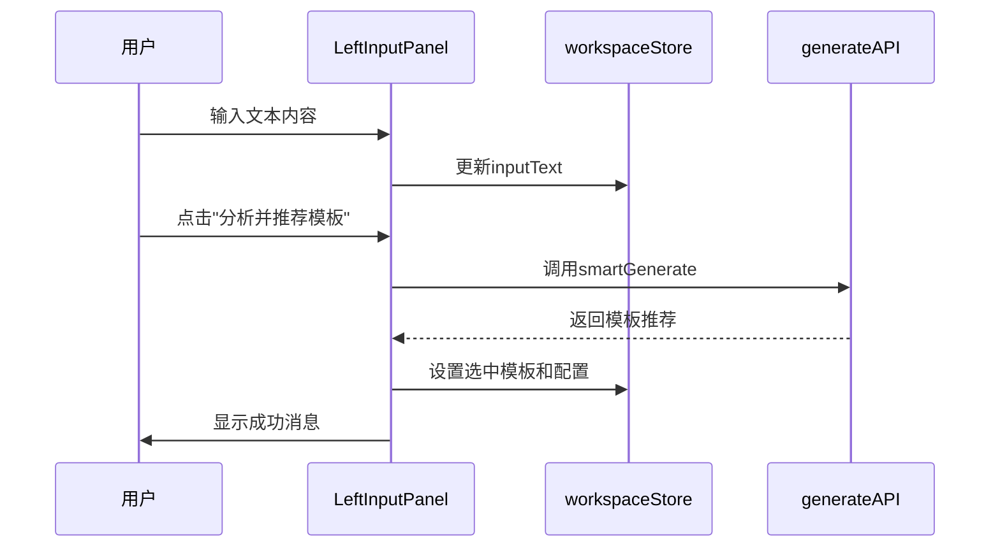
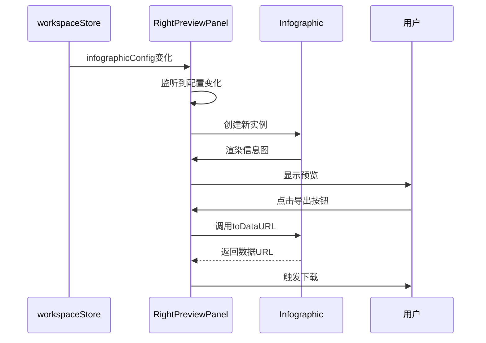
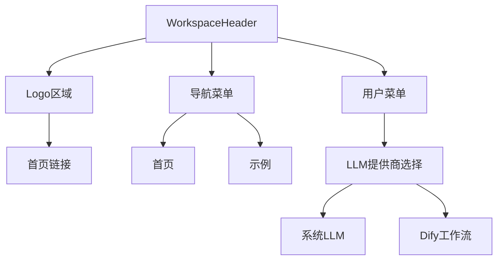
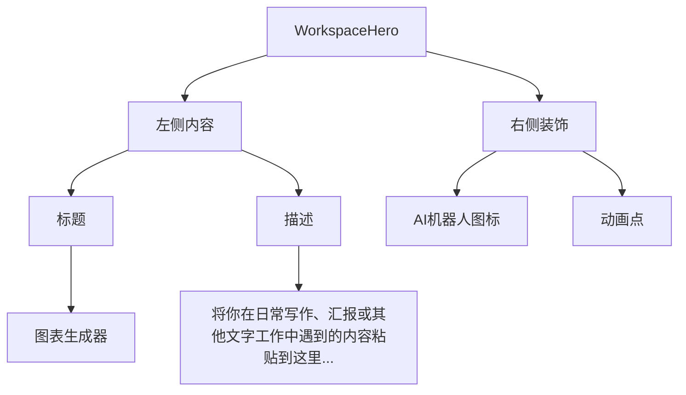

# AI工作区组件

<cite>
**本文档引用的文件**   
- [AIWorkspace.vue](file://frontend/src/views/AIWorkspace/AIWorkspace.vue)
- [LeftInputPanel.vue](file://frontend/src/views/AIWorkspace/components/LeftInputPanel.vue)
- [RightPreviewPanel.vue](file://frontend/src/views/AIWorkspace/components/RightPreviewPanel.vue)
- [WorkspaceHeader.vue](file://frontend/src/views/AIWorkspace/components/WorkspaceHeader.vue)
- [WorkspaceHero.vue](file://frontend/src/views/AIWorkspace/components/WorkspaceHero.vue)
- [workspace.ts](file://frontend/src/stores/workspace.ts)
- [template.ts](file://frontend/src/stores/template.ts)
- [settings.ts](file://frontend/src/stores/settings.ts)
</cite>

## 目录
1. [项目结构](#项目结构)
2. [核心组件](#核心组件)
3. [架构概述](#架构概述)
4. [详细组件分析](#详细组件分析)
5. [依赖分析](#依赖分析)
6. [性能考虑](#性能考虑)
7. [故障排除指南](#故障排除指南)
8. [结论](#结论)

## 项目结构

AI工作区组件采用模块化设计，主要包含以下文件结构：

```mermaid
graph TB
A[AIWorkspace.vue] --> B[LeftInputPanel.vue]
A --> C[RightPreviewPanel.vue]
A --> D[WorkspaceHeader.vue]
A --> E[WorkspaceHero.vue]
B --> F[workspace.ts]
C --> F
C --> G[template.ts]
D --> H[settings.ts]
C --> I[@antv/infographic]
```

**图源**  
- [AIWorkspace.vue](file://frontend/src/views/AIWorkspace/AIWorkspace.vue)
- [LeftInputPanel.vue](file://frontend/src/views/AIWorkspace/components/LeftInputPanel.vue)
- [RightPreviewPanel.vue](file://frontend/src/views/AIWorkspace/components/RightPreviewPanel.vue)

**本节来源**  
- [AIWorkspace.vue](file://frontend/src/views/AIWorkspace/AIWorkspace.vue)
- [frontend/src/views/AIWorkspace/components/](file://frontend/src/views/AIWorkspace/components/)

## 核心组件

AI工作区由多个核心组件构成，包括左侧输入面板、右侧预览面板、工作区头部和英雄区域。这些组件通过Pinia store进行状态共享，并使用事件总线进行跨组件通信。

**本节来源**  
- [AIWorkspace.vue](file://frontend/src/views/AIWorkspace/AIWorkspace.vue)
- [workspace.ts](file://frontend/src/stores/workspace.ts)
- [template.ts](file://frontend/src/stores/template.ts)

## 架构概述

AI工作区采用组合式API架构，通过Vue 3的响应式系统实现组件间的高效通信。整体架构分为四个主要部分：输入处理、状态管理、预览渲染和用户交互。



**图源**  
- [AIWorkspace.vue](file://frontend/src/views/AIWorkspace/AIWorkspace.vue)
- [workspace.ts](file://frontend/src/stores/workspace.ts)
- [settings.ts](file://frontend/src/stores/settings.ts)

## 详细组件分析

### LeftInputPanel分析

LeftInputPanel组件负责处理用户输入和AI提示工程。它提供了一个文本区域供用户输入内容，并通过AI分析推荐最合适的信息图模板。



**图源**  
- [LeftInputPanel.vue](file://frontend/src/views/AIWorkspace/components/LeftInputPanel.vue)
- [workspace.ts](file://frontend/src/stores/workspace.ts)

**本节来源**  
- [LeftInputPanel.vue](file://frontend/src/views/AIWorkspace/components/LeftInputPanel.vue)
- [workspace.ts](file://frontend/src/stores/workspace.ts)

### RightPreviewPanel分析

RightPreviewPanel组件实现实时信息图预览和交互反馈。它监听工作区状态的变化，并使用@antv/infographic库渲染信息图。



**图源**  
- [RightPreviewPanel.vue](file://frontend/src/views/AIWorkspace/components/RightPreviewPanel.vue)
- [@antv/infographic](file://node_modules/@antv/infographic)

**本节来源**  
- [RightPreviewPanel.vue](file://frontend/src/views/AIWorkspace/components/RightPreviewPanel.vue)
- [workspace.ts](file://frontend/src/stores/workspace.ts)

### WorkspaceHeader分析

WorkspaceHeader组件提供导航功能，包括首页、示例页面的导航链接，以及用户设置菜单。



**图源**  
- [WorkspaceHeader.vue](file://frontend/src/views/AIWorkspace/components/WorkspaceHeader.vue)
- [settings.ts](file://frontend/src/stores/settings.ts)

**本节来源**  
- [WorkspaceHeader.vue](file://frontend/src/views/AIWorkspace/components/WorkspaceHeader.vue)
- [settings.ts](file://frontend/src/stores/settings.ts)

### WorkspaceHero分析

WorkspaceHero组件提供引导体验设计，通过简洁的标题和描述引导用户使用AI工作区。



**图源**  
- [WorkspaceHero.vue](file://frontend/src/views/AIWorkspace/components/WorkspaceHero.vue)

**本节来源**  
- [WorkspaceHero.vue](file://frontend/src/views/AIWorkspace/components/WorkspaceHero.vue)

## 依赖分析

AI工作区组件依赖于多个外部库和内部模块，形成了一个复杂的依赖网络。

```mermaid
graph TD
A[AIWorkspace] --> B[Vue 3]
A --> C[Pinia]
A --> D[Ant Design Vue]
A --> E[lucide-vue-next]
A --> F[@antv/infographic]
B --> G[组合式API]
C --> H[状态管理]
D --> I[UI组件]
E --> J[图标]
F --> K[信息图渲染]
```

**图源**  
- [package.json](file://frontend/package.json)
- [AIWorkspace.vue](file://frontend/src/views/AIWorkspace/AIWorkspace.vue)

**本节来源**  
- [package.json](file://frontend/package.json)
- [AIWorkspace.vue](file://frontend/src/views/AIWorkspace/AIWorkspace.vue)

## 性能考虑

AI工作区在性能优化方面采用了多种策略：

1. **防抖输入处理**：虽然当前代码中未直接实现防抖，但通过状态管理(store)的集中控制，避免了不必要的重复渲染。
2. **虚拟滚动技术**：目前未在代码中实现，但可以通过在大型模板列表中引入虚拟滚动来优化性能。
3. **资源懒加载**：通过动态导入(import)模式，在需要时才加载API模块，减少初始加载时间。
4. **高效的DOM更新**：利用Vue 3的响应式系统，只更新必要的DOM元素。

**本节来源**  
- [LeftInputPanel.vue](file://frontend/src/views/AIWorkspace/components/LeftInputPanel.vue)
- [RightPreviewPanel.vue](file://frontend/src/views/AIWorkspace/components/RightPreviewPanel.vue)

## 故障排除指南

在使用AI工作区组件时，可能会遇到以下常见问题：

1. **信息图无法渲染**：检查`infographicConfig`是否包含有效的模板和数据。
2. **导出功能失败**：确保`@antv/infographic`实例已正确创建并渲染。
3. **状态不同步**：检查Pinia store的引用是否正确，确保所有组件使用相同的store实例。
4. **AI分析无响应**：检查网络连接和后端API服务状态。

**本节来源**  
- [workspace.ts](file://frontend/src/stores/workspace.ts)
- [RightPreviewPanel.vue](file://frontend/src/views/AIWorkspace/components/RightPreviewPanel.vue)

## 结论

AI工作区组件通过精心设计的架构，实现了用户友好的信息图生成体验。组件间通过Pinia store进行高效的状态共享，利用组合式API处理复杂的表单逻辑和实时预览。未来可以进一步优化性能，例如引入防抖输入处理和虚拟滚动技术，以提升大规模数据场景下的用户体验。