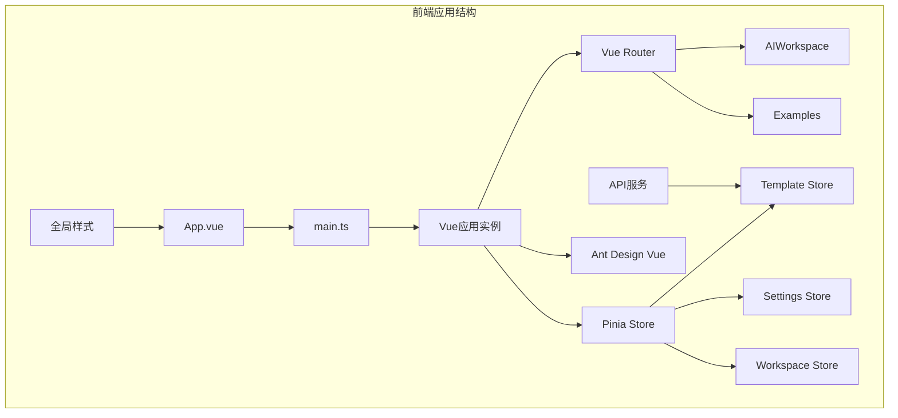
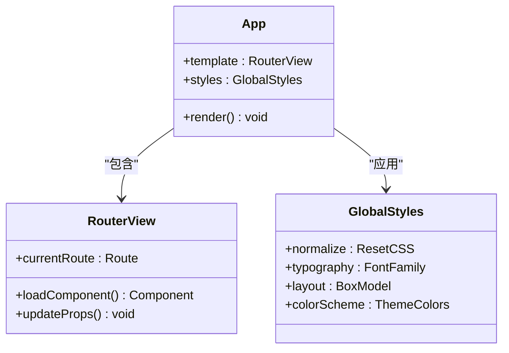
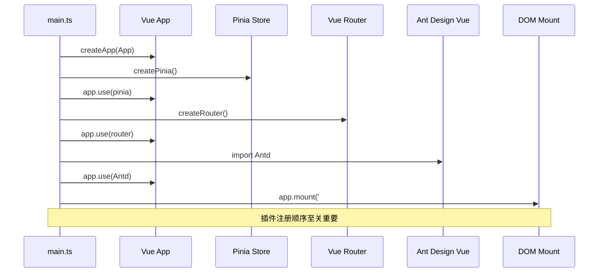
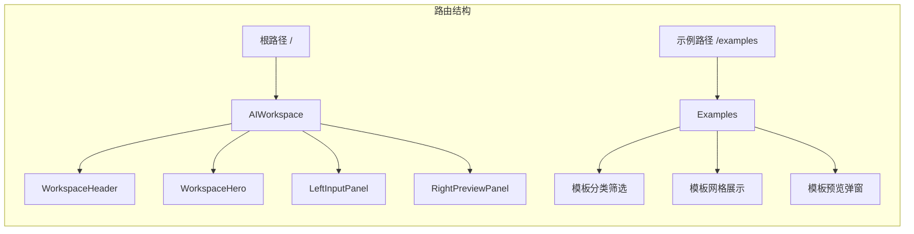
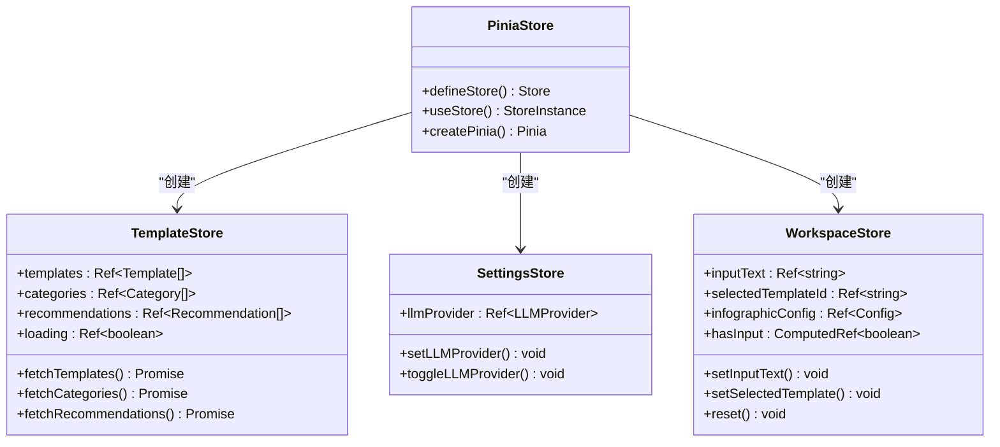
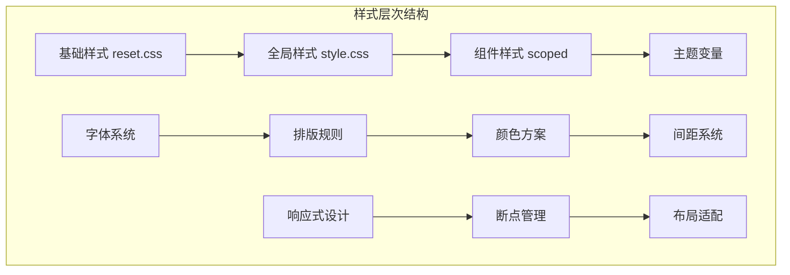
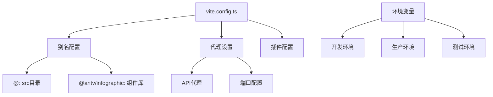
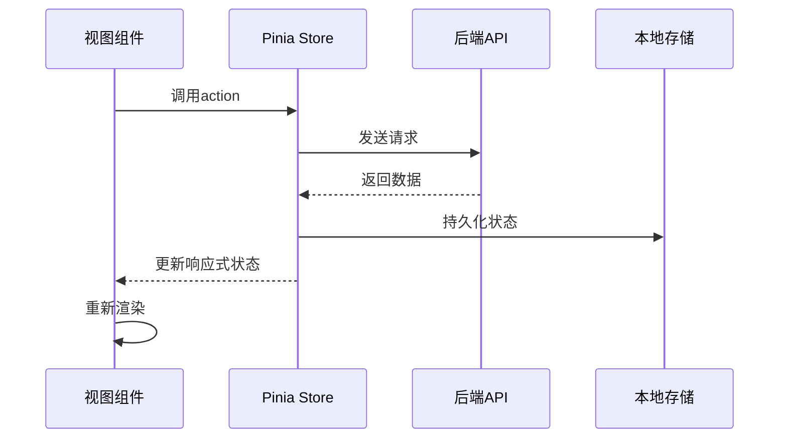

# 核心组件

<cite>
**本文档引用的文件**
- [App.vue](file://frontend/src/App.vue)
- [main.ts](file://frontend/src/main.ts)
- [router/index.ts](file://frontend/src/router/index.ts)
- [style.css](file://frontend/src/style.css)
- [env.d.ts](file://frontend/src/env.d.ts)
- [package.json](file://frontend/package.json)
- [vite.config.ts](file://frontend/vite.config.ts)
- [stores/template.ts](file://frontend/src/stores/template.ts)
- [stores/settings.ts](file://frontend/src/stores/settings.ts)
- [stores/workspace.ts](file://frontend/src/stores/workspace.ts)
- [views/AIWorkspace/AIWorkspace.vue](file://frontend/src/views/AIWorkspace/AIWorkspace.vue)
- [views/Examples/Examples.vue](file://frontend/src/views/Examples/Examples.vue)
- [api/templates.ts](file://frontend/src/api/templates.ts)
</cite>

## 目录
1. [简介](#简介)
2. [项目结构概览](#项目结构概览)
3. [App.vue核心组件分析](#appvue核心组件分析)
4. [应用初始化流程](#应用初始化流程)
5. [路由系统架构](#路由系统架构)
6. [状态管理系统](#状态管理系统)
7. [全局样式与主题](#全局样式与主题)
8. [环境变量与配置](#环境变量与配置)
9. [性能优化策略](#性能优化策略)
10. [组件间通信模式](#组件间通信模式)
11. [故障排除指南](#故障排除指南)
12. [总结](#总结)

## 简介

本文档深入分析了基于Vue 3和TypeScript构建的前端应用的核心组件架构。该应用采用现代化的前端技术栈，集成了Vue Router进行路由管理、Pinia进行状态管理，并提供了丰富的用户交互体验。核心组件App.vue作为应用的根容器，承担着路由容器、状态管理中枢和全局样式注入的重要职责。

## 项目结构概览

该项目采用模块化的组织结构，主要分为以下几个核心部分：

**图表来源**
- [App.vue](file://frontend/src/App.vue#L1-L39)
- [main.ts](file://frontend/src/main.ts#L1-L17)

**章节来源**
- [package.json](file://frontend/package.json#L1-L27)
- [vite.config.ts](file://frontend/vite.config.ts#L1-L25)

## App.vue核心组件分析

### 组件职责与架构设计

App.vue作为应用的根组件，采用了极简的设计理念，专注于提供统一的布局容器和全局样式管理：

**图表来源**
- [App.vue](file://frontend/src/App.vue#L1-L39)

### 路由容器功能

App.vue通过`<router-view />`指令实现了动态路由渲染，这是Vue Router的核心机制：

- **动态组件加载**：根据当前路由路径自动加载对应的视图组件
- **嵌套路由支持**：支持复杂的路由层次结构
- **路由守卫集成**：可与全局或路由级别的守卫配合工作

### 全局样式管理

App.vue集成了全面的全局样式系统：

#### 基础重置样式
- **盒模型标准化**：统一margin、padding和box-sizing
- **高度控制**：确保100%高度继承链
- **溢出处理**：防止页面滚动异常

#### 字体系统
- **跨平台字体族**：支持系统默认字体和中文字体
- **行高优化**：1.6的行高提升阅读体验
- **颜色方案**：深色模式友好的色彩搭配

#### 布局基线
- **视口单位**：使用vh单位确保移动端适配
- **弹性布局**：支持现代CSS布局特性
- **响应式设计**：基础的媒体查询支持

**章节来源**
- [App.vue](file://frontend/src/App.vue#L1-L39)
- [style.css](file://frontend/src/style.css#L1-L97)

## 应用初始化流程

### 插件注册序列

应用的初始化过程遵循严格的插件注册顺序，确保各模块间的正确依赖关系：

**图表来源**
- [main.ts](file://frontend/src/main.ts#L1-L17)

### 全局配置策略

#### Pinia状态管理集成
- **单一状态树**：集中管理应用状态
- **模块化存储**：按功能划分store模块
- **持久化支持**：自动处理状态持久化

#### Vue Router配置
- **历史模式**：使用HTML5 History API
- **懒加载路由**：按需加载组件提升性能
- **错误处理**：全局路由错误监控

#### Ant Design Vue集成
- **组件库加载**：按需引入UI组件
- **主题定制**：支持全局样式覆盖
- **国际化支持**：内置多语言能力

**章节来源**
- [main.ts](file://frontend/src/main.ts#L1-L17)
- [router/index.ts](file://frontend/src/router/index.ts#L1-L34)

## 路由系统架构

### 路由配置与导航

应用采用声明式的路由配置，支持两种主要视图：

**图表来源**
- [router/index.ts](file://frontend/src/router/index.ts#L8-L20)

### 动态路由加载

路由系统实现了智能的代码分割和懒加载：

#### 路由定义模式
- **异步组件**：使用`import()`语法实现按需加载
- **预加载策略**：在用户交互时提前加载组件
- **错误边界**：处理组件加载失败的情况

#### 路由守卫机制
- **全局前置守卫**：统一的权限验证和重定向
- **路由独享守卫**：特定路由的验证逻辑
- **组件内守卫**：组件生命周期内的导航控制

### 错误处理策略

路由系统包含了完善的错误处理机制：

#### 错误捕获
- **同步错误**：路由解析过程中的异常
- **异步错误**：组件加载过程中的失败
- **网络错误**：API请求相关的路由问题

#### 错误恢复
- **降级处理**：提供备用路由或错误页面
- **重试机制**：自动重试失败的操作
- **用户反馈**：清晰的错误提示信息

**章节来源**
- [router/index.ts](file://frontend/src/router/index.ts#L22-L33)

## 状态管理系统

### Pinia Store架构

应用采用Pinia作为状态管理解决方案，实现了模块化的状态管理：

**图表来源**
- [stores/template.ts](file://frontend/src/stores/template.ts#L36-L101)
- [stores/settings.ts](file://frontend/src/stores/settings.ts#L43-L76)
- [stores/workspace.ts](file://frontend/src/stores/workspace.ts#L14-L73)

### 数据流管理

#### 单向数据流
- **状态定义**：使用ref和reactive定义响应式状态
- **计算属性**：通过computed派生衍生状态
- **动作执行**：通过actions修改状态

#### 状态持久化
- **本地存储**：自动保存重要配置到localStorage
- **会话管理**：维护用户会话状态
- **缓存策略**：智能缓存API响应数据

### 组件状态绑定

各store模块与对应组件建立了紧密的状态绑定：

#### Template Store
- **模板数据管理**：存储和管理所有可用模板
- **分类信息维护**：维护模板分类的统计数据
- **推荐算法集成**：支持AI模板推荐功能

#### Settings Store
- **LLM提供商配置**：管理AI服务提供商的选择
- **用户偏好保存**：保存用户的个性化设置
- **配置同步**：实时同步配置变更

#### Workspace Store
- **工作区状态**：管理当前编辑的工作区状态
- **配置管理**：存储信息图配置参数
- **操作状态跟踪**：跟踪生成和分析操作状态

**章节来源**
- [stores/template.ts](file://frontend/src/stores/template.ts#L1-L102)
- [stores/settings.ts](file://frontend/src/stores/settings.ts#L1-L77)
- [stores/workspace.ts](file://frontend/src/stores/workspace.ts#L1-L74)

## 全局样式与主题

### 样式架构设计

应用采用了分层的样式架构，确保样式的可维护性和一致性：

**图表来源**
- [style.css](file://frontend/src/style.css#L1-L97)
- [App.vue](file://frontend/src/App.vue#L7-L38)

### 字体加载策略

#### 字体优先级
- **系统字体**：优先使用操作系统默认字体
- **Web字体**：在系统字体不可用时加载Web字体
- **回退机制**：提供多级字体回退方案

#### 字体优化
- **字体子集**：只加载必要的字符子集
- **字体格式**：支持多种字体格式以兼容不同浏览器
- **加载时机**：优化字体加载时机避免FOIT

### 主题系统

#### 暗黑模式支持
- **CSS变量**：使用CSS自定义属性实现主题切换
- **颜色映射**：建立明暗两套颜色映射表
- **自动检测**：支持系统主题自动跟随

#### 品牌色彩
- **主色调**：定义品牌的主要视觉色彩
- **辅助色**：提供丰富的辅助色彩选择
- **语义色**：区分不同状态和功能的颜色

### 响应式设计

#### 断点策略
- **移动优先**：采用移动优先的设计方法
- **弹性布局**：使用flexbox和grid实现弹性布局
- **媒体查询**：针对不同设备尺寸提供专门的样式

#### 交互反馈
- **悬停效果**：提供丰富的鼠标悬停反馈
- **焦点状态**：确保键盘导航的可访问性
- **动画过渡**：使用CSS动画提升用户体验

**章节来源**
- [style.css](file://frontend/src/style.css#L1-L97)
- [App.vue](file://frontend/src/App.vue#L21-L38)

## 环境变量与配置

### 配置管理架构

应用通过Vite提供了灵活的环境变量管理和配置系统：

**图表来源**
- [vite.config.ts](file://frontend/vite.config.ts#L1-L25)

### 环境变量注入

#### 开发环境配置
- **热重载**：支持开发时的热模块替换
- **源码映射**：提供完整的调试信息
- **代理服务**：自动代理API请求到后端服务

#### 生产环境优化
- **代码压缩**：自动压缩JavaScript和CSS代码
- **资源优化**：图片和静态资源的优化处理
- **构建产物**：生成优化的部署文件

### API配置管理

#### 代理配置
- **目标服务器**：配置后端API的服务地址
- **路径重写**：处理API路径的转换
- **跨域处理**：解决开发环境的跨域问题

#### 环境隔离
- **配置分离**：不同环境使用不同的配置
- **敏感信息保护**：避免在客户端暴露敏感配置
- **动态配置**：支持运行时的配置更新

**章节来源**
- [vite.config.ts](file://frontend/vite.config.ts#L1-L25)

## 性能优化策略

### 代码分割与懒加载

#### 路由级别分割
- **组件懒加载**：使用动态import实现组件的按需加载
- **预加载策略**：在用户交互时预加载可能需要的组件
- **代码块命名**：为代码分割点提供有意义的名称

#### 库级别分割
- **第三方库**：将大型第三方库独立打包
- **Polyfill管理**：按需加载浏览器兼容性代码
- **工具库分离**：分离常用的工具函数库

### 资源预加载

#### 关键资源优先
- **首屏资源**：优先加载首屏必需的资源
- **渐进式加载**：按优先级加载非关键资源
- **预取策略**：预测用户行为预取相关内容

#### 缓存策略
- **HTTP缓存**：合理设置HTTP缓存头
- **版本控制**：使用文件哈希实现缓存失效
- **CDN优化**：利用CDN加速静态资源加载

### 运行时优化

#### 响应式系统优化
- **计算属性缓存**：合理使用computed避免重复计算
- **监听器优化**：减少不必要的watch监听
- **组件更新控制**：精确控制组件的更新时机

#### 内存管理
- **事件监听器清理**：及时移除不需要的事件监听器
- **定时器管理**：妥善处理定时器的生命周期
- **大对象处理**：避免内存泄漏的大对象操作

**章节来源**
- [router/index.ts](file://frontend/src/router/index.ts#L11-L12)
- [vite.config.ts](file://frontend/vite.config.ts#L14-L23)

## 组件间通信模式

### 状态管理模式

应用采用了基于Pinia的状态管理模式，实现了组件间的高效通信：

**图表来源**
- [stores/template.ts](file://frontend/src/stores/template.ts#L44-L83)

### Props与Events通信

#### 父子组件通信
- **Props传递**：父组件向子组件传递数据
- **事件回调**：子组件向父组件发送事件
- **双向绑定**：使用v-model实现双向数据绑定

#### 插槽通信
- **具名插槽**：提供命名的插槽区域
- **作用域插槽**：向插槽传递数据
- **默认插槽**：提供默认的内容区域

### 事件总线模式

#### 全局事件系统
- **事件发布**：组件可以发布全局事件
- **事件订阅**：其他组件可以订阅感兴趣的事件
- **事件解绑**：及时清理不再需要的事件监听器

#### 自定义事件
- **业务事件**：封装业务相关的事件
- **生命周期事件**：处理组件生命周期事件
- **用户交互事件**：响应用户的各种交互操作

### 依赖注入

#### Provide/Inject模式
- **服务注入**：向子组件注入共享的服务
- **配置注入**：注入全局配置信息
- **工具注入**：提供通用的工具函数

**章节来源**
- [stores/template.ts](file://frontend/src/stores/template.ts#L44-L83)
- [stores/settings.ts](file://frontend/src/stores/settings.ts#L51-L57)

## 故障排除指南

### 常见问题诊断

#### 路由问题
- **路由不匹配**：检查路由配置和路径拼写
- **组件不显示**：确认组件导出和导入路径
- **路由守卫失效**：检查守卫函数的返回值

#### 状态管理问题
- **状态不更新**：确认使用了正确的响应式API
- **数据丢失**：检查持久化配置和存储机制
- **性能问题**：分析状态更新频率和计算复杂度

#### 样式问题
- **样式不生效**：检查CSS选择器优先级和作用域
- **响应式失效**：确认媒体查询和断点配置
- **主题冲突**：检查主题变量的覆盖和继承

### 调试工具使用

#### Vue DevTools
- **组件树查看**：分析组件的层次结构
- **状态检查**：实时查看和修改状态
- **性能分析**：监控组件的渲染性能

#### 浏览器开发者工具
- **网络面板**：分析API请求和响应
- **控制台调试**：查看错误信息和日志输出
- **元素检查**：分析DOM结构和样式应用

### 性能监控

#### 关键指标
- **首次内容绘制**：测量页面首次渲染时间
- **最大内容绘制**：评估主要内容的加载时间
- **累积布局偏移**：监控页面布局的稳定性

#### 优化建议
- **资源加载优化**：减少关键资源的加载时间
- **代码质量提升**：提高代码的可读性和可维护性
- **用户体验改善**：提供更好的用户交互体验

**章节来源**
- [router/index.ts](file://frontend/src/router/index.ts#L22-L33)
- [stores/template.ts](file://frontend/src/stores/template.ts#L62-L64)

## 总结

本文档详细分析了基于Vue 3的应用核心组件架构，涵盖了从App.vue作为根容器的设计理念，到完整的状态管理、路由系统和样式体系的实现细节。该架构体现了现代前端开发的最佳实践：

### 架构优势
- **模块化设计**：清晰的职责分离和模块化组织
- **响应式架构**：充分利用Vue 3的响应式系统
- **类型安全**：完整的TypeScript类型定义
- **性能优化**：多层次的性能优化策略

### 技术特色
- **现代化技术栈**：Vue 3 + TypeScript + Vite
- **状态管理**：Pinia提供的现代化状态管理
- **路由系统**：Vue Router的完整路由解决方案
- **UI组件库**：Ant Design Vue的丰富组件生态

### 扩展性考虑
- **插件化架构**：易于扩展和定制的功能模块
- **配置灵活性**：支持多种环境和部署需求
- **开发体验**：优秀的开发工具和调试支持

这套核心组件架构为构建高质量的单页应用提供了坚实的基础，能够满足复杂业务场景的需求，同时保持良好的可维护性和扩展性。