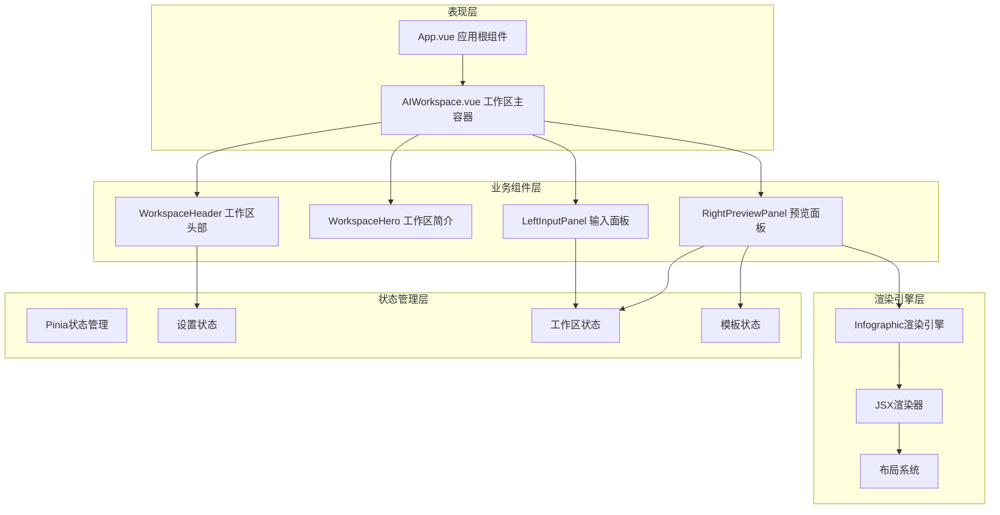
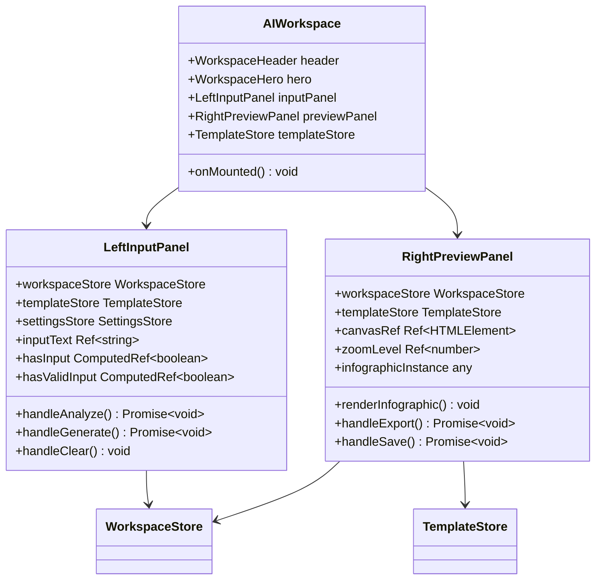
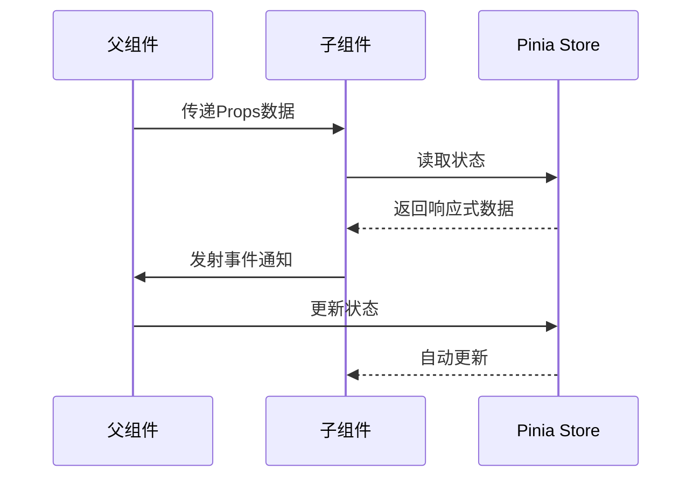
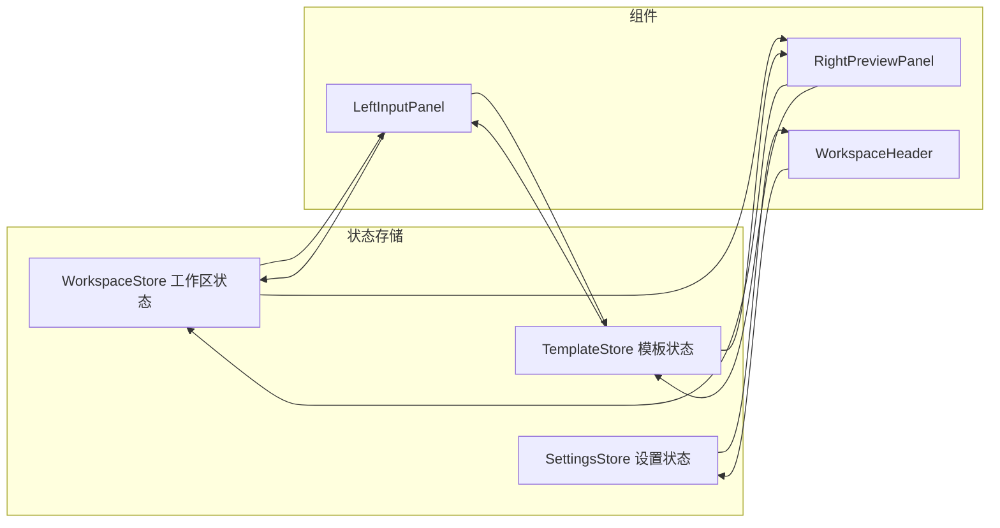
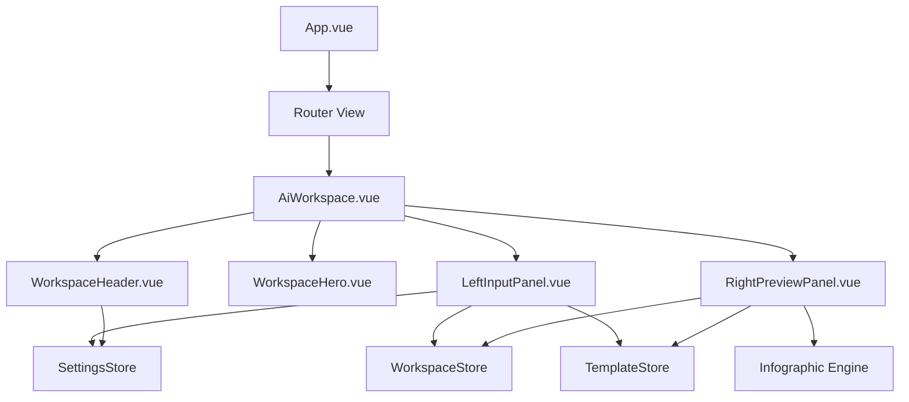
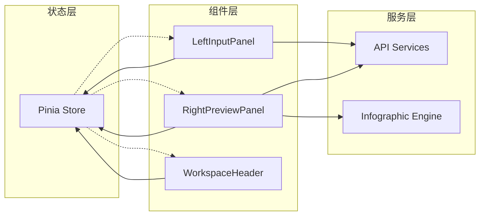

# 组件架构

<cite>
**本文档中引用的文件**
- [AIWorkspace.vue](file://frontend/src/views/AIWorkspace/AIWorkspace.vue)
- [LeftInputPanel.vue](file://frontend/src/views/AIWorkspace/components/LeftInputPanel.vue)
- [RightPreviewPanel.vue](file://frontend/src/views/AIWorkspace/components/RightPreviewPanel.vue)
- [WorkspaceHeader.vue](file://frontend/src/views/AIWorkspace/components/WorkspaceHeader.vue)
- [WorkspaceHero.vue](file://frontend/src/views/AIWorkspace/components/WorkspaceHero.vue)
- [workspace.ts](file://frontend/src/stores/workspace.ts)
- [template.ts](file://frontend/src/stores/template.ts)
- [settings.ts](file://frontend/src/stores/settings.ts)
- [App.vue](file://frontend/src/App.vue)
- [main.ts](file://frontend/src/main.ts)
- [router/index.ts](file://frontend/src/router/index.ts)
- [Infographic.tsx](file://antv_infographic/infographic/src/runtime/Infographic.tsx)
- [renderer.ts](file://antv_infographic/infographic/src/jsx/renderer.ts)
- [layout.ts](file://antv_infographic/infographic/src/jsx/layout.ts)
</cite>

## 目录
1. [项目概述](#项目概述)
2. [组件架构总览](#组件架构总览)
3. [核心组件层次结构](#核心组件层次结构)
4. [单文件组件设计规范](#单文件组件设计规范)
5. [组件间通信机制](#组件间通信机制)
6. [状态管理架构](#状态管理架构)
7. [组合式API应用](#组合式api应用)
8. [组件依赖关系图](#组件依赖关系图)
9. [性能优化实践](#性能优化实践)
10. [可组合性设计](#可组合性设计)
11. [总结](#总结)

## 项目概述

本项目是一个基于Vue 3的AI工作区应用程序，采用现代化的组件化架构设计。项目主要分为两个核心部分：前端Vue 3应用和AntV信息图表渲染引擎。整个架构遵循Vue 3的Composition API模式，实现了高度模块化的组件设计和高效的状态管理。

## 组件架构总览

项目采用分层架构设计，主要包含以下层次：



**图表来源**
- [AIWorkspace.vue](file://frontend/src/views/AIWorkspace/AIWorkspace.vue#L1-L53)
- [App.vue](file://frontend/src/App.vue#L1-L39)
- [workspace.ts](file://frontend/src/stores/workspace.ts#L1-L73)

## 核心组件层次结构

### AIWorkspace主容器组件

AIWorkspace作为整个工作区的主容器，负责协调各个子组件的协作关系：



**图表来源**
- [AIWorkspace.vue](file://frontend/src/views/AIWorkspace/AIWorkspace.vue#L29-L42)
- [LeftInputPanel.vue](file://frontend/src/views/AIWorkspace/components/LeftInputPanel.vue#L49-L79)
- [RightPreviewPanel.vue](file://frontend/src/views/AIWorkspace/components/RightPreviewPanel.vue#L115-L169)

**章节来源**
- [AIWorkspace.vue](file://frontend/src/views/AIWorkspace/AIWorkspace.vue#L1-L53)
- [LeftInputPanel.vue](file://frontend/src/views/AIWorkspace/components/LeftInputPanel.vue#L1-L313)
- [RightPreviewPanel.vue](file://frontend/src/views/AIWorkspace/components/RightPreviewPanel.vue#L1-L865)

### 子组件职责划分

#### LeftInputPanel（左侧输入面板）

LeftInputPanel负责处理用户输入和AI分析逻辑，主要职责包括：

- **文本输入管理**：处理用户输入内容，提供输入验证和格式化
- **AI分析功能**：调用智能生成API进行内容分析和模板推荐
- **状态控制**：管理分析和生成过程的状态显示
- **交互控制**：提供清除、分析、生成等操作按钮

#### RightPreviewPanel（右侧预览面板）

RightPreviewPanel负责信息图的预览和导出功能，主要职责包括：

- **信息图渲染**：使用AntV Infographic引擎渲染SVG图形
- **模板选择**：提供模板切换和推荐功能
- **导出功能**：支持PNG、SVG、PPTX等多种格式导出
- **缩放控制**：提供画布缩放和平移功能
- **保存功能**：将生成的信息图保存到工作区

**章节来源**
- [LeftInputPanel.vue](file://frontend/src/views/AIWorkspace/components/LeftInputPanel.vue#L80-L165)
- [RightPreviewPanel.vue](file://frontend/src/views/AIWorkspace/components/RightPreviewPanel.vue#L234-L441)

## 单文件组件设计规范

### 模板部分（Template）

Vue 3单文件组件采用统一的模板结构规范：

```vue
<template>
  <div class="component-class">
    <!-- 组件头部 -->
    <div class="header">
      <slot name="header"></slot>
    </div>
    
    <!-- 主体内容 -->
    <div class="body">
      <slot></slot>
    </div>
    
    <!-- 底部操作 -->
    <div class="footer">
      <slot name="footer"></slot>
    </div>
  </div>
</template>
```

### 脚本部分（Script Setup）

采用Composition API的setup语法糖，实现响应式状态和逻辑：

```vue
<script setup lang="ts">
import { ref, computed, watch, onMounted } from 'vue'
import { useStore } from '@/stores/storeName'

// 响应式状态
const state = ref(initialValue)
const computedProperty = computed(() => derivedValue)

// 组合函数
function useFeature() {
  // 功能实现
}

// 生命周期钩子
onMounted(() => {
  // 初始化逻辑
})

// 事件处理器
function handleClick() {
  // 事件处理
}
</script>
```

### 样式部分（Style Scoped）

采用Scoped CSS确保样式隔离：

```vue
<style scoped lang="scss">
.component-class {
  // 组件特定样式
  
  .header {
    // 头部样式
  }
  
  .body {
    // 主体样式
  }
  
  .footer {
    // 底部样式
  }
}
</style>
```

**章节来源**
- [LeftInputPanel.vue](file://frontend/src/views/AIWorkspace/components/LeftInputPanel.vue#L49-L313)
- [RightPreviewPanel.vue](file://frontend/src/views/AIWorkspace/components/RightPreviewPanel.vue#L115-L865)

## 组件间通信机制

### Props传递模式

组件间通过Props进行父子通信：



**图表来源**
- [LeftInputPanel.vue](file://frontend/src/views/AIWorkspace/components/LeftInputPanel.vue#L66-L79)
- [RightPreviewPanel.vue](file://frontend/src/views/AIWorkspace/components/RightPreviewPanel.vue#L172-L182)

### 事件发射模式

子组件通过$emit向父组件传递事件：

```typescript
// 子组件触发事件
emit('update:modelValue', newValue)

// 父组件监听事件
<MyComponent @update:modelValue="handleUpdate" />

// 自定义事件
emit('custom-event', payload)
```

### 依赖注入模式

对于深层嵌套的组件通信，使用provide/inject模式：

```typescript
// 提供者组件
provide('injectionKey', reactiveValue)

// 消费者组件
const injectedValue = inject('injectionKey')
```

**章节来源**
- [LeftInputPanel.vue](file://frontend/src/views/AIWorkspace/components/LeftInputPanel.vue#L115-L165)
- [RightPreviewPanel.vue](file://frontend/src/views/AIWorkspace/components/RightPreviewPanel.vue#L115-L206)

## 状态管理架构

### Pinia状态管理

项目采用Pinia作为状态管理解决方案，实现集中式状态管理：



**图表来源**
- [workspace.ts](file://frontend/src/stores/workspace.ts#L14-L73)
- [template.ts](file://frontend/src/stores/template.ts#L1-L34)
- [settings.ts](file://frontend/src/stores/settings.ts)

### 状态存储设计

#### WorkspaceStore（工作区状态）

管理AI工作区的核心状态：

| 状态属性 | 类型 | 描述 |
|---------|------|------|
| inputText | Ref\<string\> | 用户输入的原始文本 |
| selectedTemplateId | Ref\<string \| null\> | 当前选中的模板ID |
| infographicConfig | Ref\<InfographicConfig \| null\> | 信息图配置对象 |
| isAnalyzing | Ref\<boolean\> | 是否正在分析中 |
| isGenerating | Ref\<boolean\> | 是否正在生成中 |

| 计算属性 | 类型 | 描述 |
|---------|------|------|
| hasInput | ComputedRef\<boolean\> | 是否有有效输入 |
| hasConfig | ComputedRef\<boolean\> | 是否有配置信息 |

#### TemplateStore（模板状态）

管理模板相关的状态和操作：

| 状态属性 | 类型 | 描述 |
|---------|------|------|
| recommendations | Ref\<TemplateRecommendation[]\> | 推荐模板列表 |
| categories | Ref\<Category[]\> | 模板分类列表 |
| selectedCategory | Ref\<string \| null\> | 当前选中的分类 |

**章节来源**
- [workspace.ts](file://frontend/src/stores/workspace.ts#L1-L73)
- [template.ts](file://frontend/src/stores/template.ts#L1-L34)

## 组合式API应用

### 响应式API使用模式

#### ref（基本响应式）

用于创建基本的响应式变量：

```typescript
// 字符串响应式
const message = ref('Hello World')

// 对象响应式
const user = ref({ name: 'John', age: 30 })

// 数组响应式
const items = ref<string[]>([])
```

#### reactive（复合响应式）

用于创建复杂对象的响应式：

```typescript
const state = reactive({
  count: 0,
  user: {
    name: 'John',
    age: 30
  },
  items: []
})
```

#### computed（计算属性）

用于派生响应式值：

```typescript
const doubledCount = computed(() => state.count * 2)
const fullName = computed({
  get: () => `${state.user.firstName} ${state.user.lastName}`,
  set: (value) => {
    const names = value.split(' ')
    state.user.firstName = names[0]
    state.user.lastName = names[names.length - 1]
  }
})
```

#### watch（侦听器）

用于观察响应式变化：

```typescript
// 基本侦听
watch(source, callback)

// 深度侦听
watch(deepSource, callback, { deep: true })

// 立即执行
watch(immediateSource, callback, { immediate: true })
```

### 组合函数设计

将相关逻辑封装为组合函数：

```typescript
export function useComponentLifecycle() {
  const mounted = ref(false)
  
  onMounted(() => {
    mounted.value = true
  })
  
  onUnmounted(() => {
    mounted.value = false
  })
  
  return { mounted }
}
```

**章节来源**
- [LeftInputPanel.vue](file://frontend/src/views/AIWorkspace/components/LeftInputPanel.vue#L66-L79)
- [RightPreviewPanel.vue](file://frontend/src/views/AIWorkspace/components/RightPreviewPanel.vue#L172-L182)

## 组件依赖关系图

### 父-子组件层级关系



**图表来源**
- [AIWorkspace.vue](file://frontend/src/views/AIWorkspace/AIWorkspace.vue#L30-L42)
- [router/index.ts](file://frontend/src/router/index.ts#L6-L20)

### 跨组件通信路径



**图表来源**
- [LeftInputPanel.vue](file://frontend/src/views/AIWorkspace/components/LeftInputPanel.vue#L130-L165)
- [RightPreviewPanel.vue](file://frontend/src/views/AIWorkspace/components/RightPreviewPanel.vue#L234-L441)

**章节来源**
- [AIWorkspace.vue](file://frontend/src/views/AIWorkspace/AIWorkspace.vue#L1-L53)
- [LeftInputPanel.vue](file://frontend/src/views/AIWorkspace/components/LeftInputPanel.vue#L1-L313)
- [RightPreviewPanel.vue](file://frontend/src/views/AIWorkspace/components/RightPreviewPanel.vue#L1-L865)

## 性能优化实践

### v-memo指令使用

在列表渲染中使用v-memo提升性能：

```vue
<template>
  <div v-for="item in items" :key="item.id">
    <!-- 基础缓存 -->
    <div v-memo="[item.id]">{{ item.name }}</div>
    
    <!-- 复杂对象缓存 -->
    <div v-memo="[item.id, item.data]">
      {{ expensiveComputation(item.data) }}
    </div>
  </div>
</template>
```

### 异步组件加载

使用动态导入实现组件懒加载：

```typescript
// 路由懒加载
const LazyComponent = defineAsyncComponent(() =>
  import('./LazyComponent.vue')
)

// 条件渲染懒加载
const AsyncPreview = defineAsyncComponent(() =>
  () => import('./PreviewPanel.vue')
)
```

### 组件缓存策略

```typescript
// keep-alive缓存
<keep-alive>
  <component :is="currentComponent" />
</keep-alive>

// 缓存策略配置
<keep-alive :include="cachedComponents">
  <router-view />
</keep-alive>
```

### 渲染优化

#### 计算属性优化

```typescript
// 避免重复计算
const expensiveData = computed(() => {
  // 复杂计算逻辑
  return heavyComputation(data.value)
})

// 基于依赖的缓存
const derivedState = computed(() => {
  // 只在依赖变化时重新计算
  return processData(baseData.value, filters.value)
})
```

#### 侦听器优化

```typescript
// 防抖处理
watch(debounceSource, debounce(async (newValue) => {
  await handleInputChange(newValue)
}, 300))

// 节流处理
watch(throttleSource, throttle(async (newValue) => {
  await handleResize(newValue)
}, 100))
```

**章节来源**
- [RightPreviewPanel.vue](file://frontend/src/views/AIWorkspace/components/RightPreviewPanel.vue#L208-L231)
- [LeftInputPanel.vue](file://frontend/src/views/AIWorkspace/components/LeftInputPanel.vue#L80-L127)

## 可组合性设计

### 组件复用策略

#### 通用组件抽象

将通用功能抽象为可复用的组合函数：

```typescript
// 表单验证组合函数
export function useFormValidation() {
  const errors = ref<Record<string, string>>({})
  
  function validateField(name: string, value: any) {
    // 验证逻辑
    return isValid(value)
  }
  
  function setError(field: string, message: string) {
    errors.value[field] = message
  }
  
  return { errors, validateField, setError }
}

// 状态管理组合函数
export function useModalState() {
  const isOpen = ref(false)
  
  function open() { isOpen.value = true }
  function close() { isOpen.value = false }
  function toggle() { isOpen.value = !isOpen.value }
  
  return { isOpen, open, close, toggle }
}
```

#### 混合模式设计

```typescript
// 混合接口定义
interface WithLoading {
  isLoading: Ref<boolean>
  setLoading: (loading: boolean) => void
}

// 混合实现
export function withLoading(): WithLoading {
  const isLoading = ref(false)
  
  function setLoading(loading: boolean) {
    isLoading.value = loading
  }
  
  return { isLoading, setLoading }
}

// 组件使用
export default defineComponent({
  setup() {
    const loadingMixin = withLoading()
    return { ...loadingMixin }
  }
})
```

### UI元素共享

#### 主题系统

```typescript
// 主题配置
interface ThemeConfig {
  colors: Record<string, string>
  spacing: Record<string, string>
  typography: Record<string, CSSProperties>
}

// 主题提供者
export function useTheme() {
  const theme = ref<ThemeConfig>(defaultTheme)
  
  function setTheme(newTheme: Partial<ThemeConfig>) {
    theme.value = { ...theme.value, ...newTheme }
  }
  
  return { theme, setTheme }
}
```

#### 组件库集成

```typescript
// 组件注册系统
export function registerComponent(name: string, component: Component) {
  components[name] = component
}

// 全局组件访问
export function useGlobalComponents() {
  return {
    getComponent: (name: string) => components[name],
    registerComponent
  }
}
```

**章节来源**
- [RightPreviewPanel.vue](file://frontend/src/views/AIWorkspace/components/RightPreviewPanel.vue#L132-L169)
- [LeftInputPanel.vue](file://frontend/src/views/AIWorkspace/components/LeftInputPanel.vue#L130-L165)

## 总结

本项目展示了基于Vue 3的现代组件化架构设计的最佳实践。通过合理的层次划分、清晰的职责分离、高效的通信机制和完善的性能优化策略，构建了一个可维护、可扩展的AI工作区应用。

### 架构优势

1. **模块化设计**：每个组件职责明确，便于维护和测试
2. **状态管理**：采用Pinia实现集中式状态管理，避免状态分散
3. **性能优化**：合理使用组合式API和性能优化技术
4. **可组合性**：通过组合函数和混合模式提高代码复用性
5. **类型安全**：充分利用TypeScript提供类型安全保障

### 技术特色

- **Composition API**：充分发挥Vue 3的新特性
- **异步组件**：实现按需加载和性能优化
- **响应式系统**：灵活的状态管理和数据绑定
- **组件通信**：多种通信模式满足不同场景需求

这种架构设计不仅适用于当前的AI工作区项目，也为未来的功能扩展和维护奠定了坚实的基础。