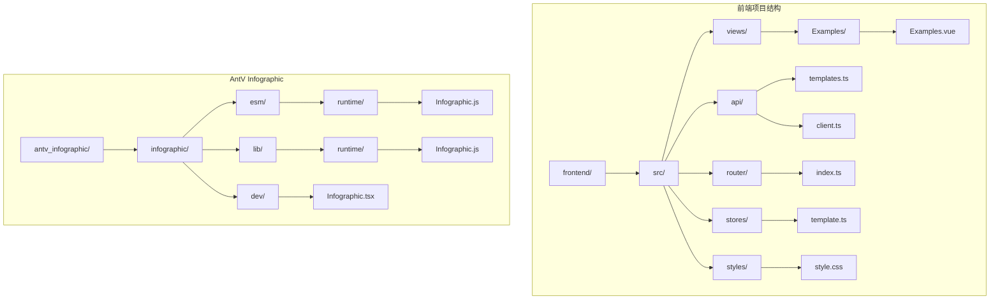
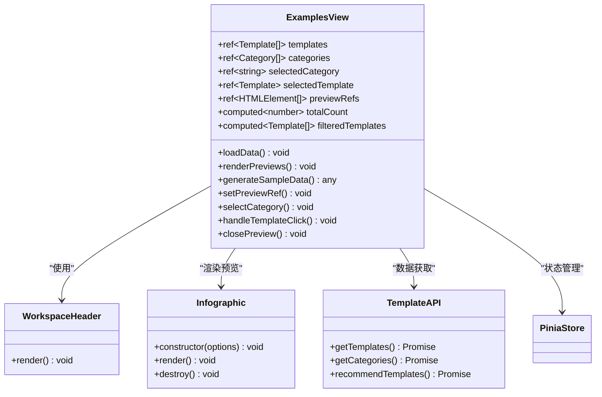
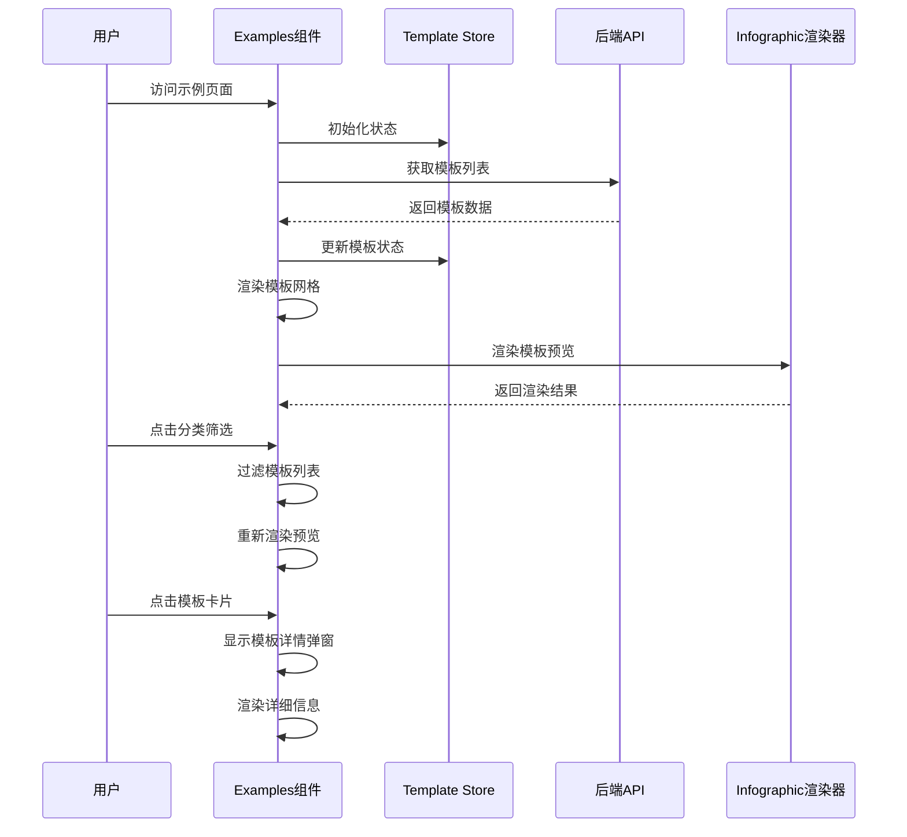
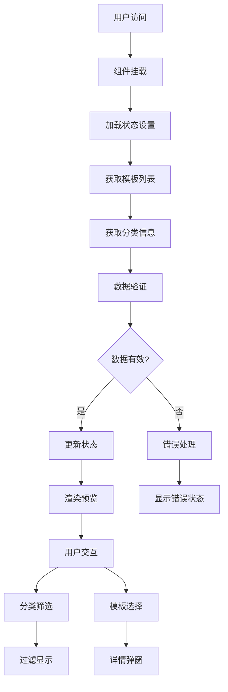
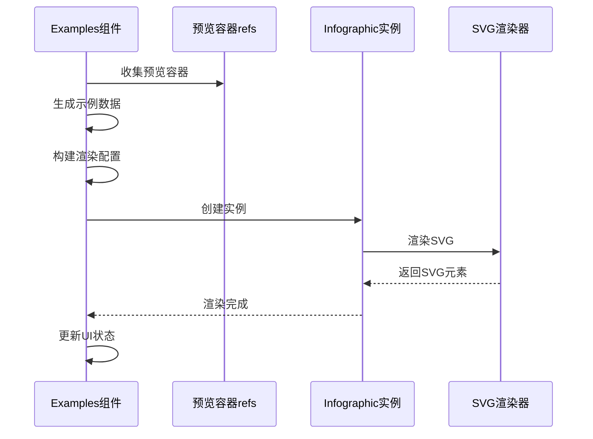
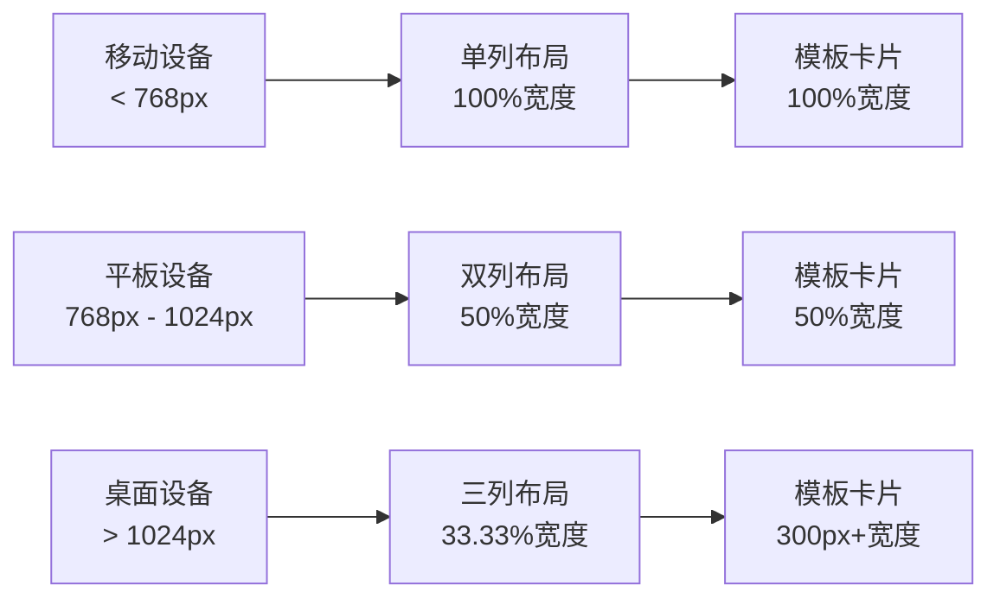
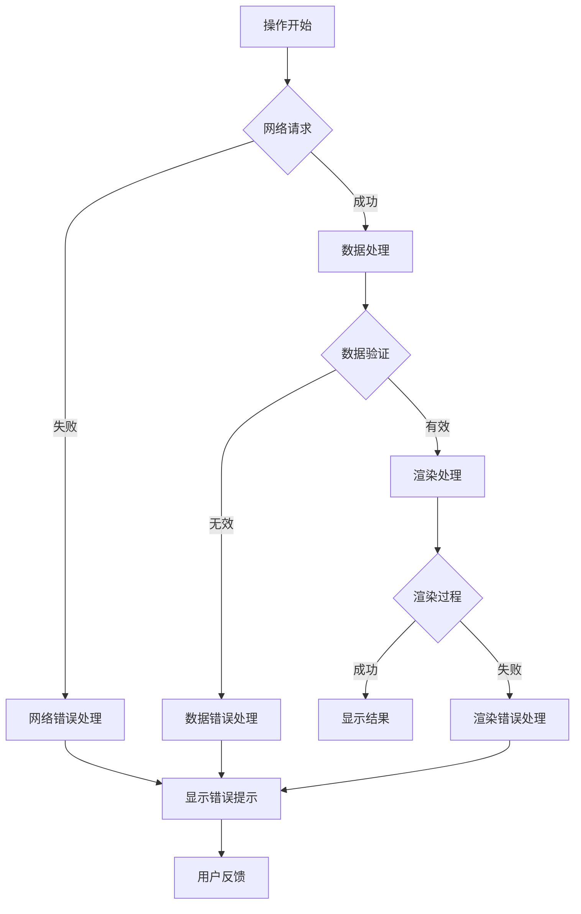
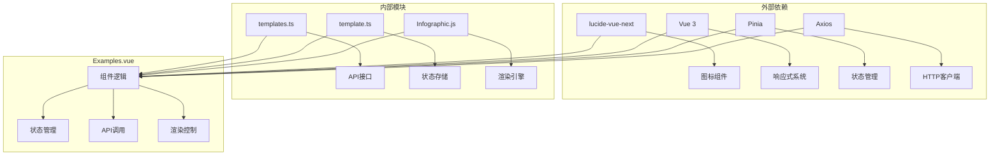

# 视图组件

<cite>
**本文档中引用的文件**
- [Examples.vue](file://frontend/src/views/Examples/Examples.vue)
- [templates.ts](file://frontend/src/api/templates.ts)
- [index.ts](file://frontend/src/router/index.ts)
- [template.ts](file://frontend/src/stores/template.ts)
- [main.ts](file://frontend/src/main.ts)
- [Infographic.tsx](file://antv_infographic\infographic\dev\src\Infographic.tsx)
- [Infographic.js](file://antv_infographic\infographic\lib\runtime\Infographic.js)
</cite>

## 目录
1. [简介](#简介)
2. [项目结构](#项目结构)
3. [核心组件](#核心组件)
4. [架构概览](#架构概览)
5. [详细组件分析](#详细组件分析)
6. [依赖关系分析](#依赖关系分析)
7. [性能考虑](#性能考虑)
8. [故障排除指南](#故障排除指南)
9. [结论](#结论)

## 简介

Examples.vue是信息图生成平台的核心视图组件，作为模板示例展示页面，负责组织和展示各类信息图模板示例。该组件采用Vue 3 Composition API构建，实现了动态模板加载、分类筛选、预览渲染等功能，为用户提供直观的模板浏览体验。

该组件的主要功能包括：
- 模板分类展示和筛选
- 动态模板预览渲染
- 响应式布局设计
- 与后端API的集成
- 错误处理和加载状态管理

## 项目结构

信息图生成平台的前端项目采用模块化架构，主要包含以下关键目录：

**图表来源**
- [Examples.vue](file://frontend/src/views/Examples/Examples.vue#L1-L50)
- [templates.ts](file://frontend/src/api/templates.ts#L1-L30)
- [index.ts](file://frontend/src/router/index.ts#L1-L20)

**章节来源**
- [Examples.vue](file://frontend/src/views/Examples/Examples.vue#L1-L100)
- [main.ts](file://frontend/src/main.ts#L1-L17)

## 核心组件

Examples.vue组件是整个模板展示系统的核心，它集成了多个子组件和功能模块：

### 组件层次结构

**图表来源**
- [Examples.vue](file://frontend/src/views/Examples/Examples.vue#L133-L200)
- [template.ts](file://frontend/src/stores/template.ts#L36-L102)

**章节来源**
- [Examples.vue](file://frontend/src/views/Examples/Examples.vue#L133-L200)
- [template.ts](file://frontend/src/stores/template.ts#L36-L102)

## 架构概览

Examples.vue组件采用了现代化的前端架构模式，结合了Vue 3的响应式系统、Composition API和Pinia状态管理：

**图表来源**
- [Examples.vue](file://frontend/src/views/Examples/Examples.vue#L240-L267)
- [template.ts](file://frontend/src/stores/template.ts#L44-L83)

## 详细组件分析

### 模板数据管理

Examples.vue组件通过多层次的数据管理策略来处理模板数据：

#### 数据流架构

**图表来源**
- [Examples.vue](file://frontend/src/views/Examples/Examples.vue#L240-L267)
- [template.ts](file://frontend/src/stores/template.ts#L44-L83)

#### 模板预览渲染机制

组件使用AntV Infographic库来渲染模板预览，实现了高效的SVG渲染：

**图表来源**
- [Examples.vue](file://frontend/src/views/Examples/Examples.vue#L269-L388)
- [Infographic.tsx](file://antv_infographic\infographic\dev\src\Infographic.tsx#L19-L46)

**章节来源**
- [Examples.vue](file://frontend/src/views/Examples/Examples.vue#L269-L388)

### 分类筛选系统

组件实现了智能的分类筛选功能，支持按模板类型进行过滤：

#### 分类映射表

| 分类代码 | 分类名称 | 图标 | 描述 |
|---------|---------|------|------|
| sequence | 顺序型 | 🔄 | 步骤流程类模板 |
| list | 列表型 | 📋 | 列表展示类模板 |
| comparison | 对比型 | ⚖️ | 对比分析类模板 |
| relation | 关系型 | 🔗 | 关联关系类模板 |
| hierarchy | 层级型 | 🏔️ | 层级结构类模板 |
| chart | 图表型 | 📊 | 数据图表类模板 |
| quadrant | 四象限型 | 🎯 | 四象限分析类模板 |

**章节来源**
- [Examples.vue](file://frontend/src/views/Examples/Examples.vue#L193-L202)

### 响应式布局设计

组件采用CSS Grid布局系统，确保在不同设备上的良好显示效果：

#### 布局断点策略

**图表来源**
- [Examples.vue](file://frontend/src/views/Examples/Examples.vue#L660-L664)

**章节来源**
- [Examples.vue](file://frontend/src/views/Examples/Examples.vue#L660-L664)

### 错误处理机制

组件实现了完善的错误处理策略，包括网络错误、渲染错误和数据错误：

#### 错误处理流程

**图表来源**
- [Examples.vue](file://frontend/src/views/Examples/Examples.vue#L262-L266)
- [template.ts](file://frontend/src/stores/template.ts#L57-L62)

**章节来源**
- [Examples.vue](file://frontend/src/views/Examples/Examples.vue#L262-L266)
- [template.ts](file://frontend/src/stores/template.ts#L57-L62)

## 依赖关系分析

Examples.vue组件与多个外部模块存在复杂的依赖关系：

**图表来源**
- [Examples.vue](file://frontend/src/views/Examples/Examples.vue#L134-L140)
- [main.ts](file://frontend/src/main.ts#L1-L17)

**章节来源**
- [Examples.vue](file://frontend/src/views/Examples/Examples.vue#L134-L140)
- [main.ts](file://frontend/src/main.ts#L1-L17)

## 性能考虑

Examples.vue组件在设计时充分考虑了性能优化：

### 渲染性能优化

- **虚拟滚动**: 使用CSS Grid实现高效的模板网格布局
- **懒加载**: 模板预览采用延迟渲染策略
- **防抖处理**: 分类切换时使用setTimeout避免频繁重渲染
- **内存管理**: 及时清理不再使用的Infographic实例

### 网络性能优化

- **批量请求**: 同时获取模板列表和分类信息
- **缓存策略**: 利用Pinia store进行状态缓存
- **错误恢复**: 实现自动重试机制

## 故障排除指南

### 常见问题及解决方案

#### 模板预览无法显示

**问题描述**: 模板卡片显示空白或加载动画持续不消失

**可能原因**:
1. 网络连接问题
2. 模板配置错误
3. Infographic渲染失败

**解决步骤**:
1. 检查网络连接状态
2. 查看浏览器控制台错误信息
3. 验证模板数据格式
4. 重启应用或清除缓存

#### 分类筛选失效

**问题描述**: 点击分类按钮后没有出现预期的筛选效果

**可能原因**:
1. 分类数据加载失败
2. 状态更新异常
3. DOM更新延迟

**解决步骤**:
1. 检查API响应状态
2. 验证分类数据结构
3. 强制刷新页面
4. 检查浏览器兼容性

**章节来源**
- [Examples.vue](file://frontend/src/views/Examples/Examples.vue#L222-L230)
- [Examples.vue](file://frontend/src/views/Examples/Examples.vue#L373-L387)

## 结论

Examples.vue组件作为信息图生成平台的核心视图组件，成功实现了以下目标：

### 主要成就

1. **用户体验优化**: 提供直观的模板浏览界面和流畅的交互体验
2. **技术架构先进**: 采用现代前端技术栈，确保代码的可维护性和扩展性
3. **性能表现优异**: 通过多种优化策略，确保在各种设备上的良好性能
4. **错误处理完善**: 实现了全面的错误处理机制，提高系统的稳定性

### 技术亮点

- **动态模板渲染**: 利用AntV Infographic库实现高质量的模板预览
- **响应式设计**: 完美适配不同屏幕尺寸和设备类型
- **状态管理**: 通过Pinia实现高效的状态管理和数据同步
- **路由集成**: 与Vue Router无缝集成，支持深度链接和SEO优化

### 未来发展方向

1. **性能进一步优化**: 考虑引入Web Workers进行后台渲染
2. **功能扩展**: 增加模板收藏、分享等社交功能
3. **个性化推荐**: 基于用户行为提供智能模板推荐
4. **多语言支持**: 扩展国际化功能，支持更多语言环境

Examples.vue组件展现了现代前端开发的最佳实践，为信息图生成平台提供了坚实的技术基础和优秀的用户体验。