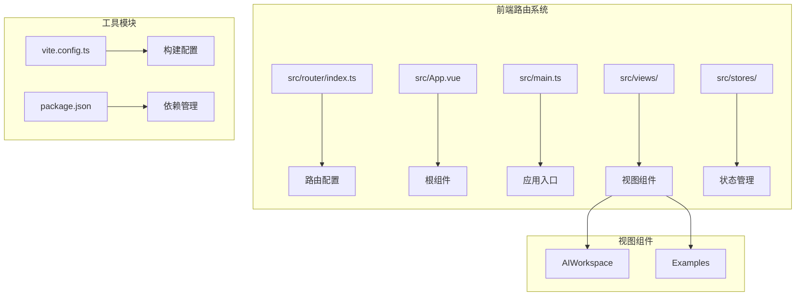
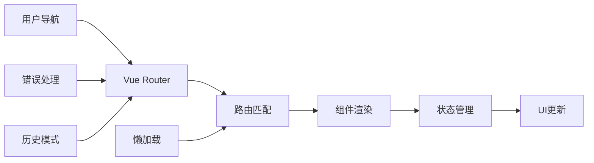
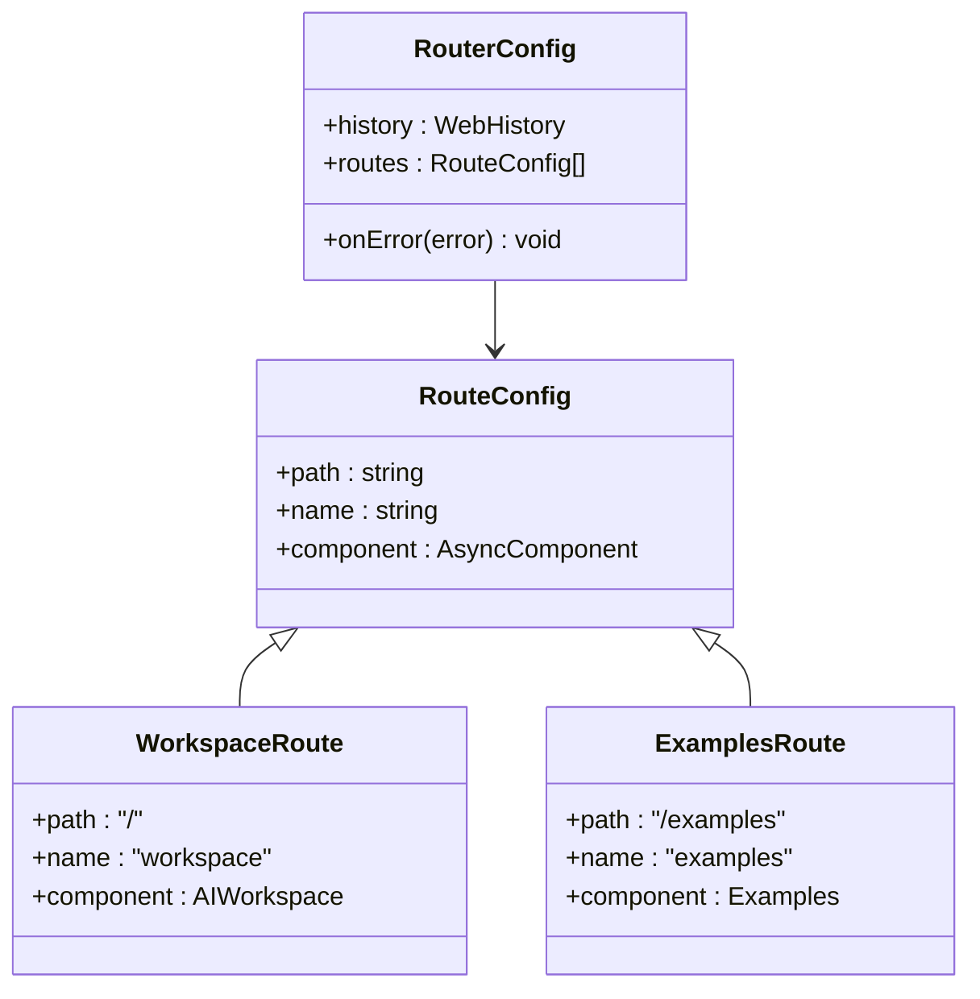
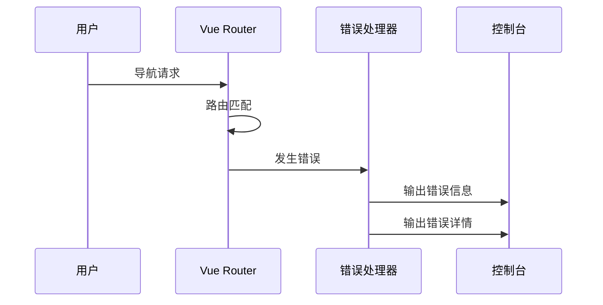
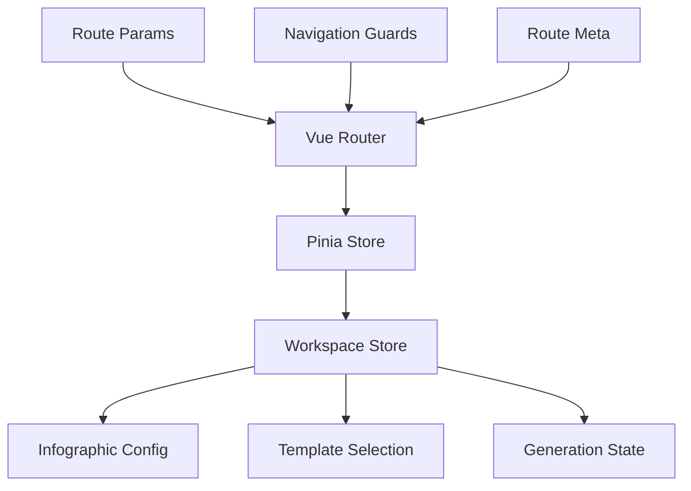
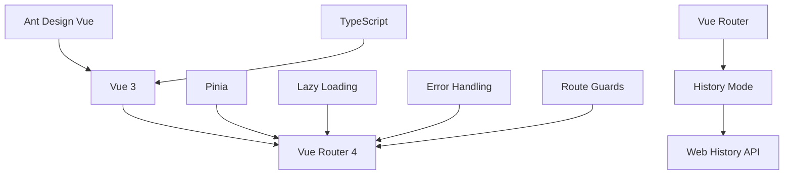

# 路由系统

<cite>
**本文档中引用的文件**
- [frontend/src/router/index.ts](file://frontend/src/router/index.ts)
- [frontend/src/App.vue](file://frontend/src/App.vue)
- [frontend/src/main.ts](file://frontend/src/main.ts)
- [frontend/src/views/AIWorkspace/AIWorkspace.vue](file://frontend/src/views/AIWorkspace/AIWorkspace.vue)
- [frontend/src/views/Examples/Examples.vue](file://frontend/src/views/Examples/Examples.vue)
- [frontend/vite.config.ts](file://frontend/vite.config.ts)
- [frontend/package.json](file://frontend/package.json)
- [frontend/src/stores/workspace.ts](file://frontend/src/stores/workspace.ts)
- [antv_infographic/infographic/site/src/hooks/usePendingRoute.ts](file://antv_infographic/infographic/site/src/hooks/usePendingRoute.ts)
- [antv_infographic/infographic/site/src/components/Layout/getRouteMeta.tsx](file://antv_infographic/infographic/site/src/components/Layout/getRouteMeta.tsx)
</cite>

## 目录
1. [简介](#简介)
2. [项目结构](#项目结构)
3. [核心组件](#核心组件)
4. [架构概览](#架构概览)
5. [详细组件分析](#详细组件分析)
6. [依赖关系分析](#依赖关系分析)
7. [性能考虑](#性能考虑)
8. [故障排除指南](#故障排除指南)
9. [结论](#结论)

## 简介

本文档详细描述了基于Vue Router的前端路由系统，该系统为GenAI图表项目提供了完整的导航解决方案。路由系统采用Vue 3和Vue Router 4构建，支持动态路由、懒加载、路由守卫和状态管理等现代前端特性。

## 项目结构

前端路由系统的核心文件组织如下：

**图表来源**
- [frontend/src/router/index.ts](file://frontend/src/router/index.ts#L1-L34)
- [frontend/src/App.vue](file://frontend/src/App.vue#L1-L39)
- [frontend/src/main.ts](file://frontend/src/main.ts#L1-L17)

**章节来源**
- [frontend/src/router/index.ts](file://frontend/src/router/index.ts#L1-L34)
- [frontend/src/App.vue](file://frontend/src/App.vue#L1-L39)
- [frontend/src/main.ts](file://frontend/src/main.ts#L1-L17)

## 核心组件

### 路由配置器

路由系统的核心配置位于[`src/router/index.ts`](file://frontend/src/router/index.ts#L1-L34)，它定义了两个主要路由：

1. **工作区路由** (`/`) - 显示AI工作区界面
2. **示例路由** (`/examples`) - 展示模板示例页面

每个路由都采用懒加载模式，通过动态导入实现按需加载。

### 应用根组件

[`src/App.vue`](file://frontend/src/App.vue#L1-L39)作为整个应用的根组件，包含唯一的`<router-view>`占位符，用于渲染匹配的路由组件。

### 应用入口点

[`src/main.ts`](file://frontend/src/main.ts#L1-L17)负责初始化Vue应用，注册Vue Router和Pinia状态管理，并挂载到DOM中。

**章节来源**
- [frontend/src/router/index.ts](file://frontend/src/router/index.ts#L6-L20)
- [frontend/src/App.vue](file://frontend/src/App.vue#L1-L5)
- [frontend/src/main.ts](file://frontend/src/main.ts#L1-L17)

## 架构概览

路由系统采用模块化架构，支持以下核心功能：

**图表来源**
- [frontend/src/router/index.ts](file://frontend/src/router/index.ts#L6-L20)
- [frontend/src/main.ts](file://frontend/src/main.ts#L10-L14)

## 详细组件分析

### Vue Router配置

路由系统使用Vue Router 4的最新特性，配置如下：

#### 基础路由配置

**图表来源**
- [frontend/src/router/index.ts](file://frontend/src/router/index.ts#L6-L20)

#### 懒加载实现

路由系统采用动态导入实现懒加载：

- **工作区组件**: [`() => import('@/views/AIWorkspace/AIWorkspace.vue')`](file://frontend/src/router/index.ts#L12)
- **示例组件**: [`() => import('@/views/Examples/Examples.vue')`](file://frontend/src/router/index.ts#L17)

这种实现方式具有以下优势：
- 减少初始包大小
- 提高首屏加载速度
- 按需加载资源

#### 错误处理机制

路由系统实现了全局错误处理：

**图表来源**
- [frontend/src/router/index.ts](file://frontend/src/router/index.ts#L22-L31)

**章节来源**
- [frontend/src/router/index.ts](file://frontend/src/router/index.ts#L6-L31)

### 视图组件分析

#### AI工作区组件

[`AIWorkspace.vue`](file://frontend/src/views/AIWorkspace/AIWorkspace.vue#L1-L136)是一个复杂的单页应用组件，包含：

- **头部导航**: `WorkspaceHeader` 组件
- **英雄区域**: `WorkspaceHero` 组件  
- **网格布局**: 输入面板和预览面板的响应式布局
- **状态管理**: 集成Pinia store进行状态管理

#### 示例组件

[`Examples.vue`](file://frontend/src/views/Examples/Examples.vue#L1-L927)展示了模板示例功能：

- **分类筛选**: 支持按模板类别过滤
- **模板网格**: 响应式卡片布局
- **预览功能**: 实时渲染模板预览
- **模态框**: 详细信息展示

**章节来源**
- [frontend/src/views/AIWorkspace/AIWorkspace.vue](file://frontend/src/views/AIWorkspace/AIWorkspace.vue#L1-L136)
- [frontend/src/views/Examples/Examples.vue](file://frontend/src/views/Examples/Examples.vue#L1-L927)

### 状态管理集成

路由系统与Pinia状态管理紧密集成：

**图表来源**
- [frontend/src/main.ts](file://frontend/src/main.ts#L10-L14)
- [frontend/src/stores/workspace.ts](file://frontend/src/stores/workspace.ts#L1-L74)

**章节来源**
- [frontend/src/stores/workspace.ts](file://frontend/src/stores/workspace.ts#L1-L74)

### 构建配置

Vite构建配置支持路由系统的开发和生产环境：

#### 别名配置
- `@`: 指向`src`目录
- `@antv/infographic`: 指向图表库源码

#### 开发服务器配置
- 端口: 5173
- 代理配置: `/api` 请求转发到后端服务

**章节来源**
- [frontend/vite.config.ts](file://frontend/vite.config.ts#L1-L25)
- [frontend/package.json](file://frontend/package.json#L1-L27)

## 依赖关系分析

路由系统的依赖关系图：

**图表来源**
- [frontend/package.json](file://frontend/package.json#L18-L24)
- [frontend/src/main.ts](file://frontend/src/main.ts#L1-L17)

**章节来源**
- [frontend/package.json](file://frontend/package.json#L1-L27)
- [frontend/src/main.ts](file://frontend/src/main.ts#L1-L17)

## 性能考虑

### 代码分割策略

路由系统采用多种性能优化策略：

1. **懒加载**: 所有路由组件都采用动态导入
2. **按需加载**: 只在需要时加载对应模块
3. **缓存机制**: Vue Router内置组件缓存
4. **预加载**: 关键路由组件的预加载

### 内存管理

- 组件卸载时自动清理事件监听器
- 路由切换时自动销毁未使用的组件实例
- 使用`keep-alive`包装需要缓存的组件

## 故障排除指南

### 常见导航问题

#### 路由匹配失败

**症状**: 导航到不存在的路由时显示空白页面

**解决方案**:
1. 检查路由配置中的路径拼写
2. 确认组件导出正确
3. 验证路由名称唯一性

#### 懒加载失败

**症状**: 组件无法正常加载或出现404错误

**解决方案**:
1. 检查组件路径是否正确
2. 验证Webpack/Vite别名配置
3. 确认文件扩展名正确

#### 状态同步问题

**症状**: 路由变化时状态未更新

**解决方案**:
1. 检查Pinia store的响应式设置
2. 确认路由守卫逻辑正确
3. 验证组件生命周期钩子

### 调试技巧

#### 路由状态监控

使用Vue DevTools监控路由状态：
- 当前路由信息
- 路由参数和查询
- 路由元信息

#### 错误日志分析

路由系统提供详细的错误处理：
- 错误堆栈跟踪
- 错误详情输出
- 自动错误上报

**章节来源**
- [frontend/src/router/index.ts](file://frontend/src/router/index.ts#L22-L31)

## 结论

GenAI图表项目的路由系统展现了现代Vue应用的最佳实践：

1. **模块化设计**: 清晰的职责分离和组件化架构
2. **性能优化**: 懒加载和代码分割策略
3. **用户体验**: 平滑的导航过渡和错误处理
4. **可维护性**: 良好的代码结构和类型安全

该路由系统为项目提供了稳定、高效的导航基础设施，支持复杂的应用场景和未来的功能扩展。通过合理的配置和最佳实践，确保了应用的高性能和良好的用户体验。