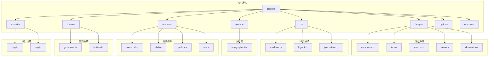
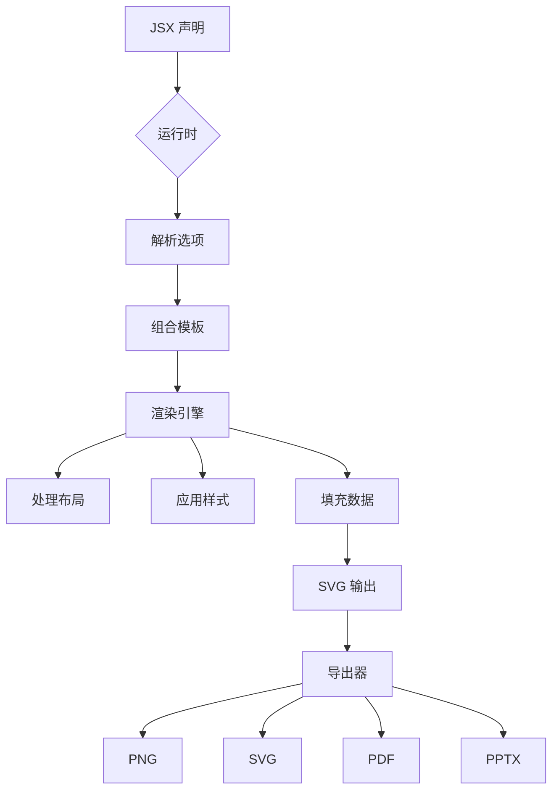
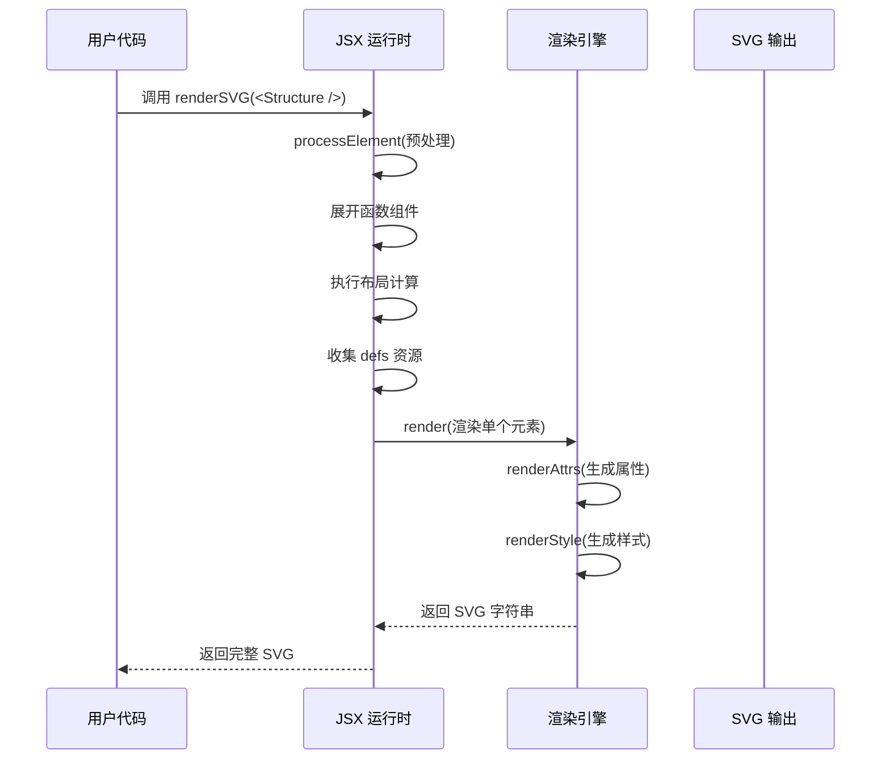
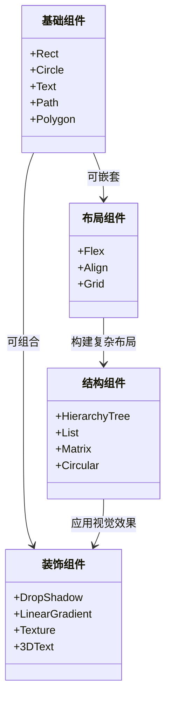
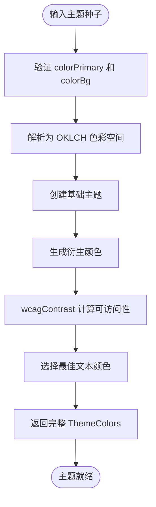
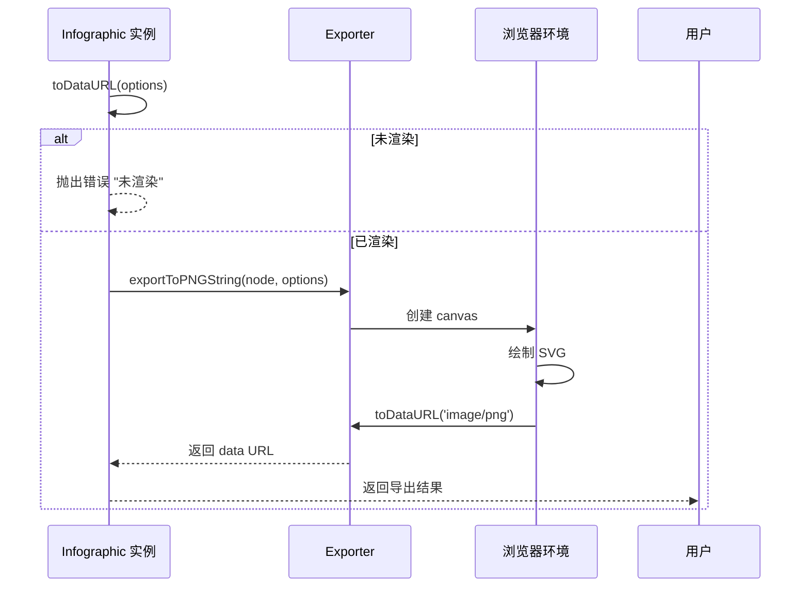
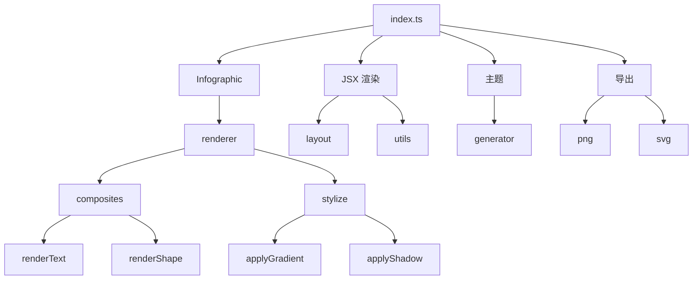

# 可视化引擎

<cite>
**本文档中引用的文件**  
- [index.ts](file://antv_infographic\infographic\src\index.ts)
- [Infographic.tsx](file://antv_infographic\infographic\src\runtime\Infographic.tsx)
- [renderer.ts](file://antv_infographic\infographic\src\jsx\renderer.ts)
- [renderer.ts](file://antv_infographic\infographic\src\renderer\renderer.ts)
- [generator.ts](file://antv_infographic\infographic\src\themes\generator.ts)
- [exporter/index.ts](file://antv_infographic\infographic\src\exporter\index.ts)
- [jsx/index.ts](file://antv_infographic\infographic\src\jsx\index.ts)
- [themes/index.ts](file://antv_infographic\infographic\src\themes\index.ts)
- [renderer/index.ts](file://antv_infographic\infographic\src\renderer\index.ts)
</cite>

## 目录
1. [简介](#简介)
2. [项目结构](#项目结构)
3. [核心组件](#核心组件)
4. [架构概述](#架构概述)
5. [详细组件分析](#详细组件分析)
6. [依赖分析](#依赖分析)
7. [性能考虑](#性能考虑)
8. [故障排除指南](#故障排除指南)
9. [结论](#结论)

## 简介
AntV Infographic 是一个基于 JSX 的声明式信息图可视化引擎，支持通过组件化方式构建复杂的信息图表。该库提供了一套完整的渲染机制，将 JSX 描述转换为 SVG 输出，并支持多种格式导出（如 PNG、PDF、PPTX）。其架构围绕组件系统、主题系统、样式化机制和多格式导出能力构建，具备良好的扩展性与可定制性。

## 项目结构
AntV Infographic 的项目结构清晰地划分了功能模块，主要包括设计组件、JSX 渲染器、运行时、导出器、主题系统、资源加载器等。源码位于 `src` 目录下，按功能组织为多个子模块。

**Diagram sources**
- [index.ts](file://antv_infographic\infographic\src\index.ts)

**Section sources**
- [index.ts](file://antv_infographic\infographic\src\index.ts)

## 核心组件

AntV Infographic 的核心组件包括 JSX 渲染器、运行时容器、主题生成器和导出器。这些组件协同工作，实现从声明式描述到最终图像输出的完整流程。

**Section sources**
- [index.ts](file://antv_infographic\infographic\src\index.ts)
- [Infographic.tsx](file://antv_infographic\infographic\src\runtime\Infographic.tsx)
- [renderer.ts](file://antv_infographic\infographic\src\jsx\renderer.ts)

## 架构概述

AntV Infographic 的整体架构分为四层：声明层（JSX）、运行时层、渲染层和输出层。用户通过 JSX 声明信息图结构，运行时解析配置并组合模板，渲染引擎执行实际的 SVG 渲染与样式应用，最后由导出器生成目标格式。

**Diagram sources**
- [Infographic.tsx](file://antv_infographic\infographic\src\runtime\Infographic.tsx)
- [renderer.ts](file://antv_infographic\infographic\src\jsx\renderer.ts)
- [renderer.ts](file://antv_infographic\infographic\src\renderer\renderer.ts)

## 详细组件分析

### JSX 渲染机制分析

AntV Infographic 使用自定义的 JSX 运行时来处理信息图的声明式构建。其核心是 `renderSVG` 函数，负责将 JSX 元素树转换为 SVG 字符串。

**Diagram sources**
- [renderer.ts](file://antv_infographic\infographic\src\jsx\renderer.ts)

#### 组件系统分类

AntV Infographic 的组件系统分为四类：

**Diagram sources**
- [designs/components](file://antv_infographic\infographic\src\designs\components)
- [designs/layouts](file://antv_infographic\infographic\src\designs\layouts)

### 主题与样式化机制

主题系统通过 `generateThemeColors` 函数动态生成配色方案，基于主色和背景色推导出完整的调色板，确保视觉一致性与可访问性。

**Diagram sources**
- [generator.ts](file://antv_infographic\infographic\src\themes\generator.ts)

### 多格式导出流程

导出功能通过 `exportToPNGString` 和 `exportToSVGString` 实现，支持将 SVG 节点转换为目标格式。

**Diagram sources**
- [Infographic.tsx](file://antv_infographic\infographic\src\runtime\Infographic.tsx)
- [exporter/index.ts](file://antv_infographic\infographic\src\exporter\index.ts)

**Section sources**
- [Infographic.tsx](file://antv_infographic\infographic\src\runtime\Infographic.tsx)
- [exporter/index.ts](file://antv_infographic\infographic\src\exporter\index.ts)

## 依赖分析

AntV Infographic 的模块间依赖关系清晰，核心依赖集中在 JSX 渲染、主题生成和导出功能上。

**Diagram sources**
- [index.ts](file://antv_infographic\infographic\src\index.ts)
- [renderer/index.ts](file://antv_infographic\infographic\src\renderer\index.ts)

**Section sources**
- [index.ts](file://antv_infographic\infographic\src\index.ts)
- [renderer/index.ts](file://antv_infographic\infographic\src\renderer\index.ts)

## 性能考虑

AntV Infographic 在性能方面采用了多项优化策略：

1. **虚拟 DOM 预处理**：在 `processElement` 中对 JSX 树进行预处理，展开函数组件和布局组件，减少运行时开销。
2. **渲染批处理**：通过 MutationObserver 延迟字体加载和视图设置，避免重复重绘。
3. **缓存机制**：主题颜色、字体、调色板等资源注册后全局缓存，避免重复计算。
4. **轻量级渲染器**：直接操作 SVG 字符串而非真实 DOM，提升渲染效率。

这些策略共同确保了在复杂信息图场景下的流畅渲染性能。

## 故障排除指南

常见问题及解决方案：

**Section sources**
- [Infographic.tsx](file://antv_infographic\infographic\src\runtime\Infographic.tsx)
- [renderer.ts](file://antv_infographic\infographic\src\jsx\renderer.ts)
- [renderer.ts](file://antv_infographic\infographic\src\renderer\renderer.ts)

## 结论

AntV Infographic 构建了一个完整的信息图可视化引擎，通过 JSX 声明式语法、组件化设计、动态主题系统和多格式导出能力，实现了高效、灵活的信息图生成。其架构清晰，模块职责分明，具备良好的扩展性，支持自定义组件和渲染器开发，适用于各类数据可视化场景。