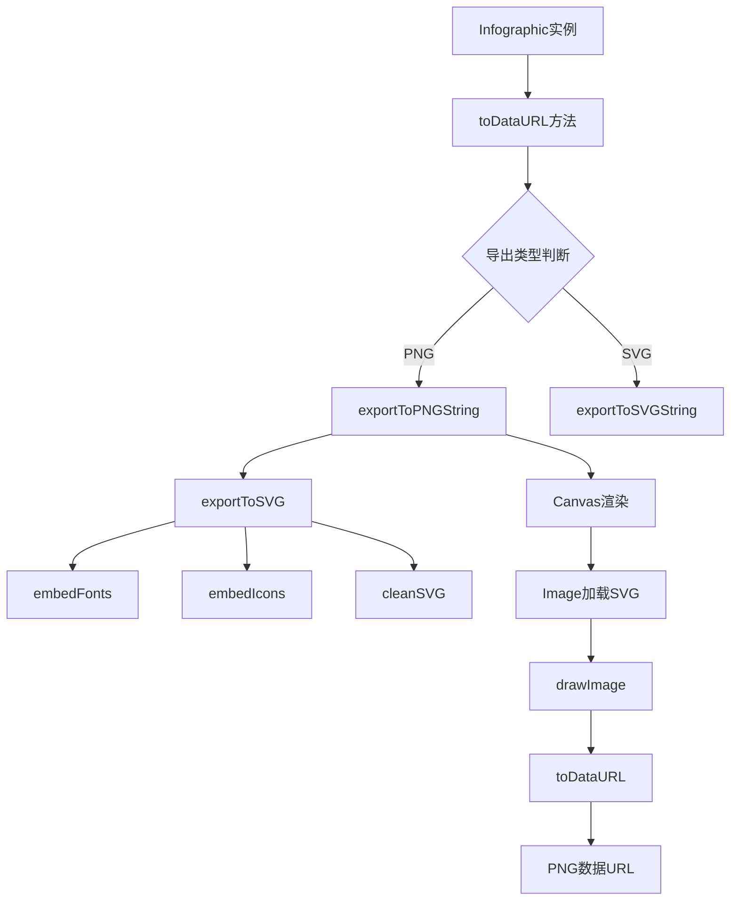
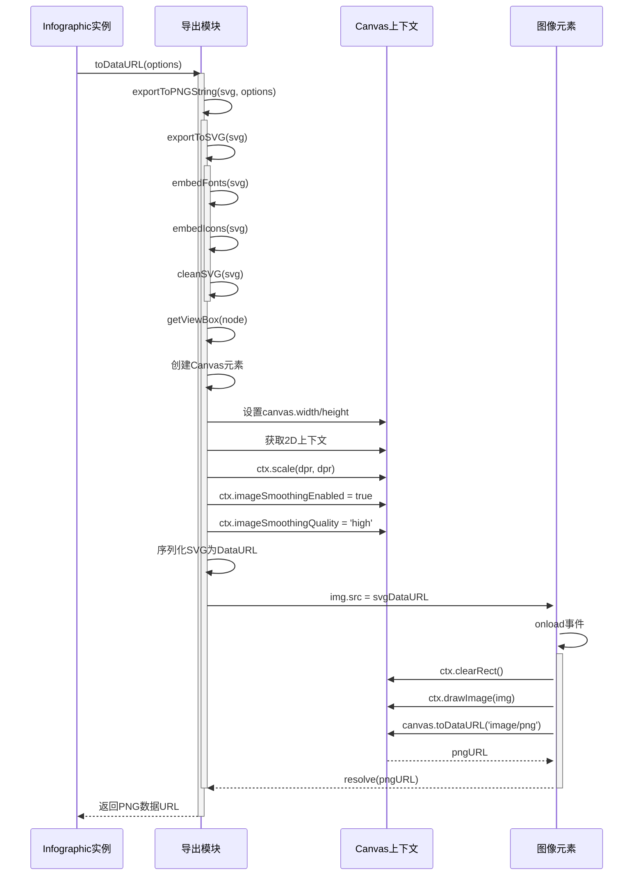
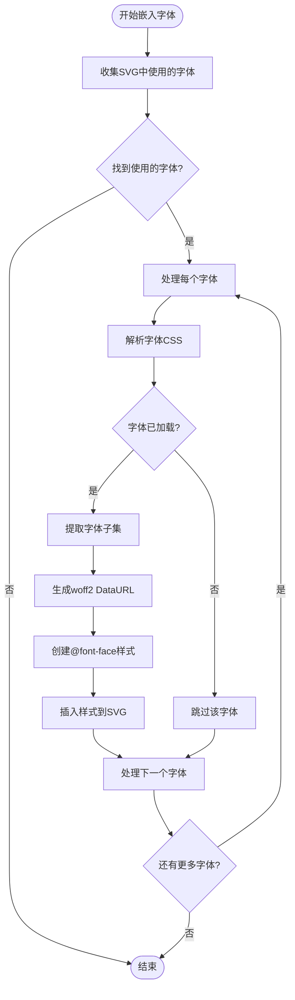
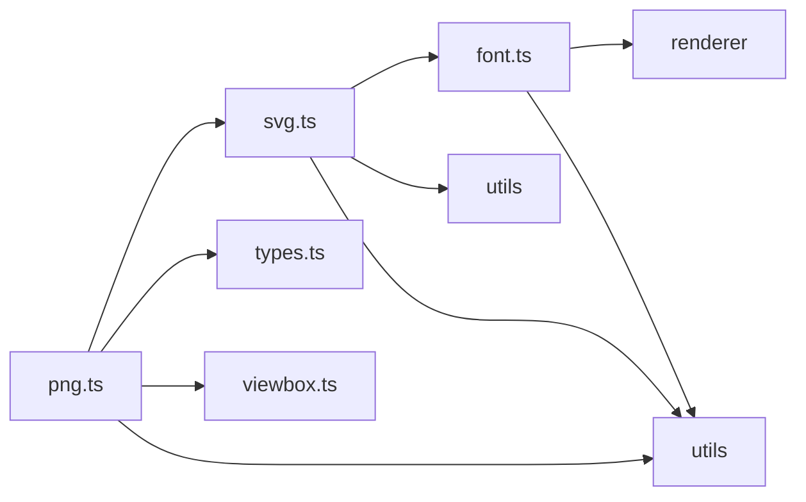

# PNG导出

<cite>
**本文档引用的文件**   
- [png.ts](file://antv_infographic\infographic\src\exporter\png.ts)
- [types.ts](file://antv_infographic\infographic\src\exporter\types.ts)
- [svg.ts](file://antv_infographic\infographic\src\exporter\svg.ts)
- [font.ts](file://antv_infographic\infographic\src\exporter\font.ts)
- [viewbox.ts](file://antv_infographic\infographic\src\utils\viewbox.ts)
- [Infographic.tsx](file://antv_infographic\infographic\src\runtime\Infographic.tsx)
</cite>

## 目录
1. [简介](#简介)
2. [核心组件](#核心组件)
3. [架构概述](#架构概述)
4. [详细组件分析](#详细组件分析)
5. [依赖分析](#依赖分析)
6. [性能考虑](#性能考虑)
7. [故障排除指南](#故障排除指南)
8. [结论](#结论)

## 简介
本文档详细介绍了基于Canvas的PNG导出功能的技术实现，重点讲解了如何将矢量图形渲染到Canvas并转换为PNG位图的完整流程。文档涵盖了分辨率设置、背景色配置、跨域资源处理等关键环节，提供了API使用示例和性能优化建议，特别是针对大尺寸图像导出的内存管理策略。同时说明了错误处理机制，如字体加载失败或图像编码异常的应对方案，以及如何通过配置选项控制图像质量与文件大小的平衡。

## 核心组件

PNG导出功能的核心是`exportToPNGString`函数，该函数负责将SVG元素转换为PNG数据URL。此功能依赖于SVG导出模块和字体嵌入功能，确保导出的图像包含所有必要的资源和样式。

**核心组件来源**
- [png.ts](file://antv_infographic\infographic\src\exporter\png.ts#L5-L58)
- [types.ts](file://antv_infographic\infographic\src\exporter\types.ts#L10-L17)

## 架构概述

PNG导出功能的架构基于分层设计，从上层API调用到底层Canvas渲染，各组件协同工作完成图像转换任务。



**图表来源**
- [png.ts](file://antv_infographic\infographic\src\exporter\png.ts#L5-L58)
- [svg.ts](file://antv_infographic\infographic\src\exporter\svg.ts#L14-L31)
- [font.ts](file://antv_infographic\infographic\src\exporter\font.ts#L23-L88)
- [Infographic.tsx](file://antv_infographic\infographic\src\runtime\Infographic.tsx#L78-L85)

## 详细组件分析

### PNG导出流程分析
PNG导出流程从SVG元素开始，经过一系列处理步骤，最终生成PNG数据URL。流程包括SVG预处理、Canvas创建、图像渲染和数据编码等关键环节。

#### PNG导出类图
```mermaid
classDiagram
class exportToPNGString {
+exportToPNGString(svg : SVGSVGElement, options : Omit<PNGExportOptions, 'type'>) : Promise<string>
}
class exportToSVG {
+exportToSVG(svg : SVGSVGElement, options : Omit<SVGExportOptions, 'type'>) : Promise<SVGSVGElement>
}
class embedFonts {
+embedFonts(svg : SVGSVGElement, embedResources : boolean) : Promise<void>
}
class getViewBox {
+getViewBox(svg : SVGSVGElement) : {x : number, y : number, width : number, height : number}
}
exportToPNGString --> exportToSVG : "调用"
exportToPNGString --> getViewBox : "调用"
exportToSVG --> embedFonts : "调用"
exportToSVG --> embedIcons : "调用"
exportToSVG --> cleanSVG : "调用"
```

**图表来源**
- [png.ts](file://antv_infographic\infographic\src\exporter\png.ts#L5-L58)
- [svg.ts](file://antv_infographic\infographic\src\exporter\svg.ts#L14-L31)
- [font.ts](file://antv_infographic\infographic\src\exporter\font.ts#L23-L88)
- [viewbox.ts](file://antv_infographic\infographic\src\utils\viewbox.ts#L1-L12)

#### PNG导出序列图


**图表来源**
- [png.ts](file://antv_infographic\infographic\src\exporter\png.ts#L5-L58)
- [svg.ts](file://antv_infographic\infographic\src\exporter\svg.ts#L14-L31)
- [Infographic.tsx](file://antv_infographic\infographic\src\runtime\Infographic.tsx#L78-L85)

### 字体嵌入分析
字体嵌入功能确保导出的PNG图像包含正确的字体样式，避免因字体缺失导致的渲染问题。

#### 字体嵌入流程图


**图表来源**
- [font.ts](file://antv_infographic\infographic\src\exporter\font.ts#L23-L88)
- [png.ts](file://antv_infographic\infographic\src\exporter\png.ts#L10-L11)

## 依赖分析

PNG导出功能依赖于多个模块和外部资源，这些依赖关系确保了功能的完整性和可靠性。



**图表来源**
- [png.ts](file://antv_infographic\infographic\src\exporter\png.ts#L1-L3)
- [svg.ts](file://antv_infographic\infographic\src\exporter\svg.ts#L1-L3)
- [font.ts](file://antv_infographic\infographic\src\exporter\font.ts#L1-L5)

**组件来源**
- [png.ts](file://antv_infographic\infographic\src\exporter\png.ts#L1-L58)
- [svg.ts](file://antv_infographic\infographic\src\exporter\svg.ts#L1-L194)
- [font.ts](file://antv_infographic\infographic\src\exporter\font.ts#L1-L274)
- [types.ts](file://antv_infographic\infographic\src\exporter\types.ts#L1-L20)
- [viewbox.ts](file://antv_infographic\infographic\src\utils\viewbox.ts#L1-L13)

## 性能考虑

PNG导出功能在处理大尺寸图像时需要特别注意内存管理和性能优化。通过合理的DPR设置和资源处理策略，可以平衡图像质量和文件大小。

- **DPR设置**: 默认使用`devicePixelRatio`或2，可根据需要调整以平衡清晰度和文件大小
- **内存管理**: 大尺寸图像导出时，建议分块处理或降低DPR以减少内存占用
- **缓存机制**: 字体数据URL使用Map缓存，避免重复加载相同字体
- **异步处理**: 所有操作均采用异步方式，避免阻塞主线程

**性能相关来源**
- [png.ts](file://antv_infographic\infographic\src\exporter\png.ts#L9-L10)
- [font.ts](file://antv_infographic\infographic\src\exporter\font.ts#L21-L22)

## 故障排除指南

### 常见问题及解决方案

#### 字体加载失败
当字体加载失败时，系统会捕获错误并拒绝Promise，返回相应的错误信息。

**错误处理来源**
- [font.ts](file://antv_infographic\infographic\src\exporter\font.ts#L255-L258)
- [png.ts](file://antv_infographic\infographic\src\exporter\png.ts#L49-L51)

#### 图像编码异常
图像编码过程中可能出现上下文获取失败或图像加载错误，系统会相应地处理这些异常情况。

**异常处理来源**
- [png.ts](file://antv_infographic\infographic\src\exporter\png.ts#L21-L23)
- [png.ts](file://antv_infographic\infographic\src\exporter\png.ts#L49-L51)

## 结论
PNG导出功能通过将SVG元素渲染到Canvas并转换为PNG数据URL，实现了高质量的图像导出。该功能充分考虑了分辨率设置、字体嵌入、资源处理等关键环节，提供了灵活的配置选项来平衡图像质量和文件大小。通过异步处理和缓存机制，确保了良好的性能表现。在实际使用中，开发者可以根据具体需求调整DPR设置和导出参数，以获得最佳的导出效果。