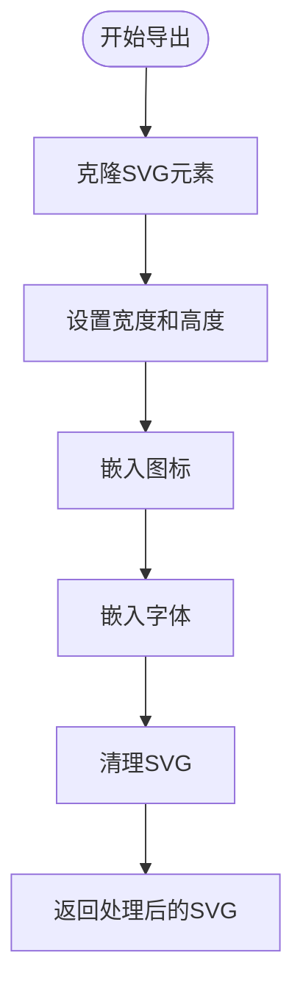

# SVG导出

<cite>
**本文档引用的文件**
- [svg.ts](file://antv_infographic\infographic\src\exporter\svg.ts)
- [types.ts](file://antv_infographic\infographic\src\exporter\types.ts)
- [svg.ts](file://antv_infographic\infographic\src\utils\svg.ts)
- [font.ts](file://antv_infographic\infographic\src\exporter\font.ts)
- [viewbox.ts](file://antv_infographic\infographic\src\utils\viewbox.ts)
</cite>

## 目录
1. [简介](#简介)
2. [核心实现机制](#核心实现机制)
3. [API接口说明](#api接口说明)
4. [复杂图形效果支持](#复杂图形效果支持)
5. [兼容性与优化策略](#兼容性与优化策略)
6. [使用示例](#使用示例)

## 简介
AntV Infographic提供了将渲染树序列化为标准SVG文档的功能，允许用户将信息图表导出为可缩放矢量图形格式。该功能主要通过`exporter/svg.ts`模块实现，支持将SVG元素及其样式、字体、图标等资源完整地嵌入到导出的SVG文件中。前端导出保持`foreignObject`以确保浏览器兼容性，而后端PPTX导出则会将其转换为标准SVG文本元素。

## 核心实现机制

SVG导出功能的核心实现包括元素遍历、属性序列化和样式内联等关键技术。首先，系统会克隆原始SVG元素并设置其宽度和高度属性。然后，通过`embedIcons`函数将使用的图标嵌入到SVG的`defs`部分，确保所有图标资源都被包含在导出的文件中。接着，`embedFonts`函数负责收集并嵌入使用的字体资源，包括从CSS中解析`@font-face`规则，并将字体文件转换为DataURL格式嵌入SVG中。最后，`cleanSVG`函数会清理不必要的属性和元素，如移除按钮组和临时容器，以及清除所有元素的数据集。

**本节来源**
- [svg.ts](file://antv_infographic\infographic\src\exporter\svg.ts#L1-L32)
- [font.ts](file://antv_infographic\infographic\src\exporter\font.ts#L23-L88)

## API接口说明

SVG导出功能提供了两个主要的API函数：`exportToSVGString`和`exportToSVG`。`exportToSVGString`函数接受一个`SVGSVGElement`和可选的`SVGExportOptions`参数，返回一个包含SVG数据的DataURL字符串。`exportToSVG`函数则返回处理后的`SVGSVGElement`对象，可用于进一步操作或直接序列化。

`SVGExportOptions`接口定义了导出选项，目前仅包含一个`embedResources`布尔值属性，默认为`true`，表示是否将远程资源（如字体和图标）嵌入到SVG中。



**图表来源**
- [svg.ts](file://antv_infographic\infographic\src\exporter\svg.ts#L5-L32)

**本节来源**
- [svg.ts](file://antv_infographic\infographic\src\exporter\svg.ts#L5-L32)
- [types.ts](file://antv_infographic\infographic\src\exporter\types.ts#L1-L8)

## 复杂图形效果支持

SVG导出功能支持多种复杂图形效果，包括渐变和阴影。对于渐变效果，系统通过`applyGradientStyle`函数将渐变配置应用到SVG元素上。对于阴影效果，`DropShadow`组件定义了一个滤镜，使用`feDropShadow`元素来实现阴影效果。这些效果的定义通常被放置在SVG的`defs`部分，并通过引用ID应用到相应的图形元素上。

**本节来源**
- [svg.ts](file://antv_infographic\infographic\src\exporter\svg.ts#L106-L175)
- [DropShadow.js](file://antv_infographic\infographic\esm\designs\defs\DropShadow.js#L1-L5)
- [gradient.d.ts](file://antv_infographic\infographic\esm\renderer\stylize\gradient.d.ts#L1-L2)

## 兼容性与优化策略

为了确保SVG在不同环境下的渲染一致性，导出过程中采取了多项措施。首先，通过`convertForeignObjectsToText`函数将`foreignObject`中的文本转换为标准SVG`text`元素，这有助于提高在PowerPoint等不支持`foreignObject`的SVG查看器中的兼容性。其次，通过将字体和图标资源嵌入SVG中，避免了外部资源加载失败的问题。此外，通过清理不必要的属性和元素，减小了SVG文件的大小，提高了加载性能。

**本节来源**
- [svg.ts](file://antv_infographic\infographic\src\exporter\svg.ts#L106-L175)
- [font.ts](file://antv_infographic\infographic\src\exporter\font.ts#L23-L88)

## 使用示例

以下是一个使用SVG导出功能的示例：

```typescript
import { exportToSVGString } from '@antv/infographic/exporter';

// 假设svgElement是需要导出的SVG元素
const svgElement = document.querySelector('svg');

// 导出SVG字符串
exportToSVGString(svgElement, { embedResources: true })
  .then(svgString => {
    // 使用导出的SVG字符串
    console.log(svgString);
  })
  .catch(error => {
    console.error('导出失败:', error);
  });
```

此示例展示了如何使用`exportToSVGString`函数将SVG元素导出为包含所有资源的DataURL字符串。通过设置`embedResources`为`true`，确保了所有外部资源都被嵌入到导出的SVG中。

**本节来源**
- [svg.ts](file://antv_infographic\infographic\src\exporter\svg.ts#L5-L12)