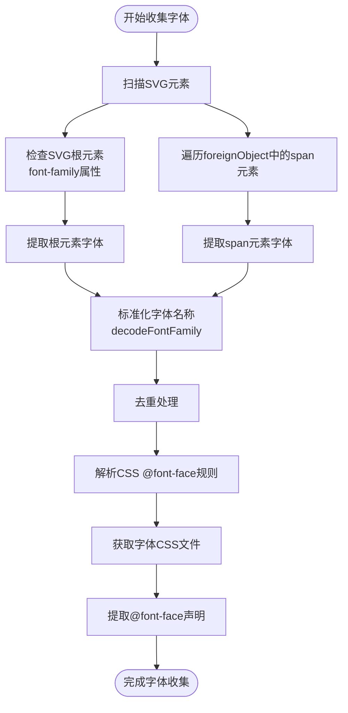
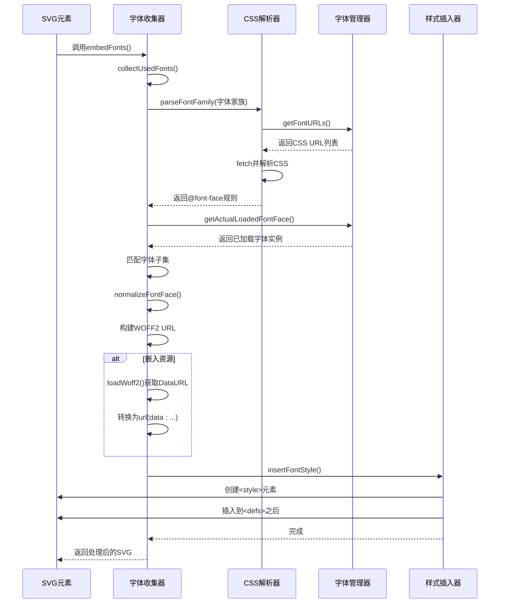
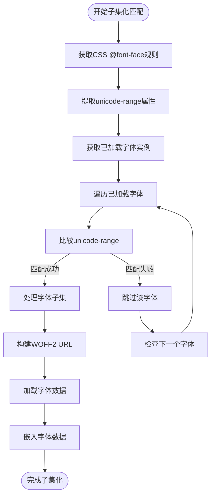
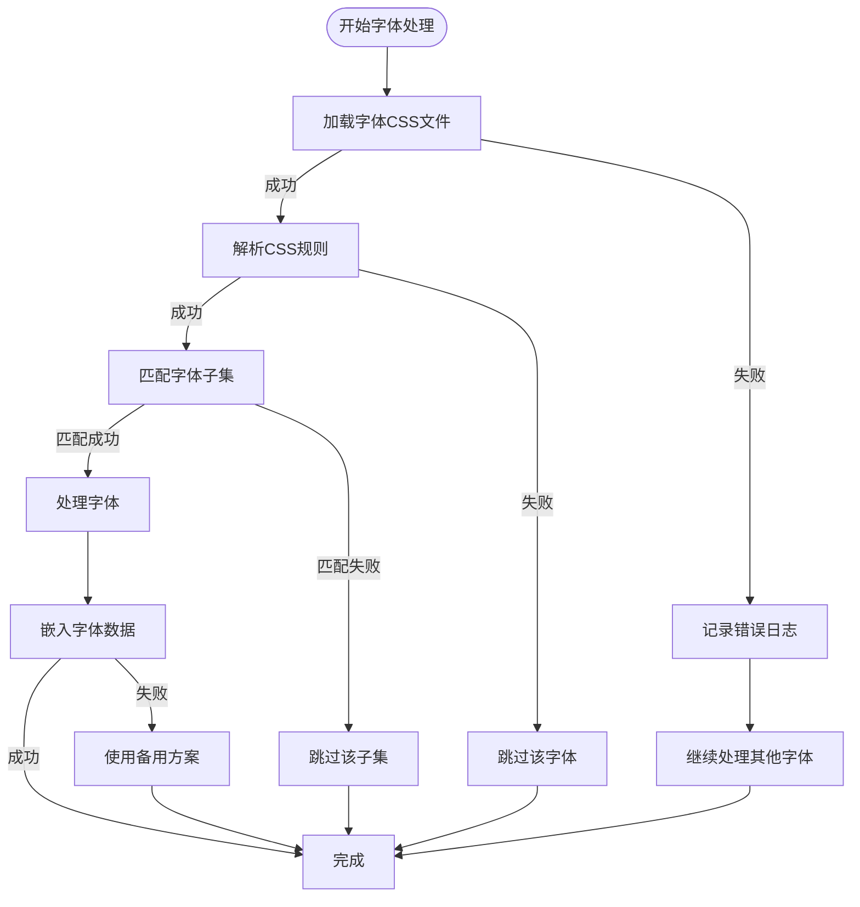
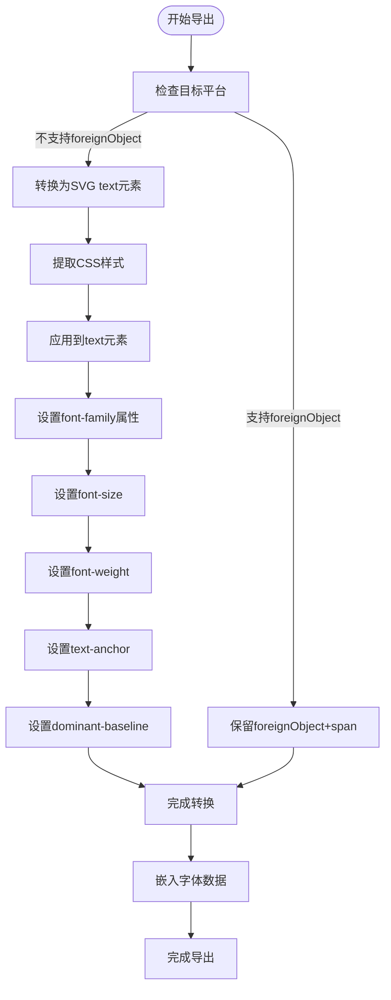
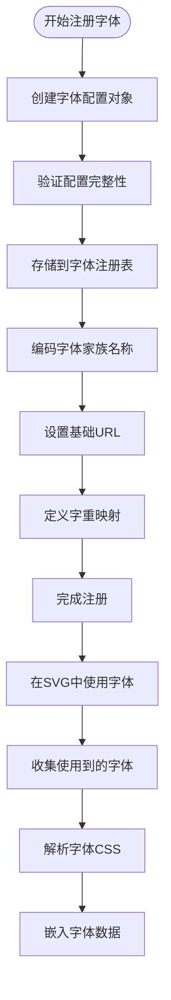
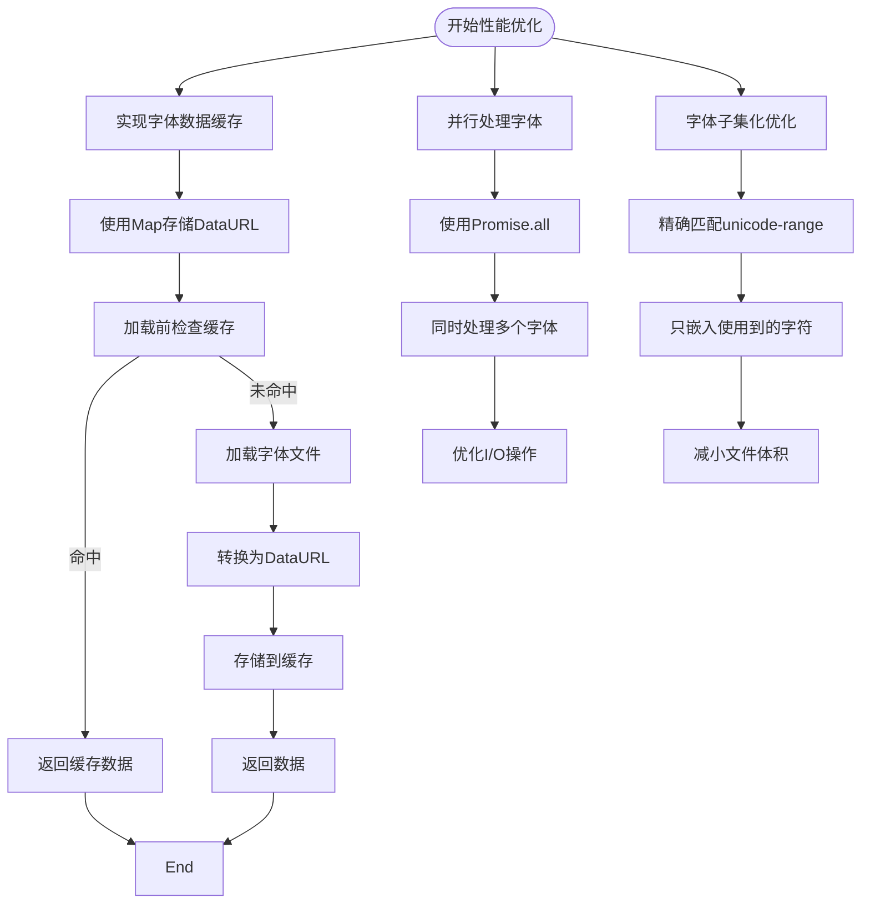

# 字体嵌入处理

<cite>
**本文档引用的文件**  
- [font.ts](file://antv_infographic\infographic\src\exporter\font.ts)
- [registry.ts](file://antv_infographic\infographic\src\renderer\fonts\registry.ts)
- [loader.ts](file://antv_infographic\infographic\src\renderer\fonts\loader.ts)
- [font.ts](file://antv_infographic\infographic\src\utils\font.ts)
- [types.ts](file://antv_infographic\infographic\src\types\font.ts)
- [svg.ts](file://antv_infographic\infographic\src\exporter\svg.ts)
- [font.test.ts](file://antv_infographic\infographic\__tests__\unit\utils\font.test.ts)
</cite>

## 目录
1. [简介](#简介)
2. [字体数据收集与解析](#字体数据收集与解析)
3. [字体序列化与嵌入](#字体序列化与嵌入)
4. [字体子集化技术](#字体子集化技术)
5. [字体加载失败降级处理](#字体加载失败降级处理)
6. [跨平台渲染差异应对](#跨平台渲染差异应对)
7. [自定义字体配置与使用](#自定义字体配置与使用)
8. [性能监控与优化](#性能监控与优化)
9. [总结](#总结)

## 简介

本专项文档系统阐述了 `font.ts` 模块如何确保导出图像中的字体一致性。文档详细说明了字体数据的收集、序列化和嵌入过程，包括对本地字体、Web字体和自定义字体的支持策略。同时解释了字体子集化技术的应用以减小导出文件体积，提供了字体加载失败时的降级处理方案和跨平台字体渲染差异的应对措施。文档还包含实际代码示例展示如何配置和使用自定义字体，以及性能监控和优化建议。

**本节不分析具体源文件，因此不提供来源信息**

## 字体数据收集与解析

字体嵌入处理机制的第一步是收集SVG中实际使用的字体家族。`collectUsedFonts` 函数负责扫描SVG元素，识别所有使用到的 `font-family` 属性值。该函数会检查SVG根元素的 `font-family` 属性，并遍历所有 `foreignObject` 中的 `span` 元素，提取其样式中的字体家族信息。

收集到的字体家族会经过 `decodeFontFamily` 工具函数处理，去除引号等装饰字符，确保字体名称的标准化。随后，系统通过 `parseFontFamily` 函数解析每个字体家族对应的CSS `@font-face` 规则。该函数利用 `getFontURLs` 从字体注册表中获取字体的CSS文件URL，然后通过 `fetch` 请求获取CSS内容，并使用CSS解析器提取 `@font-face` 规则。

**中文处理说明**：系统特别关注中文字体的处理，通过 `decodeFontFamily` 和 `encodeFontFamily` 函数确保包含空格或数字的字体名称能被正确处理和引用。

**字体数据收集流程图**



**图表来源**  
- [font.ts](file://antv_infographic\infographic\src\exporter\font.ts#L93-L113)
- [font.ts](file://antv_infographic\infographic\src\exporter\font.ts#L118-L143)
- [font.ts](file://antv_infographic\infographic\src\utils\font.ts#L3-L12)

**本节来源**  
- [font.ts](file://antv_infographic\infographic\src\exporter\font.ts#L93-L143)
- [font.ts](file://antv_infographic\infographic\src\utils\font.ts#L3-L12)

## 字体序列化与嵌入

在收集和解析完字体数据后，系统进入序列化和嵌入阶段。`embedFonts` 主函数协调整个过程，将字体信息嵌入到SVG中以确保导出的一致性。该过程首先获取文档中实际加载的字体实例（`document.fonts`），然后将这些实例与解析的CSS `@font-face` 规则进行匹配。

系统通过 `normalizeFontFace` 函数将不完整的字体属性补全为标准结构，包括字体家族、源路径、样式、显示策略、字重和Unicode范围等。对于每个匹配成功的字体子集，系统会构建其WOFF2格式的URL，并根据 `embedResources` 参数决定是否将字体数据嵌入为DataURL。

最终，系统通过 `insertFontStyle` 函数创建 `<style>` 元素，将所有 `@font-face` 规则序列化为CSS文本，并插入到SVG的 `<defs>` 元素之后或SVG根元素的第一个子节点之前。插入前会进行去重处理，确保相同字体配置不会重复出现。

**字体嵌入序列图**



**图表来源**  
- [font.ts](file://antv_infographic\infographic\src\exporter\font.ts#L23-L88)
- [font.ts](file://antv_infographic\infographic\src\exporter\font.ts#L200-L246)
- [loader.ts](file://antv_infographic\infographic\src\renderer\fonts\loader.ts#L4-L11)

**本节来源**  
- [font.ts](file://antv_infographic\infographic\src\exporter\font.ts#L23-L246)
- [loader.ts](file://antv_infographic\infographic\src\renderer\fonts\loader.ts#L4-L11)

## 字体子集化技术

字体子集化技术是减小导出文件体积的关键策略。系统通过 `unicode-range` 属性实现智能子集化，只嵌入SVG中实际使用的字符范围。当解析 `@font-face` 规则时，系统会提取其 `unicode-range` 值，并与 `document.fonts` 中已加载的字体实例进行精确匹配。

匹配过程通过 `getActualLoadedFontFace` 函数获取文档中实际加载的字体实例，这些实例包含了浏览器根据实际文本内容自动子集化的信息。系统将CSS规则中的 `unicode-range` 与已加载字体的 `unicodeRange` 属性进行比对，只有完全匹配的字体子集才会被处理和嵌入。

这种基于实际使用情况的子集化策略避免了嵌入完整字体文件，显著减小了导出文件的体积。例如，如果SVG中只使用了中文的常用汉字（U+4E00-U+9FFF），系统只会嵌入这个范围的字形数据，而不是整个中文字体库。

**字体子集化匹配流程**



**图表来源**  
- [font.ts](file://antv_infographic\infographic\src\exporter\font.ts#L33-L52)
- [font.ts](file://antv_infographic\infographic\src\exporter\font.ts#L148-L161)
- [font.ts](file://antv_infographic\infographic\src\exporter\font.ts#L43-L48)

**本节来源**  
- [font.ts](file://antv_infographic\infographic\src\exporter\font.ts#L33-L52)
- [font.ts](file://antv_infographic\infographic\src\exporter\font.ts#L148-L161)

## 字体加载失败降级处理

系统实现了完善的字体加载失败降级处理机制，确保在各种异常情况下仍能提供可用的导出结果。当字体CSS文件无法获取或解析时，系统会捕获异常并记录错误日志，但不会中断整个导出流程。

`parseFontFamily` 函数使用 `Promise.allSettled` 而不是 `Promise.all` 来处理多个字体CSS文件的获取请求。这意味着即使某些字体文件加载失败，其他字体的处理仍能继续进行。失败的请求会被单独处理，系统会记录错误信息但继续执行后续逻辑。

对于无法找到对应子集的字体，系统会直接跳过该 `@font-face` 规则的处理。`getWoff2BaseURL` 函数在无法获取字体基础URL时会返回 `null`，导致该字体不会被嵌入。这种渐进式降级策略确保了核心功能的稳定性，即使部分字体不可用，导出操作仍能完成。

**错误处理流程图**



**图表来源**  
- [font.ts](file://antv_infographic\infographic\src\exporter\font.ts#L123-L140)
- [font.ts](file://antv_infographic\infographic\src\exporter\font.ts#L128-L131)
- [font.ts](file://antv_infographic\infographic\src\exporter\font.ts#L57-L58)

**本节来源**  
- [font.ts](file://antv_infographic\infographic\src\exporter\font.ts#L123-L140)
- [font.ts](file://antv_infographic\infographic\src\exporter\font.ts#L57-L58)

## 跨平台渲染差异应对

为应对跨平台字体渲染差异，系统采用了一系列策略确保导出结果的一致性。首先，通过将字体数据直接嵌入SVG文件，避免了目标平台缺少相应字体导致的渲染问题。嵌入的字体包含完整的 `@font-face` 规则，确保渲染引擎能正确识别和使用字体。

系统还通过 `normalizeFontWeightName` 函数统一处理不同平台和浏览器对字重的命名差异。该函数将各种字重名称（如 "bold"、"700"、"semibold" 等）映射到标准的字重标识符，确保在不同环境中字重渲染的一致性。

对于导出到PowerPoint等不支持 `foreignObject` 的平台，系统提供了 `convertForeignObjectsToText` 函数，将HTML文本元素转换为标准的SVG `<text>` 元素。这种转换确保了在各种SVG查看器中的兼容性，同时保留了原始的字体样式和布局。

**跨平台兼容性处理**



**图表来源**  
- [svg.ts](file://antv_infographic\infographic\src\exporter\svg.ts#L106-L175)
- [font.ts](file://antv_infographic\infographic\src\utils\font.ts#L34-L39)
- [svg.ts](file://antv_infographic\infographic\src\exporter\svg.ts#L23-L24)

**本节来源**  
- [svg.ts](file://antv_infographic\infographic\src\exporter\svg.ts#L106-L175)
- [font.ts](file://antv_infographic\infographic\src\utils\font.ts#L34-L39)

## 自定义字体配置与使用

系统提供了灵活的自定义字体配置机制，通过 `registerFont` 函数允许开发者注册自定义字体。该函数接受一个字体配置对象，包含字体家族、名称、基础URL和不同字重的路径映射。注册后的字体会被存储在全局字体注册表中，供后续的导出操作使用。

```typescript
// 示例：注册自定义字体
registerFont({
  fontFamily: 'Alibaba PuHuiTi',
  name: '阿里巴巴普惠体',
  baseUrl: 'https://assets.antv.antgroup.com/AlibabaPuHuiTi',
  fontWeight: {
    regular: 'Regular/result.css',
    bold: 'Bold/result.css',
    semibold: 'SemiBold/result.css'
  }
});
```

字体配置中的 `baseUrl` 指向字体资源的基础路径，`fontWeight` 映射定义了不同字重对应的CSS文件路径。系统通过 `getWoff2BaseURL` 函数结合字体家族和字重名称，构建出WOFF2字体文件的实际URL。

**自定义字体注册流程**



**图表来源**  
- [registry.ts](file://antv_infographic\infographic\src\renderer\fonts\registry.ts#L39-L44)
- [types.ts](file://antv_infographic\infographic\src\types\font.ts#L13-L20)
- [loader.ts](file://antv_infographic\infographic\src\renderer\fonts\loader.ts#L13-L23)

**本节来源**  
- [registry.ts](file://antv_infographic\infographic\src\renderer\fonts\registry.ts#L39-L44)
- [types.ts](file://antv_infographic\infographic\src\types\font.ts#L13-L20)

## 性能监控与优化

系统实现了多项性能优化措施，确保字体处理过程高效且资源占用合理。首先，通过 `fontDataUrlCache` 缓存机制避免重复加载相同的字体文件。`loadWoff2` 函数在加载字体数据前会先检查缓存，如果已存在则直接返回缓存结果，减少网络请求和文件读取开销。

字体处理采用并行化策略，`Promise.all` 被用于同时处理多个字体的加载和解析，充分利用异步I/O的优势。系统还实现了智能的字体子集化，只嵌入实际使用的字符范围，显著减小了导出文件的体积。

对于大型文档，建议使用性能监控工具跟踪字体处理的耗时和内存使用情况。可以通过监听字体加载事件和测量关键函数的执行时间来识别性能瓶颈。优化建议包括预加载常用字体、合理设置字体缓存大小，以及在不需要字体嵌入的场景中禁用此功能。

**性能优化策略**



**图表来源**  
- [font.ts](file://antv_infographic\infographic\src\exporter\font.ts#L21-L22)
- [font.ts](file://antv_infographic\infographic\src\exporter\font.ts#L251-L273)
- [font.ts](file://antv_infographic\infographic\src\exporter\font.ts#L31-L32)

**本节来源**  
- [font.ts](file://antv_infographic\infographic\src\exporter\font.ts#L21-L273)

## 总结

本文档全面阐述了 `font.ts` 模块的字体嵌入处理机制，从字体数据收集、解析、序列化到最终嵌入的完整流程。系统通过智能的字体子集化技术有效减小了导出文件体积，同时提供了完善的降级处理方案确保在各种异常情况下的稳定性。

跨平台渲染差异的应对策略确保了导出结果在不同环境中的视觉一致性，而灵活的自定义字体配置机制则满足了多样化的设计需求。性能优化措施，包括缓存机制和并行处理，保证了字体处理过程的高效性。

该字体嵌入处理机制为生成高质量、一致性的可视化图表提供了坚实的基础，是确保导出图像保真度的关键组件。

**本节不分析具体源文件，因此不提供来源信息**