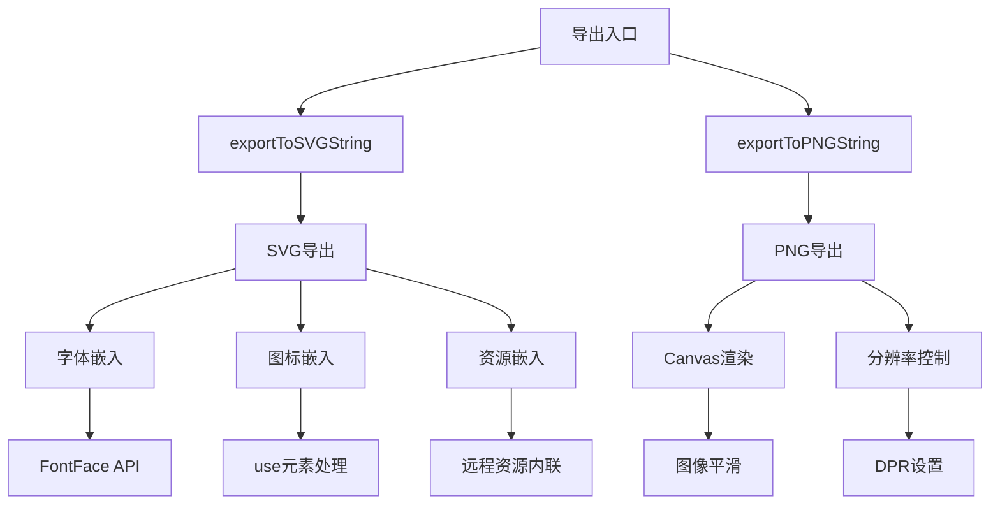
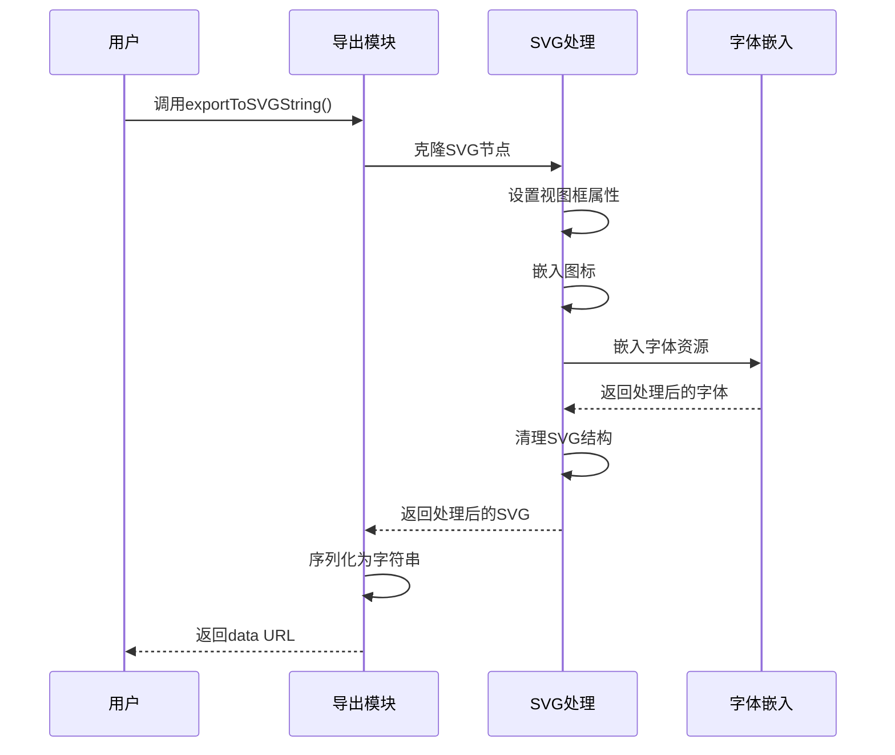
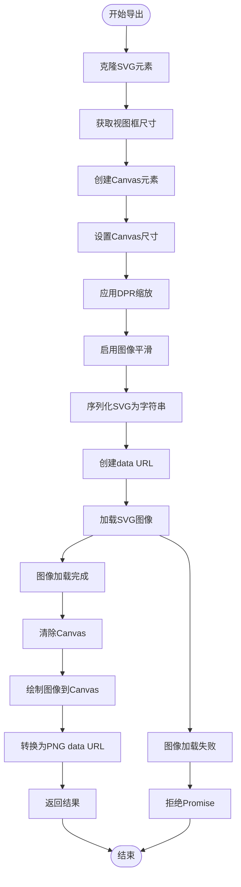
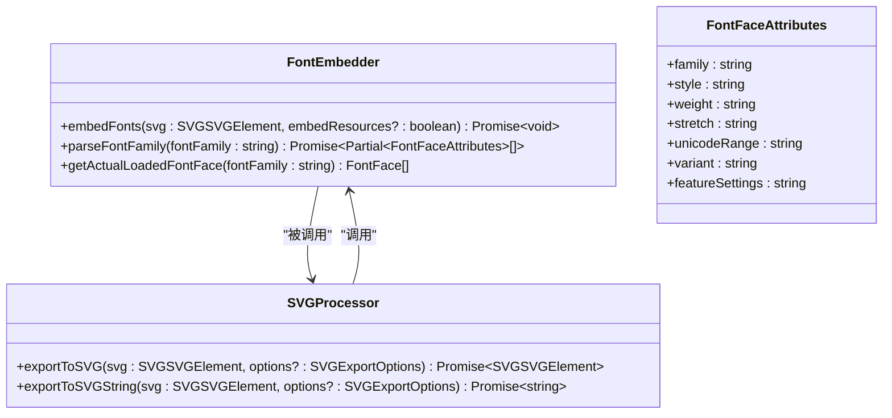
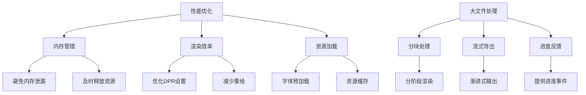

# 导出功能

<cite>
**本文档中引用的文件**  
- [src/exporter/index.ts](file://src/exporter/index.ts)
- [src/exporter/svg.ts](file://src/exporter/svg.ts)
- [src/exporter/png.ts](file://src/exporter/png.ts)
- [src/exporter/font.ts](file://src/exporter/font.ts)
- [src/exporter/types.ts](file://src/exporter/types.ts)
- [src/utils/index.ts](file://src/utils/index.ts)
- [esm/exporter/index.d.ts](file://esm/exporter/index.d.ts)
- [esm/exporter/svg.d.ts](file://esm/exporter/svg.d.ts)
- [esm/exporter/png.d.ts](file://esm/exporter/png.d.ts)
- [esm/exporter/font.d.ts](file://esm/exporter/font.d.ts)
</cite>

## 目录
1. [简介](#简介)
2. [导出功能架构](#导出功能架构)
3. [SVG导出机制](#svg导出机制)
4. [PNG导出流程](#png导出流程)
5. [字体嵌入机制](#字体嵌入机制)
6. [导出配置选项](#导出配置选项)
7. [性能考虑与大文件处理](#性能考虑与大文件处理)
8. [错误处理与质量优化](#错误处理与质量优化)
9. [使用示例](#使用示例)

## 简介
AntV Infographic 提供了强大的多格式导出能力，支持将信息图表导出为 SVG 和 PNG 格式。本文档详细说明了导出功能的实现机制、配置选项和最佳实践，帮助开发者充分利用该功能。

## 导出功能架构



**Diagram sources**
- [src/exporter/index.ts](file://src/exporter/index.ts)
- [src/exporter/svg.ts](file://src/exporter/svg.ts)
- [src/exporter/png.ts](file://src/exporter/png.ts)

**Section sources**
- [src/exporter/index.ts](file://src/exporter/index.ts)
- [esm/exporter/index.d.ts](file://esm/exporter/index.d.ts)

## SVG导出机制

SVG导出模块将渲染树序列化为标准SVG文档，确保导出的SVG文件具有完整的结构和样式信息。



**Diagram sources**
- [src/exporter/svg.ts](file://src/exporter/svg.ts)
- [esm/exporter/svg.d.ts](file://esm/exporter/svg.d.ts)

**Section sources**
- [src/exporter/svg.ts](file://src/exporter/svg.ts)
- [esm/exporter/svg.d.ts](file://esm/exporter/svg.d.ts)

## PNG导出流程

PNG导出功能基于Canvas的渲染转换过程，将SVG内容渲染为高质量的PNG图像。



**Diagram sources**
- [src/exporter/png.ts](file://src/exporter/png.ts)
- [esm/exporter/png.d.ts](file://esm/exporter/png.d.ts)

**Section sources**
- [src/exporter/png.ts](file://src/exporter/png.ts)
- [esm/exporter/png.d.ts](file://esm/exporter/png.d.ts)

## 字体嵌入机制

字体嵌入机制确保导出图像的字体一致性，通过FontFace API获取和嵌入实际加载的字体。



**Diagram sources**
- [src/exporter/font.ts](file://src/exporter/font.ts)
- [esm/exporter/font.d.ts](file://esm/exporter/font.d.ts)

**Section sources**
- [src/exporter/font.ts](file://src/exporter/font.ts)
- [esm/exporter/font.d.ts](file://esm/exporter/font.d.ts)

## 导出配置选项

### SVG导出配置
| 配置项 | 类型 | 默认值 | 描述 |
|-------|------|--------|------|
| type | 'svg' | - | 导出类型 |
| embedResources | boolean | true | 是否将远程资源嵌入到SVG中 |

### PNG导出配置
| 配置项 | 类型 | 默认值 | 描述 |
|-------|------|--------|------|
| type | 'png' | - | 导出类型 |
| dpr | number | devicePixelRatio或2 | 设备像素比，影响导出分辨率 |

**Section sources**
- [src/exporter/types.ts](file://src/exporter/types.ts)
- [esm/exporter/types.d.ts](file://esm/exporter/types.d.ts)

## 性能考虑与大文件处理



**Section sources**
- [src/exporter/png.ts](file://src/exporter/png.ts)
- [src/exporter/svg.ts](file://src/exporter/svg.ts)

## 错误处理与质量优化

### 错误处理策略
- **Canvas上下文获取失败**：检查浏览器是否支持Canvas API
- **图像加载失败**：验证SVG数据的有效性
- **字体嵌入失败**：确保字体已正确加载
- **内存不足**：对于大尺寸图表，建议降低DPR值

### 质量优化建议
1. **图像平滑**：启用`imageSmoothingEnabled`和`imageSmoothingQuality`
2. **DPR设置**：根据目标用途选择合适的设备像素比
3. **字体一致性**：确保所有使用的字体都已正确嵌入
4. **资源内联**：将远程资源嵌入到导出文件中，确保可移植性

**Section sources**
- [src/exporter/png.ts](file://src/exporter/png.ts)
- [src/exporter/font.ts](file://src/exporter/font.ts)

## 使用示例

### SVG导出示例
```typescript
import { exportToSVGString } from '@antv/infographic';

// 导出SVG
const svgDataUrl = await exportToSVGString(svgElement, {
  embedResources: true
});
```

### PNG导出示例
```typescript
import { exportToPNGString } from '@antv/infographic';

// 导出PNG，使用高分辨率
const pngDataUrl = await exportToPNGString(svgElement, {
  dpr: 3 // 高DPR值，适合打印
});
```

**Section sources**
- [src/exporter/index.ts](file://src/exporter/index.ts)
- [src/exporter/svg.ts](file://src/exporter/svg.ts)
- [src/exporter/png.ts](file://src/exporter/png.ts)