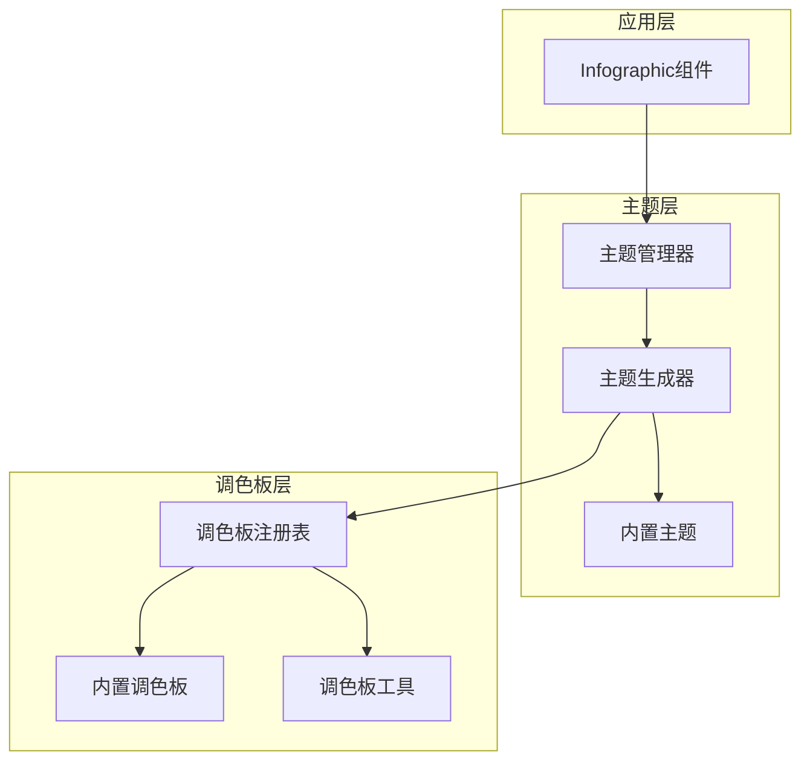
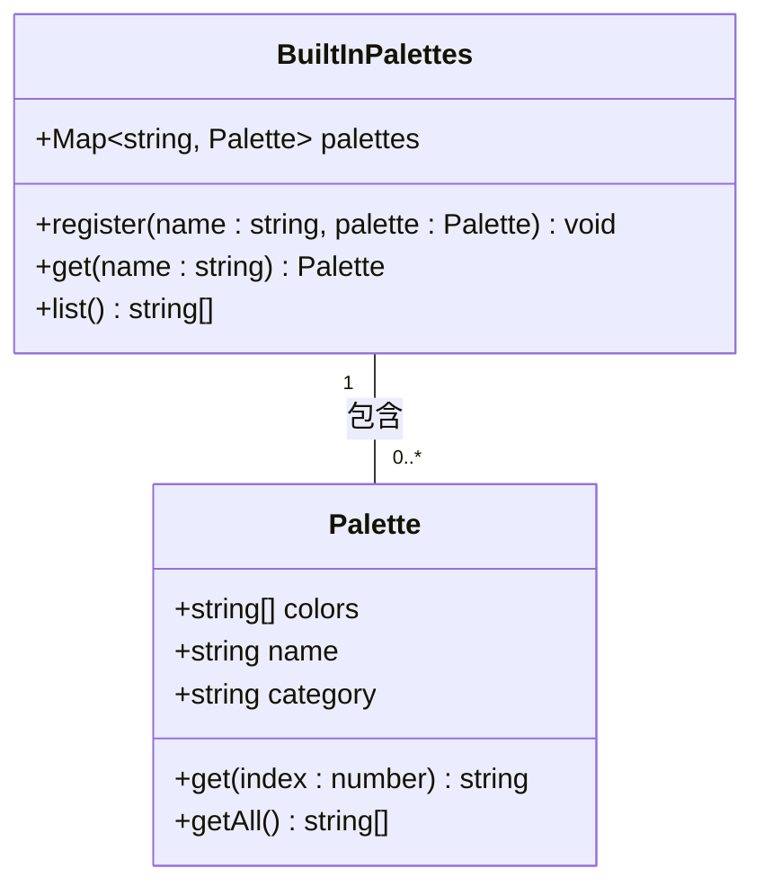
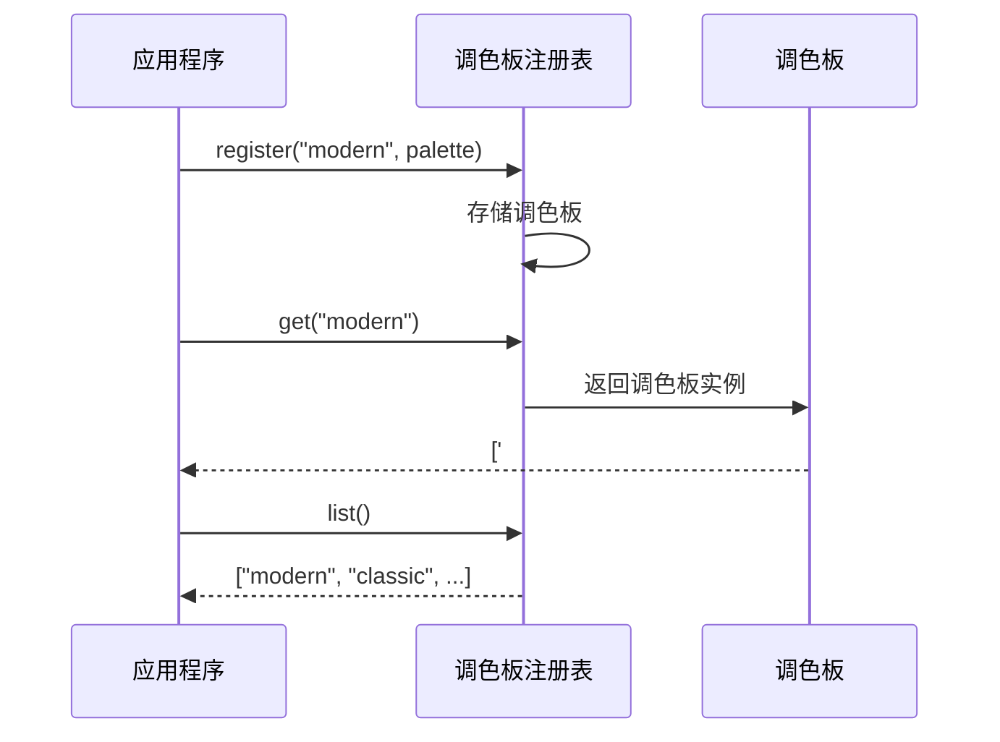
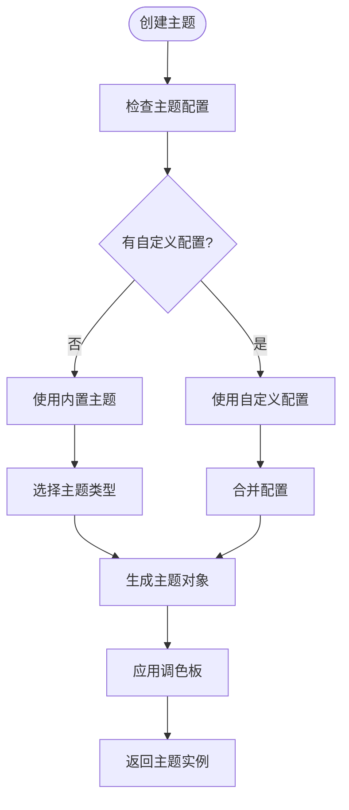
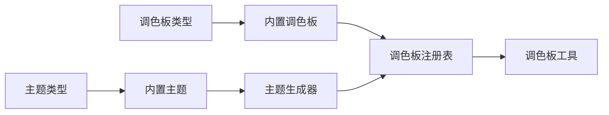

# 主题与调色板系统

<cite>
**本文档中引用的文件**  
- [built-in.ts](file://antv_infographic/infographic/src/themes/built-in.ts)
- [generator.ts](file://antv_infographic/infographic/src/themes/generator.ts)
- [registry.ts](file://antv_infographic/infographic/src/renderer/palettes/registry.ts)
- [built-in.ts](file://antv_infographic/infographic/src/renderer/palettes/built-in.ts)
- [types.ts](file://antv_infographic/infographic/src/themes/types.ts)
- [palette.test.ts](file://antv_infographic/infographic/__tests__/unit/renderer/palette.test.ts)
- [color.test.ts](file://antv_infographic/infographic/__tests__/unit/designs/utils/color.test.ts)
</cite>

## 目录
1. [引言](#引言)
2. [项目结构](#项目结构)
3. [核心组件](#核心组件)
4. [架构概述](#架构概述)
5. [详细组件分析](#详细组件分析)
6. [依赖分析](#依赖分析)
7. [性能考虑](#性能考虑)
8. [故障排除指南](#故障排除指南)
9. [结论](#结论)

## 引言
本文档详细说明了AntV Infographic中主题（themes）和调色板（palettes）的设计与实现。文档解释了内置调色板的色彩搭配原则和分类逻辑，阐述了调色板注册机制如何管理不同风格的配色方案。深入分析了主题系统的结构，包括内置主题的定义方式、主题生成器的工作原理以及主题注册与应用流程。提供了自定义主题和调色板的开发指南，说明了如何通过扩展built-in和registry来添加新的视觉风格。结合代码示例展示了主题切换、调色板继承和动态样式配置的实现方法。

## 项目结构
AntV Infographic项目的主题与调色板系统主要位于`src/themes`和`src/renderer/palettes`目录下。主题系统负责管理整体视觉风格，而调色板系统则专注于色彩方案的定义和管理。

```mermaid
graph TD
subgraph "主题系统"
Themes[themes/]
BuiltInTheme[built-in.ts]
ThemeGenerator[generator.ts]
ThemeRegistry[registry.ts]
ThemeTypes[types.ts]
end
subgraph "调色板系统"
Palettes[palettes/]
BuiltInPalette[built-in.ts]
PaletteRegistry[registry.ts]
PaletteUtils[utils.ts]
PaletteTypes[types.ts]
end
Themes --> Palettes : "依赖"
ThemeGenerator --> BuiltInTheme : "使用"
ThemeGenerator --> PaletteRegistry : "调用"
```

**Diagram sources**
- [built-in.ts](file://antv_infographic/infographic/src/themes/built-in.ts)
- [generator.ts](file://antv_infographic/infographic/src/themes/generator.ts)
- [registry.ts](file://antv_infographic/infographic/src/renderer/palettes/registry.ts)

**Section sources**
- [built-in.ts](file://antv_infographic/infographic/src/themes/built-in.ts)
- [generator.ts](file://antv_infographic/infographic/src/themes/generator.ts)

## 核心组件
主题与调色板系统的核心组件包括内置主题定义、主题生成器、调色板注册表和内置调色板。这些组件共同协作，为Infographic提供灵活的视觉风格管理能力。

**Section sources**
- [built-in.ts](file://antv_infographic/infographic/src/themes/built-in.ts)
- [generator.ts](file://antv_infographic/infographic/src/themes/generator.ts)
- [registry.ts](file://antv_infographic/infographic/src/renderer/palettes/registry.ts)

## 架构概述
主题与调色板系统的架构采用分层设计，上层为主题管理，下层为调色板管理。主题系统通过生成器创建主题实例，而调色板系统则提供色彩方案的注册和检索功能。



**Diagram sources**
- [built-in.ts](file://antv_infographic/infographic/src/themes/built-in.ts)
- [generator.ts](file://antv_infographic/infographic/src/themes/generator.ts)
- [registry.ts](file://antv_infographic/infographic/src/renderer/palettes/registry.ts)

## 详细组件分析

### 内置调色板分析
内置调色板系统定义了多种预设的色彩方案，每种方案都遵循特定的色彩搭配原则。调色板按风格分类，包括现代、经典、商务等类别，每类调色板都有其独特的色彩特征。



**Diagram sources**
- [built-in.ts](file://antv_infographic/infographic/src/renderer/palettes/built-in.ts)
- [types.ts](file://antv_infographic/infographic/src/renderer/palettes/types.ts)

**Section sources**
- [built-in.ts](file://antv_infographic/infographic/src/renderer/palettes/built-in.ts)
- [types.ts](file://antv_infographic/infographic/src/renderer/palettes/types.ts)

### 调色板注册机制分析
调色板注册机制通过注册表模式管理不同风格的配色方案。系统允许动态注册新的调色板，并提供统一的接口来检索和使用已注册的调色板。



**Diagram sources**
- [registry.ts](file://antv_infographic/infographic/src/renderer/palettes/registry.ts)
- [built-in.ts](file://antv_infographic/infographic/src/renderer/palettes/built-in.ts)

**Section sources**
- [registry.ts](file://antv_infographic/infographic/src/renderer/palettes/registry.ts)
- [palette.test.ts](file://antv_infographic/infographic/__tests__/unit/renderer/palette.test.ts)

### 主题系统分析
主题系统采用生成器模式创建主题实例。内置主题定义了多种视觉风格，主题生成器根据配置生成相应的主题对象，包括颜色、字体、间距等样式属性。



**Diagram sources**
- [built-in.ts](file://antv_infographic/infographic/src/themes/built-in.ts)
- [generator.ts](file://antv_infographic/infographic/src/themes/generator.ts)

**Section sources**
- [built-in.ts](file://antv_infographic/infographic/src/themes/built-in.ts)
- [generator.ts](file://antv_infographic/infographic/src/themes/generator.ts)
- [color.test.ts](file://antv_infographic/infographic/__tests__/unit/designs/utils/color.test.ts)

## 依赖分析
主题与调色板系统内部组件之间存在明确的依赖关系。主题系统依赖于调色板系统提供色彩方案，而调色板系统独立运作，为上层提供基础服务。



**Diagram sources**
- [built-in.ts](file://antv_infographic/infographic/src/themes/built-in.ts)
- [generator.ts](file://antv_infographic/infographic/src/themes/generator.ts)
- [registry.ts](file://antv_infographic/infographic/src/renderer/palettes/registry.ts)

**Section sources**
- [built-in.ts](file://antv_infographic/infographic/src/themes/built-in.ts)
- [generator.ts](file://antv_infographic/infographic/src/themes/generator.ts)
- [registry.ts](file://antv_infographic/infographic/src/renderer/palettes/registry.ts)

## 性能考虑
主题与调色板系统在设计时考虑了性能优化。调色板注册表使用Map数据结构实现O(1)时间复杂度的查找操作，主题生成器采用缓存机制避免重复计算。

## 故障排除指南
当主题或调色板无法正常工作时，应检查以下方面：确保调色板名称正确注册，验证主题配置格式是否符合规范，确认主题生成器是否正确初始化。

**Section sources**
- [color.test.ts](file://antv_infographic/infographic/__tests__/unit/designs/utils/color.test.ts)
- [palette.test.ts](file://antv_infographic/infographic/__tests__/unit/renderer/palette.test.ts)

## 结论
AntV Infographic的主题与调色板系统提供了灵活且可扩展的视觉风格管理方案。通过清晰的分层架构和模块化设计，系统支持自定义主题和调色板的开发，满足多样化的可视化需求。