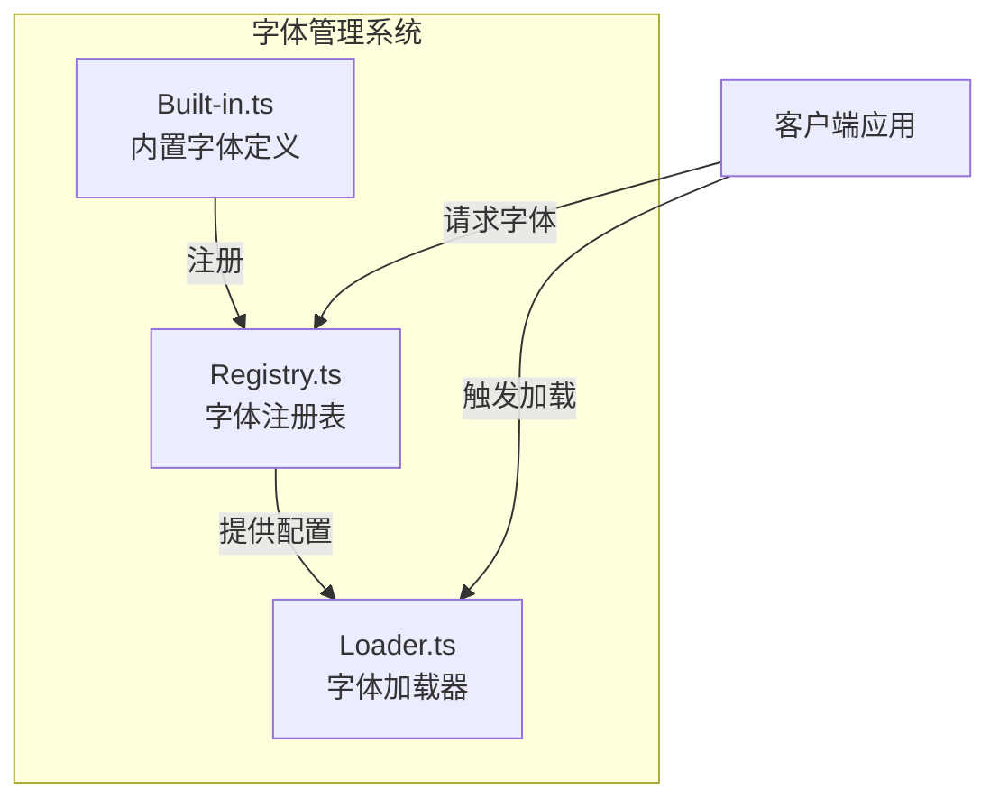
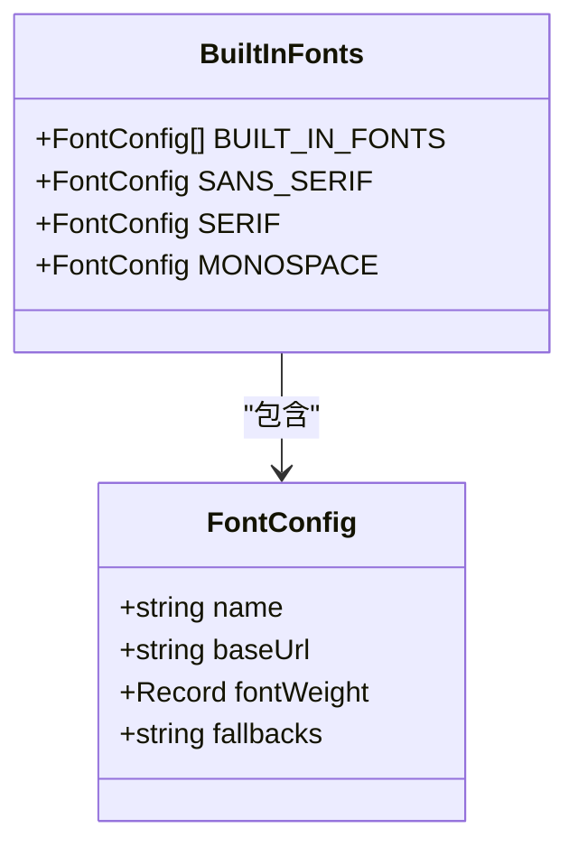
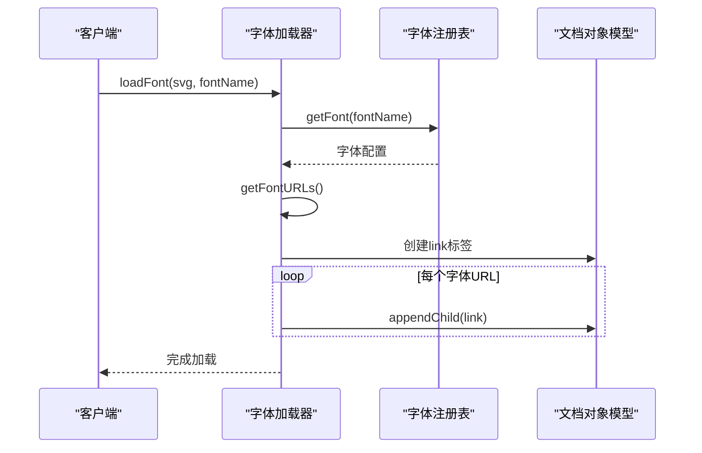
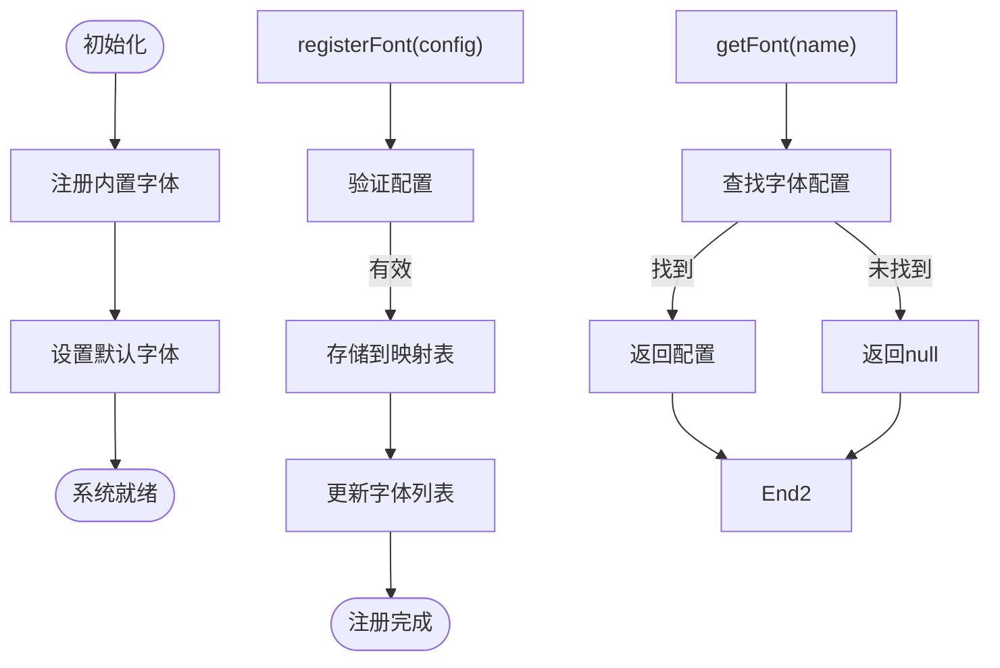
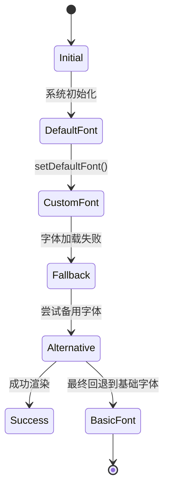

# 字体管理系统

<cite>
**本文档中引用的文件**
- [built-in.ts](file://src/renderer/fonts/built-in.ts)
- [loader.ts](file://src/renderer/fonts/loader.ts)
- [registry.ts](file://src/renderer/fonts/registry.ts)
- [index.ts](file://src/renderer/fonts/index.ts)
- [font.ts](file://src/types/font.ts)
</cite>

## 目录
1. [引言](#引言)
2. [核心组件概览](#核心组件概览)
3. [内置字体系统](#内置字体系统)
4. [字体加载器机制](#字体加载器机制)
5. [字体注册表管理](#字体注册表管理)
6. [自定义字体集成指南](#自定义字体集成指南)
7. [动态字体切换与回退机制](#动态字体切换与回退机制)
8. [结论](#结论)

## 引言
AntV Infographic 提供了一套完整的字体管理系统，用于处理图表中文字的显示效果。该系统通过模块化设计实现了字体的注册、加载和管理功能，支持内置字体和自定义字体的灵活使用。本文档深入解析字体管理系统的架构和实现机制，为开发者提供全面的技术参考。

## 核心组件概览
字体管理系统由三个核心模块组成：内置字体定义、字体加载器和字体注册表。这些模块协同工作，确保字体资源能够被正确加载和使用。

**图示来源**
- [built-in.ts](file://src/renderer/fonts/built-in.ts)
- [loader.ts](file://src/renderer/fonts/loader.ts)
- [registry.ts](file://src/renderer/fonts/registry.ts)

**节来源**
- [index.ts](file://src/renderer/fonts/index.ts#L1-L13)

## 内置字体系统
内置字体系统在模块初始化时自动注册预定义的字体配置。系统通过 `BUILT_IN_FONTS` 常量定义了一系列标准字体，包括中英文字体组合。

**图示来源**
- [built-in.ts](file://src/renderer/fonts/built-in.ts#L1-L50)
- [font.ts](file://src/types/font.ts#L1-L20)

**节来源**
- [built-in.ts](file://src/renderer/fonts/built-in.ts#L1-L100)
- [index.ts](file://src/renderer/fonts/index.ts#L10-L13)

## 字体加载器机制
字体加载器负责从指定URL加载字体资源并将其注入到文档中。加载器采用缓存机制避免重复加载相同的字体资源。

**图示来源**
- [loader.ts](file://src/renderer/fonts/loader.ts#L28-L42)
- [registry.ts](file://src/renderer/fonts/registry.ts#L10-L15)

**节来源**
- [loader.ts](file://src/renderer/fonts/loader.ts#L1-L100)

## 字体注册表管理
字体注册表作为字体系统的中央管理器，负责维护所有已注册字体的配置信息和默认字体设置。

**图示来源**
- [registry.ts](file://src/renderer/fonts/registry.ts#L1-L30)
- [index.ts](file://src/renderer/fonts/index.ts#L2-L8)

**节来源**
- [registry.ts](file://src/renderer/fonts/registry.ts#L1-L50)

## 自定义字体集成指南
要集成自定义字体，开发者需要按照以下步骤操作：

1. **准备字体文件**：将字体文件部署到可访问的服务器位置
2. **定义字体配置**：创建符合 `FontConfig` 接口的配置对象
3. **注册字体**：使用 `registerFont` 方法注册新字体
4. **在组件中使用**：通过字体名称引用已注册的字体

**图示来源**
- [font.ts](file://src/types/font.ts#L1-L20)
- [registry.ts](file://src/renderer/fonts/registry.ts#L6-L7)

**节来源**
- [registry.ts](file://src/renderer/fonts/registry.ts#L6-L15)
- [font.ts](file://src/types/font.ts#L1-L30)

## 动态字体切换与回退机制
系统支持运行时动态切换字体，并通过字体回退机制确保文本始终可显示。

**图示来源**
- [registry.ts](file://src/renderer/fonts/registry.ts#L7-L8)
- [loader.ts](file://src/renderer/fonts/loader.ts#L9-L17)

**节来源**
- [registry.ts](file://src/renderer/fonts/registry.ts#L7-L15)
- [loader.ts](file://src/renderer/fonts/loader.ts#L9-L27)

## 结论
AntV Infographic 的字体管理系统通过清晰的模块划分和合理的API设计，提供了强大而灵活的字体管理能力。系统不仅支持开箱即用的内置字体，还允许开发者轻松集成自定义字体资源。通过理解字体加载、注册和管理的内部机制，开发者可以更好地利用这一系统创建高质量的可视化作品。