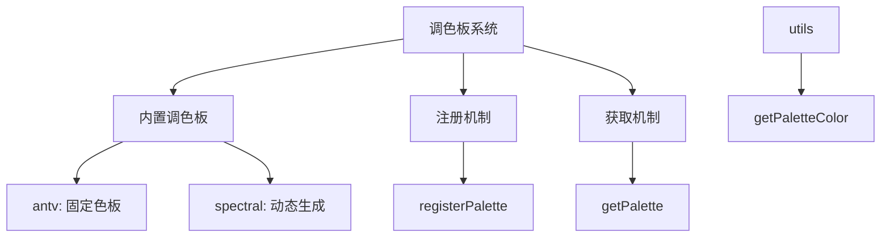
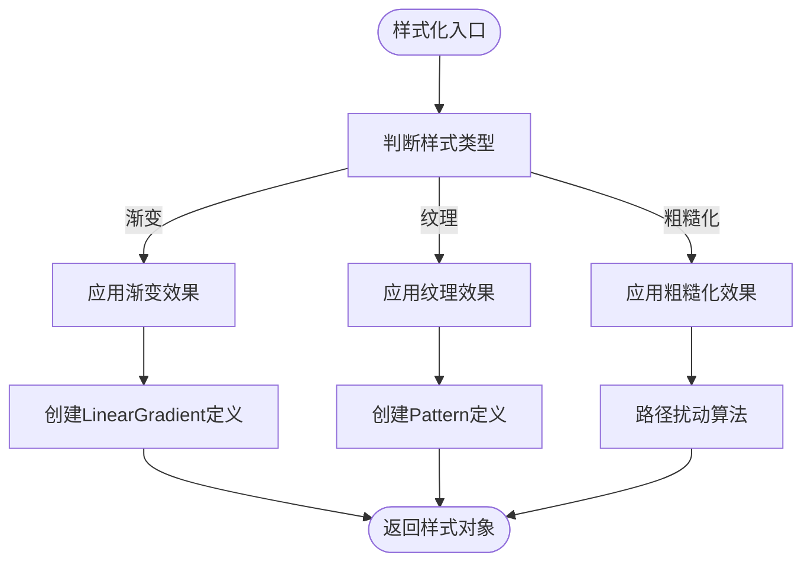
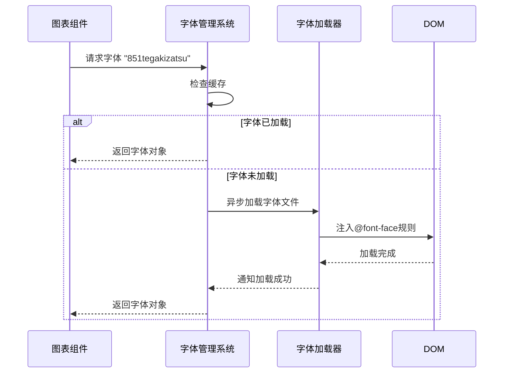

# 样式系统

<cite>
**本文档中引用的文件**  
- [built-in.ts](file://antv_infographic\infographic\src\themes\built-in.ts)
- [generator.ts](file://antv_infographic\infographic\src\themes\generator.ts)
- [types.ts](file://antv_infographic\infographic\src\themes\types.ts)
- [built-in.ts](file://antv_infographic\infographic\src\renderer\palettes\built-in.ts)
- [types.ts](file://antv_infographic\infographic\src\renderer\palettes\types.ts)
- [index.ts](file://antv_infographic\infographic\src\renderer\palettes\index.ts)
- [registry.ts](file://antv_infographic\infographic\src\renderer\palettes\registry.ts)
- [utils.ts](file://antv_infographic\infographic\src\renderer\palettes\utils.ts)
- [index.ts](file://antv_infographic\infographic\src\renderer\stylize\index.ts)
- [gradient.ts](file://antv_infographic\infographic\src\renderer\stylize\gradient.ts)
- [pattern.ts](file://antv_infographic\infographic\src\renderer\stylize\pattern.ts)
- [rough.ts](file://antv_infographic\infographic\src\renderer\stylize\rough.ts)
- [built-in.ts](file://antv_infographic\infographic\src\renderer\fonts\built-in.ts)
- [index.ts](file://antv_infographic\infographic\src\renderer\fonts\index.ts)
- [loader.ts](file://antv_infographic\infographic\src\renderer\fonts\loader.ts)
- [registry.ts](file://antv_infographic\infographic\src\renderer\fonts\registry.ts)
- [color.ts](file://antv_infographic\infographic\src\utils\color.ts)
</cite>

## 目录
1. [简介](#简介)
2. [调色板系统](#调色板系统)
3. [主题系统](#主题系统)
4. [样式化机制](#样式化机制)
5. [字体管理系统](#字体管理系统)
6. [自定义与扩展指南](#自定义与扩展指南)
7. [结论](#结论)

## 简介
AntV Infographic 提供了一套完整的样式系统，用于统一图表的视觉风格。该系统包含调色板、主题、样式化和字体管理四大核心模块，支持从基础色彩配置到复杂视觉效果的全面控制。本文档将深入解析各模块的设计原理与实现机制，为开发者提供定制化开发的完整指导。

## 调色板系统

AntV Infographic 的调色板系统（Palettes）为图表元素提供色彩分配机制，支持静态色板和动态生成两种模式。调色板通过 `registerPalette` 函数注册，并可通过 `getPalette` 函数获取使用。

### 内置调色板实现
系统内置了多种调色板，包括 `antv` 和 `spectral`，分别适用于不同场景：

- **antv 调色板**：固定色彩序列，适用于品牌一致性要求高的场景
- **spectral 调色板**：基于数据维度动态生成，适用于科学可视化

调色板的组织结构遵循模块化设计，通过 `registry.ts` 实现注册与管理机制，`types.ts` 定义了调色板的类型接口，支持字符串、字符串数组和函数三种形式。



**图示来源**
- [built-in.ts](file://antv_infographic\infographic\src\renderer\palettes\built-in.ts)
- [types.ts](file://antv_infographic\infographic\src\renderer\palettes\types.ts)
- [index.ts](file://antv_infographic\infographic\src\renderer\palettes\index.ts)
- [registry.ts](file://antv_infographic\infographic\src\renderer\palettes\registry.ts)
- [utils.ts](file://antv_infographic\infographic\src\renderer\palettes\utils.ts)

**本节来源**
- [built-in.ts](file://antv_infographic\infographic\src\renderer\palettes\built-in.ts)
- [types.ts](file://antv_infographic\infographic\src\renderer\palettes\types.ts)

## 主题系统

主题系统（Themes）是 AntV Infographic 实现整体视觉风格统一的核心机制。通过主题配置，可以集中管理色彩、字体、阴影等视觉属性，实现"一次配置，全局生效"的效果。

### 主题注册与应用
主题通过 `registerTheme` 函数注册，每个主题包含基础样式（base）和样式化配置（stylize）。例如，`dark` 主题定义了深色背景和白色文字，而 `hand-drawn` 主题则配置了手绘风格的字体和粗糙化效果。

### 主题生成机制
系统提供了 `generateThemeColors` 函数，基于种子颜色自动生成完整的主题色彩体系。该机制基于 WCAG 对比度标准，确保文本可读性：
- 使用 `culori` 库进行色彩空间转换（OKLCH 模式）
- 根据背景色自动判断文本颜色（深色/浅色）
- 生成主色、背景色、文字色、次级文字色等衍生色彩

```mermaid
classDiagram
class ThemeGenerator {
+generateThemeColors(seed : ThemeSeed) ThemeColors
+generateTextColor(bgColor, isDarkMode) string
+generatePrimaryBg(primaryColor, isDarkMode) string
+generateSecondaryTextColor(colorText) string
+generatePrimaryTextColor(colorPrimaryBg, isDarkMode) string
+generateElevatedBg(bgColor, isDarkMode) string
}
class ThemeRegistry {
+registerTheme(name : string, theme : Theme) void
+getTheme(name : string) Theme
+getThemes() Record~string, Theme~
}
ThemeGenerator --> ThemeRegistry : "使用"
ThemeGenerator --> "culori" : "依赖"
```

**图示来源**
- [built-in.ts](file://antv_infographic\infographic\src\themes\built-in.ts)
- [generator.ts](file://antv_infographic\infographic\src\themes\generator.ts)
- [types.ts](file://antv_infographic\infographic\src\themes\types.ts)

**本节来源**
- [built-in.ts](file://antv_infographic\infographic\src\themes\built-in.ts)
- [generator.ts](file://antv_infographic\infographic\src\themes\generator.ts)

## 样式化机制

样式化模块（Stylize）提供了丰富的视觉效果实现，包括渐变、纹理和粗糙化等高级渲染技术。

### 渐变效果
`applyGradientStyle` 函数实现线性渐变效果，通过 SVG 的 `<linearGradient>` 元素创建平滑的色彩过渡，适用于背景填充和数据可视化。

### 纹理效果
`applyPatternStyle` 和 `registerPattern` 函数支持自定义纹理的注册与应用。系统预置了多种纹理模式，可通过 `registerPattern` 扩展新的纹理类型。

### 粗糙化效果
`applyRoughStyle` 函数实现手绘风格的粗糙化渲染，通过算法扰动几何路径，产生类似手绘的不规则边缘效果，增强视觉亲和力。



**图示来源**
- [index.ts](file://antv_infographic\infographic\src\renderer\stylize\index.ts)
- [gradient.ts](file://antv_infographic\infographic\src\renderer\stylize\gradient.ts)
- [pattern.ts](file://antv_infographic\infographic\src\renderer\stylize\pattern.ts)
- [rough.ts](file://antv_infographic\infographic\src\renderer\stylize\rough.ts)

**本节来源**
- [index.ts](file://antv_infographic\infographic\src\renderer\stylize\index.ts)

## 字体管理系统

字体管理系统（Fonts）负责自定义字体的加载与管理，确保跨平台一致的文本渲染效果。

### 字体注册机制
系统通过 `registerFont` 函数注册自定义字体，支持多种字体格式。`loader.ts` 实现了异步字体加载逻辑，确保字体资源就绪后再进行渲染。

### 内置字体配置
`built-in.ts` 文件定义了预置字体，如 `hand-drawn` 主题使用的 `851tegakizatsu` 手写字体。字体注册表（registry）统一管理所有已注册字体，提供按需加载能力。



**图示来源**
- [built-in.ts](file://antv_infographic\infographic\src\renderer\fonts\built-in.ts)
- [index.ts](file://antv_infographic\infographic\src\renderer\fonts\index.ts)
- [loader.ts](file://antv_infographic\infographic\src\renderer\fonts\loader.ts)
- [registry.ts](file://antv_infographic\infographic\src\renderer\fonts\registry.ts)

**本节来源**
- [built-in.ts](file://antv_infographic\infographic\src\renderer\fonts\built-in.ts)

## 自定义与扩展指南

### 创建自定义调色板
1. 定义调色板函数或数组
2. 使用 `registerPalette` 注册
3. 在图表配置中引用

```typescript
// 示例：注册自定义调色板
registerPalette('my-palette', ['#FF6B6B', '#4ECDC4', '#45B7D1']);
```

### 扩展样式模式
1. 实现新的样式化函数
2. 注册到样式化系统
3. 在主题中配置使用

```typescript
// 示例：注册自定义纹理
registerPattern('dots', (width, height) => {
  // 实现点状纹理逻辑
});
```

### 主题定制流程
1. 基于 `generateThemeColors` 生成基础主题
2. 调整特定属性（如字体、阴影）
3. 使用 `registerTheme` 注册新主题

**本节来源**
- [generator.ts](file://antv_infographic\infographic\src\themes\generator.ts)
- [registry.ts](file://antv_infographic\infographic\src\themes\registry.ts)
- [color.ts](file://antv_infographic\infographic\src\utils\color.ts)

## 结论
AntV Infographic 的样式系统通过调色板、主题、样式化和字体管理四大模块的协同工作，实现了高度可定制的视觉呈现。系统采用模块化设计，各组件职责清晰，易于扩展。开发者可基于此系统创建符合品牌规范的图表样式，或开发全新的视觉风格。