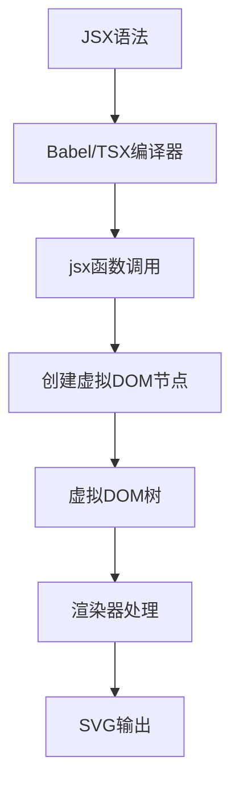
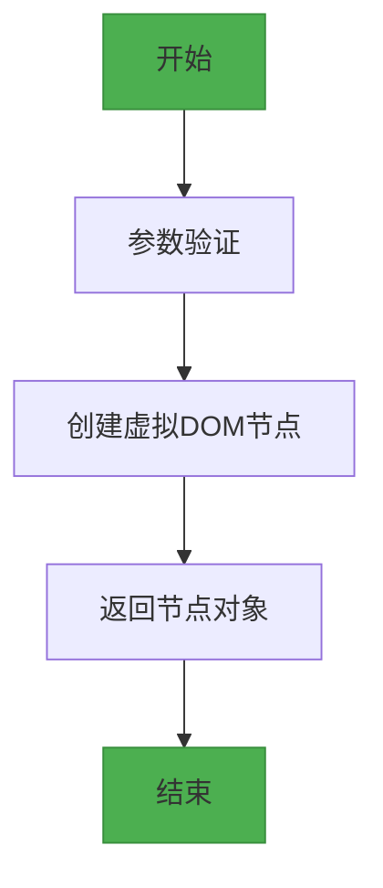
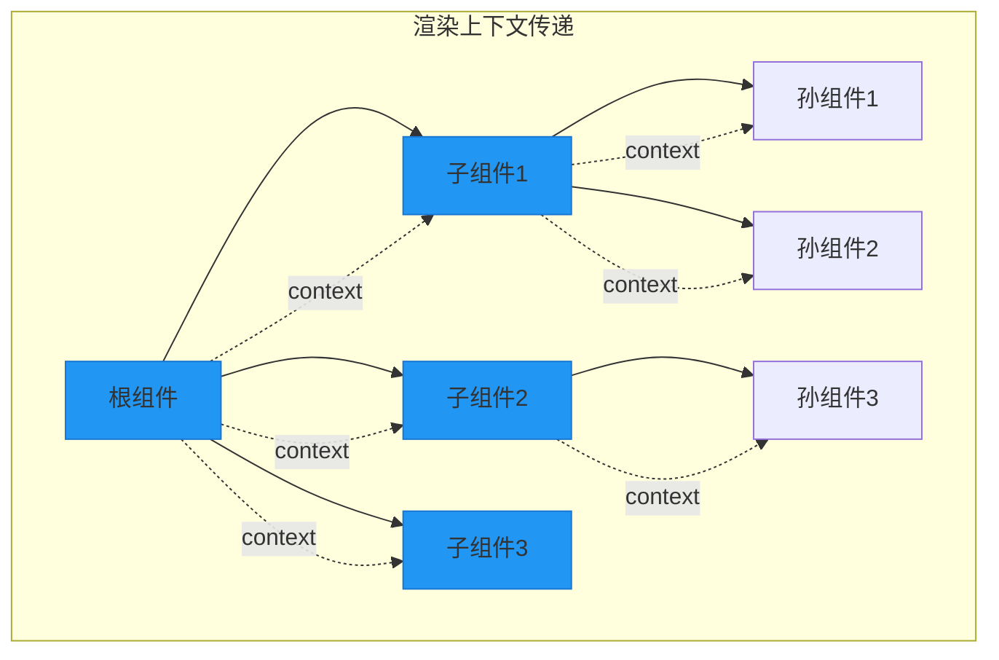
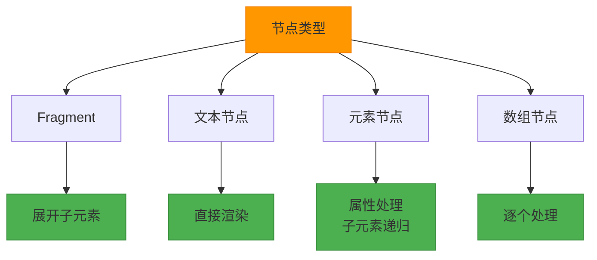
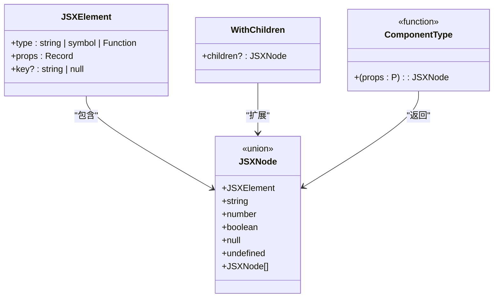

# JSX运行时

<cite>
**本文档引用的文件**
- [jsx-runtime.ts](file://antv_infographic\infographic\src\jsx\jsx-runtime.ts)
- [jsx.ts](file://antv_infographic\infographic\src\jsx\types\jsx.ts)
- [renderer.ts](file://antv_infographic\infographic\src\jsx\renderer.ts)
- [layout.ts](file://antv_infographic\infographic\src\jsx\layout.ts)
- [jsx.test.tsx](file://antv_infographic\infographic\__tests__\unit\jsx\jsx.test.tsx)
</cite>

## 目录
1. [简介](#简介)
2. [JSX转换机制](#jsx转换机制)
3. [createElement函数实现](#createelement函数实现)
4. [渲染上下文传递](#渲染上下文传递)
5. [节点类型处理策略](#节点类型处理策略)
6. [类型安全机制](#类型安全机制)
7. [代码转换示例](#代码转换示例)
8. [总结](#总结)

## 简介
AntV Infographic的JSX运行时提供了一套完整的JSX语法支持机制，将JSX语法转换为虚拟DOM节点，并最终渲染为SVG图形。本文档深入解析其核心机制，包括JSX转换、渲染上下文管理、节点处理策略和类型安全保证。

**文档来源**
- [jsx-runtime.ts](file://antv_infographic\infographic\src\jsx\jsx-runtime.ts)
- [jsx.ts](file://antv_infographic\infographic\src\jsx\types\jsx.ts)

## JSX转换机制
AntV Infographic的JSX转换机制基于标准的JSX编译原理，通过自定义的JSX工厂函数将JSX语法转换为虚拟DOM节点。该机制的核心是`jsx`函数，它接收元素类型、属性和子元素，创建相应的虚拟DOM节点。



**图示来源**
- [jsx-runtime.ts](file://antv_infographic\infographic\src\jsx\jsx-runtime.ts#L5-L17)
- [renderer.ts](file://antv_infographic\infographic\src\jsx\renderer.ts#L17-L65)

## createElement函数实现
`jsx`函数是AntV Infographic JSX运行时的核心，负责将JSX语法转换为虚拟DOM节点。该函数的实现简洁而高效，直接创建包含类型和属性的对象。

### 函数签名
```typescript
function jsx(
  type: string | symbol | ((props?: any) => JSXNode),
  props: Record<string, any> = {}
): JSXElement
```

### 参数处理
- **type参数**: 支持字符串（原生SVG元素）、符号（特殊组件如Fragment）和函数（自定义组件）
- **props参数**: 元素属性对象，默认为空对象
- **返回值**: 符合JSXElement接口的虚拟DOM节点

### 实现细节
`jsx`函数的实现非常直接，仅仅是创建一个包含type和props属性的对象，这种轻量级的实现确保了高性能的JSX转换。



**章节来源**
- [jsx-runtime.ts](file://antv_infographic\infographic\src\jsx\jsx-runtime.ts#L5-L10)
- [jsx.test.tsx](file://antv_infographic\infographic\__tests__\unit\jsx\jsx.test.tsx#L15-L23)

## 渲染上下文传递
渲染上下文（RenderContext）在AntV Infographic的JSX运行时中扮演着重要角色，用于在渲染过程中传递共享状态和配置信息。

### 上下文结构
渲染上下文包含以下关键属性：
- **defs**: 存储SVG定义（如渐变、阴影等）的Map
- **布局信息**: 用于布局计算的上下文数据
- **样式配置**: 全局样式设置

### 作用域管理
上下文通过递归传递的方式在组件树中传播，确保每个组件都能访问到必要的渲染信息。在布局处理和组件扩展过程中，上下文被作为参数传递。



**图示来源**
- [renderer.ts](file://antv_infographic\infographic\src\jsx\renderer.ts#L116-L117)
- [layout.ts](file://antv_infographic\infographic\src\jsx\layout.ts#L41-L42)

## 节点类型处理策略
AntV Infographic的JSX运行时对不同类型的节点采用差异化的处理策略，确保各种JSX语法结构都能正确转换和渲染。

### Fragment处理
Fragment使用Symbol作为类型标识，允许在不创建额外DOM节点的情况下对子元素进行分组。

```typescript
export const Fragment = Symbol.for('@antv/infographic/Fragment');
```

在渲染过程中，Fragment节点会被展开，其子元素直接插入到父节点中。

### 文本节点处理
文本节点（字符串和数字）被直接作为叶节点处理，在渲染时转换为相应的文本内容。

### 元素节点处理
元素节点包含类型和属性，经过预处理阶段的组件扩展和布局计算后，最终渲染为SVG元素。



**章节来源**
- [jsx-runtime.ts](file://antv_infographic\infographic\src\jsx\jsx-runtime.ts#L3-L14)
- [renderer.ts](file://antv_infographic\infographic\src\jsx\renderer.ts#L17-L65)
- [jsx.test.tsx](file://antv_infographic\infographic\__tests__\unit\jsx\jsx.test.tsx#L84-L98)

## 类型安全机制
AntV Infographic通过TypeScript的类型系统确保JSX属性的类型安全，提供完整的类型定义和接口约束。

### 核心类型定义
```typescript
interface JSXElement {
  type: string | symbol | ((props?: any) => JSXNode);
  props: Record<string, any>;
  key?: string | null;
}

type JSXNode = 
  | JSXElement 
  | string 
  | number 
  | boolean 
  | null 
  | undefined 
  | JSXNode[];
```

### 类型约束
- **JSXElement**: 定义虚拟DOM节点的结构
- **JSXNode**: 联合类型，支持多种节点形式
- **WithChildren**: 带子元素的组件类型
- **ComponentType**: 组件构造函数类型

这些类型定义确保了JSX语法在编译时的类型安全，防止了属性类型错误和无效的JSX结构。



**图示来源**
- [jsx.ts](file://antv_infographic\infographic\src\jsx\types\jsx.ts#L1-L25)
- [jsx-runtime.ts](file://antv_infographic\infographic\src\jsx\jsx-runtime.ts)

## 代码转换示例
以下示例展示了JSX语法到运行时函数调用的转换过程。

### 简单元素转换
```jsx
// JSX语法
<Rect width={100} height={100} fill="red" />

// 转换为
jsx(Rect, { width: 100, height: 100, fill: "red" })
```

### 带子元素的转换
```jsx
// JSX语法
<Group>
  <Rect width={100} height={100} fill="red" />
  <Ellipse width={100} height={100} fill="blue" />
</Group>

// 转换为
jsx(Group, {
  children: [
    jsx(Rect, { width: 100, height: 100, fill: "red" }),
    jsx(Ellipse, { width: 100, height: 100, fill: "blue" })
  ]
})
```

### Fragment转换
```jsx
// JSX语法
<>
  <Rect width={50} height={50} fill="red" />
  <Ellipse x={60} width={50} height={50} fill="blue" />
</>

// 转换为
createFragment({
  children: [
    jsx(Rect, { width: 50, height: 50, fill: "red" }),
    jsx(Ellipse, { x: 60, width: 50, height: 50, fill: "blue" })
  ]
})
```

### 条件渲染
```jsx
// JSX语法
<Group>
  <Rect width={50} height={50} fill="red" />
  {showEllipse && <Ellipse x={60} width={50} height={50} fill="blue" />}
</Group>

// 转换为
jsx(Group, {
  children: [
    jsx(Rect, { width: 50, height: 50, fill: "red" }),
    showEllipse && jsx(Ellipse, { x: 60, width: 50, height: 50, fill: "blue" })
  ]
})
```

**章节来源**
- [jsx.test.tsx](file://antv_infographic\infographic\__tests__\unit\jsx\jsx.test.tsx)
- [jsx-runtime.ts](file://antv_infographic\infographic\src\jsx\jsx-runtime.ts)

## 总结
AntV Infographic的JSX运行时通过简洁而高效的机制实现了JSX到虚拟DOM的转换。其核心特点包括：

1. **轻量级实现**: `jsx`函数仅创建简单的对象，避免了复杂的处理逻辑
2. **完整的JSX支持**: 支持元素、Fragment、文本节点等各种JSX语法
3. **类型安全**: 通过TypeScript类型系统确保编译时的类型正确性
4. **灵活的扩展性**: 支持自定义组件和布局组件
5. **高效的渲染**: 通过预处理和上下文传递优化渲染性能

这套JSX运行时机制为AntV Infographic提供了声明式的图形描述能力，使开发者能够以类似React的方式构建复杂的SVG图形。

**章节来源**
- [jsx-runtime.ts](file://antv_infographic\infographic\src\jsx\jsx-runtime.ts)
- [renderer.ts](file://antv_infographic\infographic\src\jsx\renderer.ts)
- [jsx.test.tsx](file://antv_infographic\infographic\__tests__\unit\jsx\jsx.test.tsx)